# 深度学习：第一部分第一课

### [第1课](http://forums.fast.ai/t/wiki-lesson-1/9398/1)

#### 入门[ [0:00](https://youtu.be/IPBSB1HLNLo) ]：

*   为了训练神经网络，你肯定需要图形处理单元（GPU） - 特别是NVIDIA GPU，因为它是唯一支持CUDA（几乎所有深度学习图书馆和从业者都使用的语言和框架）的人。
*   租用GPU有几种方法：Crestle [04:06]，Paperspace [ [06:10](https://youtu.be/IPBSB1HLNLo%3Ft%3D6m10s) ]

#### [Jupyter笔记本和狗与猫的介绍](https://github.com/fastai/fastai/blob/master/courses/dl1/lesson1.ipynb) [ [12:39](https://youtu.be/IPBSB1HLNLo%3Ft%3D12m39s) ]

*   您可以通过选择它并按下`shift+enter`来运行单元格（您可以按住`shift`并多次按`enter`键以继续按下单元格），或者您可以单击顶部的“运行”按钮。 单元格可以包含代码，文本，图片，视频等。
*   Fast.ai需要Python 3

```py
%reload_ext autoreload  
%autoreload 2  
%matplotlib inline 
```

```py
# This file contains all the main external libs we'll use  
from fastai.imports import * 
```

```py
from fastai.transforms import *  
from fastai.conv_learner import *  
from fastai.model import *  
from fastai.dataset import *  
from fastai.sgdr import *  
from fastai.plots import * 
```

```py
PATH = "data/dogscats/"  
sz=224 
```

**先看图片[** [**15:39**](https://youtu.be/IPBSB1HLNLo%3Ft%3D15m40s) **]**

```py
!ls {PATH} 
```

```
models sample test1 tmp train valid
```

*   `!` 告诉使用bash（shell）而不是python
*   如果您不熟悉训练集和验证集，请查看Practical Machine Learning课程（或阅读[Rachel的博客](http://www.fast.ai/2017/11/13/validation-sets/) ）

```py
!ls {PATH}valid 
```

```
cats dogs
```

```py
files = !ls {PATH}valid/cats | head  files 
```

```py
['cat.10016.jpg',  'cat.1001.jpg',  'cat.10026.jpg',  'cat.10048.jpg',  'cat.10050.jpg',  'cat.10064.jpg',  'cat.10071.jpg',  'cat.10091.jpg',  'cat.10103.jpg',  'cat.10104.jpg'] 
```

*   此文件夹结构是共享和提供图像分类数据集的最常用方法。 每个文件夹都会告诉您标签（例如`dogs`或`cats` ）。

```py
img = plt.imread(f' {PATH} valid/cats/ {files[0]} ')  plt.imshow(img); 
```

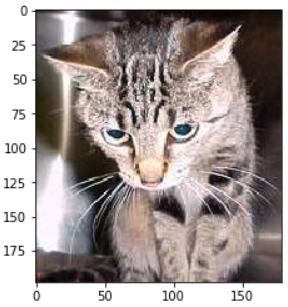

*   `f'{PATH}valid/cats/{files[0]}'` - 这是一个Python 3.6。 格式化字符串，可以方便地格式化字符串。

```py
img.shape 
```

```py
(198, 179, 3)
```

```py
img[:4,:4] 
```

```py
array([[[ 29, 20, 23],  [ 31, 22, 25],  [ 34, 25, 28],  [ 37, 28, 31]], 
```

```py
[[ 60, 51, 54],  [ 58, 49, 52],  [ 56, 47, 50],  [ 55, 46, 49]], 
```

```py
[[ 93, 84, 87],  [ 89, 80, 83],  [ 85, 76, 79],  [ 81, 72, 75]], 
```

```py
[[104, 95, 98],  [103, 94, 97],  [102, 93, 96],  [102, 93, 96]]], dtype=uint8) 
```

*   `img`是一个三维数组（又名3级张量）
*   这三个项目（例如`[29, 20, 23]` ）表示0到255之间的红绿蓝像素值
*   我们的想法是利用这些数字并用它们来预测这些数字是代表猫还是狗，这是基于查看猫和狗的大量图片。
*   这个数据集来自[Kaggle竞赛](https://www.kaggle.com/c/dogs-vs-cats) ，当它发布时（早在2013年），最先进的技术准确率为80％。

**让我们训练一个模型[** [**20:21**](https://youtu.be/IPBSB1HLNLo%3Ft%3D20m21s) **]**

以下是训练模型所需的三行代码：

```py
data = ImageClassifierData.from_paths(PATH, tfms=tfms_from_model(resnet34, sz))  
learn = ConvLearner.pretrained(resnet34, data, precompute= True )  
learn.fit (0.01, 3) 
```

```py
[ 0. 0.04955 0.02605 0.98975]  [ 1. 0.03977 0.02916 0.99219]  [ 2. 0.03372 0.02929 0.98975] 
```

*   这将做3个**时期** ，这意味着它将三次查看整个图像集。
*   输出中的三个数字中的最后一个是验证集上的准确度。
*   前两个是训练集和验证集的损失函数值（在这种情况下是交叉熵损失）。
*   开始（例如， `1.` ）是纪元号。
*   我们通过3行代码在17秒内达到了~99％（这将在2013年赢得Kaggle比赛）！ [ [21:49](https://youtu.be/IPBSB1HLNLo%3Ft%3D21m49s) ]
*   很多人都认为深度学习需要大量的时间，大量的资源和大量的数据 - 一般来说，这不是真的！

#### Fast.ai图书馆[ [22:24](https://youtu.be/IPBSB1HLNLo%3Ft%3D22m24s) ]

*   该库采用了他们可以找到的所有最佳实践和方法 - 每次出现看起来很有趣的论文时，他们会对其进行测试，如果它适用于各种数据集，并且他们可以弄清楚如何调整它，它会得到它在库中实现它。
*   Fast.ai策划所有这些最佳实践并为您打包，并且大部分时间都会找出自动处理事物的最佳方法。
*   Fast.ai位于名为PyTorch的库之上，这是一个非常灵活的深度学习，机器学习和由Facebook编写的GPU计算库。
*   大多数人比PyTorch更熟悉TensorFlow，但Jeremy现在知道的大多数顶级研究人员已经转向PyTorch。
*   Fast.ai非常灵活，您可以根据需要尽可能多地使用所有这些策划的最佳实践。 在任何时候都很容易挂钩并编写自己的数据增强，丢失功能，网络架构等，我们将在本课程中学习所有内容。

#### 分析结果[ [24:21](https://youtu.be/IPBSB1HLNLo%3Ft%3D24m12s) ]

这就是验证数据集标签（将其视为正确答案）的样子：

```py
data.val_y 
```

```py
array([0, 0, 0, ..., 1, 1, 1]) 
```

这些0和1代表什么？

```py
data.classes 
```

```py
['cats', 'dogs'] 
```

*   `data`包含验证和训练数据
*   `learn`包含模型

让我们对验证集进行预测（预测是以对数比例）：

```py
log_preds = learn.predict()  
log_preds.shape 
```

```py
(2000, 2)
```

```py
log_preds[:10] 
```

```py
array([[ -0.00002, -11.07446],  [ -0.00138, -6.58385],  [ -0.00083, -7.09025],  [ -0.00029, -8.13645],  [ -0.00035, -7.9663 ],  [ -0.00029, -8.15125],  [ -0.00002, -10.82139],  [ -0.00003, -10.33846],  [ -0.00323, -5.73731],  [ -0.0001 , -9.21326]], dtype=float32) 
```

*   输出表示猫的预测和狗的预测

```py
preds = np.argmax(logpreds, axis=1) 
# from log probabilities to 0 or 1  
probs = np.exp(logpreds[:,1]) 
# pr(dog) 
```

*   在PyTorch和Fast.ai中，大多数模型返回预测的对数而不是概率本身（我们将在后面的课程中了解原因）。 现在，只知道要获得概率，你必须做`np.exp()`

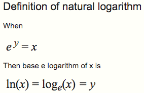

*   确保你熟悉numpy（ `np` ）

```py
# 1. A few correct labels at random 
plo_tval_with_title(rand_by_correct( **True** ), "Correctly classified") 
```

*   图像上方的数字是成为狗的概率

```py
# 2. A few incorrect labels at random  
plot_val_with_title(rand_by_correct( **False** ), "Incorrectly classified") 
```


```py
plot_val_with_title(most_by_correct(0, True ), "Most correct cats") 
```


```py
plot_val_with_title(most_by_correct(1, True ), "Most correct dogs") 
```


更有趣的是，这里的模型认为它绝对是一只狗，但结果却是一只猫，反之亦然：

```py
plot_val_with_title(most_by_correct(0, False ), "Most incorrect cats") 
```


```py
plot_val_with_title(most_by_correct(1, False ), "Most incorrect dogs") 
```


```py
most_uncertain = np.argsort(np.abs(probs -0.5))[:4]  
plot_val_with_title(most_uncertain, "Most uncertain predictions") 
```


*   为什么看这些图像很重要？ Jeremy在构建模型后所做的第一件事就是找到一种可视化其构建方式的方法。 因为如果他想让模型变得更好，那么他需要利用做得好的事情来解决那些做得很糟糕的事情。
*   在这种情况下，我们已经了解了有关数据集本身的一些信息，即这里有一些可能不应该存在的图像。 但同样清楚的是，这种模式还有改进的余地（例如数据增强 - 我们将在后面介绍）。
*   现在您已准备好构建自己的图像分类器（对于常规照片 - 可能不是CT扫描）！ 例如， [这](https://towardsdatascience.com/fun-with-small-image-data-sets-8c83d95d0159)是其中一个学生所做的。
*   查看[此论坛帖子](http://forums.fast.ai/t/understanding-softmax-probabilities-output-on-a-multi-class-classification-problem/8194) ，了解可视化结果的不同方式（例如，当有超过2个类别时等）

#### 自上而下与自下而上[ [30:52](https://youtu.be/IPBSB1HLNLo%3Ft%3D30m52s) ]

自下而上：了解您需要的每个构建块，并最终将它们组合在一起

*   很难保持动力
*   很难知道“大局”
*   很难知道你真正需要哪些作品

fast.ai：让学生立即使用神经网络，尽快获得结果

*   逐渐剥离层，修改，看看引擎盖下

#### 课程结构[ [33:53](https://youtu.be/IPBSB1HLNLo%3Ft%3D33m53s) ]

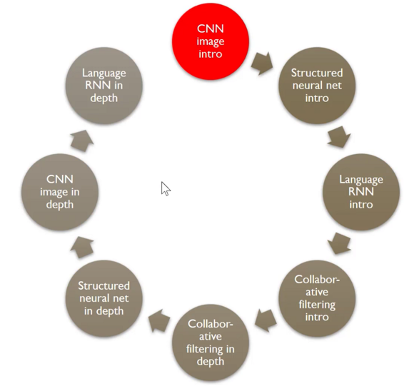

1.  深度学习的图像分类器（代码最少）
2.  多标签分类和不同类型的图像（例如卫星图像）
3.  结构化数据（例如销售预测） - 结构化数据来自数据库或电子表格
4.  语言：NLP分类器（例如电影评论分类）
5.  协同过滤（例如推荐引擎）
6.  生成语言模型：如何从头开始逐字逐句地编写自己的尼采哲学
7.  回到计算机视觉 - 不只是识别猫照片，而是找到猫在照片中的位置（热图），还学习如何从头开始编写我们自己的架构（ResNet）

#### 图像分类器示例：

图像分类算法对很多东西很有用。

*   例如，AlphaGo [ [42:20](https://youtu.be/IPBSB1HLNLo%3Ft%3D42m20s) ]看了成千上万的棋盘，每个人都有一个标签，说明棋盘是否最终成为赢球或输球球员。 因此，它学会了一种图像分类，能够看到一块棋盘，并弄清楚它是好还是坏 - 这是玩得好的最重要的一步：知道哪个动作更好。
*   另一个例子是早期的学生创建[了鼠标移动图像](https://www.splunk.com/blog/2017/04/18/deep-learning-with-splunk-and-tensorflow-for-security-catching-the-fraudster-in-neural-networks-with-behavioral-biometrics.html)和检测到的欺诈性交易[的图像分类器](https://www.splunk.com/blog/2017/04/18/deep-learning-with-splunk-and-tensorflow-for-security-catching-the-fraudster-in-neural-networks-with-behavioral-biometrics.html) 。

#### 深度学习≠机器学习[ [44:26](https://youtu.be/IPBSB1HLNLo%3Ft%3D44m26s) ]

*   深度学习是一种机器学习
*   机器学习是由Arthur Samuel发明的。 在50年代后期，他通过发明机器学习，得到了一台IBM大型机，可以更好地玩跳棋。 他让大型机多次与自己对抗并弄清楚哪种东西能够取得胜利，并在某种程度上用它来编写自己的程序。 1962年，亚瑟·塞缪尔说，有一天，绝大多数计算机软件将使用这种机器学习方法而不是手工编写。
*   C-Path（计算病理学家）[ [45:42](https://youtu.be/IPBSB1HLNLo%3Ft%3D45m42s) ]是传统机器学习方法的一个例子。 他拍摄了乳腺癌活组织检查的病理学幻灯片，咨询了许多病理学家关于哪些类型的模式或特征可能与长期生存相关的想法。 然后他们编写专家算法来计算这些特征，通过逻辑回归进行运算，并预测存活率。 它的表现优于病理学家，但是领域专家和计算机专家需要多年的工作才能建立起来。

#### 更好的方式[ [47:35](https://youtu.be/IPBSB1HLNLo%3Ft%3D47m35s) ]

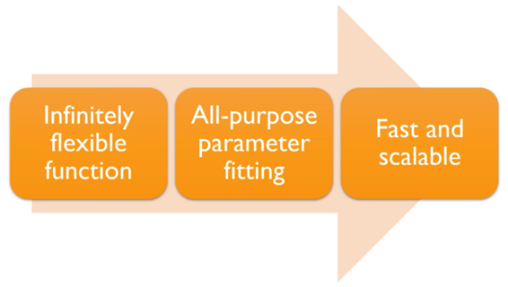

*   具有这三个属性的一类算法是深度学习。

#### 无限灵活的功能：神经网络[ [48:43](https://youtu.be/IPBSB1HLNLo%3Ft%3D48m43s) ]

深度学习使用的基础功能称为神经网络：

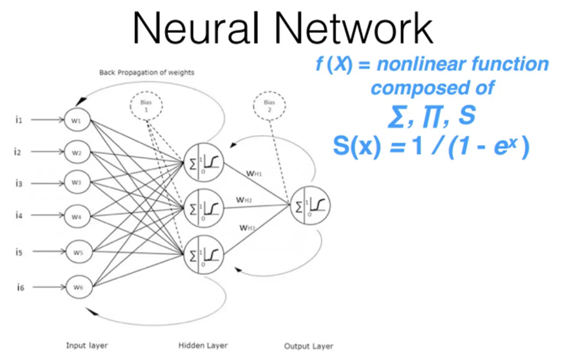

*   您现在需要知道的是，它由许多简单的线性层组成，其中散布着许多简单的非线性层。 当你散布这些层时，你会得到一种称为通用逼近定理的东西。 通用近似定理所说的是，只要添加足够的参数，这种函数就可以解决任何给定的问题，任意精度。

#### 通用参数拟合：梯度下降[ [49:39](https://youtu.be/IPBSB1HLNLo%3Ft%3D49m39s) ]

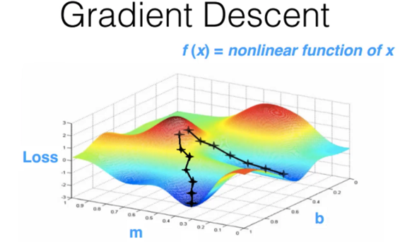

#### 快速且可扩展：GPU [ [51:05](https://youtu.be/IPBSB1HLNLo%3Ft%3D51m5s) ]

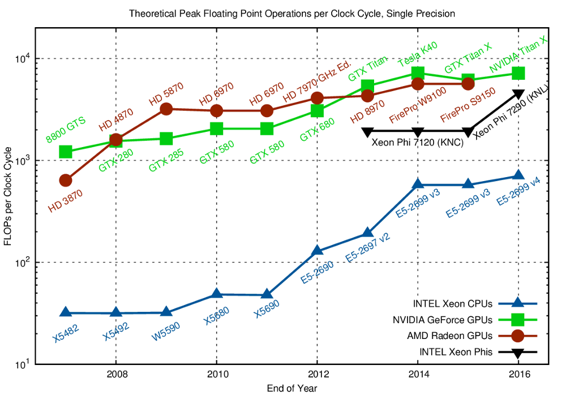

上面显示的神经网络示例具有一个隐藏层。 我们在过去几年中学到的东西是这些神经网络不是快速或可扩展的，除非我们添加了多个隐藏层 - 因此称为“深度”学习。

#### 全部放在一起[ [53:40](https://youtu.be/IPBSB1HLNLo%3Ft%3D53m40s) ]

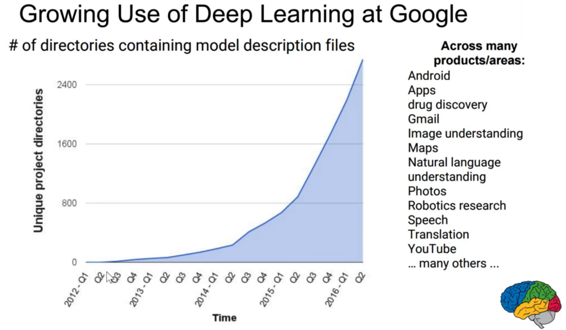

以下是一些示例：

*   [https://research.googleblog.com/2015/11/computer-respond-to-this-email.html](https://research.googleblog.com/2015/11/computer-respond-to-this-email.html)
*   [https://deepmind.com/blog/deepmind-ai-reduces-google-data-centre-cooling-bill-40/](https://deepmind.com/blog/deepmind-ai-reduces-google-data-centre-cooling-bill-40/)
*   [https://www.skype.com/en/features/skype-translator/](https://www.skype.com/en/features/skype-translator/)
*   [https://arxiv.org/abs/1603.01768](https://arxiv.org/abs/1603.01768)

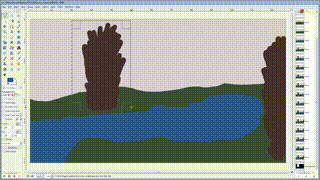

#### 诊断肺癌[ [56:55](https://youtu.be/IPBSB1HLNLo%3Ft%3D56m55s) ]

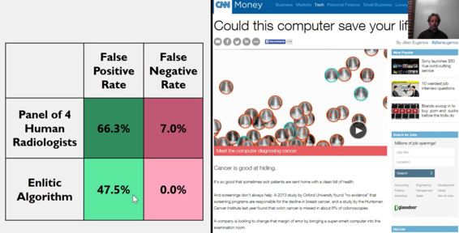

其他目前的应用：


### 卷积神经网络[ [59:13](https://youtu.be/IPBSB1HLNLo%3Ft%3D59m13s) ]

#### 线性层

[http://setosa.io/ev/image-kernels/](http://setosa.io/ev/image-kernels/)

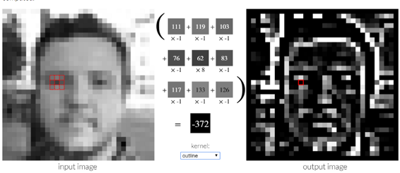

#### 非线性层[ [01:02:12](https://youtu.be/IPBSB1HLNLo%3Ft%3D1h2m12s) ]

[**神经网络和深度学习**](http://neuralnetworksanddeeplearning.com/chap4.html "http://neuralnetworksanddeeplearning.com/chap4.html")[
](http://neuralnetworksanddeeplearning.com/chap4.html "http://neuralnetworksanddeeplearning.com/chap4.html")[_在本章中，我给出了普遍性定理的简单且大部分的视觉解释。_](http://neuralnetworksanddeeplearning.com/chap4.html "http://neuralnetworksanddeeplearning.com/chap4.html") [_我们将一步一步地进行..._ neuralnetworksanddeeplearning.com](http://neuralnetworksanddeeplearning.com/chap4.html "http://neuralnetworksanddeeplearning.com/chap4.html")[](http://neuralnetworksanddeeplearning.com/chap4.html)

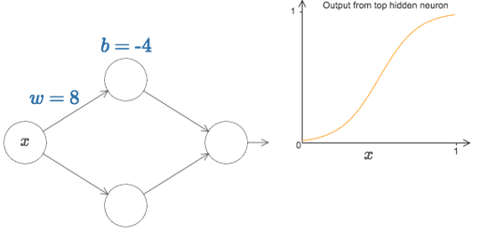

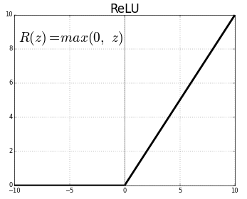

Sigmoid和ReLU


*   线性层跟随元素非线性函数的组合允许我们创建任意复杂的形状 - 这是通用逼近定理的本质。

#### 如何设置这些参数来解决问题[ [01:04:25](https://youtu.be/IPBSB1HLNLo%3Ft%3D1h4m25s) ]

*   随机梯度下降 - 我们沿着山坡走小步。 步长称为**学习率**


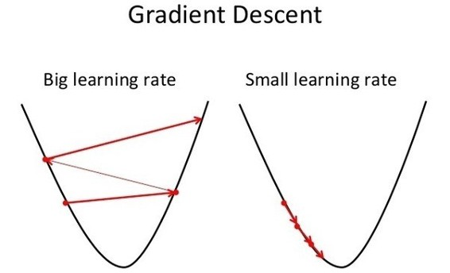

*   如果学习率太大，它将发散而不是收敛
*   如果学习率太小，则需要永远

#### 可视化和理解卷积网络[ [01:08:27](https://youtu.be/IPBSB1HLNLo%3Ft%3D1h8m27s) ]

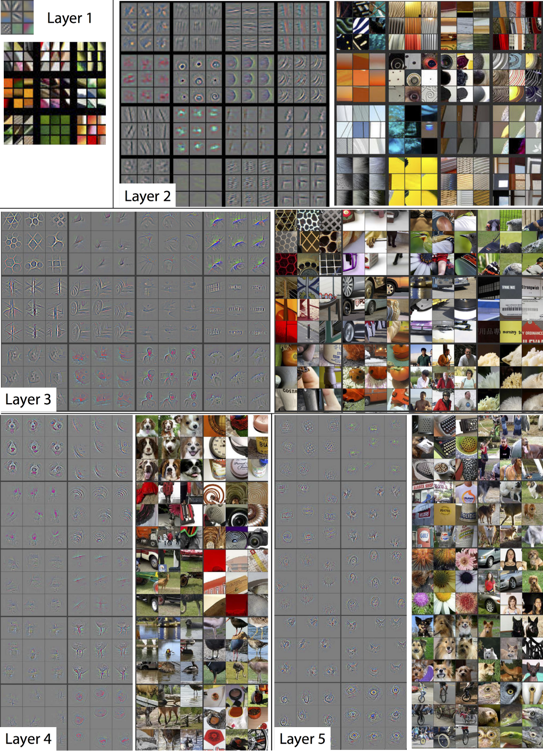

我们从一些非常简单的东西开始，但如果我们使用它作为一个足够大的规模，由于通用近似定理和在深度学习中使用多个隐藏层，我们实际上获得了非常丰富的功能。 这实际上是我们在训练我们的狗与猫识别器时使用的。

#### Dog vs. Cat Revisited - 选择学习率[ [01:11:41](https://youtu.be/IPBSB1HLNLo%3Ft%3D1h11m41s) ]

```py
learn.fit(0.01, 3) 
```

*   第一个数字`0.01`是学习率。
*   _学习率_决定了您想要更新_权重_ （或_参数_ ）的速度或速度。 学习率是设置最困难的参数之一，因为它会显着影响模型性能。
*   方法`learn.lr_find()`可帮助您找到最佳学习率。 它使用2015年论文“ [循环学习率训练神经网络”中](http://arxiv.org/abs/1506.01186)开发的技术，我们只需将学习率从非常小的值提高，直到损失停止下降。 我们可以绘制不同批次的学习率，看看它是什么样的。

```py
learn = ConvLearner.pretrained(arch, data, precompute=True)  learn.lr_find() 
```

我们的`learn`对象包含一个属性`sched` ，其中包含我们的学习率调度程序，并具有一些方便的绘图功能，包括以下内容：

```py
learn.sched.plot_lr() 
```

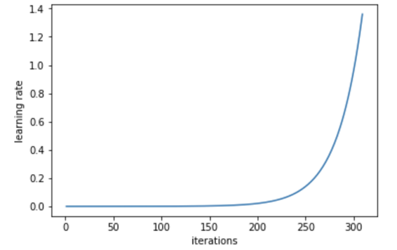

*   Jeremy目前正在尝试以指数方式和线性方式提高学习率。

我们可以看到损失与学习率的关系，看看我们的损失在哪里停止下降：

```py
learn.sched.plot() 
```

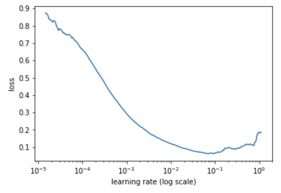

*   然后我们选择学习率，其中损失仍在明显改善 - 在这种情况下`1e-2` （0.01）

#### 选择时代数量[ [1:18:49](https://youtu.be/IPBSB1HLNLo%3Ft%3D1h18m49s) ]

```py
[ 0. 0.04955 0.02605 0.98975]  [ 1. 0.03977 0.02916 0.99219]  [ 2. 0.03372 0.02929 0.98975] 
```

*   尽可能多的人，但如果你运行太久，准确性可能会变得更糟。 它被称为“过拟合”，我们稍后会详细了解它。
*   另一个考虑因素是您可以使用的时间。

#### 提示与技巧[ [1:21:40](https://youtu.be/IPBSB1HLNLo%3Ft%3D1h21m40s) ]

**1.** `Tab` - 当您忘记功能名称时，它将自动完成

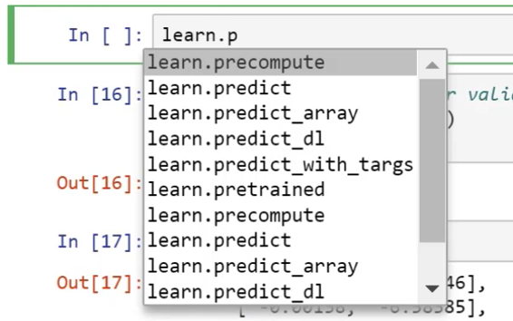

**2.** `Shift + Tab` - 它将显示函数的参数


**3.** `Shift + Tab + Tab` - 它将显示一个文档（即docstring）


**4.** `Shift + Tab + Tab + Tab` - 它将打开一个具有相同信息的单独窗口。


打字`?` 后跟一个单元格中的函数名称并运行它将与`shift + tab (3 times)`相同`shift + tab (3 times)`


**5.**键入两个问号将显示源代码

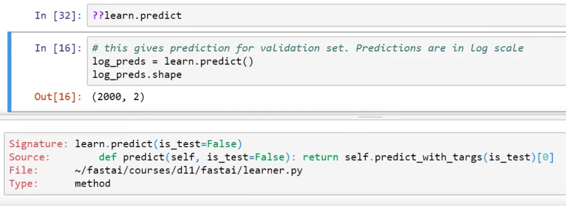

**6.**在Jupyter Notebook中键入`H`将打开一个带有键盘快捷键的窗口。 尝试每天学习4或5个快捷方式


**7.**停止Paperspace，Crestle，AWS - 否则你将被收取$$

**8.**请记住[论坛](http://forums.fast.ai/)和[http://course.fast.ai/](http://course.fast.ai/) （每节课）以获取最新信息。
