# 深度学习：第二部分第十课

#### [视频](https://youtu.be/h5Tz7gZT9Fo) / [论坛](http://forums.fast.ai/t/part-2-lesson-10-wiki/14364/1)

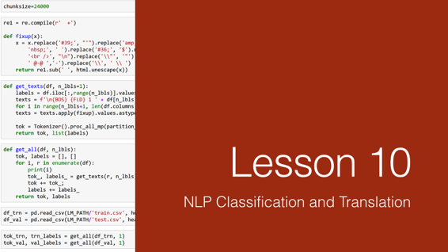

#### 回顾上周 [[0:16](https://youtu.be/h5Tz7gZT9FoY%3Ft%3D16s)] 

*   许多学生正在努力学习上周的材料，所以如果你觉得很难，那很好。杰里米预先把它放在那里的是因为我们有一些东西要不断思考，并慢慢努力，所以在第14课，你将得到第二个飞跃。
*   要理解这些碎片，你需要理解卷积层输出、感受野和损失函数的维度 - 无论如何，这些都是你所有需要了解的深度学习研究的内容。
*   一个关键的问题是我们从简单的东西开始 - 单个对象分类器，没有分类器的单个对象边框，然后是单个对象分类器和边框。 除了首先我们必须解决匹配问题之外，我们迁移到多个对象上实际几乎相同。 我们最终创建了比我们的基础真实边框所需的激活更多的激活数量，因此我们将每个地面实况对象与这些激活的子集相匹配。 一旦我们完成了这个，我们对每个匹配所做的损失函数几乎与这个损失函数（即单个对象分类器和边框的损失函数）相同。
*   如果你感觉困难，请返回第8课，确保你了解了数据集，DataLoader，最重要的是了解损失函数。
*   因此，一旦我们有了可以预测一个对象的类和边框的东西，我们通过创建更多的激活来进入多个对象 [[2:40](https://youtu.be/h5Tz7gZT9Fo%3Ft%3D2m40s)] 。 之后，我们必须处理匹配问题，处理了一个匹配问题之后，我们将每个锚箱移入移出一点，再移到周围一点，所以他们试图与特定的地面实例对象进行对齐。
*   我们谈到了我们如何利用网络的卷积性质来尝试激活具有与我们所预测的基本事实对象类似的接受场。 Chloe提供了以下奇妙的图片来讨论什么是SSD_MultiHead.forward，一行一行地看：


作者： [Chloe Sultan](http://forums.fast.ai/u/chloews)


Chloe在这里所做的是她特别关注路径中每个点处张量的维数，因为我们使用2个步长的卷积逐渐下采样，确保她理解为什么会出现这些网格，然后理解是如何产生输出的。

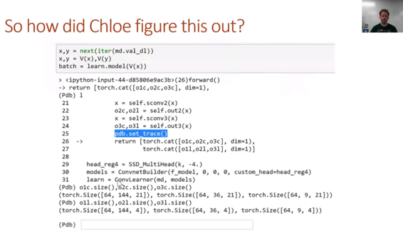

*   这是你必须记住这个`pbd.set_trace()`的地方 。 我刚刚上课前进入`SSD_MultiHead.forward`并输入了`pdb.set_trace()`，然后运行了一个批处理。 之后我可以打印出所有这些的大小。我们可能有错误，这就是为什么我们有调试器并知道如何检查过程中的一些很小的问题。
*   然后我们讨论了增加_k_  [[5:49](https://youtu.be/h5Tz7gZT9Fo%3Ft%3D5m49s)] ，这是每个卷积网格单元的锚箱数量，我们可以用不同的缩放比、宽高比进行处理，这给我们提供了大量的激活，因此预测了边框。
*   然后我们使用非最大抑制来减小数值。
*   非最大抑制是一种粗糙的、丑陋的和完全的启发式，我们甚至没有讨论代码，因为它看起来很可怕。 最近有人提出了一篇论文，试图用一个端到端的卷积网来取代那个NMS（ [https://arxiv.org/abs/1705.02950](https://arxiv.org/abs/1705.02950) ）。


*   没有足够的人阅读了论文！ 我们现在在课堂上所做的是实现论文，论文是真正的基本事实。而且我想你通过与人们交谈，了解了人们不读论文的原因有很多，因为很多人都不认为他们有能力读论文。他们认为他们不是那种阅读论文的人，但你是。你在这里。 我们上周开始阅读一篇论文，我们读到的是英文单词，我们对很了解它们。如果你仔细看看上面的图片，你会发现`SSD_MultiHead.forward`没有做同样的事情。然后你可能就想知道，这样是否是更好的。我的回答可能是yes。因为SSD_MultiHead.forward是我尝试过的第一件事。 在这篇与YOLO3论文之间，它们可能是更好的方法。
*   有一点你会特别注意到，他们使用了较小的k，但他们有更多的网格组1x1,3x3,5x5,10x10,19x19,38x38 - 8732每个级别。比我们更多，所以这将是一个有趣的实验。
*   我注意到的另一件事是我们有4x4,2x2,1c1这意味着有很多重叠 - 每一组都与其他组相匹配。 在这种情况下你有1,3,5，没有重叠。所以它实际上可能更容易被学习到。你可以做很多有趣的东西。

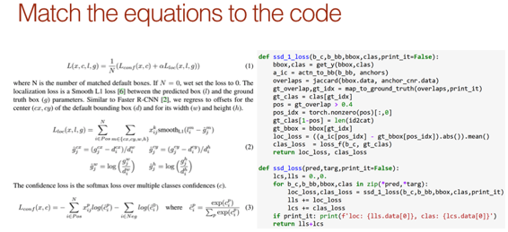

*   也许我建议最重要的是将代码和方程放在一起。你是数学家或程序员。通过将它们并排放置，你将学习到另一类知识。
*   学习数学很难，因为符号似乎很难查找，但有很好的资源，如[维基百科](https://en.wikipedia.org/wiki/List_of_mathematical_symbols) 。
*   你应该尝试做的另一件事是重新创建你在论文中看到的东西。下图是关键，损失论文中关键的最重要的图1。

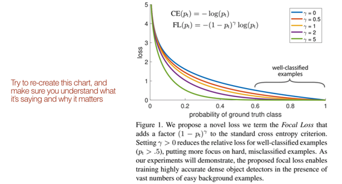

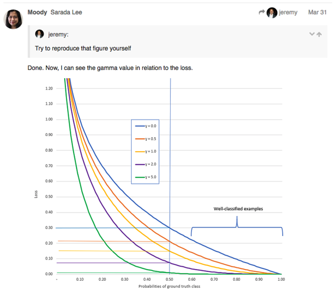

*   上周我确实在我的代码中发现了一个小错误 [[12:14](https://youtu.be/h5Tz7gZT9Fo%3Ft%3D12m14s)]  - 我对卷积激活的讨论方式并不符合我在丢失（loss）函数中使用它们的方式，我修复了它，并使它更好一些。


**问题** ：通常，当我们下采样时，我们会增加滤波器的数量或深度。当我们从7x7到4x4等进行采样时，为什么我们要将数字从512减少到256？ 为什么不降低SSD头的尺寸？（性能相关？） [[12:58](https://youtu.be/_ercfViGrgY%3Ft%3D12m58s)] 我们有许多输出路径，我们希望每个路径都相同，所以我们不希望每个路径都有不同数量的过滤器，这也就是论文所作的，我试图与之相匹配。 有了这256个 - 这是一个不同的概念，因为我们不仅利用了最后一层，还利用了之前的层。如果我们让它们更加一致，生活会更容易。

* * *

### 自然语言处理 [[14:10](https://youtu.be/h5Tz7gZT9Fo%3Ft%3D14m10s)] 

#### 我们要做的：

我们在每节课中都看到过采用预训练过的好的模型的想法，在顶部快速的去掉一些东西，用一些新的东西替换它，并让它做类似的事情。 我们稍微深入讨论一下这个问题，让我们来谈谈了与`ConvLearner.pretrained`相关内容。 `ConvLearner.pretrained`它有一种标准的方式将东西粘在顶部，这是一个特定的事情（比如分类）。 然后我们了解到实际上我们可以在最后使用我们喜欢的任何PyTorch模块，并让它用`custom_head`做任何我们喜欢的事情 ，所以突然你就发现我们可以做一些非常有趣的事。

事实上，杨璐说“如果我们做了不同类型的自定义头怎么办？”并且不同的自定义头是让我们拍摄原始图片，旋转它们，并使我们的因变量与旋转相反，看它是否可以学习解旋它。这是一个非常有用的东西，事实上，我认为Google照片现在有这个选项，实际上它会自动为你旋转你的照片。但是很酷的是，正如他在这里展示的那样，你可以通过与我们上一课完全相同的方式建立这个网络。但是你的自定义头是输出单个数字的头部，定义它可以旋转的量，而你的数据集有一个因变量就是你可以旋转的量。


[http://forums.fast.ai/t/fun-with-lesson8-rotation-adjustment-things-you-can-do-without-annotated-dataset/14261/1](http://forums.fast.ai/t/fun-with-lesson8-rotation-adjustment-things-you-can-do-without-annotated-dataset/14261/1)


所以你突然意识到这个主干和定制头的想法，你几乎可以做任何你能想到的事情 [[16:30](https://youtu.be/h5Tz7gZT9Fo%3Ft%3D16m30s)] 。

*   今天，我们将看看同样的想法，看看它如何适用于NLP。
*   在下一课中，我们将进一步说明NLP和计算机视觉是否可以让你实现同样的基本想法，我们如何将两者结合起来。 实际上，我们将学习一个可以学习从图像中找到单词结构，从单词结构中找到图像或从图像中找到图像的模型。 如果你想进一步做一些事情，比如从一个图像到一个句子（即图像字幕），或者从一个句子到一个我们开始做的图像，一个短语到图像，那上面内容将构成基础。
*   从那里之后，我们必须更深入地进入计算机视觉，思考我们可以用预训练的网络和定制头的想法做些什么。 因此，我们将研究各种图像增强，例如增加低分辨率照片的分辨率以猜测缺少的内容或在照片上添加艺术滤镜，或将马的照片更改为斑马照片等。
*   最后，这将再次带我们回到边框。为了达到这个目的，我们首先要学习分割，这不仅仅是找出边框的位置，而是要弄清楚图像中每个像素的一部分 - 所以这个像素是一个人的一部分，这个像素是一辆车的一部分。 然后我们将用这个想法，特别是一个名为UNet的想法，结果证明了这个UNet的想法可以应用于边框 - 它被称为特征金字塔。 我们将使用它来获得非常好的带有边框的结果。这是我们从这里开始的路。 这一切都将建立在彼此的基础上，但将我们带入许多不同的领域。

#### torchtext to fastai.text  [[18:56](https://youtu.be/h5Tz7gZT9Fo%3Ft%3D18m56s)] ：


对于NLP，最后一部分，我们依赖于一个名为torchtext的库，尽管它很好，但我从某个时刻起就发现它的局限性，难以继续使用了。正如你们很多人在论坛上抱怨的那样，它非常慢，部分原因是它没有并行处理，部分原因是它不记得你上次做了什么，而是从头开始重新做。然后很难做相当简单的事情，比如很多你试图进入Kaggle的不良评论竞赛，这是一个多标签问题，并试图用 PyTorch 文本做到这一点，我最终用它完成了工作，但我花了一周的时间，这有点荒谬。 为了解决所有这些问题，我们创建了一个名为fastai.text的新库。Fastai.text是torchtext和fastai.nlp组合的替代品。所以不要再使用fastai.nlp - 这已经过时了。它更慢，更混乱，在各方面都不太好，但是有很多重叠部分。 有意地，许多类和函数具有相同的名称，但这是非torchtext版本。

#### IMDb  [[20:32](https://youtu.be/h5Tz7gZT9Fo%3Ft%3D20m32s)] 

[笔记本](https://github.com/fastai/fastai/blob/master/courses/dl2/imdb.ipynb)

我们将再次与IMDb合作。对于那些已经忘记的人，请回去看看第[4课](https://medium.com/%40hiromi_suenaga/deep-learning-2-part-1-lesson-4-2048a26d58aa) 。这是一个电影评论的数据集，我们用它来确定我们是否可以喜欢Zombiegeddon，我们认为也许是我喜欢的那种。

```python
from fastai.text import   
import html
```

> 我们需要从这个网站下载IMDB大型电影评论： [http](http://ai.stanford.edu/~amaas/data/sentiment/):[//ai.stanford.edu/~amaas/data/sentiment/](http://ai.stanford.edu/~amaas/data/sentiment/)直接链接： [链接](http://ai.stanford.edu/~amaas/data/sentiment/aclImdb_v1.tar.gz)

```python
BOS = 'xbos' _ 		# beginning-of-sentence tag_  
FLD = 'xfld' _   # data field tag_ 
```

```python
PATH=Path('data/aclImdb/') 
```

#### 标准化格式 [[21:27](https://youtu.be/h5Tz7gZT9Fo%3Ft%3D21m27s)] 

NLP的基本方法是我们必须把句子并将它们转换为数字，并且有一对要到达那里。目前，有意地，fastai.text没有提供那么多辅助函数。 它的设计更多是为了让你以相当灵活的方式处理事物。

```python
CLAS_PATH=Path('data/imdb_clas/')
CLAS_PATH.mkdir(exist_ok=True) 
```

```python
LM_PATH=Path('data/imdb_lm/')
LM_PATH.mkdir(exist_ok=True) 
```

正如你在这里 [[21:59](https://youtu.be/h5Tz7gZT9Fo%3Ft%3D21m59s)] 所看到的，我写了一些叫做get_texts的东西，它贯穿了`CLASSES`每一件事。 IMDb中有三个类：负数，正数，然后还有另一个文件夹“无人监督”，其中包含尚未标记的文件夹 - 所以我们现在只称它为一个类。 所以我们只需浏览这些类中的每一个，然后查找该文件夹中的每个文件，打开它，读取它，然后将它放入数组的末尾。 正如你所看到的，使用pathlib，非常容易地抓取内容并将其放入内容，然后标签就是我们到目前为止所做的任何类。我们将为训练集和测试集做这样相同的操作。

```python
CLASSES = ['neg', 'pos', 'unsup'] 
```

```python
def get_texts(path):
    texts,labels = [],[]  
    for idx,label in enumerate(CLASSES):
        for fname in (path/label).glob('*.*'):
            texts.append(fname.open('r').read())  
            labels.append(idx)  
    return np.array(texts),np.array(labels) 
```

```python
trn_texts,trn_labels = get_texts(PATH/'train')
val_texts,val_labels = get_texts(PATH/'test') 
```

```python
len(trn_texts),len(val_texts) 
```

```python
(75000, 25000)
```

训练集有75,000，测试集有25,000。 训练集中的50,000个是无人监管的，当我们进入分类时，我们实际上无法使用它们。 Jeremy发现这比使用大量层和包装器的torch.text方法更容易，因为最后阅读文本文件并不那么难。

```python
col_names = ['labels','text'] 
```

有一点总是好主意是随机排序 [[23:19](https://youtu.be/h5Tz7gZT9Fo%3Ft%3D23m19s)] 。 知道这个随机排序的简单技巧很有用，特别是当你有多个东西需要以同样的方式排序时。在这种情况下，你有标签和`texts. np.random.permutation` `texts. np.random.permutation` ，如果你给它一个整数，它会给你一个从0到不包括你给它的随机顺序的随机列表。

```python
np.random.seed(42)  
trn_idx = np.random.permutation(len(trn_texts))
val_idx = np.random.permutation(len(val_texts)) 
```

你可以将它作为索引器传递给你一个按随机顺序排序的列表。 所以在这种情况下，它将以相同的随机方式对`trn_texts`和`trn_labels`进行排序。 所以这是一个有用的小习惯写法。

```python
trn_texts = trn_texts[trn_idx]  val_texts = val_texts[val_idx] 
```

```python
trn_labels = trn_labels[trn_idx]  val_labels = val_labels[val_idx] 
```

现在我们已经对文本和标签进行了排序，我们可以从它们中创建[dataframe](https://youtu.be/h5Tz7gZT9Fo%3Ft%3D24m7s)  [[24:07](https://youtu.be/h5Tz7gZT9Fo%3Ft%3D24m7s)] 。 我们为什么这样做？ 原因是文本分类数据集开始出现一些标准的方法，即将训练设置为首先带有标签的CSV文件，然后是NLP文档的文本。 所以它基本上是这样的：


```python
df_trn = pd.DataFrame({'text':trn_texts, 'labels':trn_labels},  columns=col_names) 
df_val = pd.DataFrame({'text':val_texts, 'labels':val_labels},  columns=col_names) 
```

```python
df_trn[df_trn['labels']!=2].to_csv(CLAS_PATH/'train.csv', header=False, index=False)  
df_val.to_csv(CLAS_PATH/'test.csv', header=False, index=False) 
```

```python
(CLAS_PATH/'classes.txt').open('w').writelines(f' {o}\n ' for o in CLASSES)  
(CLAS_PATH/'classes.txt').open().readlines() 
```

```python
['neg\n', 'pos\n', 'unsup\n']
```

所以你有标签和文本，然后是一个名为classes.txt的文件，它只列出了类。 我说有点标准，因为在最近的一篇学术论文中，Yann LeCun和一个研究小组研究了不少数据集，并且他们使用这种格式。 所以这就是我最近的论文用到的。 你会发现这个笔记本，如果你把数据放到这种格式，整个笔记本每次都会工作 [[25:17](https://youtu.be/h5Tz7gZT9Fo%3Ft%3D25m17s)] 。因此，我只是选择一种标准格式，而不是拥有一千种不同的格式，而你的工作就是将数据放入CSV文件格式。 默认情况下，CSV文件没有标头。

你会注意到一开始我们有两条不同的路径 [[25:51](https://youtu.be/h5Tz7gZT9Fo%3Ft%3D25m51s)] 。 一个是分类路径，另一个是语言模型路径。在NLP中，你会一直看到LM。 LM意味着语言模型。 分类路径将包含我们将用于创建情绪分析模型的信息。语言模型路径将包含创建语言模型所需的信息。所以他们有点不同。有一点不同的是，当我们在分类路径中创建train.csv时，我们会删除标签为2的所有内容，因为标签2是“无监督的”，而我们无法使用它。


```python
trn_texts,val_texts = sklearn.model_selection.train_test_split(np.concatenate([trn_texts,val_texts]), test_size=0.1) 
```

```python
len(trn_texts), len(val_texts) 
```

```python
_(90000, 10000)_ 
```

第二个区别是标签 [[26:51](https://youtu.be/h5Tz7gZT9Fo%3Ft%3D26m51s)] 。 对于分类路径，标签是实际标签，但对于语言模型，没有标签，所以我们只使用一堆零，这使得它更容易，因为我们可以使用一致的dataframe/ CSV格式。

现在是语言模型，我们可以创建自己的验证集，所以你现在可能已经遇到过， `sklearn.model_selection.train_test_split`这是一个非常简单的函数，可以选中数据集并根据你指定的比例，随机将其拆分为训练集和验证集。在这种情况下，我们将分类训练和验证结合在一起，将其拆分10％，现在我们有90,000次训练，10,000次验证我们的语言模型。这样我们的语言模型和分类器就会以标准格式获取数据。

```python
df_trn = pd.DataFrame({'text':trn_texts, 'labels':  [0]*len(trn_texts)}, columns=col_names)  

df_val = pd.DataFrame({'text':val_texts, 'labels':  [0]*len(val_texts)}, columns=col_names) 
```

```python
df_trn.to_csv(LM_PATH/'train.csv', header=False, index=False) df_val.to_csv(LM_PATH/'test.csv', header=False, index=False) 
```

#### 语言模型标记 [[28:03](https://youtu.be/h5Tz7gZT9Fo%3Ft%3D28m3s)] 

接下来我们要做的就是分词。 分词意味着在这个阶段，对于文档（即电影评论），我们有一个很长的字符串，我们想把它变成一个标记列表，类似于单词列表但不完全相同。 例如， `don't`希望它是`do`和`n't` ，我们可能希望完全停止成为标记，等等。 分词是我们传递给一个名为spaCy的极好的库 - 一部分是因为澳大利亚人完成了它并且非常棒，因为它擅长做它的应有的功能。 我们在spaCy上添加了一些东西，但绝大部分工作都是由spaCy完成的。

```python
chunksize=24000 
```

在我们将它传递给spaCy之前，Jeremy编写了这个简单的修复功能，每次他查看不同的数据集（大约十几个建立这个）时，每个数据集都有不同的奇怪的东西需要替换。 所以这是他到目前为止所提出的所有内容，希望这也会帮助你。 所有的实体都是未转义的html，我们还替换了很多东西。看一下在你输入的文本上运行它的结果，并确保那里没有任何奇怪的标记。

```python
re1 = re.compile(r' +') 
```

```python
def fixup(x):
    x = x.replace('#39;', "'").replace('amp;', '&')
    	 .replace('#146;', "'").replace('nbsp;', ' ')
         .replace('#36;', '$').replace('\\n', "\n")
         .replace('quot;', "'").replace('<br />', "\n")  
         .replace('\\"', '"').replace('<unk>','u_n')  
         .replace(' @.@ ','.').replace(' @-@ ','-')  
         .replace('\\', ' \\ ')  
    return re1.sub(' ', html.unescape(x)) 
```

```python
def get_texts(df, n_lbls=1):  
    labels = df.iloc[:,range(n_lbls)].values.astype(np.int64)  
    texts = f' \n{BOS} {FLD} 1 ' + df[n_lbls].astype(str)  
    for i in range(n_lbls+1, len(df.columns)):  
        texts += f' {FLD} {i-n_lbls} ' + df[i].astype(str)  
    texts = texts.apply(fixup).values.astype(str) 

    tok = Tokenizer().proc_all_mp(partition_by_cores(texts))  		      
    return tok, list(labels) 
```

`get_all function`调用`get_texts`，然后get_texts会做一些事情 [[29:40](https://youtu.be/h5Tz7gZT9Fo%3Ft%3D29m40s)] 。 其中之一是使用我们刚才提到的`fixup` 。

```python
def get_all(df, n_lbls):  
    tok, labels = [], []  
    for i, r in enumerate(df):  
        print(i)  
        tok_, labels_ = get_texts(r, n_lbls)  
        tok += tok_;  
        labels += labels_  
    return tok, labels 
```

让我们看看这个函数，因为有一些有趣的事情需要指出 [[29:57](https://youtu.be/h5Tz7gZT9Fo%3Ft%3D29m57s)] 。 我们将使用pandas从语言模型路径读取我们的train.csv，但是我们传入了一个额外的参数，你可能在看到`chunksize`之前看不到。 在存储和读取文本数据时，Python和pandas的效率都很低。 因此，你会发现NLP中很少有人使用大型语料库。 杰里米认为，部分原因是传统工具使得NLP变得非常困难 - 你的内存总是耗尽。 因此，他今天向我们展示了这个过程，他使用这个确切的代码成功地使用了超过十亿字的语料库。 其中一个简单的方法就是用pandas称为`chunksize` 。 这意味着pandas不返回数据帧，但它返回一个迭代器，我们可以迭代数据帧的块。 这就是为什么我们不说`tok_trn = get_text(df_trn)` ，而是调用`get_all`来循环数据帧，但实际上它正在做的是它循环遍历数据帧的块，所以这些块中的每部分基本上都是数据的子集，它们代表了数据帧 [[31:05]](https://youtu.be/h5Tz7gZT9Fo%3Ft%3D31m5s) 。

**问题** ：当我使用NLP数据时，很多时候我遇到了带有外国文本/字符的数据。 放弃它们更好还是保留它们更好 [[31:31](https://youtu.be/h5Tz7gZT9Fo%3Ft%3D31m31s)] ？ 不，不，绝对要保留它们。 整个过程是unicode，实际上我在中文文本上使用了这个。 这适用于几乎任何地方。 一般来说，大多数时候，不管删除什么都不是一个好主意。 传统的NLP方法倾向于完成以下所有内容，如词形还原和所有的规范化步骤来避免麻烦，小写文本等等。但这会丢失你不知道一些是否有用的信息。 所以不要丢掉信息。

所以我们遍历每个块，每个块都是一个数据帧，我们调用`get_texts`  [[32:19](https://youtu.be/h5Tz7gZT9Fo%3Ft%3D32m19s)] 。 `get_texts`将获取标签并使它们成为整型数，并且它将获取文本数据。 有几点需要指出：

*   在我们包含文本之前，我们在开头定义了“beginning of stream”（ `BOS` ）标记。 这些特殊的字母串没有什么特别之处 - 它们只是我认为不经常出现在普通文本中的字母。 因此，每个文本都将以`'xbos'`开头 - 为什么？ 因为模型通常有助于了解新文本从哪里开始。 例如，如果它是一种语言模型，我们将把所有文本连接在一起。 因此，知道所有文章已经结束并且新文章已经开始真的很有用，所以现在我可能会忘记它们的一些上下文。
*   同上，文本通常有多个字段，如标题和摘要，然后是主文档。 因此，出于同样的原因，我们在这里得到了这个东西，它让我们在CSV中实际上有多个字段。 所以这个过程的设计非常灵活。 再次在每一个的开头，我们放置一个特殊的“field starts here”标记，后跟从这里开始的字段数量，跟我们拥有的字段一样多。 然后我们对它使用`fixup` 。
*   然后最重要的是 [[33:54](https://youtu.be/h5Tz7gZT9Fo%3Ft%3D33m54s)] ，我们将它分词 - 我们通过执行“process all multiprocessing”（ `proc_all_mp` ）来标记它。 分词速度往往相当缓慢，但现在我们的机器已经拥有多个内核，而AWS上的一些更好的机器可以拥有数十个内核。 spaCy不太适合多进程，但Jeremy最终想出了如何让它发挥作用。 好消息是它现在放在了一个函数中。 因此，你需要传递给该函数的是要分词的文本列表，该列表的每个部分将在不同的核心上进行分词。 还有一个名为`partition_by_cores`的函数，它接受一个列表并将其拆分为子列表。 子列表的数量是计算机中的核心数。 在没有多处理的Jeremy机器上，这需要大约一个半小时，如果通过多进程，大约需要2分钟。 所以这是一个非常有用的东西。 随时查看内部实现，并利用它作为你自己的东西。 请记住，即使在我们的笔记本电脑中，我们都拥有多个内核，并且Python中很少有函数可以使用它，除非你付出一些努力使其工作。

```python
df_trn = pd.read_csv(LM_PATH/'train.csv', header= **None** ,  chunksize=chunksize) 
df_val = pd.read_csv(LM_PATH/'test.csv', header= **None** ,  chunksize=chunksize) 
```

```python
tok_trn, trn_labels = get_all(df_trn, 1)  
tok_val, val_labels = get_all(df_val, 1) 
```

```python
0
1
2
3
0 
```

```python
(LM_PATH/'tmp').mkdir(exist_ok=True)
```

这是最后的结果 [[35:42](https://youtu.be/h5Tz7gZT9Fo%3Ft%3D35m42s)] 。 流标记（ `xbos` ）的开头，字段编号1标记（ `xfld 1` ）的开头和分词文本。 你会看到标点符号现在是一个单独的标记。

**`t_up`** ： `t_up mgm` - MGM初始化大写。 但有趣的是，通常人们要么小写一切，要么就是按原样保留。 现在，如果你保持原样，那么“SCREW YOU”和“screw you”是两组完全不同的标记，必须从头开始学习。 或者如果你将它们全部小写，那么根本就没有区别。 那么你如何解决这个问题，以便都能得到“I’M SHOUTING NOW”的语义影响，但不必学习shouted的版本与正常版本。 因此，我们的想法是提出一个独特的标记来表示接下来的事情都是大写的。 然后我们小写它，所以现在的任何文本曾经是大写的之后是小写的，然后我们可以学习所有大写的语义含义。

**`tk_rep`** ：同样，如果你有连续29个的`!` 情况，我们没有为29个感叹号学习单独的标记 - 而我们为“下一个重复很多次”添加了一个特殊标记，然后输入数字29和一个感叹号（即`tk_rep 29 !` ） 。 所以有一些这样的技巧。 如果你对NLP感兴趣，请查看Jeremy添加的这些小技巧的tokenizer代码，因为其中一些很有趣。

```python
' '.join(tok_trn[0]) 
```

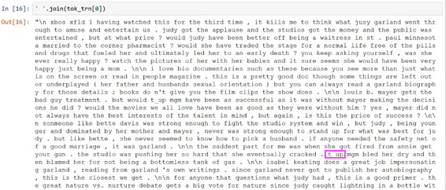

这样做的好处是我们可以只使用`np.save`保存和加载它 [[37:44](https://youtu.be/h5Tz7gZT9Fo%3Ft%3D37m44s)] 。 我们不必每次重新计算所有这些东西，就像我们倾向于使用torchtext或许多其他库一样。 现在我们已经将它分词了，接下来我们要做的就是把它变成我们称之为数值化的数字。 我们将它数值化的方式非常简单。

*   我们列出了以某种顺序出现的所有单词的列表
*   然后我们将每个单词的索引替换为该列表
*   所有标记的列表，我们称之为词汇表。

```python
np.save(LM_PATH/'tmp'/'tok_trn.npy', tok_trn) 
np.save(LM_PATH/'tmp'/'tok_val.npy', tok_val) 
```

```python
tok_trn = np.load(LM_PATH/'tmp'/'tok_trn.npy')  
tok_val = np.load(LM_PATH/'tmp'/'tok_val.npy') 
```

这是一些词汇 [[38:28](https://youtu.be/h5Tz7gZT9Fo%3Ft%3D38m28s)] 的例子。 Python中的Counter类非常方便。 它大体为我们提供了一个独特项目及其计数的列表。 以下是词汇表中最常见的25个内容。 一般来说，我们不希望词汇表中的每个是唯一标记。 如果它没有出现两次及以上，那么可能只是一个拼写错误或一个单词，如果它不经常出现，我们无法学到任何关于它的东西。 此外，一旦你的词汇量超过60,000，我们将在这部分中学到的东西会变得有点笨拙。 如果时间允许的话，我们可能会看看Jeremy最近在处理大型词汇表时所做的一些工作，否则可能需要在未来的课程中进行。 但实际上对于分类来说，无论如何做大于60,000个单词似乎都没有帮助。

```python
freq = Counter(p for o in tok_trn for p in o)  freq.most_common(25) 
```

```python
[('the', 1207984),
 ('.', 991762),
 (',', 985975),
 ('and', 587317),
 ('a', 583569),
 ('of', 524362),
 ('to', 484813),
 ('is', 393574),
 ('it', 341627),
 ('in', 337461),
 ('i', 308563),
 ('this', 270705),
 ('that', 261447),
 ('"', 236753),
 ("'s", 221112),
 ('-', 188249),
 ('was', 180235),
 ('\n\n', 178679),
 ('as', 165610),
 ('with', 159164),
 ('for', 158981),
 ('movie', 157676),
 ('but', 150203),
 ('film', 144108),
 ('you', 124114)]
```

因此，我们将把词汇量限制为60,000个单词，这些单词至少出现两次 [[39:33](https://youtu.be/h5Tz7gZT9Fo%3Ft%3D39m33s)] 。 这是一个简单的方法。 使用`.most_common` ，传递最大词汇量。 这将按频率排序，如果它看起来不是频率最低的，那么根本不用担心它。 这给了我们`itos` - 这与torchtext使用的名称相同，它意味着整数到字符串。 这只是词汇中唯一标记的列表。 我们`_unk_`插入两个标记 - 一个用于未知（ `_unk_` ）的词汇项和一个用于填充的词汇项（ `_pad_` ）。

```python
max_vocab = 60000  min_freq = 2 
```

```python
itos = [o for o,c in freq.most_common(max_vocab) if c>min_freq]
itos.insert(0, '_pad_')  
itos.insert(0, '_unk_') 
```

然后我们可以创建反向的字典（字符串到整数） [[40:19](https://youtu.be/h5Tz7gZT9Fo%3Ft%3D40m19s)] 。 这不会涵盖所有内容，因为我们故意将其截断至60,000字。 如果我们遇到字典中没有的东西，我们可以用零替换未知的，所以我们可以使用带有lambda函数的`defaultdict` ，它始终返回零。

```python
stoi = collections.defaultdict(lambda:0,  {v:k **for** k,v **in** enumerate(itos)})  
len(itos) 
```

```python
60002
```

所以现在我们定义了`stoi`字典，然后我们可以为每个句子调用每个单词 [[40:50](https://youtu.be/h5Tz7gZT9Fo%3Ft%3D40m50s)] 。

```python
trn_lm = np.array([[stoi[o] for o in p] for p in tok_trn])  
val_lm = np.array([[stoi[o] for o in p] for p in tok_val]) 
```

这是我们的数值化版本：


当然，好消息是我们也可以保存这一步骤。 每次我们进入另一步，我们都可以保存它。 与你使用图像时相比，这些文件不是很大。 文本通常很小。

保存那些词汇（ `itos` ）非常重要。 数字列表没有任何意义，除非你知道每个数字所指的是什么，这就是`itos`告诉你的。

```python
np.save(LM_PATH/'tmp'/'trn_ids.npy', trn_lm) np.save(LM_PATH/'tmp'/'val_ids.npy', val_lm)  
pickle.dump(itos, open(LM_PATH/'tmp'/'itos.pkl', 'wb')) 
```

所以你保存了这三件事，以后再加载它们就可以了。

```python
trn_lm = np.load(LM_PATH/'tmp'/'trn_ids.npy')  
val_lm = np.load(LM_PATH/'tmp'/'val_ids.npy')  
itos = pickle.load(open(LM_PATH/'tmp'/'itos.pkl', 'rb')) 
```

现在我们的词汇量为60,002，我们的训练语言模型中有90,000个文档。

```python
vs=len(itos)  
vs,len(trn_lm) 
```

```python
(60002, 90000)
```

这是你做的预处理 [[42:01](https://youtu.be/h5Tz7gZT9Fo%3Ft%3D42m1s)] 。 如果我们想要的话，我们可以在实际的程序函数中包含更多的内容，但它非常简单，并且一旦你以CSV格式获得它，那么准确的代码将适用于你拥有的任何数据集。

#### 预训练 [[42:19](https://youtu.be/h5Tz7gZT9Fo%3Ft%3D42m19s)] 


这是一种新的洞察力，它不是最新的，我们想要预训练一些东西。 我们从第4课就知道，如果我们通过首先创建一个语言模型，微调它，再将其作为分类器，这是有用的。 它实际上为我们带来了一个最先进的结果 - 我们获得了相当多的IMDb分类器结果。 我们的目标不是那么远，因为IMDb的电影评论与其他任何英文文档没有什么不同; 它们与随机字符串甚至中文文档的不同程度相比较。 因此，就像ImageNet允许我们训练能够识别看起来像图片的东西的东西一样，我们可以将它用在与ImageNet无关的东西上，就像卫星图像一样。 为什么我们不训练一个擅长英语的语言模型，然后对它进行微调以适用于电影评论。

因此，这一基本见解促使Jeremy尝试在维基百科上构建语言模型。 Stephen Merity已经处理了维基百科，发现了其中大部分内容的一部分，抛弃了留下较大文章的愚蠢小文章。 他称之为wikitext103。 Jeremy获取了wikitext103并训练了一个语言模型。 他使用完全相同的方法向你展示训练IMDb语言模型，但他训练了一个wikitext103语言模型。 他保存了它并将其提供给任何想要在[此URL](http://files.fast.ai/models/wt103/)上使用它的人。 现在的想法是让我们训练一个以这些权重开始的IMDb语言模型。 希望对你们来说，这是一个非常明显的，极具争议性的想法，因为它基本上就是我们迄今为止在几乎所有课程中所做的。 但是，当Jeremy在去年6月或7月向NLP社区的人们首次提到这一点时，可能并没有那么少的兴趣，并被告知它是愚蠢的 [[45:03](https://youtu.be/h5Tz7gZT9Fo%3Ft%3D45m3s)] 。 因为杰里米很顽固，所以即使他们对NLP有了更多了解并且无论如何尝试它，他都会忽视他们。 让我们看看发生了什么。

#### wikitext103转换 [[46:11](https://youtu.be/h5Tz7gZT9Fo%3Ft%3D46m11s)] 

我们就是这样做的。 抓住wikitext模型。 如果你做了`wget -r` ，它会递归地抓取整个目录，里面有一些东西。

```python
# ! wget -nH -r -np -P {PATH} [http://files.fast.ai/models/wt103/](http://files.fast.ai/models/wt103/) 
```

我们需要确保我们的语言模型具有与Jeremy的wikitext完全相同的嵌入大小，隐藏数量和层数，否则你无法加载权重。

```python
em_sz,nh,nl = 400,1150,3 
```

这是我们预训练的路径和我们预训练的语言模型路径。

```python
PRE_PATH = PATH/'models'/'wt103'  
PRE_LM_PATH = PRE_PATH/'fwd_wt103.h5' 
```

让我们继续，并从前面的wikitext103模型中`torch.load`那些权重。 我们通常不使用torch.load，但这是PyTorch获取文件的方式。 它大体是为你提供了一个字典，其中包含层的名称和这些权重的张量/数组。

现在问题是wikitext语言模型是用一定的词汇构建的，与我们的词汇不同 [[47:14](https://youtu.be/h5Tz7gZT9Fo%3Ft%3D47m14s)] 。 我们的＃40与wikitext103型号＃40不同。 所以我们需要将一个映射到另一个。 这非常简单，因为幸运的是Jeremy为wikitext词汇保存了itos。

```python
wgts = torch.load(PRE_LM_PATH, map_location=lambda storage, loc: storage) 
```

```python
enc_wgts = to_np(wgts['0.encoder.weight'])  
row_m = enc_wgts.mean(0) 
```

这是wikitext103模型的每个单词的列表，我们可以使用相同的`defaultdict`技巧来反向映射它。 我们将使用-1表示它不在wiki文本字典中。

```python
itos2 = pickle.load((PRE_PATH/'itos_wt103.pkl').open('rb')) 
```

```python
stoi2 = collections.defaultdict(lambda: -1, {v:k for k,v in enumerate(itos2)}) 
```

所以现在我们可以说我们新的权重集只是通过嵌入大小（即我们将创建一个嵌入矩阵） [[47:57]( data-href=)] ，只是一大堆带有词汇大小的零。 然后我们浏览IMDb词汇表中的每一个单词。 我们将在`stoi2` （wikitext103词汇表的字符串到整数）中查找它，看看它是否是一个单词。 如果那是一个单词，那么我们就不会得到`-1` 。 所以`r`将大于或等于零，所以在这种情况下，我们只需将嵌入矩阵的那一行设置为存储在命名元素`'0.encoder.weight'`的权重。 你可以看看这个字典`wgts` ，很明显每个名字对应的是什么。 它看起来与你在设置模块时给出的名称非常相似，因此这里是编码器权重。

如果我们找不到 [[49:02]( data-href=)] ，我们将使用行均值 - 换句话说，这是所有wikitext103的平均嵌入权重。 因此，对于IMDb词汇表和wikitext103词汇表中的每个单词，我们最终会得到一个嵌入矩阵，我们将使用wikitext103嵌入矩阵权重; 除此之外，我们将使用wikitext103嵌入矩阵的平均权重。

```python
new_w = np.zeros((vs, em_sz), dtype=np.float32)  
for i,w in enumerate(itos):  
    r = stoi2[w]  
    new_w[i] = enc_wgts[r] if r >= 0 else row_m 
```

然后我们将用`new_w`替换编码器权重变成张量 [[49:35]( data-href=)] 。 我们没有讨论权重的搭配，但解码器（将最终预测变成一个单词的东西）基本上会使用完全相同的权重，所以我们也在那里弹出它。 然后有一些奇怪的事情，我们如何嵌入dropout，最终得到一个完整的单独副本，原因无关紧要。 所以我们把权重放回到他们需要去的地方。 所以现在这是一套我们可以加载的 PyTorch 状态。

```python
wgts['0.encoder.weight'] = T(new_w) wgts['0.encoder_with_dropout.embed.weight'] = T(np.copy(new_w)) wgts['1.decoder.weight'] = T(np.copy(new_w)) 
```

#### 语言模型 [[50:18]( data-href=)] 

让我们创建我们的语言模型。 我们将要使用的基本方法是将所有文档连接成一个长度为24,998,320的标记列表。 这将是我们作为训练集传递的内容。 所以对于语言模型：

*   我们收集所有文件，然后将它们连接起来。
*   我们将不断尝试预测这些词之后的下一个词是什么。
*   我们将设置一大堆 Dropout。
*   一旦我们有了一个模型数据对象，我们就可以从中获取模型，这样就可以给我们一个学习器。
*   然后按照惯例，我们可以调用`learner.fit` 。 我们在最后一层做了一个迭代，只是为了得到好的。 它的设置方式是最后一层是嵌入词，这显然是错误的，因为很多嵌入权重甚至不存在于词汇中。 因此，我们将训练每轮的嵌入权重。
*   然后我们将开始做完整模型的几个迭代。 怎么样？ 在第4课中，我们在14轮之后损失了4.23。 在这种情况下，我们在1个迭代后有4.12的损失。 因此，通过对wikitext103进行预训练，我们在1个时期之后获得了比在语言模型中获得的最佳损失更好的损失。

**问题** ：wikitext103型号是什么？ 再次是AWD LSTM  [[52:41]( data-href=)] ？ 是的，我们即将深入研究。 我训练它的方式实际上是你在上面看到的相同代码行，但没有在wikitext103上预训练它。

* * *

#### 关于fastai doc项目的快速讨论 [[53:07]( data-href=)] 

fastai doc项目的目标是创建文档，让读者说“哇，这是我读过的最精彩的文档”，我们对如何做到这一点有一些具体的想法。 这是自上而下，深思熟虑的想法，充分利用我们熟悉的中等方法，交互式实验代码。 如果你有兴趣参与，可以在[docs目录中]( data-href=)看到基本方法。 在那里，除了其他东西之外，还有[transforms-tmpl.adoc](https://raw.githubusercontent.com/fastai/fastai/master/docs/transforms-tmpl.adoc) 。 `adoc`是[AsciiDoc]( data-href=) 。 AsciiDoc就像markdown，但它就像markdown用来创建实体书。 很多实体书都是用AsciiDoc编写的，它和markdown一样容易使用，但是你可以用它来做更多很酷的东西。 [这](https://raw.githubusercontent.com/fastai/fastai/master/docs/transforms.adoc)是更标准的asciiDoc示例。 你可以执行诸如插入目录（ `:toc:` 。 `::`表示在此处输入定义列表。 `+`表示这是前一个列表项的延续。 所以有许多超级便利的功能，它就像turbo-charged markdown。 所以这个asciidoc创建了这个HTML，没有自定义CSS或任何添加的东西：


我们4小时前就开始了这个项目。 因此，你有一个目录，其中包含指向特定部分的超链接。 我们有交叉参考，我们可以点击直接跳转到交叉参考。 每种方法都附带其详细信息等。 为了使事情变得更容易，他们为参数，交叉引用，方法等创建了一个特殊的模板。这个想法是，它几乎就像一本书。 整个过程中会有表格，图片，视频片段和超链接。

你可能想知道docstrings是什么。 但实际上，如果你查看Python标准库并查看`re.compile()`的docstring，例如，它就是一行。 几乎Python中的每个文档字符串都是一行。 Python就是这样做的 - 他们有一个文档网站，上面写着“这就是正则表达式，这是你需要知道的，如果你想快速完成它们，你需要编译，这里是关于编译的一些信息“等等。这些信息不在文档字符串中，这也是我们将要做的事情 - 我们的文档字符串将是一行，除非你有时需要两个。 欢迎大家为文档做出贡献。

* * *

**问题** ：Hoes与word2vec比较 [[58:31]( data-href=)] ？ 实际上，这对你来说在一周内花时间来思考是件好事。 我现在给你摘要，但这是一个非常重要的概念差异。 主要的概念差异是“什么是word2vec？”Word2vec是一个嵌入矩阵 - 每个单词都有一个向量，仅仅如此。 换句话说，它是来自预训练模型的单层 - 特别的是该层是输入层。 还特别地，预训练模型是线性模型，其在称为共生矩阵的东西上被预训练。 所以我们没有特别的理由相信这个模型已经学到了很多关于英语的知识，或者它有任何特殊能力，因为它只是一个单一线性层，仅仅如此。 这个wikitext103型号是什么？ 它是一个语言模型，它有一个400维嵌入矩阵，3个隐藏层，每层1,150次激活，正则化和所有这些东西绑定输入输出矩阵 - 它基本上是最先进的AWD LSTM。 单层线性模型与三层递归神经网络的单层之间有什么区别？ 所有的东西都不一样！ 它们的能力水平差异很大。 因此，当你尝试使用预训练的语言模型与word2vec层时，你会看到绝大多数任务会得到非常不同的结果。

**问题** ：如果numpy数组不适合内存怎么办？ 是否可以直接从大型CSV文件 [[1:00:32]( data-href=)] 编写PyTorch数据加载器？ 它几乎不可能会出现，所以我不会花时间在它上面。 这些东西很小 - 它们只是整数。 想想你需要用多少整数来记忆？ 那不可能发生。 它们不必适合GPU内存，只需在内存中。 我实际上做了另一个维基百科模型，我称之为维基百科上的千兆维基，甚至可以很容易地记忆。 我没有使用它的原因是它对wikitext103并没有真正的帮助。 我已经建立了一个比我在学术文献中找到的更大的模型，它在单个机器上适合记忆。

**问题** ：平均嵌入权重 [[1:01:24]( data-href=)] 背后的思想是什么？ 他们必须设置一些东西。 这些是不存在的词，所以另一个选择是我们可以将它们保留为零。 但这似乎是一件非常极端的事情。 零是一个非常极端的数字。 为什么会为零？ 我们可以将它设置为等于一些随机数，但如果是这样，那些随机数的平均值和标准差是多少？ 他们应该统一吗？ 如果我们只是平均其余的嵌入，那么我们有一些合理缩放的东西。 只是为了澄清，这就是我们如何初始化未出现在训练语料库中的单词。

#### 回到语言模型 [[1:02:20]( data-href=)] 

这是我们以前见过的很多东西，但它有点变化。 它实际上比第1部分容易得多，但我想更深入地学习语言模型加载器。

```python
wd=1e-7  
bptt=70  
bs=52  
opt_fn = partial(optim.Adam, betas=(0.8, 0.99)) 
```

```python
t = len(np.concatenate(trn_lm))  
t, t//64 
```

```python
(24998320, 390598)
```

这是`LanguageModelLoader` ，我真的希望到现在[为止]( data-href=) ，你已经在编辑器或IDE中学会了如何跳转到符号 [[1:02:37]( data-href=)] 。 我不希望你找到`LanguageModelLoader`的源代码是什么负担。 如果你的编辑器不易适用，请不要再使用该编辑器。 有很多优秀的免费编辑器会让跳转源码很容易。

所以这是LanguageModelLoader的源代码，有趣的是可以发现它没有做任何特别麻烦的事情。 它根本不是来自任何东西。 是什么使得能够成为数据加载器的东西是它可以迭代的东西。


这是fastai.model  [[1:03:41]( data-href=)] 中的`fit`函数。 这是最终通过每个迭代结束的地方，从数据加载器创建迭代器，然后只通过它进行for循环。 因此，任何可以执行循环操作的东西都可以是数据加载器。 具体来说，它需要为小批量返回独立变量和因变量的元组。

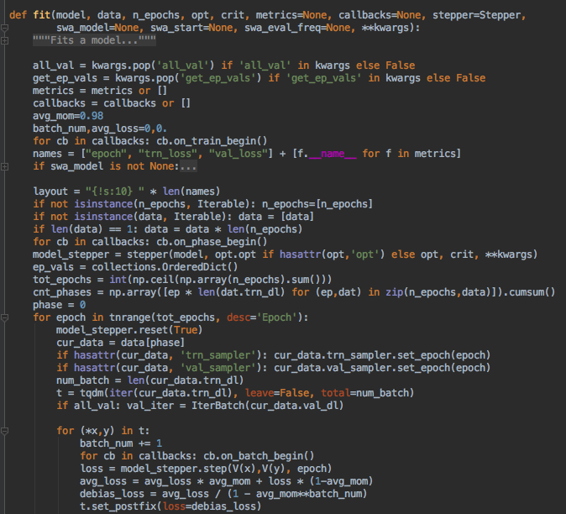

因此，任何使用`__iter__`方法的东西都可以充当迭代器 [[1:04:09]( data-href=)] 。 如果你还不知道， `yield`是你应该学习的一个简洁的Python关键词。 但它基本上输出一个东西，等待你要求另一件事 - 通常在for循环或其他东西中。 在这种情况下，我们首先初始化语言模型，将其传递给数字`nums`这是我们连接在一起的所有文档的数值化长列表。 我们要做的第一件事就是“批量”它。 这是你们很多人上次混淆的事情。 如果我们的批量大小是64，我们的列表中有2500万个数字。 我们不会创建长度为64的项目 - 我们总共创建了64个项目。 所以每个都是大小`t`除以64，即390k。 这就是我们在这里所做的：

`data = data.view(self.bs, -1).t().contiguous()`

我们对它进行取整，使得这个轴的长度为64，其他所有的东西都是`-1` （390k blob），我们将它转​置。 这意味着我们现在有64列，390k行。 那么我们每次进行迭代时我们都会获取一批一些序列长度，这约等于我们设置为70的`bptt` （后向维持时间）。我们只获取那么多行。 所以从`i`到`i+70`行，我们试着预测加一。 请记住，我们正在尝试预测我们所处的过去。

所以我们有64个列，每个列是我们2500万个标记的[1/64]( data-href=) ，而且是数十万个，我们一次[只能获取到]( data-href=) 70个 [[1:06:29]( data-href=)] 。 所以每一个列，每次我们获取它，它都会与前一列挂钩。 这就是我们获得这种一致性的原因。 这种语言模型是有状态的，这非常重要。

几乎所有语言模型中的很酷的东西都是从Stephen Merity的AWD-LSTM  [[1:06:59]( data-href=)] 中偷来的，包括这个小技巧：


如果我们总是一次获取70，然后我们回去做一个新迭代，我们每次都会获取完全相同的批次 - 没有随机性。 通常情况下，我们每次执行一个迭代时都会对数据进行打乱，或者每当我们获取一些数据时，我们会随机获取数据。 你不能用语言模型做到这一点，因为这个集合必须加入到前一个集合，因为它试图学习句子。 如果你突然跳到其他地方，那就没有任何意义了。 所以斯蒂芬的想法是说“好吧，因为我们不能改变顺序，而是随机改变序列长度”。 基本上，95％的时间，我们将使用`bptt` （即70）；但5％的时间，我们将使用一半。 然后他说“你知道什么，我甚至不打算做序列长度，我打算创建一个正态分布的随机数，其平均值和标准差为5，我会把它做成序列“所以序列长度是七十，这意味着每次我们经历时，我们的批次都会略有不同。 所以我们有一点额外的随机性。 杰里米问Stephen Merity他想出了这个想法，他是否想到了这个想法？ 他说：“我想我已经想到了，但我觉得我没想到这一点似乎很明显” - 每当Jeremy提出深入学习的想法时，情况就是如此。 看起来似乎很明显，你只是假设其他人已经想到了它。 但杰里米认为斯蒂芬想到了这一点。

如果你试图用数据加载器 [[1:08:55]( data-href=)] 做一些不寻常的事情，那么`LanguageModelLoader`是一件好事。 它是一个简单的角色模型，可用于从头开始创建数据加载器 - 这些模型可以将数据分批。

我们的语言模型加载器接收了所有连接在一起的文档以及批量大小和bptt  [[1:09:14]( data-href=)] 。

```python
trn_dl = LanguageModelLoader(np.concatenate(trn_lm), bs, bptt)  
val_dl = LanguageModelLoader(np.concatenate(val_lm), bs, bptt)  
md = LanguageModelData(PATH, 1, vs, trn_dl, val_dl, bs=bs,  bptt=bptt) 
```

现在一般来说，我们想要创建一个学习器，我们通常采用的方式是获取模型数据对象并调用某种具有各种名称但通常称为`get_model`的方法。 这个想法是模型数据对象有足够的信息来知道给你什么样的模型。 所以我们必须创建该模型数据对象，这意味着我们需要LanguageModelData类，这很容易做到 [[1:09:51]( data-href=)] 。

以下是所有部分。 我们将创建一个自定义学习器，一个自定义模型数据类和一个自定义模型类。 所以一个模型数据类，同样这个不继承任何东西，所以你真的看到几乎没什么可做的。最重要的是你需要告诉它你的训练集是什么（给它一个数据加载器），验证集是什么（给它一个数据加载器），还可以选择给它一个测试集（数据加载器），以及其他任何需要的东西。它可能需要知道bptt，它需要知道标记的数量（即词汇大小），并且它需要知道什么是填充索引。 因此它可以保存临时文件和模型，模型数据始终需要知道路径。 所以我们获取所有东西然后把它丢弃。 仅此而已。 这是整个初始化程序。 根本就没有逻辑。


然后所有的工作都发生在`get_model`  [[1:10:55]( data-href=)] 里面。 get_model调用我们稍后会看到的东西，它只是抓住了一个普通的PyTorch nn.Module架构，然后把它放在GPU上。 注意：使用PyTorch，我们会说`.cuda()` ，使用fastai最好说`to_gpu()` ，原因是如果你没有GPU，它会把它留在CPU上。 它还提供了一个全局变量，你可以设置它来选择它是否在GPU上，因此这是一种更好的方法。 我们将模型包装在`LanguageModel` ，而`LanguageModel`是`BasicModel`的子类，除了定义层组之外几乎什么都不做。 请记住，当我们在不同层次具有不同学习率或我们冻结不同数量的判别学习率时，我们不会为每一层提供不同的学习率，因为可能有一千层。 我们为每个层组提供不同的学习率。 因此，当你创建自定义模型时，你只需覆盖这一项，即返回所有层组的列表。 在这种情况下，最后一个层组包含模型的最后一部分和一点丢失。 其余部分（ `*`这里意味着拉开它）所以这将是每个RNN层的一层。 这就是全部。

最后把它变成一个学习器 [[1:12:41]( data-href=)] 。 所以学习器，你只需传入模型，然后将其变成学习器。 在这种情况下，我们已经覆盖了学习器，我们唯一做的就是说我希望默认的损失函数是交叉熵。 整套自定义模型，自定义模型数据，自定义学习器都适合单个屏幕。 他们总是基本上看起来像这样。

这个代码库的有趣部分是`get_language_model`  [[1:13:18]( data-href=)] 。 因为这给了我们AWD LSTM。 它实际上包含了很大的想法。 一个非常简单的大想法，这里的NLP社区中每个人都非常明显的认为，杰里米思考的这个想法是疯了。 也就是说，每个模型都可以被认为是一个主干和头部，如果你预训练骨干并坚持随机头，你可以进行微调，这是一个好主意。


这两段代码，实际上彼此相邻，这就是`fastai.lm_rnn`所有`fastai.lm_rnn` 。

`get_language_model` ：创建一个RNN编码器，然后创建一个`get_language_model`其的序列模型 - 线性解码器。

`get_rnn_classifier` ：创建一个RNN编码器，然后创建一个`get_rnn_classifier`其的序列模型 - 一个池化线性分类器。

我们马上就会看到这些差异，但你会得到基本的思想。 他们做的几乎是一样的。 他们有这个头，他们坚持在顶部的简单线性层。

**问题** ：之前有一个问题是，这是否可以转换为其他语言 [[1:14:52]( data-href=)] 。 是的，整个过程适用于任何语言。 你是否必须使用该语言在语料库中重新训练你的语言模型？ 必须！ 所以wikitext103预训练的语言模型知道英语。 你可以将它用作类似法语或德语模型的预训练开始，从头开始重新训练嵌入层可能会有所帮助。 中文，也许不是那么多。 但鉴于语言模型可以从任何未标记的文档中进行训练，你将永远不必这样做。 因为世界上几乎所有语言都有大量文本 - 你可以获取报纸，网页，会议记录等。只要你有几千个文档显示该语言的正常使用，你就可以创建一个语言模型。 我们的一位学生尝试了泰国人的这种方法，他说他建造的第一个模型轻松击败了之前最先进的泰国分类器。 对于那些属于国际同行的人来说，这是一种简单的方法，可以用来发表一篇论文，在这篇论文中，你可以用你的语言创建第一个分类器，或者用你的语言击败其他人的分类器。 然后，你可以告诉他们你已经学习了六个月的深度学习，并且惹恼了你们国家的所有学者。

这是我们的RNN编码器 [[1:16:49]( data-href=)] 。 它是标准的nn.Module。 它看起来比实际上还要多，但实际上我们创造了一个嵌入层，为每个被要求的层创建一个LSTM，就是这样。 其中的其他一切都是 Dropout。 基本上，AWS LSTM论文中的所有有趣内容（几乎都是）都是你可以dropout的所有地方。 那么向前基本上是一回事。 调用嵌入层，添加一些dropout，遍历每一层，调用该RNN层，将其附加到我们的输出列表，添加dropout，就是这样。 所以这很直接。


你想要阅读的论文是AWD LSTM论文，它正在[规范和优化LSTM语言模型]( data-href=) 。 它写得很好，非常容易阅读，并且完全在fastai内部实现 - 所以你可以看到该论文的所有代码。 很多代码实际上是斯蒂芬的擅长抄袭他的优秀GitHub回购[AWD LSTM]( data-href=) 。

该论文涉及其他论文。 对于为什么编码器权重和解码器权重相同的原因。 这是因为有一个叫做“绑定权重”的东西。在`get_language_model`里面，有一个叫做`tie_weights`的东西，默认为true。 如果这是真的，那么我们实际上对编码器和解码器使用相同的权重矩阵。 他们指向同一块内存。 这是为什么？ 它的结果是什么？ 这是斯蒂芬的论文中引用的一篇，也是一篇写得很好的论文，你可以查阅并了解权重搭配。


我们基本上有一个标准的RNN  [[1:19:52]( data-href=)] 。 它不标准的唯一原因是它有多种类型的 Dropout。 在RNN顶部的顺序模型中，我们坚持使用线性解码器，它实际上是代码屏幕的一半。 它有一个单独的线性层，我们将权重初始化到某个范围，我们添加一些 Dropout，就是这样。 所以这是一个带有 Dropout 的线性层。


所以语言模型是：

*   RNN→具有丢失的线性层

#### 选择 Dropout [[1:20:36]( data-href=)] 

你选择什么 Dropout 是很重要的。通过大量的实验，杰里米找到了一些 Dropout ，这些 Dropout 对语言模型的效果非常好。 但是，如果语言模型的数据较少，则需要更多的 Dropout 。 如果你有更多数据，更少的 Dropout 会更好。 你不想比你必须更多地规范。 Jeremy并没有必要调整这五件事中的每一件，而是说他们已经相互比较好了，所以只需调整这个数字（ `0.7`以下），我们就可以将它们全部加倍。 如果你过度拟合，那么你需要增大数值，如果你不合适，你需要减小数值。 因为除此之外，这些比例似乎相当不错。

```python
drops = np.array([0.25, 0.1, 0.2, 0.02, 0.15])*0.7 

learner= md.get_model(opt_fn, em_sz, nh, nl,  dropouti=drops[0], dropout=drops[1], wdrop=drops[2],  dropoute=drops[3], dropouth=drops[4]) 

learner.metrics = [accuracy]  learner.freeze_to(-1) 
```

#### 计算精度 [[1:21:45]( data-href=)] 

一个重要的想法可能看起来很小，但同样令人难以置信的争议是我们应该在看一个语言模型时测量准确率。 通常对于语言模型，我们会看到一个损失值，它只是交叉熵损失，但具体来说，我们几乎总是将这一点视为NLP社区称之为“困惑”的能力。 所以困惑只是`e^(cross entropy)` 。 基于交叉熵损失比较事物存在很多问题。 现在还不确定是否有时间详细介绍它，但基本问题在于它就像我们在焦点丢失方面所学到的那样。 交叉熵损失 - 如果你是对的，它希望你真的相信你是对的。 所以它真的惩罚了一个没有说“我确定这是错的”的模型，这是错误的。 准确率根本不在意你是多么自信 - 它关心你是否正确。 这通常是你在现实生活中关心的事情。 准确率是我们经常猜测下一个单词的频率，并且它是一个更稳定的数字来跟踪。 所以这是杰里米做的一件简单的小事。

```python
learner.model.load_state_dict(wgts) 

lr=1e-3  lrs = lr 

learner.fit(lrs/2, 1, wds=wd, use_clr=(32,2), cycle_len=1) 

epoch trn_loss val_loss accuracy  
	0 4.398856 4.175343 0.28551 

[4.175343, 0.2855095456305303]

learner.save('lm_last_ft') 

learner.load('lm_last_ft') 

learner.unfreeze() 

learner.lr_find(start_lr=lrs/10, end_lr=lrs*10, linear=True) 

learner.sched.plot() 
```

我们训练了一段时间，我们的交叉熵损失为3.9，相当于~49.40的困惑（ `e^3.9` ） [[1:23:14]( data-href=)] 。 为了让你了解语言模型所发生的事情，如果你看约18个月前的学术论文，你会看到他们讨论的是一百多种最先进的困惑。 我们理解语言和计算语言模型准确率或困惑的能力并不是理解语言的可靠代理。 如果我能猜出你接下来会说些什么，我需要很好地理解语言以及你可能会说得很好的事情。 令人困惑的数字刚刚下降到令人惊讶的程度，而且它会下降得更多。 在过去12-18个月的NLP中，它真的感觉像2011-2012计算机视觉。 我们开始了解转移学习和微调，基本模型变得更好。 你想到NLP能做什么和不能做什么的一切都很快就会过时。 还有很多东西，NLP明显不擅长。 就像在2012年，有很多东西计算机视觉不擅长。 但现在的变化非迅速，现在是非常好的时期，可以非常擅长NLP或者以NLP为基础创办初创公司，因为有两大堆电脑在两年前绝对不可思议，在两年前和现在不太好的东西，再过几年，他们会比人好得多。

```python
learner.fit(lrs, 1, wds=wd, use_clr=(20,10), cycle_len=15) 

epoch trn_loss val_loss accuracy  
    0 4.332359 4.120674 0.289563  
    1 4.247177 4.067932 0.294281  
    2 4.175848 4.027153 0.298062  
    3 4.140306 4.001291 0.300798  
    4 4.112395 3.98392 0.302663  
    5 4.078948 3.971053 0.304059  
    6 4.06956 3.958152 0.305356  
    7 4.025542 3.951509 0.306309 
    8 4.019778 3.94065 0.30756  
    9 4.027846 3.931385 0.308232  
    10 3.98106 3.928427 0.309011  
    11 3.97106 3.920667 0.30989  
    12 3.941096 3.917029 0.310515  
    13 3.924818 3.91302 0.311015  
    14 3.923296 3.908476 0.311586 

[3.9084756, 0.3115861900150776] 
```

**问题** ：你在一周 [[1:25:24]( data-href=)] 的纸质阅读与敲代码的比例是多少？ 天哪，你觉得怎么样，雷切尔？ 你看我。 我的意思是，结果显示更多时间是在敲代码，对吗？ “更多时间在敲代码。 我觉得每周也真的不一样“（瑞秋）。 有了这些边框的东西，有所有这些文件，没有通过它们的地图，所以我甚至不知道首先阅读哪一个，然后我读了引用，并且不理解它们中的任何一个。 所以在我甚至不知道如何开始敲代码之前，还有几周的阅读文章。 这是不寻常的。 每当我开始阅读一篇论文时，我总是相信，我不够聪明去理解它，无论论文是什么。 不知怎的，我最终做到了。 但我试着花费尽可能多的时间来敲代码。

几乎总是在我读完一篇论文 [[1:26:34]( data-href=)] 之后，即使在我读到这个问题之后，我正试图解决这个问题，我会停在那里尝试实现一些我认为可能会解决这个问题的想法。 然后我会回去阅读论文，我读到了关于这些问题的一些内容，我将如何解决这些问题，我会像“哦，这是一个好主意”，然后我会尝试实现这些。 这就是为什么，例如，实际上我没有实现SSD。 我的定制头与他们的头不一样。 这是因为我有点读了它的要点，然后我尽力创造出最好的东西，然后回到论文中，试着看看为什么。 所以当我到达焦点丢失纸时，雷切尔会告诉你，我为什么不能找到小物体而疯狂？ 怎么总是预测背景？ 我读了焦点丢失文件，我就像“这就是为什么!!”当你深刻理解他们试图解决的问题时，会好得多。 我确实找到绝大多数时间，当我读到解决问题的那篇文章的时候，我就像“是的，但是我想出了这三个想法，他们没有尝试。”然后你突然意识到你有新的想法。 或者，如果你只是盲目地实施论文，那么你往往没有更好的方法去做这些见解。

**问题** ：通过训练你的 Dropout 率是相同的，还是相应地调整它和相应的权重 [[1:26:27]( data-href=)] ？ 不同的 Dropout 非常有趣，最近有一些论文表明逐渐改变 Dropout  [[1:28:09]( data-href=)] 。 要么逐梯度小或逐梯度大，要么是个好主意，我不确定哪个。 也许我们中的一个人可以在一周内尝试找到它。 我没有看到它被广泛使用。 我用我写的最新论文尝试了一下，得到了一些好的结果。 我想我渐梯度小了，但我记不得了。

**问题** ：我认为这种语言模型是基于词嵌入构建的吗？ 尝试使用短语或句子嵌入是否有价值？ 我问这个是因为我前几天从谷歌那里看到了通用句码编码器 [[1:28:45]( data-href=)] 。 这要好得多。 这不仅仅是一个句子的嵌入，这是一个完整的模型。 按定义嵌入就像固定的东西。 句子或阶段嵌入始终是创建它的模型。 我们有一个试图理解语言的模型。 它不仅仅是短语或句子 - 它最终是一个文本，它不仅仅是我们在整个过程中进行训练的嵌入。 这是NLP多年来的一个巨大问题，现在这是他们必须嵌入的附件。 即使是社区最近对[AI2]( data-href=) （艾伦人工智能研究所）最感兴趣的论文称为ELMo--他们在许多模型中发现了更好的结果，但同样是嵌入式。 他们采用固定的模型并创建了一组固定的数字，然后将它们输入模型中。 但是在计算机视觉方面，我们多年来已经知道这种具有固定功能的方法，它们被称为计算机视觉中的超级列，人们在3或4年前停止使用它们，因为微调整个模型的工作量很大更好。 对于那些花费了大量时间使用NLP且没有太多时间使用计算机视觉的人，你将不得不开始重新学习。 所有这些东西都被告知这个想法，有些东西叫做嵌入，你提前学习它们，然后你应用这些固定的东西，无论是单词级别还是短语级别或者其他级别 - 不要这样做。 你希望实际创建一个预训练好的模型并对其进行端到端的微调，然后你将看到一些特定的结果。

**问题** ：为了使用准确率而不是困惑度作为模型的度量，我们可以将其用于损失函数而不是仅仅将其用作度量 [[1:31:21]( data-href=)] 吗？ 不，你永远不想这样做，无论是计算机视觉还是NLP或其他什么。 它太坎坷了。 因此，交叉熵可以作为损失函数。 而且我不是说，而是使用它。 我认为查看准确度并查看交叉熵是很好的。但是对于你的损失函数，你需要一些漂亮而顺畅的东西。准确率不是很好。

```python
learner.sav('lm1')
learner.save_encoder('lm1_enc')
```

#### `save_encoder` [[1:31:55]( data-href=)] 

你会看到有两种不同的版本`save`。`save`按照惯例保存整个模型。`save_encoder`只是保存那个位：


换句话说，在顺序模型中，它只是保存`rnn_enc`而不是`LinearDecoder(n_tok, emb_sz, dropout, tie_encoder=enc)`（这实际上使它成为语言模型的位）。我们不关心分类器中的那一点，我们只关心`rnn_end`。这就是我们在这里保存两种不同型号的原因。

```python
learner.sched.plot_loss()
```

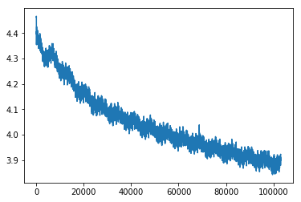

#### 分类器标记 [[1:32:31]( data-href=)] 

我们现在创建分类器。我们将很快过一遍这个，因为它是一样的。但是当你在本周回去看看代码时，说服自己也是如此。

```python
df_trn = pd.read_csv(CLAS_PATH/'train.csv'，header=None，chunksize=chunksize)
df_val = pd.read_csv(CLAS_PATH/'test.csv'，header=None，chunksize=chunksize)

tok_trn，trn_labels = get_all(df_trn，1)
tok_val，val_labels = get_all(df_val，1)

0
1
0
1

(CLAS_PATH/'tmp').mkdir(exist_ok=True)

np.save(CLAS_PATH/'tmp'/'tok_trn.npy'，tok_trn)
np.save(CLAS_PATH/'tmp'/'tok_val.npy'，tok_val)

np.save(CLAS_PATH /'tmp'/'trn_labels.npy'，trn_labels)
np.save(CLAS_PATH /'tmp'/'val_labels.npy'，val_labels)

tok_trn = np.load(CLAS_PATH /'tmp'/'tok_trn.npy')
tok_val = np.load(CLAS_PATH /'tmp'/'tok_val.npy')
```

我们不创建新的`itos`词汇表，我们显然希望使用我们在语言模型中使用的相同词汇表，因为我们即将重新加载相同的编码器 [[1:32:48]( data-href=)] 。

```python
itos = pickle.load((LM_PATH/'tmp'/'itos.pkl').open('rb'))
stoi = collections.defaultdict(lambda:0, {v:k for k,v in 
                                          enumerate(itos)})
len(itos)

60002

trn_clas = np.array([[stoi[o] for o in p] for p in tok_trn])
val_clas = np.array([[stoi[o] for o in p] for p in tok_val])
np.save(CLAS_PATH/'tmp'/'trn_ids.npy', trn_clas)
np.save(CLAS_PATH/'tmp'/'val_ids.npy', val_clas)
```

#### 分类

```python
trn_clas = np.load(CLAS_PATH/'tmp'/'trn_ids.npy')
val_clas = np.load(CLAS_PATH/'tmp'/'val_ids.npy')

trn_labels = np.squeeze(np.load(CLAS_PATH/'tmp'/'trn_labels.npy'))
val_labels = np.squeeze(np.load(CLAS_PATH/'tmp'/'val_labels.npy'))
```

模型超参数的构造是相同的 [[1:33:16]( data-href=)] 。我们可以改变 Dropout 率。选择一个尽可能大的批量大小，不会耗尽内存。

```python
bptt,em_sz,nh,nl = 70,400,1150,3
vs = len(itos)
opt_fn = partial(optim.Adam, betas=(0.8, 0.99))
bs = 48

min_lbl = trn_labels.min()
trn_labels -= min_lbl
val_labels -= min_lbl
c=int(trn_labels.max())+1
```

#### TextDataset  [[1:33:37]( data-href=)] 

这一点很有趣。这里发生了有趣的事情。

```python
trn_ds = TextDataset(trn_clas, trn_labels)
val_ds = TextDataset(val_clas, val_labels)
```

这里的基本思想是，对于分类器，我们确实想要查看一个文本。这份文本是正面还是负面？所以我们确实希望改组文件。但是这些文件有不同的长度，所以如果我们把它们全部放在一个批次里（这是fastai为你做的一件好事） - 你可以将不同长度的东西粘在一起，它会自动拍它们，所以你不要我不得不担心这一点。但如果它们的长度差别很大，那么你将浪费大量的计算时间。如果有一个东西长2000字，其他一切都是50字长，这意味着你最终会有2000宽张量。这很烦人。詹姆斯·布拉德伯里是斯蒂芬·梅西蒂的同事之一，也是那个想出了 PyTorch 的人，想出了一个“让我们”的简洁主意。按长度排序数据集“。总而言之，列表中的第一件事总是比最后的东西短，但也有点随机。

以下是杰里米如何实施 [[1:35:10]( data-href=)] 。我们需要的第一件事是数据集。所以我们有一个数据集传递文件及其标签。以下是PyTorch的`TextDataSet`继承`Dataset`和`Dataset`退出：


实际上`Dataset`根本没有做任何事 [[1:35:34]( data-href=)] 。它说`__getitem__`如果你没有它就需要你，你会得到一个错误。同样如此`__len__`。所以这是一个抽象类。要`TextDataset`，我们将在我们的传递`x`和`y`，并`__getitem__`会抓住`x`和`y`，并返回它们-它不能简单得多。可选地，1。他们可以反转它，2。在末尾粘住流的末端，3。在开始时粘贴流的开始。但是，我们没有做任何的那些东西，所以从字面上我们所做的是把`x`与`y`和`__getitem__`将它们作为一个元组。然而，长度是多长的`x`。这`Dataset`就是 - 你可以索引长度的东西。

#### 把它变成DataLoader  [[1:36:27]( data-href=)] 

```python
trn_samp = SortishSampler(trn_clas, key=lambda x: len(trn_clas[x]), 
                          bs=bs//2)
val_samp = SortSampler(val_clas, key=lambda x: len(val_clas[x]))

trn_dl = DataLoader(trn_ds, bs//2, transpose=True, num_workers=1,
                    pad_idx=1, sampler=trn_samp)
val_dl = DataLoader(val_ds, bs, transpose=True, num_workers=1, 
                    pad_idx=1, sampler=val_samp)
md = ModelData(PATH, trn_dl, val_dl)
```

要将它转换为DataLoader，你只需将数据集传递给DataLoader构造函数，现在它将一次为你提供一批。通常你可以说shuffle等于true或shuffle等于false，它会决定是否为你随机化它。但在这种情况下，我们实际上将传入一个sampler参数，而sampler是一个我们要定义的类，它告诉数据加载器如何进行shuffle。

*   对于验证集，我们将定义实际上只是排序的东西。它只是确定性地对它进行排序，以便所有最短的文档都在开头，所有最长的文档将在最后，这将最小化填充量。
*   对于训练采样器，我们将创建一个名为sort-ish sampler的东西，它也可以排序（ish！）

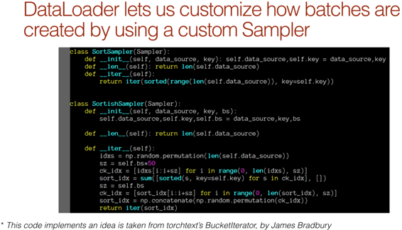

PyTorch的优点在于他们为数据加载器提出了这个想法，我们可以挂钩新类，使其以不同的方式运行 [[1:37:27]( data-href=)] 。 SortSampler的长度是数据源的长度，并且有一个迭代器，它只是一个迭代器，它通过按长度排序的数据源（传入as`key`）。对于SortishSampler，它基本上做了同样的事情，有一点随机性。这是Jeremy发现的PyTorch中另一个漂亮的设计。他可以采用詹姆斯·布拉德伯里的想法，他已经编写了一套全新的类，他可以在PyTorch中使用内置的钩子。你会注意到数据加载器实际上并不是PyTorch的数据加载器 - 它实际上是fastai的数据加载器。但它几乎完全是从PyTorch抄袭的，但在某些方面进行了定制，主要是使用多线程而不是多进程来加快速度。

**问题**：预训练的LSTM深度是否`bptt`需要与我们正在训练的新训练 [[1:39:00]( data-href=)]  相匹配？不，`bptt`根本不需要匹配。这就像我们一次看多少东西一样。它与架构无关。

所以现在我们可以在`get_rnn_classifier` [[1:39:16]( data-href=)]  之前调用我们刚才看到的那个函数。它将或多或少地创建完全相同的编码器，我们将传递与以前相同的架构细节。但是这一次，在我们添加的头脑中，你还可以做更多的事情。一个是你可以添加多个隐藏层。在`layers=[em_sz*3, 50, c]`：

*   `em_sz * 3` ：这就是我头部（即分类器部分）的输入。
*   `50` ：这是第一层的输出
*   `c` ：这是第二层的输出

你可以添加任意数量的内容。所以你基本上可以在最后创建一个小的多层神经网络分类器。同样地，因为`drops=[dps[4], 0.1]`这些是每个这些层之后的 Dropout 者。

```python
 # part 1
dps = np.array([0.4, 0.5, 0.05, 0.3, 0.1])
dps = np.array([0.4,0.5,0.05,0.3,0.4])*0.5
m = get_rnn_classifer(bptt, 20*70, c, vs, emb_sz=em_sz, n_hid=nh, 
                      n_layers=nl, pad_token=1,
                      layers=[em_sz*3, 50, c], drops=[dps[4], 0.1],
                      dropouti=dps[0], wdrop=dps[1],        
                      dropoute=dps[2], dropouth=dps[3])
opt_fn = partial(optim.Adam, betas=(0.7, 0.99))
```

我们将像以前一样使用RNN_Learner。

```python
learn = RNN_Learner(md, TextModel(to_gpu(m)), opt_fn=opt_fn)
learn.reg_fn = partial(seq2seq_reg, alpha=2, beta=1)
learn.clip=25.
learn.metrics = [accuracy]
```

我们将使用不同层次的判别学习率 [[1:40:20]( data-href=)] 。

```python
lr=3e-3
lrm = 2.6
lrs = np.array([lr/(lrm**4), lr/(lrm**3), lr/(lrm**2), lr/lrm, lr])

lrs=np.array([1e-4,1e-4,1e-4,1e-3,1e-2])
```

你可以尝试使用权重递减。Jeremy一直在尝试着，看看会发生什么。

```python
wd = 1e-7
wd = 0
learn.load_encoder('lm2_enc')
```

我们刚刚开始训练最后一层，我们得到92.9％的准确率：

```python
learn.freeze_to(-1)

learn.lr_find(lrs/1000)
learn.sched.plot()

learn.fit(lrs, 1, wds=wd, cycle_len=1, use_clr=(8,3))

epoch      trn_loss   val_loss   accuracy                      
    0      0.365457   0.185553   0.928719
    
[0.18555279, 0.9287188090884525]

learn.save('clas_0')
learn.load('clas_0')
```

然后我们解冻一层，获得93.3％的准确率：

```python
learn.freeze_to(-2)
learn.fit(lrs, 1, wds=wd, cycle_len=1, use_clr=(8,3))
epoch      trn_loss   val_loss   accuracy                      
    0      0.340473   0.17319    0.933125
[0.17319041, 0.9331253991245995]
learn.save('clas_1')
learn.load('clas_1')
learn.unfreeze()
learn.fit(lrs, 1, wds=wd, cycle_len=14, use_clr=(32,10))
epoch      trn_loss   val_loss   accuracy                      
    0      0.337347   0.186812   0.930782  
    1      0.284065   0.318038   0.932062                      
    2      0.246721   0.156018   0.941747                      
    3      0.252745   0.157223   0.944106                      
    4      0.24023    0.159444   0.945393                      
    5      0.210046   0.202856   0.942858                      
    6      0.212139   0.149009   0.943746                      
    7      0.21163    0.186739   0.946553                      
    8      0.186233   0.1508     0.945218                      
    9      0.176225   0.150472   0.947985                      
    10     0.198024   0.146215   0.948345                      
    11     0.20324    0.189206   0.948145                      
    12     0.165159   0.151402   0.947745                      
    13     0.165997   0.146615   0.947905
[0.14661488, 0.9479046703071374]
learn.sched.plot_loss()
learn.save('clas_2')
```

然后我们微调整个东西 [[1:40:47]( data-href=)] 。这是我们的论文在使用预训练的模型之前的主要尝试：

[在翻译中学到：语境化的单词向量]( data-href=)

他们所做的是他们使用了预训练过的翻译模型，但他们没有对整个事情进行微调。刚刚他们接受了翻译模型的激活，当他们尝试IMDb时，他们得到了91.8％ - 我们只在微调一层后轻松击败。它们不是最先进的，最先进的是94.1％，我们在对整个事物进行了3个时期的微调之后击败了它们，到最后，我们达到了94.8％，这显然是一个巨大的差异，因为在错误率方面，这已经从5.9％完成了。一个简单的小技巧是回到这个笔记本的开头并颠倒所有文档的顺序，然后重新运行整个事情。当你到达所说的位时`fwd_wt_103`，替换`fwd`为forward`bwd`为了落后。这是一个落后的英语语言模型，学习向后阅读英语。因此，如果你重做整个事情，将所有文档反向放置，并将其更改为向后，你现在有第二个分类器，它根据反向文档通过正面或负面情绪对事物进行分类。如果你接着两个预测并取其平均值，你基本上就有了一个双向模型（你分别训练每个位），这使你达到95.4％的准确率。所以我们基本上把它从5.9％下调到了4.6％。所以这种20％的最新技术变化几乎闻所未闻。它不会经常发生。所以你可以看到这种使用转移学习的想法，每个新领域都认为他们的新领域太特殊而你无法做到，这是非常强大的。所以这是我们所有人的好机会。

#### 用于文本分类的通用语言模型微调 [[1:44:02]( data-href=)] 

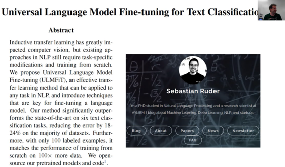

所以我们把它变成了一篇论文，当我说我们的时候，我和这个家伙塞巴斯蒂安·鲁德做了这件事。现在你可能还记得他的名字，因为在第5课，我告诉过你我实际上和塞巴斯蒂安分享了第4课，因为我认为他是一位很棒的研究员，我认为他很喜欢。我根本不认识他。令我惊讶的是，实际上他看了视频。他观看了整个视频并说：

塞巴斯蒂安：“那真是太棒了！我们应该把它变成一篇论文。“

杰里米：“我不写论文。我不关心论文而且对论文不感兴趣 - 这听起来很无聊“

塞巴斯蒂安：“好的，我为你写这篇论文怎么样。”

Jeremy：“你还不能写一篇关于这个的论文，因为你必须做类似的研究，将它与其他事物（它们被称为消融研究）进行比较，以确定哪个部分真正起作用。这里没有严格，我只是把我头脑中的所有东西放在一起，把它们放在一起，它恰巧工作“

塞巴斯蒂安：“好吧，如果我写完所有的论文并完成你所有的消融研究（ablation studies），我们可以写论文吗？”

杰里米：“好吧，它就像一个我没有记录的整个库，我不打算记录并且你不知道它是如何运作的”

塞巴斯蒂安：“好吧，如果我写论文，进行消融研究，并从头开始弄清楚代码是如何工作而不打扰你的，那么我们可以写论文吗？”

杰里米：“嗯......是的，如果你做了所有这些事情，那么我们就可以写论文了。好的！”

然后两天后，他回来说“好吧，我已经完成了论文的草稿。”所以，我分享这个故事说，如果你是爱尔兰的学生，你想做好工作，不要让任何人阻止你。至少说我没有鼓励他。但最后，他说“我想做这项工作，我认为这将是好的，我会弄清楚”，他写了一篇精彩的论文。他做了消融研究，他想出了fastai的工作原理，现在我们正计划再写一篇论文。你必须要小心一点，因为有时我会从不同的人那里得到消息，说“我有很多好主意，我们可以喝杯咖啡吗？” - “我不想......我随时可以在办公室里喝咖啡，谢谢“。但是说“嘿，我接受了你的想法，我写了一篇论文，这是非常不同的，我做了一堆实验，我弄清楚你的代码是如何工作的，我添加了文档 - 我们应该把它提交给会议吗？“你明白我的意思了？没有什么可以阻止你做出惊人的工作，如果你做了惊人的工作，帮助别人，在这种情况下，我很高兴我们有一篇论文。我并不特别关心论文，但我认为这些想法现在已经进行了严格的研究，这很酷。

#### 让我告诉你他做了什么 [[1:47:19]( data-href=)] 

他拿走了我所有的代码，所以我已经完成了所有的fastai.text，正如你所看到的那样，它让我们可以使用大型语料库。塞巴斯蒂安的阅读非常精彩，他说“这是一篇论文，Yann LeCun和一些人刚出来，他们尝试了很多分类数据集，所以我将尝试在所有这些数据集上运行你的代码。”所以这些是数据集：


他们中的一些人有很多成千上万的文件，他们比我试过的要大得多 - 但我认为它应该有效。

当我们一起去的时候，他有一些好主意，所以你应该完全确保你阅读了论文。他说：“好吧，你在课程中称这种差异学习率，差别化意味着别的东西。也许我们应该重命名它“所以我们重命名它。它现在被称为判别学习率。因此，我们从第一部分开始，我们在不同的层次上使用不同的学习率，在做了一些文献研究之后，看起来确实没有像以前那样做过，所以它现在正式成为一种事物 - 歧视学习率。这是我们在第一课中学到的东西，但现在它与希腊语和一切 [[1:48:41]( data-href=)]  有一个等式：

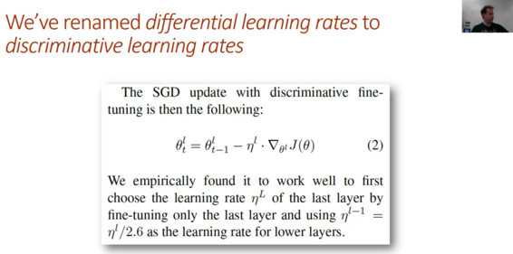

当你看到希腊语和所有事物的等式时，这并不一定意味着它比我们在第1课中所做的任何事情都复杂，因为这不是。

同样，这种想法一次解冻一层也似乎从来没有做过，所以它现在已成为一件事，并且它有一个非常聪明的名字“逐渐解冻” [[1:48:57]( data-href=)] 。


#### 倾斜三角学习率 [[1:49:10]( data-href=)] 

那么，正如所承诺的那样，我们将研究倾斜的三角学习率。这实际上不是我的想法。莱斯利史密斯，我最喜欢的研究人员之一，你们现在都知道，不久前给我发了电子邮件，并说：“我对周期性的学习率非常高兴。我不再这样做了。我现在做一个略有不同的版本，我有一个周期在开始时快速上升，然后慢慢下降。我经常发现它的效果更好。“我已经尝试过回到我所有的旧数据集，它对所有这些都有效 - 我尝试过的每一个。所以这就是学习率的样子。你可以在fastai中使用它，只需添加`use_clr=`到你的`fit`。第一个数字是最高学习率和最低学习率之间的比率，因此初始学习率是峰值的1/32。第二个数字是第一个峰值和最后一个峰值之间的比率。基本的想法是，如果你正在做一个周期长度10，你想要第一个时期是向上位，其他9个时期是向下位，那么你将使用10.我发现它工作得很好，那是莱斯利的建议是将大约1/10的向上位和9/10向下位。自从他告诉我这件事，也许两天前，他写了这篇惊人的论文：[对神经网络超参数的一种纪律处理方法]( data-href=)。其中，他描述的内容与此略有不同，但同样基本的想法。这是必读的论文。它有各种各样的想法，fastai深入讨论了很多，没有其他人在谈论这个。这是一种艰难的过程，不幸的是，Leslie在他真正有时间正确编辑它之前不得不离开，所以读取有点慢，但不要让它阻止你。太奇妙了。

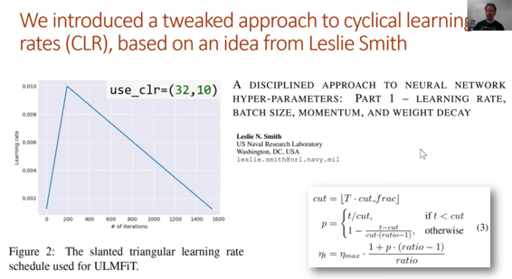

右边的等式来自我与塞巴斯蒂安的论文。塞巴斯蒂安问“杰里米，你能把你写的代码背后的数学方程式发给我吗？”然后我说“不，我只是写了代码。我无法把它变成数学“因此他想出了它的数学。

#### Concat汇集 [[1:51:36]( data-href=)] 

所以你可能已经注意到，我们的分类器的第一层等于嵌入大小* 3。为什么是3次？因为迭代3次，再次这似乎是人们以前没有做过的事情，所以一个新的想法“concat pooling”。我们采用激活序列的平均汇集，激活序列的最大汇集以及最终激活集合，并将它们连接在一起。这是我们在第1部分中讨论的内容，但之前似乎没有出现在文献中，所以它现在被称为“concat pooling”，它现在得到了一个等式，但这是整个实现。因此，你可以阅读本文，了解fastai代码如何实现每个部分。


#### BPT3C  [[1:52:46]( data-href=)] 

其中一个有趣的部分是`RNN_Encoder`你已经看过的和MultiBatchRNN编码器之间的区别。那有什么不同呢？关键的区别在于语言模型的普通RNN编码器，我们可以`bptt`一次做块。但对于分类器，我们需要完成整个文档。在我们决定是正面还是负面之前，我们需要进行整部电影评论。整个电影评论可以很容易地长达2000字，我的GPU内存中的每一个权重都不能容纳2000字左右的梯度。那么我们该怎么办？所以这个想法非常简单，我一次完成一批整个序列长度`bptt`。我调用`super().forward`（换句话说，就是`RNN_Encoder`）获取它的输出，然后我得到了这个最大序列长度参数，它说“好吧，只要你不超过那个序列长度，然后开始将它附加到我的输出列表。”所以在其他单词，它发送回这个池的东西只有我们要求它保留的那么多激活。这样，你就可以弄清楚`max_seq`你的特定GPU可以处理什么。所以它仍在使用整个文档，但让我们说`max_seq`是1000字，你最长的文件长度是2000字。它仍然通过RNN为前千个单词创建状态，但它实际上并不会存储第一千个单元的backprop的激活。它只会保留最后一千。所以这意味着它无法将损失反向传播回在前千字中创建的任何状态 - 基本上现在已经消失了。所以这是一段非常简单的代码，老实说，当我写这篇文章时，我并没有花太多时间去思考它，这显然是唯一可行的方法。但同样，它似乎是一个新事物，所以我们现在有时间进行文本分类。你可以看到本文中有很多小部分。

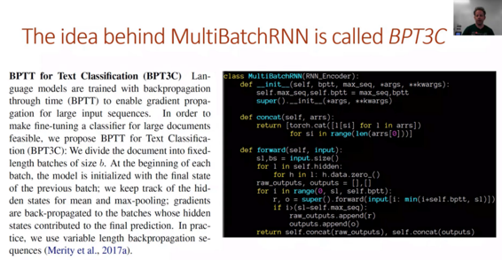

#### 结果 [[1:55:56]( data-href=)] 

结果是什么？在我们尝试的每一个数据集上，我们得到的结果都比之前的任何学术论文的文本分类都要好。所有不同的类型。老实说，IMDb是我在任何时候都在尝试优化模型的唯一一个，所以大多数人，我们只是先做了一切。因此，如果我们真的花时间，我认为这会好很多。这些比较的东西，大多数在每个表上是不同的，因为它们总体上是定制的算法。所以这就是说一个简单的微调算法可以击败这些真正定制的算法。


#### 消融研究 [[1:56:56]( data-href=)] 

以下是塞巴斯蒂安所做的消融研究。我真的非常希望如果你要发表一篇论文，我们不得不说它有效的原因。因此，塞巴斯蒂安试图删除我提到的所有不同的贡献。那么我们什么不使用渐进式冷冻？如果我们不使用歧视性学习率怎么办？如果不是歧视率，我们使用cosign退火怎么办？如果我们不对维基百科进行任何预训练怎么办？如果我们不做任何微调怎么办？对我来说真正有趣的是，如果我们只使用了一百个训练样例（对比200，对比500等），那么IMDb的验证错误率是多少。你可以非常有趣地看到，这种方法的完整版本在一百个训练样例中几乎同样准确 - 它仍然非常准确，而不是完整的20,000个训练样例。就像你从头开始训练100，它几乎是随机的。这是我的预期。我已经对塞巴斯蒂安说过，我真的认为当你没有太多数据时，这是最有益的。这就是fastai最感兴趣的地方 - 小数据机制，小型计算机制等等。所以他做了这些研究来检查。


### 进行消融研究的技巧 [[1:58:32]( data-href=)] 

#### 技巧＃1：VNC

第一个技巧是我知道你会发现非常方便的东西。我知道当你在Jupyter笔记本上运行某些东西时你已经十分愤怒了，很长时间的网络未连接，所以它认为你已经关闭了，然后你的会话就消失了，你必须重新开始。所以你会怎么做？有一个非常简单的名为VNC的东西，你可以在AWS实例或PaperSpace上安装，或者其他任何东西：

*   X Windows（`xorg`）
*   轻量级窗口管理器（`lxde-core`）
*   VNC服务器（`tightvncserver`）
*   Firefox（`firefox`）
*   终端（`lxterminal`）
*   一些字体（`xfonts-100dpi`）

将行放在`./vnc/xstartup`配置文件的末尾，然后运行此命令（`tightvncserver :13 -geometry 1200x900`）：


它现在正在运行一个服务器，你可以在其中运行TightVNC Viewer或计算机上的任何VNC查看器，并将其指向你的服务器。但具体来说，你所做的是使用SSH端口转发到forward:5913到localhost:5913：


然后连接到localhost上的端口5013。它会将它发送到服务器上的端口5913，这是VNC端口（因为你说过`:13`），它将显示一个X Windows桌面。然后，你可以单击Linux start like按钮并单击Firefox，你现在拥有Firefox。你在Firefox中看到它，它说localhost因为这个Firefox在我的AWS服务器上运行。因此，你现在运行Firefox，开始运行，然后关闭VNC查看器，记住Firefox正在此虚拟VNC显示器上显示，而不是在真实显示中，因此在当天晚些时候，你将重新登录到VNC查看器，它再次弹出。所以它就像一个持久的桌面，它的速度非常快。它的效果非常好。有很多不同的VNC服务器和客户端，但这个对我来说很好。

#### 技巧＃2：Google Fire  [[2:01:27]( data-href=)] 


技巧＃2是创建Python脚本，这就是我们最终做的事情。所以我最终为塞巴斯蒂安创建了一个小的Python脚本，说这是你需要做的基本步骤，现在你需要为其他一切创建不同的版本。我向他建议他尝试使用这个名为Google Fire的东西。Google Fire所做的是，你创建了一个包含大量参数的函数，所以这些都是塞巴斯蒂安想要尝试做的事情 - 不同的 Dropout 量，不同的学习率，我是否使用预训练，我使用CLR还是不，我是否使用判别学习率等等。所以你创建一个函数，然后添加一些说法：

```python
if __name__ == '__main__': fire.Fire(train_clas)） 
```

你什么都不做 - 你不必添加任何元数据，任何文档字符串，任何东西，然后你调用该脚本并自动生成一个命令行界面。这是在终端中运行许多不同变体的极好的简单方法。如果你想做很多变化而不是使用笔记本，这最终会变得更容易，因为你可以只使用一个bash脚本来尝试所有这些并将它们全部输出来。

#### 技巧＃3：IMDb脚本 [[2:02:47]( data-href=)] 

你会在里面找到`courses/dl2`，现在有一些叫做的东西`imdb_scripts`，我把塞巴斯蒂安和我用过的所有脚本都放了。因为我们需要对每个数据集进行分词和数值化，然后为每个数据集训练语言模型和分类器。我们必须以各种不同的方式做所有这些事情来比较它们，所以我们有所有这些事情的脚本。你可以查看并查看我们使用的所有脚本。


#### 技巧＃4：pip install -e  [[2:03:32]( data-href=)] 

当你做很多脚本时，你会得到不同的代码。最终，你不希望一次又一次地对你的fastai库进行符号链接，这可能会让你感到沮丧。但是你可能不想pip安装它，因为当我们移动得如此之快以至于你想在Git中使用当前版本时，该版本往往有点旧。如果你说`pip install -e .`来自fastai repo base，它确实做了一些非常简洁的事情，它基本上是在site-packages目录中创建一个到fastai库（即你的本地克隆的Git repo）的符号链接。你的site-packages目录是你的主要Python库。因此，如果你这样做，你可以从任何地方访问fastai，但每次都这样做`git pull`，你有最新的版本。这样做的一个缺点是它从pip安装了任何更新版本的软件包，这可能会使Conda有点混淆，所以这里的另一个选择就是将fastai库符号链接到你的站点软件包库。这也很有效。你可以从任何地方使用fastai，当你想要从系统上的不同目录运行使用fastai的脚本时，它非常方便。

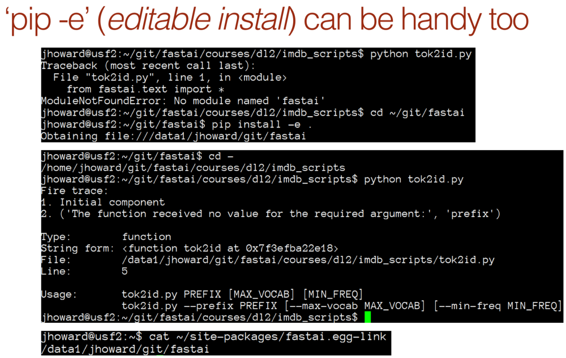

#### 技巧＃5：SentencePiece  [[2:05:06]( data-href=)] 

如果你愿意，这是你可以尝试的。你不必进行分词。你可以将所谓的子词单元标记​化，而不是标记单词。例如，“无监督”可以被标记为“un”和“supervised”。 “Tokenizer”可以被标记为[“token”，“izer”]。然后你可以做同样的事情。适用于子单词单元的语言模型，适用于子单词单元的分类器等。这有效吗？我开始使用它但是没有频繁的使用，我得到的分类结果几乎与使用字级分词一样好 - 不太好，但几乎一样好。我怀疑经过更仔细的思考和尝试，也许我可以变得更好或更好。但即使我不能，如果你创建一个子字单元wiki文本模型，那么IMDb语言模型，然后分类器向前和向后，然后将它与向前和向后的单词级别合并，你应该能够击败我们。所以这里有一种方法可以击败我们最先进的结果。


塞巴斯蒂安告诉我这个特别的项目 - 谷歌有一个名为句子和平（sentence peace）的项目，它实际上使用神经网络来找出单词的最佳分割，因此你最终得到了子单词单词的词汇。在我的尝试中，我发现创造大约30,000个子单词单元的词汇似乎是最佳的。如果你有兴趣，可以试试。安装它有点痛苦 - 它是C ++，没有创建错误消息，但它会起作用。有一个Python库。如果有人试图这样做，我很乐意帮助他们实现这一目标。对于整合子词和词级分类的实验很少（如果有的话），我认为它应该是最好的方法。

祝你度过愉快的一周！
