# 深度学习：第二部分第十课

#### [视频](https://youtu.be/h5Tz7gZT9Fo) / [论坛](http://forums.fast.ai/t/part-2-lesson-10-wiki/14364/1)


#### 回顾上周[ [0:16](https://youtu.be/h5Tz7gZT9FoY%3Ft%3D16s) ]

*   许多学生正在努力学习上周的材料，所以如果你觉得很难，那很好。 杰里米预先把它放在那里的原因是我们有一些东西要思考，思考，并逐渐努力，所以在第14课，你将得到第二个裂缝。
*   要理解这些碎片，您需要了解卷积层输出，感受域和损失函数的形状 - 无论如何，这些都是您需要了解的所有深度学习研究的内容。
*   一个关键的问题是我们从简单的东西开始 - 单个对象分类器，没有分类器的单个对象边界框，然后是单个对象分类器和边界框。 除了我们首先必须解决匹配问题之外，我们去多个对象的位实际上几乎相同。 我们最终创建了比我们的基础真实边界框所需的激活更多的激活，因此我们将每个地面实况对象与这些激活的子集相匹配。 一旦我们完成了这个，我们对每个匹配对做的损失函数几乎与这个损失函数（即单个对象分类器和边界框的一个）相同。
*   如果您感觉困难，请返回第8课，确保您了解数据集，DataLoader，最重要的是了解损失函数。
*   因此，一旦我们有一些可以预测一个对象的类和边界框的东西，我们通过创建更多激活来进入多个对象[ [2:40](https://youtu.be/h5Tz7gZT9Fo%3Ft%3D2m40s) ]。 然后我们必须处理匹配问题，处理了一个匹配问题，然后我们将每个锚箱移入和移出一点点左右，所以他们试图与特定的地面实例对象进行对齐。
*   我们谈到了我们如何利用网络的卷积性质来尝试进行具有与我们预测的基本事实对象类似的接受场的激活。 Chloe提供了以下精彩图片来讨论SSD_MultiHead.forward一行一行：

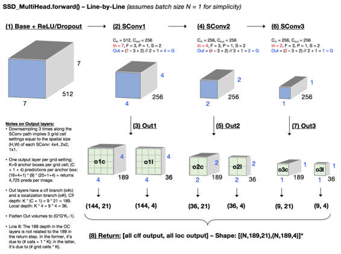

<figcaption class="imageCaption">作者： [Chloe Sultan](http://forums.fast.ai/u/chloews)</figcaption>


Chloe在这里所做的是她特别关注路径中每个点处张量的维数，因为我们使用步幅2卷积逐渐下采样，确保她理解为什么这些网格大小发生然后理解输出是如何产生的。


*   这是你必须记住这个`pbd.set_trace()` 。 我刚刚上课前进入`SSD_MultiHead.forward`并输入了`pdb.set_trace()`然后我运行了一个批处理。 然后我可以打印出所有这些的大小。 我们犯了错误，这就是为什么我们有调试器并且知道如何检查事物并一路上做一些小事。
*   然后我们讨论了增加_k_ [ [5:49](https://youtu.be/h5Tz7gZT9Fo%3Ft%3D5m49s) ]，这是每个卷积网格单元的锚箱数量，我们可以用不同的缩放比例，宽高比进行处理，这给我们提供了大量的激活，因此预测了边界框。
*   然后我们使用非最大抑制去了一个小数字。
*   非最大抑制是一种hacky，丑陋和完全启发式，我们甚至没有谈论代码，因为它看起来很可怕。 最近有人提出了一篇论文，试图用一个端到端的转发网来取代那个NMS（ [https://arxiv.org/abs/1705.02950](https://arxiv.org/abs/1705.02950) ）。

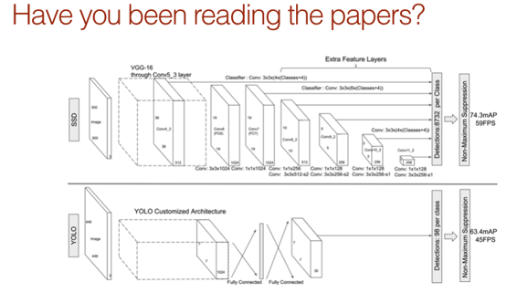

*   没有足够的人在阅读论文！ 我们现在在课堂上所做的是实施论文，论文是真正的基本事实。 而且我想你通过与人们交谈了解人们不读纸的原因很多，因为很多人都不认为他们有能力读报纸。 他们认为他们不是那种阅读论文的人，但你是。 你在这里。 我们上周开始查看一篇论文，我们读到的是英文单词，我们对它们有很大的了解。 如果你仔细看看上面的图片，你会发现`SSD_MultiHead.forward`没有做同样的事情。 然后你可能想知道这是否更好。 我的回答可能是。 因为SSD_MultiHead.forward是我尝试过的第一件事。 在这篇与YOLO3论文之间，它们可能是更好的方法。
*   有一点你会特别注意到他们使用较小的k，但他们有更多的网格组1x1,3x3,5x5,10x10,19x19,38x38 - 8732每个级别。 比我们更多，所以这将是一个有趣的实验。
*   我注意到的另一件事是我们有4x4,2x2,1c1这意味着有很多重叠 - 每一组都适合每一组。 在这种情况下你有1,3,5，你没有那个重叠。 所以它实际上可能更容易学习。 你可以玩很多有趣的东西。


*   也许我建议最重要的是将代码和方程式放在一起。 你是数学家或代码人。 通过将它们并排放置，您将学习到另一个。
*   学习数学很难，因为符号似乎很难查找，但有很好的资源，如[维基百科](https://en.wikipedia.org/wiki/List_of_mathematical_symbols) 。
*   你应该尝试做的另一件事是重新创建你在论文中看到的东西。 这是焦点损失论文中关键的最重要的数字1。


*   上周我确实在我的代码中发现了一个小错误[ [12:14](https://youtu.be/h5Tz7gZT9Fo%3Ft%3D12m14s) ] - 我对卷积激活的讨论方式并不符合我在丢失函数中使用它们的方式，并且修复它使它更好一些。

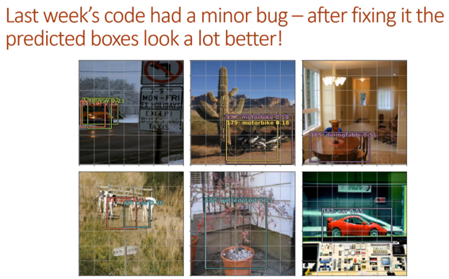

**问题** ：通常，当我们下采样时，我们会增加滤波器的数量或深度。 当我们从7x7到4x4等进行采样时，为什么我们将数字从512减少到256？ 为什么不降低SSD头的尺寸？ （性能相关？）[ [12:58](https://youtu.be/_ercfViGrgY%3Ft%3D12m58s) ]我们有许多外出路径，我们希望每个路径都相同，所以我们不希望每个路径都有不同数量的过滤器，这也就是论文的内容我试图与之相匹配。 拥有这256个 - 这是一个不同的概念，因为我们不仅利用了最后一层，而且利用了之前的层。 如果我们让它们更加一致，生活会更容易。

* * *

### 自然语言处理[ [14:10](https://youtu.be/h5Tz7gZT9Fo%3Ft%3D14m10s) ]

#### 我们要去的地方：

我们在每节课中都看到过采用预先训练过的模型的想法，在顶部掀起一些东西，用新的东西替换它，并让它做类似的事情。 我们已经有点潜入了与`ConvLearner.pretrained`更深入的内容。 `ConvLearner.pretrained`它有一种标准的方式将东西粘在顶部，这是一个特定的事情（即分类）。 然后我们了解到实际上我们可以在最后使用我们喜欢的任何PyTorch模块并让它用`custom_head`做任何我们喜欢的`custom_head` ，所以突然你发现我们可以做一些非常有趣的事情。

事实上，杨璐说“如果我们做了不同类型的自定义头怎么办？”并且不同的自定义头是让我们拍摄原始图片，旋转它们，并使我们的因变量与旋转相反，看它是否可以学习解旋它。 这是一个非常有用的东西，事实上，我认为Google照片现在有这个选项，它实际上会自动为你旋转你的照片。 但是很酷的是，正如他在这里展示的那样，你可以通过与我们上一课完全相同的方式建立这个网络。 但是你的自定义头是一个吐出一个数字的头部，它可以旋转多少，而你的数据集有一个因变量，你可以旋转多少。

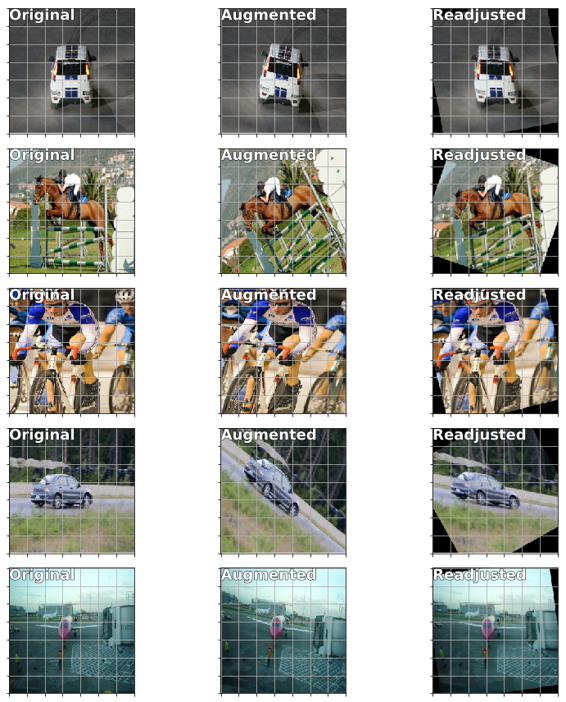

<figcaption class="imageCaption">[http://forums.fast.ai/t/fun-with-lesson8-rotation-adjustment-things-you-can-do-without-annotated-dataset/14261/1](http://forums.fast.ai/t/fun-with-lesson8-rotation-adjustment-things-you-can-do-without-annotated-dataset/14261/1)</figcaption>


所以你突然意识到这个主干和定制头的想法，你几乎可以做任何你能想到的事情[ [16:30](https://youtu.be/h5Tz7gZT9Fo%3Ft%3D16m30s) ]。

*   今天，我们将看看同样的想法，看看它如何适用于NLP。
*   在下一课中，我们将进一步说明NLP和计算机视觉是否可以让您做同样的基本想法，我们如何将两者结合起来。 我们将学习一个实际上可以学习从图像中找到单词结构，从单词结构中找到图像或从图像中找到图像的模型。 如果你想进一步做一些事情，比如从一个图像到一个句子（即图像字幕），或者从一个句子到一个我们开始做的图像，一个短语到图像，那将构成基础。
*   从那里开始，我们必须更深入地进入计算机视觉，思考我们可以用预先训练的网络和定制头的想法做些什么。 因此，我们将研究各种图像增强，例如增加低分辨率照片的分辨率以猜测缺少的内容或在照片上添加艺术滤镜，或将马的照片更改为斑马照片等。
*   最后，这将再次带我们回到边界框。 为了达到这个目的，我们首先要学习分割，这不仅仅是找出边界框的位置，而是要弄清楚图像中每个像素的一部分 - 所以这个像素是一个部分人，这个像素是汽车的一部分。 然后我们将使用这个想法，特别是一个名为UNet的想法，结果证明了这个UNet的想法，我们可以应用于边界框 - 它被称为特征金字塔。 我们将使用它来获得带有边界框的非常好的结果。 这是我们从这里开始的道路。 这一切都将相互依赖，但将我们带入许多不同的领域。

#### torchtext to fastai.text [ [18:56](https://youtu.be/h5Tz7gZT9Fo%3Ft%3D18m56s) ]：

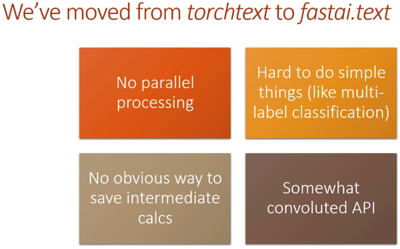

对于NLP，最后一部分，我们依赖于一个名为torchtext的库，但是从那时起，我从那时起就发现它的局限性太难以继续使用了。 正如你们很多人在论坛上抱怨的那样，部分原因是因为它没有进行并行处理，部分是因为它不记得你上次做了什么，而是从头开始重新做了。 然后很难做出相当简单的事情，比如很多你试图进入Kaggle的有毒评论竞赛，这是一个多标签问题，并试图用火炬文本做到这一点，我最终得到它的工作，但它带我像一个一周的黑客攻击有点荒谬。 为了解决所有这些问题，我们创建了一个名为fastai.text的新库。 Fastai.text是torchtext和fastai.nlp组合的替代品。 所以不要再使用fastai.nlp - 这已经过时了。 它更慢，更混乱，在各方面都不太好，但有很多重叠。 有意地，许多类和函数具有相同的名称，但这是非torchtext版本。

#### IMDb [ [20:32](https://youtu.be/h5Tz7gZT9Fo%3Ft%3D20m32s) ]

[笔记本](https://github.com/fastai/fastai/blob/master/courses/dl2/imdb.ipynb)

我们将再次与IMDb合作。 对于那些已经忘记的人，请回去看看第[4课](https://medium.com/%40hiromi_suenaga/deep-learning-2-part-1-lesson-4-2048a26d58aa) 。 这是一个电影评论的数据集，我们用它来确定我们是否可以享受Zombiegeddon，我们认为可能是我的事情。

```
 **from** **fastai.text** **import** *  **import** **html** 
```

> 我们需要从这个网站下载IMDB大型电影评论： [http](http://ai.stanford.edu/~amaas/data/sentiment/) ： [//ai.stanford.edu/~amaas/data/sentiment/](http://ai.stanford.edu/~amaas/data/sentiment/)直接链接： [链接](http://ai.stanford.edu/~amaas/data/sentiment/aclImdb_v1.tar.gz)

```
 BOS = 'xbos' _# beginning-of-sentence tag_  FLD = 'xfld' _# data field tag_ 
```

```
 PATH=Path('data/aclImdb/') 
```

#### 标准化格式[ [21:27](https://youtu.be/h5Tz7gZT9Fo%3Ft%3D21m27s) ]

NLP的基本路径是我们必须采用句子并将它们转换为数字，并且有几个要到达那里。 目前，有些故意，fastai.text没有提供那么多辅助函数。 它的设计更多是为了让您以相当灵活的方式处理事物。

```
 CLAS_PATH=Path('data/imdb_clas/')  CLAS_PATH.mkdir(exist_ok= **True** ) 
```

```
 LM_PATH=Path('data/imdb_lm/')  LM_PATH.mkdir(exist_ok= **True** ) 
```

正如你在这里[ [21:59](https://youtu.be/h5Tz7gZT9Fo%3Ft%3D21m59s) ]所看到的，我写了一些叫做get_texts的东西，它贯穿了`CLASSES`每一件事。 IMDb中有三个类：负数，正数，然后还有另一个文件夹“无人监督”，其中包含尚未标记的文件夹 - 所以我们现在只称它为一个类。 所以我们只需浏览这些类中的每一个，然后查找该文件夹中的每个文件，打开它，读取它，然后将它放入数组的末尾。 正如您所看到的，使用pathlib，抓取内容并将其拉入内容非常容易，然后标签就是我们到目前为止所处的任何类别。 我们将为训练集和测试集做到这一点。

```
 CLASSES = ['neg', 'pos', 'unsup'] 
```

```
 **def** get_texts(path):  texts,labels = [],[]  **for** idx,label **in** enumerate(CLASSES):  **for** fname **in** (path/label).glob('*.*'):  texts.append(fname.open('r').read())  labels.append(idx)  **return** np.array(texts),np.array(labels) 
```

```
 trn_texts,trn_labels = get_texts(PATH/'train')  val_texts,val_labels = get_texts(PATH/'test') 
```

```
 len(trn_texts),len(val_texts) 
```

```
 _(75000, 25000)_ 
```

列车有75,000，测试有25,000。 火车组中的50,000个是无人监管的，当我们进入分类时，我们实际上无法使用它们。 Jeremy发现这比使用大量图层和包装器的torch.text方法更容易，因为最后阅读文本文件并不那么难。

```
 col_names = ['labels','text'] 
```

有一点总是好主意是随机排序[ [23:19](https://youtu.be/h5Tz7gZT9Fo%3Ft%3D23m19s) ]。 知道这个随机排序的简单技巧很有用，特别是当你有多个东西需要以同样的方式排序时。 在这种情况下，您有标签和`texts. np.random.permutation` `texts. np.random.permutation` ，如果你给它一个整数，它会给你一个0到0之间的随机列表，不包括你以某种随机顺序给它的数字。

```
 np.random.seed(42)  trn_idx = np.random.permutation(len(trn_texts))  val_idx = np.random.permutation(len(val_texts)) 
```

你可以将它作为索引器传递给你一个按随机顺序排序的列表。 所以在这种情况下，它将以相同的随机方式对`trn_texts`和`trn_labels`进行排序。 所以这是一个有用的小习惯用法。

```
 trn_texts = trn_texts[trn_idx]  val_texts = val_texts[val_idx] 
```

```
 trn_labels = trn_labels[trn_idx]  val_labels = val_labels[val_idx] 
```

现在我们将文本和标签排序，我们可以从它们创建数据[框](https://youtu.be/h5Tz7gZT9Fo%3Ft%3D24m7s) [ [24:07](https://youtu.be/h5Tz7gZT9Fo%3Ft%3D24m7s) ]。 我们为什么这样做？ 原因是因为文本分类数据集开始出现一些标准的方法，即将训练设置为首先带有标签的CSV文件，然后是NLP文档的文本。 所以它基本上是这样的：

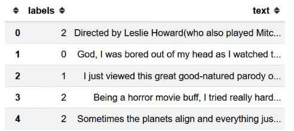

```
 df_trn = pd.DataFrame({'text':trn_texts, 'labels':trn_labels},  columns=col_names)  df_val = pd.DataFrame({'text':val_texts, 'labels':val_labels},  columns=col_names) 
```

```
 df_trn[df_trn['labels']!=2].to_csv(CLAS_PATH/'train.csv',  header= **False** , index= **False** )  df_val.to_csv(CLAS_PATH/'test.csv', header= **False** , index= **False** ) 
```

```
 (CLAS_PATH/'classes.txt').open('w')  .writelines(f' **{o}\n** ' **for** o **in** CLASSES)  (CLAS_PATH/'classes.txt').open().readlines() 
```

```
 _['neg\n', 'pos\n', 'unsup\n']_ 
```

所以你有你的标签和文本，然后是一个名为classes.txt的文件，它只列出了类。 我说有点标准，因为在最近的一篇学术论文中，Yann LeCun和一个研究小组研究了不少数据集，并且他们使用这种格式。 所以这就是我最近开始使用的论文。 你会发现这款笔记本，如果你把数据放到这种格式，整个笔记本每次都会工作[ [25:17](https://youtu.be/h5Tz7gZT9Fo%3Ft%3D25m17s) ]。 因此，我只是选择一种标准格式，而不是拥有一千种不同的格式，而您的工作就是将数据放入CSV文件格式。 默认情况下，CSV文件没有标头。

你会注意到一开始我们有两条不同的路径[ [25:51](https://youtu.be/h5Tz7gZT9Fo%3Ft%3D25m51s) ]。 一个是分类路径，另一个是语言模型路径。 在NLP中，你会一直看到LM。 LM意味着语言模型。 分类路径将包含我们将用于创建情绪分析模型的信息。 语言模型路径将包含创建语言模型所需的信息。 所以他们有点不同。 有一点不同的是，当我们在分类路径中创建train.csv时，我们会删除标签为2的所有内容，因为标签2是“无人监督”而我们无法使用它。


```
 trn_texts,val_texts = sklearn.model_selection.train_test_split(  np.concatenate([trn_texts,val_texts]), test_size=0.1) 
```

```
 len(trn_texts), len(val_texts) 
```

```
 _(90000, 10000)_ 
```

第二个区别是标签[ [26:51](https://youtu.be/h5Tz7gZT9Fo%3Ft%3D26m51s) ]。 对于分类路径，标签是实际标签，但对于语言模型，没有标签，所以我们只使用一堆零，这使得它更容易，因为我们可以使用一致的数据帧/ CSV格式。

现在是语言模型，我们可以创建自己的验证集，所以你现在可能已经遇到过， `sklearn.model_selection.train_test_split`这是一个非常简单的函数，可以抓取数据集并随机将其拆分为训练集和验证集根据你指定的比例。 在这种情况下，我们将分类训练和验证结合在一起，将其拆分10％，现在我们有90,000次训练，10,000次验证我们的语言模型。 这样我们的语言模型和分类器就会以标准格式获取数据。

```
 df_trn = pd.DataFrame({'text':trn_texts, 'labels':  [0]*len(trn_texts)}, columns=col_names)  df_val = pd.DataFrame({'text':val_texts, 'labels':  [0]*len(val_texts)}, columns=col_names) 
```

```
 df_trn.to_csv(LM_PATH/'train.csv', header= **False** , index= **False** )  df_val.to_csv(LM_PATH/'test.csv', header= **False** , index= **False** ) 
```

#### 语言模型令牌[ [28:03](https://youtu.be/h5Tz7gZT9Fo%3Ft%3D28m3s) ]

接下来我们要做的就是标记化。 标记化意味着在这个阶段，对于文档（即电影评论），我们有一个很长的字符串，我们想把它变成一个标记列表，类似于单词列表但不完全。 例如， `don't`希望它是`do`而`n't` ，我们可能希望完全停止成为令牌，等等。 标记化是我们传递给一个名为spaCy的极好的库 - 部分非常棒，因为澳大利亚人写了它并且部分非常棒，因为它擅长它的功能。 我们在spaCy上添加了一些东西，但绝大部分工作都是由spaCy完成的。

```
 chunksize=24000 
```

在我们将它传递给spaCy之前，Jeremy编写了这个简单的修复功能，每次他查看不同的数据集（大约十几个建立这个）时，每个人都有不同的奇怪的东西需要被替换。 所以这是他到目前为止所提出的所有内容，希望这也会帮助你。 所有的实体都是未转义的html，我们会替换更多的东西。 看一下在你输入的文本上运行它的结果，并确保那里没有更多奇怪的标记。

```
 re1 = re.compile(r' +') 
```

```
 **def** fixup(x):  x = x.replace('#39;', "'").replace('amp;', '&')  .replace('#146;', "'").replace('nbsp;', ' ')  .replace('#36;', '$').replace(' **\\** n', " **\n** ")  .replace('quot;', "'").replace('<br />', " **\n** ")  .replace(' **\\** "', '"').replace('<unk>','u_n')  .replace(' @.@ ','.').replace(' @-@ ','-')  .replace(' **\\** ', ' **\\** ')  **return** re1.sub(' ', html.unescape(x)) 
```

```
 **def** get_texts(df, n_lbls=1):  labels = df.iloc[:,range(n_lbls)].values.astype(np.int64)  texts = f' **\n{BOS}** **{FLD}** 1 ' + df[n_lbls].astype(str)  **for** i **in** range(n_lbls+1, len(df.columns)):  texts += f' **{FLD}** {i-n_lbls} ' + df[i].astype(str)  texts = texts.apply(fixup).values.astype(str) 
```

```
 tok = Tokenizer().proc_all_mp(partition_by_cores(texts))  **return** tok, list(labels) 
```

`get_all function`调用`get_texts`和get_texts会做一些事情[ [29:40](https://youtu.be/h5Tz7gZT9Fo%3Ft%3D29m40s) ]。 其中之一是应用我们刚才提到的`fixup` 。

```
 **def** get_all(df, n_lbls):  tok, labels = [], []  **for** i, r **in** enumerate(df):  print(i)  tok_, labels_ = get_texts(r, n_lbls)  tok += tok_;  labels += labels_  **return** tok, labels 
```

让我们看看这个，因为有一些有趣的事情需要指出[ [29:57](https://youtu.be/h5Tz7gZT9Fo%3Ft%3D29m57s) ]。 我们将使用pandas从语言模型路径打开我们的train.csv，但是我们传入了一个额外的参数，你可能在看到`chunksize`之前看不到。 在存储和使用文本数据时，Python和pandas的效率都很低。 因此，您会发现NLP中很少有人使用大型语料库。 杰里米认为，部分原因是传统工具使得它变得非常困难 - 你的内存总是耗尽。 因此，他今天向我们展示了这个过程，他使用这个确切的代码成功地使用了超过十亿字的语料库。 其中一个简单的伎俩就是用大熊猫称为`chunksize` 。 这意味着pandas不返回数据帧，但它返回一个迭代器，我们可以迭代数据帧的块。 这就是为什么我们不说`tok_trn = get_text(df_trn)` ，而是调用`get_all`来循环数据帧，但实际上它正在做的是它循环遍历数据帧的块，所以这些块中的每一个基本上都是数据帧代表数据的一个子集[ [31:05]](https://youtu.be/h5Tz7gZT9Fo%3Ft%3D31m5s) 。

**问题** ：当我使用NLP数据时，很多时候我遇到了带有外国文本/字符的数据。 放弃它们还是保留它们更好[ [31:31](https://youtu.be/h5Tz7gZT9Fo%3Ft%3D31m31s) ]？ 不，不，绝对保留它们。 整个过程是unicode，我实际上在中文文本上使用了这个。 这适用于几乎任何事情。 一般来说，大多数时候，删除任何东西都不是一个好主意。 老式的NLP方法倾向于完成所有这些，如词形还原和所有这些规范化步骤，以摆脱事物，小写一切等等。但这会丢弃你不知道它是否有用的信息。 所以不要丢掉信息。

所以我们遍历每个块，每个块都是一个数据帧，我们调用`get_texts` [ [32:19](https://youtu.be/h5Tz7gZT9Fo%3Ft%3D32m19s) ]。 `get_texts`将获取标签并使它们成为整数，并且它将获取文本。 有几点需要指出：

*   在我们包含文本之前，我们在开头定义了“开始流”（ `BOS` ）令牌。 这些特殊的字母串没有什么特别之处 - 它们只是我认为不经常出现在普通文本中的字母。 因此，每个文本都将以`'xbos'`开头 - 为什么？ 因为模型通常有助于了解新文本何时开始。 例如，如果它是一种语言模型，我们将把所有文本连接在一起。 因此，知道所有这些文章已经完成并且新的文章已经开始真的很有用，所以我现在可能会忘记它们的一些上下文。
*   同上，文本通常有多个字段，如标题和摘要，然后是主文档。 因此，出于同样的原因，我们在这里得到了这个东西，它让我们在CSV中实际上有多个字段。 所以这个过程的设计非常灵活。 再次在每一个的开头，我们放置一个特殊的“field starts here”标记，后跟从这里开始的字段数量，就像我们拥有的字段一样多。 然后我们对它应用`fixup` 。
*   然后最重要的是[ [33:54](https://youtu.be/h5Tz7gZT9Fo%3Ft%3D33m54s) ]，我们将它标记化 - 我们通过执行“进程所有多处理”（ `proc_all_mp` ）来标记它。 令牌化速度往往相当缓慢，但我们现在已经在我们的机器中拥有多个内核，而AWS上的一些更好的机器可以拥有数十个内核。 spaCy不太适合多处理，但Jeremy最终想出了如何让它发挥作用。 好消息是它现在全部包含在这一功能中。 因此，您需要传递给该函数的是要标记化的事物列表，该列表的每个部分将在不同的核心上进行标记化。 还有一个名为`partition_by_cores`的函数，它接受一个列表并将其拆分为子列表。 子列表的数量是计算机中的核心数。 在没有多处理的Jeremy机器上，这需要大约一个半小时，并且通过多处理，大约需要2分钟。 所以这是一个非常有用的东西。 随意查看它，并利用它为您自己的东西。 请记住，即使在我们的笔记本电脑中，我们都拥有多个内核，并且Python中很少有东西可以利用它，除非你付出一些努力使其工作。

```
 df_trn = pd.read_csv(LM_PATH/'train.csv', header= **None** ,  chunksize=chunksize)  df_val = pd.read_csv(LM_PATH/'test.csv', header= **None** ,  chunksize=chunksize) 
```

```
 tok_trn, trn_labels = get_all(df_trn, 1)  tok_val, val_labels = get_all(df_val, 1) 
```

```
 _0_  _1_  _2_  _3_  _0_ 
```

```
 (LM_PATH/'tmp').mkdir(exist_ok= **True** ) 
```

这是最后的结果[ [35:42](https://youtu.be/h5Tz7gZT9Fo%3Ft%3D35m42s) ]。 流令牌（ `xbos` ）的开头，字段编号1标记（ `xfld 1` ）的开头和标记化文本。 您会看到标点符号现在是一个单独的标记。

`**t_up**` ： `t_up mgm` - MGM最初资本化。 但有趣的是，通常人们要么小写一切，要么就是按原样离开。 现在，如果您保持原样，那么“SCREW YOU”和“screw you”是两组完全不同的令牌，必须从头开始学习。 或者如果你将它们全部小写，那么根本就没有区别。 那么你如何解决这个问题，以便你们都能得到“我现在正在发挥作用”的语义影响，但不必学习大喊大叫的版本与正常版本。 因此，我们的想法是提出一个独特的令牌来表示接下来的事情都是大写的。 然后我们小写它，所以现在任何曾经是大写的是小写的，然后我们可以学习所有大写的语义含义。

`**tk_rep**` ：同样，如果你有29个`!` 在连续的情况下，我们没有为29个感叹号学习单独的标记 - 而是我们为“下一个重复很多次”添加了一个特殊标记，然后输入数字29和一个感叹号（即`tk_rep 29 !` ） 。 所以有一些这样的技巧。 如果您对NLP感兴趣，请查看Jeremy添加的这些小技巧的tokenizer代码，因为其中一些很有趣。

```
 ' '.join(tok_trn[0]) 
```


以这种方式做事的`np.save`是我们现在可以只是`np.save`并将其加载回来[ [37:44](https://youtu.be/h5Tz7gZT9Fo%3Ft%3D37m44s) ]。 我们不必每次重新计算所有这些东西，就像我们倾向于使用torchtext或许多其他库一样。 现在我们已经将它标记化了，接下来我们要做的就是把它变成我们称之为数字化的数字。 我们将它数字化的方式非常简单。

*   我们列出了以某种顺序出现的所有单词的列表
*   然后我们将每个单词的索引替换为该列表
*   所有令牌的列表，我们称之为词汇表。

```
 np.save(LM_PATH/'tmp'/'tok_trn.npy', tok_trn)  np.save(LM_PATH/'tmp'/'tok_val.npy', tok_val) 
```

```
 tok_trn = np.load(LM_PATH/'tmp'/'tok_trn.npy')  tok_val = np.load(LM_PATH/'tmp'/'tok_val.npy') 
```

这是一些词汇[ [38:28](https://youtu.be/h5Tz7gZT9Fo%3Ft%3D38m28s) ]的例子。 Python中的Counter类非常方便。 它基本上为我们提供了一个独特项目及其计数的列表。 以下是词汇表中最常见的25个内容。 一般来说，我们不希望词汇表中的每个唯一标记。 如果它没有出现至少两次，那么可能只是一个拼写错误或一个单词，如果它不经常出现，我们无法学到任何关于它的东西。 此外，一旦你的词汇量超过60,000，我们将在这部分中学到的东西会变得有点笨拙。 如果时间允许的话，我们可能会看看Jeremy最近在处理大型词汇表时所做的一些工作，否则可能需要在未来的课程中进行。 但实际上对于分类来说，做大于60,000个单词似乎无论如何都没有帮助。

```
 freq = Counter(p **for** o **in** tok_trn **for** p **in** o)  freq.most_common(25) 
```

```
 _[('the', 1207984),_  _('.', 991762),_  _(',', 985975),_  _('and', 587317),_  _('a', 583569),_  _('of', 524362),_  _('to', 484813),_  _('is', 393574),_  _('it', 341627),_  _('in', 337461),_  _('i', 308563),_  _('this', 270705),_  _('that', 261447),_  _('"', 236753),_  _("'s", 221112),_  _('-', 188249),_  _('was', 180235),_  _('\n\n', 178679),_  _('as', 165610),_  _('with', 159164),_  _('for', 158981),_  _('movie', 157676),_  _('but', 150203),_  _('film', 144108),_  _('you', 124114)]_ 
```

因此，我们将把词汇量限制为60,000个单词，这些单词至少出现两次[ [39:33](https://youtu.be/h5Tz7gZT9Fo%3Ft%3D39m33s) ]。 这是一个简单的方法。 使用`.most_common` ，传递最大词汇量。 这将按频率排序，如果它看起来不是最低频率，那么根本不用担心它。 这给了我们`itos` - 这与torchtext使用的名称相同，它意味着整数到字符串。 这只是词汇中唯一标记的列表。 我们`_unk_`插入两个令牌 - 一个用于未知（ `_unk_` ）的词汇项和一个用于填充的词汇项（ `_pad_` ）。

```
 max_vocab = 60000  min_freq = 2 
```

```
 itos = [o **for** o,c **in** freq.most_common(max_vocab) **if** c>min_freq]  itos.insert(0, '_pad_')  itos.insert(0, '_unk_') 
```

然后我们可以创建相反方向的字典（字符串到整数）[ [40:19](https://youtu.be/h5Tz7gZT9Fo%3Ft%3D40m19s) ]。 这不会涵盖所有内容，因为我们故意将其截断至60,000字。 如果我们遇到字典中没有的东西，我们想用零替换未知，所以我们可以使用带有lambda函数的`defaultdict` ，它始终返回零。

```
 stoi = collections.defaultdict( **lambda** :0,  {v:k **for** k,v **in** enumerate(itos)})  len(itos) 
```

```
 _60002_ 
```

所以现在我们定义了`stoi`字典，然后我们可以为每个句子调用每个单词[ [40:50](https://youtu.be/h5Tz7gZT9Fo%3Ft%3D40m50s) ]。

```
 trn_lm = np.array([[stoi[o] **for** o **in** p] **for** p **in** tok_trn])  val_lm = np.array([[stoi[o] **for** o **in** p] **for** p **in** tok_val]) 
```

这是我们的数字化版本：


当然，好消息是我们也可以保存这一步骤。 每次我们进入另一步，我们都可以保存它。 与您使用图像时相比，这些文件不是很大。 文字通常很小。

保存那些词汇（ `itos` ）非常重要。 数字列表没有任何意义，除非你知道每个数字所指的是什么，这就是`itos`告诉你的。

```
 np.save(LM_PATH/'tmp'/'trn_ids.npy', trn_lm)  np.save(LM_PATH/'tmp'/'val_ids.npy', val_lm)  pickle.dump(itos, open(LM_PATH/'tmp'/'itos.pkl', 'wb')) 
```

所以你保存了这三件事，以后再加载它们就可以了。

```
 trn_lm = np.load(LM_PATH/'tmp'/'trn_ids.npy')  val_lm = np.load(LM_PATH/'tmp'/'val_ids.npy')  itos = pickle.load(open(LM_PATH/'tmp'/'itos.pkl', 'rb')) 
```

现在我们的词汇量为60,002，我们的训练语言模型中有90,000个文档。

```
 vs=len(itos)  vs,len(trn_lm) 
```

```
 _(60002, 90000)_ 
```

这是你做的预处理[ [42:01](https://youtu.be/h5Tz7gZT9Fo%3Ft%3D42m1s) ]。 如果我们想要的话，我们可以在实用程序函数中包含更多的内容，但它非常简单，并且一旦您以CSV格式获得它，那么确切的代码将适用于您拥有的任何数据集。

#### 预训练[ [42:19](https://youtu.be/h5Tz7gZT9Fo%3Ft%3D42m19s) ]


这是一种新的洞察力，它根本不是新的，我们想要预先训练一些东西。 我们从第4课就知道，如果我们通过首先创建一个语言模型然后将其作为分类器进行微调来预先训练我们的分类器，这是有帮助的。 它实际上为我们带来了一个新的最先进的结果 - 我们获得了相当多的IMDb分类器结果。 我们的目标不是那么远，因为IMDb的电影评论与其他任何英文文件没有什么不同; 与它们与随机字符串甚至中文文档的不同程度相比较。 因此，就像ImageNet允许我们训练能够识别看起来像图片的东西的东西一样，我们可以将它用在与ImageNet无关的东西上，就像卫星图像一样。 为什么我们不训练一个擅长英语的语言模型，然后对它进行微调以擅长电影评论。

因此，这一基本见解促使Jeremy尝试在维基百科上构建语言模型。 Stephen Merity已经处理了维基百科，发现了其中大部分内容的一部分，但抛弃了留下较大文章的愚蠢小文章。 他称之为wikitext103。 Jeremy抓住了wikitext103并训练了一个语言模型。 他使用完全相同的方法向您展示训练IMDb语言模型，但他训练了一个wikitext103语言模型。 他保存了它并将其提供给任何想要在[此URL](http://files.fast.ai/models/wt103/)上使用它的人。 现在的想法是让我们训练一个以这些权重开始的IMDb语言模型。 希望对你们这些人来说，这是一个非常明显的，极具争议性的想法，因为它基本上就是我们迄今为止在几乎所有课程中所做的。 但是，当Jeremy在去年6月或7月向NLP社区的人们首次提到这一点时，可能并没有那么少的兴趣，并被告知它是愚蠢的[ [45:03](https://youtu.be/h5Tz7gZT9Fo%3Ft%3D45m3s) ]。 因为杰里米很顽固，所以即使他们对NLP有更多了解并且无论如何都试过它，他都会忽视他们。 让我们看看发生了什么。

#### wikitext103转换[ [46:11](https://youtu.be/h5Tz7gZT9Fo%3Ft%3D46m11s) ]

我们就是这样做的。 抓住wikitext模型。 如果你做了`wget -r` ，它会递归地抓取整个目录，里面有一些东西。

```
 # ! wget -nH -r -np -P {PATH} [http://files.fast.ai/models/wt103/](http://files.fast.ai/models/wt103/) 
```

我们需要确保我们的语言模型具有与Jeremy的wikitext完全相同的嵌入大小，隐藏数量和层数，否则您无法加载权重。

```
 em_sz,nh,nl = 400,1150,3 
```

这是我们预先训练的路径和我们预先训练的语言模型路径。

```
 PRE_PATH = PATH **/** 'models' **/** 'wt103'  PRE_LM_PATH = PRE_PATH **/** 'fwd_wt103.h5' 
```

让我们继续前进，并从前面的wikitext103模型中`torch.load`那些权重。 我们通常不使用torch.load，但这是PyTorch抓取文件的方式。 它基本上为您提供了一个字典，其中包含图层的名称和这些权重的张量/数组。

现在问题是wikitext语言模型是用一定的词汇构建的，与我们的词汇不同[ [47:14](https://youtu.be/h5Tz7gZT9Fo%3Ft%3D47m14s) ]。 我们的＃40与wikitext103型号＃40不同。 所以我们需要将一个映射到另一个。 这非常简单，因为幸运的是Jeremy为wikitext词汇保存了itos。

```
 wgts = torch.load(PRE_LM_PATH, map_location= **lambda** storage,  loc: storage) 
```

```
 enc_wgts = to_np(wgts['0.encoder.weight'])  row_m = enc_wgts.mean(0) 
```

Here is the list of what each word is for wikitext103 model, and we can do the same `defaultdict` trick to map it in reverse. We'll use -1 to mean that it is not in the wikitext dictionary.

```
 itos2 = pickle.load((PRE_PATH / 'itos_wt103.pkl').open('rb')) 
```

```
 stoi2 = collections.defaultdict( lambda : - 1, {v:k for k,v  in enumerate(itos2)}) 
```

So now we can just say our new set of weights is just a whole bunch of zeros with vocab size by embedding size (ie we are going to create an embedding matrix) [ [47:57](https://youtu.be/h5Tz7gZT9Fo%3Ft%3D47m57s) ]. We then go through every one of the words in our IMDb vocabulary. We are going to look it up in `stoi2` (string-to-integer for the wikitext103 vocabulary) and see if it's a word there. If that is a word there, then we won't get the `-1` . So `r` will be greater than or equal to zero, so in that case, we will just set that row of the embedding matrix to the weight which was stored inside the named element `'0.encoder.weight'` . You can look at this dictionary `wgts` and it's pretty obvious what each name corresponds to. It looks very similar to the names that you gave it when you set up your module, so here are the encoder weights.

If we don't find it [ [49:02](https://youtu.be/h5Tz7gZT9Fo%3Ft%3D49m2s) ], we will use the row mean — in other words, here is the average embedding weight across all of the wikitext103\. So we will end up with an embedding matrix for every word that's in both our vocabulary for IMDb and the wikitext103 vocab, we will use the wikitext103 embedding matrix weights; for anything else, we will just use whatever was the average weight from the wikitext103 embedding matrix.

```
 new_w = np.zeros((vs, em_sz), dtype=np.float32)  for i,w in enumerate(itos):  r = stoi2[w]  new_w[i] = enc_wgts[r] if r > =0 else row_m 
```

We will then replace the encoder weights with `new_w` turn into a tensor [ [49:35](https://youtu.be/h5Tz7gZT9Fo%3Ft%3D49m35s) ]. We haven't talked much about weight tying, but basically the decoder (the thing that turns the final prediction back into a word) uses exactly the same weights, so we pop it there as well. Then there is a bit of weird thing with how we do embedding dropout that ends up with a whole separate copy of them for a reason that doesn't matter much. So we popped the weights back where they need to go. So this is now a set of torch state which we can load in.

```
 wgts['0.encoder.weight'] = T(new_w)  wgts['0.encoder_with_dropout.embed.weight'] = T(np.copy(new_w))  wgts['1.decoder.weight'] = T(np.copy(new_w)) 
```

#### Language model [ [50:18](https://youtu.be/h5Tz7gZT9Fo%3Ft%3D50m18s) ]

Let's create our language model. Basic approach we are going to use is we are going to concatenate all of the documents together into a single list of tokens of length 24,998,320\. That is going to be what we pass in as a training set. So for the language model:

*   We take all our documents and just concatenate them back to back.
*   We are going to be continuously trying to predict what's the next word after these words.
*   We will set up a whole bunch of dropouts.
*   Once we have a model data object, we can grab the model from it, so that's going to give us a learner.
*   Then as per usual, we can call `learner.fit` . We do a single epoch on the last layer just to get that okay. The way it's set up is the last layer is the embedding words because that's obviously the thing that's going to be the most wrong because a lot of those embedding weights didn't even exist in the vocab. So we will train a single epoch of just the embedding weights.
*   Then we'll start doing a few epochs of the full model. How is it looking? In lesson 4, we had the loss of 4.23 after 14 epochs. In this case, we have 4.12 loss after 1 epoch. So by pre-training on wikitext103, we have a better loss after 1 epoch than the best loss we got for the language model otherwise.

**Question** : What is the wikitext103 model? Is it a AWD LSTM again [ [52:41](https://youtu.be/h5Tz7gZT9Fo%3Ft%3D52m41s) ]? Yes, we are about to dig into that. The way I trained it was literally the same lines of code that you see above, but without pre-training it on wikitext103\.

* * *

#### A quick discussion about fastai doc project [ [53:07](https://youtu.be/h5Tz7gZT9Fo%3Ft%3D53m7s) ]

The goal of fastai doc project is to create documentation that makes readers say “wow, that's the most fantastic documentation I've ever read” and we have some specific ideas about how to do that. It's the same kind of idea of top-down, thoughtful, take full advantage of the medium approach, interactive experimental code first that we are all familiar with. If you are interested in getting involved, you can see the basic approach in [the docs directory](https://github.com/fastai/fastai/tree/master/docs) . In there, there is, amongst other things, [transforms-tmpl.adoc](https://raw.githubusercontent.com/fastai/fastai/master/docs/transforms-tmpl.adoc) . `adoc` is [AsciiDoc](http://asciidoc.org/) . AsciiDoc is like markdown but it's like what markdown needs to be to create actual books. A lot of actual books are written in AsciiDoc and it's as easy to use as markdown but there's way more cool stuff you can do with it. [Here](https://raw.githubusercontent.com/fastai/fastai/master/docs/transforms.adoc) is more standard asciiDoc example. You can do things like inserting a table of contents ( `:toc:` ). `::` means put a definition list here. `+` means this is a continuation of the previous list item. So there are many super handy features and it is like turbo-charged markdown. So this asciidoc creates this HTML and no custom CSS or anything added:


We literally started this project 4 hours ago. So you have a table of contents with hyper links to specific sections. We have cross reference we can click on to jump straight to the cross reference. Each method comes along with its details and so on. To make things even easier, they've created a special template for argument, cross reference, method, etc. The idea is, it will almost be like a book. There will be tables, pictures, video segments, and hyperlink throughout.

You might be wondering what about docstrings. But actually, if you look at the Python standard library and look at the docstring for `re.compile()` , for example, it's a single line. Nearly every docstring in Python is a single line. And Python then does exactly this — they have a website containing the documentation that says “this is what regular expressions are, and this is what you need to know about them, and if you want do them fast, you need to compile, and here is some information about compile” etc. These information is not in the docstring and that's how we are going to do as well — our docstring will be one line unless you need like two sometimes. Everybody is welcome to help contribute to the documentation.

* * *

**Question** : Hoes this compare to word2vec [ [58:31](https://youtu.be/h5Tz7gZT9Fo%3Ft%3D58m31s) ]? This is actually a great thing for you to spend time thinking about during the week. I'll give you the summary now but it's a very important conceptual difference. The main conceptual difference is “what is word2vec?” Word2vec is a single embedding matrix — each word has a vector and that's it. In other words, it's a single layer from a pre-trained model — specifically that layer is the input layer. Also specifically that pre-trained model is a linear model that is pre-trained on something called a co-occurrence matrix. So we have no particular reason to believe that this model has learned anything much about English language or that it has any particular capabilities because it's just a single linear layer and that's it. What's this wikitext103 model? It's a language model and it has a 400 dimensional embedding matrix, 3 hidden layers with 1,150 activations per layer, and regularization and all that stuff tied input output matrices — it's basically a state-of-the-art AWD LSTM. What's the difference between a single layer of a single linear model vs. a three layer recurrent neural network? Everything! They are very different levels of capabilities. So you will see when you try using a pre-trained language model vs. word2vec layer, you'll get very different results for the vast majority of tasks.

**Question** : What if the numpy array does not fit in memory? Is it possible to write a PyTorch data loader directly from a large CSV file [ [1:00:32](https://youtu.be/h5Tz7gZT9Fo%3Ft%3D1h32s) ]? It almost certainly won't come up, so I'm not going to spend time on it. These things are tiny — they are just integers. Think about how many integers you would need to run out of memories? That's not gonna happen. They don't have to fit in GPU memory, just in your memory. I've actually done another Wikipedia model which I called giga wiki which was on all of Wikipedia and even that easily fits in memory. The reason I'm not using it is because it turned out not to really help very much vs. wikitext103\. I've built a bigger model than anybody else I've found in the academic literature and it fits in memory on a single machine.

**Question** : What is the idea behind averaging the weights of embeddings [ [1:01:24](https://youtu.be/h5Tz7gZT9Fo%3Ft%3D1h1m24s) ]? They have to be set to something. These are words that weren't there, so the other option is we could leave them as zero. But that seems like a very extreme thing to do. Zero is a very extreme number. Why would it be zero? We could set it equal to some random numbers, but if so, what would be the mean and standard deviation of those random numbers? Should they be uniform? If we just average the rest of the embeddings, then we have something that's reasonably scaled. Just to clarify, this is how we are initializing words that didn't appear in the training corpus.

#### Back to Language Model [ [1:02:20](https://youtu.be/h5Tz7gZT9Fo%3Ft%3D1h2m20s) ]

This is a ton of stuff we've seen before, but it's changed a little bit. It's actually a lot easier than it was in part 1, but I want to go a little bit deeper into the language model loader.

```
 wd=1e-7  bptt=70  bs=52  opt_fn = partial(optim.Adam, betas=(0.8, 0.99)) 
```

```
 t = len(np.concatenate(trn_lm))  t, t//64 
```

```
 (24998320, 390598) 
```

This is the `LanguageModelLoader` and I really hope that by now, you've learned in your editor or IDE how to jump to symbols [ [1:02:37](https://youtu.be/h5Tz7gZT9Fo%3Ft%3D1h2m37s) ]. I don't want it to be a burden for you to find out what the source code of `LanguageModelLoader` is. If your editor doesn't make it easy, don't use that editor anymore. There's lots of good free editors that make this easy.

So this is the source code for LanguageModelLoader, and it's interesting to notice that it's not doing anything particularly tricky. It's not deriving from anything at all. What makes something that's capable of being a data loader is that it's something you can iterate over.


Here is the `fit` function inside fastai.model [ [1:03:41](https://youtu.be/h5Tz7gZT9Fo%3Ft%3D1h3m41s) ]. This is where everything ends up eventually which goes through each epoch, creates an iterator from the data loader, and then just does a for loop through it. So anything you can do a for loop through can be a data loader. Specifically it needs to return tuples of independent and dependent variables for mini-batches.


So anything with a `__iter__` method is something that can act as an iterator [ [1:04:09](https://youtu.be/h5Tz7gZT9Fo%3Ft%3D1h4m9s) ]. `yield` is a neat little Python keywords you probably should learn about if you don't already know it. But it basically spits out a thing and waits for you to ask for another thing — normally in a for loop or something. In this case, we start by initializing the language model passing it in the numbers `nums` this is the numericalized long list of all of our documents concatenated together. The first thing we do is to “batchfy” it. This is the thing which quite a few of you got confused about last time. If our batch size is 64 and we have 25 million numbers in our list. We are not creating items of length 64 — we are creating 64 items in total. So each of them is of size `t` divided by 64 which is 390k. So that's what we do here:

`data = data.view(self.bs, -1).t().contiguous()`

We reshape it so that this axis is of length 64 and `-1` is everything else (390k blob), and we transpose it. So that means that we now have 64 columns, 390k rows. Then what we do each time we do an iterate is we grab one batch of some sequence length, which is approximately equal to `bptt` (back prop through time) which we set to 70\. We just grab that many rows. So from `i` to `i+70` rows, we try to predict that plus one. Remember, we are trying to predict one past where we are up to.

So we have 64 columns and each of those is 1/64th of our 25 million tokens, and hundreds of thousands long, and we just grab 70 at a time [ [1:06:29](https://youtu.be/h5Tz7gZT9Fo%3Ft%3D1h6m29s) ]. So each of those columns, each time we grab it, it's going to kind of hook up to the previous column. That's why we get this consistency. This language model is stateful which is really important.

Pretty much all of the cool stuff in the language model is stolen from Stephen Merity's AWD-LSTM [ [1:06:59](https://youtu.be/h5Tz7gZT9Fo%3Ft%3D1h6m59s) ] including this little trick here:


If we always grab 70 at a time and then we go back and do a new epoch, we're going to grab exactly the same batches every time — there is no randomness. Normally, we shuffle our data every time we do an epoch or every time we grab some data we grab it at random. You can't do that with a language model because this set has to join up to the previous set because it's trying to learn the sentence. If you suddenly jump somewhere else, that doesn't make any sense as a sentence. So Stephen's idea is to say “okay, since we can't shuffle the order, let's instead randomly change the sequence length”. Basically, 95% of the time, we will use `bptt` (ie 70) but 5% of the time, we'll use half that. Then he says “you know what, I'm not even going to make that the sequence length, I'm going to create a normally distributed random number with that average and a standard deviation of 5, and I'll make that the sequence length.” So the sequence length is seventy-ish and that means every time we go through, we are getting slightly different batches. So we've got that little bit of extra randomness. Jeremy asked Stephen Merity where he came up with this idea, did he think of it? and he said “I think I thought of it, but it seemed so obvious that I bet I didn't think of it” — which is true of every time Jeremy comes up with an idea in deep learning. It always seems so obvious that you just assume somebody else has thought of it. But Jeremy thinks Stephen thought of it.

`LanguageModelLoader` is a nice thing to look at if you are trying to do something a bit unusual with a data loader [ [1:08:55](https://youtu.be/h5Tz7gZT9Fo%3Ft%3D1h8m55s) ]. It's a simple role model you can use as to creating a data loader from scratch — something that spits out batches of data.

Our language model loader took in all of the documents concatenated together along with batch size and bptt [ [1:09:14](https://youtu.be/h5Tz7gZT9Fo%3Ft%3D1h9m14s) ].

```
 trn_dl = LanguageModelLoader(np.concatenate(trn_lm), bs, bptt)  val_dl = LanguageModelLoader(np.concatenate(val_lm), bs, bptt)  md = LanguageModelData(PATH, 1, vs, trn_dl, val_dl, bs=bs,  bptt=bptt) 
```

Now generally speaking, we want to create a learner and the way we normally do that is by getting a model data object and calling some kind of method which have various names but often we call that method `get_model` . The idea is that the model data object has enough information to know what kind of model to give you. So we have to create that model data object which means we need LanguageModelData class which is very easy to do [ [1:09:51](https://youtu.be/h5Tz7gZT9Fo%3Ft%3D1h9m51s) ].

Here are all of the pieces. We are going to create a custom learner, a custom model data class, and a custom model class. So a model data class, again this one doesn't inherit from anything so you really see there's almost nothing to do. You need to tell it most importantly what's your training set (give it a data loader), what's the validation set (give it a data loader), and optionally, give it a test set (data loader), plus anything else that needs to know. It might need to know the bptt, it needs to know number of tokens(ie the vocab size), and it needs to know what is the padding index. And so that it can save temporary files and models, model datas as always need to know the path. So we just grab all that stuff and we dump it. 而已。 That's the entire initializer. There is no logic there at all.


Then all of the work happens inside `get_model` [ [1:10:55](https://youtu.be/h5Tz7gZT9Fo%3Ft%3D1h10m55s) ]. get_model calls something we will look at later, which just grabs a normal PyTorch nn.Module architecture, and chucks it on GPU. Note: with PyTorch, we would say `.cuda()` , with fastai it's better to say `to_gpu()` , the reason is that if you don't have GPU, it will leave it on the CPU. It also provides a global variable you can set to choose whether it goes on the GPU or not, so it's a better approach. We wrapped the model in a `LanguageModel` and the `LanguageModel` is a subclass of `BasicModel` which almost does nothing except it defines layer groups. Remember when we do discriminative learning rates where different layers have different learning rates or we freeze different amounts, we don't provide a different learning rate for every layer because there can be a thousand layers. We provide a different learning rate for every layer group. So when you create a custom model, you just have to override this one thing which returns a list of all of your layer groups. In this case, the last layer group contains the last part of the model and one bit of dropout. The rest of it ( `*` here means pull this apart) so this is going to be one layer per RNN layer. So that's all that is.

Then finally turn that into a learner [ [1:12:41](https://youtu.be/h5Tz7gZT9Fo%3Ft%3D1h12m41s) ]. So a learner, you just pass in the model and it turns it into a learner. In this case, we have overridden learner and the only thing we've done is to say I want the default loss function to be cross entropy. This entire set of custom model, custom model data, custom learner all fits on a single screen. They always basically look like this.

The interesting part of this code base is `get_language_model` [ [1:13:18](https://youtu.be/h5Tz7gZT9Fo%3Ft%3D1h13m18s) ]. Because that gives us our AWD LSTM. It actually contains the big idea. The big, incredibly simple idea that everybody else here thinks it's really obvious that everybody in the NLP community Jeremy spoke to thought was insane. That is, every model can be thought of as a backbone plus a head, and if you pre-train the backbone and stick on a random head, you can do fine-tuning and that's a good idea.

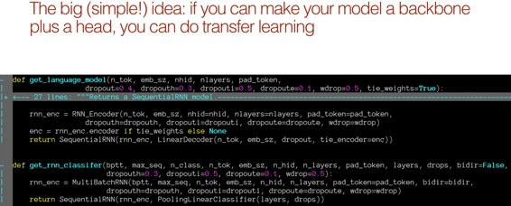

These two bits of code, literally right next to each other, this is all there is inside `fastai.lm_rnn` .

`get_language_model` : Creates an RNN encoder and then creates a sequential model that sticks on top of that — a linear decoder.

`get_rnn_classifier` : Creates an RNN encoder, then a sequential model that sticks on top of that — a pooling linear classifier.

We'll see what these differences are in a moment, but you get the basic idea. They are doing pretty much the same thing. They've got this head and they are sticking on a simple linear layer on top.

**Question** : There was a question earlier about whether that any of this translates to other languages [ [1:14:52](https://youtu.be/h5Tz7gZT9Fo%3Ft%3D1h14m52s) ]. Yes, this whole thing works in any languages. Would you have to retrain your language model on a corpus from that language? 绝对！ So the wikitext103 pre-trained language model knows English. You could use it maybe as a pre-trained start for like French or German model, start by retraining the embedding layer from scratch might be helpful. Chinese, maybe not so much. But given that a language model can be trained from any unlabeled documents at all, you'll never have to do that. Because almost every language in the world has plenty of documents — you can grab newspapers, web pages, parliamentary records, etc. As long as you have a few thousand documents showing somewhat normal usage of that language, you can create a language model. One of our students tried this approach for Thai and he said the first model he built easily beat the previous state-of-the-art Thai classifier. For those of you that are international fellow, this is an easy way for you to whip out a paper in which you either create the first ever classifier in your language or beat everybody else's classifier in your language. Then you can tell them that you've been a student of deep learning for six months and piss off all the academics in your country.

Here is our RNN encoder [ [1:16:49](https://youtu.be/h5Tz7gZT9Fo%3Ft%3D1h16m49s) ]. It is a standard nn.Module. It looks like there is more going on in it than there actually is, but really all there is is we create an embedding layer, create an LSTM for each layer that's been asked for, that's it. Everything else in it is dropout. Basically all of the interesting stuff (just about) in the AWS LSTM paper is all of the places you can put dropout. Then the forward is basically the same thing. Call the embedding layer, add some dropout, go through each layer, call that RNN layer, append it to our list of outputs, add dropout, that's about it. So it's pretty straight forward.

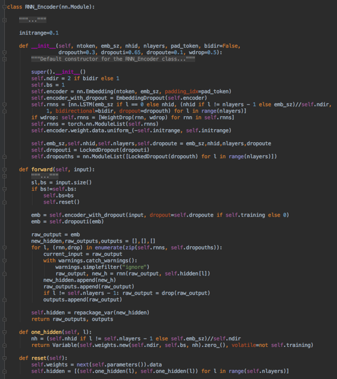

The paper you want to be reading is the AWD LSTM paper which is [Regularizing and Optimizing LSTM Language Models](https://arxiv.org/abs/1708.02182) . It's well written, pretty accessible, and entirely implemented inside fastai as well — so you can see all of the code for that paper. A lot of the code actually is shamelessly plagiarized with Stephen's permission from his excellent GitHub repo [AWD LSTM](https://github.com/Smerity/awd-lstm-lm) .

The paper refers to other papers. For things like why is it that the encoder weight and the decoder weight are the same. It's because there is this thing called “tie weights.” Inside `get_language_model` , there is a thing called `tie_weights` which defaults to true. If it's true, then we literally use the same weight matrix for the encoder and the decoder. They are pointing at the same block of memory. 这是为什么？ What's the result of it? That's one of the citations in Stephen's paper which is also a well written paper you can look up and learn about weight tying.


We have basically a standard RNN [ [1:19:52](https://youtu.be/h5Tz7gZT9Fo%3Ft%3D1h19m52s) ]. The only reason where it's not standard is it has lots more types of dropout in it. In a sequential model on top of the RNN, we stick a linear decoder which is literally half the screen of code. It has a single linear layer, we initialize the weights to some range, we add some dropout, and that's it. So it's a linear layer with dropout.

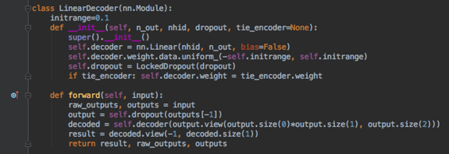

So the language model is:

*   RNN → A linear layer with dropout

#### Choosing dropout [ [1:20:36](https://youtu.be/h5Tz7gZT9Fo%3Ft%3D1h20m36s) ]

What dropout you choose matters a lot .Through a lot of experimentation, Jeremy found a bunch of dropouts that tend to work pretty well for language models. But if you have less data for your language model, you'll need more dropout. If you have more data, you can benefit from less dropout. You don't want to regularize more than you have to. Rather than having to tune every one of these five things, Jeremy's claim is they are already pretty good ratios to each other, so just tune this number ( `0.7` below), we just multiply it all by something. If you are overfitting, then you'll need to increase the number, if you are underfitting, you'll need to decrease this. Because other than that, these ratio seem pretty good.

```
 drops = np.array([0.25, 0.1, 0.2, 0.02, 0.15])* 0.7 
```

```
 learner= md.get_model(opt_fn, em_sz, nh, nl,  dropouti=drops[0], dropout=drops[1], wdrop=drops[2],  dropoute=drops[3], dropouth=drops[4]) 
```

```
 learner.metrics = [accuracy]  learner.freeze_to(-1) 
```

#### Measuring accuracy [ [1:21:45](https://youtu.be/h5Tz7gZT9Fo%3Ft%3D1h21m45s) ]

One important idea which may seem minor but again it's incredibly controversial is that we should measure accuracy when we look at a language model . Normally for language models, we look at a loss value which is just cross entropy loss but specifically we nearly always take e to the power of that which the NLP community calls “perplexity”. So perplexity is just `e^(cross entropy)` . There is a lot of problems with comparing things based on cross entropy loss. Not sure if there's time to go into it in detail now, but the basic problem is that it is like that thing we learned about focal loss. Cross entropy loss — if you are right, it wants you to be really confident that you are right. So it really penalizes a model that doesn't say “I'm so sure this is wrong” and it's wrong. Whereas accuracy doesn't care at all about how confident you are — it cares about whether you are right. This is much more often the thing which you care about in real life. The accuracy is how often do we guess the next word correctly and it's a much more stable number to keep track of. So that's a simple little thing that Jeremy does.

```
 learner.model.load_state_dict(wgts) 
```

```
 lr=1e-3  lrs = lr 
```

```
 learner.fit(lrs/2, 1, wds=wd, use_clr=(32,2), cycle_len=1) 
```

```
 _epoch trn_loss val_loss accuracy_ 
 0 4.398856 4.175343 0.28551 
```

```
 [4.175343, 0.2855095456305303] 
```

```
 learner.save('lm_last_ft') 
```

```
 learner.load('lm_last_ft') 
```

```
 learner.unfreeze() 
```

```
 learner.lr_find(start_lr=lrs/10, end_lr=lrs*10, linear= True ) 
```

```
 learner.sched.plot() 
```

We train for a while and we get down to a 3.9 cross entropy loss which is equivalent of ~49.40 perplexity ( `e^3.9` ) [ [1:23:14](https://youtu.be/h5Tz7gZT9Fo%3Ft%3D1h23m14s) ]. To give you a sense of what's happening with language models, if you look at academic papers from about 18 months ago, you'll see them talking about state-of-the-art perplexity of over a hundred. The rate at which our ability to understand language and measuring language model accuracy or perplexity is not a terrible proxy for understanding language. If I can guess what you are going to say next, I need to understand language well and the kind of things you might talk about pretty well. The perplexity number has just come down so much that it's been amazing, and it will come down a lot more. NLP in the last 12–18 months, it really feels like 2011–2012 computer vision. We are starting to understand transfer learning and fine-tuning, and basic models are getting so much better. Everything you thought about what NLP can and can't do is rapidly going out of date. There's still lots of things NLP is not good at to be clear. Just like in 2012, there were lots of stuff computer vision wasn't good at. But it's changing incredibly rapidly and now is a very very good time to be getting very good at NLP or starting startups base on NLP because there is a whole bunch of stuff which computers would absolutely terrible at two years ago and now not quite good as people and then next year, they'll be much better than people.

```
 learner.fit(lrs, 1, wds=wd, use_clr=(20,10), cycle_len=15) 
```

```
 epoch trn_loss val_loss accuracy  0 4.332359 4.120674 0.289563  1 4.247177 4.067932 0.294281  2 4.175848 4.027153 0.298062  3 4.140306 4.001291 0.300798  4 4.112395 3.98392 0.302663  5 4.078948 3.971053 0.304059  6 4.06956 3.958152 0.305356  7 4.025542 3.951509 0.306309  8 4.019778 3.94065 0.30756  9 4.027846 3.931385 0.308232  10 3.98106 3.928427 0.309011  11 3.97106 3.920667 0.30989  12 3.941096 3.917029 0.310515  13 3.924818 3.91302 0.311015  14 3.923296 3.908476 0.311586 
```

```
 [3.9084756, 0.3115861900150776] 
```

**Question** : What is your ratio of paper reading vs. coding in a week [ [1:25:24](https://youtu.be/h5Tz7gZT9Fo%3Ft%3D1h25m24s) ]? Gosh, what do you think, Rachel? You see me. I mean, it's more coding, right? “It's a lot more coding. I feel like it also really varies from week to week” (Rachel). With that bounding box stuff, there were all these papers and no map through them, so I didn't even know which one to read first and then I'd read the citations and didn't understand any of them. So there was a few weeks of just kind of reading papers before I even know what to start coding. That's unusual though. Anytime I start reading a paper, I'm always convinced that I'm not smart enough to understand it, always, regardless of the paper. And somehow eventually I do. But I try to spend as much time as I can coding.

Nearly always after I've read a paper [ [1:26:34](https://youtu.be/h5Tz7gZT9Fo%3Ft%3D1h26m34s) ], even after I've read the bit that says this is the problem I'm trying to solve, I'll stop there and try to implement something that I think might solve that problem. And then I'll go back and read the paper, and I read little bits about these are how I solve these problem bits, and I'll be like “oh that's a good idea” and then I'll try to implement those. That's why for example, I didn't actually implement SSD. My custom head is not the same as their head. It's because I kind of read the gist of it and then I tried to create something as best as I could, then go back to the papers and try to see why. So by the time I got to the focal loss paper, Rachel will tell you, I was driving myself crazy with how come I can't find small objects? How come it's always predicting background? I read the focal loss paper and I was like “that's why!!” It's so much better when you deeply understand the problem they are trying to solve. I do find the vast majority of the time, by the time I read that bit of the paper which is solving a problem, I'm then like “yeah, but these three ideas I came up with, they didn't try.” Then you suddenly realize that you've got new ideas. Or else, if you just implement the paper mindlessly, you tend not to have these insights about better ways to do it .

**Question** : Is your dropout rate the same through the training or do you adjust it and weights accordingly [ [1:26:27](https://youtu.be/h5Tz7gZT9Fo%3Ft%3D1h26m27s) ]? Varying dropout is really interesting and there are some recent papers that suggest gradually changing dropout [ [1:28:09](https://youtu.be/h5Tz7gZT9Fo%3Ft%3D1h28m9s) ]. It was either good idea to gradually make it smaller or gradually make it bigger, I'm not sure which. Maybe one of us can try and find it during the week. I haven't seen it widely used. I tried it a little bit with the most recent paper I wrote and I had some good results. I think I was gradually make it smaller, but I can't remember.

**Question** : Am I correct in thinking that this language model is build on word embeddings? Would it be valuable to try this with phrase or sentence embeddings? I ask this because I saw from Google the other day, universal sentence encoder [ [1:28:45](https://youtu.be/h5Tz7gZT9Fo%3Ft%3D1h28m45s) ]. This is much better than that. This is not just an embedding of a sentence, this is an entire model. An embedding by definition is like a fixed thing. A sentence or a phase embedding is always a model that creates that. We've got a model that's trying to understand language. It's not just as phrase or as sentence — it's a document in the end, and it's not just an embedding that we are training through the whole thing. This has been a huge problem with NLP for years now is this attachment they have to embeddings. Even the paper that the community has been most excited about recently from [AI2](http://allenai.org/) (Allen Institute for Artificial Intelligence) called ELMo — they found much better results across lots of models, but again it was an embedding. They took a fixed model and created a fixed set of numbers which they then fed into a model. But in computer vision, we've known for years that that approach of having fixed set of features, they're called hyper columns in computer vision, people stopped using them like 3 or 4 years ago because fine-tuning the entire model works much better. For those of you that have spent quite a lot of time with NLP and not much time with computer vision, you're going to have to start re-learning. All that stuff you have been told about this idea that there are these things called embeddings and that you learn them ahead of time and then you apply these fixed things whether it be word level or phrase level or whatever level — don't do that. You want to actually create a pre-trained model and fine-tune it end-to-end, then you'll see some specific results.

**Question** : For using accuracy instead of perplexity as a metric for the model, could we work that into the loss function rather than just use it as a metric [ [1:31:21](https://youtu.be/h5Tz7gZT9Fo%3Ft%3D1h31m21s) ]? No, you never want to do that whether it be computer vision or NLP or whatever. It's too bumpy. So cross entropy is fine as a loss function. And I'm not saying instead of, I use it in addition to. I think it's good to look at the accuracy and to look at the cross entropy. But for your loss function, you need something nice and smoothy. Accuracy doesn't work very well.

```
 learner.save('lm1')  learner.save_encoder('lm1_enc') 
```

#### `save_encoder` [ [1:31:55](https://youtu.be/h5Tz7gZT9Fo%3Ft%3D1h31m55s) ]

You'll see there are two different versions of `save` . `save` saves the whole model as per usual. `save_encoder` just saves that bit:


In other words, in the sequential model, it saves just `rnn_enc` and not `LinearDecoder(n_tok, emb_sz, dropout, tie_encoder=enc)` (which is the bit that actually makes it into a language model). We don't care about that bit in the classifier, we just care about `rnn_end` . That's why we save two different models here.

```
 learner.sched.plot_loss() 
```


#### Classifier tokens [ [1:32:31](https://youtu.be/h5Tz7gZT9Fo%3Ft%3D1h32m31s) ]

Let's now create the classifier. We will go through this pretty quickly because it's the same. But when you go back during the week and look at the code, convince yourself it's the same.

```
 df_trn = pd.read_csv(CLAS_PATH/'train.csv', header= None ,  chunksize=chunksize)  df_val = pd.read_csv(CLAS_PATH/'test.csv', header= None ,  chunksize=chunksize) 
```

```
 tok_trn, trn_labels = get_all(df_trn, 1)  tok_val, val_labels = get_all(df_val, 1) 
```

```
 _0_  _1_  _0_  _1_ 
```

```
 (CLAS_PATH/'tmp').mkdir(exist_ok= True ) 
```

```
 np.save(CLAS_PATH/'tmp'/'tok_trn.npy', tok_trn)  np.save(CLAS_PATH/'tmp'/'tok_val.npy', tok_val) 
```

```
 np.save(CLAS_PATH/'tmp'/'trn_labels.npy', trn_labels)  np.save(CLAS_PATH/'tmp'/'val_labels.npy', val_labels) 
```

```
 tok_trn = np.load(CLAS_PATH/'tmp'/'tok_trn.npy')  tok_val = np.load(CLAS_PATH/'tmp'/'tok_val.npy') 
```

We don't create a new `itos` vocabulary, we obviously want to use the same vocabulary we had in the language model because we are about to reload the same encoder [ [1:32:48](https://youtu.be/h5Tz7gZT9Fo%3Ft%3D1h32m48s) ].

```
 itos = pickle.load((LM_PATH/'tmp'/'itos.pkl').open('rb'))  stoi = collections.defaultdict( lambda :0, {v:k for k,v in  enumerate(itos)})  len(itos) 
```

```
 60002 
```

```
 trn_clas = np.array([[stoi[o] for o in p] for p in tok_trn])  val_clas = np.array([[stoi[o] for o in p] for p in tok_val]) 
```

```
 np.save(CLAS_PATH/'tmp'/'trn_ids.npy', trn_clas)  np.save(CLAS_PATH/'tmp'/'val_ids.npy', val_clas) 
```

#### Classifier

```
 trn_clas = np.load(CLAS_PATH/'tmp'/'trn_ids.npy')  val_clas = np.load(CLAS_PATH/'tmp'/'val_ids.npy') 
```

```
 trn_labels = np.squeeze(np.load(CLAS_PATH/'tmp'/'trn_labels.npy'))  val_labels = np.squeeze(np.load(CLAS_PATH/'tmp'/'val_labels.npy')) 
```

The construction of the model hyper parameters are the same [ [1:33:16](https://youtu.be/h5Tz7gZT9Fo%3Ft%3D1h33m16s) ]. We can change the dropout. Pick a batch size that is as big as you can that doesn't run out of memory.

```
 bptt,em_sz,nh,nl = 70,400,1150,3  vs = len(itos)  opt_fn = partial(optim.Adam, betas=(0.8, 0.99))  bs = 48 
```

```
 min_lbl = trn_labels.min()  trn_labels -= min_lbl  val_labels -= min_lbl  c=int(trn_labels.max())+1 
```

#### TextDataset [ [1:33:37](https://youtu.be/h5Tz7gZT9Fo%3Ft%3D1h33m37s) ]

This bit is interesting. There's fun stuff going on here.

```
 trn_ds = TextDataset(trn_clas, trn_labels)  val_ds = TextDataset(val_clas, val_labels) 
```

The basic idea here is that for the classifier, we do really want to look at one document. Is this document positive or negative? So we do want to shuffle the documents. But those documents have different lengths and so if we stick them all into one batch (this is a handy thing that fastai does for you) — you can stick things of different lengths into a batch and it will automatically pat them, so you don't have to worry about that. But if they are wildly different lengths, then you're going to be wasting a lot of computation times. If there is one thing that's 2,000 words long and everything else is 50 words long, that means you end up with 2000 wide tensor. That's pretty annoying. So James Bradbury who is one of Stephen Merity's colleagues and the guy who came up with torchtext came up with a neat idea which was “let's sort the dataset by length-ish”. So kind of make it so the first things in the list are, on the whole, shorter than the things at the end, but a little bit random as well.

Here is how Jeremy implemented that [ [1:35:10](https://youtu.be/h5Tz7gZT9Fo%3Ft%3D1h35m10s) ]. The first thing we need is a Dataset. So we have a Dataset passing in the documents and their labels. Here is `TextDataSet` which inherits from `Dataset` and `Dataset` from PyTorch is also shown below:


Actually `Dataset` doesn't do anything at all [ [1:35:34](https://youtu.be/h5Tz7gZT9Fo%3Ft%3D1h35m34s) ]. It says you need `__getitem__` if you don't have one, you're going to get an error. Same is true for `__len__` . So this is an abstract class. To `TextDataset` , we are going to pass in our `x` and `y` , and `__getitem__` will grab `x` and `y` , and return them — it couldn't be much simpler. Optionally, 1\. they could reverse it, 2\. stick an end of stream at the end, 3\. stick start of stream at the beginning. But we are not doing any of those things, so literally all we are doing is putting `x` and `y` and `__getitem__` returns them as a tuple. The length is however long the `x` is. That's all `Dataset` is — something with a length that you can index.

#### Turning it to a DataLoader [ [1:36:27](https://youtu.be/h5Tz7gZT9Fo%3Ft%3D1h36m27s) ]

```
 trn_samp = SortishSampler(trn_clas, key= lambda x: len(trn_clas[x]),  bs=bs//2)  val_samp = SortSampler(val_clas, key= lambda x: len(val_clas[x])) 
```

```
 trn_dl = DataLoader(trn_ds, bs//2, transpose= True , num_workers=1,  pad_idx=1, sampler=trn_samp)  val_dl = DataLoader(val_ds, bs, transpose= True , num_workers=1,  pad_idx=1, sampler=val_samp)  md = ModelData(PATH, trn_dl, val_dl) 
```

To turn it into a DataLoader, you simply pass the Dataset to the DataLoader constructor, and it's now going to give you a batch of that at a time. Normally you can say shuffle equals true or shuffle equals false, it'll decide whether to randomize it for you. In this case though, we are actually going to pass in a sampler parameter and sampler is a class we are going to define that tells the data loader how to shuffle.

*   For validation set, we are going to define something that actually just sorts. It just deterministically sorts it so that all the shortest documents will be at the start, all the longest documents will be at the end, and that's going to minimize the amount of padding.
*   For training sampler, we are going to create this thing called sort-ish sampler which also sorts (ish!)


What's great about PyTorch is that they came up with this idea for an API for their data loader where we can hook in new classes to make it behave in different ways [ [1:37:27](https://youtu.be/h5Tz7gZT9Fo%3Ft%3D1h37m27s) ]. SortSampler is something which has a length which is the length of the data source and has an iterator which is simply an iterator which goes through the data source sorted by length (which is passed in as `key` ). For the SortishSampler, it basically does the same thing with a little bit of randomness. It's just another of those beautiful design things in PyTorch that Jeremy discovered. He could take James Bradbury's ideas which he had written a whole new set of classes around, and he could just use inbuilt hooks inside PyTorch. You will notice data loader is not actually PyTorch's data loader — it's actually fastai's data loader. But it's basically almost entirely plagiarized from PyTorch but customized in some ways to make it faster mainly using multi-threading instead of multi-processing.

**Question** : Does the pre-trained LSTM depth and `bptt` need to match with the new one we are training [ [1:39:00](https://youtu.be/h5Tz7gZT9Fo%3Ft%3D1h39m) ]? No, the `bptt` doesn't need to match at all. That's just like how many things we look at at a time. It has nothing to do with the architecture.

So now we can call that function we just saw before `get_rnn_classifier` [ [1:39:16](https://youtu.be/h5Tz7gZT9Fo%3Ft%3D1h39m16s) ]. It's going to create exactly the same encoder more or less, and we are going to pass in the same architectural details as before. But this time, with the head we add on, you have a few more things you can do. One is you can add more than one hidden layer. In `layers=[em_sz*3, 50, c]` :

*   `em_sz * 3` : this is what the input to my head (ie classifier section) is going to be.
*   `50` : this is the output of the first layer
*   `c` : this is the output of the second layer

And you can add as many as you like. So you can basically create a little multi-layer neural net classifier at the end. Similarly, for `drops=[dps[4], 0.1]` , these are the dropouts to go after each of these layers.

```
  # part 1  dps = np.array([0.4, 0.5, 0.05, 0.3, 0.1]) 
```

```
 dps = np.array([0.4,0.5,0.05,0.3,0.4])*0.5 
```

```
 m = get_rnn_classifer(bptt, 20*70, c, vs, emb_sz=em_sz, n_hid=nh,  n_layers=nl, pad_token=1,  layers=[em_sz*3, 50, c], drops=[dps[4], 0.1],  dropouti=dps[0], wdrop=dps[1],  dropoute=dps[2], dropouth=dps[3]) 
```

```
 opt_fn = partial(optim.Adam, betas=(0.7, 0.99)) 
```

We are going to use RNN_Learner just like before.

```
 learn = RNN_Learner(md, TextModel(to_gpu(m)), opt_fn=opt_fn)  learn.reg_fn = partial(seq2seq_reg, alpha=2, beta=1)  learn.clip=25\.  learn.metrics = [accuracy] 
```

We are going to use discriminative learning rates for different layers [ [1:40:20](https://youtu.be/h5Tz7gZT9Fo%3Ft%3D1h40m20s) ].

```
 lr=3e-3  lrm = 2.6  lrs = np.array([lr/(lrm**4), lr/(lrm**3), lr/(lrm**2), lr/lrm, lr]) 
```

```
 lrs=np.array([1e-4,1e-4,1e-4,1e-3,1e-2]) 
```

You can try using weight decay or not. Jeremy has been fiddling around a bit with that to see what happens.

```
 wd = 1e-7  wd = 0  learn.load_encoder('lm2_enc') 
```

We start out just training the last layer and we get 92.9% accuracy:

```
 learn.freeze_to(-1) 
```

```
 learn.lr_find(lrs/1000)  learn.sched.plot() 
```

```
 learn.fit(lrs, 1, wds=wd, cycle_len=1, use_clr=(8,3)) 
```

```
 _epoch trn_loss val_loss accuracy_ 
 0 0.365457 0.185553 0.928719 
```

```
 [0.18555279, 0.9287188090884525] 
```

```
 learn.save('clas_0')  learn.load('clas_0') 
```

Then we unfreeze one more layer, get 93.3% accuracy:

```
 learn.freeze_to(-2) 
```

```
 learn.fit(lrs, 1, wds=wd, cycle_len=1, use_clr=(8,3)) 
```

```
 _epoch trn_loss val_loss accuracy_ 
 0 0.340473 0.17319 0.933125 
```

```
 [0.17319041, 0.9331253991245995] 
```

```
 learn.save('clas_1')  learn.load('clas_1') 
```

```
 learn.unfreeze() 
```

```
 learn.fit(lrs, 1, wds=wd, cycle_len=14, use_clr=(32,10)) 
```

```
 epoch trn_loss val_loss accuracy  0 0.337347 0.186812 0.930782  1 0.284065 0.318038 0.932062  2 0.246721 0.156018 0.941747  3 0.252745 0.157223 0.944106  4 0.24023 0.159444 0.945393  5 0.210046 0.202856 0.942858  6 0.212139 0.149009 0.943746  7 0.21163 0.186739 0.946553  8 0.186233 0.1508 0.945218  9 0.176225 0.150472 0.947985  10 0.198024 0.146215 0.948345  11 0.20324 0.189206 0.948145  12 0.165159 0.151402 0.947745  13 0.165997 0.146615 0.947905 
```

```
 [0.14661488, 0.9479046703071374] 
```

```
 learn.sched.plot_loss() 
```

```
 learn.save('clas_2') 
```

Then we fine-tune the whole thing [ [1:40:47](https://youtu.be/h5Tz7gZT9Fo%3Ft%3D1h40m47s) ]. This was the main attempt before our paper came along at using a pre-trained model:

[Learned in Translation: Contextualized Word Vectors](https://arxiv.org/abs/1708.00107)

What they did is they used a pre-trained translation model but they didn't fine tune the whole thing. They just took the activations of the translation model and when they tried IMDb, they got 91.8% — which we beat easily after only fine-tuning one layer. They weren't state-of-the-art, the state-of-the-art is 94.1% which we beat after fine-tuning the whole thing for 3 epochs and by the end, we are at 94.8% which is obviously a huge difference because in terms of error rate, that's gone done from 5.9%. A simple little trick is go back to the start of this notebook and reverse the order of all of the documents, and then re-run the whole thing. When you get to the bit that says `fwd_wt_103` , replace `fwd` for forward with `bwd` for backward. That's a backward English language model that learns to read English backward. So if you redo this whole thing, put all the documents in reverse, and change this to backward, you now have a second classifier which classifies things by positive or negative sentiment based on the reverse document. If you then take the two predictions and take the average of them, you basically have a bi-directional model (which you trained each bit separately)and that gets you to 95.4% accuracy. So we basically lowered it from 5.9% to 4.6%. So this kind of 20% change in the state-of-the-art is almost unheard of. It doesn't happen very often. So you can see this idea of using transfer learning, it's ridiculously powerful that every new field thinks their new field is too special and you can't do it. So it's a big opportunity for all of us.

#### Universal Language Model Fine-tuning for Text Classification [ [1:44:02](https://youtu.be/h5Tz7gZT9Fo%3Ft%3D1h44m2s) ]


So we turned this into a paper, and when I say we, I did it with this guy Sebastian Ruder. Now you might remember his name because in lesson 5, I told you that I actually had shared lesson 4 with Sebastian because I think he is an awesome researcher who I thought might like it. I didn't know him personally at all. Much to my surprise, he actually watched the video. He watched the whole video and said:

Sebastian: “That's actually quite fantastic! We should turn this into a paper.”

Jeremy: “I don't write papers. I don't care about papers and am not interested in papers — that sounds really boring”

Sebastian: “Okay, how about I write the paper for you.”

Jeremy: “You can't really write a paper about this yet because you'd have to do like studies to compare it to other things (they are called ablation studies) to see which bit actually works. There's no rigor here, I just put in everything that came in my head and chucked it all together and it happened to work”

Sebastian: “Okay, what if I write all the paper and do all your ablation studies, then can we write the paper?”

Jeremy: “Well, it's like a whole library that I haven't documented and I'm not going to yet and you don't know how it all works”

Sebastian: “Okay, if I wrote the paper, and do the ablation studies, and figure out from scratch how the code works without bothering you, then can we write the paper?”

Jeremy: “Um… yeah, if you did all those things, then we can write the paper. Okay!”

Then two days later, he comes back and says “okay, I've done a draft of the paper.” So, I share this story to say, if you are some student in Ireland and you want to do good work, don't let anybody stop you. I did not encourage him to say the least. But in the end, he said “I want to do this work, I think it's going to be good, and I'll figure it out” and he wrote a fantastic paper. He did the ablation study and he figured out how fastai works, and now we are planning to write another paper together. You've got to be a bit careful because sometimes I get messages from random people saying like “I've got lots of good ideas, can we have coffee?” — “I don't want… I can have coffee in my office anytime, thank you”. But it's very different to say “hey, I took your ideas and I wrote a paper, and I did a bunch of experiments, and I figured out how your code works, and I added documentation to it — should we submit this to a conference?” You see what I mean? There is nothing to stop you doing amazing work and if you do amazing work that helps somebody else, in this case, I'm happy that we have a paper. I don't particularly care about papers but I think it's cool that these ideas now have this rigorous study.

#### Let me show you what he did [ [1:47:19](https://youtu.be/h5Tz7gZT9Fo%3Ft%3D1h47m19s) ]

He took all my code, so I'd already done all the fastai.text and as you have seen, it lets us work with large corpuses. Sebastian is fantastically well-read and he said “here's a paper that Yann LeCun and some guys just came out with where they tried lots of classification datasets so I'm going to try running your code on all these datasets.” So these are the datasets:

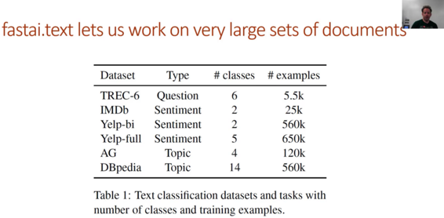

Some of them had many many hundreds of thousands of documents and they were far bigger than I had tried — but I thought it should work.

And he had a few good ideas as we went along and so you should totally make sure you read the paper. He said “well, this thing that you called in the lessons differential learning rates, differential kind of means something else. Maybe we should rename it” so we renamed it. It's now called discriminative learning rate. So this idea that we had from part one where we use different learning rates for different layers, after doing some literature research, it does seem like that hasn't been done before so it's now officially a thing — discriminative learning rates. This is something we learnt in lesson 1 but it now has an equation with Greek and everything [ [1:48:41](https://youtu.be/h5Tz7gZT9Fo%3Ft%3D1h48m41s) ]:


When you see an equation with Greek and everything, that doesn't necessarily mean it's more complex than anything we did in lesson 1 because this one isn't.

Again, that idea of like unfreezing a layer at a time, also seems to never been done before so it's now a thing and it's got the very clever name “gradual unfreezing” [ [1:48:57](https://youtu.be/h5Tz7gZT9Fo%3Ft%3D1h48m57s) ].

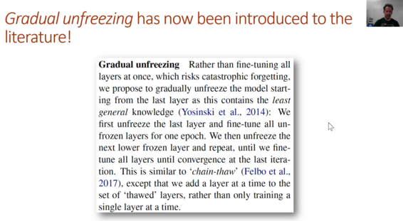

#### Slanted triangular learning rate [ [1:49:10](https://youtu.be/h5Tz7gZT9Fo%3Ft%3D1h49m10s) ]

So then, as promised, we will look at slanted triangular learning rates . This actually was not my idea. Leslie Smith, one of my favorite researchers who you all now know about, emailed me a while ago and said “I'm so over cyclical learning rates. I don't do that anymore. I now do a slightly different version where I have one cycle which goes up quickly at the start, and then slowly down afterwards. I often find it works better.” I've tried going back over all of my old datasets and it works better for all of them — every one I tried. So this is what the learning rate look like. You can use it in fastai just by adding `use_clr=` to your `fit` . The first number is the ratio between the highest learning rate and the lowest learning rate so the initial learning rate is 1/32 of the peak. The second number is the ratio between the first peak and the last peak. The basic idea is if you are doing a cycle length 10, that you want the first epoch to be the upward bit and the other 9 epochs to be the downward bit, then you would use 10\. I find that works pretty well and that was also Leslie's suggestion is make about 1/10 of it the upward bit and 9/10 the downward bit. Since he told me about it, maybe two days ago, he wrote this amazing paper: [A DISCIPLINED APPROACH TO NEURAL NETWORK HYPER-PARAMETERS](https://arxiv.org/abs/1803.09820) . In which, he describes something very slightly different to this again, but the same basic idea. This is a must read paper. It's got all the kinds of ideas that fastai talks about a lot in great depth and nobody else is talking about this. It's kind of a slog, unfortunately Leslie had to go away on a trop before he really had time to edit it properly, so it's a little bit slow reading, but don't let that stop you. It's amazing.


The equation on the right is from my paper with Sebastian. Sebastian asked “Jeremy, can you send me the math equation behind that code you wrote?” and I said “no, I just wrote the code. I could not turn it into math” so he figured out the math for it.

#### Concat pooling [ [1:51:36](https://youtu.be/h5Tz7gZT9Fo%3Ft%3D1h51m36s) ]

So you might have noticed, the first layer of our classifier was equal to embedding size*3 . Why times 3? Times 3 because, and again, this seems to be something which people haven't done before, so a new idea “concat pooling”. It is that we take the average pooling over the sequence of the activations, the max pooling of the sequence over the activations, and the final set of activations, and just concatenate them all together. This is something which we talked about in part 1 but doesn't seem to be in the literature before so it's now called “concat pooling” and it's now got an equation and everything but this is the entirety of the implementation. So you can go through this paper and see how the fastai code implements each piece.

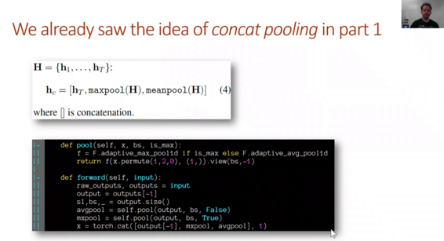

#### BPT3C [ [1:52:46](https://youtu.be/h5Tz7gZT9Fo%3Ft%3D1h52m46s) ]

One of the kind of interesting pieces is the difference between `RNN_Encoder` which you've already seen and MultiBatchRNN encoder. So what's the difference there? The key difference is that the normal RNN encoder for the language model, we could just do `bptt` chunk at a time. But for the classifier, we need to do the whole document. We need to do the whole movie review before we decide if it's positive or negative. And the whole movie review can easily be 2,000 words long and we can't fit 2.000 words worth of gradients in my GPU memory for every single one of my weights. So what do we do? So the idea was very simple which is I go through my whole sequence length one batch of `bptt` at a time. And I call `super().forward` (in other words, the `RNN_Encoder` ) to grab its outputs, and then I've got this maximum sequence length parameter where it says “okay, as long as you are doing no more than that sequence length, then start appending it to my list of outputs.” So in other words, the thing that it sends back to this pooling is only as many activations as we've asked it to keep. That way, you can figure out what `max_seq` can your particular GPU handle. So it's still using the whole document, but let's say `max_seq` is 1,000 words and your longest document length is 2, 000 words. It's still going through RNN creating states for those first thousand words, but it's not actually going to store the activations for the backprop of the first thousand. It's only going to keep the last thousand. So that means that it can't back-propagate the loss back to any state that was created in the first thousand words — basically that's now gone. So it's a really simple piece of code and honestly when I wrote it I didn't spend much time thinking about it, it seems so obviously the only way this could possibly work. But again, it seems to be a new thing, so we now have backprop through time for text classification. You can see there's lots of little pieces in this paper.


#### Results [ [1:55:56](https://youtu.be/h5Tz7gZT9Fo%3Ft%3D1h55m56s) ]

What was the result? On every single dataset we tried, we got better result than any previous academic paper for text classification. All different types. Honestly, IMDb was the only one I spent any time trying to optimize the model, so most of them, we just did it whatever came out first. So if we actually spent time with it, I think this would be a lot better. The things that these are comparing to, most of them are different on each table because they are customized algorithms on the whole. So this is saying one simple fine-tuning algorithm can beat these really customized algorithms.

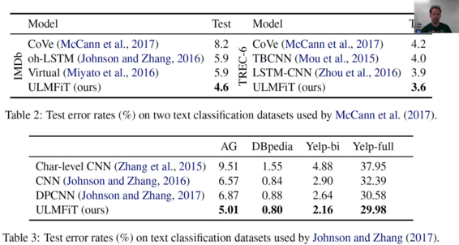

#### Ablation studies [ [1:56:56](https://youtu.be/h5Tz7gZT9Fo%3Ft%3D1h56m56s) ]

Here is the ablation studies Sebastian did. I was really keen that if you are going to publish a paper, we had to say why it works. So Sebastian went through and tried removing all of those different contributions I mentioned. So what is we don't use gradual freezing? What if we don't use discriminative learning rates? What if instead of discrimination rates, we use cosign annealing? What if we don't do any pre-training with Wikipedia? What if we don't do any fine tuning? And the really interesting one to me was, what's the validation error rate on IMDb if we only used a hundred training examples (vs. 200, vs. 500, etc). And you can see, very interestingly, the full version of this approach is nearly as accurate on just a hundred training examples — it's still very accurate vs. full 20,000 training examples. Where as if you are training from scratch on 100, it's almost random. It's what I expected. I've said to Sebastian I really think that this is most beneficial when you don't have much data. This is where fastai is most interested in contributing — small data regimes, small compute regimes, and so forth. So he did these studies to check.


### Tricks to run ablation studies [ [1:58:32](https://youtu.be/h5Tz7gZT9Fo%3Ft%3D1h58m32s) ]

#### Trick #1: VNC

The first trick is something which I know you're all going to find really handy. I know you've all been annoyed when you are running something in a Jupyter notebook, and you lose your internet connection for long enough that it decides you've gone away, and then your session disappears, and you have to start it again from scratch. So what do you do? There is a very simple cool thing called VNC where you can install on your AWS instance or PaperSpace, or whatever:

*   X Windows ( `xorg` )
*   Lightweight window manager ( `lxde-core` )
*   VNC server ( `tightvncserver` )
*   Firefox ( `firefox` )
*   Terminal ( `lxterminal` )
*   Some fonts ( `xfonts-100dpi` )

Chuck the lines at the end of your `./vnc/xstartup` configuration file, and then run this command ( `tightvncserver :13 -geometry 1200x900` ):

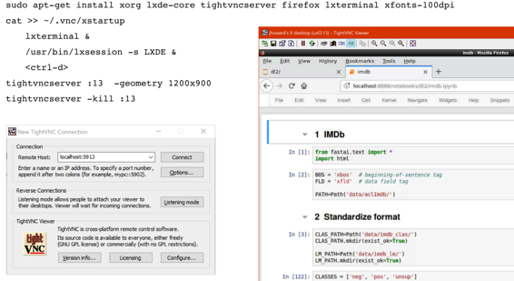

It's now running a server where you can then run the TightVNC Viewer or any VNC viewer on your computer and you point it at your server. But specifically, what you do is you use SSH port forwarding to forward :5913 to localhost:5913:


Then you connect to port 5013 on localhost. It will send it off to port 5913 on your server which is the VNC port (because you said `:13` ) and it will display an X Windows desktop. Then you can click on the Linux start like button and click on Firefox and you now have Firefox. You see here in Firefox, it says localhost because this Firefox is running on my AWS server. So you now run Firefox, you start your thing running, and then you close your VNC viewer remembering that Firefox is displaying on this virtual VNC display, not in a real display, so then later on that day, you log back into VNC viewer and it pops up again. So it's like a persistent desktop, and it's shockingly fast. It works really well. There's lots of different VNC servers and clients, but this one works fine for me.

#### Trick #2: Google Fire [ [2:01:27](https://youtu.be/h5Tz7gZT9Fo%3Ft%3D2h1m27s) ]


Trick #2 is to create Python scripts, and this is what we ended up doing. So I ended up creating a little Python script for Sebastian to kind of say this is the basic steps you need to do, and now you need to create different versions for everything else. And I suggested to him that he tried using this thing called Google Fire. What Google Fire does is, you create a function with tons of parameters, so these are all the things that Sebastian wanted to try doing — different dropout amounts, different learning rates, do I use pre-training or not, do I use CLR or not, do I use discriminative learning rate or not, etc. So you create a function, and then you add something saying:

```
 if __name__ == '__main__': fire.Fire(train_clas) 
```

You do nothing else at all — you don't have to add any metadata, any docstrings, anything at all, and you then call that script and automatically you now have a command line interface. That's a super fantastic easy way to run lots of different variations in a terminal. This ends up being easier if you want to do lots of variations than using a notebook because you can just have a bash script that tries all of them and spits them all out.

#### Trick #3: IMDb scripts [ [2:02:47](https://youtu.be/h5Tz7gZT9Fo%3Ft%3D2h2m47s) ]

You'll find inside the `courses/dl2` , there's now something called `imdb_scripts` , and I put all the scripts Sebastian and I used. Because we needed to tokenize and numericalize every dataset, then train a language model and a classifier for every dataset. And we had to do all of those things in a variety of different ways to compare them, so we had scripts for all those things. You can check out and see all of the scripts that we used.


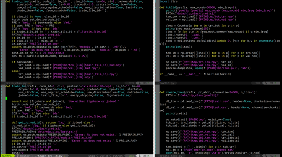

#### Trick #4: pip install -e [ [2:03:32](https://youtu.be/h5Tz7gZT9Fo%3Ft%3D2h3m32s) ]

When you are doing a lot of scripts, you got different code all over the place. Eventually it might get frustrating that you don't want to symlink your fastai library again and again. But you probably don't want to pip install it because that version tends to be a little bit old as we move so fast that you want to use the current version in Git. If you say `pip install -e .` from fastai repo base, it does something quite neat which is basically creates a symlink to the fastai library (ie your locally cloned Git repo) inside site-packages directory. Your site-packages directory is your main Python library. So if you do this, you can then access fastai from anywhere but every time you do `git pull` , you've got the most recent version. One downside of this is that it installs any updated versions of packages from pip which can confuse Conda a little bit, so another alternative here is just do symlink the fastai library to your site packages library. That works just as well. You can use fastai from anywhere and it's quite handy when you want to run scripts that use fastai from different directories on your system.


#### Trick #5: SentencePiece [ [2:05:06](https://youtu.be/h5Tz7gZT9Fo%3Ft%3D2h5m6s) ]

This is something you can try if you like. You don't have to tokenize. Instead of tokenizing words, you can tokenize what are called sub-word units.For example, “unsupervised” could be tokenized as “un” and “supervised”. “Tokenizer” can be tokenized as [“token”, “izer”]. Then you could do the same thing. The language model that works on sub-word units, a classifier that works on sub-word units, etc. How well does that work? I started playing with it and with not too much playing, I was getting classification results that were nearly as good as using word level tokenization — not quite as good, but nearly as good. I suspect with more careful thinking and playing around, maybe I could have gotten as good or better. But even if I couldn't, if you create a sub-word-unit wikitext model, then IMDb language model, and then classifier forwards and backwards and then ensemble it with the forwards and backwards word level ones, you should be able to beat us. So here is an approach you may be able to beat our state-of-the-art result.


Sebastian told me this particular project — Google has a project called sentence peace which actually uses a neural net to figure out the optimal splitting up of words and so you end up with vocabulary of sub-word units. In my playing around, I found that create vocabulary of about 30,000 sub-word units seems to be about optimal. If you are interested, there is something you can try. It is a bit of a pain to install — it's C++, doesn't have create error message, but it will work. There is a Python library for it. If anybody tries this, I'm happy to help them get it working. There's been little, if any, experiments with ensembling sub-word and word level classification, and I do think it should be the best approach.

Have a great week!
