# 深度学习：第二部分第十三课

[论坛](http://forums.fast.ai/t/lesson-13-discussion-and-wiki/15297/1) / [视频](https://youtu.be/xXXiC4YRGrQ)


图像增强 - 我们将涵盖你可能熟悉的这幅画。 但是，你之前可能没有注意到这幅画中的老鹰。 之前你可能没有注意到这幅画的原因是它上面没有鹰。 出于同样的原因，第一张幻灯片上的画也不习惯美国队长的盾牌。


这是一篇很酷的新论文，刚刚在几天前[出版](https://arxiv.org/abs/1804.03189) ，名为[Deep Painterly Harmonization](https://arxiv.org/abs/1804.03189) ，它几乎完全采用了我们将在本课中学习的技巧，并进行了一些小的调整。 但你可以看到基本的想法是将一张图片粘贴在另一张图片的顶部，然后使用某种方法将两者结合起来。 这种方法被称为“风格转移”。

在我们谈论这个之前，我想提一下William Horton的这个非常酷的贡献，他将这种随机权重平均技术添加到fastai库中，现在它已经合并并准备好了。 他写了一篇关于我强烈建议你查看的帖子，不仅因为随机权重平均让你从现有的神经网络中获得更高的性能，基本上没有额外的工作（就像为你的拟合函数添加两个参数一样简单： `use_swa` ， `swa_start` ）但他也描述了他构建这个的过程以及他如何测试它以及他如何为库做出贡献。 所以我觉得如果你有兴趣做这样的事情会很有趣。 我认为威廉之前没有建立过这种类型的库，因此他描述了他是如何做到的。

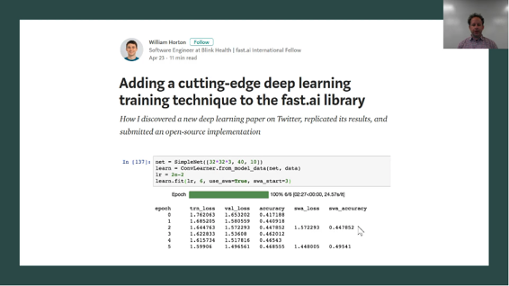

[https://medium.com/@hortonhearsafoo/adding-a-cutting-edge-deep-learning-training-technique-to-the-fast-ai-library-2cd1dba90a49](https://medium.com/%40hortonhearsafoo/adding-a-cutting-edge-deep-learning-training-technique-to-the-fast-ai-library-2cd1dba90a49)


#### TrainPhase  [[2:01](https://youtu.be/xXXiC4YRGrQ%3Ft%3D2m1s)] 

[笔记本](https://github.com/fastai/fastai/blob/master/courses/dl2/training_phase.ipynb)

对fastai库的另一个很酷的贡献是新的列车阶段API。 而且我将要做一些我以前从未做过的事情，那就是我要介绍别人的笔记本。 我以前没有这么做的原因是因为我不喜欢任何笔记本足以认为它们值得展示它，但是Sylvain在这里做了出色的工作，不仅创造了这个新的API而且创造了一个美丽的笔记本描述了什么它是什么以及它是如何工作的等等。 这里的背景是你们知道我们一直在努力更快地训练网络，部分是作为Dawn替补席比赛的一部分，也是因为你将在下周学到的原因。 我上周在论坛上提到，如果我们有一种更简单的方法来尝试不同的学习率计划等，我们的实验会非常方便，而且我设计了一个我想到的API，因为如果有人真的很酷可以这样写，因为我现在要睡觉了，明天我需要它。 Sylvain在论坛上回答说这听起来像是一个很好的挑战，到24小时后，它已经完成并且它非常酷。 我想带你通过它，因为它可以让你研究以前没人尝过的东西。

它被称为TrainPhase API  [[3:32](https://youtu.be/xXXiC4YRGrQ%3Ft%3D3m32s)] ，显示它的最简单方法是展示它的作用的一个例子。 这是对你熟悉的学习率图表的迭代。 这是我们以0.01的学习率训练一段时间然后我们以0.001的学习率训练一段时间。 我实际上想要创建非常类似于学习率图表的东西，因为大多数训练过ImageNet的人都使用这种逐步的方法，而实际上并不是内置于fastai的东西，因为它通常不是我们推荐的东西。 但是为了复制现有的论文，我想以同样的方式去做。 因此，不是用不同的学习率编写一些合适的，适合的，适合的呼叫，而是能够以这个学习率训练n个时期，然后以该学习率训练m个时期。

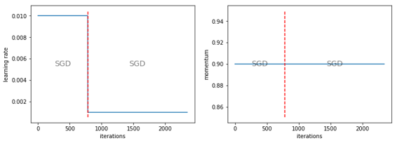

所以这是你如何做到这一点：

```
 phases = [TrainingPhase(epochs=1, opt_fn=optim.SGD, lr = 1e-2),  TrainingPhase(epochs=2, opt_fn=optim.SGD, lr = 1e-3)] 
```

阶段是具有特定优化器参数的训练时段，并且`phases`由许多训练阶段对象组成。 训练阶段对象说明要训练多少个时期，使用什么优化功能，以及我们将看到的其他事物的学习率。 在这里，你将看到刚刚在该图表上看到的两个训练阶段。 所以，现在，你不是打电话给`learn.fit` ，而是说：

```
 learn.fit_opt_sched(phases) 
```

换句话说，使用具有这些阶段的优化程序调度程序来学习。 从那里开始，你传入的大部分内容都可以按照惯例发送到fit函数，因此大多数常用参数都能正常工作。 一般来说，我们可以使用这些训练阶段，你会发现它符合常规方式。 然后，当你说`plot_lr`你会看到上面的图表。 它不仅绘制学习率，还绘制动量，每个阶段，它告诉你它使用了什么优化器。 你可以关闭优化器的打印（ `show_text=False` ），你可以关闭动作的打印（ `show_moms=False` ），你可以做其他的小事情，比如训练阶段可以有一个`lr_decay`参数 [[5:47](https://youtu.be/xXXiC4YRGrQ%3Ft%3D5m47s)]  ：

```
 phases = [TrainingPhase(epochs=1, opt_fn=optim.SGD, lr = 1e-2),  TrainingPhase(epochs=1, opt_fn=optim.SGD,  lr = (1e-2,1e-3), lr_decay=DecayType.LINEAR),  TrainingPhase(epochs=1, opt_fn=optim.SGD, lr = 1e-3)] 
```

所以这里是一个固定的学习率，然后是一个线性衰减学习率，然后是一个固定的学习率，它放弃了这张图：

```
 lr_i = start_lr + (end_lr - start_lr) * i/n 
```


这可能是一种非常好的训练方式，因为我们知道在高学习率下，你可以更好地探索，而且在低学习率的情况下，你可以更好地进行微调。 并且在两者之间逐渐滑动可能会更好。 所以我怀疑这实际上并不是一个糟糕的方法。

你可以使用其他衰变类型，如余弦 [[6:25](https://youtu.be/xXXiC4YRGrQ%3Ft%3D6m25s)] ：

```
 phases = [TrainingPhase(epochs=1, opt_fn=optim.SGD, lr = 1e-2),  TrainingPhase(epochs=1, opt_fn=optim.SGD, lr =(1e-2,1e-3),  lr_decay=DecayType.COSINE),  TrainingPhase(epochs=1, opt_fn=optim.SGD, lr = 1e-3)] 
```

这可能更有意义，因为它具有真正潜在有用的学习率退火形状。

```
 lr_i = end_lr + (start_lr - end_lr)/2 * (1 + np.cos(i * np.pi)/n) 
```


指数是超级流行的方法：

```
 lr_i = start_lr * (end_lr/start_lr)**(i/n) 
```


多项式不是非常受欢迎但实际上在文献中比其他任何东西都更好，但似乎在很大程度上被忽略了。 所以多项式是很好的意识到。 Sylvain所做的是他给了我们每条曲线的公式。 因此，使用多项式，你可以选择要使用的多项式。 我相信0.9的p是我见过的非常好的结果 - 仅供参考。

```
 lr_i = end_lr + (start_lr - end_lr) * (1 - i/n) ** p 
```


如果你在LR衰减时没有给出学习率的元组，那么它将一直衰减到零 [[7:26](https://youtu.be/xXXiC4YRGrQ%3Ft%3D7m26s)] 。 正如你所看到的，你可以愉快地在不同的点开始下一个周期。

```
 phases = [TrainingPhase(epochs=1, opt_fn=optim.SGD, lr = 1e-2),  TrainingPhase(epochs=1, opt_fn=optim.SGD, lr = 1e-2,  lr_decay=DecayType.COSINE),  TrainingPhase(epochs=1, opt_fn=optim.SGD, lr = 1e-3)] 
```


#### SGDR  [[7:43](https://youtu.be/xXXiC4YRGrQ%3Ft%3D7m43s)] 

所以很酷的是，现在我们可以使用除了这些训练阶段之外的所有现有计划复制。 所以这里有一个名为`phases_sgdr`的函数，它使用新的训练阶段API执行SGDR。

```
 **def** phases_sgdr(lr, opt_fn, num_cycle,cycle_len,cycle_mult):  phases = [TrainingPhase(epochs = cycle_len/ 20, opt_fn=opt_fn,  lr=lr/100),  TrainingPhase(epochs = cycle_len * 19/20,  opt_fn=opt_fn, lr=lr, lr_decay=DecayType.COSINE)]  **for** i **in** range(1,num_cycle):  phases.append(TrainingPhase(epochs=cycle_len*  (cycle_mult**i), opt_fn=opt_fn, lr=lr,  lr_decay=DecayType.COSINE))  **return** phases 
```

所以你可以看到，如果他运行这个时间表，这就是它的样子：

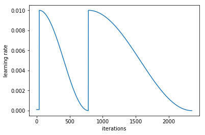

他甚至完成了我所拥有的小技巧，你只需要一点点学习率，然后弹出并做几个周期，周期越来越长 [[8:05](https://youtu.be/xXXiC4YRGrQ%3Ft%3D8m5s)] 。 这一切都是在一个功能中完成的。

#### 1周期 [[8:20](https://youtu.be/xXXiC4YRGrQ%3Ft%3D8m20s)] 

我们现在可以使用一个小函数实现新的1循环。

```
 **def** phases_1cycle(cycle_len,lr,div,pct,max_mom,min_mom):  tri_cyc = (1-pct/100) * cycle_len  **return** [TrainingPhase(epochs=tri_cyc/2, opt_fn=optim.SGD,  lr=(lr/div,lr), lr_decay=DecayType.LINEAR,  momentum=(max_mom,min_mom),  momentum_decay=DecayType.LINEAR),  TrainingPhase(epochs=tri_cyc/2, opt_fn=optim.SGD,  lr=(lr,lr/div), lr_decay=DecayType.LINEAR,  momentum=(min_mom,max_mom),  momentum_decay=DecayType.LINEAR),  TrainingPhase(epochs=cycle_len-tri_cyc, opt_fn=optim.SGD,  lr=(lr/div,lr/(100*div)),  lr_decay=DecayType.LINEAR,  momentum=max_mom)] 
```

因此，如果我们适合这一点，我们得到这个三角形，接着是一点点平坦的一点，动量是一个很酷的东西 - 动量有动量衰减。 在第三个TrainingPhase中，我们有一个固定的动力。 所以它同时在做动力和学习率。

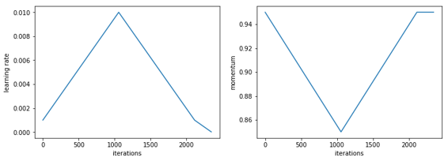

#### 判别学习率+ 1周期 [[8:53](https://youtu.be/xXXiC4YRGrQ%3Ft%3D8m53s)] 

所以我还没有尝试过，但我认为真的很有趣的是使用判别学习率和1周期的组合。 还没有人尝试过。 所以那真的很有趣。 我遇到的唯一具有歧视性学习率的论文使用了一种叫做LARS的东西。 通过查看每层的梯度和平均值之间的比率，并使用它来自动更改每层的学习率，它用于训练具有非常大批量的ImageNet。 他们发现他们可以使用更大的批量。 这是我见过这种方法的唯一其他地方，但是你可以尝试结合歧视学习率和不同的有趣时间表来尝试很多有趣的事情。

#### 你自己的LR发现者 [[10:06](https://youtu.be/xXXiC4YRGrQ%3Ft%3D10m6s)] 

你现在可以编写自己的不同类型的LR手指，特别是因为现在有这个`stop_div`参数，这基本上意味着它将使用你要求的任何时间表，但是当损失太糟糕时，它将停止训练。

添加的一个有用的东西是`plot`函数的`linear`参数。 如果你在学习率查找器中使用线性时间表而不是指数时间表，如果你对大致正确的区域进行微调，那么你可以使用线性来找到正确的区域。 然后你可能想用线性刻度绘制它。 这就是为什么你现在也可以将线性传递到情节。

你可以在每个阶段 [[11:06](https://youtu.be/xXXiC4YRGrQ%3Ft%3D11m6s)] 更改优化程序。 这比你想象的更重要，因为实际上目前用于真正大批量训练的最先进技术对于ImageNet实际上很快就从RMSProp开始第一位，然后他们切换到第二位的SGD。 所以这可能是一个有趣的实验，因为至少有一篇论文现在表明它可以很好地运作。 同样，它还没有得到很好的认可。

#### 改变数据 [[11:49](https://youtu.be/xXXiC4YRGrQ%3Ft%3D11m49s)] 

然后我发现最有趣的是你可以改变你的数据。 我们为什么要更改数据？ 因为你从第1课和第2课中记得，你可以在开始时使用小图像，稍后可以使用更大的图像。 理论上你可以使用它来更快地用较小的图像训练第一位，并记住如果你将高度减半并将宽度减半，你每层都有四分之一的激活，所以它可以快得多。 它甚至可能更好地概括。 因此，你现在可以创建几个不同的大小，例如，他有28和32大小的图像。 这是CIFAR10所以你只能这么做。 然后，如果在调用`fit_opt_sched`时`fit_opt_sched`此`data_list`参数中的数据数组，它将为每个阶段使用不同的数据集。

```
 data1 = get_data(28,batch_size)  data2 = get_data(32,batch_size) 
```

```
 learn = ConvLearner.from_model_data(ShallowConvNet(), data1) 
```

```
 phases = [TrainingPhase(epochs=1, opt_fn=optim.Adam, lr=1e-2,  lr_decay=DecayType.COSINE),  TrainingPhase(epochs=2, opt_fn=optim.Adam, lr=1e-2,  lr_decay=DecayType.COSINE)] 
```

```
 learn.fit_opt_sched(phases, data_list=[data1,data2]) 
```

这真的很酷，因为我们可以使用它，就像我们可以在我们的DAWN工作台条目中使用它，看看当我们用非常少的代码实际增加大小时会发生什么。 那么当我们这样做时会发生什么 [[13:02](https://youtu.be/xXXiC4YRGrQ%3Ft%3D13m2s)] ？ 答案就在ImageNet的DAWN工作台训练中：


你可以在这里看到谷歌已经在一个TPU集群上赢了半个小时。 最好的非集群TPU结果是fast.ai + 3个小时以下的学生在128台计算机上击败英特尔，在其他地方，我们在一台计算机上运行。 我们还击败谷歌在TPU上运行，所以使用这种方法，我们已经显示：

*   最快的GPU结果
*   最快的单机结果
*   最快的公开基础设施结果

除非你是Google，否则你无法使用这些TPU广告连播。 此外，成本很小（72.54美元），这款英特尔的计算机价值1200美元 - 他们甚至没有在这里写过它，但如果你使用并行的128台计算机，每台计算机有36个核心，每个都有140G，那就是你得到的与我们的单个AWS实例进行比较。 所以这是我们能做的突破。 我们可以在单个公共机器上训练ImageNet的想法是72美元，顺便说一下，它实际上是25美元，因为我们使用了一个现场实例。 我们的一个学生安德鲁·肖建立了整个系统，允许我们抛出一大堆现场实例实验并同时运行它们并且非常自动地运行它们，但是DAWN工作台没有引用我们使用的实际数字。 所以它实际上是25美元，而不是72美元。 所以这个`data_list`想法非常重要且有用。

#### CIFAR10结果 [[15:15](https://youtu.be/xXXiC4YRGrQ%3Ft%3D15m15s)] 

我们的CIFAR10结果现在也正式上传，你可能还记得以前最好的结果是一个多小时。 这里的诀窍是使用1循环，所以Sylvain的训练阶段API中的所有这些东西都是我们用来获得这些最佳结果的所有东西。 另一位名叫bkj的fast.ai学生已经接受了这个并完成了他自己的版本，他拿了一个Resnet18并添加了你可能记得我们在顶部学到的concat汇集，并使用了Leslie Smith的1循环，所以他有了在排行榜上。 所以前三名都是fast.ai学生，这很精彩。


#### CIFAR10成本结果 [[16:05](https://youtu.be/xXXiC4YRGrQ%3Ft%3D16m5s)] 

相同的成本 - 前3，你可以看到，Paperspace。 Brett在Paperspace上运行了这个，并且在bkj之前得到了最便宜的结果。

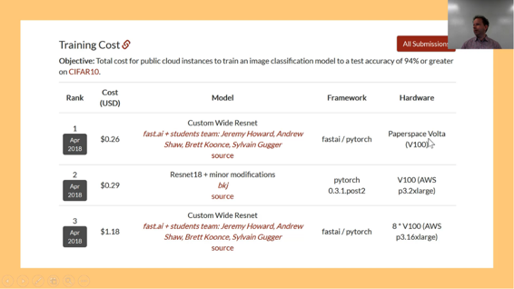

所以我认为你可以看到 [[16:25](https://youtu.be/xXXiC4YRGrQ%3Ft%3D16m25s)] ，目前很多有趣的机会，训练内容更快，更便宜，都是关于学习率退火，尺寸退火和不同时间不同参数的训练，我仍然认为每个人都在摸索表面。 我认为我们可以更快，更便宜。 这对于资源有限的环境中的人来说真的很有帮助，除了Google之外，基本上每个人都可能是Facebook。

尽管 [[17:00](https://youtu.be/xXXiC4YRGrQ%3Ft%3D17m)] ，架构也很有趣，我们上周看到的其中一件事就是创建了一个更简单的暗网架构版本。 但是有一个架构我们没有谈论哪些是理解Inception网络所必需的。 Inception网络实际上非常有趣，因为它们使用一些技巧来提高效率。 我们目前没有使用这些技巧，我觉得也许我们应该尝试一下。 最有趣和最成功的Inception网络是他们的Inception-ResNet-v2网络，其中的大多数块看起来像这样：


它看起来很像一个标准的Res​​Net块，因为它有一个身份连接，并且有一个转换路径，我们将它们加在一起 [[17:47](https://youtu.be/xXXiC4YRGrQ%3Ft%3D17m47s)] 。 但事实并非如此。 第一个是中间转换路径是1x1转换，并且值得思考1x1转换实际上是什么。

#### 1x1卷积 [[18:23](https://youtu.be/xXXiC4YRGrQ%3Ft%3D18m23s)] 

1x1 conv只是对输入中的每个网格单元说，你基本上有一个向量。 滤波器张数的1乘1基本上是矢量。 对于输入中的每个网格单元，你只需要使用该张量进行点积。 当然，它将成为我们正在创建的192个激活中的每个激活的向量之一。 所以基本上做192网点产品与网格单元（1,1），然后192网格单元（1,2）或（1,3）等等。 因此，你将得到与输入具有相同网格大小的内容以及输出中的192个通道。 因此，这是一种非常好的方法，可以在不改变网格大小的情况下减少维度或增加输入的维度。 这通常是我们使用1x1转换的原因。 在这里，我们有一个1x1转换和另一个1x1转换，然后他们将它们加在一起。 然后是第三条路径，不添加第三条路径。 没有明确提到，但第三条路径是连接在一起的。 有一种形式的ResNet与ResNet基本相同，但我们不做加号，我们做concat。 这叫做DenseNet。 它只是一个ResNet，我们用concat代替plus。 这是一种有趣的方法，因为那时身份路径的类型实际上是被复制的。 因此，你可以获得整个流程，因此我们将在下周看到，这对于细分和类似的东西来说更好，你真的想保留原始像素，第一层像素，第二层像素层不受影响。

连接而不是添加分支是一件非常有用的事情，我们正在连接中间分支和右分支 [[20:22](https://youtu.be/xXXiC4YRGrQ%3Ft%3D20m22s)] 。 最正确的分支正在做一些有趣的事情，首先是1x1转换，然后是1x7，然后是7x1。 那里发生了什么？ 所以，那里发生的事情基本上我们真正想做的就是做7x7转换。 我们想要进行7x7转换的原因是，如果你有多条路径（每条路径都有不同的内核大小），那么它就可以查看不同数量的图像。 最初的Inception网络有1x1,3x3,5x5,7x7连接在一起或类似的东西。 因此，如果我们可以使用7x7过滤器，那么我们可以立即查看大量图像并创建一个非常丰富的表示。 所以Inception网络的主干是Inception网络的前几层实际上也使用了这种类型的7x7转换，因为你从这个224乘224乘3开始，你想把它变成112乘112的东西64.通过使用7x7转换，你可以在每个输出中获得大量信息，以获得64个过滤器。 但问题是7x7转换是很多工作。 对于每个通道的每个输入像素，你有49个内核值乘以49个输入。 所以计算很疯狂。 对于第一层，你可以为它（可能）侥幸逃脱，事实上，ResNet的第一个转换是7x7转换。

但对于Inception  [[22:30](https://youtu.be/xXXiC4YRGrQ%3Ft%3D22m30s)] 则不是这样。 他们没有做7x7转换，相反，他们做1x7跟随7x1。 因此，要解释一下，初始网络的基本思想或它的所有不同版本，你有许多具有不同卷积宽度的独立路径。 在这种情况下，概念上的想法是中间路径是1x1卷积宽度，右路径将是7卷积宽度，因此他们查看不同数量的数据然后我们将它们组合在一起。 但我们不希望通过网络获得7x7转换，因为它的计算成本太高。

但是如果你考虑它 [[23:18](https://youtu.be/xXXiC4YRGrQ%3Ft%3D23m18s)] ，如果我们有一些输入，我们有一些我们想要的大过滤器，而且它太大而无法处理。 我们能做什么？ 我们做5x5。 我们能做的是创建两个过滤器 - 一个是1x5，一个是5x1。 我们对前一层进行了激活，并将它通过了1x5。 我们从中取出激活，并通过5x1，而另一端则出现了一些东西。 现在另一端出现了什么？ 而不是把它想象成，首先，我们采取激活，然后我们通过1x5，然后我们通过5x1，如果相反我们将这两个操作放在一起，并说什么是5x1点积和一个1x5点的产品一起做？ 实际上，你可以采取1x5和5x1，其外部产品将给你一个5x5。 现在你不能通过获取该产品来创建任何可能的5x5矩阵，但是你可以创建很多5x5矩阵。 所以这里的基本思想是当你考虑操作的顺序时（如果你对这里的更多理论感兴趣，你应该看看Rachel的数值线性代数课程，这基本上是关于这个的整个过程）。 但从概念上讲，这个想法很常见，你想要做的计算实际上比整个5x5卷积更简单。 通常，我们在线性代数中使用的术语是有一些较低等级的近似值。 换句话说，1x5和5x1组合在一起 - 5x5矩阵几乎与5x5矩阵一样好，如果你能够，你理想情况下会计算出来。 所以在实践中经常出现这种情况 - 仅仅因为现实世界的本质是现实世界往往具有比随机更多的结构。

很酷的是[26:16]，如果我们用1x7和7x1替换我们的7x7转换器，对于每个单元，它通过输出通道点产品有14个输入通道，而7x7一个有49个要做。 所以它会快得多，我们不得不希望它几乎一样好。 根据定义，它肯定会捕获尽可能多的信息宽度。


如果你有兴趣了解更多相关信息，特别是在深度学习领域，你可以谷歌参与**Factored Convolutions** 。 这个想法是在3或4年前提出来的。 它可能已经存在了很长时间，但那是我第一次看到它的时候。 事实证明它工作得非常好，并且Inception网络广泛使用它。 他们实际上是在他们的干中使用它。 我们之前已经讨论了我们如何倾向于加载 - 例如，当我们有ResNet34时，我们倾向于说这是主要的主干。 这是所有卷积的主要支柱，然后我们可以添加一个自定义头，它往往是最大池或完全连接层。 最好谈谈骨干包含两个部分：一个是干，另一个是主干。 原因是进入的东西只有3个通道，所以我们想要一些操作序列，这些操作将扩展到更丰富的东西 - 通常类似于64个通道。


在ResNet中，词干非常简单。 这是一个7x7步幅2转，然后是一个步幅2最大池（我认为如果内存正确服务就是这样）。 初始有一个更复杂的词干，多个路径被组合和连接，包括factored conv（1x7和7x1）。 我很感兴趣，例如，如果你将一个标准的Res​​Net堆叠在一个Inception干上，会发生什么。 我认为这将是一个非常有趣的事情，因为一个Inception词干是一个非常精心设计的东西，而你如何采用3通道输入并将其转化为更丰富的东西似乎非常重要。 所有这些工作似乎都被ResNet抛弃了。 我们喜欢ResNet，它的效果非常好。 但是，如果我们将一个密集的网络骨干放在一个Inception干线上呢？ 或者如果我们用标准ResNet中的1x7和7x1因子转换替换7x7转换器怎么办？ 我们可以尝试很多东西，我认为它会非常有趣。 因此，对潜在的研究方向有更多的想法。

所以这就是我的一小部分随机内容 [[29:51](https://youtu.be/xXXiC4YRGrQ%3Ft%3D29m51s)] 。 更接近实际的主题是图像增强。 我将简要讨论一篇新论文，因为它真正将我刚才讨论的内容与我们接下来要讨论的内容联系起来。 这篇关于渐进式GAN的论文来自Nvidia： [GAN的渐进式增长，用于提高质量，稳定性和变异性](http://research.nvidia.com/publication/2017-10_Progressive-Growing-of) 。 渐进式GAN采用逐渐增加图像尺寸的想法。 这是我所知道的唯一其他方向，人们实际上逐渐增加了图像尺寸。 这让我感到惊讶，因为这篇论文实际上非常受欢迎，众所周知，并且很受欢迎，但是，人们还没有采取逐步增加图像尺寸的基本思想，并在其他任何地方使用它，向你展示你可以期待的一般创造力水平也许，在深度学习研究社区中找到。

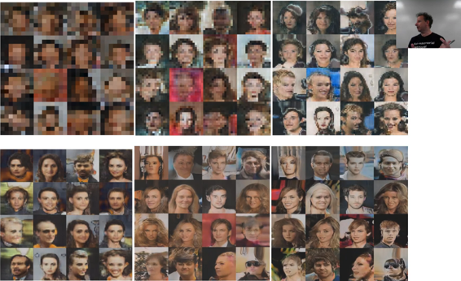

他们真的回去了，他们从4x4 GAN开始 [[31:47](https://youtu.be/xXXiC4YRGrQ%3Ft%3D31m47s)] 。 从字面上看，他们试图复制4x4像素，然后是8x8（上面的左上角）。 这是CelebA数据集，所以我们正在尝试重新创建名人的照片。 然后他们去了16x16,32,64,128，然后是256.他们做的一件非常好的事情是，随着他们增加尺寸，他们还会为网络添加更多层。 哪种有意义，因为如果你正在做更多的ResNet-y类型的东西，那么你正在吐出一些希望在每个网格单元大小上有意义的东西，所以你应该能够将东西分层。 他们做了另一件漂亮的事情，当他们这样做时他们添加跳过连接，并且他们逐渐改变线性插值参数，使其越来越远离旧的4x4网络并转向新的8x8网络。 然后，一旦它完全移动它，他们扔掉了额外的连接。 细节并不重要，但它使用了我们所讨论的基本思想，逐渐增加图像大小并跳过连接。 这是一篇很好的研究论文，因为它是这些罕见的事情之一，优秀的工程师实际上建立了一些只是以一种非常明智的方式工作的东西。 现在，这实际上来自于Nvidia本身也就不足为奇了。 Nvidia不做很多论文，有趣的是，当他们这样做时，他们会构建一些非常实用和明智的东西。 所以我认为这是一篇很好的论文，如果你想把我们学到的很多不同的东西放在一起，并且没有很多的重新实现，所以这是一个有趣的事情，也许你可以建立和找到别的东西。

接下来会发生什么 [[33:45](https://youtu.be/xXXiC4YRGrQ%3Ft%3D33m45s)] 。 我们最终会达到1024x1024，你会发现这些图像不仅分辨率更高，而且越来越好。 所以我要看看你是否可以猜出以下哪一个是假的：

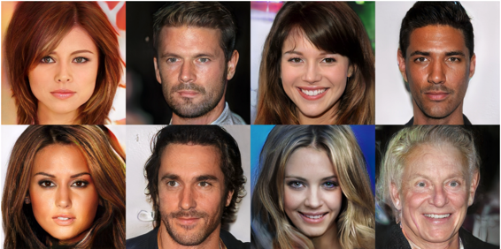

他们都是假的。 那是下一个阶段。 你上升了，他们砰的一声。 所以GAN和东西都变得疯狂，你们中的一些人可能在本周 [[34:16](https://youtu.be/xXXiC4YRGrQ%3Ft%3D34m16s)] 看到了这一点。 这段视频刚刚问世，这是巴拉克奥巴马的演讲，让我们来看看：

正如你所看到的，他们已经使用这种技术来实现奥巴马面对乔丹皮尔脸部移动的方式。 你现在基本上拥有了所需的所有技术。 这是一个好主意吗？

### 人工智能中的伦理 [[35:31](https://youtu.be/xXXiC4YRGrQ%3Ft%3D35m31s)] 

这就是我们谈论什么是最重要的，现在我们可以做所有这些事情，我们应该做什么以及我们如何思考？ TL; DR版本是我其实不知道的。 最近很多人看到spaCy神童们的创始人在Explosion AI上做了一个演讲，Matthew和Ines，然后我和他们一起吃饭，我们基本上整个晚上都在谈论，辩论，争论什么做这意味着像我们这样的公司正在构建工具，使得可以以有害方式使用的工具的民主化。 他们是非常有思想的人，我们不会说我们不同意，我们自己也无法得出结论。 所以我只是要提出一些问题，并指出一些研究，当我说研究时，大多数实际的文献回顾和把它放在一起是由Rachel完成的，所以谢谢Rachel。

首先我要说的是，我们建立的模型往往非常糟糕，并不是很明显 [[36:52](https://youtu.be/xXXiC4YRGrQ%3Ft%3D36m52s)] 。 你不会知道它们是多么糟糕，除非与你一起建造它们的人是一系列人，与你一起使用它们的人是一群人。 例如，一些出色的研究人员， [Timnit Gebru](https://twitter.com/timnitGebru)在微软和[Joy Buolamwini](https://twitter.com/jovialjoy)刚刚从麻省理工学院获得博士学位，他们做了这个非常有趣的研究，他们看了一些现成的面部识别器，一个来自FACE ++，这是一个巨大的中国人公司，IBM和微软，他们寻找一系列不同的面部类型。


一般来说，微软的一个特别令人难以置信的准确，除非脸部类型突然变暗皮肤突然变得更糟。 IBM差不多有一半时间弄错了。 对于像这样的大公司来说，发布一种产品，对于世界上很大一部分而言，不起作用不仅仅是技术故障。 这是一个非常深刻的失败，无法理解需要使用什么样的团队来创建这样的技术，测试这样的技术，甚至了解客户是谁。 你的一些顾客皮肤黝黑。 “我还要补充一点，分类器对女性的影响都比男性差”（Rachel）。 令人震惊的。 有趣的是，雷切尔前几天发布了类似这样的内容，而且有人说“这是怎么回事？ 你在说什么？ 难道你不知道人们长时间制造汽车 - 你是说你需要女性来制造汽车？“雷切尔指出 - 实际上是的。 对于汽车安全的大部分历史来说，汽车中的女性死于汽车的风险远远超过男性，因为这些男性创造了男性外观，感觉，大小的碰撞测试假人，因此汽车安全实际上没有在女性身体上进行测试。 糟糕的产品管理以及多样性和理解的完全失败对我们的领域来说并不陌生。

“我只想说比较男女相似力量的影响”（瑞秋）。 我不知道为什么每当你在推特上说这样的话时，雷切尔就不得不说这个，因为无论何时你在Twitter上说这样的话，大约有10个人会说“哦，你必须比较所有这些其他东西”好像我们不知道那样。


其他一些我们最着名的系统就像微软的面部识别器或谷歌的语言翻译器，你转过身来“她是一名医生。 他是一名护士。“进入土耳其语并且非常正确 - 两个代词都变成了O，因为土耳其语中没有性别代词。 走向另一个方向，它变成了什么？ “他是一个医生。 她是一名护士。“因此，我们将这些偏见纳入了我们每天都在使用的工具中。 再一次，人们说“哦，它只是向我们展示了世界上的东西”，而且，这个基本断言有很多问题，但正如你所知，机器学习算法喜欢概括。


所以，因为他们喜欢概括，这是一个很酷的事情，你们现在知道技术细节，因为他们喜欢概括，当你看到60％的人烹饪的东西是他们用来建立这个模型和然后你在一组单独的图片上运行模型，然后他们选择烹饪的人中有84％是女性，而不是正确的67％。 对于算法而言，这是一个真正可以理解的事情，因为它采用了偏置输入并创建了更偏向的输出，因为对于这个特定的损失函数，它就是最终的结果。 这是一种非常常见的模型放大。

这件事很重要 [[41:41](https://youtu.be/xXXiC4YRGrQ%3Ft%3D41m41s)] 。 它的重要性不仅仅是笨拙的翻译或黑人的照片没有被正确分类。 也许也有一些胜利 - 比如到处都是恐怖的监视，也许不会对黑人有用。 “或者情况会更糟，因为这是可怕的监视，而且是种族主义和错误的结果”（雷切尔）。 但是，让我们更深入。 对于我们所说的关于人类失败的所有人来说，文明和社会有着悠久的历史，创造了人类判断的层面，希望避免发生最可怕的事情。 有时喜欢技术的公司会像Facebook那样“抛弃人类并用技术取而代之”。 几年前，Facebook完全摆脱了他们的人类编辑，这在当时的新闻中。 它们被算法取代。 因此，现在算法将所有内容放在你的新闻源和人工编辑器上。 接下来发生了什么？


接下来发生了很多事情 其中之一是缅甸发生的大规模恐怖袭击事件。 婴儿被母亲的手臂撕裂并被扔进火中。 群众强奸，谋杀和整个人从他们的家乡流亡。


好吧，我不是说这是因为Facebook这样做了，但我要说的是，当这个可怕的项目的领导者接受采访时，他们经常谈论他们如何了解罗兴亚人令人厌恶的动物行为所需的一切他们从Facebook上学到了很多东西。 因为算法只是想给你提供更多让你点击的东西。 如果你被告知这些人看起来不像你，你不认识坏人，这里有很多关于坏人的故事，然后你开始点击它们，然后他们会喂你更多的东西。 接下来你知道，你有这个非凡的周期。 人们一直在研究这个，所以例如，我们已经被告知有几次人们点击我们的fast.ai视频，然后向他们推荐的下一件事就像来自Alex Jones的阴谋论视频，然后继续从那里开始。 因为人类点击令我们震惊的事物，让我们感到惊讶，并使我们感到恐惧。 在如此多的层面上，这一决定产生了非凡的后果，我们才开始明白这一点。 同样，这并不是说这个特殊后果是因为这一点，但是说它完全不相关会明显忽略我们所拥有的所有证据和信息。

#### 意想不到的后果 [[45:04](https://youtu.be/xXXiC4YRGrQ%3Ft%3D45m4s)] 

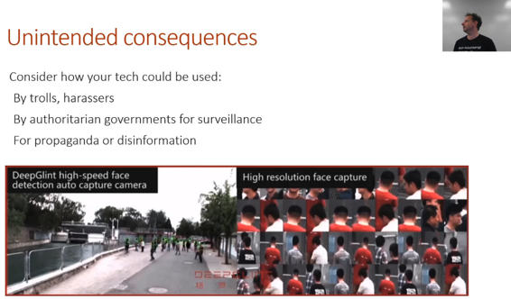

关键的一点是要考虑你在建造什么以及如何使用它。 现在正在进行面部检测的很多努力，包括在我们的课程中。 我们花了很多时间思考如何识别东西以及它在哪里。 有很多很好的理由想要提高农业作物产量，改善医学诊断和治疗计划，改进你的乐高分拣机器人系统等等。但它也被广泛用于监视，宣传和造谣。 同样，问题是我该怎么做？ 我不知道。 但是，在谈论它时，考虑它至关重要。

#### 失控的反馈循环 [[46:10](https://youtu.be/xXXiC4YRGrQ%3Ft%3D46m10s)] 


有时你可以做很好的事情。 例如，meetup.com做了一些我认为非常好的事情，他们早就认识到一个潜在的问题，那就是更多的男人倾向于去参加他们的聚会。 这导致他们的协作过滤系统，你现在熟悉的建议是向男性推荐更多技术内容。 这导致更多的男性转向更多技术内容，导致推荐系统向男性提出更多技术内容。 当我们将算法与人类连接在一起时，这种失控的反馈回路非常常见。 那么Meetup做了什么？ 他们故意做出向女性推荐更多技术内容的决定，并不是因为关于这个世界应该如何的高调，而是因为这是有道理的。 失控的反馈循环是一个错误 - 有些女性想要参加技术聚会，但是当你出席技术聚会时，这是所有男人而你不去，那么它会向男性推荐更多等等等等向前。 所以Meetup在这里做出了一个非常强大的产品管理决策，那就是不做算法所做的事情。 不幸的是，这很少见。 大多数这些失控的反馈循环，例如，在预测性警务中，算法告诉警察去哪里往往是更黑的社区，最终爬上更多的警察，导致更多的逮捕，这有助于告诉更多的警察去更多黑人社区等等。

#### AI中的偏见 [[48:09](https://youtu.be/xXXiC4YRGrQ%3Ft%3D48m9s)] 

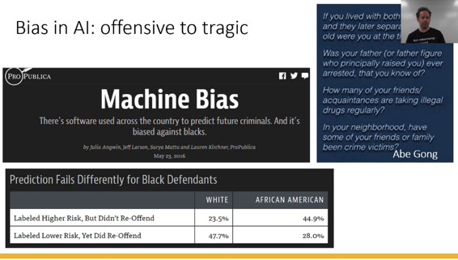

算法偏差的这个问题现在已经非常广泛地传播，并且随着算法越来越广泛地用于特定的政策决策，司法判决，关于谁给予提供什么的日常决定，这只是一个更大的问题。 其中一些实际上是参与产品管理决策的人应该在一开始就看到的，没有意义，并且在该术语的任何定义下都是不合理的。 例如，Abe Gong指出的这些东西 - 这些都是用于预审的问题，因此被要求保释，所以这些人甚至没有被定罪，以及判刑和假释。 尽管存在各种缺陷，去年威斯康星州最高法院维持了这一点。 所以，你是否因为无法支付保释金以及判刑时间而被关进监狱，以及你入狱的时间长短取决于你父亲的所作所为，你父母是否结婚，你的朋友是谁，和你住的地方。 现在看来这些算法实际上非常糟糕，所以最近的一些分析表明它们基本上比偶然性更差。 但即使公司建立他们对这些是有信心的统计准确的相关性，有没有人想象有一个世界，根据你的父亲做了什么来决定你发生了什么是有道理的？

基本层面上的很多这些东西显然是不合理的，而且很多都是以这些方式失败的，你可以凭经验看到这些失控的反馈循环必定已经发生，而这些过度概括必定已经发生。 例如，这些是使用这些算法在任何领域工作的任何人应该准备的交叉表。 因此，预测黑人与白人被告重新犯罪的可能性，我们可以非常简单地计算这一点。 被标记为高风险但没有重新犯罪的人中，白人占23.5％，但非洲裔美国人大约是白人的两倍。 在其他地方，那些被标记为风险较低但又重新犯罪的人是白人的一半，只占非洲裔美国人的28％。 这种东西至少如果你正在采用我们一直在讨论的技术并以任何方式进行生产，为其他人构建API，为人们提供训练，或者其他什么 - 那么至少要确保你正在做的事情可以通过人们知道发生了什么的方式进行跟踪，因此至少他们会被告知。 我认为，假设人们是邪恶的，并试图打破社​​会，这是一个错误。 我想我更愿意假设人们是否在做蠢事，这是因为他们不知道更好。 所以至少要确保他们有这些信息。 我发现很少有ML从业者在思考他们应该在界面中呈现的信息是什么。 然后，我经常与数据科学家交谈，他们会说“哦，我正在研究的东西没有社会影响。”真的吗？ 许多人认为他们所做的事情完全没有意义？ 来吧。 人们付钱给你是出于某种原因。 它会以某种方式影响人们。 那么想想那是什么。

#### 招聘责任 [[52:46](https://youtu.be/xXXiC4YRGrQ%3Ft%3D52m46s)] 


我知道的另一件事是很多人在这里招聘人员，如果你正在招聘人员，我想你们现在都非常熟悉fast.ai哲学，这是一个基本的前提，我把它简化回来这个想法，我不认为人们总体上是邪恶的，我认为他们需要了解并拥有工具。 因此，我们正努力为尽可能多的人提供他们需要的工具，特别是我们正试图将这些工具交给更多样化的人。 因此，如果你参与招聘决策，也许你也可以考虑这种理念。 如果你不仅仅是雇用更广泛的人员，而且还要促进更广泛的人员，并为更广泛的人群提供适当的职业管理，除了其他任何事情，你的公司将做得更好。 实际上，事实证明，更多样化的团队更有创造力，并且倾向于比不那么多样化的团队更快更好地解决问题，但是你也可以避免这种可怕的搞砸，这在某种程度上对世界和另一个都有害。等级，如果你被发现，他们可以摧毁你的公司。

#### IBM和“死亡计算器” [[54:08](https://youtu.be/xXXiC4YRGrQ%3Ft%3D54m8s)] 

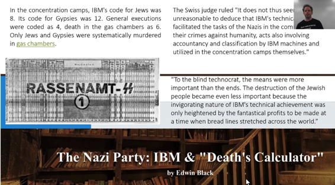

他们也可以摧毁你，或者至少让你在历史上看起来很糟糕。 举几个例子，一个是回到第二次世界大战。 IBM提供了跟踪大屠杀所需的所有基础设施。 这些是他们使用的形式，他们有不同的代码 - 犹太人是8，吉普赛人是12，毒气室死亡是6，他们都在这些打卡上。 你现在可以去看博物馆中的这些打卡，这实际上已经由一位瑞士法官审查过，他说IBM的技术援助促进了纳粹的任务并委托他们犯下危害人类罪。 回顾这些时代的历史是很有意思的，看看当时IBM人们的想法是什么。 显而易见的是，有机会展示技术优势，有机会测试他们的新系统，当然还有他们正在制造的巨额资金。 如果你做了一些事情，在某些时候线下就会出现问题，即使你被告知这样做，这对你个人来说也会成为一个问题。 例如，你们都记得大众汽车的柴油机排放丑闻。 谁是一个入狱的人？ 工程师正在做他的工作。 如果所有关于实际上并没有弄乱世界的东西都不足以说服你，那也会让你的生活陷入困境。 如果你做了一些事情，即使有人告诉你这样做会导致问题，你绝对可以追究刑事责任。 Aleksandr Kogan是交出Cambridge Analytica数据的人。 他是剑桥大学的学者。 现在，世界上一位非常着名的剑桥学者为了摧毁民主的基础而尽自己的一份力量。 这不是我们想要的历史。


**问题：**在你的一条推文中，你说 Dropout 已获得专利 [[56:50](https://youtu.be/xXXiC4YRGrQ%3Ft%3D56m50s)] 。 我认为这是关于Google的WaveNet专利。 这是什么意思？ 你能否就这个问题分享更多见解？ 这是否意味着我们将来必须支付使用 Dropout 费用？ 其中一位专利持有人是Geoffrey Hinton。 所以呢？ 那不是很好吗？ 发明就是专利，等等等等。 我的回答是否定的。 专利变得非常疯狂。 我们每周谈论的具有可专利性的事物数量将是数十种。 如此轻松地进行一些调整然后如果你把它变成专利来阻止所有人在接下来的14年中使用这个小调整你最终得到的情况我们现在所有的一切都以50种不同的方式获得专利。 然后你会得到这些专利巨魔，他们通过购买许多糟糕的小专利而做出了非常好的生意，然后起诉任何不小心结果的人就像在按钮上放圆角一样。 那么对于我们来说，很多东西在深度学习中获得专利意味着什么呢？ 我不知道。

其中一个主要做这件事的人是谷歌和谷歌的人回复这个专利倾向于认为谷歌这样做是因为他们希望防御它，所以如果有人起诉他们，他们可以说不起诉我们我们会起诉你回来因为我们拥有所有这些专利。 问题是，据我所知，他们没有签署所谓的防御性专利承诺，所以基本上你可以签署一份具有法律约束力的文件，说明我们的专利组合只会用于防御而不是进攻。 即使你认为Google的所有管理层都不会变成专利巨头，你也必须记住管理层的变化。 为了给你一个我知道的具体例子，谷歌最近的一位首席财务官对PNL采取了更为激进的立场，我不知道，也许她可能会决定他们应该开始将他们的专利货币化，也可能是那些拥有该专利的团体可能会分拆，然后卖给另一家可能最终进入私募股权手中的公司，并决定将专利或其他任何东西货币化。 所以我认为这是一个问题。 最近合法地发生了大规模的转变，远离软件专利实际上具有任何法律地位，所以这些都有可能最终被抛出法庭但实际情况是，除了一家大公司之外的任何东西都不太可能有经济上的防御能力他们自己反对这些巨大的专利巨魔之一。

如果你编写代码，你不能避免使用专利的东西。 如果你编写的大多数代码都有专利，我不会感到惊讶。 实际上有趣的是，最好的办法就是不要研究专利，因为如果你这样做而且你故意侵犯了，那么处罚就更糟了。 因此，最好的办法是将双手放在耳边，唱一首歌，然后重新开始工作。 关于 Dropout 专利的事情，忘了我说的。 你不知道。 你跳过那一点。

### 风格转移 [[1:01:28](https://youtu.be/xXXiC4YRGrQ%3Ft%3D1h1m28s)] 

[笔记本](https://github.com/fastai/fastai/blob/master/courses/dl2/style-transfer.ipynb)

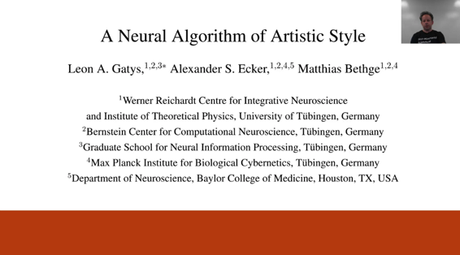

<figcaption class="imageCaption">[https://arxiv.org/abs/1508.06576](https://arxiv.org/abs/1508.06576)</figcaption>

这非常有趣 - 艺术风格。 我们在这里有点复古，因为这实际上是原始的艺术风格论文，并且有很多更新和很多不同的方法，我实际上认为在很多方面原始是最好的。 我们将看一些较新的方法，但实际上我认为原始方法是一种非常好的方法，即使它已经消失了。 让我们跳转到代码。

```
 %matplotlib inline  %reload_ext autoreload  %autoreload 2 
```

```
 **from** **fastai.conv_learner** **import** *  **from** **pathlib** **import** Path  **from** **scipy** **import** ndimage  torch.cuda.set_device(3)  torch.backends.cudnn.benchmark= **True** 
```

```
 PATH = Path('data/imagenet')  PATH_TRN = PATH/'train' 
```

```
 m_vgg = to_gpu(vgg16( **True** )).eval()  set_trainable(m_vgg, **False** ) 
```

这里的想法是我们要拍一张鸟的照片，我们想创作一幅看起来像梵高画的鸟的画。 顺便说一下，我正在做的很多东西都使用了ImageNet。 你不必为我正在做的任何事情下载整个ImageNet。 在[files.fast.ai/data](http://files.fast.ai/data/)中有一个ImageNet示例，它有几个演出应该足够好，我们正在做的一切。 如果你想获得非常好的结果，你可以抓住ImageNet。 你可以从[Kaggle](https://www.kaggle.com/c/imagenet-object-localization-challenge/data)下载它。 本地化竞争实际上也包含所有分类数据。 如果你有空间，最好有一份ImageNet副本，因为它总是派上用场。

```
 img_fn = PATH_TRN/'n01558993'/'n01558993_9684.JPEG'  img = open_image(img_fn)  plt.imshow(img); 
```

所以我只是抓住了我的ImageNet文件夹中的鸟，还有我的小鸟：


```
 sz=288 
```

```
 trn_tfms,val_tfms = tfms_from_model(vgg16, sz)  img_tfm = val_tfms(img)  img_tfm.shape 
```

```
 _(3, 288, 288)_ 
```

```
 opt_img = np.random.uniform(0, 1, size=img.shape).astype(np.float32)  plt.imshow(opt_img); 
```

我要做的是我将从这张照片开始：


而且我会试着让它变得越来越像梵高画的鸟的照片。 我这样做的方式实际上非常简单。 你们都熟悉它 [[1:03:44](https://youtu.be/xXXiC4YRGrQ%3Ft%3D1h3m44s)] 。 我们将创建一个我们称之为_f_的损失函数。 损失函数将输入图像作为输入并作为输出值吐出。 如果图像看起来更像梵高绘制的鸟照片，则该值会更低。 写完这个损失函数后，我们将使用PyTorch渐变和优化器。 渐变乘以学习率，并且我们不会更新任何权重，我们将更新输入图像的像素，使其更像是由梵高画的鸟的图片。 我们将再次通过损失函数来获得更多渐变，并一次又一次地执行。 而已。 所以它与我们解决每个问题的方式完全相同。 你知道我是一个单一的小马，对吧？ 这是我唯一的伎俩。 创建一个损失函数，使用它来获得一些渐变，通过学习率来更新某些东西，总是在之前，我们已经在模型中更新了权重，但是今天，我们不打算这样做。 他们将更新输入中的像素。 但它根本没有什么不同。 我们只是考虑输入而不是权重。 而已。 所以我们差不多完成了。

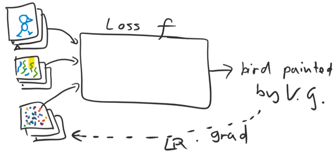

让我们再做几件事 [[1:05:49](https://youtu.be/xXXiC4YRGrQ%3Ft%3D1h5m49s)] 。 让我们在这里提一下，我们的损失函数还有两个输入。一个是鸟的图片。 第二部是梵高的作品。 通过将这些作为输入，这意味着我们将能够稍后重新运行该功能，使其看起来像莫奈画的鸟或梵高绘制的大型喷气机等。这将是三个输入。 最初，正如我们所讨论的，我们的输入是一些随机噪声。 我们从一些随机噪声开始，使用损失函数，获得渐变，使它更像梵高画的鸟，等等。

因此，我想我们可以简单谈谈的唯一一个突出问题是我们如何计算我们的图像看起来像梵高 [[1:07:09](https://youtu.be/xXXiC4YRGrQ%3Ft%3D1h7m9s)] 画的这只鸟。 我们把它分成两部分：

**内容丢失** ：如果它看起来更像鸟（不只是任何鸟，我们进入的特定鸟），则返回较低的值。

**样式丢失** ：如果图像更像VG的样式，则返回较小的数字


有一种方法可以实现内容丢失，这非常简单 - 我们可以查看输出的像素，将它们与鸟的像素进行比较，并进行均方误差，然后将它们相加。 所以，如果我们这样做，我会跑一段时间。 最终我们的图像会变成鸟的图像。 你应该试试看。 你应该尝试这个练习。 尝试使用PyTorch中的优化器以随机图像开始，并使用均方误差像素丢失将其转换为另一个图像。 不是非常令人兴奋，但这将是第一步。

问题是，即使我们已经让我们的风格损失功能运行得很漂亮，然后我们要做的是我们要将这两个加在一起，然后其中一个，我们将乘以一些lambda进行调整风格多少与多少内容有关。 假设我们有一个风格损失，我们选择了一些合理的lambda，如果我们使用像素明智的内容丢失，那么任何使它看起来更像梵高的东西，更不像确切的照片，确切的背景，精确的对比度，照明，一切都会增加内容丢失 - 这不是我们想要的。 我们希望它看起来像鸟，但不是以同样的方式。 它仍然会在同一个地方拥有相同的两只眼睛，并且是同一种形状等等，但不是相同的表现形式。 所以我们要做的是，这会震惊你，我们将使用神经网络！ 我们将使用VGG神经网络，因为这是我去年使用的，我没有时间看看其他事情是否有效，所以你可以在一周内自己尝试一下。

VGG网络是接收输入并将其粘贴到多个层中的东西，我将把它们视为卷积层，显然ReLU在那里，如果它是具有批量规范的VGG，大多数是今天，那么它也有批量规范。 有一些最大的池，等等，但没关系。 我们可以做的是，我们可以采取其中一种卷积激活，然后不是比较这只鸟的像素，我们可以将VGG第5层的激活（由VG绘制的鸟）与我们的VGG第5层激活进行比较。原始鸟（或第6层，或第7层等）。 那么为什么这会更有趣呢？ 好吧，有一件事，它不会是同一只鸟。 它不会完全相同，因为我们没有检查像素。 我们正在检查一些后来的激活。 那些后来的激活集包含哪些内容？ 假设它是在一些最大池之后，它们包含一个较小的网格 - 因此它对事物的位置不太具体。 而不是包含像素颜色值，它们更像是语义的东西，就像这种眼球，是这种毛茸茸，是这种光明，还是这种反光，或平躺，或其他什么。 所以我们希望通过这些层有一定程度的语义特征，如果我们得到的图片与那些激活相匹配，那么任何与这些激活相匹配的图片看起来都像鸟，但它与鸟的表现不同。 这就是我们要做的事情。 这就是我们的内容损失。 人们通常称之为**感性损失，**因为在深度学习中，你总是为每一件明显的事情创造一个新名称，这一点非常重要。 如果将两个激活进行比较，则表示你正在进行感知损失。 而已。 我们的内容损失将是一种感知损失。 然后我们将在以后做风格损失。

让我们首先尝试创造一种最初是随机噪音的鸟，然后我们将使用感知损失来创造类似鸟类的东西，但它不是特定的鸟 [[1:13:13](https://youtu.be/xXXiC4YRGrQ%3Ft%3D1h13m13s)] 。 我们将从288开始到288.因为我们要做一只鸟，所以不存在GPU内存问题。 我真的很失望，因为我意识到我选择了一个相当小的输入图像。 尝试用更大的东西来创造一个非常大的尺寸片段会很有趣。 要记住的另一件事是，如果你正在生产这个，你可以一次做一整批。 人们有时会抱怨这种方法（Gatys是主要作者）Gatys的风格转移方式很慢，我不同意这种方法很慢。 这需要几秒钟，你可以在几秒钟内完成整批操作。


```
 sz=288 
```

所以我们将按照惯例 [[1:14:12](https://youtu.be/xXXiC4YRGrQ%3Ft%3D1h14m12s)] 坚持使用VGG16模型的一些变换。 请记住，转换类具有dunder调用方法（ `__call__` ），因此我们可以将其视为一个函数。 如果你将图像传递给该图像，那么我们将获得转换后的图像。 尽量不要将fast.ai和PyTorch基础设施视为黑盒子，因为它的设计非常容易以分离的方式使用。 因此，这种转换的想法只是“callables”（即你可以用括号做的事情）来自PyTorch，我们完全抄袭了这个想法。 因此，使用torch.vision或fast.ai，你的转换只是可调用。 整个转换管道只是一个可调用的。

```
 trn_tfms,val_tfms = tfms_from_model(vgg16, sz)  img_tfm = val_tfms(img)  img_tfm.shape 
```

```
 _(3, 288, 288)_ 
```

现在我们有一个3乘288乘288因为PyTorch首先喜欢频道 [[1:15:05](https://youtu.be/xXXiC4YRGrQ%3Ft%3D1h15m5s)] 。 正如你所看到的，它已经变成了我们的正方形，它被归一化为（0,1），这些都是正常的东西。

现在我们正在创建一个随机图像。

```
 opt_img = np.random.uniform(0, 1, size=img.shape).astype(np.float32)  plt.imshow(opt_img); 
```


这是我发现的东西。 试图把它变成任何事物的图片实际上很难。 我发现实际上很难让优化器获得合理的渐变效果。 正如我以为我将耗尽这个课程的时间并让自己难堪，我意识到关键问题是图片看起来不像这样。 它们更平滑，所以我通过模糊一点将其转化为以下内容：

```
 opt_img = scipy.ndimage.filters.median_filter(opt_img, [8,8,1])  plt.imshow(opt_img); 
```


我使用了中值滤波器 - 基本上它就像一个中位数池，有效。 一旦我改变它，它立即开始训练非常好。 为了让这些东西发挥作用你需要做的一些小调整有点疯狂，但这里有一些调整。

所以我们从随机图像开始，至少有点平滑 [[1:16:21](https://youtu.be/xXXiC4YRGrQ%3Ft%3D1h16m21s)] 。 我发现我的鸟图像的平均像素大约是这个的一半，所以我把它除以2只是试图让它更容易匹配（我不知道它是否重要）。 将其转换为变量，因为这个图像，请记住，我们将使用优化算法修改这些像素，因此损失函数中涉及的任何内容都需要是变量。 具体而言，它需要一个渐变，因为我们实际上正在更新图像。

```
 opt_img = val_tfms(opt_img)/2  opt_img_v = V(opt_img[ **None** ], requires_grad= **True** )  opt_img_v.shape 
```

```
 _torch.Size([1, 3, 288, 288])_ 
```

所以我们现在有一小批1,3通道，288乘288随机噪声。

```
 m_vgg = nn.Sequential(*children(m_vgg)[:37]) 
```

我们将毫无特别地使用第37层VGG。 如果你打印出VGG网络（你只需键入`m_vgg`并将其打印出来），你就会看到这是中后期层。 所以我们可以抓住前37层并将其转换为顺序模型。 所以现在我们有一个VGG的子集将吐出一些中间层激活，这就是模型将要发生的事情。 所以我们可以拍摄我们的实际鸟类图像，我们想要制作一个小批量的一个。 请记住，如果你使用`None` （也称为`np.newaxis` Numpy，则会在该点引入新的单位轴。 在这里，我想创建一个大小为1的轴，说这是一个尺寸为1的迷你批次。 所以就像我在这里做的那样切片（ `opt_img_v = V(opt_img[ **None** ], requires_grad= **True** )` ）以获得前面的一个单位轴。 然后我们把它变成一个变量，这个不需要更新，所以我们用`VV`说你不需要这个人的渐变。 这样就可以为我们提供目标激活。

*   我们采取了我们的鸟形象
*   把它变成一个变量
*   坚持我们的模型来抓住第37层激活，这是我们的目标。 我们希望我们的内容丢失是这一系列的激活。
*   我们将创建一个优化器（稍后我们将回到这个细节）
*   我们要走多次
*   将梯度归零
*   叫一些损失功能
*   Loss.backward（）

这是高级版本。 我将在稍后回到细节，但关键是我们传递的丢失函数是随机生成的图像 - 优化图像的变量。 所以我们将它传递给我们的损失函数，并且它将使用损失函数更新它，并且损失函数是平均误差损失，比较我们通过VGG传递的当前优化图像以获得中间激活并将其与我们的目标激活进行比较。 我们运行那么多次，我们将打印出来。 我们有我们的鸟，但不是它的代表。

```
 targ_t = m_vgg(VV(img_tfm[ **None** ]))  targ_v = V(targ_t)  targ_t.shape 
```

```
 _torch.Size([1, 512, 18, 18])_ 
```

```
 max_iter = 1000  show_iter = 100  optimizer = optim.LBFGS([opt_img_v], lr=0.5) 
```

#### Broyden-Fletcher-Goldfarb- [Shanno](https://youtu.be/xXXiC4YRGrQ%3Ft%3D1h20m18s) （BFGS） [[1:20:18](https://youtu.be/xXXiC4YRGrQ%3Ft%3D1h20m18s)] 

这里有几个新细节。 一个是奇怪的优化器（ `optim.LBFGS` ）。 任何完成数学和计算机科学课程某些部分的人都会深入学习，我们会使用像Adam和SGD这样的东西，并且总是假设现场没有人知道计算机科学的第一件事，并立即说“你们中的任何人都试过使用BFGS？“基本上有一个完全不同类型的优化算法的悠久历史，我们不使用它来训练神经网络。 当然，答案实际上是那些花了数十年时间研究神经网络的人确实对计算机科学知之甚少，结果发现这些技术总体上效果不好。 但它实际上可以很好地工作，对于那些尚未在学校研究过这种类型的优化算法的人来说，这是一个很好的机会。 BFGS（四个不同的人的首字母缩写）和L代表有限的记忆。 它是一个优化器，所以作为优化器，这意味着有一些损失函数，它将使用一些渐变（并非所有优化器都使用渐变但我们使用的所有渐变）来找到一个方向去尝试制作损失函数通过调整一些参数来降低和降低。 它只是一个优化器。 但它是一种有趣的优化器，因为它比我们在每一步中习惯的工作做得多一些。 具体来说，它的工作方式是它以我们习惯的方式开始，我们只是选择一个开始的地方，在这种情况下，我们已经选择了随机图像。 按照惯例，我们计算梯度。 但是我们不仅仅迈出了一步，但我们实际上做的就是找到梯度，我们也试图找到二阶导数。 二阶导数表示梯度变化的速度有多快。

**渐变** ：函数变化的速度有多快

**二阶导数** ：梯度变化有多快

换句话说，它有多弯曲？ 基本的想法是，如果你知道它不是很弯曲，那么你可能会跳得更远。 但如果它很弯曲那么你可能不想跳得那么远。 因此，在更高的维度中，梯度称为雅可比行列式，而二阶导数称为Hessian。 你会一直看到这些词，但这就是他们的意思。 同样，数学家也必须为所有事物发明你的话语。 他们就像深度学习研究人员 - 可能更加傲慢。 使用BFGS，我们将尝试计算二阶导数，然后我们将使用它来确定要走的路线和走多远 - 所以它不再是未知的疯狂跳跃。

现在的问题是，实际计算Hessian（二阶导数）几乎肯定不是一个好主意 [[1:24:15](https://youtu.be/xXXiC4YRGrQ%3Ft%3D1h24m15s)] 。 因为在你要去的每个可能的方向上，对于你测量渐变的每个方向，你还必须在每个方向上计算Hessian。 它变得非常大。 因此，我们不是实际计算它，而是采取一些步骤，我们基本上看看每个步骤中梯度的变化程度，并使用这个小函数逼近Hessian。 再说一遍，这似乎是一件非常明显的事情，但是直到很久以后有人出人意料地没有人想到它。 跟踪你所采取的每一步都需要大量的记忆，所以，不要跟踪你采取的每一步 - 只需保留最后十或二十。 而那里的第二位，就是L到LBFGS。 因此，有限记忆BFGS意味着保留最后10或20个梯度，使用它来近似曲率，然后使用梯度曲率来估计行进方向和距离。 出于多种原因，这在深度学习中通常不是一个好主意。 显然比做Adam或SGD更新要做的工作要多得多，并且它也使用更多的内存 - 当你有一个GPU来存储它并且有数亿个权重时，内存就更成了一个大问题。 但更重要的是，迷你批次是非常颠簸的，所以弄清楚曲率来确定行程的确切距离正如我们所说的那样（是的，澳大利亚和英国的表达 - 你明白了）。 有趣的是，事实证明，实际上使用二阶导数信息就像是鞍点的磁铁。 所以有一些有趣的理论结果，基本上说如果你使用二阶导数信息，它实际上会将你发送到函数的令人讨厌的平坦区域。 所以通常不是一个好主意。

```
 **def** actn_loss(x): **return** F.mse_loss(m_vgg(x), targ_v)*1000 
```

```
 **def** step(loss_fn):  **global** n_iter  optimizer.zero_grad()  loss = loss_fn(opt_img_v)  loss.backward()  n_iter+=1  **if** n_iter%show_iter==0:  print(f'Iteration: n_iter, loss: **{loss.data[0]}** ')  **return** loss 
```

但在这种情况下 [[1:26:40](https://youtu.be/xXXiC4YRGrQ%3Ft%3D1h26m40s)] ，我们没有优化权重，我们正在优化像素，因此所有规则都会发生变化，实际上结果显示BFGS确实有意义。 因为它每次都做更多的工作，它是一种不同的优化器，在PyTorch中API有点不同。 正如你在这里看到的，当你说`optimizer.step` ，你实际上传递了loss函数。 因此，我们的损失函数是使用特定的损失函数调用`step` ，这是我们的激活损失（ `actn_loss` ）。 在循环内部，你不说步骤，步骤，步骤。 但它看起来像这样。 所以它有点不同，欢迎你尝试重写它以使用SGD，它仍然可以工作。 它只需要更长的时间 - 我还没有尝试使用SGD，我有兴趣知道需要多长时间。

```
 n_iter=0  **while** n_iter <= max_iter: optimizer.step(partial(step,actn_loss)) 
```

```
 _Iteration: n_iter, loss: 0.8466196656227112_  _Iteration: n_iter, loss: 0.34066855907440186_  _Iteration: n_iter, loss: 0.21001280844211578_  _Iteration: n_iter, loss: 0.15562333166599274_  _Iteration: n_iter, loss: 0.12673595547676086_  _Iteration: n_iter, loss: 0.10863320529460907_  _Iteration: n_iter, loss: 0.0966048613190651_  _Iteration: n_iter, loss: 0.08812198787927628_  _Iteration: n_iter, loss: 0.08170554041862488_  _Iteration: n_iter, loss: 0.07657770067453384_ 
```

所以你可以看到损失函数下降 [[1:27:38](https://youtu.be/xXXiC4YRGrQ%3Ft%3D1h27m38s)] 。 我们的优化图像VGG模型第37层激活与目标激活之间的均方误差，记住目标激活是应用于我们的鸟的VGG。 合理？ 所以我们现在已经失去了内容。 现在，关于这种内容丢失，我要说的一件事是我们不知道哪一层能够发挥最佳效果。 因此，如果我们能够进行更多实验，那就太好了。 它在这里的方式很烦人：

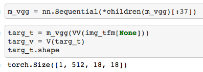

也许我们甚至想要使用多个层。 因此，如果我们能够以某种方式在计算时抓住几层的激活，那么不是在我们想要的层之后砍掉所有层，这不是很好。 现在，我们已经知道一种方法可以做到这一点，当我们做SSD时，我们实际上编写了我们自己的网络，它有许多输出。 记得？ 不同的卷积层，我们吐出一个不同的`oconv`事物？ 但是我真的不想去火炬添加那个。视觉ResNet模型特别是如果以后没有，我想尝试torch.vision VGG模型，然后我想尝试NASNet-A模型，我不想要进入所有这些并改变他们的产出。 除此之外，我希望能够轻松地根据需要打开和关闭某些激活。 所以我们在这个想法之前简单地触及了PyTorch这些奇妙的东西叫做钩子。 你可以使用前向挂钩，将你喜欢的任何内容插入计算的前向传递或后向挂钩，以便将你喜欢的任何内容插入到后向传递中。 所以我们将创造世界上最简单的前钩。

```
 x = val_tfms.denorm(np.rollaxis(to_np(opt_img_v.data),1,4))[0]  plt.figure(figsize=(7,7))  plt.imshow(x); 
```

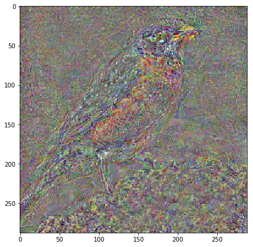

### 前钩 [[1:29:42](https://youtu.be/xXXiC4YRGrQ%3Ft%3D1h29m42s)] 

这是几乎没人知道的事情之一，所以几乎你在互联网上找到的实现风格转移的代码都会有各种可怕的黑客而不是使用前钩。 但是前钩非常容易。

要创建前向钩子，只需创建一个类。 该类必须有一个名为`hook_fn`东西。 你的钩子函数将接收你已经挂钩的`module` ，正向传递的`input` ，然后`output`然后你做你想做的任何事情。 所以我要做的就是将这个模块的输出存储在某个属性中。 而已。 所以`hook_fn`实际上可以调用任何你喜欢的东西，但是“钩子函数”似乎是标准，因为正如你所看到的，构造函数中发生的是我在`m.register_forward_hook` （ `m`将会是我将要挂钩的层，并在调用模块的forward方法时传入要调用的函数。 当调用其forward方法时，它将调用`self.hook_fn` ，它将输出存储在名为`features`的属性中。

```
 **class** **SaveFeatures** ():  features= **None**  **def** __init__(self, m):  self.hook = m.register_forward_hook(self.hook_fn)  **def** hook_fn(self, module, input, output): self.features = output  **def** close(self): self.hook.remove() 
```

所以现在我们可以做的就是像以前一样创建VGG。 让我们把它设置为不可训练，这样我们就不会浪费时间和内存来计算它的渐变。 让我们来看看所有最大池层。 所以让我们来看看这个模块的所有子节点，如果它是一个最大池层，让我们吐出索引减去1 - 这样就可以在最大池之前给出层。 通常，max pool或stride 2 conv之前的层是一个非常层。 它是我们在该网格单元大小上最完整的表示，因为下一层正在改变网格。 所以在我看来，这似乎是一个抓住内容损失的好地方。 我们在网格大小上拥有的最具语义，最有趣的内容。 所以这就是我要选择那些索引的原因。

```
 m_vgg = to_gpu(vgg16( **True** )).eval()  set_trainable(m_vgg, **False** ) 
```

这些是VGG  [[1:32:30](https://youtu.be/xXXiC4YRGrQ%3Ft%3D1h32m30s)] 中每个最大池之前的最后一层的索引。

```
 block_ends = [i-1 **for** i,o **in** enumerate(children(m_vgg))  **if** isinstance(o,nn.MaxPool2d)]  block_ends 
```

```
 _[5, 12, 22, 32, 42]_ 
```

我要抓`32` - 没有特别的理由，只是尝试其他的东西。 所以我要说`block_ends[3]` （即32）。 `children(m_vgg)[block_ends[3]]`会给我第32层VGG作为模块。

```
 sf = SaveFeatures(children(m_vgg)[block_ends[3]]) 
```

然后，如果我调用`SaveFeatures`构造函数，它将会：

`self.hook = {32nd layer of VGG}.register_forward_hook(self.hook_fn)`

现在，每次我对这个VGG模型进行前向传递时，它都会将第32层的输出存储在`sf.features` 。

```
 **def** get_opt():  opt_img = np.random.uniform(0, 1,  size=img.shape).astype(np.float32)  opt_img = scipy.ndimage.filters.median_filter(opt_img, [8,8,1])  opt_img_v = V(val_tfms(opt_img/2)[ **None** ], requires_grad= **True** )  **return** opt_img_v, optim.LBFGS([opt_img_v]) 
```

```
 opt_img_v, optimizer = get_opt() 
```

看到这里 [[1:33:33](https://youtu.be/xXXiC4YRGrQ%3Ft%3D1h33m33s)] ，我正在调用我的VGG网络，但我不会将它存储在任何地方。 我不是说`activations = m_vgg(VV(img_tfm[ **None** ]))` 。 我正在调用它，丢弃答案，然后抓取我们存储在`SaveFeatures`对象中的功能。

`m_vgg()` - 这是你在PyTorch中执行前进路径的方法。 你没有说`m_vgg.forward()` ，你只是将它用作可调用的。 在`nn.module`上使用自动调用`nn.module`自动`forward`调用。 这就是PyTorch模块的工作原理。

因此我们将其称为可调用，最终调用我们的前向钩子，前向钩子将激活存储在`sf.features` ，所以现在我们有了目标变量 - 就像以前一样，但是以更加灵活的方式。

`get_opt`包含我们之前使用的相同的4行代码 [[1:34:34](https://youtu.be/xXXiC4YRGrQ%3Ft%3D1h34m34s)] 。 它只是给我随机图像进行优化，并使用优化器来优化图像。

```
 m_vgg(VV(img_tfm[ **None** ]))  targ_v = V(sf.features.clone())  targ_v.shape 
```

```
 _torch.Size([1, 512, 36, 36])_ 
```

```
 **def** actn_loss2(x):  m_vgg(x)  out = V(sf.features)  **return** F.mse_loss(out, targ_v)*1000 
```

现在我可以继续做同样的事情。 但现在我将使用不同的损失函数`actn_loss2` （激活损失＃2），它不会说`out=m_vgg` ，再次，它调用`m_vgg`来执行前向传递，抛弃结果，并抓住`sf.features` 。 所以现在我的第32层激活，然后我可以做我的MSE损失。 你可能已经注意到，最后一个损失函数和这个函数都乘以一千。 为什么他们乘以一千？ 这就像试图让本课不能正常工作的所有事情一样。 我不习惯有一千个而且没有训练。 今天的午餐时间，没有任何工作。 经过几天试图让这个东西起作用，最后随便注意到“天哪，失去的功能 - 数字真的很低（比如10E-7）”，我想如果它们不是那么低的话。 所以我将它们乘以一千，它就开始工作了。 那么为什么它不起作用？ 因为我们正在做单精度浮点，而单精度浮点并不那么精确。 特别是一旦你获得了那么小的渐变，然后你就会乘以可以很小的学习速度，最后得到一个小数字。 如果它太小了，它们可能会变为零，这就是发生了什么，我的模型还没准备好。 我敢肯定有比乘以一千的更好的方法，但无论如何。 它工作正常。 你将损失函数乘以什么并不重要，因为你所关心的只是它的方向和相对大小。 有趣的是，这与我们训练ImageNet时的情况类似。 我们使用半精度浮点，因为Volta张量核要求。 它实际上是一种标准做法，如果你想让半精度浮动训练，你实际上必须将损失函数乘以比例因子。 我们使用的是1024或512.我认为fast.ai现在是第一个拥有内置半精度浮点所需的所有技巧的库，所以如果你有幸拥有Volta或者你可以支付一个AWS P3，如果你有一个学习者对象，你可以说`learn.half` ，它现在只是神奇地训练正确的半精度浮点数。 它也内置在模型数据对象中，并且都是自动的。 很确定没有其他库这样做。

```
 n_iter=0  **while** n_iter <= max_iter: optimizer.step(partial(step,actn_loss2)) 
```

```
 _Iteration: n_iter, loss: 0.2112911492586136_  _Iteration: n_iter, loss: 0.0902421623468399_  _Iteration: n_iter, loss: 0.05904778465628624_  _Iteration: n_iter, loss: 0.04517251253128052_  _Iteration: n_iter, loss: 0.03721420466899872_  _Iteration: n_iter, loss: 0.03215853497385979_  _Iteration: n_iter, loss: 0.028526008129119873_  _Iteration: n_iter, loss: 0.025799645110964775_  _Iteration: n_iter, loss: 0.02361033484339714_  _Iteration: n_iter, loss: 0.021835438907146454_ 
```

这只是在较早的层 [[1:37:35](https://youtu.be/xXXiC4YRGrQ%3Ft%3D1h37m35s)] 上做同样的事情。 这只鸟看起来更像鸟。 希望你有意义的是，早期的层越来越接近像素。 网格细胞较多，每个细胞较小，感受野较小，语义特征较不复杂。 所以我们得到的越早，它看起来就越像鸟。

```
 x = val_tfms.denorm(np.rollaxis(to_np(opt_img_v.data),1,4))[0]  plt.figure(figsize=(7,7))  plt.imshow(x); 
```

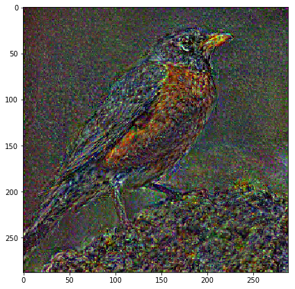

```
 sf.close() 
```

事实上，这篇论文有一张很好的图片，展示了各种不同的层并放大了这个房子 [[1:38:17](https://youtu.be/xXXiC4YRGrQ%3Ft%3D1h38m17s)] 。 他们试图使这个房子看起来像星夜图片。 你可以看到，后来，它非常混乱，而在早些时候，它看起来像房子。 所以这只是做我们刚刚做的事情。 我在学习小组中注意到的一件事是我随时告诉某人回答一个问题，每当我说阅读论文时，论文中都有一个东西告诉你这个问题的答案，总会有这种震惊的表情“看过报纸？ 我？“但严肃地说，报纸已经完成了这些实验并绘制了图片。 论文中有这些东西。 这并不意味着你必须阅读论文的每一部分。 但至少看看图片。 所以查看Gatys的论文，它有很好的照片。 所以他们已经为我们做了实验，但看起来他们没有那么深 - 他们只是得到了一些早期的。


#### 风格搭配 [[1:39:29](https://youtu.be/xXXiC4YRGrQ%3Ft%3D1h39m29s)] 

我们需要做的下一件事是创造风格损失。 我们已经失去了与鸟类有多大的损失。 现在我们需要这种绘画风格如何。 我们将做几乎相同的事情。 我们将抓住某层的激活。 现在的问题是，某些层的激活，让我们说它是一个5x5层（当然没有5x5层，它是224x224，但我们会假装）。 所以这里有一些激活，我们可以根据我们优化的图像和我们的梵高绘画进行这些激活。 让我们来看看我们的梵高画作。 那里是 - 星夜

```
 style_fn = PATH/'style'/'starry_night.jpg' 
```

```
 style_img = open_image(style_fn)  style_img.shape, img.shape 
```

```
 ((1198, 1513, 3), (291, 483, 3)) 
```

```
 plt.imshow(style_img); 
```


我从维基百科下载了这个，我想知道是什么让儿子长时间加载 [[1:40:39](https://youtu.be/xXXiC4YRGrQ%3Ft%3D1h40m39s)]  - 事实证明，我下载的维基百科版本是30,000 x 30,000像素。 他们在那里拥有这个严肃的画廊品质存档非常酷。 我不知道它存在。 不要试图在那上运行神经网络。 完全杀了我的Jupyter笔记本。

所以我们可以为我们的梵高图像做到这一点，我们可以为我们的优化图像做到这一点。 然后我们可以比较两者，我们最终会创建一个像绘画一样的内容的图像，但它不是绘画 - 这不是我们想要的。 我们想要具有相同风格的东西，但它不是绘画，也没有内容。 所以我们想扔掉所有的空间信息。 我们不是想在这里创造一个有月亮的东西，这里的星星和这里的教堂。 我们不想要任何这些。 那么我们如何丢弃所有特殊信息呢？

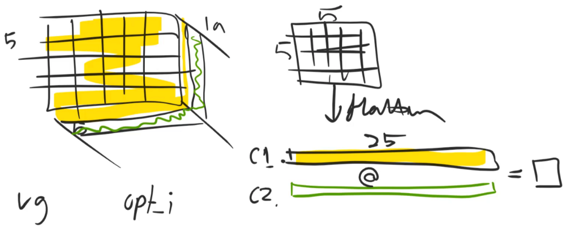

在这种情况下，有19个面 - 19片。 所以，让我们抓住这个将成为5x5矩阵的顶部切片。 现在，让它变平，我们有一个25长的向量。 一下子，我们通过展平它来抛弃大部分空间信息。 现在让我们抓住第二个切片（即另一个通道）并做同样的事情。 因此，我们将通道1展平，通道2展平，它们都有25个元素。 现在，让我们采用我们可以用Numpy中的`@`做的点积（注意： [这是Jeremy对我的点积与矩阵乘法问题的答案](http://forums.fast.ai/t/part-2-lesson-13-wiki/15297/140%3Fu%3Dhiromi) ）。 所以dot产品会给我们一个数字。 那是多少？ 它告诉我们什么？ 假设激活在VGG网络的中间层附近，我们可能会期望这些激活中的一些是画笔描边的纹理，其中一些就像这个区域有多亮，其中一些就像是这部分房子还是圆形物品的一部分，或其他部分，这部分画面有多暗。 所以点积基本上是相关的。 如果这个元素和这个元素都是高度正面的或者都是高度负面的，那么它给我们带来了很大的结果。 在其他地方，如果它们相反，则会产生小的结果。 如果它们都接近于零，则不会产生任何结果。 所以基本上一个点积是对这两件事情有多相似的衡量标准。 因此，如果通道1和通道2的激活是相似的，那么它基本上会说 - 让我们举个例子 [[1:44:28](https://youtu.be/xXXiC4YRGrQ%3Ft%3D1h44m28s)] 。 假设第一个是笔触（C1）的纹理，那里有一个说明对角线方向是画笔笔划（C2）。

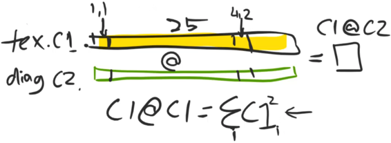

如果C1和C2同时对于单元格（1,1）都是高的，并且对于单元格（4,2）也是如此，那么它说具有纹理的网格单元也倾向于也具有对角线。 因此，当具有纹理的网格单元也具有对角线时，点积将是高的，而当它们不具有对角线时，它们不具有（具有高点积）。 这就是`C1 @ C2` 。 除此之外， `C1 @ C1`有效地是2范数（即C1的平方和）。 这基本上是说纹理通道中有多少网格单元处于活动状态以及它的活动程度。 换句话说， `C1 @ C1`告诉我们纹理绘画有多少。 `C2 @ C2`告诉我们对角线油漆行程有多少。 也许C3是“它是明亮的颜色吗？”所以`C3 @ C3`将是我们多久经常有鲜艳的细胞。

那么我们可以做的是我们可以创建一个包含每个点积的19乘19矩阵 [[1:47:17](https://youtu.be/xXXiC4YRGrQ%3Ft%3D1h47m17s)] 。 就像我们讨论过的那样，数学家必须给所有东西起一个名字，所以这个特殊的矩阵，你把东西弄平，然后做所有的点积，称为Gram矩阵。


我会告诉你一个秘密 [[1:48:29](https://youtu.be/xXXiC4YRGrQ%3Ft%3D1h48m29s)] 。 大多数深度学习从业者或者不知道或者不记得所有这些事情，比如他们曾经在大学学习过的Gram矩阵。 他们可能忘了它，因为他们之后有一个大夜。 它在实践中的运作方式是你意识到“哦，我可以创建一种非空间表示通道如何相互关联”，然后当我写论文时，我不得不四处询问并说“这个东西有名字吗？”有人会说“不是那个Gram矩阵吗？”然后你去看看它就是这样。 所以不要认为你必须先学习所有数学。 使用你的直觉和常识然后你会担心以后通常会调用什么数学。 有时候它会以另一种方式起作用，而不是因为我无法做数学。

所以这被称为Gram矩阵 [[1:49:22](https://youtu.be/xXXiC4YRGrQ%3Ft%3D1h49m22s)] 。 当然，如果你是一个真正的数学家，你说这就好像你总是知道它是一个Gram矩阵并且你只是去哦是的，我们只计算Gram矩阵是非常重要的。 那么Gram矩阵就是这种地图 - 对角线也许是最有趣的。 对角线是哪些通道最活跃，然后对角线是哪些通道趋于一起出现。 总的来说，如果两张图片具有相同的样式，那么我们期待一些激活层，它们将具有相似的Gram矩阵。 因为如果我们发现激活水平可以捕获很多东西，比如绘画描边和颜色，那么单独的对角线（在Gram矩阵中）甚至可能就足够了。 这是另一个有趣的家庭作业，如果有人想接受它，是尝试做Gatys的风格转移而不是使用Gram矩阵而只是使用Gram矩阵的对角线。 这就像要改变的单行代码。 但我没有看到它尝试过，我不知道它是否会起作用，但它可能工作正常。

“好的，是的，克里斯汀，你已经尝试过了” [[1:50:51](https://youtu.be/xXXiC4YRGrQ%3Ft%3D1h50m51s)] 。 “我已经尝试过了，它大部分时间都有效，除非你有可爱的照片，你需要两种风格出现在同一个地方。 所以看起来像一半的草和一半的人群，你需要这两种风格。“（Christine）。 很酷，你还要做你的作业，但克里斯汀说她会为你做的。

```
 **def** scale_match(src, targ):  h,w,_ = img.shape  sh,sw,_ = style_img.shape  rat = max(h/sh,w/sw); rat  res = cv2.resize(style_img, (int(sw*rat), int(sh*rat)))  **return** res[:h,:w] 
```

```
 style = scale_match(img, style_img) 
```

```
 plt.imshow(style)  style.shape, img.shape 
```

```
 _((291, 483, 3), (291, 483, 3))_ 
```


所以这是我们的绘画 [[1:51:22](https://youtu.be/xXXiC4YRGrQ%3Ft%3D1h51m22s)] 。 我试图调整这幅画的大小，所以它的大小和我的鸟图相同。 这就是所有这一切。 只要它有很多漂亮的风格，我使用它并不重要。

我像以前一样抓住我的优化器和随机图像：

```
 opt_img_v, optimizer = get_opt() 
```

这一次，我为所有的`block_ends`调用`SaveFeatures` ，这`block_ends`我提供一个SaveFeatures对象数组 - 每个模块对应一个出现在max pool之前的层。 因为这一次，我想玩不同的激活层样式，或者更具体地说，我想让你玩它。 所以现在我已经有了一大堆。

```
 sfs = [SaveFeatures(children(m_vgg)[idx]) **for** idx **in** block_ends] 
```

`style_img`是我的梵高画。 所以我把我的`style_img` ，通过我的转换来创建我的变换样式图像（ `style_tfm` ）。

```
 style_tfm = val_tfms(style_img) 
```

将它转换为变量，通过我的VGG模块的正向传递，现在我可以浏览所有的SaveFeatures对象并获取每组功能。 注意我之后调用`clone` ，如果我再次调用我的VGG对象，它将替换这些内容。 我还没有想过这是否有必要。 如果你拿走它而不是，那没关系。 但我只是小心翼翼。 所以这里现在是每个`block_end`层的激活数组。 在这里，你可以看到所有这些形状：

```
 m_vgg(VV(style_tfm[ **None** ]))  targ_styles = [V(o.features.clone()) **for** o **in** sfs]  [o.shape **for** o **in** targ_styles] 
```

```
 _[torch.Size([1, 64, 288, 288]),_  _torch.Size([1, 128, 144, 144]),_  _torch.Size([1, 256, 72, 72]),_  _torch.Size([1, 512, 36, 36]),_  _torch.Size([1, 512, 18, 18])]_ 
```

你可以看到，能够迅速提升列表理解能力，这对你的Jupyter摆弄是非常重要的 [[1:53:30](https://youtu.be/xXXiC4YRGrQ%3Ft%3D1h53m30s)] 。 因为你真的希望能够立即看到我的频道（64,128,256，...）和网格大小减半，正如我们所期望的那样（288,144,72 ......），因为所有这些都出现在最大游泳池之前。

因此，要做Gram MSE损失，它将是输入的Gram矩阵与目标的克数矩阵的MSE损失。 并且Gram矩阵只是`x`与`x`转置（ `xt()` ）的矩阵乘法，其中x简单地等于我的输入，其中我将批量和通道轴全部压平在一起。 我只有一个图像，所以你可以忽略批量部分 - 它基本上是通道。 然后其他一切（ `-1` ），在这种情况下是高度和宽度，是另一个维度，因为现在将按高度和宽度进行通道，然后正如我们所讨论的那样我们可以将矩阵乘以它的转置。 只是为了规范它，我们将它除以元素的数量（ `b*c*h*w` ） - 如果我说`input.numel` （元素的数量）将是相同的东西，它实际上会更优雅。 再次，这给了我很小的数字，所以我将它乘以一个大数字，使它更合理。 所以这基本上是我的损失。

```
 **def** gram(input):  b,c,h,w = input.size()  x = input.view(b*c, -1)  **return** torch.mm(x, xt())/input.numel()*1e6  **def** gram_mse_loss(input, target):  **return** F.mse_loss(gram(input), gram(target)) 
```

所以现在我的风格损失是让我的图像进行优化，通过VGG前向传递，在所有SaveFeatures对象中获取一系列特征，然后在每个层上调用我的Gram MSE丢失 [[1:55 ：13](https://youtu.be/xXXiC4YRGrQ%3Ft%3D1h55m13s)] 。这将给我一个数组然后我只是添加它们。现在你可以用不同的权重添加它们，你可以添加子集，或者其他任何东西。在这种情况下，我只是抓住所有这些。

```
 DEF style_loss（X）：m_vgg（opt_img_v）超时= [V（o.features）为 ø 在 SFS] 损失= [gram_mse_loss（O，S）为 O，S 在拉链（奏，targ_styles）]  返回总和（损失）
```

像以前一样将它传递给我的优化器：

```
n_iter = 0  而 n_iter <= max_iter：optimizer.step（partial（step，style_loss））
```

```
 迭代：n_iter，损失：230718.453125 
迭代：n_iter，损失：219493.21875 
迭代：n_iter，损失：202618.109375 
迭代：n_iter，损失：481.5616760253906 
迭代：n_iter，损失：147.41177368164062 
迭代：n_iter，损失：80.62625122070312 
迭代：n_iter，损失：49.52326965332031 
迭代：n_iter，损失：32.36254119873047 
迭代次数：n_iter，损失：21.831811904907227 
迭代次数：n_iter，损失：15.61091423034668 
```

在这里，我们有一个梵高风格的随机图像，我觉得它很酷。

```
x = val_tfms.denorm（np.rollaxis（to_np（opt_img_v.data），1,4））[0] plt.figure（figsize =（7,7））plt.imshow（x）;
```

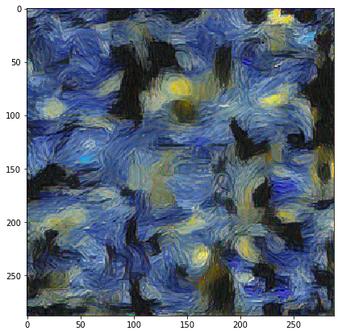

Gatys再次为我们做了这件事。这是梵高风格的不同层次的随机图像。所以第一个，正如你所看到的，激活是简单的几何事物 - 根本不是很有趣。后面的层更有趣。所以我们有点怀疑，如果我们想要看起来很好的话，我们可能想要使用后期层来主要用于我们的风格损失。


我添加了`SaveFeatures.close` [[1:56:35](https://youtu.be/xXXiC4YRGrQ%3Ft%3D1h56m35s)] ，只是打电话`self.hook.remove()`。记住，我存储了钩子，`self.hook`因此`hook.remove()`摆脱它。摆脱它是一个好主意，否则你可能只是继续使用内存。所以最后，我只需浏览每个SaveFeatures对象并关闭它：

```
 对于 SF 在 SFS：sf.close（）
```

#### 风格转移 [[1:57:08](https://youtu.be/xXXiC4YRGrQ%3Ft%3D1h57m8s)] 

风格转移增加了内容损失和风格损失以及一些权重。所以没有太多可展示的。

抓住我的优化器，抓住我的形象：

```
 opt_img_v，optimizer = get_opt（） 
```

我的综合损失是在一个特定层面的MSE损失，我的所有层次的风格损失，总结风格损失，将它们添加到内容丢失，内容丢失我正在缩放。实际上风格损失，我已经缩小了1E6。因此它们的尺寸完全相同。将它们一起添加。再次，你可以尝试加权不同的风格损失，或者你可以删除其中的一些，所以这是最简单的版本。

```
 DEF comb_loss（X）：m_vgg（opt_img_v）超时= [V（o.features）为 ø 在 SFS] 损失= [gram_mse_loss（O，S）为 O，S 在拉链（奏，targ_styles）] cnt_loss = F.mse_loss （outs [3]，targ_vs [3]）* 1000000 style_loss = sum（loss ） 返回 cnt_loss + style_loss
```

训练：

```
n_iter = 0  而 n_iter <= max_iter：optimizer.step（partial（step，comb_loss））
```

```
 迭代：n_iter，丢失：1802.36767578125 
迭代：n_iter，丢失：1163.05908203125 
迭代：n_iter，丢失：961.6024169921875 
迭代：n_iter，丢失：853.079833984375 
迭代：n_iter，丢失：784.970458984375 
迭代：n_iter，丢失：739.18994140625 
迭代：n_iter，丢失：706.310791015625 
迭代：n_iter，损失：681.6689453125 
迭代次数：n_iter，损失：662.4088134765625 
迭代次数：n_iter，损失：646.329833984375 
```

```
x = val_tfms.denorm（np.rollaxis（to_np（opt_img_v.data），1,4））[0] plt.figure（figsize =（9,9））plt.imshow（x，interpolation ='lanczos'）plt .axis（ 'OFF'）;
```


```
 对于 SF 在 SFS：sf.close（）
```

和神圣的废话，它看起来确实很好。所以我认为这非常棒。这里的主要内容是，如果你想用神经网络解决问题，你所要做的就是建立一个损失函数，然后优化一些东西。损失函数是一个较低的数字是你更高兴的东西。因为当你优化它时，它会尽可能地降低这个数字，它会做你想做的事情。所以在这里，Gatys想出了一个丢失函数，当它看起来像我们希望它看起来像的东西时，它可以很好地成为一个较小的数字，它看起来像我们希望的样式的风格。这就是我们所要做的。

它实际上是什么 [[1:59:10](https://youtu.be/xXXiC4YRGrQ%3Ft%3D1h59m10s)] ，除了实现Gram MSE损失，就像6行代码那样，这就是我们的损失函数：


将它传递给我们的优化器，等待大约5秒钟，我们就完成了。请记住，我们可以一次做一批这些，所以我们可以等待5秒钟，其中64个将完成。所以我觉得这很有意思，自从这篇论文出版以来，它确实激发了许多有趣的工作。但对我来说，大部分有趣的工作尚未发生，因为对我来说，有趣的工作是将人类的创造力与这些工具结合起来的工作。我没有看到很多工具，你可以下载或使用艺术家控制的工具，并可以交互式地做事。与[Google Magenta](https://magenta.tensorflow.org/)的人交谈很有意思[](https://magenta.tensorflow.org/)项目是他们创造性的AI项目，他们用音乐做的所有东西都是关于这一点的。它是音乐家可以用来实时执行的构建工具。由于Magenta，你会在音乐领域看到更多这样的东西。如果你去他们的网站，有各种各样的东西你可以按下按钮来实际改变鼓节拍，旋律，键等。你绝对可以看到Adobe或Nvidia开始发布小原型并开始这样做，但这种创造性的AI爆炸还没有发生。我认为我们拥有几乎所有我们需要的技术，但是没有人将它组合成一个东西并且说“看看我构建的东西并看看人们用我的东西构建的东西。”所以这只是一个巨大的机会领域。

所以我在课程开始时提到的论文 [[2:01:16](https://youtu.be/xXXiC4YRGrQ%3Ft%3D2h1m16s)]  - 我们可以将美国队长的盾牌添加到任意绘画中的论文基本上都使用了这种技巧。诀窍是通过一些小的调整，使粘贴的美国队长盾很好地融合在一起。但是这篇论文只有几天的历史，所以这将是一个非常有趣的项目，因为你可以使用所有这些代码。它确实利用了这种方法。然后你可以开始使内容图像像带有盾牌的绘画，然后风格图像可以是没有盾牌的绘画。这将是一个良好的开端，然后你可以看到他们试图在本文中解决的具体问题，以使其更好。但是你现在可以开始吧。

**问题**：两个问题 - 早些时候有一些人对你对Pyro和概率编程的想法表示了兴趣 [[2:02:34](https://youtu.be/xXXiC4YRGrQ%3Ft%3D2h2m34s)]。所以TensorFlow现在已经获得了TensorFlow的概率。那里有一堆概率编程框架。我认为它们很吸引人，但是从某种意义上来说还没有得到证实，我没有看到任何概率编程系统所做的任何事情，没有它们就没有做得更好。基本前提是它允许你创建更多关于你如何思考世界的模型，然后插入参数。所以，当我20年前从事管理咨询工作时，我们曾经做过很多工作，我们会使用电子表格，然后我们会有这些蒙特卡罗模拟插件 - 有一个叫做风险（？）和一个叫水晶球。几十年后我不知道它们是否仍然存在。基本上他们会让你更改一个电子表格单元格，说这不是一个特定的值，但它实际上代表了这个均值和标准差的值的分布，或者它得到了这个分布，然后你会点击一个按钮，电子表格会重新计算千万次从这些发行版中提取随机数，并向你显示你的结果的分布，可能是利润或市场份额或其他。我们一直都在使用它们。显然觉得电子表格是做这种工作的一个更明显的地方，因为你可以更自然地看到它，但我不知道。走着瞧。在这个阶段，我希望它变得有用，因为我发现它非常有吸引力，并且它吸引我说我曾经做过很多的工作。那里'实际上围绕这些东西的整个实践，他们曾经称之为系统动力学，它真的建立在这种东西之上，但它并没有完全消失。

**问题**：然后有一个关于通用风格转移的预训练的问题 [[2:04:57](https://youtu.be/xXXiC4YRGrQ%3Ft%3D2h4m57s)] 。我不认为你可以预先训练一般的风格，但你可以预先训练一张特定风格的通用照片，这是我们要去的地方。虽然，它可能最终成为一个功课。我还没有决定。但是我要做所有的事情。

**问**：请让他谈谈多GPU  [[2:05:31](https://youtu.be/xXXiC4YRGrQ%3Ft%3D2h5m31s)] 。哦，是的，我没有关于那个幻灯片。我们即将打到它。

在我们开始之前，只是Gatys的论文中另一幅有趣的图片。他们还有一些不适合我的幻灯片，但风格不同的卷积层。不同的样式与内容比例，这里是不同的图像。显然这不是梵高，这是一个不同的组合。所以你可以看到，如果你只是做所有的风格，你看不到任何形象。如果你做了很多内容，但你使用足够低的卷积层，它看起来没问题，但背景有点愚蠢。所以你想要在中间的某个地方。所以你可以玩它并进行实验，但也可以用这篇论文来指导你。


#### 数学 [[2:06:33](https://youtu.be/xXXiC4YRGrQ%3Ft%3D2h6m33s)] 

实际上，我想我现在可能会在数学上工作了，下周我们将讨论多GPU和超级分辨率，因为这是来自论文，而且在我们谈论论文之后，我真的希望你做的一件事就是阅读论文，然后在论坛上提出任何不清楚的问题。但是本文的一个关键部分我想谈谈并讨论如何解释它。所以论文说，我们将得到一个输入图像_x_，这个小东西通常意味着它是一个矢量，Rachel，但这个是一个矩阵。我想这也可能意味着。我不知道。通常小写字母粗体表示矢量或带顶部箭头的小写字母表示矢量。通常大字母表示矩阵或小写字母，顶部有两个箭头表示矩阵。在这种情况下，我们的图像是一个矩阵。我们基本上将它视为一个载体，所以也许我们只是领先于自己。


因此，我们得到了输入图像_x_，它可以通过滤波器响应（即激活）在CNN的特定层中进行编码。过滤响应是激活。希望这是你们都明白的。这基本上是CNN的作用，它产生了多层激活。一层有一堆过滤器，可产生许多通道。今年说层数L的资本为N _l_过滤器。同样，这个资本并不意味着矩阵。所以我不知道，数学符号是如此不一致。因此，资本Nl在L层处有不同的过滤器，这意味着它还具有许多特征映射。因此，请确保你可以看到此字母Nl与此字母相同。因此，你必须非常小心地阅读这些字母，并认识到它就像是快照，这就是那个字母。很明显，Nl过滤器创建了创建Nl特征映射或通道，每个都是大小为M _l_（好吧，我可以看到这是展开的地方）。所以这就像M [ _l_ ]中的numpy符号。这是_升_个层。所以M代表第_l_层。尺寸是高度乘以宽度 - 所以我们把它弄平了。因此，层l中的响应可以存储在矩阵F中（现在是_我_出于某种原因走在顶端）。所以这不是f ^ _l_，它只是另一个索引。我们只是为了好玩而移动它。这里我们说这是R的一个元素 - 这是一个特殊的R意味着实数N倍M（这就是说它的维数是N乘以M）。所以这非常重要，你不要继续前进。它与PyTorch一样，确保你首先了解尺寸的等级和大小，与数学相同。这些是你停下来的地方，想想为什么N是M？ N是多个滤波器，M是高度和宽度。那么当我们做的时候你还记得那件事`.view(b*c, -1)`吗？就是这样。所以尝试将代码映射到数学。所以F是`x`：


如果我对你更好，我会使用与纸张相同的字母。但是我太忙于让这个小小的事情小心翼翼地做到这一点。所以你可以回去重新命名为资本F.

所以这就是为什么我们将L移到顶部是因为我们现在要进行更多的索引。在Numpy或PyTorch中的其他地方，我们用方括号将事物编入索引，然后在之间用逗号表示很多东西。数学方法是用你周围的小字母包围你的信件 - 只要把它们扔到那里。所以这里，F _l_是F 的第_l_层，然后_ij_是第_1_层位置_j_处的第_i_个滤波器的激活。因此，位置_j_达到尺寸M，其尺寸高度与宽度一致。这是容易混淆的事情。通常你会看到一个_ij_并假设它正在索引到图像的位置，如高度和宽度，但它完全不是，是吗？它通过展平图像索引到频道。它甚至告诉你 - 它是第_l_层中展平图像中第_j_个位置的第_i_个滤镜/通道。所以除非你明白F是什么，否则你将无法在论文中获得更多。这就是为什么这些是你停下来并确保你感到舒服的原因。

所以现在，内容丢失，我不会花太多时间，但基本上我们只是检查激活的价值与预测平方 [[2:12:03](https://youtu.be/xXXiC4YRGrQ%3Ft%3D2h12m3s)] 。所以我们的内容会丢失。风格损失将大致相同，但使用Gram矩阵G：


我真的很想告诉你这个。我认为这是超级的。有时我真的很喜欢你能用数学符号做的事情，而且它们通常也可以在J和APL中完成，这就是这种隐式循环。这就是说_i_有一大堆值和_j的_一大堆值，我将为所有这些值定义G.还有一大堆_l_的值，_我_也将为所有这些定义G.所以，我的所有的G在每_升_每一个的_我_在每_Ĵ_，这将等于什么。你可以看到东西有一个_i_和一个_j_和一个_l_，匹配G，它也有一个_k_，这是总和的一部分。那么这里发生了什么？那么，它说我的革兰氏矩阵层_升_用于_我_在一个轴个位置和_Ĵ_在另一轴个位置等于我的F矩阵（让我的展平矩阵）为_我_在该层与第信道所述_Ĵ_个在相同的层信道，然后我要去求和。我们打算拿_k_位置并将它们相乘，然后将它们全部加起来。所以这正是我们在计算Gram矩阵之前所做的。所以这个，有很多事情要发生，因为有一些，对我来说，非常简洁的符号 - 这是有三个隐含的循环同时进行，加上一个显式循环的总和，然后他们都一起工作来创建这个每层的Gram矩阵。那么让我们回过头来看看你是否可以匹配这个。所有这一切都在同时发生，这是非常好的。

而已。所以下周，我们将会看到一个非常类似的方法，基本上是重新进行样式转换，但是我们实际上要训练神经网络来为我们做这件事，而不是必须进行优化。我们还会看到你可以做同样的事情来做超级分辨率。而且我们也会回过头来重新审视一些SSD的内容并进行一些细分。因此，如果你忘记了SSD，本周可能值得进行一些修改。好的，谢谢大家。下周见。
