# 深度学习：第二部分第十三课

[论坛](http://forums.fast.ai/t/lesson-13-discussion-and-wiki/15297/1) / [视频](https://youtu.be/xXXiC4YRGrQ)

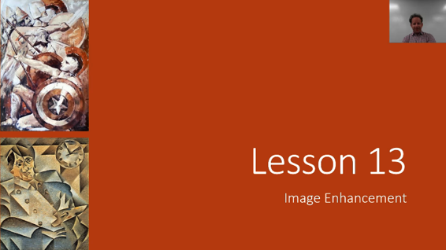


图像增强 - 我们将涵盖您可能熟悉的这幅画。 但是，你之前可能没有注意到这幅画中的老鹰。 之前你可能没有注意到这幅画的原因是它上面没有鹰。 出于同样的原因，第一张幻灯片上的画也不习惯美国队长的盾牌。


这是一篇很酷的新论文，刚刚在几天前[出版](https://arxiv.org/abs/1804.03189) ，名为[Deep Painterly Harmonization](https://arxiv.org/abs/1804.03189) ，它几乎完全采用了我们将在本课中学习的技巧，并进行了一些小的调整。 但你可以看到基本的想法是将一张图片粘贴在另一张图片的顶部，然后使用某种方法将两者结合起来。 这种方法被称为“风格转移”。

在我们谈论这个之前，我想提一下William Horton的这个非常酷的贡献，他将这种随机权重平均技术添加到fastai库中，现在它已经合并并准备好了。 他写了一篇关于我强烈建议您查看的帖子，不仅因为随机权重平均让您从现有的神经网络中获得更高的性能，基本上没有额外的工作（就像为您的拟合函数添加两个参数一样简单： `use_swa` ， `swa_start` ）但他也描述了他构建这个的过程以及他如何测试它以及他如何为图书馆做出贡献。 所以我觉得如果你有兴趣做这样的事情会很有趣。 我认为威廉之前没有建立过这种类型的图书馆，因此他描述了他是如何做到的。


[https://medium.com/@hortonhearsafoo/adding-a-cutting-edge-deep-learning-training-technique-to-the-fast-ai-library-2cd1dba90a49](https://medium.com/%40hortonhearsafoo/adding-a-cutting-edge-deep-learning-training-technique-to-the-fast-ai-library-2cd1dba90a49)


#### TrainPhase [ [2:01](https://youtu.be/xXXiC4YRGrQ%3Ft%3D2m1s) ]

[笔记本](https://github.com/fastai/fastai/blob/master/courses/dl2/training_phase.ipynb)

对fastai库的另一个很酷的贡献是新的列车阶段API。 而且我将要做一些我以前从未做过的事情，那就是我要介绍别人的笔记本。 我以前没有这么做的原因是因为我不喜欢任何笔记本足以认为它们值得展示它，但是Sylvain在这里做了出色的工作，不仅创造了这个新的API而且创造了一个美丽的笔记本描述了什么它是什么以及它是如何工作的等等。 这里的背景是你们知道我们一直在努力更快地训练网络，部分是作为Dawn替补席比赛的一部分，也是因为你将在下周学到的原因。 我上周在论坛上提到，如果我们有一种更简单的方法来尝试不同的学习率计划等，我们的实验会非常方便，而且我设计了一个我想到的API，因为如果有人真的很酷可以这样写，因为我现在要睡觉了，明天我需要它。 Sylvain在论坛上回答说这听起来像是一个很好的挑战，到24小时后，它已经完成并且它非常酷。 我想带你通过它，因为它可以让你研究以前没人尝过的东西。

它被称为TrainPhase API [ [3:32](https://youtu.be/xXXiC4YRGrQ%3Ft%3D3m32s) ]，显示它的最简单方法是展示它的作用的一个例子。 这是对您熟悉的学习率图表的迭代。 这是我们以0.01的学习率训练一段时间然后我们以0.001的学习率训练一段时间。 我实际上想要创建非常类似于学习率图表的东西，因为大多数训练过ImageNet的人都使用这种逐步的方法，而实际上并不是内置于fastai的东西，因为它通常不是我们推荐的东西。 但是为了复制现有的论文，我想以同样的方式去做。 因此，不是用不同的学习率编写一些合适的，适合的，适合的呼叫，而是能够以这个学习率训练n个时期，然后以该学习率训练m个时期。


所以这是你如何做到这一点：

```
 phases = [TrainingPhase(epochs=1, opt_fn=optim.SGD, lr = 1e-2),  TrainingPhase(epochs=2, opt_fn=optim.SGD, lr = 1e-3)] 
```

阶段是具有特定优化器参数的训练时段，并且`phases`由许多训练阶段对象组成。 训练阶段对象说明要训练多少个时期，使用什么优化功能，以及我们将看到的其他事物的学习率。 在这里，您将看到刚刚在该图表上看到的两个训练阶段。 所以，现在，你不是打电话给`learn.fit` ，而是说：

```
 learn.fit_opt_sched(phases) 
```

换句话说，使用具有这些阶段的优化程序调度程序来学习。 从那里开始，你传入的大部分内容都可以按照惯例发送到fit函数，因此大多数常用参数都能正常工作。 一般来说，我们可以使用这些训练阶段，您会发现它符合常规方式。 然后，当你说`plot_lr`你会看到上面的图表。 它不仅绘制学习率，还绘制动量，每个阶段，它告诉你它使用了什么优化器。 你可以关闭优化器的打印（ `show_text=False` ），你可以关闭动作的打印（ `show_moms=False` ），你可以做其他的小事情，比如训练阶段可以有一个`lr_decay`参数[ [5:47](https://youtu.be/xXXiC4YRGrQ%3Ft%3D5m47s) ] ：

```
 phases = [TrainingPhase(epochs=1, opt_fn=optim.SGD, lr = 1e-2),  TrainingPhase(epochs=1, opt_fn=optim.SGD,  lr = (1e-2,1e-3), lr_decay=DecayType.LINEAR),  TrainingPhase(epochs=1, opt_fn=optim.SGD, lr = 1e-3)] 
```

所以这里是一个固定的学习率，然后是一个线性衰减学习率，然后是一个固定的学习率，它放弃了这张图：

```
 lr_i = start_lr + (end_lr - start_lr) * i/n 
```


这可能是一种非常好的训练方式，因为我们知道在高学习率下，你可以更好地探索，而且在低学习率的情况下，你可以更好地进行微调。 并且在两者之间逐渐滑动可能会更好。 所以我怀疑这实际上并不是一个糟糕的方法。

你可以使用其他衰变类型，如余弦[ [6:25](https://youtu.be/xXXiC4YRGrQ%3Ft%3D6m25s) ]：

```
 phases = [TrainingPhase(epochs=1, opt_fn=optim.SGD, lr = 1e-2),  TrainingPhase(epochs=1, opt_fn=optim.SGD, lr =(1e-2,1e-3),  lr_decay=DecayType.COSINE),  TrainingPhase(epochs=1, opt_fn=optim.SGD, lr = 1e-3)] 
```

这可能更有意义，因为它具有真正潜在有用的学习率退火形状。

```
 lr_i = end_lr + (start_lr - end_lr)/2 * (1 + np.cos(i * np.pi)/n) 
```


指数是超级流行的方法：

```
 lr_i = start_lr * (end_lr/start_lr)**(i/n) 
```


多项式不是非常受欢迎但实际上在文献中比其他任何东西都更好，但似乎在很大程度上被忽略了。 所以多项式是很好的意识到。 Sylvain所做的是他给了我们每条曲线的公式。 因此，使用多项式，您可以选择要使用的多项式。 我相信0.9的p是我见过的非常好的结果 - 仅供参考。

```
 lr_i = end_lr + (start_lr - end_lr) * (1 - i/n) ** p 
```

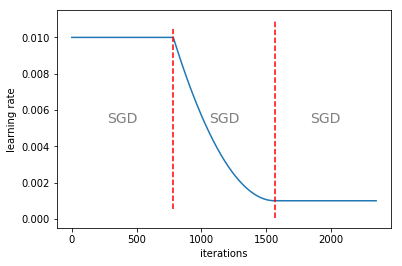

如果你在LR衰减时没有给出学习率的元组，那么它将一直衰减到零[ [7:26](https://youtu.be/xXXiC4YRGrQ%3Ft%3D7m26s) ]。 正如您所看到的，您可以愉快地在不同的点开始下一个周期。

```
 phases = [TrainingPhase(epochs=1, opt_fn=optim.SGD, lr = 1e-2),  TrainingPhase(epochs=1, opt_fn=optim.SGD, lr = 1e-2,  lr_decay=DecayType.COSINE),  TrainingPhase(epochs=1, opt_fn=optim.SGD, lr = 1e-3)] 
```

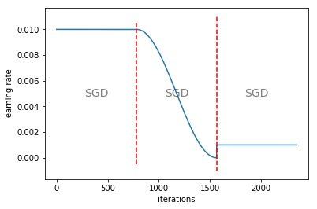

#### SGDR [ [7:43](https://youtu.be/xXXiC4YRGrQ%3Ft%3D7m43s) ]

所以很酷的是，现在我们可以使用除了这些训练阶段之外的所有现有计划复制。 所以这里有一个名为`phases_sgdr`的函数，它使用新的训练阶段API执行SGDR。

```
 **def** phases_sgdr(lr, opt_fn, num_cycle,cycle_len,cycle_mult):  phases = [TrainingPhase(epochs = cycle_len/ 20, opt_fn=opt_fn,  lr=lr/100),  TrainingPhase(epochs = cycle_len * 19/20,  opt_fn=opt_fn, lr=lr, lr_decay=DecayType.COSINE)]  **for** i **in** range(1,num_cycle):  phases.append(TrainingPhase(epochs=cycle_len*  (cycle_mult**i), opt_fn=opt_fn, lr=lr,  lr_decay=DecayType.COSINE))  **return** phases 
```

所以你可以看到，如果他运行这个时间表，这就是它的样子：


他甚至完成了我所拥有的小技巧，你只需要一点点学习率，然后弹出并做几个周期，周期越来越长[ [8:05](https://youtu.be/xXXiC4YRGrQ%3Ft%3D8m5s) ]。 这一切都是在一个功能中完成的。

#### 1周期[ [8:20](https://youtu.be/xXXiC4YRGrQ%3Ft%3D8m20s) ]

我们现在可以使用一个小函数实现新的1循环。

```
 **def** phases_1cycle(cycle_len,lr,div,pct,max_mom,min_mom):  tri_cyc = (1-pct/100) * cycle_len  **return** [TrainingPhase(epochs=tri_cyc/2, opt_fn=optim.SGD,  lr=(lr/div,lr), lr_decay=DecayType.LINEAR,  momentum=(max_mom,min_mom),  momentum_decay=DecayType.LINEAR),  TrainingPhase(epochs=tri_cyc/2, opt_fn=optim.SGD,  lr=(lr,lr/div), lr_decay=DecayType.LINEAR,  momentum=(min_mom,max_mom),  momentum_decay=DecayType.LINEAR),  TrainingPhase(epochs=cycle_len-tri_cyc, opt_fn=optim.SGD,  lr=(lr/div,lr/(100*div)),  lr_decay=DecayType.LINEAR,  momentum=max_mom)] 
```

因此，如果我们适合这一点，我们得到这个三角形，接着是一点点平坦的一点，动量是一个很酷的东西 - 动量有动量衰减。 在第三个TrainingPhase中，我们有一个固定的动力。 所以它同时在做动力和学习率。


#### 判别学习率+ 1周期[ [8:53](https://youtu.be/xXXiC4YRGrQ%3Ft%3D8m53s) ]

所以我还没有尝试过，但我认为真的很有趣的是使用判别学习率和1周期的组合。 还没有人尝试过。 所以那真的很有趣。 我遇到的唯一具有歧视性学习率的论文使用了一种叫做LARS的东西。 通过查看每层的梯度和平均值之间的比率，并使用它来自动更改每层的学习率，它用于训练具有非常大批量的ImageNet。 他们发现他们可以使用更大的批量。 这是我见过这种方法的唯一其他地方，但是你可以尝试结合歧视学习率和不同的有趣时间表来尝试很多有趣的事情。

#### 你自己的LR发现者[ [10:06](https://youtu.be/xXXiC4YRGrQ%3Ft%3D10m6s) ]

你现在可以编写自己的不同类型的LR手指，特别是因为现在有这个`stop_div`参数，这基本上意味着它将使用你要求的任何时间表，但是当损失太糟糕时，它将停止训练。

添加的一个有用的东西是`plot`函数的`linear`参数。 如果您在学习率查找器中使用线性时间表而不是指数时间表，如果您对大致正确的区域进行微调，那么您可以使用线性来找到正确的区域。 然后你可能想用线性刻度绘制它。 这就是为什么你现在也可以将线性传递到情节。

您可以在每个阶段[ [11:06](https://youtu.be/xXXiC4YRGrQ%3Ft%3D11m6s) ]更改优化程序。 这比你想象的更重要，因为实际上目前用于真正大批量训练的最先进技术对于ImageNet实际上很快就从RMSProp开始第一位，然后他们切换到第二位的SGD。 所以这可能是一个有趣的实验，因为至少有一篇论文现在表明它可以很好地运作。 同样，它还没有得到很好的认可。

#### 改变数据[ [11:49](https://youtu.be/xXXiC4YRGrQ%3Ft%3D11m49s) ]

然后我发现最有趣的是你可以改变你的数据。 我们为什么要更改数据？ 因为您从第1课和第2课中记得，您可以在开始时使用小图像，稍后可以使用更大的图像。 理论上你可以使用它来更快地用较小的图像训练第一位，并记住如果你将高度减半并将宽度减半，你每层都有四分之一的激活，所以它可以快得多。 它甚至可能更好地概括。 因此，您现在可以创建几个不同的大小，例如，他有28和32大小的图像。 这是CIFAR10所以你只能这么做。 然后，如果在调用`fit_opt_sched`时`fit_opt_sched`此`data_list`参数中的数据数组，它将为每个阶段使用不同的数据集。

```
 data1 = get_data(28,batch_size)  data2 = get_data(32,batch_size) 
```

```
 learn = ConvLearner.from_model_data(ShallowConvNet(), data1) 
```

```
 phases = [TrainingPhase(epochs=1, opt_fn=optim.Adam, lr=1e-2,  lr_decay=DecayType.COSINE),  TrainingPhase(epochs=2, opt_fn=optim.Adam, lr=1e-2,  lr_decay=DecayType.COSINE)] 
```

```
 learn.fit_opt_sched(phases, data_list=[data1,data2]) 
```

这真的很酷，因为我们可以使用它，就像我们可以在我们的DAWN工作台条目中使用它，看看当我们用非常少的代码实际增加大小时会发生什么。 那么当我们这样做时会发生什么[ [13:02](https://youtu.be/xXXiC4YRGrQ%3Ft%3D13m2s) ]？ 答案就在ImageNet的DAWN工作台训练中：

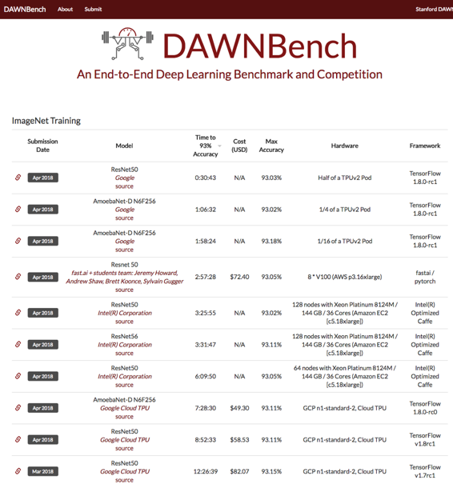

你可以在这里看到谷歌已经在一个TPU集群上赢了半个小时。 最好的非集群TPU结果是fast.ai + 3个小时以下的学生在128台计算机上击败英特尔，在其他地方，我们在一台计算机上运行。 我们还击败谷歌在TPU上运行，所以使用这种方法，我们已经显示：

*   最快的GPU结果
*   最快的单机结果
*   最快的公开基础设施结果

除非您是Google，否则您无法使用这些TPU广告连播。 此外，成本很小（72.54美元），这款英特尔的计算机价值1200美元 - 他们甚至没有在这里写过它，但如果你使用并行的128台计算机，每台计算机有36个核心，每个都有140G，那就是你得到的与我们的单个AWS实例进行比较。 所以这是我们能做的突破。 我们可以在单个公共机器上训练ImageNet的想法是72美元，顺便说一下，它实际上是25美元，因为我们使用了一个现场实例。 我们的一个学生安德鲁·肖建立了整个系统，允许我们抛出一大堆现场实例实验并同时运行它们并且非常自动地运行它们，但是DAWN工作台没有引用我们使用的实际数字。 所以它实际上是25美元，而不是72美元。 所以这个`data_list`想法非常重要且有用。

#### CIFAR10结果[ [15:15](https://youtu.be/xXXiC4YRGrQ%3Ft%3D15m15s) ]

我们的CIFAR10结果现在也正式上传，你可能还记得以前最好的结果是一个多小时。 这里的诀窍是使用1循环，所以Sylvain的训练阶段API中的所有这些东西都是我们用来获得这些最佳结果的所有东西。 另一位名叫bkj的fast.ai学生已经接受了这个并完成了他自己的版本，他拿了一个Resnet18并添加了你可能记得我们在顶部学到的concat汇集，并使用了Leslie Smith的1循环，所以他有了在排行榜上。 所以前三名都是fast.ai学生，这很精彩。


#### CIFAR10成本结果[ [16:05](https://youtu.be/xXXiC4YRGrQ%3Ft%3D16m5s) ]

相同的成本 - 前3，你可以看到，Paperspace。 Brett在Paperspace上运行了这个，并且在bkj之前得到了最便宜的结果。


所以我认为你可以看到[ [16:25](https://youtu.be/xXXiC4YRGrQ%3Ft%3D16m25s) ]，目前很多有趣的机会，训练内容更快，更便宜，都是关于学习率退火，尺寸退火和不同时间不同参数的训练，我仍然认为每个人都在摸索表面。 我认为我们可以更快，更便宜。 这对于资源有限的环境中的人来说真的很有帮助，除了Google之外，基本上每个人都可能是Facebook。

尽管[ [17:00](https://youtu.be/xXXiC4YRGrQ%3Ft%3D17m) ]，架构也很有趣，我们上周看到的其中一件事就是创建了一个更简单的暗网架构版本。 但是有一个架构我们没有谈论哪些是理解Inception网络所必需的。 Inception网络实际上非常有趣，因为它们使用一些技巧来提高效率。 我们目前没有使用这些技巧，我觉得也许我们应该尝试一下。 最有趣和最成功的Inception网络是他们的Inception-ResNet-v2网络，其中的大多数块看起来像这样：

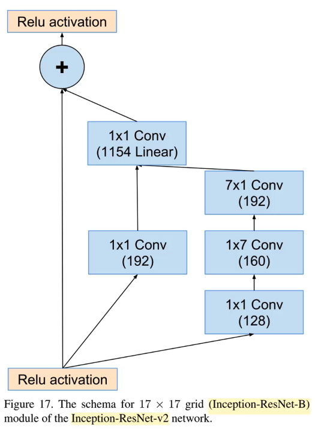

它看起来很像一个标准的Res​​Net块，因为它有一个身份连接，并且有一个转换路径，我们将它们加在一起[ [17:47](https://youtu.be/xXXiC4YRGrQ%3Ft%3D17m47s) ]。 但事实并非如此。 第一个是中间转换路径是1x1转换，并且值得思考1x1转换实际上是什么。

#### 1x1卷积[ [18:23](https://youtu.be/xXXiC4YRGrQ%3Ft%3D18m23s) ]

1x1 conv只是对输入中的每个网格单元说，你基本上有一个向量。 滤波器张数的1乘1基本上是矢量。 对于输入中的每个网格单元，您只需要使用该张量进行点积。 当然，它将成为我们正在创建的192个激活中的每个激活的向量之一。 所以基本上做192网点产品与网格单元（1,1），然后192网格单元（1,2）或（1,3）等等。 因此，您将得到与输入具有相同网格大小的内容以及输出中的192个通道。 因此，这是一种非常好的方法，可以在不改变网格大小的情况下减少维度或增加输入的维度。 这通常是我们使用1x1转换的原因。 在这里，我们有一个1x1转换和另一个1x1转换，然后他们将它们加在一起。 然后是第三条路径，不添加第三条路径。 没有明确提到，但第三条路径是连接在一起的。 有一种形式的ResNet与ResNet基本相同，但我们不做加号，我们做concat。 这叫做DenseNet。 它只是一个ResNet，我们用concat代替plus。 这是一种有趣的方法，因为那时身份路径的类型实际上是被复制的。 因此，你可以获得整个流程，因此我们将在下周看到，这对于细分和类似的东西来说更好，你真的想保留原始像素，第一层像素，第二层像素层不受影响。

连接而不是添加分支是一件非常有用的事情，我们正在连接中间分支和右分支[ [20:22](https://youtu.be/xXXiC4YRGrQ%3Ft%3D20m22s) ]。 最正确的分支正在做一些有趣的事情，首先是1x1转换，然后是1x7，然后是7x1。 那里发生了什么？ 所以，那里发生的事情基本上我们真正想做的就是做7x7转换。 我们想要进行7x7转换的原因是，如果你有多条路径（每条路径都有不同的内核大小），那么它就可以查看不同数量的图像。 最初的Inception网络有1x1,3x3,5x5,7x7连接在一起或类似的东西。 因此，如果我们可以使用7x7过滤器，那么我们可以立即查看大量图像并创建一个非常丰富的表示。 所以Inception网络的主干是Inception网络的前几层实际上也使用了这种类型的7x7转换，因为你从这个224乘224乘3开始，你想把它变成112乘112的东西64.通过使用7x7转换，您可以在每个输出中获得大量信息，以获得64个过滤器。 但问题是7x7转换是很多工作。 对于每个通道的每个输入像素，您有49个内核值乘以49个输入。 所以计算很疯狂。 对于第一层，你可以为它（可能）侥幸逃脱，事实上，ResNet的第一个转换是7x7转换。

但对于Inception [ [22:30](https://youtu.be/xXXiC4YRGrQ%3Ft%3D22m30s) ]则不是这样。 他们没有做7x7转换，相反，他们做1x7跟随7x1。 因此，要解释一下，初始网络的基本思想或它的所有不同版本，你有许多具有不同卷积宽度的独立路径。 在这种情况下，概念上的想法是中间路径是1x1卷积宽度，右路径将是7卷积宽度，因此他们查看不同数量的数据然后我们将它们组合在一起。 但我们不希望通过网络获得7x7转换，因为它的计算成本太高。

但是如果你考虑它[ [23:18](https://youtu.be/xXXiC4YRGrQ%3Ft%3D23m18s) ]，如果我们有一些输入，我们有一些我们想要的大过滤器，而且它太大而无法处理。 我们能做什么？ 我们做5x5。 我们能做的是创建两个过滤器 - 一个是1x5，一个是5x1。 我们对前一层进行了激活，并将它通过了1x5。 我们从中取出激活，并通过5x1，而另一端则出现了一些东西。 现在另一端出现了什么？ 而不是把它想象成，首先，我们采取激活，然后我们通过1x5，然后我们通过5x1，如果相反我们将这两个操作放在一起，并说什么是5x1点积和一个1x5点的产品一起做？ 实际上，你可以采取1x5和5x1，其外部产品将给你一个5x5。 现在你不能通过获取该产品来创建任何可能的5x5矩阵，但是你可以创建很多5x5矩阵。 所以这里的基本思想是当你考虑操作的顺序时（如果你对这里的更多理论感兴趣，你应该看看Rachel的数值线性代数课程，这基本上是关于这个的整个过程）。 但从概念上讲，这个想法很常见，你想要做的计算实际上比整个5x5卷积更简单。 通常，我们在线性代数中使用的术语是有一些较低等级的近似值。 换句话说，1x5和5x1组合在一起 - 5x5矩阵几乎与5x5矩阵一样好，如果你能够，你理想情况下会计算出来。 所以在实践中经常出现这种情况 - 仅仅因为现实世界的本质是现实世界往往具有比随机更多的结构。

很酷的是[26:16]，如果我们用1x7和7x1替换我们的7x7转换器，对于每个单元，它通过输出通道点产品有14个输入通道，而7x7一个有49个要做。 所以它会快得多，我们不得不希望它几乎一样好。 根据定义，它肯定会捕获尽可能多的信息宽度。


如果您有兴趣了解更多相关信息，特别是在深度学习领域，您可以谷歌参与**Factored Convolutions** 。 这个想法是在3或4年前提出来的。 它可能已经存在了很长时间，但那是我第一次看到它的时候。 事实证明它工作得非常好，并且Inception网络广泛使用它。 他们实际上是在他们的干中使用它。 我们之前已经讨论了我们如何倾向于加载 - 例如，当我们有ResNet34时，我们倾向于说这是主要的主干。 这是所有卷积的主要支柱，然后我们可以添加一个自定义头，它往往是最大池或完全连接层。 最好谈谈骨干包含两个部分：一个是干，另一个是主干。 原因是进入的东西只有3个通道，所以我们想要一些操作序列，这些操作将扩展到更丰富的东西 - 通常类似于64个通道。

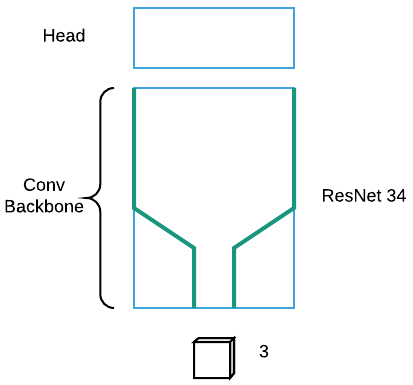

在ResNet中，词干非常简单。 这是一个7x7步幅2转，然后是一个步幅2最大池（我认为如果内存正确服务就是这样）。 初始有一个更复杂的词干，多个路径被组合和连接，包括factored conv（1x7和7x1）。 我很感兴趣，例如，如果你将一个标准的Res​​Net堆叠在一个Inception干上，会发生什么。 我认为这将是一个非常有趣的事情，因为一个Inception词干是一个非常精心设计的东西，而你如何采用3通道输入并将其转化为更丰富的东西似乎非常重要。 所有这些工作似乎都被ResNet抛弃了。 我们喜欢ResNet，它的效果非常好。 但是，如果我们将一个密集的网络骨干放在一个Inception干线上呢？ 或者如果我们用标准ResNet中的1x7和7x1因子转换替换7x7转换器怎么办？ 我们可以尝试很多东西，我认为它会非常有趣。 因此，对潜在的研究方向有更多的想法。

所以这就是我的一小部分随机内容[ [29:51](https://youtu.be/xXXiC4YRGrQ%3Ft%3D29m51s) ]。 更接近实际的主题是图像增强。 我将简要讨论一篇新论文，因为它真正将我刚才讨论的内容与我们接下来要讨论的内容联系起来。 这篇关于渐进式GAN的论文来自Nvidia： [GAN的渐进式增长，用于提高质量，稳定性和变异性](http://research.nvidia.com/publication/2017-10_Progressive-Growing-of) 。 渐进式GAN采用逐渐增加图像尺寸的想法。 这是我所知道的唯一其他方向，人们实际上逐渐增加了图像尺寸。 这让我感到惊讶，因为这篇论文实际上非常受欢迎，众所周知，并且很受欢迎，但是，人们还没有采取逐步增加图像尺寸的基本思想，并在其他任何地方使用它，向您展示您可以期待的一般创造力水平也许，在深度学习研究社区中找到。


他们真的回去了，他们从4x4 GAN开始[ [31:47](https://youtu.be/xXXiC4YRGrQ%3Ft%3D31m47s) ]。 从字面上看，他们试图复制4x4像素，然后是8x8（上面的左上角）。 这是CelebA数据集，所以我们正在尝试重新创建名人的照片。 然后他们去了16x16,32,64,128，然后是256.他们做的一件非常好的事情是，随着他们增加尺寸，他们还会为网络添加更多层。 哪种有意义，因为如果你正在做更多的ResNet-y类型的东西，那么你正在吐出一些希望在每个网格单元大小上有意义的东西，所以你应该能够将东西分层。 他们做了另一件漂亮的事情，当他们这样做时他们添加跳过连接，并且他们逐渐改变线性插值参数，使其越来越远离旧的4x4网络并转向新的8x8网络。 然后，一旦它完全移动它，他们扔掉了额外的连接。 细节并不重要，但它使用了我们所讨论的基本思想，逐渐增加图像大小并跳过连接。 这是一篇很好的研究论文，因为它是这些罕见的事情之一，优秀的工程师实际上建立了一些只是以一种非常明智的方式工作的东西。 现在，这实际上来自于Nvidia本身也就不足为奇了。 Nvidia不做很多论文，有趣的是，当他们这样做时，他们会构建一些非常实用和明智的东西。 所以我认为这是一篇很好的论文，如果你想把我们学到的很多不同的东西放在一起，并且没有很多的重新实现，所以这是一个有趣的事情，也许你可以建立和找到别的东西。

接下来会发生什么[ [33:45](https://youtu.be/xXXiC4YRGrQ%3Ft%3D33m45s) ]。 我们最终会达到1024x1024，你会发现这些图像不仅分辨率更高，而且越来越好。 所以我要看看你是否可以猜出以下哪一个是假的：


他们都是假的。 那是下一个阶段。 你上升了，他们砰的一声。 所以GAN和东西都变得疯狂，你们中的一些人可能在本周[ [34:16](https://youtu.be/xXXiC4YRGrQ%3Ft%3D34m16s) ]看到了这一点。 这段视频刚刚问世，这是巴拉克奥巴马的演讲，让我们来看看：

正如你所看到的，他们已经使用这种技术来实现奥巴马面对乔丹皮尔脸部移动的方式。 你现在基本上拥有了所需的所有技术。 这是一个好主意吗？

### 人工智能中的伦理[ [35:31](https://youtu.be/xXXiC4YRGrQ%3Ft%3D35m31s) ]

这就是我们谈论什么是最重要的，现在我们可以做所有这些事情，我们应该做什么以及我们如何思考？ TL; DR版本是我其实不知道的。 最近很多人看到spaCy神童们的创始人在Explosion AI上做了一个演讲，Matthew和Ines，然后我和他们一起吃饭，我们基本上整个晚上都在谈论，辩论，争论什么做这意味着像我们这样的公司正在构建工具，使得可以以有害方式使用的工具的民主化。 他们是非常有思想的人，我们不会说我们不同意，我们自己也无法得出结论。 所以我只是要提出一些问题，并指出一些研究，当我说研究时，大多数实际的文献回顾和把它放在一起是由Rachel完成的，所以谢谢Rachel。

首先我要说的是，我们建立的模型往往非常糟糕，并不是很明显[ [36:52](https://youtu.be/xXXiC4YRGrQ%3Ft%3D36m52s) ]。 你不会知道它们是多么糟糕，除非与你一起建造它们的人是一系列人，与你一起使用它们的人是一群人。 例如，一些出色的研究人员， [Timnit Gebru](https://twitter.com/timnitGebru)在微软和[Joy Buolamwini](https://twitter.com/jovialjoy)刚刚从麻省理工学院获得博士学位，他们做了这个非常有趣的研究，他们看了一些现成的面部识别器，一个来自FACE ++，这是一个巨大的中国人公司，IBM和微软，他们寻找一系列不同的面部类型。


一般来说，微软的一个特别令人难以置信的准确，除非脸部类型突然变暗皮肤突然变得更糟。 IBM差不多有一半时间弄错了。 对于像这样的大公司来说，发布一种产品，对于世界上很大一部分而言，不起作用不仅仅是技术故障。 这是一个非常深刻的失败，无法理解需要使用什么样的团队来创建这样的技术，测试这样的技术，甚至了解客户是谁。 你的一些顾客皮肤黝黑。 “我还要补充一点，分类器对女性的影响都比男性差”（Rachel）。 令人震惊的。 有趣的是，雷切尔前几天发布了类似这样的内容，而且有人说“这是怎么回事？ 你在说什么？ 难道你不知道人们长时间制造汽车 - 你是说你需要女性来制造汽车？“雷切尔指出 - 实际上是的。 对于汽车安全的大部分历史来说，汽车中的女性死于汽车的风险远远超过男性，因为这些男性创造了男性外观，感觉，大小的碰撞测试假人，因此汽车安全实际上没有在女性身体上进行测试。 糟糕的产品管理以及多样性和理解的完全失败对我们的领域来说并不陌生。

“我只想说比较男女相似力量的影响”（瑞秋）。 我不知道为什么每当你在推特上说这样的话时，雷切尔就不得不说这个，因为无论何时你在Twitter上说这样的话，大约有10个人会说“哦，你必须比较所有这些其他东西”好像我们不知道那样。

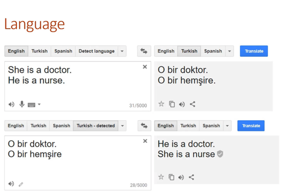

其他一些我们最着名的系统就像微软的面部识别器或谷歌的语言翻译器，你转过身来“她是一名医生。 他是一名护士。“进入土耳其语并且非常正确 - 两个代词都变成了O，因为土耳其语中没有性别代词。 走向另一个方向，它变成了什么？ “他是一个医生。 她是一名护士。“因此，我们将这些偏见纳入了我们每天都在使用的工具中。 再一次，人们说“哦，它只是向我们展示了世界上的东西”，而且，这个基本断言有很多问题，但正如你所知，机器学习算法喜欢概括。

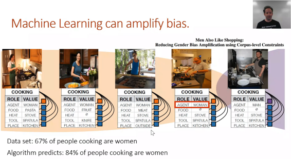

所以，因为他们喜欢概括，这是一个很酷的事情，你们现在知道技术细节，因为他们喜欢概括，当你看到60％的人烹饪的东西是他们用来建立这个模型和然后你在一组单独的图片上运行模型，然后他们选择烹饪的人中有84％是女性，而不是正确的67％。 对于算法而言，这是一个真正可以理解的事情，因为它采用了偏置输入并创建了更偏向的输出，因为对于这个特定的损失函数，它就是最终的结果。 这是一种非常常见的模型放大。

这件事很重要[ [41:41](https://youtu.be/xXXiC4YRGrQ%3Ft%3D41m41s) ]。 它的重要性不仅仅是笨拙的翻译或黑人的照片没有被正确分类。 也许也有一些胜利 - 比如到处都是恐怖的监视，也许不会对黑人有用。 “或者情况会更糟，因为这是可怕的监视，而且是种族主义和错误的结果”（雷切尔）。 但是，让我们更深入。 For all we say about human failings, there is a long history of civilization and societies creating layers of human judgement which avoid, hopefully, the most horrible things happening. And sometimes companies which love technology think “let's throw away humans and replace them with technology” like Facebook did. A couple years ago, Facebook literally got rid of their human editors, and this was in the news at the time. And they were replaced with algorithms. So now as algorithms put all the stuff on your news feed and human editors were out of the loop. What happened next?


Many things happened next. One of which was a massive horrifying genocide in Myanmar. Babies getting torn out of their mothers arms and thrown into fires. Mass rape, murder, and an entire people exiled from their homeland.

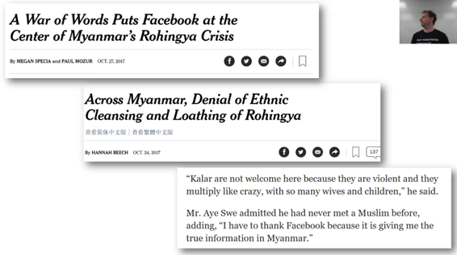

Okay, I'm not gonna say that was because Facebook did this, but what I will say is that when the leaders of this horrifying project are interviewed, they regularly talk about how everything they learnt about the disgusting animal behaviors of Rohingyas that need to be thrown off the earth, they learnt from Facebook. Because the algorithms just want to feed you more stuff that gets you clicking. If you get told these people that don't look like you and you don't know the bad people and here's lots of stories about bad people and then you start clicking on them and then they feed you more of those things. Next thing you know, you have this extraordinary cycle. People have been studying this, so for example, we've been told a few times people click on our fast.ai videos and then the next thing recommended to them is like conspiracy theory videos from Alex Jones, and then continues from there. Because humans click on things that shock us, surprise us, and horrify us. At so many levels, this decision has had extraordinary consequences which we're only beginning to understand. Again, this is not to say this particular consequence is because of this one thing, but to say it's entirely unrelated would be clearly ignoring all of the evidence and information that we have.

#### Unintended consequences [ [45:04](https://youtu.be/xXXiC4YRGrQ%3Ft%3D45m4s) ]


The key takeaway is to think what are you building and how could it be used. Lots and lots of effort now being put into face detection including in our course. We've been spending a lot of time thinking about how to recognize stuff and where it is. There's lots of good reasons to want to be good at that for improving crop yields in agriculture, for improving diagnostic and treatment planning in medicine, for improving your LEGO sorting robot system, etc. But it's also being widely used in surveillance, propaganda, and disinformation. Again, the question is what do I do about that? I don't exactly know. But it's definitely at least important to be thinking about it, talking about it.

#### Runaway feedback loops [ [46:10](https://youtu.be/xXXiC4YRGrQ%3Ft%3D46m10s) ]

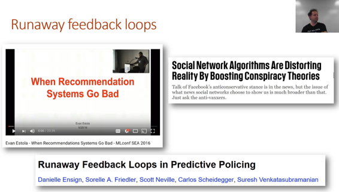

Sometimes you can do really good things. For example, meetup.com did something which I would put in the category of really good thing which is they recognized early a potential problem which is that more men are tending to go to their meet ups. And that was causing their collaborative filtering systems, which you are familiar building now to recommend more technical content to men. And that was causing more men to go to more technical content which was causing the recommendation system to suggest more technical content to men. This kind of runaway feedback loop is extremely common when we interface the algorithm and the human together. So what did Meetup do? They intentionally made the decision to recommend more technical content to women, not because highfalutin idea about how the world should be, but just because that makes sense. Runaway feedback loop was a bug — there are women that want to go to tech meetups, but when you turn up for a tech meet up and it's all men and you don't go, then it recommends more to men and so on and so forth. So Meetup made a really strong product management decision here which was to not do what the algorithm said to do. Unfortunately this is rare. Most of these runaway feedback loops, for example, in predictive policing where algorithms tell policemen where to go which very often is more black neighborhoods which end up crawling with more policemen which leads to more arrests which is assisting to tell more policemen to go to more black neighborhoods and so forth.

#### Bias in AI [ [48:09](https://youtu.be/xXXiC4YRGrQ%3Ft%3D48m9s) ]


This problem of algorithmic bias is now very wide spread and as algorithms become more and more widely used for specific policy decisions, judicial decisions, day-to-day decisions about who to give what offer to, this just keeps becoming a bigger problem. Some of them are really things that the people involved in the product management decision should have seen at the very start, didn't make sense, and unreasonable under any definition of the term. For example, this stuff Abe Gong pointed out — these were questions that were used for both pretrial so who was required to post bail, so these are people that haven't even been convicted, as well as for sentencing and for who gets parole. This was upheld by the Wisconsin Supreme Court last year despite all the flaws. So whether you have to stay in jail because you can't pay the bail and how long your sentence is for, and how long you stay in jail for depends on what your father did, whether your parents stayed married, who your friends are, and where you live. Now turns out these algorithms are actually terribly terribly bad so some recent analysis showed that they are basically worse than chance. But even if the company's building them were confident on these were statistically accurate correlations, does anybody imagine there's a world where it makes sense to decide what happens to you based on what your dad did?

A lot of this stuff at the basic level is obviously unreasonable and a lot of it just fails in these ways that you can see empirically that these kind of runaway feedback loops must have happened and these over generalizations must have happened. For example, these are the cross tabs that anybody working in any field using these algorithm should be preparing. So prediction of likelihood of reoffending for black vs. white defendants, we can just calculate this very simply. Of the people that were labeled high-risk but didn't reoffend — they were 23.5% white but about twice that African American. Where else, those that were labeled lower risk but did reoffend was half the white people and only 28% of the African American. This is the kind of stuff where at least if you are taking the technologies we've been talking about and putting the production in any way, building an API for other people, providing training for people, or whatever — then at least make sure that what you are doing can be tracked in a way that people know what's going on so at least they are informed. I think it's a mistake in my opinion to assume that people are evil and trying to break society. I think I would prefer to start with an assumption of if people are doing dumb stuff, it's because they don't know better. So at least make sure they have this information. I find very few ML practitioners thinking about what is the information they should be presenting in their interface. Then often I'll talk to data scientists who will say “oh, the stuff I'm working on doesn't have a societal impact.” Really? A number of people who think that what they are doing is entirely pointless? 来吧。 People are paying you to do it for a reason. It's going to impact people in some way. So think about what that is.

#### Responsibility in hiring [ [52:46](https://youtu.be/xXXiC4YRGrQ%3Ft%3D52m46s) ]

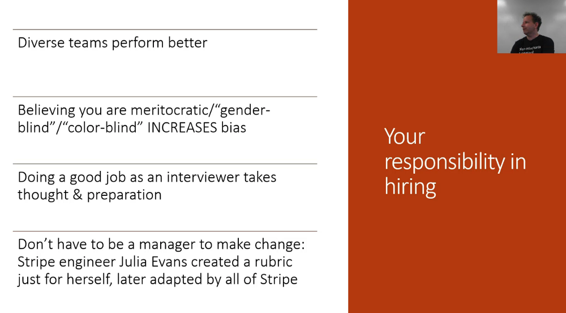

The other thing I know is a lot of people involved here are hiring people and if you are hiring people, I guess you are all very familiar with the fast.ai philosophy now which is the basic premise that, and I thin it comes back to this idea that I don't think people on the whole are evil, I think they need to be informed and have tools. So we are trying to give as many people the tools as possible that they need and particularly we are trying to put those tools in the hands of a more diverse range of people. So if you are involved in hiring decisions, perhaps you can keep this kind of philosophy in mind as well. If you are not just hiring a wider range of people, but also promoting a wider range of people, and providing appropriate career management for a wider range of people, apart from anything else, your company will do better. It actually turns out that more diverse teams are more creative and tend to solve problems more quickly and better than less diverse teams, but also you might avoid these kind of awful screw-ups which, at one level, are bad for the world and another level if you ever get found out, they can destroy your company.

#### IBM &amamp; “Death's Calculator” [ [54:08](https://youtu.be/xXXiC4YRGrQ%3Ft%3D54m8s) ]


Also they can destroy you or at least make you look pretty bad in history. A couple of examples, one is going right back to the second world war. IBM provided all of the infrastructure necessary to track the Holocaust. These are the forms they used and they had different code — Jews were 8, Gypsies were 12, death in the gas chambers was 6, and they all went on these punch cards. You can go and look at these punch cards in museums now and this has actually been reviewed by a Swiss judge who said that IBM's technical assistance facilitated the task of the Nazis and the commission their crimes against humanity. It is interesting to read back the history from these times to see what was going through the minds of people at IBM at that time. What was clearly going through the minds was the opportunity to show technical superiority, the opportunity to test out their new systems, and of course the extraordinary amount of money that they were making. When you do something which at some point down the line turns out to be a problem, even if you were told to do it, that can turn out to be a problem for you personally. For example, you all remember the diesel emission scandal in VW. Who is the one guy that went to jail? It was the engineer just doing his job. If all of this stuff about actually not messing up the world isn't enough to convince you, it can mess up your life too. If you do something that turns out to cause problems even though somebody told you to do it, you can absolutely be held criminally responsible. Aleksandr Kogan was the guy that handed over the Cambridge Analytica data. He is a Cambridge academic. Now a very famous Cambridge academic the world over for doing his part to destroy the foundations of democracy. This is not how we want to go down in history.


**Question:** In one of your tweets, you said dropout is patented [ [56:50](https://youtu.be/xXXiC4YRGrQ%3Ft%3D56m50s) ]. I think this is about WaveNet patent from Google. 这是什么意思？ Can you please share more insight on this subject? Does it mean that we will have to pay to use dropout in the future? One of the patent holders is Geoffrey Hinton. 所以呢？ Isn't that great? Invention is all about patents, blah blah. My answer is no. Patents have gone wildly crazy. The amount of things that are patentable that we talk about every week would be dozens. It's so easy to come up with a little tweak and then if you turn that into a patent to stop everybody from using that little tweak for the next 14 years and you end up with a situation we have now where everything is patented in 50 different ways. Then you get these patent trolls who have made a very good business out of buying lots of crappy little patents and then suing anybody who accidentally turned out did that thing like putting rounded corners on buttons. So what does it mean for us that a lot of stuff is patented in deep learning? 我不知道。

One of the main people doing this is Google and people from Google who replied to this patent tend to assume that Google doing it because they want to have it defensively so if somebody sues them, they can say don't sue us we'll sue you back because we have all these patents. The problem is that as far as I know, they haven't signed what's called a defensive patent pledge so basically you can sign a legally binding document that says our patent portfolio will only be used in defense and not offense. Even if you believe all the management of Google would never turn into a patent troll, you've got to remember that management changes. To give you a specific example I know, the somewhat recent CFO of Google has a much more aggressive stance towards the PNL, I don't know, maybe she might decide that they should start monetizing their patents or maybe the group that made that patent might get spun off and then sold to another company that might end up in private equity hands and decide to monetize the patents or whatever. So I think it's a problem. There has been a big shift legally recently away from software patents actually having any legal standing, so it's possible that these will all end up thrown out of court but the reality is that anything but a big company is unlikely to have the financial ability to defend themselves against one of these huge patent trolls.

You can't avoid using patented stuff if you write code. I wouldn't be surprised if most lines of code you write have patents on them. Actually funnily enough, the best thing to do is not to study the patents because if you do and you infringe knowingly then the penalties are worse. So the best thing to do is to put your hands in your ear, sing a song, and get back to work. So the thing about dropouts patented, forget I said that. You don't know that. You skipped that bit.

### Style Transfer [ [1:01:28](https://youtu.be/xXXiC4YRGrQ%3Ft%3D1h1m28s) ]

[笔记本](https://github.com/fastai/fastai/blob/master/courses/dl2/style-transfer.ipynb)


[https://arxiv.org/abs/1508.06576](https://arxiv.org/abs/1508.06576)


This is super fun — artistic style. We are going a bit retro here because this is actually the original artistic style paper and there's been a lot of updates to it and a lot of different approaches and I actually think in many ways the original is the best. We are going to look at some of the newer approaches as well, but I actually think the original is a terrific way to do it even with everything that's gone since. Let's jump to the code.

```
 %matplotlib inline  %reload_ext autoreload  %autoreload 2 
```

```
 **from** **fastai.conv_learner** **import** *  from pathlib import Path  from scipy import ndimage  torch.cuda.set_device(3)  torch.backends.cudnn.benchmark= True 
```

```
 PATH = Path('data/imagenet')  PATH_TRN = PATH/'train' 
```

```
 m_vgg = to_gpu(vgg16( True )).eval()  set_trainable(m_vgg, False ) 
```

The idea here is that we want to take a photo of a bird, and we want to create a painting that looks like Van Gogh painted the picture of the bird. Quite a bit of the stuff that I'm doing, by the way, uses an ImageNet. You don't have to download the whole of ImageNet for any of the things I'm doing. There is an ImageNet sample in [files.fast.ai/data](http://files.fast.ai/data/) which has a couple of gig which should be plenty good enough for everything we are doing. If you want to get really great result, you can grab ImageNet. You can download it from [Kaggle](https://www.kaggle.com/c/imagenet-object-localization-challenge/data) . The localization competition actually contains all of the classification data as well. If you've got room, it's good to have a copy of ImageNet because it comes in handy all the time.

```
 img_fn = PATH_TRN/'n01558993'/'n01558993_9684.JPEG'  img = open_image(img_fn)  plt.imshow(img); 
```

So I just grabbed the bird out of my ImageNet folder and there is my bird:


```
 sz=288 
```

```
 trn_tfms,val_tfms = tfms_from_model(vgg16, sz)  img_tfm = val_tfms(img)  img_tfm.shape 
```

```
 (3, 288, 288) 
```

```
 opt_img = np.random.uniform(0, 1, size=img.shape).astype(np.float32)  plt.imshow(opt_img); 
```

What I'm going to do is I'm going to start with this picture:


And I'm going to try to make it more and more like a picture of the bird painted by Van Gogh. The way I do that is actually very simple. You're all familiar with it [ [1:03:44](https://youtu.be/xXXiC4YRGrQ%3Ft%3D1h3m44s) ]. We will create a loss function which we will call _f_ . The loss function is going to take as input a picture and spit out as output a value. The value will be lower if the image looks more like the bird photo painted by Van Gogh. Having written that loss function, we will then use the PyTorch gradient and optimizers. Gradient times the learning rate, and and we are not going to update any weights, we are going to update the pixels of the input image to make it a little bit more like a picture which would be a bird painted by Van Gogh. And we will stick it through the loss function again to get more gradients, and do it again and again. 而已。 So it's identical to how we solve every problem. You know I'm a one-trick pony, right? This is my only trick. Create a loss function, use it to get some gradients, multiply it by learning rates to update something, always before, we've updated weights in a model but today, we are not going to do that. They're going to update the pixels in the input. But it's no different at all. We are just taking the gradient with respect to the input rather than respect to the weights. 而已。 So we are nearly done.


Let's do a couple more things [ [1:05:49](https://youtu.be/xXXiC4YRGrQ%3Ft%3D1h5m49s) ]. Let's mention here that there's going to be two more inputs to our loss function One is the picture of the bird. The second is an artwork by Van Gogh. By having those as inputs as well, that means we'll be able to rerun the function later to make it look like a bird painted by Monet or a jumbo jet painted by Van Gogh, etc. Those are going to be the three inputs. Initially, as we discussed, our input here is some random noise. We start with some random noise, use the loss function, get the gradients, make it a little bit more like a bird painted by Van Gogh, and so forth.

So the only outstanding question which I guess we can talk about briefly is how we calculate how much our image looks like this bird painted by Van Gogh [ [1:07:09](https://youtu.be/xXXiC4YRGrQ%3Ft%3D1h7m9s) ]. Let's split it into two parts:

**Content Loss** : Returns a value that's lower if it looks more like the bird (not just any bird, the specific bird that we have coming in).

**Style Loss** : Returns a lower number if the image is more like VG's style

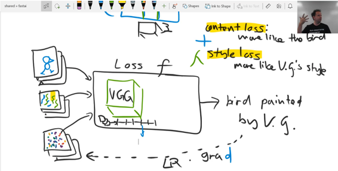

There is one way to do the content loss which is very simple — we could look at the pixel of the output, compare them to the pixel of the bird, and do a mean squared error, and add them up. So if we did that, I ran this for a while. Eventually our image would turn into an image of the bird. You should try it. You should try this as an exercise. Try to use the optimizer in PyTorch to start with a random image and turn it into another image by using mean squared error pixel loss. Not terribly exciting but that would be step one.

The problem is, even if we already had our style loss function working beautifully and then presumably, what we are going to do is we are going to add these two together, and then one of them, we'll multiply by some lambda to adjust how much style versus how much content. Assuming we had a style loss and we picked some sensible lambda, if we used pixel wise content loss then anything that makes it look more like Van Gogh and less like the exact photo, the exact background, the exact contrast, lighting, everything will increase the content loss — which is not what we want. We want it to look like the bird but not in the same way. It is still going to have the same two eyes in the same place and be the same kind of shape and so forth, but not the same representation. So what we are going to do is, this is going to shock you, we are going to use a neural network! We are going to use the VGG neural network because that's what I used last year and I didn't have time to see if other things worked so you can try that yourself during the week.

The VGG network is something which takes in an input and sticks it through a number of layers, and I'm going to treat these as just the convolutional layers there's obviously ReLU there and if it's a VGG with batch norm, which most are today, then it's also got batch norm. There's some max pooling and so forth but that's fine. What we could do is, we could take one of these convolutional activations and then rather than comparing the pixels of this bird, we could instead compare the VGG layer 5 activations of this (bird painted by VG) to the VGG layer 5 activations of our original bird (or layer 6, or layer 7, etc). So why might that be more interesting? Well for one thing, it wouldn't be the same bird. It wouldn't be exactly the same because we are not checking the pixels. We are checking some later set of activations. So what are those later sets of activations contain? Assuming it's after some max pooling, they contain a smaller grid — so it's less specific about where things are. And rather than containing pixel color values, they are more like semantic things like is this kind of an eyeball, is this kind of furry, is this kind of bright, or is this kind of reflective, or laying flat, or whatever. So we would hope that there's some level of semantic features through those layers where if we get a picture that matches those activations, then any picture that matches those activations looks like the bird but it's not the same representation of the bird. So that's what we are going to do. That's what our content loss is going to be. People generally call this a **perceptual loss** because it's really important in deep learning that you always create a new name for every obvious thing you do. If you compare two activations together, you are doing a perceptual loss. 而已。 Our content loss is going to be a perceptual loss. Then we will do the style loss later.

Let's start by trying to create a bird that initially is random noise and we are going to use perceptual loss to create something that is bird-like but it's not the particular bird [ [1:13:13](https://youtu.be/xXXiC4YRGrQ%3Ft%3D1h13m13s) ]. We are going to start with 288 by 288\. Because we are going to do one bird, there is going to be no GPU memory problems. I was actually disappointed that I realized that I picked a rather small input image. It would be fun to try this with something much bigger to create a really grand scale piece. The other thing to remember is if you are productionizing this, you could do a whole batch at a time. People sometimes complain about this approach (Gatys is the lead author) the Gatys' style transfer approaches being slow, and I don't agree it's slow. It takes a few seconds and you can do a whole batch in a few seconds.


```
 sz=288 
```

So we are going to stick it through some transforms for VGG16 model as per usual [ [1:14:12](https://youtu.be/xXXiC4YRGrQ%3Ft%3D1h14m12s) ]. Remember, the transform class has dunder call method ( `__call__` ) so we can treat it as if it's a function. If you pass an image into that, then we get the transformed image. Try not to treat the fast.ai and PyTorch infrastructure as a black box because it's all designed to be really easy to use in a decoupled way. So this idea of that transforms are just “callables” (ie things that you can do with parentheses) comes from PyTorch and we totally plagiarized the idea. So with torch.vision or with fast.ai, your transforms are just callables. And the whole pipelines of transforms is just a callable.

```
 trn_tfms,val_tfms = tfms_from_model(vgg16, sz)  img_tfm = val_tfms(img)  img_tfm.shape 
```

```
 (3, 288, 288) 
```

Now we have something of 3 by 288 by 288 because PyTorch likes the channel to be first [ [1:15:05](https://youtu.be/xXXiC4YRGrQ%3Ft%3D1h15m5s) ]. As you can see, it's been turned into a square for us, it's been normalized to (0, 1), all that normal stuff.

Now we are creating a random image.

```
 opt_img = np.random.uniform(0, 1, size=img.shape).astype(np.float32)  plt.imshow(opt_img); 
```


Here is something I discovered. Trying to turn this into a picture of anything is actually really hard. I found it very difficult to actually get an optimizer to get reasonable gradients that went anywhere. And just as I thought I was going to run out of time for this class and really embarrass myself, I realized the key issue is that pictures don't look like this. They have more smoothness, so I turned this into the following by blurring it a little bit:

```
 opt_img = scipy.ndimage.filters.median_filter(opt_img, [8,8,1])  plt.imshow(opt_img); 
```

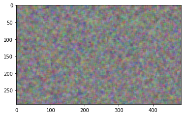

I used a median filter — basically it is like a median pooling, effectively. As soon as I change it to this, it immediately started training really well. A number of little tweaks you have to do to get these things to work is kind of insane, but here is a little tweak.

So we start with a random image which is at least somewhat smooth [ [1:16:21](https://youtu.be/xXXiC4YRGrQ%3Ft%3D1h16m21s) ]. I found that my bird image had a mean of pixels that was about half of this, so I divided it by 2 just trying to make it a little bit easier for it to match (I don't know if it matters). Turn that into a variable because this image, remember, we are going to be modifying those pixels with an optimization algorithm, so anything that's involved in the loss function needs to be a variable. And specifically, it requires a gradient because we are actually updating the image.

```
 opt_img = val_tfms(opt_img)/2  opt_img_v = V(opt_img[ None ], requires_grad= True )  opt_img_v.shape 
```

```
 torch.Size([1, 3, 288, 288]) 
```

So we now have a mini batch of 1, 3 channels, 288 by 288 random noise.

```
 m_vgg = nn.Sequential(*children(m_vgg)[:37]) 
```

We are going to use, for no particular reason, the 37th layer of VGG. If you print out the VGG network (you can just type in `m_vgg` and prints it out), you'll see that this is mid to late stage layer. So we can just grab the first 37 layers and turn it into a sequential model. So now we have a subset of VGG that will spit out some mid layer activations, and that's what the model is going to be. So we can take our actual bird image and we want to create a mini batch of one. Remember, if you slice in Numpy with `None` , also known as `np.newaxis` , it introduces a new unit axis in that point. Here, I want to create an axis of size 1 to say this is a mini batch of size one. So slicing with None just like I did here ( `opt_img_v = V(opt_img[ **None** ], requires_grad= **True** )` ) to get one unit axis at the front. Then we turn that into a variable and this one doesn't need to be updated, so we use `VV` to say you don't need gradients for this guy. So that is going to give us our target activations.

*   We've taken our bird image
*   Turned it into a variable
*   Stuck it through our model to grab the 37th layer activations which is our target. We want our content loss to be this set of activations.
*   We are going to create an optimizer (we will go back to the details of this in a moment)
*   We are going to step a bunch of times
*   Zero the gradients
*   Call some loss function
*   Loss.backward()

That's the high level version. I'm going to come back to the details in a moment, but the key thing is that the loss function we are passing in that randomly generated image — the variable of optimization image. So we pass that to our loss function and it's going to update this using the loss function, and the loss function is the mean squared error loss comparing our current optimization image passed through our VGG to get the intermediate activations and comparing it to our target activations. We run that bunch of times and we'll print it out. And we have our bird but not the representation of it.

```
 targ_t = m_vgg(VV(img_tfm[ None ]))  targ_v = V(targ_t)  targ_t.shape 
```

```
 torch.Size([1, 512, 18, 18]) 
```

```
 max_iter = 1000  show_iter = 100  optimizer = optim.LBFGS([opt_img_v], lr=0.5) 
```

#### Broyden–Fletcher–Goldfarb–Shanno (BFGS) [ [1:20:18](https://youtu.be/xXXiC4YRGrQ%3Ft%3D1h20m18s) ]

A couple of new details here. One is a weird optimizer ( `optim.LBFGS` ). Anybody who's done certain parts of math and computer science courses comes into deep learning discovers we use all this stuff like Adam and the SGD and always assume that nobody in the field knows the first thing about computer science and immediately says “any of you guys tried using BFGS?” There's basically a long history of a totally different kind of algorithm for optimization that we don't use to train neural networks. And of course the answer is actually the people who have spent decades studying neural networks do know a thing or two about computer science and it turns out these techniques on the whole don't work very well. But it's actually going to work well for this, and it's a good opportunity to talk about an interesting algorithm for those of you that haven't studied this type of optimization algorithm at school. BFGS (initials of four different people) and the L stands for limited memory. It is an optimizer so as an optimizer, that means that there's some loss function and it's going to use some gradients (not all optimizers use gradients but all the ones we use do) to find a direction to go and try to make the loss function go lower and lower by adjusting some parameters. It's just an optimizer. But it's an interesting kind of optimizer because it does a bit more work than the ones we're used to on each step. Specifically, the way it works is it starts the same way that we are used to which is we just pick somewhere to get started and in this case, we've picked a random image as you saw. As per usual, we calculate the gradient. But we then don't just take a step but we actually do is as well as finding the gradient, we also try to find the second derivative. The second derivative says how fast does the gradient change.

**Gradient** : how fast the function change

**The second derivative** : how fast the gradient change

In other words, how curvy is it? The basic idea is that if you know that it's not very curvy, then you can probably jump farther. But if it's very curvy then you probably don't want to jump as far. So in higher dimensions, the gradient is called the Jacobian and the second derivative is called the Hessian. You'll see those words all the time, but that's all they mean. Again, mathematicians have to invent your words for everything as well. They are just like deep learning researchers — maybe a bit more snooty. With BFGS, we are going to try and calculate the second derivative and then we are going to use that to figure out what direction to go and how far to go — so it's less of a wild jump into the unknown.

Now the problem is that actually calculating the Hessian (the second derivative) is almost certainly not a good idea[ [1:24:15](https://youtu.be/xXXiC4YRGrQ%3Ft%3D1h24m15s) ]. Because in each possible direction that you are going to head, for each direction that you're measuring the gradient in, you also have to calculate the Hessian in every direction. It gets ridiculously big. So rather than actually calculating it, we take a few steps and we basically look at how much the gradient is changing as we do each step, and we approximate the Hessian using that little function. Again, this seems like a really obvious thing to do but nobody thought of it until someone did surprisingly a long time later. Keeping track of every single step you take takes a lot of memory, so duh, don't keep track of every step you take — just keep the last ten or twenty. And the second bit there, that's the L to the LBFGS. So a limited-memory BFGS means keep the last 10 or 20 gradients, use that to approximate the amount of curvature, and then use the curvature in gradient to estimate what direction to travel and how far. That's normally not a good idea in deep learning for a number of reasons. It's obviously more work to do than than Adam or SGD update, and it also uses more memory — memory is much more of a big issue when you've got a GPU to store it on and hundreds of millions of weights. But more importantly, the mini-batch is super bumpy so figuring out curvature to decide exactly how far to travel is kind of polishing turds as we say (yeah, Australian and English expression — you get the idea). Interestingly, actually using the second derivative information, it turns out, is like a magnet for saddle points. So there's some interesting theoretical results that basically say it actually sends you towards nasty flat areas of the function if you use second derivative information. So normally not a good idea.

```
 def actn_loss(x): return F.mse_loss(m_vgg(x), targ_v)*1000 
```

```
 def step(loss_fn):  global n_iter  optimizer.zero_grad()  loss = loss_fn(opt_img_v)  loss.backward()  n_iter+=1  if n_iter%show_iter==0:  print(f'Iteration: n_iter, loss: {loss.data[0]} ')  return loss 
```

But in this case [ [1:26:40](https://youtu.be/xXXiC4YRGrQ%3Ft%3D1h26m40s) ], we are not optimizing weights, we are optimizing pixels so all the rules change and actually turns out BFGS does make sense. Because it does more work each time, it's a different kind of optimizer, the API is a little bit different in PyTorch. As you can see here, when you say `optimizer.step` , you actually pass in the loss function. So our loss function is to call `step` with a particular loss function which is our activation loss ( `actn_loss` ). And inside the loop, you don't say step, step, step. But rather it looks like this. So it's a little bit different and you're welcome to try and rewrite this to use SGD, it'll still work. It'll just take a bit longer — I haven't tried it with SGD yet and I'd be interested to know how much longer it takes.

```
 n_iter=0  while n_iter <= max_iter: optimizer.step(partial(step,actn_loss)) 
```

```
 Iteration: n_iter, loss: 0.8466196656227112 
 Iteration: n_iter, loss: 0.34066855907440186 
 Iteration: n_iter, loss: 0.21001280844211578 
 Iteration: n_iter, loss: 0.15562333166599274 
 Iteration: n_iter, loss: 0.12673595547676086 
 Iteration: n_iter, loss: 0.10863320529460907 
 Iteration: n_iter, loss: 0.0966048613190651 
 Iteration: n_iter, loss: 0.08812198787927628 
 Iteration: n_iter, loss: 0.08170554041862488 
 Iteration: n_iter, loss: 0.07657770067453384 
```

So you can see the loss function going down [ [1:27:38](https://youtu.be/xXXiC4YRGrQ%3Ft%3D1h27m38s) ]. The mean squared error between the activations at layer 37 of our VGG model for our optimized image vs. the target activations, remember the target activations were the VGG applied to our bird. Make sense? So we've now got a content loss. Now, one thing I'll say about this content loss is we don't know which layer is going to work the best. So it would be nice if we were able to experiment a little bit more. And the way it is here is annoying:


Maybe we even want to use multiple layers. So rather than lopping off all of the layers after the one we want, wouldn't it be nice if we could somehow grab the activations of a few layers as it calculates. Now, we already know one way to do that back when we did SSD, we actually wrote our own network which had a number of outputs. Remember? The different convolutional layers, we spat out a different `oconv` thing? But I don't really want to go and add that to the torch.vision ResNet model especially not if later on, I want to try torch.vision VGG model, and then I want to try NASNet-A model, I don't want to go into all of them and change their outputs. Beside which, I'd like to easily be able to turn certain activations on and off on demand. So we briefly touched before this idea that PyTorch has these fantastic things called hooks. You can have forward hooks that let you plug anything you like into the forward pass of a calculation or a backward hook that lets you plug anything you like into the backward pass. So we are going to create the world's simplest forward hook.

```
 x = val_tfms.denorm(np.rollaxis(to_np(opt_img_v.data),1,4))[0]  plt.figure(figsize=(7,7))  plt.imshow(x); 
```


### Forward hook [ [1:29:42](https://youtu.be/xXXiC4YRGrQ%3Ft%3D1h29m42s) ]

This is one of these things that almost nobody knows about so almost any code you find on the internet that implements style transfer will have all kind of horrible hacks rather than using forward hooks. But forward hook is really easy.

To create a forward hook, you just create a class. The class has to have something called `hook_fn` . And your hook function is going to receive the `module` that you've hooked, the `input` for the forward pass, and the `output` then you do whatever you'd like. So what I'm going to do is I'm just going to store the output of this module in some attribute. 而已。 So `hook_fn` can actually be called anything you like, but “hook function” seems to be the standard because, as you can see, what happens in the constructor is I store inside some attribute the result of `m.register_forward_hook` ( `m` is going to be the layer that I'm going to hook) and pass in the function that you want to be called when the module's forward method is called. When its forward method is called, it will call `self.hook_fn` which will store the output in an attribute called `features` .

```
 class SaveFeatures ():  features= None  def __init__(self, m):  self.hook = m.register_forward_hook(self.hook_fn)  def hook_fn(self, module, input, output): self.features = output  def close(self): self.hook.remove() 
```

So now what we can do is we can create a VGG as before. And let's set it to not trainable so we don't waste time and memory calculating gradients for it. And let's go through and find all the max pool layers. So let's go through all of the children of this module and if it's a max pool layer, let's spit out index minus 1 — so that's going to give me the layer before the max pool. In general, the layer before a max pool or stride 2 conv is a very layer. It's the most complete representation we have at that grid cell size because the very next layer is changing the grid. So that seems to me like a good place to grab the content loss from. The best most semantic, most interesting content we have at that grid size. So that's why I'm going to pick those indexes.

```
 m_vgg = to_gpu(vgg16( True )).eval()  set_trainable(m_vgg, False ) 
```

These are the indexes of the last layer before each max pool in VGG [ [1:32:30](https://youtu.be/xXXiC4YRGrQ%3Ft%3D1h32m30s) ].

```
 block_ends = [i-1 for i,o in enumerate(children(m_vgg))  if isinstance(o,nn.MaxPool2d)]  block_ends 
```

```
 [5, 12, 22, 32, 42] 
```

I'm going to grab `32` — no particular reason, just try something else. So I'm going to say `block_ends[3]` (ie 32). `children(m_vgg)[block_ends[3]]` will give me the 32nd layer of VGG as a module.

```
 sf = SaveFeatures(children(m_vgg)[block_ends[3]]) 
```

Then if I call the `SaveFeatures` constructor, it's going to go:

`self.hook = {32nd layer of VGG}.register_forward_hook(self.hook_fn)`

Now, every time I do a forward pass on this VGG model, it's going to store the 32nd layer's output inside `sf.features` .

```
 def get_opt():  opt_img = np.random.uniform(0, 1,  size=img.shape).astype(np.float32)  opt_img = scipy.ndimage.filters.median_filter(opt_img, [8,8,1])  opt_img_v = V(val_tfms(opt_img/2)[ None ], requires_grad= True )  return opt_img_v, optim.LBFGS([opt_img_v]) 
```

```
 opt_img_v, optimizer = get_opt() 
```

See here [ [1:33:33](https://youtu.be/xXXiC4YRGrQ%3Ft%3D1h33m33s) ], I'm calling my VGG network, but I'm not storing it anywhere. I'm not saying `activations = m_vgg(VV(img_tfm[ **None** ]))` . I'm calling it, throwing away the answer, and then grabbing the features we stored in our `SaveFeatures` object.

`m_vgg()` — this is how you do a forward path in PyTorch. You don't say `m_vgg.forward()` , you just use it as a callable. Using as a callable on an `nn.module` automatically calls `forward` . That's how PyTorch modules work.

So we call it as a callable, that ends up calling our forward hook, that forward hook stores the activations in `sf.features` , and so now we have our target variable — just like before but in a much more flexible way.

`get_opt` contains the same 4 lines of code we had earlier [ [1:34:34](https://youtu.be/xXXiC4YRGrQ%3Ft%3D1h34m34s) ]. It is just giving me my random image to optimize and an optimizer to optimize that image.

```
 m_vgg(VV(img_tfm[ None ]))  targ_v = V(sf.features.clone())  targ_v.shape 
```

```
 torch.Size([1, 512, 36, 36]) 
```

```
 def actn_loss2(x):  m_vgg(x)  out = V(sf.features)  return F.mse_loss(out, targ_v)*1000 
```

Now I can go ahead and do exactly the same thing. But now I'm going to use a different loss function `actn_loss2` (activation loss #2) which doesn't say `out=m_vgg` , again, it calls `m_vgg` to do a forward pass, throws away the results, and and grabs `sf.features` . So that's now my 32nd layer activations which I can then do my MSE loss on. You might have noticed, the last loss function and this one are both multiplied by a thousand. Why are they multiplied by a thousand? This was like all the things that were trying to get this lesson to not work correctly. I didn't used to have a thousand and it wasn't training. Lunch time today, nothing was working. After days of trying to get this thing to work, and finally just randomly noticed “gosh, the loss functions — the numbers are really low (like 10E-7)” and I thought what if they weren't so low. So I multiplied them by a thousand and it started working. So why did it not work? Because we are doing single precision floating point, and single precision floating point isn't that precise. Particularly once you're getting gradients that are kind of small and then you are multiplying by the learning rate that can be small, and you end up with a small number. If it's so small, they could get rounded to zero and that's what was happening and my model wasn't ready. I'm sure there are better ways than multiplying by a thousand, but whatever. It works fine. It doesn't matter what you multiply a loss function by because all you care about is its direction and the relative size. Interestingly, this is something similar we do for when we were training ImageNet. We were using half precision floating point because Volta tensor cores require that. And it's actually a standard practice if you want to get the half precision floating to train, you actually have to multiply the loss function by a scaling factor. We were using 1024 or 512\. I think fast.ai is now the first library that has all of the tricks necessary to train in half precision floating point built-in, so if you are lucky enough to have a Volta or you can pay for a AWS P3, if you've got a learner object, you can just say `learn.half` , it'll now just magically train correctly half precision floating point. It's built into the model data object as well, and it's all automatic. Pretty sure no other library does that.

```
 n_iter=0  while n_iter <= max_iter: optimizer.step(partial(step,actn_loss2)) 
```

```
 Iteration: n_iter, loss: 0.2112911492586136 
 Iteration: n_iter, loss: 0.0902421623468399 
 Iteration: n_iter, loss: 0.05904778465628624 
 Iteration: n_iter, loss: 0.04517251253128052 
 Iteration: n_iter, loss: 0.03721420466899872 
 Iteration: n_iter, loss: 0.03215853497385979 
 Iteration: n_iter, loss: 0.028526008129119873 
 Iteration: n_iter, loss: 0.025799645110964775 
 Iteration: n_iter, loss: 0.02361033484339714 
 Iteration: n_iter, loss: 0.021835438907146454 
```

This is just doing the same thing on a slightly earlier layer [ [1:37:35](https://youtu.be/xXXiC4YRGrQ%3Ft%3D1h37m35s) ]. And the bird looks more bird-like. Hopefully that makes sense to you that earlier layers are getting closer to the pixels. There are more grid cells, each cell is smaller, smaller receptive field, less complex semantic features. So the earlier we get, the more it's going to look like a bird.

```
 x = val_tfms.denorm(np.rollaxis(to_np(opt_img_v.data),1,4))[0]  plt.figure(figsize=(7,7))  plt.imshow(x); 
```


```
 sf.close() 
```

In fact, the paper has a nice picture of that showing various different layers and zooming into this house [ [1:38:17](https://youtu.be/xXXiC4YRGrQ%3Ft%3D1h38m17s) ]. They are trying to make this house look like The Starry Night picture. And you can see that later on, it's pretty messy, and earlier on, it looks like the house. So this is just doing what we just did. One of the things I've noticed in our study group is anytime I say to somebody to answer a question, anytime I say read the paper there is a thing in the paper that tells you the answer to that question, there's always this shocked look “read the paper? me?” but seriously the papers have done these experiments and drawn the pictures. There's all this stuff in the papers. It doesn't mean you have to read every part of the paper. But at least look at the pictures. So check out Gatys' paper, it's got nice pictures. So they've done the experiment for us but looks like they didn't go as deep — they just got some earlier ones.


#### Style match [ [1:39:29](https://youtu.be/xXXiC4YRGrQ%3Ft%3D1h39m29s) ]

The next thing we need to do is to create style loss. We've already got the loss which is how much like the bird is it. Now we need how like this painting style is it. And we are going to do nearly the same thing. We are going to grab the activations of some layer. Now the problem is, the activations of some layer, let's say it was a 5x5 layer (of course there are no 5x5 layers, it's 224x224, but we'll pretend). So here're some activations and we could get these activations both per the image we are optimizing and for our Van Gogh painting. Let's look at our Van Gogh painting. There it is — The Starry Night

```
 style_fn = PATH/'style'/'starry_night.jpg' 
```

```
 style_img = open_image(style_fn)  style_img.shape, img.shape 
```

```
 ((1198, 1513, 3), (291, 483, 3)) 
```

```
 plt.imshow(style_img); 
```


I downloaded this from Wikipedia and I was wondering what is taking son long to load [ [1:40:39](https://youtu.be/xXXiC4YRGrQ%3Ft%3D1h40m39s) ] — turns out, the Wikipedia version I downloaded was 30,000 by 30,000 pixels. It's pretty cool that they've got this serious gallery quality archive stuff there. I didn't know it existed. Don't try to run a neural net on that. Totally killed my Jupyter notebook.

So we can do that for our Van Gogh image and we can do that for our optimized image. Then we can compare the two and we would end up creating an image that has content like the painting but it's not the painting — that's not what we want. We want something with the same style but it's not the painting and doesn't have the content. So we want to throw away all of the spatial information. We are not trying to create something that has a moon here, stars here, and a church here. We don't want any of that. So how do we throw away all the special information?


In this case, there are 19 faces on this — 19 slices. So let's grab this top slice that's going to be a 5x5 matrix. Now, let's flatten it and we've got a 25 long vector. In one stroke, we've thrown away the bulk of the spacial information by flattening it. Now let's grab a second slice (ie another channel) and do the same thing. So we have channel 1 flattened and channel 2 flattened, and they both have 25 elements. Now, let's take the dot product which we can do with `@` in Numpy (Note: [here is Jeremy's answer to my dot product vs. matrix multiplication question](http://forums.fast.ai/t/part-2-lesson-13-wiki/15297/140%3Fu%3Dhiromi) ). So the dot product is going to give us one number. What's that number? What is it telling us? Assuming the activations are somewhere around the middle layer of the VGG network, we might expect some of these activations to be how textured is the brush stroke, and some of them to be like how bright is this area, and some of them to be like is this part of a house or a part of a circular thing, or other parts to be, how dark is this part of the painting. So a dot product is basically a correlation. If this element and and this element are both highly positive or both highly negative, it gives us a big result. Where else, if they are the opposite, it gives a small results. If they are both close to zero, it gives no result. So basically a dot product is a measure of how similar these two things are. So if the activations of channel 1 and channel 2 are similar, then it basically says — Let's give an example [ [1:44:28](https://youtu.be/xXXiC4YRGrQ%3Ft%3D1h44m28s) ]. Let's say the first one was how textured are the brushstrokes (C1) and that one there says how diagonally oriented are the brush strokes (C2).


If C1 and C2 are both high for a cell (1, 1) at the same time, and same is true for a cell (4, 2), then it's saying grid cells that would have texture tend to also have diagonal. So dot product would be high when grid cells that have texture also have diagonal, and when they don't, they don't (have high dot product). So that's `C1 @ C2` . Where else, `C1 @ C1` is the 2-norm effectively (ie the sum of the squares of C1). This is basically saying how many grid cells in the textured channel is active and how active it is. So in other words, `C1 @ C1` tells us how much textured painting is going on. And `C2 @ C2` tells us how much diagonal paint stroke is going on. Maybe C3 is “is it bright colors?” so `C3 @ C3` would be how often do we have bright colored cells.

So what we could do then is we could create a 19 by 19 matrix containing every dot product [ [1:47:17](https://youtu.be/xXXiC4YRGrQ%3Ft%3D1h47m17s) ]. And like we discussed, mathematicians have to give everything a name, so this particular matrix where you flatten something out and then do all the dot product is called Gram matrix.

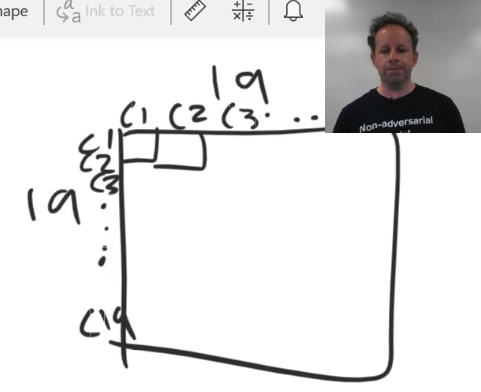

I'll tell you a secret [ [1:48:29](https://youtu.be/xXXiC4YRGrQ%3Ft%3D1h48m29s) ]. Most deep learning practitioners either don't know or don't remember all these things like what is a Gram matrix if they ever did study at university. They probably forgot it because they had a big night afterwards. And the way it works in practice is you realize “oh, I could create a kind of non-spacial representation of how the channels correlate with each other” and then when I write up the paper, I have to go and ask around and say “does this thing have a name?” and somebody will be like “isn't that the Gram matrix?” and you go and look it up and it is. So don't think you have to go study all of math first. Use your intuition and common sense and then you worry about what the math is called later, normally. Sometimes it works the other way, not with me because I can't do math.

So this is called the Gram matrix [ [1:49:22](https://youtu.be/xXXiC4YRGrQ%3Ft%3D1h49m22s) ]. And of course, if you are a real mathematician, it's very important that you say this as if you always knew it was a Gram matrix and you kind of just go oh yes, we just calculate the Gram matrix. So the Gram matrix then is this kind of map — the diagonal is perhaps the most interesting. The diagonal is which channels are the most active and then the off diagonal is which channels tend to appear together. And overall, if two pictures have the same style, then we are expecting that some layer of activations, they will have similar Gram matrices. Because if we found the level of activations that capture a lot of stuff about like paint strokes and colors, then the diagonal alone (in Gram matrices) might even be enough. That's another interesting homework assignment, if somebody wants to take it, is try doing Gatys' style transfer not using the Gram matrix but just using the diagonal of the Gram matrix. That would be like a single line of code to change. But I haven't seen it tried and I don't know if it would work at all, but it might work fine.

“Okay, yes Christine, you've tried it” [ [1:50:51](https://youtu.be/xXXiC4YRGrQ%3Ft%3D1h50m51s) ]. “I have tried that and it works most of the time except when you have funny pictures where you need two styles to appear in the same spot. So it seems like grass in one half and a crowd in one half, and you need the two styles.” (Christine). Cool, you're still gonna do your homework, but Christine says she'll do it for you.

```
 def scale_match(src, targ):  h,w,_ = img.shape  sh,sw,_ = style_img.shape  rat = max(h/sh,w/sw); rat  res = cv2.resize(style_img, (int(sw*rat), int(sh*rat)))  return res[:h,:w] 
```

```
 style = scale_match(img, style_img) 
```

```
 plt.imshow(style)  style.shape, img.shape 
```

```
 ((291, 483, 3), (291, 483, 3)) 
```


So here is our painting [ [1:51:22](https://youtu.be/xXXiC4YRGrQ%3Ft%3D1h51m22s) ]. I've tried to resize the painting so it's the same size as my bird picture. So that's all this is just doing. It doesn't matter too much which bit I use as long as it's got lots of the nice style in it.

I grab my optimizer and my random image just like before:

```
 opt_img_v, optimizer = get_opt() 
```

And this time, I call `SaveFeatures` for all of my `block_ends` and that's going to give me an array of SaveFeatures objects — one for each module that appears the layer before the max pool. Because this time, I want to play around with different activation layer styles, or more specifically I want to let you play around with it. So now I've got a whole array of them.

```
 sfs = [SaveFeatures(children(m_vgg)[idx]) for idx in block_ends] 
```

`style_img` is my Van Gogh painting. So I take my `style_img` , put it through my transformations to create my transform style image ( `style_tfm` ).

```
 style_tfm = val_tfms(style_img) 
```

Turn that into a variable, put it through the forward pass of my VGG module, and now I can go through all of my SaveFeatures objects and grab each set of features. Notice I call `clone` because later on, if I call my VGG object again, it's going to replace those contents. I haven't quite thought about whether this is necessary. If you take it away and it's not, that's fine. But I was just being careful. So here is now an array of the activations at every `block_end` layer. And here, you can see all of those shapes:

```
 m_vgg(VV(style_tfm[ None ]))  targ_styles = [V(o.features.clone()) for o in sfs]  [o.shape for o in targ_styles] 
```

```
 [torch.Size([1, 64, 288, 288]), 
 torch.Size([1, 128, 144, 144]), 
 torch.Size([1, 256, 72, 72]), 
 torch.Size([1, 512, 36, 36]), 
 torch.Size([1, 512, 18, 18])] 
```

And you can see, being able to whip up a list comprehension really quickly, it's really important in your Jupyter fiddling around [ [1:53:30](https://youtu.be/xXXiC4YRGrQ%3Ft%3D1h53m30s) ]. Because you really want to be able to immediately see here's my channel (64, 128, 256, …), and grid size halving as we would expect (288, 144, 72…) because all of these appear just before a max pool.

So to do a Gram MSE loss, it's going to be the MSE loss on the Gram matrix of the input vs. the gram matrix of the target. And the Gram matrix is just the matrix multiply of `x` with `x` transpose ( `xt()` ) where x is simply equal to my input where I've flattened the batch and channel axes all down together. I've only got one image, so you can ignore the batch part — it's basically channel. Then everything else ( `-1` ), which in this case is the height and width, is the other dimension because there's now going to be channel by height and width, and then as we discussed we can them just do the matrix multiply of that by its transpose. And just to normalize it, we'll divide that by the number of elements ( `b*c*h*w` ) — it would actually be more elegant if I had said `input.numel` (number of elements) that would be the same thing. Again, this gave me tiny numbers so I multiply it by a big number to make it something more sensible. So that's basically my loss.

```
 def gram(input):  b,c,h,w = input.size()  x = input.view(b*c, -1)  return torch.mm(x, xt())/input.numel()*1e6  def gram_mse_loss(input, target):  return F.mse_loss(gram(input), gram(target)) 
```

So now my style loss is to take my image to optimize, throw it through VGG forward pass, grab an array of the features in all of the SaveFeatures objects, and then call my Gram MSE loss on every one of those layers [ [1:55:13](https://youtu.be/xXXiC4YRGrQ%3Ft%3D1h55m13s) ]. And that's going to give me an array and then I just add them up. Now you could add them up with different weightings, you could add up subsets, or whatever. In this case, I'm just grabbing all of them.

```
 def style_loss(x):  m_vgg(opt_img_v)  outs = [V(o.features) for o in sfs]  losses = [gram_mse_loss(o, s) for o,s in zip(outs, targ_styles)]  return sum(losses) 
```

Pass that into my optimizer as before:

```
 n_iter=0  while n_iter <= max_iter: optimizer.step(partial(step,style_loss)) 
```

```
 Iteration: n_iter, loss: 230718.453125 
 Iteration: n_iter, loss: 219493.21875 
 Iteration: n_iter, loss: 202618.109375 
 Iteration: n_iter, loss: 481.5616760253906 
 Iteration: n_iter, loss: 147.41177368164062 
 Iteration: n_iter, loss: 80.62625122070312 
 Iteration: n_iter, loss: 49.52326965332031 
 Iteration: n_iter, loss: 32.36254119873047 
 Iteration: n_iter, loss: 21.831811904907227 
 Iteration: n_iter, loss: 15.61091423034668 
```

And here we have a random image in the style of Van Gogh which I think is kind of cool.

```
 x = val_tfms.denorm(np.rollaxis(to_np(opt_img_v.data),1,4))[0]  plt.figure(figsize=(7,7))  plt.imshow(x); 
```


Again Gatys has done it for us. Here is different layers of random image in the style of Van Gogh. So the first one, as you can see, the activations are simple geometric things — not very interesting at all. The later layers are much more interesting. So we kind of have a suspicion that we probably want to use later layers largely for our style loss if we wanted to look good.


I added this `SaveFeatures.close` [ [1:56:35](https://youtu.be/xXXiC4YRGrQ%3Ft%3D1h56m35s) ] which just calls `self.hook.remove()` . Remember, I stored the hook as `self.hook` so `hook.remove()` gets rid of it. It's a good idea to get rid of it because otherwise you can potentially just keep using memory. So at the end, I just go through each of my SaveFeatures object and close it:

```
 for sf in sfs: sf.close() 
```

#### Style transfer [ [1:57:08](https://youtu.be/xXXiC4YRGrQ%3Ft%3D1h57m8s) ]

Style transfer is adding content loss and style loss together with some weight. So there is no much to show.

Grab my optimizer, grab my image:

```
 opt_img_v, optimizer = get_opt() 
```

And my combined loss is the MSE loss at one particular layer, my style loss at all of my layers, sum up the style losses, add them to the content loss, the content loss I'm scaling. Actually the style loss, I scaled already by 1E6\. So they are both scaled exactly the same. Add them together. Again, you could trying weighting the different style losses or you could maybe remove some of them, so this is the simplest possible version.

```
 def comb_loss(x):  m_vgg(opt_img_v)  outs = [V(o.features) for o in sfs]  losses = [gram_mse_loss(o, s) for o,s in zip(outs, targ_styles)]  cnt_loss = F.mse_loss(outs[3], targ_vs[3])*1000000  style_loss = sum(losses)  return cnt_loss + style_loss 
```

Train that:

```
 n_iter=0  while n_iter <= max_iter: optimizer.step(partial(step,comb_loss)) 
```

```
 Iteration: n_iter, loss: 1802.36767578125 
 Iteration: n_iter, loss: 1163.05908203125 
 Iteration: n_iter, loss: 961.6024169921875 
 Iteration: n_iter, loss: 853.079833984375 
 Iteration: n_iter, loss: 784.970458984375 
 Iteration: n_iter, loss: 739.18994140625 
 Iteration: n_iter, loss: 706.310791015625 
 Iteration: n_iter, loss: 681.6689453125 
 Iteration: n_iter, loss: 662.4088134765625 
 Iteration: n_iter, loss: 646.329833984375 
```

```
 x = val_tfms.denorm(np.rollaxis(to_np(opt_img_v.data),1,4))[0]  plt.figure(figsize=(9,9))  plt.imshow(x, interpolation='lanczos')  plt.axis('off'); 
```


```
 for sf in sfs: sf.close() 
```

And holy crap, it actually looks good. So I think that's pretty awesome. The main take away here is if you want to solve something with a neural network, all you've got to do is set up a loss function and then optimize something. And the loss function is something which a lower number is something that you're happier with. Because then when you optimize it, it's going to make that number as low as you can, and it'll do what you wanted it to do. So here, Gatys came up with the loss function that does a good job of being a smaller number when it looks like the thing we want it to look like, and it looks like the style of the thing we want to be in the style of. That's all we had to do.

What it actually comes to it [ [1:59:10](https://youtu.be/xXXiC4YRGrQ%3Ft%3D1h59m10s) ], apart from implementing Gram MSE loss which was like 6 lines of code if that, that's our loss function:


Pass it to our optimizer, and wait about 5 seconds, and we are done. And remember, we could do a batch of these at a time, so we could wait 5 seconds and 64 of these will be done. So I think that's really interesting and since this paper came out, it has really inspired a lot of interesting work. To me though, most of the interesting work hasn't happened yet because to me, the interesting work is the work where you combine human creativity with these kinds of tools. I haven't seen much in the way of tools that you can download or use where the artist is in control and can kind of do things interactively. It's interesting talking to the guys at [Google Magenta](https://magenta.tensorflow.org/) project which is their creative AI project, all of the stuff they are doing with music is specifically about this. It's building tools that musicians can use to perform in real time. And you'll see much more of that on the music space thanks to Magenta. If you go to their website, there's all kinds of things where you can press the buttons to actually change the drum beats, melodies, keys, etc. You can definitely see Adobe or Nvidia is starting to release little prototypes and starting to do this but this kind of creative AI explosion hasn't happened yet. I think we have pretty much all the technology we need but no one's put it together into a thing and said “look at the thing I built and look at the stuff that people built with my thing.” So that's just a huge area of opportunity.

So the paper that I mentioned at the start of class in passing [ [2:01:16](https://youtu.be/xXXiC4YRGrQ%3Ft%3D2h1m16s) ] — the one where we can add Captain America's shield to arbitrary paintings basically used this technique. The trick was though some minor tweaks to make the pasted Captain America shield blend in nicely. But that paper is only a couple of days old, so that would be a really interesting project to try because you can use all this code. It really does leverage this approach. Then you could start by making the content image be like the painting with the shield and then the style image could be the painting without the shield. That would be a good start, and then you could see what specific problems they try to solve in this paper to make it better. But you could have a start on it right now.

**Question** : Two questions — earlier there were a number of people that expressed interest in your thoughts on Pyro and probabilistic programming [ [2:02:34](https://youtu.be/xXXiC4YRGrQ%3Ft%3D2h2m34s) ]. So TensorFlow has now got this TensorFlow probability or something. There's a bunch of probabilistic programming framework out there. I think they are intriguing, but as yet unproven in the sense that I haven't seen anything done with any probabilistic programming system which hasn't been done better without them. The basic premise is that it allows you to create more of a model of how you think the world works and then plug in the parameters. So back when I used to work in management consulting 20 years ago, we used to do a lot of stuff where we would use a spreadsheet and then we would have these Monte Carlo simulation plugins — there was one called At Risk(?) and one called Crystal Ball. I don't know if they still exist decades later. Basically they would let you change a spreadsheet cell to say this is not a specific value but it actually represents a distribution of values with this mean and the standard deviation or it's got this distribution, and then you would hit a button and the spreadsheet would recalculate a thousand times pulling random numbers from these distributions and show you the distribution of your outcome that might be profit or market share or whatever. We used them all the time back then. Apparently feel that a spreadsheet is a more obvious place to do that kind of work because you can see it all much more naturally, but I don't know. 走着瞧。 At this stage, I hope it turns out to be useful because I find it very appealing and it appeals to as I say the kind of work I used to do a lot of. There's actually whole practices around this stuff they used to call system dynamics which really was built on top of this kind of stuff, but it's not quite gone anywhere.

**Question** : Then there was a question about pre-training for generic style transfer [ [2:04:57](https://youtu.be/xXXiC4YRGrQ%3Ft%3D2h4m57s) ]. I don't think you can pre-train for a generic style, but you can pre-train for a generic photo for a particular style which is where we are going to get to. Although, it may end up being a homework. I haven't decided yet. But I'm going to do all the pieces.

**Question** : Please ask him to talk about multi-GPU [ [2:05:31](https://youtu.be/xXXiC4YRGrQ%3Ft%3D2h5m31s) ]. Oh yeah, I haven't had a slide about that. We're about to hit it.

Before we do, just another interesting picture from the Gatys' paper. They've got a few more just didn't fit in my slide but different convolutional layers for the style. Different style to content ratios, and here's the different images. Obviously this isn't Van Gogh any more, this is a different combination. So you can see, if you just do all style, you don't see any image. If you do lots of content, but you use low enough convolutional layer, it looks okay but the back ground is kind of dumb. So you kind of want somewhere in the middle. So you can play around with it and experiment, but also use the paper to help guide you.


#### The Math [ [2:06:33](https://youtu.be/xXXiC4YRGrQ%3Ft%3D2h6m33s) ]

Actually, I think I might work on the math now and we'll talk about multi GPU and super resolution next week because this is from the paper and one of the things I really do want you to do after we talk about a paper is to read the paper and then ask questions on the forum anything that's not clear. But there's a key part of this paper which I wanted to talk about and discuss how to interpret it. So the paper says, we're going to be given an input image _x_ and this little thing means normally it means it's a vector, Rachel, but this one is a matrix. I guess it could mean either. 我不知道。 Normally small letter bold means vector or a small letter with an arrow on top means vector. And normally big letter means matrix or small letter with two arrows on top means matrix. In this case, our image is a matrix. We are going to basically treat it as a vector, so maybe we're just getting ahead of ourselves.


So we've got an input image _x_ and it can be encoded in a particular layer of the CNN by the filter responses (ie activations). Filter responses are activations. Hopefully, that's something you all understand. That's basically what a CNN does is it produces layers of activations. A layer has a bunch of filters which produce a number of channels. This year says that layer number L has capital N _l_ filters. Again, this capital does not mean matrix. So I don't know, math notation is so inconsistent. So capital Nl distinct filters at layer L which means it has also that many feature maps. So make sure you can see this letter Nl is the same as this letter. So you've got to be very careful to read the letters and recognize it's like snap, that's the same letter as that. So obviously, Nl filters create create Nl feature maps or channels, each one of size M _l_ (okay, I can see this is where the unrolling is happening). So this is like M[ _l_ ] in numpy notation. It's the _l_ th layer. So M for the _l_ th layer. The size is height times width — so we flattened it out. So the responses in a layer l can be stored in a matrix F (and now the _l_ goes at the top for some reason). So this is not f^ _l_ , it's just another indexing. We are just moving it around for fun. This thing here where we say it's an element of R — this is a special R meaning the real numbers N times M (this is saying that the dimensions of this is N by M). So this is really important, you don't move on. It's just like with PyTorch, making sure that you understand the rank and size of your dimensions first, same with math. These are the bits where you stop and think why is it N by M? N is a number of filters, M is height by width. So do you remember that thing when we did `.view(b*c, -1)` ? Here that is. So try to map the code to the math. So F is `x` :


If I was nicer to you, I would have used the same letters as the paper. But I was too busy getting this darn thing working to do that carefully. So you can go back and rename it as capital F.

So this is why we moved the L to the top is because we're now going to have some more indexing. Where else in Numpy or PyTorch, we index things by square brackets and then lots of things with commas between. The approach in math is to surround your letter by little letters all around it — just throw them up there everywhere. So here, F _l_ is the _l_ th layer of F and then _ij_ is the activation of the _i_ th filter at position _j_ of layer _l_ . So position _j_ is up to size M which is up to size height by width. This is the kind of thing that would be easy to get confused. Often you'd see an _ij_ and assume that's indexing into a position of an image like height by width, but it's totally not, is it? It's indexing into channel by flattened image. It even tells you — it's the _i_ th filter/channel in the _j_ th position in the flattened out image in layer _l_ . So you're not gonna be able to get any further in the paper unless you understand what F is. That's why these are the bits where you stop and make sure you're comfortable.

So now, the content loss, I'm not going to spend much time on but basically we are going to just check out the values of the activations vs. the predictions squared [ [2:12:03](https://youtu.be/xXXiC4YRGrQ%3Ft%3D2h12m3s) ]. So there's our content loss. The style loss will be much the same thing, but using the Gram matrix G:


I really wanted to show you this one. I think it's super. Sometimes I really like things you can do in math notation, and they're things that you can also generally do in J and APL which is this kind of this implicit loop going on here. What this is saying is there's a whole bunch of values of _i_ and a whole bunch of values of _j_ , and I'm going to define G for all of them. And there's whole bunch of values of _l_ as well, and I'm going to define G for all of those as well. So for all of my G at every _l_ of every _i_ at every _j_ , it's going to be equal to something. And you can see that something has an _i_ and a _j_ and a _l_ , matching G, and it also has a _k_ and that's part of the sum. So what's going on here? Well, it's saying that my Gram matrix in layer _l_ for the _i_ th position in one axis and the _j_ th position in another axis is equal to my F matrix (so my flattened out matrix) for the _i_ th channel in that layer vs. the _j_ th channel in the same layer, then I'm going to sum over. We are going to take the _k_ th position and multiply them together and then add them all up. So that's exactly what we just did before when we calculated our Gram matrix. So this, there's a lot going on because of some, to me, very neat notation — which is there are three implicit loops all going on at the same time, plus one explicit loop in the sum, then they all work together to create this Gram matrix for every layer. So let's go back and see if you can match this. Sl all that's happening all at once which is pretty great.

而已。 So next week, we're going to be looking at a very similar approach, basically doing style transfer all over again but in a way where we actually going to train a neural network to do it for us rather than having to do the optimization. We'll also see that you can do the same thing to do super resolution. And we are also going to go back and revisit some of the SSD stuff as well as doing some segmentation. So if you've forgotten SSD, might be worth doing a little bit of revision this week. Alright, thanks everybody. See you next week.
