# 深度学习：第二部分第十四课

[论坛](http://forums.fast.ai/t/part-2-lesson-14-wiki/15650/1) / [视频](https://youtu.be/nG3tT31nPmQ)


#### 从上周开始讲述


Alena Harley做了一些非常有趣的事情，她试图找出如果你只用三四百张图像循环GAN会发生什么，我真的很喜欢这些项目，人们只是使用API​​或其中一个库来进行Google Image Search那里。 我们的一些学生已经创建了一些非常好的库，用于与Google图像API交互，下载他们感兴趣的一些东西，在这种情况下是一些照片和一些彩色玻璃窗。 有300到400张照片，她训练了一些不同的模特 - 这是我特别喜欢的。 正如您所看到的，使用相当少的图像，她可以获得非常漂亮的彩色玻璃效果。 所以我认为这是一个有趣的例子，使用了很少的数据，这些数据很容易获得，她能够很快下载。 如果您有兴趣，可以在论坛上获得更多相关信息。
有趣的是，想知道人们会用这种生成模型提出什么样的东西。 这显然是一种伟大的艺术媒介。 对于伪造品和面包店来说，这显然是一个很好的媒介。 我想知道人们会意识到他们可以用这些生成模型做些什么。 我认为音频将成为下一个重要领域。 也非常互动的类型的东西。 Nvidia刚刚发布了一篇论文，展示了一种互动式的照片修复工具，你只需刷过一个物体，就可以用非常好的深度学习替换它取而代之。 我觉得那些互动工具也很有意思。

### 超级分辨率[ [2:06](https://youtu.be/nG3tT31nPmQ%3Ft%3D2m6s) ]

[实时样式转换和超分辨率的感知损失](https://arxiv.org/abs/1603.08155)

上次，我们通过实际直接优化像素来研究样式转移。 与第二部分中的大部分内容一样，并不是因为我希望您理解样式转换本身，而是直接优化输入并将激活作为损失函数的一部分的想法真的是关键外卖。

因此，有效地看待后续论文是有趣的，不是来自同一个人，而是来自Justin Johnson和斯坦福大学的人们在这些视觉生成模型的序列中接下来的论文。 它实际上做了同样的事情 - 风格转移，但它以不同的方式。 我们不会优化像素，而是回到更熟悉的东西并优化一些权重。 具体来说，我们将训练一个模型，该模型学会拍摄照片并将其翻译成特定艺术作品风格的照片。 因此每个转换网将学习生成一种风格。

现在事实证明，到了那一点，有一个中间点（我实际上认为更有用并将我们带到我们中途）是一种称为超分辨率的东西。 所以我们实际上将从超级分辨率开始[ [3:55](https://youtu.be/nG3tT31nPmQ%3Ft%3D3m55s) ]。 因为那时我们将建立在超级分辨率之上，以完成基于转换网络的样式转移。

超分辨率是我们拍摄低分辨率图像（我们将采用72乘72）并将其放大到更大的图像（在我们的例子中为288乘288），试图创建一个看起来尽可能真实的更高分辨率图像。 这是一件具有挑战性的事情，因为在72乘72时，关于很多细节的信息并不多。 很酷的是，我们将采用与视觉模型相关的方式进行操作，视觉模型与输入大小无关，因此您可以完全采用此模型并将其应用于288 x 288图像并获取某些内容这是每侧大四倍，所以比原来大16倍。 通常它甚至在这个级别上工作得更好，因为你真的在更精细的细节中引入了很多细节，你可以真正打印出一些高分辨率的打印件，这些打印件之前很像是像素化的。

#### [笔记本](https://github.com/fastai/fastai/blob/master/courses/dl2/enhance.ipynb) [ [5:06](https://youtu.be/nG3tT31nPmQ%3Ft%3D5m6s) ]

这很像CSI样式增强，我们将采取看似信息不存在的东西，我们发明它 - 但是转换网将学会以一致的方式发明它有了那里的信息，所以希望它发明了正确的信息。 关于这类问题的一个非常好的事情是我们可以在没有任何标签要求的情况下创建我们自己的数据集，因为我们可以通过对图像进行下采样轻松地从高分辨率图像创建低分辨率图像。 所以我希望你们这些人本周尝试的其他方法是做其他类型的图像到图像的翻译，你可以发明“标签”（你的因变量）。 例如：

*   **歪斜** ：要么将旋转了90度或更好的东西识别为旋转了5度并将它们拉直。
*   **着色** ：将一堆图像变成黑白，并学会再次将颜色重新调整。
*   **降噪** ：也许做一个非常低质量的JPEG保存，并学会把它恢复到应该如何。
*   也许采用16色调的东西，并将其放回更高的调色板。

我认为这些东西都很有趣，因为它们可以用来拍摄你可能在高分辨率之前用旧的数码相机拍摄的照片，或者你可能已经扫描了一些现在已经褪色的旧照片等等。我认为这是能够做到的确非常有用，这是一个很好的项目，因为它与我们在这里所做的非常相似，但是相当不同，你在路上遇到了一些有趣的挑战，我敢肯定。

我将再次使用ImageNet [ [7:19](https://youtu.be/nG3tT31nPmQ%3Ft%3D7m19s) ]。 你根本不需要使用所有的ImageNet，我恰好让它躺在那里。 您可以从files.fast.ai下载ImageNet的1％样本。 你可以使用你老实说谎的任何一组照片。

```
 matplotlib inline  %reload_ext autoreload  %autoreload 2 
```

### 超分辨率数据

```
 **from** **fastai.conv_learner** **import** *  **from** **pathlib** **import** Path  torch.backends.cudnn.benchmark= **True** 
```

```
 PATH = Path('data/imagenet')  PATH_TRN = PATH/'train' 
```

在这种情况下，正如我所说，我们本身并没有真正的标签，所以我只是给所有标签零，这样我们就可以更容易地将它与我们现有的基础设施一起使用。

```
 fnames_full,label_arr_full,all_labels = folder_source(PATH, 'train')  fnames_full = ['/'.join(Path(fn).parts[-2:]) **for** fn **in** fnames_full]  list(zip(fnames_full[:5],label_arr_full[:5])) 
```

```
 _[('n01440764/n01440764_9627.JPEG', 0),_  _('n01440764/n01440764_9609.JPEG', 0),_  _('n01440764/n01440764_5176.JPEG', 0),_  _('n01440764/n01440764_6936.JPEG', 0),_  _('n01440764/n01440764_4005.JPEG', 0)]_ 
```

```
 all_labels[:5] 
```

```
 _['n01440764', 'n01443537', 'n01484850', 'n01491361', 'n01494475']_ 
```

现在，因为我指的是一个包含所有ImageNet的文件夹，我当然不想等待所有的ImageNet完成运行一个纪元。 所以在这里，我只是，大多数时候，我会将“保持百分比”（ `keep_pct` ）设置为1或2％。 然后我只生成一堆随机数，然后我保留那些小于0.02的数据，这样我就可以快速对我的行进行二次采样。

```
 np.random.seed(42)  # keep_pct = 1.  _keep_pct = 0.02_  keeps = np.random.rand(len(fnames_full)) < keep_pct  fnames = np.array(fnames_full, copy= **False** )[keeps]  label_arr = np.array(label_arr_full, copy= **False** )[keeps] 
```

所以我们将使用VGG16 [ [8:21](https://youtu.be/nG3tT31nPmQ%3Ft%3D8m21s) ]而VGG16是我们在这个类中没有真正看过的东西，但它是一个非常简单的模型，我们采用正常的3通道输入，我们基本上通过一个3x3卷积的数量，然后不时，我们通过2x2 maxpool，然后我们再做3x3卷积，maxpool，等等。 这是我们的支柱。


然后我们不做自适应平均池层。 在其中一些之后，我们像往常一样（或类似的东西）最终得到这个7x7x512网格。 因此，我们做了一些不同的事情，而不是平均汇集，我们将整个事情弄平 - 所以如果内存正确运行，它会向外喷出一个非常长的7x7x512大小的激活向量。 然后将其送入两个完全连接的层，每个层具有4096个激活，以及一个完全连接的层，其具有许多类。 所以如果你考虑一下，这里的权重矩阵，它是巨大的7x7x512x4096。 正是由于这个权重矩阵，VGG很快就失宠了 - 因为它占用了大量的内存并且需要大量的计算而且速度非常慢。 这里有很多冗余的东西，因为实际上那些512次激活并不特定于它们所处的7x7网格单元中的哪一个。但是当你在这里拥有每个可能组合的整个权重矩阵时，它会将所有这些单独处理。 因此，这也可能导致泛化问题，因为只有很多权重等等。


我的观点是在每个现代网络中使用的方法，我们在这里进行自适应平均池（在Keras中它被称为全局平均池，在fast.ai中，我们做一个AdaptiveConcatPool），它直接将它吐出到512长激活[ [11:06](https://youtu.be/nG3tT31nPmQ%3Ft%3D11m6s) ]。 我认为这会丢掉太多的几何体。 所以对我来说，可能正确的答案介于两者之间，并且将涉及某种因素卷积或某种张量分解，这可能是我们中的一些人在未来几个月可能会想到的。 所以现在，无论如何，我们已经从一个极端，即自适应平均汇集到另一个极端，即这个巨大的扁平完全连接层。

关于VGG的一些有趣的事情使它今天仍然有用[ [11:59](https://youtu.be/nG3tT31nPmQ%3Ft%3D11m59s) ]。 第一个是在这里有更多有趣的层与大多数现代网络，包括ResNet系列，第一层通常是7x7转换，步幅2或类似的东西。 这意味着我们可以立即丢弃一半的网格大小，因此几乎没有机会使用精细细节，因为我们从不对它进行任何计算。 因此，对于分段或超分辨率模型这样的问题，这是一个问题，因为细节很重要。 我们实际上想恢复它。 然后第二个问题是自适应池化层完全抛弃了最后几个部分中的几何体，这意味着模型的其余部分实际上没有像几何体那样有趣的学习。 因此，对于依赖于位置的事物，任何需要生成模型的任何类型的基于本地化的方法都将变得不那么有效。 所以我希望你在我描述的内容之一就是可能没有一个现有的架构实际上是理想的。 我们可以发明一个新的 。 实际上，我只是尝试在一周内发明一个新的，即将VGG头部连接到ResNet骨干网。 有趣的是，我发现我的分类器实际上比普通的ResNet好一些，但它也有一些更有用的信息。 训练需要花费5或10％的时间，但没有什么值得担心的。 也许我们可以在ResNet中替换这个（7x7转步2），正如我们之前简要讨论过的那样。 这个非常早期的卷积更像是一个Inception词干，它有更多的计算。 我认为这些架构肯定有一些很好的调整空间，因此我们可以构建一些可能更通用的模型。 目前，人们倾向于构建只做一件事的架构。 他们并没有真正想到我在机会方面扔掉了什么，因为这就是出版的运作方式。 你发表了“我已经掌握了这一件事的最新技术，而不是你创造了许多擅长许多东西的东西。

由于这些原因，我们今天将使用VGG，尽管它很古老而且缺少很多很棒的东西[ [14:42](https://youtu.be/nG3tT31nPmQ%3Ft%3D14m42s) ]。 我们要做的一件事是使用稍微更现代的版本，这是VGG的一个版本，在所有卷积之后添加了批量规范。 在fast.ai，当你要求VGG网络时，你总是得到批量规范，因为这基本上总是你想要的。 所以这是具有批量规范的VGG。 有16和19,19更大更重，并没有真正做得更好，所以没有人真正使用它。

```
 arch = vgg16  sz_lr = 72 
```

我们将从72 `sz_lr` 72 LR（ `sz_lr` ：尺寸低分辨率）输入。 我们最初将它按比例缩放2倍，批量大小为64，得到2 * 72，144 144输出。 那将是我们的第一阶段。

```
 scale,bs = 2,64  _# scale,bs = 4,32_  sz_hr = sz_lr*scale 
```

我们将为此创建我们自己的数据集，并且非常值得查看fastai.dataset模块并查看其中的内容[ [15:45](https://youtu.be/nG3tT31nPmQ%3Ft%3D15m45s) ]。 因为你想要的任何东西，我们可能有一些几乎你想要的东西。 所以在这种情况下，我想要一个数据集，其中我的_x_是图像，而我的_y_也是图像。 我们可以从_x_继承的文件数据集中继承，然后我只是继承了它，我只是复制并粘贴了`get_x`并将其转换为`get_y`因此它只是打开一个图像。 现在我有一些东西，其中_x_是一个图像， _y_是一个图像，在这两种情况下，我们传入的是一个文件名数组。

```
 **class** **MatchedFilesDataset** (FilesDataset):  **def** __init__(self, fnames, y, transform, path):  self.y=y  **assert** (len(fnames)==len(y))  super().__init__(fnames, transform, path)  **def** get_y(self, i):  **return** open_image(os.path.join(self.path, self.y[i]))  **def** get_c(self): **return** 0 
```

我要做一些数据增强[ [16:32](https://youtu.be/nG3tT31nPmQ%3Ft%3D16m32s) ]。 显然，对于所有的ImageNet，我们并不真正需要它，但这主要适用于使用较小数据集来充分利用它的任何人。 `RandomDihedral`指的是每个可能的90度旋转加上可选的左/右翻转，因此它们是八个对称的二面体组。 通常我们不会对ImageNet图片使用这种转换，因为你通常不会颠倒狗，但在这种情况下，我们不是要试图分类它是狗还是猫，我们只是试图保持一般的结构它。 所以实际上每次可能的翻转对于这个问题都是合理合理的。

```
 aug_tfms = [RandomDihedral(tfm_y=TfmType.PIXEL)] 
```

以通常的方式创建验证集[ [17:19](https://youtu.be/nG3tT31nPmQ%3Ft%3D17m19s) ]。 你可以看到我正在使用更低级别的功能 - 一般来说，我只是将它们复制并粘贴在fastai源代码中以找到我想要的位。 所以这里是一个位，它接受一组验证集索引和一个或多个变量数组，并简单地拆分。 在这种情况下，将此（ `np.array(fnames)` ）转换为训练和验证集，并将此（第二个`np.array(fnames)` ）转换为训练和验证集，以便为我们提供_x_和_y_的。 在这种情况下， _x_和_y_是相同的。 我们的输入图像和输出图像是相同的。 我们将使用转换来使其中一个降低分辨率。 这就是为什么这些都是一回事。

```
 val_idxs = get_cv_idxs(len(fnames), val_pct=min(0.01/keep_pct, 0.1))  ((val_x,trn_x),(val_y,trn_y)) = split_by_idx(val_idxs,  np.array(fnames), np.array(fnames))  len(val_x),len(trn_x) 
```

```
 _(12811, 1268356)_ 
```

```
 img_fn = PATH/'train'/'n01558993'/'n01558993_9684.JPEG' 
```

我们需要做的下一件事是按照惯例创建我们的转换[ [18:13](https://youtu.be/nG3tT31nPmQ%3Ft%3D18m13s) ]。 我们将使用`tfm_y`参数，就像我们对边界框所做的那样，而不是使用`TfmType.COORD`我们将使用`TfmType.PIXEL` 。 这告诉我们的转换框架你的_y_值是包含普通像素的图像，所以你对_x_做的任何事情，你也需要对_y_做同样的事情。 您需要确保您使用的任何数据增强转换都具有相同的参数。

```
 tfms = tfms_from_model(arch, sz_lr, tfm_y=TfmType.PIXEL,  aug_tfms=aug_tfms, sz_y=sz_hr)  datasets = ImageData.get_ds(MatchedFilesDataset, (trn_x,trn_y),  (val_x,val_y), tfms, path=PATH_TRN)  md = ImageData(PATH, datasets, bs, num_workers=16, classes= **None** ) 
```

您可以看到可能的转换类型：

*   CLASS：我们即将在今天下半年使用细分的分类
*   COORD：坐标 - 根本没有转变
*   PIXEL

一旦我们有`Dataset`类和一些_x_和_y_训练和验证集。 有一个方便的小方法叫做get datasets（ `get_ds` ），它基本上在所有不同的东西上运行该构造函数，你需要以完全正确的格式返回所需的所有数据集，以传递给ModelData构造函数（在本例中为`ImageData`构造函数） ）。 所以我们有点回到fastai的封面下并从头开始构建它。 在接下来的几个星期里，这一切都将被包装并重构为您可以在fastai中一步完成的事情。 但本课程的重点是学习一些关于幕后工作的内容。

我们之前简要介绍的一点是，当我们拍摄图像时，我们不仅使用数据增强对它们进行变换，而且还将通道尺寸移动到开始，我们减去平均值除以标准偏差等[ [20:08](https://youtu.be/nG3tT31nPmQ%3Ft%3D20m8s) ] 。 因此，如果我们希望能够显示那些来自我们的数据集或数据加载器的图片，我们需要对它们进行去规范化。 因此，模型数据对象的（ `md` ）数据集（ `val_ds` ）具有知道如何执行此操作的denorm函数。 为了方便，我只是给它一个简短的名字：

```
 denorm = md.val_ds.denorm 
```

所以现在我要创建一个可以显示来自数据集的图像的函数，如果你传入的东西说这是一个标准化的图像，那么我们就会对它进行说明。

```
 **def** show_img(ims, idx, figsize=(5,5), normed= **True** , ax= **None** ):  **if** ax **is** **None** : fig,ax = plt.subplots(figsize=figsize)  **if** normed: ims = denorm(ims)  **else** : ims = np.rollaxis(to_np(ims),1,4)  ax.imshow(np.clip(ims,0,1)[idx])  ax.axis('off') 
```

```
 x,y = next(iter(md.val_dl))  x.size(),y.size() 
```

```
 _(torch.Size([32, 3, 72, 72]), torch.Size([32, 3, 288, 288]))_ 
```

你会在这里看到我们已经传递了尺寸低res（ `sz_lr` ）作为我们的变换尺寸和尺寸高res（ `sz_hr` ），因为这是新的，尺寸y参数（ `sz_y` ）[ [20:58](https://youtu.be/nG3tT31nPmQ%3Ft%3D20m58s) ]。 因此这两个位将变得不同。


在这里你可以看到_x_和_y_的两种不同分辨率，对于一大堆鱼来说。

```
 idx=1  fig,axes = plt.subplots(1, 2, figsize=(9,5))  show_img(x,idx, ax=axes[0])  show_img(y,idx, ax=axes[1]) 
```

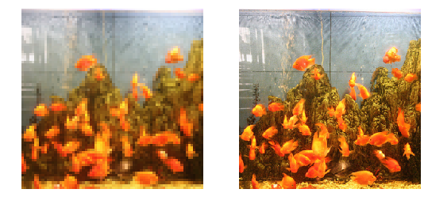

按照惯例， `plt.subplots`创建我们的两个图，然后我们可以使用回来的不同轴将东西放在彼此旁边。

```
 batches = [next(iter(md.aug_dl)) **for** i **in** range(9)] 
```

然后我们可以看看几个不同版本的数据转换[ [21:37](https://youtu.be/nG3tT31nPmQ%3Ft%3D21m37s) ]。 在那里你可以看到它们在所有不同的方向被翻转。

```
 fig, axes = plt.subplots(3, 6, figsize=(18, 9))  **for** i,(x,y) **in** enumerate(batches):  show_img(x,idx, ax=axes.flat[i*2])  show_img(y,idx, ax=axes.flat[i*2+1]) 
```


#### 型号[ [21:48](https://youtu.be/nG3tT31nPmQ%3Ft%3D21m48s) ]

让我们创建我们的模型。 我们将有一个小图像进入，我们希望有一个大图像出来。 所以我们需要在这两者之间做一些计算来计算大图像的样子。 基本上有两种方法可以进行计算：

*   我们首先可以进行一些上采样，然后进行一些步骤来进行大量计算。
*   我们可以先做很多步骤来完成所有计算，然后在最后做一些上采样。

我们将选择第二种方法，因为我们希望对较小的东西进行大量计算，因为以这种方式执行它会快得多。 此外，我们在上采样过程中可以利用所有计算。 上采样，我们知道几种可能的方法。 我们可以用：

*   转置或分步跨越的卷积
*   最近邻居上采样后跟1x1转换

在“做大量的计算”部分，我们可以拥有一大堆3x3转换。 但在特殊情况下，似乎ResNet块可能更好，因为输出和输入实际上非常相似。 所以我们真的想要一个流通路径，尽可能少的烦恼，除了做超级分辨率所需的最小量。 如果我们使用ResNet块，那么它们已经具有标识路径。 所以你可以想象那些简单的版本，它采用双线性采样方法，或者它可以通过身份块一直通过，然后在上采样块中，只需学习获取输入的平均值并得到一些不太可怕的东西。

这就是我们要做的事情。 我们将创建具有五个ResNet块的东西，然后对于每个2倍的扩展，我们必须做，我们将有一个上采样块。

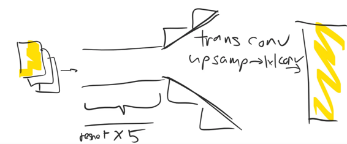

正如往常一样，它们都将包含卷积层，可能在许多卷之后具有激活函数[ [24:37](https://youtu.be/nG3tT31nPmQ%3Ft%3D24m37s) ]。 我喜欢把我的标准卷积块放到一个函数中，这样我就可以更容易地重构它。 我不会担心传递填充，只是将其直接计算为内核大小超过两个。

```
 **def** conv(ni, nf, kernel_size=3, actn= **False** ):  layers = [nn.Conv2d(ni, nf, kernel_size,  padding=kernel_size//2)]  **if** actn: layers.append(nn.ReLU( **True** ))  **return** nn.Sequential(*layers) 
```

关于我们的小转换块的一个有趣的事情是没有批量规范，这对于ResNet类型模型来说是非常不寻常的。


[https://arxiv.org/abs/1707.02921](https://arxiv.org/abs/1707.02921)


没有批量规范的原因是因为我从最近这篇精彩的论文中窃取了想法，这篇论文实际上赢得了最近超级分辨率表现的竞争。 为了看看这篇论文有多好，SRResNet是先前的技术水平，他们在这里所做的就是他们已经放大了一个上采样的网格/围栏。 人力资源是原创的。 您可以在之前的最佳方法中看到，存在大量失真和模糊现象。 或者，在他们的方法中，它几乎是完美的。 因此，本文是一个非常大的进步。 他们称他们的模型为EDSR（增强型深度超分辨率网络），他们做了两件事与以前的标准方法不同：

1.  获取ResNet块并丢弃批量规范。 他们为什么要抛弃批量规范？ 原因是因为批量规范改变了东西，我们想要一个不会改变东西的直接路径。 所以这里的想法是，如果你不想比你必须更多地输入输入，那么不要强迫它必须计算批量规范参数之类的东西 - 所以扔掉批处理规范。
2.  缩放因子（我们很快就会看到）。

```
 **class** **ResSequential** (nn.Module):  **def** __init__(self, layers, res_scale=1.0):  super().__init__()  self.res_scale = res_scale  self.m = nn.Sequential(*layers)  **def** forward(self, x): **return** x + self.m(x) * self.res_scale 
```

因此，我们将创建一个包含两个卷积的残差块。 正如你在他们的方法中看到的那样，他们在第二次转发之后甚至没有ReLU。 所以这就是我第一次激活的原因。

```
 **def** res_block(nf):  **return** ResSequential(  [conv(nf, nf, actn= **True** ), conv(nf, nf)],  0.1) 
```

这里有几件有趣的事[ [27:10](https://youtu.be/nG3tT31nPmQ%3Ft%3D27m10s) ]。 一个是这种想法，即拥有某种主要的ResNet路径（conv，ReLU，conv），然后通过将其添加回身份将其转换为ReLU块 - 这是我们经常做的事情，我将其考虑到了一个名为ResSequential的微小模块。 它只需要将一堆图层放入剩余路径中，将其转换为顺序模型，运行它，然后将其添加回输入。 有了这个小模块，我们现在可以通过包装ResSequential将任何内容（如conv激活转换）转换为ResNet块。

但这并不是我所做的全部，因为通常Res块在其`forward`只有`x + self.m(x)` 。 但我也有`* self.res_scale` 。 什么是`res_scale` ？ `res_scale`是数字0.1。 为什么会这样？ 我不确定是否有人知道。 但简短的回答是，发明批量规范的人最近也做了一篇论文，其中他（我认为）首次展示了在一小时内训练ImageNet的能力。 他这样做的方法就是启动很多机器并使它们并行工作以创建非常大的批量。 现在，通常当你按照_N阶段_增加批量大小时，你也可以通过_N_阶来提高学习率。 因此，通常非常大的批量训练也意味着非常高的学习率训练。 他发现，在训练开始时，这些非常大的批量大小为8,000+甚至高达32,000， 他的激活基本上会直接进入无限 。 许多其他人也发现了这一点。 我们实际上发现，当我们在CIFAR和ImageNet竞赛中参加DAWN测试时，我们真的很难充分利用我们试图利用的八个GPU，因为这些较大的批量大小的挑战和服用他们的优势。 基督徒发现的东西是在ResNet块中，如果他将它们乘以小于1的某个数字，比如.1或.2，它确实有助于在开始时稳定训练。 这有点奇怪，因为在数学上，它是相同的。 因为很明显，无论我在这里乘以它，我都可以按相反的数量缩放权重并使用相同的数字。 但我们并不是在处理抽象数学 - 我们正在处理真正的优化问题，不同的初始化，学习率以及其他任何问题。 所以权重消失在无穷大的问题，我想通常实际上是关于计算机在实践中的离散和有限性质。 所以这些小技巧经常会有所不同。

在这种情况下，我们只是根据我们的初始初始化来减少事情。 所以可能有其他方法可以做到这一点。 例如，Nvidia的一些人称之为LARS，我上周简要提到的是一种使用实时计算的判别学习率的方法。 基本上看一下渐变与激活之间的比例，以逐层扩展学习率。 因此他们发现他们不需要这个技巧来大量扩大批量。 也许完全不同的初始化就是必要的。 我提到这个的原因并不是因为我认为很多人可能想要在大量的计算机集群上进行训练，而是我认为很多人想要快速训练模型，这意味着使用高学习率并且理想情况下获得超级收敛。 我认为这些技巧是我们需要能够在更多不同的架构上实现超级融合的技巧等等。 除了莱斯利史密斯之外，除了现在的一些快餐学生之外，没有其他人真正致力于超级融合。 所以这些关于我们如何以非常高的学习率训练的事情，我们将不得不成为那些想出来的人，因为据我所知，没有其他人关心。 所以看一下有关训练ImageNet的文献，我们现在在一小时或更近的时间里训练ImageNet 15分钟，我认为这些文章实际上有一些技巧可以让我们以高学习率训练。 所以这是其中之一。

有趣的是，除了列车ImageNet在一小时的纸上，我见过的唯一另一个地方就是这篇EDSR论文。 这真的很酷，因为赢得比赛的人，我发现他们非常务实，读得很好。 他们实际上必须让事情发挥作用。 因此，本文描述了一种实际上比其他人的方法更好的方法，并且他们做了这些务实的事情，例如抛弃批量规范并使用几乎没有人似乎知道的这个小的缩放因子。 那就是.1来自哪里。

```
 **def** upsample(ni, nf, scale):  layers = []  **for** i **in** range(int(math.log(scale,2))):  layers += [conv(ni, nf*4), nn.PixelShuffle(2)]  **return** nn.Sequential(*layers) 
```

所以基本上我们的超级分辨率ResNet（ `SrResnet` ）将进行卷积，从我们的三个通道转到64个通道，只是为了稍微增加空间[ [33:25](https://youtu.be/nG3tT31nPmQ%3Ft%3D33m25s) ]。 然后我们实际上有8个而不是5个Res块。 请记住，这些Res块中的每一个都是步幅1，因此网格大小不会改变，滤波器的数量不会改变。 它一直只有64。 我们将再进行一次卷积，然后我们将按照我们要求的规模进行上采样。 然后我添加了一些这是一个批量规范，因为它感觉只是缩放最后一层可能会有所帮助。 然后最终转回到我们想要的三个频道。 所以你可以看到这里有很多大量的计算，然后就像我们描述的那样进行一些上采样。

```
 **class** **SrResnet** (nn.Module):  **def** __init__(self, nf, scale):  super().__init__()  features = [conv(3, 64)]  **for** i **in** range(8): features.append(res_block(64))  features += [conv(64,64), upsample(64, 64, scale),  nn.BatchNorm2d(64),  conv(64, 3)]  self.features = nn.Sequential(*features)  **def** forward(self, x): **return** self.features(x) 
```

简而言之，正如我现在所倾向的那样，这一切都是通过创建一个包含图层的列表来完成的，然后最后变成一个顺序模型，这样我的前向功能就可以了。

这是我们的上采样和上采样有点有趣，因为它没有做两件事（转换或分步跨越卷积或最近邻居上采样后跟1x1转换）。 让我们来谈谈上采样。


这是纸上的图片（实时样式转移和超分辨率的感知损失）。 所以他们说“嘿，我们的做法好多了”，但看看他们的做法。 它里面有文物。 这些只是到处流行，不是吗。 其中一个原因是他们使用转置卷积，我们都知道不使用转置卷积。

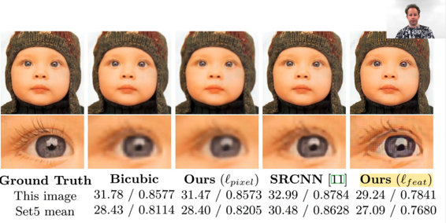

这是转换的卷积[ [35:39](https://youtu.be/nG3tT31nPmQ%3Ft%3D35m39s) ]。 这是来自这个奇妙的卷积算术论文，也在Theano文档中显示。 如果我们从（蓝色是原始图像）3x3图像到5x5图像（如果我们添加了一层填充，则为6x6），那么所有转置卷积都会使用常规的3x3转换，但它会在白色零像素之间粘贴每一对像素。 这使得输入图像更大，当我们对它进行卷积时，因此给我们更大的输出。 但这显然是愚蠢的，因为当我们到达这里时，例如，九个像素进来，其中八个是零。 所以我们只是浪费了大量的计算。 另一方面，如果我们略微偏离，那么我们的九个中有四个是非零的。 但是，我们只使用一个过滤器/内核，因此根据有多少零进来它不能改变。所以它必须适合两者并且它是不可能的，所以我们最终得到这些工件。


[http://deeplearning.net/software/theano/tutorial/conv_arithmetic.html](http://deeplearning.net/software/theano/tutorial/conv_arithmetic.html)


我们已经学会使其变得更好的一种方法是不在这里放置白色的东西，而是将像素的值复制到这三个位置中的每一个[ [36:53](https://youtu.be/nG3tT31nPmQ%3Ft%3D36m53s) ]。 这是最近邻居的上采样。 这当然好一点，但它仍然很糟糕，因为现在我们到达这九个（如上所示），其中4个是完全相同的数字。 当我们跨越一个，那么现在我们完全有不同的情况。 因此，取决于我们的位置，特别是，如果我们在这里，重复次数会少得多：

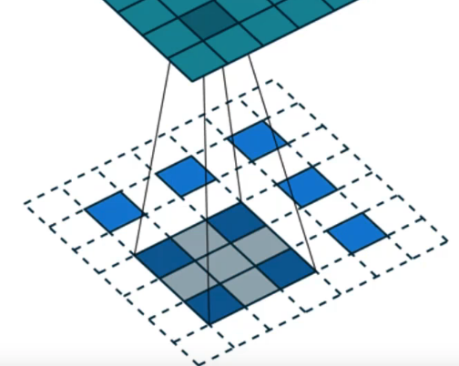

所以，我们还有这样的问题，即数据中存在浪费的计算和太多的结构，并且它将再次导致工件。 因此，上采样优于转置卷积 - 最好复制它们而不是用零替换它们。 但它还不够好。

相反，我们要做像素洗牌[ [37:56](https://youtu.be/nG3tT31nPmQ%3Ft%3D37m56s) ]。 Pixel shuffle是这个子像素卷积神经网络中的一个操作，它有点令人费解，但它有点令人着迷。


[**使用高效亚像素卷积神经网络的实时单图像和视频超分辨率**](https://arxiv.org/abs/1609.05158)


我们从输入开始，我们经过一些卷积来创建一些特征映射一段时间，直到最终我们得到具有n [i-1]个特征映射的n [i-1]层。 我们将进行另外3x3转换，我们的目标是从7x7网格单元（我们将要进行3x3升级），因此我们将升级到21x21网格单元。 那么我们能做到的另一种方式是什么呢？ 为了简单起见，让我们选择一个面/层 - 所以让我们采取最顶层的过滤器，然后对其进行卷积只是为了看看会发生什么。 我们要做的是我们将使用卷积，其中内核大小（过滤器的数量）比我们需要的大9倍（严格来说）。 因此，如果我们需要64个过滤器，我们实际上将做64次9过滤器。 为什么？ 这里，r是比例因子，因此3 2是9，所以这里有九个滤波器来覆盖这些输入层/切片之一。 但我们能做的就是从7x7开始，然后我们把它变成了7x7x9。 我们想要的输出等于7乘3乘7次3.换句话说，这里有相同数量的像素/激活，因为在前一步骤中有激活。 因此，我们可以逐步重新调整这些7x7x9激活以创建7x3乘7x3地图[ [40:16](https://youtu.be/nG3tT31nPmQ%3Ft%3D40m16s) ]。 所以我们要做的是我们要在这里拿一个小管（每个网格的左上角），我们将把紫色的一个放在左上角，然后将蓝色放在左上方。右边是浅蓝色，右边是浅蓝色，中间是浅绿色，等等。 因此，左上角的这九个单元中的每一个都将在我们网格的小3x3部分中结束。 然后我们将采用（2,1）并将所有这些9和更多它们带到网格的这些3x3部分，依此类推。 因此，我们将最终在7x3 x 7x3图像中进行这些7x7x9激活中的每一个。

所以首先要认识到的是当然这是在作品的某些定义下工作的，因为我们在这里有一个可学习的卷积，并且它会得到一些渐变，它可以做到最好的工作，它可以填充正确的激活，这样这输出是我们想要的东西。 所以第一步是要意识到这里没有什么特别神奇的东西。 我们可以创建任何我们喜欢的架构。 我们可以随心所欲地移动东西，我们在卷积中的权重将尽我们所能去做。 真正的问题是 - 这是个好主意吗？ 对于它来说这是一件更容易的事情，并且它比转换卷积或逐个转换后的逐次取样更灵活吗？ 简短的回答是肯定的，简而言之就是这里的卷积发生在低分辨率7x7空间中，这非常有效。 或者，如果我们首先进行上采样然后再进行转换，那么我们的转换将发生在21乘21空间，这是很多计算。 此外，正如我们所讨论的，最近邻上采样版本中存在大量复制和冗余。 事实上，他们实际上在本文中表明，他们有一个后续技术说明，他们提供了更多的数学细节，以确切地说正在做什么工作，并表明这项工作确实更有效率。 这就是我们要做的事情。 对于我们的上采样，我们有两个步骤：

1.  3x3转换，r²倍于我们原先想要的频道
2.  然后是像素混洗操作，它将每个网格单元格中的所有内容移动到通过这里定位的_r_网格中的小_r_ 。

所以这里是：


这是一行代码。 这是一个转换器数量为4的滤波器数量，因为我们正在进行两个上采样（2²= 4）。 这是我们的卷积，然后这是我们在PyTorch中内置的像素shuffle。 Pixel shuffle是将每个东西移动到正确位置的东西。 因此，这将通过比例因子2进行上采样。因此，我们需要执行该对数基数2比例时间。 如果比例是4，那么我们将做两次两次两次。 这就是这里的例子。

#### 棋盘图案[ [44:19](https://youtu.be/nG3tT31nPmQ%3Ft%3D44m19s) ]

大。 你猜怎么着。 这并没有摆脱棋盘图案。 我们仍然有棋盘图案。 所以我确信在极大的愤怒和挫折中，来自Twitter的同一个团队我认为这是回来的时候，他们曾经是一家名为魔术小马的创业公司，Twitter买回来的另一篇论文说好了，这次我们已经摆脱了的棋盘格。


[https://arxiv.org/abs/1707.02937](https://arxiv.org/abs/1707.02937)


为什么我们还有棋盘？ 我们之后仍然有一个棋盘格的原因是，当我们在开始时随机初始化这个卷积内核时，这意味着这里的这个小3x3网格中的这9个像素中的每一个都将完全随机地变化。 但随后下一组3个像素将彼此随机不同，但将与之前3x3部分中的相应像素非常相似。 所以我们将一直重复3x3的事情。 然后，当我们尝试更好地学习时，它从重复的3x3起点开始，这不是我们想要的。 我们实际想要的是这些3x3像素开始时是相同的。 为了使这些3x3像素相同，我们需要为每个滤波器使这9个通道相同。 所以本文的解决方案非常简单。 当我们在开始时随机初始化它时初始化这个卷积时，我们不会完全随机地初始化它。 我们随机初始化一组r²通道，然后将它们复制到另一个r²，因此它们都是相同的。 这样，最初，这些3x3中的每一个都是相同的。 所以这被称为ICNR，这就是我们马上要用的东西。

#### 像素丢失[ [46:41](https://youtu.be/nG3tT31nPmQ%3Ft%3D46m41s) ]

So we've got this super resolution ResNet which just does lots of computation with lots of ResNet blocks and then it does some upsampling and gets our final three channels out.

Then to make life faster, we are going to run tins in parallel. One reason we want to run it in parallel is because Gerardo told us that he has 6 GPUs and this is what his computer looks like right now.


So I'm sure anybody who has more than one GPU has had this experience before. So how do we get these men working together? All you need to do is to take your PyTorch module and wrap it with `nn.DataParallel` . Once you've done that, it copies it to each of your GPUs and will automatically run it in parallel. It scales pretty well to two GPUs, okay to three GPUs, better than nothing to four GPUs and beyond that, performance does go backwards. By default, it will copy it to all of your GPUs — you can add an array of GPUs otherwise if you want to avoid getting in trouble, for example, I have to share our box with Yannet and if I didn't put this here, then she would be yelling at me right now or boycotting my class. So this is how you avoid getting into trouble with Yannet.

```
 m = to_gpu(SrResnet(64, scale))  m = nn.DataParallel(m, [0,2])  learn = Learner(md, SingleModel(m), opt_fn=optim.Adam)  learn.crit = F.mse_loss 
```

One thing to be aware of here is that once you do this, it actually modifies your module [ [48:21](https://youtu.be/nG3tT31nPmQ%3Ft%3D48m21s) ]. So if you now print out your module, let's say previously it was just an endless sequential, now you'll find it's an `nn.Sequential` embedded inside a module called `Module` . In other words, if you save something which you had `nn.DataParallel` and then tried and load it back into something you haven't `nn.DataParallel` , it'll say it doesn't match up because one of them is embedded inside this Module attribute and the other one isn't. It may also depend even on which GPU IDs you have had it copy to. Two possible solutions:

1.  Don't save the module `m` but instead save the module attribute `m.module` because that's actually the non data parallel bit.
2.  Always put it on the same GPU IDs and then use data parallel and load and save that every time. That's what I was using.

This is an easy thing for me to fix automatically in fast.ai and I'll do it pretty soon so it will look for that module attribute and deal with it automatically. But for now, we have to do it manually. It's probably useful to know what's going on behind the scenes anyway.

So we've got our module [ [49:46](https://youtu.be/nG3tT31nPmQ%3Ft%3D49m46s) ]. I find it'll run 50 or 60% faster on a 1080Ti if you are running on volta, it actually parallelize a bit better. There are much faster ways to parallelize but this is a super easy way.

We create our learner in the usual way. We can use MSE loss here so that's just going to compare the pixels of the output to the pixels that we expected. We can run our learning rate finder and we can train it for a while.

```
 learn.lr_find(start_lr=1e-5, end_lr=10000)  learn.sched.plot() 
```

```
 31%|███▏ | 225/720 [00:24<00:53, 9.19it/s, loss=0.0482] 
```

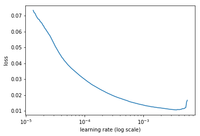

```
 lr=2e-3 
```

```
 learn.fit(lr, 1, cycle_len=1, use_clr_beta=(40,10)) 
```

```
 2%|▏ | 15/720 [00:02<01:52, 6.25it/s, loss=0.042]  epoch trn_loss val_loss  0 0.007431 0.008192 
```

```
 [array([0.00819])] 
```

```
 x,y = next(iter(md.val_dl))  preds = learn.model(VV(x)) 
```

Here is our input:

```
 idx=4  show_img(y,idx,normed= False ) 
```


And here is our output.

```
 show_img(preds,idx,normed= False ); 
```


And you can see that what we've managed to do is to train a very advanced residual convolutional network that's learnt to blue things. 这是为什么？ Well, because it's what we asked for. We said to minimize MSE loss. MSE loss between pixels really the best way to do that is just average the pixel ie to blur it. So that's why pixel loss is no good. So we want to use our perceptual loss.

```
 show_img(x,idx,normed= True ); 
```

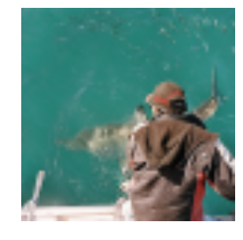

```
 x,y = next(iter(md.val_dl))  preds = learn.model(VV(x)) 
```

```
 show_img(y,idx,normed= False ) 
```


```
 show_img(preds,idx,normed= False ); 
```


```
 show_img(x,idx); 
```


#### Perceptual loss [50:57]

With perceptual loss, we are basically going to take our VGG network and just like we did last week, we are going to find the block index just before we get a maxpool.

```
 def icnr(x, scale=2, init=nn.init.kaiming_normal):  new_shape = [int(x.shape[0] / (scale ** 2))] + list(x.shape[1:])  subkernel = torch.zeros(new_shape)  subkernel = init(subkernel)  subkernel = subkernel.transpose(0, 1)  subkernel = subkernel.contiguous().view(subkernel.shape[0],  subkernel.shape[1], -1)  kernel = subkernel.repeat(1, 1, scale ** 2)  transposed_shape = [x.shape[1]] + [x.shape[0]] +  list(x.shape[2:])  kernel = kernel.contiguous().view(transposed_shape)  kernel = kernel.transpose(0, 1)  return kernel 
```

```
 m_vgg = vgg16( True )  blocks = [i-1 for i,o in enumerate(children(m_vgg))  if isinstance(o,nn.MaxPool2d)]  blocks, [m_vgg[i] for i in blocks] 
```

```
 ([5, 12, 22, 32, 42], 
 [ReLU(inplace), ReLU(inplace), ReLU(inplace), ReLU(inplace), ReLU(inplace)]) 
```

So here are the ends of each block of the same grid size. If we just print them out, as we'd expect, every one of those is a ReLU module and so in this case these last two blocks are less interesting to us. The grid size there is small enough, and course enough that it's not as useful for super resolution. So we are just going to use the first three. Just to save unnecessary computation, we are just going to use those first 23 layers of VGG and we'll throw away the rest. We'll stick it on the GPU. We are not going to be training this VGG model at all — we are just using it to compare activations. So we'll stick it in eval mode and we will set it to not trainable.

```
 vgg_layers = children(m_vgg)[:23]  m_vgg = nn.Sequential(*vgg_layers).cuda().eval()  set_trainable(m_vgg, False ) 
```

```
 def flatten(x): return x.view(x.size(0), -1) 
```

Just like last week, we will use `SaveFeatures` class to do a forward hook which saves the output activations at each of those layers [ [52:07](https://youtu.be/nG3tT31nPmQ%3Ft%3D52m7s) ].

```
 class SaveFeatures ():  features= None  def __init__(self, m):  self.hook = m.register_forward_hook(self.hook_fn)  def hook_fn(self, module, input, output): self.features = output  def remove(self): self.hook.remove() 
```

So now we have everything we need to create our perceptual loss or as I call it here `FeatureLoss` class. We are going to pass in a list of layer IDs, the layers where we want the content loss to be calculated, and a list of weights for each of those layers. We can go through each of those layer IDs and create an object which has the forward hook function to store the activations. So in our forward, then we can just go ahead and call the forward pass of our model with the target (high res image we are trying to create). The reason we do that is because that is going to then call that hook function and store in `self.sfs` (self dot save features) the activations we want. Now we are going to need to do that for our conv net output as well. So we need to clone these because otherwise the conv net output is going to go ahead and just clobber what I already had. So now we can do the same thing for the conv net output which is the input to the loss function. And so now we've got those two things we can zip them all together along with the weights so we've got inputs, targets, and weights. Then we can do the L1 loss between the inputs and the targets and multiply by the layer weights. The only other thing I do is I also grab the pixel loss, but I weight it down quite a bit. Most people don't do this. I haven't seen papers that do this, but in my opinion, it's maybe a little bit better because you've got the perceptual content loss activation stuff but the really finest level it also cares about the individual pixels. So that's our loss function.

```
 class FeatureLoss (nn.Module):  def __init__(self, m, layer_ids, layer_wgts):  super().__init__()  self.m,self.wgts = m,layer_wgts  self.sfs = [SaveFeatures(m[i]) for i in layer_ids]  def forward(self, input, target, sum_layers= True ):  self.m(VV(target.data))  res = [F.l1_loss(input,target)/100]  targ_feat = [V(o.features.data.clone()) for o in self.sfs]  self.m(input)  res += [F.l1_loss(flatten(inp.features),flatten(targ))*wgt  for inp,targ,wgt in zip(self.sfs, targ_feat,  self.wgts)]  if sum_layers: res = sum(res)  return res  def close(self):  for o in self.sfs: o.remove() 
```

We create our super resolution ResNet telling it how much to scale up by.

```
 m = SrResnet(64, scale) 
```

And then we are going to do our `icnr` initialization of that pixel shuffle convolution [ [54:27](https://youtu.be/nG3tT31nPmQ%3Ft%3D54m27s) ]. This is very boring code, I actually stole it from somebody else. Literally all it does is just say okay, you've got some weight tensor `x` that you want to initialize so we are going to treat it as if it has shape (ie number of features) divided by scale squared features in practice. So this might be 2² = 4 because we actually want to just keep one set of then and then copy them four times, so we divide it by four and we create something of that size and we initialize that with, by default, `kaiming_normal` initialization. Then we just make scale² copies of it. And the rest of it is just kind of moving axes around a little bit. So that's going to return a new weight matrix where each initialized sub kernel is repeated r² or `scale` ² times. So that details don't matter very much. All that matters here is that I just looked through to find what was the actual conv layer just before the pixel shuffle and store it away and then I called `icnr` on its weight matrix to get my new weight matrix. And then I copied that new weight matrix back into that layer.

```
 conv_shuffle = m.features[10][0][0]  kernel = icnr(conv_shuffle.weight, scale=scale)  conv_shuffle.weight.data.copy_(kernel); 
```

As you can see, I went to quite a lot of trouble in this exercise to really try to implement all the best practices [ [56:13](https://youtu.be/nG3tT31nPmQ%3Ft%3D56m13s) ]. I tend to do things a bit one extreme or the other. I show you a really hacky version that only slightly works or I go to the _n_ th degree to make it work really well. So this is a version where I'm claiming that this is pretty much a state of the art implementation. It's a competition winning or at least my re-implementation of a competition winning approach. The reason I'm doing that is because I think this is one of those rare papers where they actually get a lot of the details right and I want you to get a feel of what it feels like to get all the details right. Remember, getting the details right is the difference between the hideous blurry mess and the pretty exquisite result.

```
 m = to_gpu(m) 
```

```
 learn = Learner(md, SingleModel(m), opt_fn=optim.Adam) 
```

```
 t = torch.load(learn.get_model_path('sr-samp0'),  map_location= lambda storage, loc: storage)  learn.model.load_state_dict(t, strict= False ) 
```

```
 learn.freeze_to(999) 
```

```
 for i in range(10,13): set_trainable(m.features[i], True ) 
```

```
 conv_shuffle = m.features[10][2][0]  kernel = icnr(conv_shuffle.weight, scale=scale)  conv_shuffle.weight.data.copy_(kernel); 
```

So we are going do DataParallel on that again [ [57:14](https://youtu.be/nG3tT31nPmQ%3Ft%3D57m14s) ].

```
 m = nn.DataParallel(m, [0,2])  learn = Learner(md, SingleModel(m), opt_fn=optim.Adam) 
```

```
 learn.set_data(md) 
```

We are going to set our criterion to be FeatureLoss using our VGG model, grab the first few blocks and these are sets of layer weights that I found worked pretty well.

```
 learn.crit = FeatureLoss(m_vgg, blocks[:3], [0.2,0.7,0.1]) 
```

```
 lr=6e-3  wd=1e-7 
```

Do a learning rate finder.

```
 learn.lr_find(1e-4, 0.1, wds=wd, linear= True ) 
```

```
 1%| | 15/1801 [00:06<12:55, 2.30it/s, loss=0.0965]  12%|█▏ | 220/1801 [01:16<09:08, 2.88it/s, loss=0.42] 
```

```
 learn.sched.plot(n_skip_end=1) 
```


Fit it for a while

```
 learn.fit(lr, 1, cycle_len=2, wds=wd, use_clr=(20,10)) 
```

```
 epoch trn_loss val_loss  0 0.04523 0.042932  1 0.043574 0.041242 
```

```
 [array([0.04124])] 
```

```
 learn.save('sr-samp0') 
```

```
 learn.save('sr-samp1') 
```

And I fiddled around for a while trying to get some of these details right. But here is my favorite part of the paper is what happens next. Now that we've done it for scale equals 2 — progressive resizing. So progressive resizing is the trick that let us get the best best single computer result for ImageNet training on DAWN bench. It's this idea of starting small gradually making bigger. I only know of two papers that have used this idea. One is the progressive resizing of GANs paper which allows training a very high resolution GANs and the other one is the EDSR paper. And the cool thing about progressive resizing is not only are your earlier epochs, assuming you've got 2x2 smaller, four times faster. You can also make the batch size maybe 3 or 4 times bigger. But more importantly, they are going to generalize better because you are feeding in your model different sized images during training. So we were able to train half as many epochs for ImageNet as most people. Our epochs were faster and there were fewer of them. So progressive resizing is something that, particularly if you are training from scratch (I'm not so sure if it's useful for fine-tuning transfer learning, but if you are training from scratch), you probably want to do nearly all the time.

#### Progressive resizing [ [59:07](https://youtu.be/nG3tT31nPmQ%3Ft%3D59m7s) ]

So the next step is to go all the way back to the top and change to 4 scale, 32 batch size, restart. I saved the model before I do that.


Go back and that's why there's a little bit of fussing around in here with reloading because what I needed to do now is I needed to load my saved model back in.


But there's a slight issue which is I now have one more upsampling layer than I used to have to go from 2x2 to 4x4\. My loop here is now looping through twice, not once. Therefore, it's added an extra conv net and an extra pixel shuffle. So how am I going to load in weights for a different network?


The answer is that I use a very handy thing in PyTorch `load_state_dict` . This is what `lean.load` calls behind the scenes. If I pass this parameter `strict=False` then it says “okay, if you can't fill in all of the layers, just fill in the layers you can.” So after loading the model back in this way, we are going to end up with something where it's loaded in all the layers that it can and that one conv layer that's new is going to be randomly initialized.


Then I freeze all my layers and then unfreeze that upsampling part [ [1:00:45](https://youtu.be/nG3tT31nPmQ%3Ft%3D1h45s) ] Then use `icnr` on my newly added extra layer. Then I can go ahead and learn again. So then the rest is the same.

If you are trying to replicate this, don't just run this top to bottom. Realize it involves a bit of jumping around.

```
 learn.load('sr-samp1') 
```

```
 lr=3e-3 
```

```
 learn.fit(lr, 1, cycle_len=1, wds=wd, use_clr=(20,10)) 
```

```
 epoch trn_loss val_loss  0 0.069054 0.06638 
```

```
 [array([0.06638])] 
```

```
 learn.save('sr-samp2') 
```

```
 learn.unfreeze() 
```

```
 learn.load('sr-samp2') 
```

```
 learn.fit(lr/3, 1, cycle_len=1, wds=wd, use_clr=(20,10)) 
```

```
 epoch trn_loss val_loss  0 0.06042 0.057613 
```

```
 [array([0.05761])] 
```

```
 learn.save('sr1') 
```

```
 learn.sched.plot_loss() 
```


```
 def plot_ds_img(idx, ax= None , figsize=(7,7), normed= True ):  if ax is None : fig,ax = plt.subplots(figsize=figsize)  im = md.val_ds[idx][0]  if normed: im = denorm(im)[0]  else : im = np.rollaxis(to_np(im),0,3)  ax.imshow(im)  ax.axis('off') 
```

```
 fig,axes=plt.subplots(6,6,figsize=(20,20))  **for** i,ax **in** enumerate(axes.flat):  plot_ds_img(i+200,ax=ax, normed= True ) 
```

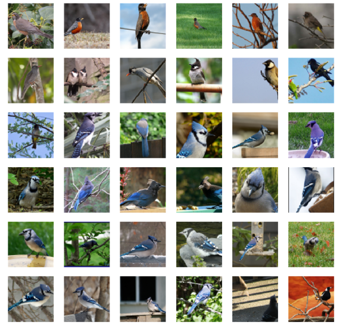

```
 x,y=md.val_ds[215] 
```

```
 y=y[ None ] 
```

```
 learn.model.eval()  preds = learn.model(VV(x[ None ]))  x.shape,y.shape,preds.shape 
```

```
 ((3, 72, 72), (1, 3, 288, 288), torch.Size([1, 3, 288, 288])) 
```

```
 learn.crit(preds, V(y), sum_layers= False ) 
```

```
 [Variable containing:  1.00000e-03 *  1.1935  [torch.cuda.FloatTensor of size 1 (GPU 0)], Variable containing:  1.00000e-03 *  8.5054  [torch.cuda.FloatTensor of size 1 (GPU 0)], Variable containing:  1.00000e-02 *  3.4656  [torch.cuda.FloatTensor of size 1 (GPU 0)], Variable containing:  1.00000e-03 *  3.8243  [torch.cuda.FloatTensor of size 1 (GPU 0)]] 
```

```
 learn.crit.close() 
```

The longer you train, the better it gets [ [1:01:18](https://youtu.be/nG3tT31nPmQ%3Ft%3D1h1m18s) ]. I ended up training it for about 10 hours, but you'll still get very good results much more quickly if you're less patient. So we can try it out and and here is the result. On the left is my pixelated bird and on the right is the upsampled version. It literally invented coloration. But it figured out what kind of bird it is, and it knows what these feathers are meant to look like. So it has imagined a set of feathers which are compatible with these exact pixels which is genius. Same for the back of its head. There is no way you can tell what these blue dots are meant to represent. But if you know that this kind of bird has an array of feathers here, you know that's what they must be. Then you can figure out whether the feathers would have to be such that when they were pixelated they would end up in these spots. So it literally reverse engineered given its knowledge of this exact species of bird, how it would have to have looked to create this output. This is so amazing. It also knows from all the signs around it that this area here (background) was almost certainly blurred out. So it actually reconstructed blurred vegetation. If it hadn't have done all of those things, it wouldn't have gotten such a good loss function. Because in the end, it had to match the activations saying “oh, there's a feather over here and it's kind of fluffy looking and it's in this direction” and all that.

```
 _,axes=plt.subplots(1,2,figsize=(14,7))  show_img(x[ None ], 0, ax=axes[0])  show_img(preds,0, normed= True , ax=axes[1]) 
```

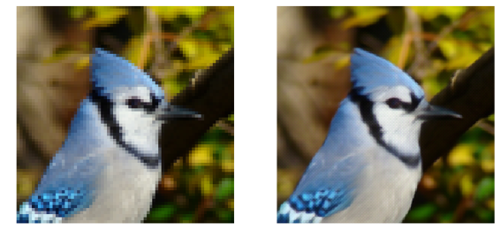

Well, that brings us to the end of super resolution [ [1:03:18](https://youtu.be/nG3tT31nPmQ%3Ft%3D1h3m18s) ]. Don't forget to check out the [ask Jeremy anything](http://forums.fast.ai/t/ask-jeremy-anything/15646/1) thread.

### Ask Jeremy Anything

**Question** : What are the future plans for fast.ai and this course? Will there be a part 3? If there is a part 3, I would really love to take it [ [1:04:11](https://youtu.be/nG3tT31nPmQ%3Ft%3D1h4m11s) ].

**Jeremy** : I'm not quite sure. It's always hard to guess. I hope there will be some kind of follow-up. Last year, after part 2, one of the students started up a weekly book club going through the Ian Goodfellow deep learning book, and Ian actually came in and presented quite a few of the chapters and there was somebody, an expert, who presented every chapter. That was a really cool part 3\. To a large extent, it will depend on you, the community, to come up with ideas and help make them happen, and I'm definitely keen to help. I've got a bunch of ideas but I'm nervous about saying them because I'm not sure which ones will happen and which ones won't. But the more support I have in making things happen that you want to happen from you, the more likely they are to happen.

**Question** : What was your experience like starting down the path of entrepreneurship? Have you always been an entrepreneur or did you start at a big company and transition to a startup? Did you go from academia to startups or startups to academia? [ [1:05:13](https://youtu.be/nG3tT31nPmQ%3Ft%3D1h5m13s) ]

**Jeremy** : No, I was definitely not an academia. I am totally a fake academic. I started at McKinsey and company which is a strategy firm when I was 18 which meant I couldn't really go to university so it didn't really turn up. Then spent 8 years in business helping really big companies on strategic questions. I always wanted to be an entrepreneur, planned to only spend two years in McKinsey, only thing I really regret in my life was not sticking to that plan and wasting eight years instead. So two years would have been perfect. But then I went into entrepreneurship, started two companies in Australia. The best part about that was that I didn't get any funding so all the money that I made was mine or the decisions were mine and my partner's. I focused entirely on profit and product and customer and service. Whereas I find in San Francisco, I'm glad I came here and so the two of us came here for Kaggle, Anthony and I, and raised ridiculous amount of money 11 million dollar for this really new company. That was really interesting but it's also really distracting trying to worry about scaling and VC's wanting to see what your business development plans are and also just not having any real need to actually make a profit. So I had a bit of the same problem at Enlitic where I again raised a lot of money 15 million dollars pretty quickly and a lot of distractions. I think trying to bootstrap your own company and focus on making money by selling something at a profit and then plowing that back into the company, it worked really well. Because within five years, we were making a profit from 3 months in and within 5 years, we were making enough for profit not just to pay all of us and our own wages but also to see my bank account growing and after 10 years sold it for a big chunk of money, not enough that a VC would be excited but enough that I didn't have to worry about money again. So I think bootstrapping a company is something which people in the Bay Area at least don't seem to appreciate how good of an idea that is.

**Question** : If you were 25 years old today and still know what you know where would you be looking to use AI? What are you working on right now or looking to work on in the next 2 years [ [1:08:10](https://youtu.be/nG3tT31nPmQ%3Ft%3D1h8m10s) ]?

**Jeremy** : You should ignore the last part of that. I won't even answer it. Doesn't matter where I'm looking. What you should do is leverage your knowledge about your domain. So one of the main reasons we do this is to get people who have backgrounds in recruiting, oil field surveys, journalism, activism, whatever and solve your problems. It'll be really obvious to you what real problems are and it will be really obvious to you what data you have and where to find it. Those are all the bits that for everybody else that's really hard. So people who start out with “oh, I know deep learning now I'll go and find something to apply it to” basically never succeed where else people who are like “oh, I've been spending 25 years doing specialized recruiting for legal firms and I know that the key issue is this thing and I know that this piece of data totally solves it and so I'm just going to do that now and I already know who to call or actually start selling it to”. They are the ones who tend to win. If you've done nothing but academic stuff, then it's more maybe about your hobbies and interests. So everybody has hobbies. The main thing I would say is please don't focus on building tools for data scientists to use or for software engineers to use because every data scientist knows about the market of data scientists whereas only you know about the market for analyzing oil survey world or understanding audiology studies or whatever it is that you do.

**Question** : Given what you've shown us about applying transfer learning from image recognition to NLP, there looks to be a lot of value in paying attention to all of the developments that happen across the whole ML field and that if you were to focus in one area you might miss out on some great advances in other concentrations. How do you stay aware of all of the advancements across the field while still having time to dig in deep to your specific domains [ [1:10:19](https://youtu.be/nG3tT31nPmQ%3Ft%3D1h10m19s) ]?

**Jeremy** : Yeah, that's awesome. I mean that's one of the key messages of this course. Lots of good work's being done in different places and people are so specialized and most people don't know about it. If I can get state of the art results in NLP within six months of starting to look at NLP and I think that says more about NLP than it does about me, frankly. It's kind of like the entrepreneurship thing. You pick the areas you see that you know about and kind of transfer stuff like “oh, we could use deep learning to solve this problem” or in this case, we could use this idea of computer vision to solve that problem. So things like transfer learning, I'm sure there's like a thousand opportunities for you to do in other field to do what Sebastian and I did in NLP with NLP classification. So the short answer to your question is the way to stay ahead of what's going on would be to follow my feed of Twitter favorites and my approach is to then follow lots and lots of people on Twitter and put them into the Twitter favorites for you. Literally, every time I come across something interesting, I click favorite. There are two reasons I do it. The first is that when the next course comes along, I go through my favorites to find which things I want to study. The second is so that you can do the same thing. And then which you go deep into, it almost doesn't matter. I find every time I look at something it turns out to be super interesting and important. So pick something which you feel like solving that problem would be actually useful for some reason and it doesn't seem to be very popular which is kind of the opposite of what everybody else does. Everybody else works on the problems which everybody else is already working on because they are the ones that seem popular. I can't quite understand this train of thinking but it seems to be very common.

**Question** : Is Deep Learning an overkill to use on Tabular data? When is it better to use DL instead of ML on tabular data [ [1:12:46](https://youtu.be/nG3tT31nPmQ%3Ft%3D1h12m46s) ]?

**Jeremy** : Is that a real question or did you just put that there so that I would point out that Rachel Thomas just wrote an article? [http://www.fast.ai/2018/04/29/categorical-embeddings/](http://www.fast.ai/2018/04/29/categorical-embeddings/)

So Rachel has just written about this and Rachel and I spent a long time talking about it and the short answer is we think it's great to use deep learning on tabular data. Actually, of all the rich complex important and interesting things that appear in Rachel's Twitter stream covering everything from the genocide of Rohingya through to latest ethics violations in AI companies, the one by far that got the most attention and engagement from the community was the question about is it called tabular data or structured data. So yeah, ask computer people how to name things and you'll get plenty of interest. There are some really good links here to stuff from Instacart and Pinterest and other folks who have done some good work in this area. Any of you that went to the Data Institute conference would have seen Jeremy Stanley's presentation about the really cool work they did at Instacart.

**Rachel** : I relied heavily on lessons 3 and 4 from part 1 in writing this post so much of that may be familiar to you.

**Jeremy** : Rachel asked me during the post like how to tell whether you should use the decision tree ensemble like GBM or random forest or neural net and my answer is I still don't know. Nobody I'm aware of has done that research in any particularly meaningful way. So there's a question to be answered there, I guess. My approach has been to try to make both of those things as accessible as possible through fast.ai library so you can try them both and see what works. That's what I do.

**Question** : Reinforcement Learning popularity has been on a gradual rise in the recent past. What's your take on Reinforcement Learning? Would fast.ai consider covering some ground in popular RL techniques in the future [ [1:15:21](https://youtu.be/nG3tT31nPmQ%3Ft%3D1h15m21s) ]?

**Jeremy** : I'm still not a believer in reinforcement learning. I think it's an interesting problem to solve but it's not at all clear that we have a good way of solving this problem. So the problem, it really is the delayed credit problem. So I want to learn to play pong, I've moved up or down and three minutes later I find out whether I won the game of pong — which actions I took were actually useful? So to me, the idea of calculating the gradients of the output with respect to those inputs, the credit is so delayed that those derivatives don't seem very interesting. I get this question quite regularly in every one of these four courses so far. I've always said the same thing. I'm rather pleased that finally recently there's been some results showing that actually basically random search often does better than reinforcement learning so basically what's happened is very well-funded companies with vast amounts of computational power throw all of it at reinforcement learning problems and get good results and people then say “oh it's because of the reinforcement learning” rather than the vast amounts of compute power. Or they use extremely thoughtful and clever algorithms like a combination of convolutional neural nets and Monte Carlo tree search like they did with the Alpha Go stuff to get great results and people incorrectly say “oh that's because of reinforcement learning” when it wasn't really reinforcement learning at all. So I'm very interested in solving these kind of more generic optimization type problems rather than just prediction problems and that's what these delayed credit problems tend to look like. But I don't think we've yet got good enough best practices that I have anything on, ready to teach and say I've got to teach you this thing because I think it's still going to be useful next year. So we'll keep watching and see what happens.

#### Super resolution network to a style transfer network [ [1:17:57](https://youtu.be/nG3tT31nPmQ%3Ft%3D1h17m57s) ]

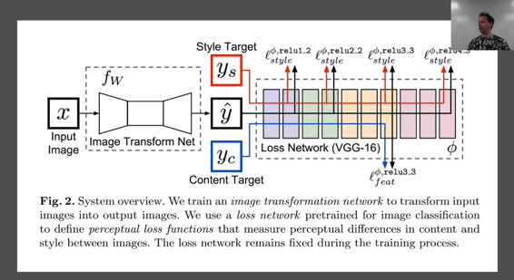

We are going to now turn the super resolution network into a style transfer network. And we'll do this pretty quickly. We basically already have something. _x_ is my input image and I'm going to have some loss function and I've got some neural net again. Instead of a neural net that does a whole a lot of compute and then does upsampling at the end, our input this time is just as big as our output. So we are going to do some downsampling first. Then our computer, and then our upsampling. So that's the first change we are going to make — we are going to add some downsampling so some stride 2 convolution layers to the front of our network. The second is rather than just comparing _yc_ and _x_ are the same thing here. So we are going to basically say our input image should look like itself by the end. Specifically we are going to compare it by chucking it through VGG and comparing it at one of the activation layers. And then its style should look like some painting which we'll do just like we did with the Gatys' approach by looking at the Gram matrix correspondence at a number of layers. So that's basically it. So that ought to be super straight forward. It's really combining two things we've already done.

#### Style transfer net [ [1:19:19](https://youtu.be/nG3tT31nPmQ%3Ft%3D1h19m19s) ]

[笔记本](https://github.com/fastai/fastai/blob/master/courses/dl2/style-transfer-net.ipynb)

So all this code starts identical, except we don't have high res and low res, we just have one size 256\.

```
 %matplotlib inline  %reload_ext autoreload  %autoreload 2 
```

```
 **from** **fastai.conv_learner** **import** *  from pathlib import Path  torch.cuda.set_device(0) 
```

```
 torch.backends.cudnn.benchmark= True 
```

```
 PATH = Path('data/imagenet')  PATH_TRN = PATH/'train' 
```

```
 fnames_full,label_arr_full,all_labels = folder_source(PATH, 'train')  fnames_full = ['/'.join(Path(fn).parts[-2:]) for fn in fnames_full]  list(zip(fnames_full[:5],label_arr_full[:5])) 
```

```
 [('n01440764/n01440764_9627.JPEG', 0), 
 ('n01440764/n01440764_9609.JPEG', 0), 
 ('n01440764/n01440764_5176.JPEG', 0), 
 ('n01440764/n01440764_6936.JPEG', 0), 
 ('n01440764/n01440764_4005.JPEG', 0)] 
```

```
 all_labels[:5] 
```

```
 ['n01440764', 'n01443537', 'n01484850', 'n01491361', 'n01494475'] 
```

```
 np.random.seed(42)  # keep_pct = 1.  # keep_pct = 0.01  keep_pct = 0.1  keeps = np.random.rand(len(fnames_full)) < keep_pct  fnames = np.array(fnames_full, copy= False )[keeps]  label_arr = np.array(label_arr_full, copy= False )[keeps] 
```

```
 arch = vgg16  # sz,bs = 96,32  sz,bs = 256,24  # sz,bs = 128,32 
```

```
 class MatchedFilesDataset (FilesDataset):  def __init__(self, fnames, y, transform, path):  self.y=y  assert (len(fnames)==len(y))  super().__init__(fnames, transform, path)  def get_y(self, i):  return open_image(os.path.join(self.path, self.y[i]))  def get_c(self): return 0 
```

```
 val_idxs = get_cv_idxs(len(fnames), val_pct=min(0.01/keep_pct, 0.1))  ((val_x,trn_x),(val_y,trn_y)) = split_by_idx(val_idxs,  np.array(fnames), np.array(fnames))  len(val_x),len(trn_x) 
```

```
 (12800, 115206) 
```

```
 img_fn = PATH/'train'/'n01558993'/'n01558993_9684.JPEG' 
```

```
 tfms = tfms_from_model(arch, sz, tfm_y=TfmType.PIXEL)  datasets = ImageData.get_ds(MatchedFilesDataset, (trn_x,trn_y),  (val_x,val_y), tfms, path=PATH_TRN)  md = ImageData(PATH, datasets, bs, num_workers=16, classes= None ) 
```

```
 denorm = md.val_ds.denorm 
```

```
 def show_img(ims, idx, figsize=(5,5), normed= True , ax= None ):  if ax is None : fig,ax = plt.subplots(figsize=figsize)  if normed: ims = denorm(ims)  else : ims = np.rollaxis(to_np(ims),1,4)  ax.imshow(np.clip(ims,0,1)[idx])  ax.axis('off') 
```

#### Model [ [1:19:30](https://youtu.be/nG3tT31nPmQ%3Ft%3D1h19m30s) ]

My model is the same. One thing I did here is I did not do any kind of fancy best practices for this one at all. Partly because there doesn't seem to be any. There's been very little follow up in this approach compared to the super resolution stuff. We'll talk about why in a moment. So you'll see, this is much more normal looking.

```
 def conv(ni, nf, kernel_size=3, stride=1, actn= True , pad= None ,  bn= True ):  if pad is None : pad = kernel_size//2  layers = [nn.Conv2d(ni, nf, kernel_size, stride=stride,  padding=pad, bias= not bn)]  if actn: layers.append(nn.ReLU(inplace= True ))  if bn: layers.append(nn.BatchNorm2d(nf))  return nn.Sequential(*layers) 
```

I've got batch norm layers. I don't have scaling factor here.

```
 class ResSequentialCenter (nn.Module):  def __init__(self, layers):  super().__init__()  self.m = nn.Sequential(*layers) 
```

```
 def forward(self, x): return x[:, :, 2:-2, 2:-2] + self.m(x) 
```

```
 def res_block(nf):  return ResSequentialCenter([conv(nf, nf, actn= True , pad=0),  conv(nf, nf, pad=0)]) 
```

I don't have a pixel shuffle — it's just using a normal upsampling followed by 1x1 conf. So it's just more normal.

```
 def upsample(ni, nf):  return nn.Sequential(nn.Upsample(scale_factor=2), conv(ni, nf)) 
```

One thing they mentioned in the paper is they had a lot of problems with zero padding creating artifacts and the way they solved that was by adding 40 pixel of reflection padding at the start. So I did the same thing and then they used zero padding in their convolutions in their Res blocks. Now if you've got zero padding in your convolutions in your Res blocks, then that means that the two parts of your ResNet won't add up anymore because you've lost a pixel from each side on each of your two convolutions. So my `ResSequential` has become `ResSequentialCenter` and I've removed the last 2 pixels on each side of those good cells. Other than that, this is basically the same as what we had before.

```
 class StyleResnet (nn.Module):  def __init__(self):  super().__init__()  features = [nn.ReflectionPad2d(40),  conv(3, 32, 9),  conv(32, 64, stride=2), conv(64, 128, stride=2)]  for i in range(5): features.append(res_block(128))  features += [upsample(128, 64), upsample(64, 32),  conv(32, 3, 9, actn= False )]  self.features = nn.Sequential(*features)  def forward(self, x): return self.features(x) 
```

#### Style Image [ [1:21:02](https://youtu.be/nG3tT31nPmQ%3Ft%3D1h21m2s) ]

So then we can bring in our starry night picture.

```
 style_fn = PATH/'style'/'starry_night.jpg'  style_img = open_image(style_fn)  style_img.shape 
```

```
 (1198, 1513, 3) 
```

```
 plt.imshow(style_img); 
```


```
 h,w,_ = style_img.shape  rat = max(sz/h,sz/h)  res = cv2.resize(style_img, (int(w*rat), int(h*rat)), interpolation=cv2.INTER_AREA)  resz_style = res[:sz,-sz:] 
```

We can resize it.

```
 plt.imshow(resz_style); 
```


We can throw it through our transformations

```
 style_tfm,_ = tfms[1](resz_style,resz_style) 
```

```
 style_tfm = np.broadcast_to(style_tfm[ None ], (bs,)+style_tfm.shape) 
```

Just to make the method a little bit easier for my brain to handle, I took our transform style image which after transformations of 3 x 256 x 256, and I made a mini batch. My batch size is 24 — 24 copies of it. It just maeks it a little bit easier to do the kind of batch arithmetic without worrying about some of the broadcasting. They are not really 24 copies. I used `np.broadcast` to basically fake 24 pieces.

```
 style_tfm.shape 
```

```
 (24, 3, 256, 256) 
```

#### Perceptual loss [ [1:21:51](https://youtu.be/nG3tT31nPmQ%3Ft%3D1h21m51s) ]

So just like before, we create a VGG, grab the last block. This time we are going to use all of these layers so we keep everything up to the 43rd layer.

```
 m_vgg = vgg16( True ) 
```

```
 blocks = [i-1 for i,o in enumerate(children(m_vgg))  if isinstance(o,nn.MaxPool2d)]  blocks, [m_vgg[i] for i in blocks[1:]] 
```

```
 ([5, 12, 22, 32, 42], 
 [ReLU(inplace), ReLU(inplace), ReLU(inplace), ReLU(inplace)]) 
```

```
 vgg_layers = children(m_vgg)[:43]  m_vgg = nn.Sequential(*vgg_layers).cuda().eval()  set_trainable(m_vgg, False ) 
```

```
 def flatten(x): return x.view(x.size(0), -1) 
```

```
 class SaveFeatures ():  features= None  def __init__(self, m):  self.hook = m.register_forward_hook(self.hook_fn)  def hook_fn(self, module, input, output): self.features = output  def remove(self): self.hook.remove() 
```

```
 def ct_loss(input, target): return F.mse_loss(input,target) 
```

```
 def gram(input):  b,c,h,w = input.size()  x = input.view(b, c, -1)  return torch.bmm(x, x.transpose(1,2))/(c*h*w)*1e6 
```

```
 def gram_loss(input, target):  return F.mse_loss(gram(input), gram(target[:input.size(0)])) 
```

So now our combined loss is going to add together a content loss for the third block plus the Gram loss for all of our blocks with different weights. Again, going back to everything being as normal as possible, I've gone back to using MSE above. Basically what happened was I had a lot of trouble getting this to train properly. So I gradually removed trick after trick and eventually just went “ok, I'm just gonna make it as bland as possible”.

Last week's Gram matrix was wrong, by the way [ [1:22:37](https://youtu.be/nG3tT31nPmQ%3Ft%3D1h22m37s) ]. It only worked for a batch size of one and we only had a batch size of one so that was fine. I was using matrix multiply which meant that every batch was being compared to every other batch. You actually need to use batch matrix multiple ( `torch.bmm` ) which does a matrix multiply per batch. So that's something to be aware of there.

```
 class CombinedLoss (nn.Module):  def __init__(self, m, layer_ids, style_im, ct_wgt, style_wgts):  super().__init__()  self.m,self.ct_wgt,self.style_wgts = m,ct_wgt,style_wgts  self.sfs = [SaveFeatures(m[i]) for i in layer_ids]  m(VV(style_im))  self.style_feat = [V(o.features.data.clone())  for o in self.sfs] 
```

```
 def forward(self, input, target, sum_layers= True ):  self.m(VV(target.data))  targ_feat = self.sfs[2].features.data.clone()  self.m(input)  inp_feat = [o.features for o in self.sfs]  res = [ct_loss(inp_feat[2],V(targ_feat)) * self.ct_wgt]  res += [gram_loss(inp,targ)*wgt for inp,targ,wgt  in zip(inp_feat, self.style_feat, self.style_wgts)]  if sum_layers: res = sum(res)  return res  def close(self):  for o in self.sfs: o.remove() 
```

So I've got Gram matrices, I do my MSE loss between the Gram matrices, I weight them by style weights, so I create that ResNet.

```
 m = StyleResnet()  m = to_gpu(m) 
```

```
 learn = Learner(md, SingleModel(m), opt_fn=optim.Adam) 
```

I create my combined loss passing in the VGG network, passing in the block IDs, passing in the transformed starry night image, and you'll see the the very start here, I do a forward pass through my VGG model with that starry night image in order that I can save the features for it. Notice, it's really important now that I don't do any data augmentation because I've saved the style features for a particular non-augmented version. So if I augmented it, it might make some minor problems. But that's fine because I've got all of ImageNet to deal with. I don't really need to do data augmentation anyway.

```
 learn.crit = CombinedLoss(m_vgg, blocks[1:], style_tfm, 1e4,  [0.025,0.275,5.,0.2]) 
```

```
 wd=1e-7 
```

```
 learn.lr_find(wds=wd)  learn.sched.plot(n_skip_end=1) 
```

```
 1%|▏ | 7/482 [00:04<05:32, 1.43it/s, loss=2.48e+04]  53%|█████▎ | 254/482 [02:27<02:12, 1.73it/s, loss=1.13e+12] 
```


```
 lr=5e-3 
```

So I've got my loss function and I can go ahead and fit [ [1:24:06](https://youtu.be/nG3tT31nPmQ%3Ft%3D1h24m6s) ]. And there is nothing clever here at all.

```
 learn.fit(lr, 1, cycle_len=1, wds=wd, use_clr=(20,10)) 
```

```
 epoch trn_loss val_loss  0 105.351372 105.833994 
```

```
 [array([105.83399])] 
```

```
 learn.save('style-2') 
```

```
 x,y=md.val_ds[201] 
```

```
 learn.model.eval()  preds = learn.model(VV(x[ None ]))  x.shape,y.shape,preds.shape 
```

```
 ((3, 256, 256), (3, 256, 256), torch.Size([1, 3, 256, 256])) 
```

At the end, I have my `sum_layers=False` so I can see what each part looks like and see they are balanced. And I can finally pop it out

```
 learn.crit(preds, VV(y[ None ]), sum_layers= False ) 
```

```
 [Variable containing: 
 53.2221 
 [torch.cuda.FloatTensor of size 1 (GPU 0)], Variable containing: 
 3.8336 
 [torch.cuda.FloatTensor of size 1 (GPU 0)], Variable containing: 
 4.0612 
 [torch.cuda.FloatTensor of size 1 (GPU 0)], Variable containing: 
 5.0639 
 [torch.cuda.FloatTensor of size 1 (GPU 0)], Variable containing: 
 53.0019 
 [torch.cuda.FloatTensor of size 1 (GPU 0)]] 
```

```
 learn.crit.close() 
```

```
 _,axes=plt.subplots(1,2,figsize=(14,7))  show_img(x[ None ], 0, ax=axes[0])  show_img(preds, 0, ax=axes[1]) 
```


So I mentioned that should be pretty easy and yet it took me about 4 days because I just found this incredibly fiddly to actually get it to work [ [1:24:26](https://youtu.be/nG3tT31nPmQ%3Ft%3D1h24m26s) ]. So when I finally got up in the morning I said to Rachel “guess what, it trained correctly.” Rachel said “I never thought that was going to happen.” It just looked awful all the time and it's really about getting the exact right mix of content loss and a style loss and the mix of the layers of the style loss. The worst part was it takes a really long time to train the darn CNN and I didn't really know how long to train it before I decided it wasn't doing well. Should I just train it for longer? And I don't know all the little details didn't seem to slightly change it but just it would totally fall apart all the time. So I kind of mentioned this partly to say just remember the final answer you see here is after me driving myself crazy all week of nearly always not working until finally the last minute it finally does. Even for things which just seemed like they couldn't possibly be difficult because that is combining two things we already have working. The other is to be careful about how we interpret what authors claim.


It was so fiddly getting this style transfer to work [ [1:26:10](https://youtu.be/nG3tT31nPmQ%3Ft%3D1h26m10s) ]. After doing it, it left me thinking why did I bother because now I've got something that takes hours to create a network that can turn any kind of photo into one specific style. It just seems very unlikely I would want that for anything. The only reason I could think that being useful would be to do some art-y stuff on a video where I wanted to turn every frame into some style. It's incredibly niche thing to want to do. But when I looked at the paper, the table is saying “oh, we are a thousand times faster than the Gatys' approach which is just such an obviously meaningless thing to say. Such an incredibly misleading thing to say because it ignores all the hours of training for each individual style and I find this frustrating because groups like this Stanford group clearly know better or ought to know better, but still I guess the academic community encourages people to make these ridiculously grand claims. It also completely ignores this incredibly sensitive fiddly training process so this paper was just so well accepted when it came out. I remember everybody getting on Twitter and saying “wow, you know these Stanford people have found this way of doing style transfer a thousand times faster.” And clearly people saying this were top researchers in the field, clearly none of them actually understood it because nobody said “I don't see why this is remotely useful, and also I tried it and it was incredibly fiddly to get it all to work.” It's not until 18 months later I finally coming back to it and kind of thinking like “wait a minute, this is kind of stupid.” So this is the answer, I think, to the question of why haven't people done follow ups on this to create really amazing best practices and better approaches like with a super resolution part of the paper. And I think the answer is because it's dumb. So I think super resolution part of the paper is clearly not dumb. And it's been improved and improved and now we have great super resolution. And I think we can derive from that great noise reduction, great colorization, great slant removal, great interactive artifact removal, etc. So I think there's a lot of really cool techniques here. It's also leveraging a lot of stuff that we've been learning and getting better and better at.

### Segmentation [ [1:29:13](https://youtu.be/nG3tT31nPmQ%3Ft%3D1h29m13s) ]

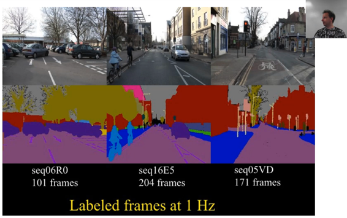

Finally, let's talk about segmentation. This is from the famous CamVid dataset which is a classic example of an academic segmentation dataset. Basically you can see what we do is we start with a picture (they are actually video frames in this dataset) and we have some labels where they are not actually colors — each one has an ID and the IDs are mapped to colors. So red might be 1, purple might be 2, light pink might be 3 and so all the buildings are one class, all the cars are another class, all the people are another class, all the road is another class, and so on. So what we are actually doing here is multi-class classification for every pixel. You can see, sometimes that multi-class classification really is quite tricky — like these branches. Although, sometimes the labels are really not that great. This is very coarse as you can see. So that's what we are going to do.

We are going to do segmentation and so it's a lot like bounding boxes. But rather than just finding a box around each thing, we are actually going to label every single pixel with its class. Really, it's actually a lot easier because it fits our CNN style so nicely that we can create any CNN where the output is an N by M grid containing the integers from 0 to C where there are C categories. And then we can use cross-entropy loss with a softmax activation and we are done. I could actually stop the class there and you can go and use exactly the same approaches you've learnt in lesson 1 and 2 and you'll get a perfectly okay result. So the first thing to say is this is not actually a terribly hard thing to do. But we are going to try and do it really well.

#### Doing it the simple way [ [1:31:26](https://youtu.be/nG3tT31nPmQ%3Ft%3D1h31m26s) ]

[笔记本](https://github.com/fastai/fastai/blob/master/courses/dl2/carvana.ipynb)

Let's start by doing it the really simple way. And we are going to use Kaggle [Carvana](https://www.kaggle.com/c/carvana-image-masking-challenge) competition and you can download it with Kaggle API as usual.

```
 %matplotlib inline  %reload_ext autoreload  %autoreload 2 
```

```
 **from** **fastai.conv_learner** **import** *  **from** **fastai.dataset** **import** *  from pathlib import Path  import json 
```

#### Setup

There is a train folder containing bunch of images which is the independent variable and a train_masks folder there's the dependent variable and they look like below.

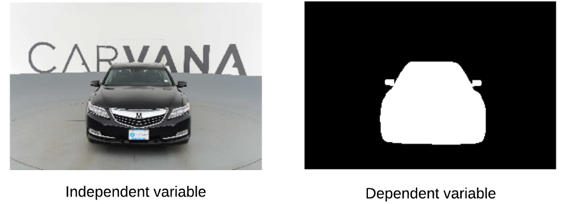

In this case, just like cats and dogs, we are going simple rather than doing multi-class classification, we are going to do binary classification. But of course multi-class is just the more general version — categorical cross entropy or binary class entropy. There is no differences conceptually, so the dependent variable is just zeros and ones, where else the independent variable is a regular image.

In order to do this well, it would really help to know what cars look like. Because really what we want to do is to figure out this is a car and its orientation and put white pixels where we expect the car to be based on the picture and their understanding of what cars look like.

```
 PATH = Path('data/carvana')  list(PATH.iterdir()) 
```

```
 [PosixPath('data/carvana/train_masks.csv'), 
 PosixPath('data/carvana/train_masks-128'), 
 PosixPath('data/carvana/sample_submission.csv'), 
 PosixPath('data/carvana/train_masks_png'), 
 PosixPath('data/carvana/train.csv'), 
 PosixPath('data/carvana/train-128'), 
 PosixPath('data/carvana/train'), 
 PosixPath('data/carvana/metadata.csv'), 
 PosixPath('data/carvana/tmp'), 
 PosixPath('data/carvana/models'), 
 PosixPath('data/carvana/train_masks')] 
```

```
 MASKS_FN = 'train_masks.csv'  META_FN = 'metadata.csv'  TRAIN_DN = 'train'  MASKS_DN = 'train_masks' 
```

```
 masks_csv = pd.read_csv(PATH/MASKS_FN)  masks_csv.head() 
```


The original dataset came with these CSV files as well [ [1:32:44](https://youtu.be/nG3tT31nPmQ%3Ft%3D1h32m44s) ]. I don't really use them for very much other than getting the list of images from them.

```
 meta_csv = pd.read_csv(PATH/META_FN)  meta_csv.head() 
```


```
 def show_img(im, figsize= None , ax= None , alpha= None ):  if not ax: fig,ax = plt.subplots(figsize=figsize)  ax.imshow(im, alpha=alpha)  ax.set_axis_off()  return ax 
```

```
 CAR_ID = '00087a6bd4dc' 
```

```
 list((PATH/TRAIN_DN).iterdir())[:5] 
```

```
 [PosixPath('data/carvana/train/5ab34f0e3ea5_15.jpg'),  PosixPath('data/carvana/train/de3ca5ec1e59_07.jpg'),  PosixPath('data/carvana/train/28d9a149cb02_13.jpg'),  PosixPath('data/carvana/train/36a3f7f77e85_12.jpg'),  PosixPath('data/carvana/train/843763f47895_08.jpg')] 
```

```
 Image.open(PATH/TRAIN_DN/f' {CAR_ID} _01.jpg').resize((300,200)) 
```


```
 list((PATH/MASKS_DN).iterdir())[:5] 
```

```
 [PosixPath('data/carvana/train_masks/6c0cd487abcd_03_mask.gif'),  PosixPath('data/carvana/train_masks/351c583eabd6_01_mask.gif'),  PosixPath('data/carvana/train_masks/90fdd8932877_02_mask.gif'),  PosixPath('data/carvana/train_masks/28d9a149cb02_10_mask.gif'),  PosixPath('data/carvana/train_masks/88bc32b9e1d9_14_mask.gif')] 
```

```
 Image.open(PATH/MASKS_DN/f' {CAR_ID} _01_mask.gif').resize((300,200)) 
```


Each image after the car ID has a 01, 02, etc of which I've printed out all 16 of them for one car and as you can see basically those numbers are the 16 orientations of one car [ [1:32:58](https://youtu.be/nG3tT31nPmQ%3Ft%3D1h32m58s) ]. I don't think anybody in this competition actually used these orientation information. I believe they all kept the car's images just treated them separately.

```
 ims = [open_image(PATH/TRAIN_DN/f' {CAR_ID} _{i+1:02d}.jpg')  for i in range(16)] 
```

```
 fig, axes = plt.subplots(4, 4, figsize=(9, 6))  for i,ax in enumerate(axes.flat): show_img(ims[i], ax=ax)  plt.tight_layout(pad=0.1) 
```

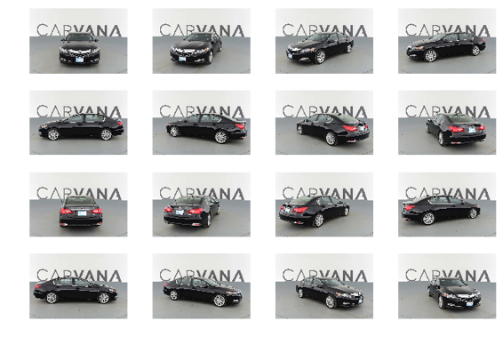

#### Resize and convert [ [1:33:27](https://youtu.be/nG3tT31nPmQ%3Ft%3D1h33m27s) ]

These images are pretty big — over 1000 by 1000 in size and just opening the JPEGs and resizing them is slow. So I processed them all. Also OpenCV can't handle GIF files so I converted them.

**Question** : How would somebody get these masks for training initially? [Mechanical turk](https://www.mturk.com/) or something [ [1:33:48](https://youtu.be/nG3tT31nPmQ%3Ft%3D1h33m48s) ]? Yeah, just a lot of boring work. Probably there are some tools that help you with a bit of edge snapping so that the human can do it roughly and then just fine tune the bits it gets wrong. These kinds of labels are expensive. So one of the things I really want to work on is deep learning enhanced interactive labeling tools because that's clearly something that would help a lot of people.

I've got a little section here that you can run if you want to. You probably want to. It converts the GIFs into PNGs so just open int up with PIL and then save it as PNG because OpenCV doesn't have GIF support. As per usual for this kind of stuff, I do it with a ThreadPool so I can take advantage of parallel processing. And then also create a separate directory `train-128` and `train_masks-128` which contains the 128 by 128 resized versions of them.

This is the kind of stuff that keeps you sane if you do it early in the process. So anytime you get a new dataset, seriously think about creating a smaller version to make life fast. Anytime you find yourself waiting on your computer, try and think of a way to create a smaller version.

```
 (PATH/'train_masks_png').mkdir(exist_ok= True ) 
```

```
 def convert_img(fn):  fn = fn.name  Image.open(PATH/'train_masks'/fn).save(PATH/'train_masks_png'/  f' {fn[:-4]} .png') 
```

```
 files = list((PATH/'train_masks').iterdir())  with ThreadPoolExecutor(8) as e: e.map(convert_img, files) 
```

```
 (PATH/'train_masks-128').mkdir(exist_ok= True ) 
```

```
 def resize_mask(fn):  Image.open(fn).resize((128,128)).save((fn.parent.parent)  /'train_masks-128'/fn.name)  files = list((PATH/'train_masks_png').iterdir())  with ThreadPoolExecutor(8) as e: e.map(resize_img, files) 
```

```
 (PATH/'train-128').mkdir(exist_ok= True ) 
```

```
 def resize_img(fn):  Image.open(fn).resize((128,128)).save((fn.parent.parent)  /'train-128'/fn.name)  files = list((PATH/'train').iterdir())  with ThreadPoolExecutor(8) as e: e.map(resize_img, files) 
```

So after you grab it from Kaggle, you probably want to run this stuff, go away, have lunch, come back and when you are done, you'll have these smaller directories which we are going to use below 128 by 128 to start with.

#### Dataset [ [1:35:33](https://youtu.be/nG3tT31nPmQ%3Ft%3D1h35m33s) ]

```
 TRAIN_DN = 'train-128'  MASKS_DN = 'train_masks-128'  sz = 128  bs = 64 
```

```
 ims = [open_image(PATH/TRAIN_DN  /f' {CAR_ID} _{i+1:02d}.jpg') for i in range(16)]  im_masks = [open_image(PATH/MASKS_DN  /f' {CAR_ID} _{i+1:02d}_mask.png') for i in range(16)] 
```

So here is a cool trick. If you use the same axis object ( `ax` ) to plot an image twice and the second time you use alpha which you might know means transparency in the computer vision world, then you can actually plot the mask over the top of the photo. So here is a nice way to see all the masks on top of the photos for all of the cars in one group.

```
 fig, axes = plt.subplots(4, 4, figsize=(9, 6))  **for** i,ax **in** enumerate(axes.flat):  ax = show_img(ims[i], ax=ax)  show_img(im_masks[i][...,0], ax=ax, alpha=0.5)  plt.tight_layout(pad=0.1) 
```


This is the same MatchedFilesDataset we've seen twice already. This is all the same code. Here is something important though. If we had something that was in the training set the one on the left, and then the validation had the image on the right, that would be kind of cheating because it's the same car.


```
 class MatchedFilesDataset (FilesDataset):  def __init__(self, fnames, y, transform, path):  self.y=y  assert (len(fnames)==len(y))  super().__init__(fnames, transform, path)  def get_y(self, i):  return open_image(os.path.join(self.path, self.y[i]))  def get_c(self): return 0 
```

```
 x_names = np.array([Path(TRAIN_DN)/o for o in masks_csv['img']])  y_names = np.array([Path(MASKS_DN)/f' {o[:-4]} _mask.png'  for o in masks_csv['img']]) 
```

```
 len(x_names)//16//5*16 
```

```
 _1008_ 
```

So we use a continuous set of car IDs and since each set is a set of 16, we make sure that's evenly divisible by 16\. So we make sure that our validation set contains different car IDs to our training set. This is the kind of stuff which you've got to be careful of. On Kaggle, it's not so bad — you'll know about it because you'll submit your result and you'll get a very different result on your leaderboard compared to your validation set. But in the real world. you won't know until you put it in production and send your company bankrupt and lose your job. So you might want to think carefully about your validation set in that case.

```
 val_idxs = list(range(1008))  ((val_x,trn_x),(val_y,trn_y)) = split_by_idx(val_idxs, x_names,  y_names)  len(val_x),len(trn_x) 
```

```
 (1008, 4080) 
```

Here we are going to use transform type classification ( `TfmType.CLASS` ) [ [1:37:03](https://youtu.be/nG3tT31nPmQ%3Ft%3D1h37m3s) ]. It's basically the same as transform type pixel ( `TfmType.PIXEL` ) but if you think about it, with a pixel version if we rotate a little bit then we probably want to average the pixels in between the two, but the classification, obviously we don't. We use nearest neighbor. So there's slight difference there. Also for classification, lighting doesn't kick in, normalization doesn't kick in to the dependent variable.

```
 aug_tfms = [RandomRotate(4, tfm_y=TfmType.CLASS),  RandomFlip(tfm_y=TfmType.CLASS),  RandomLighting(0.05, 0.05)]  # aug_tfms = [] 
```

They are already square images, so we don't have to do any cropping.

```
 tfms = tfms_from_model(resnet34, sz, crop_type=CropType.NO, tfm_y=TfmType.CLASS, aug_tfms=aug_tfms)  datasets = ImageData.get_ds(MatchedFilesDataset, (trn_x,trn_y), (val_x,val_y), tfms, path=PATH)  md = ImageData(PATH, datasets, bs, num_workers=8, classes= None ) 
```

```
 denorm = md.trn_ds.denorm  x,y = next(iter(md.aug_dl))  x = denorm(x) 
```

So here you can see different versions of the augmented images — they are moving around a bit, and they are rotating a bit, and so forth.

```
 fig, axes = plt.subplots(5, 6, figsize=(12, 10))  **for** i,ax **in** enumerate(axes.flat):  ax=show_img(x[i], ax=ax)  show_img(y[i], ax=ax, alpha=0.5)  plt.tight_layout(pad=0.1) 
```


I get a lot of questions during our study group about how do I debug things and fix things that aren't working. I never have a great answer other than every time I fix a problem is because of stuff like this that I do all the time. I just always print out everything as I go and then the one thing that I screw up always turns out to be the one thing that I forgot to check along the way. The more of this kind of thing you can do the better. If you are not looking at all of your intermediate results, you are going to have troubles.

#### Model [ [1:38:30](https://youtu.be/nG3tT31nPmQ%3Ft%3D1h38m30s) ]

```
 class Empty (nn.Module):  def forward(self,x): return x  models = ConvnetBuilder(resnet34, 0, 0, 0, custom_head=Empty())  learn = ConvLearner(md, models)  learn.summary() 
```

```
 class StdUpsample (nn.Module):  def __init__(self, nin, nout):  super().__init__()  self.conv = nn.ConvTranspose2d(nin, nout, 2, stride=2)  self.bn = nn.BatchNorm2d(nout)  def forward(self, x): return self.bn(F.relu(self.conv(x))) 
```

```
 flatten_channel = Lambda( lambda x: x[:,0]) 
```

```
 simple_up = nn.Sequential(  nn.ReLU(),  StdUpsample(512,256),  StdUpsample(256,256),  StdUpsample(256,256),  StdUpsample(256,256),  nn.ConvTranspose2d(256, 1, 2, stride=2),  flatten_channel  ) 
```

Given that we want something that knows what cars look like, we probably want to start with a pre-trained ImageNet network. So we are going to start with ResNet34\. With `ConvnetBuilder` , we can grab our ResNet34 and we can add a custom head. The custom head is going to be something that upsamples a bunch of times and we are going to do things really dumb for now which is we're just going to do a ConvTranspose2d, batch norm, ReLU.

This is what I am saying — any of you could have built this without looking at any of this notebook or at least you have the information from previous classes. There is nothing new at all. So at the very end, we have a single filter. Now that's going to give us something which is batch size by 1 by 128 by 128\. But we want something which is batch size by 128 by 128\. So we have to remove that unit axis so I've got a lambda layer here. Lambda layers are incredibly helpful because without the lambda layer here, which is simply removing that unit axis by just indexing it with a 0, without a lambda layer, I would have to have created a custom class with a custom forward method and so forth. But by creating a lambda layer that does the one custom bit, I can now just chuck it in the Sequential and so that makes life easier.

PyTorch people are kind of snooty about this approach. Lambda layer is actually something that's a part of the fastai library not part of the PyTorch library. And literally people on PyTorch discussion board say “yes, we could give people this”, “yes it is only a single line of code” but they never encourage them to use sequential too often. So there you go.

So this is our custom head [ [1:40:36](https://youtu.be/nG3tT31nPmQ%3Ft%3D1h40m36s) ]. So we are going to have a ResNet 34 that goes downsample and then a really simple custom head that very quickly upsamples, and that hopefully will do something. And we are going to use accuracy with a threshold of 0.5 and print out metrics.

```
 models = ConvnetBuilder(resnet34, 0, 0, 0, custom_head=simple_up)  learn = ConvLearner(md, models)  learn.opt_fn=optim.Adam  learn.crit=nn.BCEWithLogitsLoss()  learn.metrics=[accuracy_thresh(0.5)] 
```

```
 learn.lr_find()  learn.sched.plot() 
```

```
 94%|█████████▍| 30/32 [00:05<00:00, 5.48it/s, loss=10.6] 
```

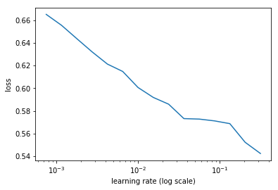

```
 lr=4e-2 
```

```
 learn.fit(lr,1,cycle_len=5,use_clr=(20,5)) 
```

```
 epoch trn_loss val_loss <lambda> 
 0 0.124078 0.133566 0.945951 
 1 0.111241 0.112318 0.954912 
 2 0.099743 0.09817 0.957507 
 3 0.090651 0.092375 0.958117 
 4 0.084031 0.086026 0.963243 
```

```
 [0.086025625, 0.96324310824275017] 
```

After a few epochs, we've got 96 percent accurate. Is that good [ [1:40:56](https://youtu.be/nG3tT31nPmQ%3Ft%3D1h40m56s) ]? Is 96% accurate good? And hopefully the answer to that question is it depends. What's it for? The answer is Carvana wanted this because they wanted to be able to take their car image and cut them out and paste them on exotic Monte Carlo backgrounds or whatever (that's Monte Carlo the place and not the simulation). To do that, you you need a really good mask. You don't want to leave the rearview mirrors behind, have one wheel missing, or include a little bit of background or something. That would look stupid. So you would need something very good. So only having 96% of the pixels correct doesn't sound great. But we won't really know until we look at it. So let's look at it.

```
 learn.save('tmp') 
```

```
 learn.load('tmp') 
```

```
 py,ay = learn.predict_with_targs() 
```

```
 ay.shape 
```

```
 (1008, 128, 128) 
```

So there is the correct version that we want to cut out [ [1:41:54](https://youtu.be/nG3tT31nPmQ%3Ft%3D1h41m54s) ]

```
 show_img(ay[0]); 
```


That's the 96% accurate version. So when you look at it you realize “oh yeah, getting 96% of the pixel accurate is actually easy because all the outside bit is not car, and all the inside bit is a car, and really interesting bit is the edge. So we need to do better.

```
 show_img(py[0]>0); 
```


Let's unfreeze because all we've done so far is train the custom head. Let's do more.

```
 learn.unfreeze() 
```

```
 learn.bn_freeze( True ) 
```

```
 lrs = np.array([lr/100,lr/10,lr])/4 
```

```
 learn.fit(lrs,1,cycle_len=20,use_clr=(20,10)) 
```

```
 epoch trn_loss val_loss <lambda> 
 0 0.06577 0.053292 0.972977 
 1 0.049475 0.043025 0.982559 
 2 0.039146 0.035927 0.98337 
 3 0.03405 0.031903 0.986982 
 4 0.029788 0.029065 0.987944 
 5 0.027374 0.027752 0.988029 
 6 0.026041 0.026718 0.988226 
 7 0.024302 0.025927 0.989512 
 8 0.022921 0.026102 0.988276 
 9 0.021944 0.024714 0.989537 
 10 0.021135 0.0241 0.990628 
 11 0.020494 0.023367 0.990652 
 12 0.01988 0.022961 0.990989 
 13 0.019241 0.022498 0.991014 
 14 0.018697 0.022492 0.990571 
 15 0.01812 0.021771 0.99105 
 16 0.017597 0.02183 0.991365 
 17 0.017192 0.021434 0.991364 
 18 0.016768 0.021383 0.991643 
 19 0.016418 0.021114 0.99173 
```

```
 [0.021113895, 0.99172959849238396] 
```

After a bit more, we've got 99.1%. Is that good? 我不知道。 让我们来看看。

```
 learn.save('0') 
```

```
 x,y = next(iter(md.val_dl))  py = to_np(learn.model(V(x))) 
```

其实没有。 It's totally missed the rearview vision mirror on the left and missed a lot of it on the right. And it's clearly got an edge wrong on the bottom. And these things are totally going to matter when we try to cut it out, so it's still not good enough.

```
 ax = show_img(denorm(x)[0])  show_img(py[0]>0, ax=ax, alpha=0.5); 
```


```
 ax = show_img(denorm(x)[0])  show_img(y[0], ax=ax, alpha=0.5); 
```


#### 512x512 [ [1:42:50](https://youtu.be/nG3tT31nPmQ%3Ft%3D1h42m50s) ]

Let's try upscaling. And the nice thing is that when we upscale to 512 by 512, (make sure you decrease the batch size because you'll run out of memory), it's quite a lot more information there for it to go on so our accuracy increases to 99.4% and things keep getting better.

```
 TRAIN_DN = 'train'  MASKS_DN = 'train_masks_png'  sz = 512  bs = 16 
```

```
 x_names = np.array([Path(TRAIN_DN)/o for o in masks_csv['img']])  y_names = np.array([Path(MASKS_DN)/f' {o[:-4]} _mask.png'  for o in masks_csv['img']]) 
```

```
 ((val_x,trn_x),(val_y,trn_y)) = split_by_idx(val_idxs, x_names,  y_names)  len(val_x),len(trn_x) 
```

```
 (1008, 4080) 
```

```
 tfms = tfms_from_model(resnet34, sz, crop_type=CropType.NO,  tfm_y=TfmType.CLASS, aug_tfms=aug_tfms)  datasets = ImageData.get_ds(MatchedFilesDataset, (trn_x,trn_y),  (val_x,val_y), tfms, path=PATH)  md = ImageData(PATH, datasets, bs, num_workers=8, classes= None ) 
```

```
 denorm = md.trn_ds.denorm  x,y = next(iter(md.aug_dl))  x = denorm(x) 
```

Here is the true ones.

```
 fig, axes = plt.subplots(4, 4, figsize=(10, 10))  **for** i,ax **in** enumerate(axes.flat):  ax=show_img(x[i], ax=ax)  show_img(y[i], ax=ax, alpha=0.5)  plt.tight_layout(pad=0.1) 
```


```
 simple_up = nn.Sequential(  nn.ReLU(),  StdUpsample(512,256),  StdUpsample(256,256),  StdUpsample(256,256),  StdUpsample(256,256),  nn.ConvTranspose2d(256, 1, 2, stride=2),  flatten_channel  ) 
```

```
 models = ConvnetBuilder(resnet34, 0, 0, 0, custom_head=simple_up)  learn = ConvLearner(md, models)  learn.opt_fn=optim.Adam  learn.crit=nn.BCEWithLogitsLoss()  learn.metrics=[accuracy_thresh(0.5)] 
```

```
 learn.load('0') 
```

```
 learn.lr_find()  learn.sched.plot() 
```

```
 85%|████████▌ | 218/255 [02:12<00:22, 1.64it/s, loss=8.91] 
```


```
 lr=4e-2 
```

```
 learn.fit(lr,1,cycle_len=5,use_clr=(20,5)) 
```

```
 epoch trn_loss val_loss <lambda>  0 0.02178 0.020653 0.991708  1 0.017927 0.020653 0.990241  2 0.015958 0.016115 0.993394  3 0.015172 0.015143 0.993696  4 0.014315 0.014679 0.99388 
```

```
 [0.014679321, 0.99388032489352751] 
```

```
 learn.save('tmp') 
```

```
 learn.load('tmp') 
```

```
 learn.unfreeze()  learn.bn_freeze( True ) 
```

```
 lrs = np.array([lr/100,lr/10,lr])/4 
```

```
 learn.fit(lrs,1,cycle_len=8,use_clr=(20,8)) 
```

```
 epoch trn_loss val_loss mask_acc  0 0.038687 0.018685 0.992782  1 0.024906 0.014355 0.994933  2 0.025055 0.014737 0.995526  3 0.024155 0.014083 0.995708  4 0.013446 0.010564 0.996166  5 0.01607 0.010555 0.996096  6 0.019197 0.010883 0.99621  7 0.016157 0.00998 0.996393 
```

```
 [0.0099797687, 0.99639255659920833] 
```

```
 learn.save('512') 
```

```
 x,y = next(iter(md.val_dl))  py = to_np(learn.model(V(x))) 
```

```
 ax = show_img(denorm(x)[0])  show_img(py[0]>0, ax=ax, alpha=0.5); 
```


```
 ax = show_img(denorm(x)[0])  show_img(y[0], ax=ax, alpha=0.5); 
```


Things keep getting better but we've still got quite a few little black blocky bits. so let's go to 1024 by 1024\.

#### 1024x1024 [ [1:43:17](https://youtu.be/nG3tT31nPmQ%3Ft%3D1h43m17s) ]

So let's go to 1024 by 1024, batch size down to 4\. This is pretty high res now, and train a bit more, 99.6, 99.8%!

```
 sz = 1024  bs = 4 
```

```
 tfms = tfms_from_model(resnet34, sz, crop_type=CropType.NO,  tfm_y=TfmType.CLASS, aug_tfms=aug_tfms)  datasets = ImageData.get_ds(MatchedFilesDataset, (trn_x,trn_y),  (val_x,val_y), tfms, path=PATH)  md = ImageData(PATH, datasets, bs, num_workers=8, classes= None ) 
```

```
 denorm = md.trn_ds.denorm  x,y = next(iter(md.aug_dl))  x = denorm(x)  y = to_np(y) 
```

```
 fig, axes = plt.subplots(2, 2, figsize=(8, 8))  **for** i,ax **in** enumerate(axes.flat):  show_img(x[i], ax=ax)  show_img(y[i], ax=ax, alpha=0.5)  plt.tight_layout(pad=0.1) 
```

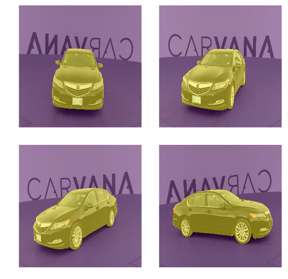

```
 simple_up = nn.Sequential(  nn.ReLU(),  StdUpsample(512,256),  StdUpsample(256,256),  StdUpsample(256,256),  StdUpsample(256,256),  nn.ConvTranspose2d(256, 1, 2, stride=2),  flatten_channel,  ) 
```

```
 models = ConvnetBuilder(resnet34, 0, 0, 0, custom_head=simple_up)  learn = ConvLearner(md, models)  learn.opt_fn=optim.Adam  learn.crit=nn.BCEWithLogitsLoss()  learn.metrics=[accuracy_thresh(0.5)] 
```

```
 learn.load('512') 
```

```
 learn.lr_find()  learn.sched.plot() 
```

```
 85%|████████▌ | 218/255 [02:12<00:22, 1.64it/s, loss=8.91] 
```


```
 lr=4e-2 
```

```
 learn.fit(lr,1,cycle_len=2,use_clr=(20,4)) 
```

```
 epoch trn_loss val_loss <lambda> 
 0 0.01066 0.011119 0.996227 
 1 0.009357 0.009696 0.996553 
```

```
 [0.0096957013, 0.99655332546385511] 
```

```
 learn.save('tmp') 
```

```
 learn.load('tmp') 
```

```
 learn.unfreeze()  learn.bn_freeze( True ) 
```

```
 lrs = np.array([lr/100,lr/10,lr])/8 
```

```
 learn.fit(lrs,1,cycle_len=40,use_clr=(20,10)) 
```

```
 epoch trn_loss val_loss mask_acc 
 0 0.015565 0.007449 0.997661 
 1 0.01979 0.008376 0.997542 
 2 0.014874 0.007826 0.997736 
 3 0.016104 0.007854 0.997347 
 4 0.023386 0.009745 0.997218 
 5 0.018972 0.008453 0.997588 
 6 0.013184 0.007612 0.997588 
 7 0.010686 0.006775 0.997688 
 8 0.0293 0.015299 0.995782 
 9 0.018713 0.00763 0.997638 
 10 0.015432 0.006575 0.9978 
 11 0.110205 0.060062 0.979043 
 12 0.014374 0.007753 0.997451 
 13 0.022286 0.010282 0.997587 
 14 0.015645 0.00739 0.997776 
 15 0.013821 0.00692 0.997869 
 16 0.022389 0.008632 0.997696 
 17 0.014607 0.00677 0.997837 
 18 0.018748 0.008194 0.997657 
 19 0.016447 0.007237 0.997899 
 20 0.023596 0.008211 0.997918 
 21 0.015721 0.00674 0.997848 
 22 0.01572 0.006415 0.998006 
 23 0.019519 0.007591 0.997876 
 24 0.011159 0.005998 0.998053 
 25 0.010291 0.005806 0.998012 
 26 0.010893 0.005755 0.998046 
 27 0.014534 0.006313 0.997901 
 28 0.020971 0.006855 0.998018 
 29 0.014074 0.006107 0.998053 
 30 0.01782 0.006561 0.998114 
 31 0.01742 0.006414 0.997942 
 32 0.016829 0.006514 0.9981 
 33 0.013148 0.005819 0.998033 
 34 0.023495 0.006261 0.997856 
 35 0.010931 0.005516 0.99812 
 36 0.015798 0.006176 0.998126 
 37 0.021636 0.005931 0.998067 
 38 0.012133 0.005496 0.998158 
 39 0.012562 0.005678 0.998172 
```

```
 [0.0056782686, 0.99817223208291195] 
```

```
 learn.save('1024') 
```

```
 x,y = next(iter(md.val_dl))  py = to_np(learn.model(V(x))) 
```

```
 ax = show_img(denorm(x)[0])  show_img(py[0][0]>0, ax=ax, alpha=0.5); 
```


```
 ax = show_img(denorm(x)[0])  show_img(y[0,...,-1], ax=ax, alpha=0.5); 
```


```
 show_img(py[0][0]>0); 
```

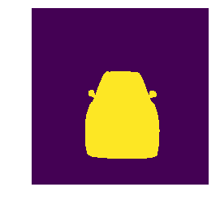

```
 show_img(y[0,...,-1]); 
```


Now if we look at the masks, , they are actually looking not bad. That's looking pretty good. So can we do better? And the answer is yes, we can.

### U-Net [ [1:43:45](https://youtu.be/nG3tT31nPmQ%3Ft%3D1h43m45s) ]

[Notebook](https://github.com/fastai/fastai/blob/master/courses/dl2/carvana-unet.ipynb) / [Paper](https://arxiv.org/abs/1505.04597)

U-Net network is quite magnificent. With that previous approach, our pre-trained ImageNet network was being squished down all the way down to 7x7 and then expand it out all the way back up to 224x224 (1024 gets squished down to quite a bit bigger than 7x7). And then expanded out again all this way which means it has to somehow store all the information about the much bigger version in the small version. And actually most of the information about the bigger version was really in the original picture anyway. So it doesn't seem like a great approach — this squishing and un-squishing.

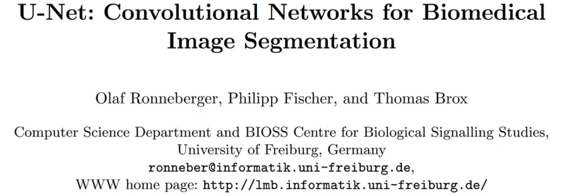

So the U-Net idea comes from this fantastic paper where it was literally invented in this very domain-specific area of biomedical image segmentation. But in fact, basically every Kaggle winner in anything even vaguely related to segmentation has end up using U-Net. It's one of these things that everybody in Kaggle knows it is the best practice, but in more of academic circles, this has been around for a couple of years at least, a lot of people still don't realize this is by far the best approach.


Here is the basic idea [ [1:45:10](https://youtu.be/nG3tT31nPmQ%3Ft%3D1h45m10s) ]. On the left is the downward path where we start at 572x572 in this case then halve the grid size 4 times, then on the right is the upward path where we double the grid size 4 times. But the thing that we also do is, at every point where we halve the grid size, we actually copy those activations over to the upward path and concatenate them together.

You can see on the bottom right, these red arrows are max pooling operation, these green arrows are upward sampling, and then these gray arrows are copying. So we copy and concat. In other words, the input image after a couple of convs is copied over to the output, concatenated together, and so now we get to use all of the informations gone through all of the informations gone through all the down and all the up, plus also a slightly modified version of the input pixels. And slightly modified version of one thing down from the input pixels because they came up through here. So we have all of the richness of going all the way down and up, but also a slightly less coarse version and a slightly less coarse version and then the really simple version, and they can all be combined together. So that's U-Net. It's such a cool idea.

Here we are in the carvana-unet notebook. All this is the same code as before.

```
 %matplotlib inline  %reload_ext autoreload  %autoreload 2 
```

```
 **from** **fastai.conv_learner** **import** *  **from** **fastai.dataset** **import** *  from fastai.models.resnet import vgg_resnet50  import json 
```

```
 torch.backends.cudnn.benchmark= True 
```

### 数据

```
 PATH = Path('data/carvana')  MASKS_FN = 'train_masks.csv'  META_FN = 'metadata.csv'  masks_csv = pd.read_csv(PATH/MASKS_FN)  meta_csv = pd.read_csv(PATH/META_FN) 
```

```
 def show_img(im, figsize= None , ax= None , alpha= None ):  if not ax: fig,ax = plt.subplots(figsize=figsize)  ax.imshow(im, alpha=alpha)  ax.set_axis_off()  return ax 
```

```
 TRAIN_DN = 'train-128'  MASKS_DN = 'train_masks-128'  sz = 128  bs = 64  nw = 16 
```

```
 TRAIN_DN = 'train'  MASKS_DN = 'train_masks_png'  sz = 128  bs = 64  nw = 16 
```

```
 class MatchedFilesDataset (FilesDataset):  def __init__(self, fnames, y, transform, path):  self.y=y  assert (len(fnames)==len(y))  super().__init__(fnames, transform, path)  def get_y(self, i):  return open_image(os.path.join(self.path, self.y[i]))  def get_c(self): return 0 
```

```
 x_names = np.array([Path(TRAIN_DN)/o for o in masks_csv['img']])  y_names = np.array([Path(MASKS_DN)/f' {o[:-4]} _mask.png'  for o in masks_csv['img']]) 
```

```
 val_idxs = list(range(1008))  ((val_x,trn_x),(val_y,trn_y)) = split_by_idx(val_idxs, x_names,  y_names) 
```

```
 aug_tfms = [RandomRotate(4, tfm_y=TfmType.CLASS),  RandomFlip(tfm_y=TfmType.CLASS),  RandomLighting(0.05, 0.05, tfm_y=TfmType.CLASS)] 
```

```
 tfms = tfms_from_model(resnet34, sz, crop_type=CropType.NO,  tfm_y=TfmType.CLASS, aug_tfms=aug_tfms)  datasets = ImageData.get_ds(MatchedFilesDataset, (trn_x,trn_y),  (val_x,val_y), tfms, path=PATH)  md = ImageData(PATH, datasets, bs, num_workers=16, classes= None )  denorm = md.trn_ds.denorm 
```

```
 x,y = next(iter(md.trn_dl)) 
```

```
 x.shape,y.shape 
```

```
 (torch.Size([64, 3, 128, 128]), torch.Size([64, 128, 128])) 
```

### Simple upsample

And at the start, I've got a simple upsample version just to show you again the non U-net version. This time, I'm going to add in something called the dice metric. Dice is very similar, as you see, to Jaccard or I over U. It's just a minor difference. It's basically intersection over union with a minor tweak. The reason we are going to use dice is that's the metric that Kaggle competition used and it's a little bit harder to get a high dice score than a high accuracy because it's really looking at what the overlap of the correct pixels are with your pixels. But it's pretty similar.

So in the Kaggle competition, people that were doing okay were getting about 99.6 dice and the winners were about 99.7 dice.

```
 f = resnet34  cut,lr_cut = model_meta[f] 
```

```
 def get_base():  layers = cut_model(f( True ), cut)  return nn.Sequential(*layers) 
```

```
 def dice(pred, targs):  pred = (pred>0).float()  return 2\. * (pred*targs).sum() / (pred+targs).sum() 
```

Here is our standard upsample.

```
 class StdUpsample (nn.Module):  def __init__(self, nin, nout):  super().__init__()  self.conv = nn.ConvTranspose2d(nin, nout, 2, stride=2)  self.bn = nn.BatchNorm2d(nout)  def forward(self, x): return self.bn(F.relu(self.conv(x))) 
```

This all as before.

```
 class Upsample34 (nn.Module):  def __init__(self, rn):  super().__init__()  self.rn = rn  self.features = nn.Sequential(  rn, nn.ReLU(),  StdUpsample(512,256),  StdUpsample(256,256),  StdUpsample(256,256),  StdUpsample(256,256),  nn.ConvTranspose2d(256, 1, 2, stride=2))  def forward(self,x): return self.features(x)[:,0] 
```

```
 class UpsampleModel ():  def __init__(self,model,name='upsample'):  self.model,self.name = model,name  def get_layer_groups(self, precompute):  lgs = list(split_by_idxs(children(self.model.rn), [lr_cut]))  return lgs + [children(self.model.features)[1:]] 
```

```
 m_base = get_base() 
```

```
 m = to_gpu(Upsample34(m_base))  models = UpsampleModel(m) 
```

```
 learn = ConvLearner(md, models)  learn.opt_fn=optim.Adam  learn.crit=nn.BCEWithLogitsLoss()  learn.metrics=[accuracy_thresh(0.5),dice] 
```

```
 learn.freeze_to(1) 
```

```
 learn.lr_find()  learn.sched.plot() 
```

```
 86%|█████████████████████████████████████████████████████████████ | 55/64 [00:22<00:03, 2.46it/s, loss=3.21] 
```

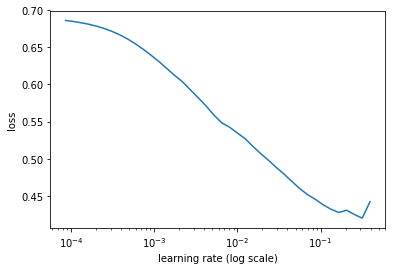

```
 lr=4e-2  wd=1e-7  lrs = np.array([lr/100,lr/10,lr])/2 
```

```
 learn.fit(lr,1, wds=wd, cycle_len=4,use_clr=(20,8)) 
```

```
 0%| | 0/64 [00:00<?, ?it/s]  epoch trn_loss val_loss <lambda> dice  0 0.216882 0.133512 0.938017 0.855221  1 0.169544 0.115158 0.946518 0.878381  2 0.153114 0.099104 0.957748 0.903353  3 0.144105 0.093337 0.964404 0.915084 
```

```
 [0.09333742126112893, 0.9644036065964472, 0.9150839788573129] 
```

```
 learn.save('tmp') 
```

```
 learn.load('tmp') 
```

```
 learn.unfreeze()  learn.bn_freeze( True ) 
```

```
 learn.fit(lrs,1,cycle_len=4,use_clr=(20,8)) 
```

```
 epoch trn_loss val_loss <lambda> dice  0 0.174897 0.061603 0.976321 0.94382  1 0.122911 0.053625 0.982206 0.957624  2 0.106837 0.046653 0.985577 0.965792  3 0.099075 0.042291 0.986519 0.968925 
```

```
 [0.042291240323157536, 0.986519161670927, 0.9689251193924556] 
```

Now we can check our dice metric [ [1:48:00](https://youtu.be/nG3tT31nPmQ%3Ft%3D1h48m) ]. So you can see on dice metric, we are getting around 96.8 at 128x128\. So that's not great.

```
 learn.save('128') 
```

```
 x,y = next(iter(md.val_dl))  py = to_np(learn.model(V(x))) 
```

```
 show_img(py[0]>0); 
```


```
 show_img(y[0]); 
```


#### U-net (ish) [ [1:48:16](https://youtu.be/nG3tT31nPmQ%3Ft%3D1h48m16s) ]

So let's try U-Net. I'm calling it U-net(ish) because as per usual I'm creating my own somewhat hacky version — trying to keep things as similar to what you're used to as possible and doing things that I think makes sense. So there should be plenty of opportunity for you to at least make this more authentically U-net by looking at the exact grid sizes and see how here (the top left convs) the size is going down a little bit. So they are obviously not adding any padding and then there are some cropping going on — there's a few differences. But one of the things is because I want to take advantage of transfer learning — that means I can't quite use U-Net.

So here is another big opportunity is what if you create the U-Net down path and then add a classifier on the end and then train that on ImageNet. You've now got an ImageNet trained classifier which is specifically designed to be a good backbone for U-Net. Then you should be able to now come back and get pretty closed to winning this old competition (it's actually not that old — it's fairly recent competition). Because that pre-trained network didn't exist before. But if you think about what YOLO v3 did, it's basically that. They created a DarkNet, they pre-trained it on ImageNet, and then they used it as the basis for their bounding boxes. So again, this idea of pre-training things which are designed not just for classification but designed for other things — it's just something that nobody has done yet. But as we've shown, you can train ImageNet for $25 in three hours now. And if people in the community are interested in doing this, hopefully I'll have credits I can help you with as well so if you do, the work to get it set up and give me a script, I can probably run it for you. For now though, we don't have that yet. So we are going to use ResNet.

```
 class SaveFeatures ():  features= None  def __init__(self, m):  self.hook = m.register_forward_hook(self.hook_fn)  def hook_fn(self, module, input, output): self.features = output  def remove(self): self.hook.remove() 
```

So we are basically going to start with `get_base` [ [1:50:37](https://youtu.be/nG3tT31nPmQ%3Ft%3D1h50m37s) ]. Base is our base network and that was defined back up in the first section.


So get_base is going to be something that calls whatever f is and `f` is `resnet34` . So we are going to grab our ResNet34 and cut_model is the first thing that our convnet builder does. It basically removes everything from the adaptive pooling onwards, so that gives us back the backbone of ResNet34\. So `get_base` is going to give us back the ResNet34 backbone.

```
 class UnetBlock (nn.Module):  def __init__(self, up_in, x_in, n_out):  super().__init__()  up_out = x_out = n_out//2  self.x_conv = nn.Conv2d(x_in, x_out, 1)  self.tr_conv = nn.ConvTranspose2d(up_in, up_out, 2,  stride=2)  self.bn = nn.BatchNorm2d(n_out)  def forward(self, up_p, x_p):  up_p = self.tr_conv(up_p)  x_p = self.x_conv(x_p)  cat_p = torch.cat([up_p,x_p], dim=1)  return self.bn(F.relu(cat_p)) 
```

```
 class Unet34 (nn.Module):  def __init__(self, rn):  super().__init__()  self.rn = rn  self.sfs = [SaveFeatures(rn[i]) for i in [2,4,5,6]]  self.up1 = UnetBlock(512,256,256)  self.up2 = UnetBlock(256,128,256)  self.up3 = UnetBlock(256,64,256)  self.up4 = UnetBlock(256,64,256)  self.up5 = nn.ConvTranspose2d(256, 1, 2, stride=2)  def forward(self,x):  x = F.relu(self.rn(x))  x = self.up1(x, self.sfs[3].features)  x = self.up2(x, self.sfs[2].features)  x = self.up3(x, self.sfs[1].features)  x = self.up4(x, self.sfs[0].features)  x = self.up5(x)  return x[:,0]  def close(self):  for sf in self.sfs: sf.remove() 
```

```
 class UnetModel ():  def __init__(self,model,name='unet'):  self.model,self.name = model,name  def get_layer_groups(self, precompute):  lgs = list(split_by_idxs(children(self.model.rn), [lr_cut]))  return lgs + [children(self.model)[1:]] 
```

Then we are going to take that ResNet34 backbone and turn it into a, I call it a, Unet34 [ [1:51:17](https://youtu.be/nG3tT31nPmQ%3Ft%3D1h51m17s) ]. So what that's going to do is it's going to save that ResNet that we passed in and then we are going to use a forward hook just like before to save the results at the 2nd, 4th, 5th, and 6th blocks which as before is the layers before each stride 2 convolution. Then we are going to create a bunch of these things we are calling `UnetBlock` . We need to tell `UnetBlock` how many things are coming from the previous layer we are upsampling, how many are coming across, and then how many do we want to come out. The amount coming across is entirely defined by whatever the base network was — whatever the downward path was, we need that many layers. So this is a little bit awkward. Actually one of our master's students here, Kerem, has actually created something called DynamicUnet that you'll find in [fastai.model.DynamicUnet](https://github.com/fastai/fastai/blob/d3ef60a96cddf5b503361ed4c95d68dda4a873fc/fastai/models/unet.py) and it actually calculates this all for you and automatically creates the whole Unet from your base model. It's got some minor quirks still that I want to fix. By the time the video is out, it'll definitely be working and I will at least have a notebook showing how to use it and possibly an additional video. But for now you'll just have to go through and do it yourself. You can easily see it just by, once you've got a ResNet, you can just type in its name and it'll print out the layers. And you can see how many many activations there are in each block. Or you can have it printed out for you for each block automatically. Anyway, I just did this manually.


So the UnetBlock works like this [ [1:53:29](https://youtu.be/nG3tT31nPmQ%3Ft%3D1h53m29s) ]:

*   `up_in` : This many are coming up from the previous layer
*   `x_in` : This many are coming across (hence `x` ) from the downward path
*   `n_out` : The amount we want coming out

Now what I do is , I then say, okay we're going to create a certain amount of convolutions from the upward path and a certain amount from the cross path, and so I'm going to be concatenating them together so let's divide the number we want out by 2\. And so we are going to have our cross convolution take our cross path and create number out divided by 2 ( `n_out//2` ). And then the upward path is going to be a `ConvTranspose2d` because we want to increase/upsample. Again here, we've got the number out divided by 2 ( `up_out` ), then at the end, I just concatenate those together.

So I've got an upward sample, I've got a cross convolution, I can concatenate the two together. That's all a UnetBlock is. So that's actually a pretty easy module to create.

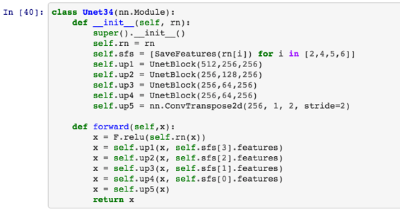

Then in my forward path, I need to pass to the forward of the UnetBlock the upward path and the cross path [ [1:54:40](https://youtu.be/nG3tT31nPmQ%3Ft%3D1h54m40s) ]. The upward path is just whatever I am up to so far. But then the cross path is whatever the activations are that I stored on the way down. So as I come up, it's the last set of saved features that I need first. And as I gradually keep going up farther and farther, eventually it's the first set of features.

There are some more tricks we can do to make this a little bit better, but this is a good stuff. So the simple upsampling approach looked horrible and had a dice of .968\. A Unet with everything else identical except we've now got these UnetBlocks has a dice of …

```
 m_base = get_base()  m = to_gpu(Unet34(m_base))  models = UnetModel(m) 
```

```
 learn = ConvLearner(md, models)  learn.opt_fn=optim.Adam  learn.crit=nn.BCEWithLogitsLoss()  learn.metrics=[accuracy_thresh(0.5),dice] 
```

```
 learn.summary() 
```

```
 OrderedDict([('Conv2d-1',  OrderedDict([('input_shape', [-1, 3, 128, 128]),  ('output_shape', [-1, 64, 64, 64]),  ('trainable', False),  ('nb_params', 9408)])),  ('BatchNorm2d-2',  OrderedDict([('input_shape', [-1, 64, 64, 64]),  ('output_shape', [-1, 64, 64, 64]),  ('trainable', False),  ('nb_params', 128)])),  ('ReLU-3',  OrderedDict([('input_shape', [-1, 64, 64, 64]),  ('output_shape', [-1, 64, 64, 64]),  ('nb_params', 0)])),  ('MaxPool2d-4',  OrderedDict([('input_shape', [-1, 64, 64, 64]),  ('output_shape', [-1, 64, 32, 32]),  ('nb_params', 0)])),  ('Conv2d-5',  OrderedDict([('input_shape', [-1, 64, 32, 32]),  ('output_shape', [-1, 64, 32, 32]),  ('trainable', False),  ('nb_params', 36864)])),  ('BatchNorm2d-6',  OrderedDict([('input_shape', [-1, 64, 32, 32]),  ('output_shape', [-1, 64, 32, 32]),  ('trainable', False),  ('nb_params', 128)])),  ('ReLU-7',  OrderedDict([('input_shape', [-1, 64, 32, 32]),  ('output_shape', [-1, 64, 32, 32]),  ('nb_params', 0)])),  ('Conv2d-8',  OrderedDict([('input_shape', [-1, 64, 32, 32]),  ('output_shape', [-1, 64, 32, 32]),  ('trainable', False),  ('nb_params', 36864)])),  ('BatchNorm2d-9',  OrderedDict([('input_shape', [-1, 64, 32, 32]),  ('output_shape', [-1, 64, 32, 32]),  ('trainable', False),  ('nb_params', 128)])),  ('ReLU-10',  OrderedDict([('input_shape', [-1, 64, 32, 32]),  ('output_shape', [-1, 64, 32, 32]),  ('nb_params', 0)])),  ('BasicBlock-11',  OrderedDict([('input_shape', [-1, 64, 32, 32]),  ('output_shape', [-1, 64, 32, 32]),  ('nb_params', 0)])),  ('Conv2d-12',  OrderedDict([('input_shape', [-1, 64, 32, 32]),  ('output_shape', [-1, 64, 32, 32]),  ('trainable', False),  ('nb_params', 36864)])),  ('BatchNorm2d-13',  OrderedDict([('input_shape', [-1, 64, 32, 32]),  ('output_shape', [-1, 64, 32, 32]),  ('trainable', False),  ('nb_params', 128)])),  ('ReLU-14',  OrderedDict([('input_shape', [-1, 64, 32, 32]),  ('output_shape', [-1, 64, 32, 32]),  ('nb_params', 0)])),  ('Conv2d-15',  OrderedDict([('input_shape', [-1, 64, 32, 32]),  ('output_shape', [-1, 64, 32, 32]),  ('trainable', False),  ('nb_params', 36864)])),  ('BatchNorm2d-16',  OrderedDict([('input_shape', [-1, 64, 32, 32]),  ('output_shape', [-1, 64, 32, 32]),  ('trainable', False),  ('nb_params', 128)])),  ('ReLU-17',  OrderedDict([('input_shape', [-1, 64, 32, 32]),  ('output_shape', [-1, 64, 32, 32]),  ('nb_params', 0)])),  ('BasicBlock-18',  OrderedDict([('input_shape', [-1, 64, 32, 32]),  ('output_shape', [-1, 64, 32, 32]),  ('nb_params', 0)])),  ('Conv2d-19',  OrderedDict([('input_shape', [-1, 64, 32, 32]),  ('output_shape', [-1, 64, 32, 32]),  ('trainable', False),  ('nb_params', 36864)])),  ('BatchNorm2d-20',  OrderedDict([('input_shape', [-1, 64, 32, 32]),  ('output_shape', [-1, 64, 32, 32]),  ('trainable', False),  ('nb_params', 128)])),  ('ReLU-21',  OrderedDict([('input_shape', [-1, 64, 32, 32]),  ('output_shape', [-1, 64, 32, 32]),  ('nb_params', 0)])),  ('Conv2d-22',  OrderedDict([('input_shape', [-1, 64, 32, 32]),  ('output_shape', [-1, 64, 32, 32]),  ('trainable', False),  ('nb_params', 36864)])),  ('BatchNorm2d-23',  OrderedDict([('input_shape', [-1, 64, 32, 32]),  ('output_shape', [-1, 64, 32, 32]),  ('trainable', False),  ('nb_params', 128)])),  ('ReLU-24',  OrderedDict([('input_shape', [-1, 64, 32, 32]),  ('output_shape', [-1, 64, 32, 32]),  ('nb_params', 0)])),  ('BasicBlock-25',  OrderedDict([('input_shape', [-1, 64, 32, 32]),  ('output_shape', [-1, 64, 32, 32]),  ('nb_params', 0)])),  ('Conv2d-26',  OrderedDict([('input_shape', [-1, 64, 32, 32]),  ('output_shape', [-1, 128, 16, 16]),  ('trainable', False),  ('nb_params', 73728)])),  ('BatchNorm2d-27',  OrderedDict([('input_shape', [-1, 128, 16, 16]),  ('output_shape', [-1, 128, 16, 16]),  ('trainable', False),  ('nb_params', 256)])),  ('ReLU-28',  OrderedDict([('input_shape', [-1, 128, 16, 16]),  ('output_shape', [-1, 128, 16, 16]),  ('nb_params', 0)])),  ('Conv2d-29',  OrderedDict([('input_shape', [-1, 128, 16, 16]),  ('output_shape', [-1, 128, 16, 16]),  ('trainable', False),  ('nb_params', 147456)])),  ('BatchNorm2d-30',  OrderedDict([('input_shape', [-1, 128, 16, 16]),  ('output_shape', [-1, 128, 16, 16]),  ('trainable', False),  ('nb_params', 256)])),  ('Conv2d-31',  OrderedDict([('input_shape', [-1, 64, 32, 32]),  ('output_shape', [-1, 128, 16, 16]),  ('trainable', False),  ('nb_params', 8192)])),  ('BatchNorm2d-32',  OrderedDict([('input_shape', [-1, 128, 16, 16]),  ('output_shape', [-1, 128, 16, 16]),  ('trainable', False),  ('nb_params', 256)])),  ('ReLU-33',  OrderedDict([('input_shape', [-1, 128, 16, 16]),  ('output_shape', [-1, 128, 16, 16]),  ('nb_params', 0)])),  ('BasicBlock-34',  OrderedDict([('input_shape', [-1, 64, 32, 32]),  ('output_shape', [-1, 128, 16, 16]),  ('nb_params', 0)])),  ('Conv2d-35',  OrderedDict([('input_shape', [-1, 128, 16, 16]),  ('output_shape', [-1, 128, 16, 16]),  ('trainable', False),  ('nb_params', 147456)])),  ('BatchNorm2d-36',  OrderedDict([('input_shape', [-1, 128, 16, 16]),  ('output_shape', [-1, 128, 16, 16]),  ('trainable', False),  ('nb_params', 256)])),  ('ReLU-37',  OrderedDict([('input_shape', [-1, 128, 16, 16]),  ('output_shape', [-1, 128, 16, 16]),  ('nb_params', 0)])),  ('Conv2d-38',  OrderedDict([('input_shape', [-1, 128, 16, 16]),  ('output_shape', [-1, 128, 16, 16]),  ('trainable', False),  ('nb_params', 147456)])),  ('BatchNorm2d-39',  OrderedDict([('input_shape', [-1, 128, 16, 16]),  ('output_shape', [-1, 128, 16, 16]),  ('trainable', False),  ('nb_params', 256)])),  ('ReLU-40',  OrderedDict([('input_shape', [-1, 128, 16, 16]),  ('output_shape', [-1, 128, 16, 16]),  ('nb_params', 0)])),  ('BasicBlock-41',  OrderedDict([('input_shape', [-1, 128, 16, 16]),  ('output_shape', [-1, 128, 16, 16]),  ('nb_params', 0)])),  ('Conv2d-42',  OrderedDict([('input_shape', [-1, 128, 16, 16]),  ('output_shape', [-1, 128, 16, 16]),  ('trainable', False),  ('nb_params', 147456)])),  ('BatchNorm2d-43',  OrderedDict([('input_shape', [-1, 128, 16, 16]),  ('output_shape', [-1, 128, 16, 16]),  ('trainable', False),  ('nb_params', 256)])),  ('ReLU-44',  OrderedDict([('input_shape', [-1, 128, 16, 16]),  ('output_shape', [-1, 128, 16, 16]),  ('nb_params', 0)])),  ('Conv2d-45',  OrderedDict([('input_shape', [-1, 128, 16, 16]),  ('output_shape', [-1, 128, 16, 16]),  ('trainable', False),  ('nb_params', 147456)])),  ('BatchNorm2d-46',  OrderedDict([('input_shape', [-1, 128, 16, 16]),  ('output_shape', [-1, 128, 16, 16]),  ('trainable', False),  ('nb_params', 256)])),  ('ReLU-47',  OrderedDict([('input_shape', [-1, 128, 16, 16]),  ('output_shape', [-1, 128, 16, 16]),  ('nb_params', 0)])),  ('BasicBlock-48',  OrderedDict([('input_shape', [-1, 128, 16, 16]),  ('output_shape', [-1, 128, 16, 16]),  ('nb_params', 0)])),  ('Conv2d-49',  OrderedDict([('input_shape', [-1, 128, 16, 16]),  ('output_shape', [-1, 128, 16, 16]),  ('trainable', False),  ('nb_params', 147456)])),  ('BatchNorm2d-50',  OrderedDict([('input_shape', [-1, 128, 16, 16]),  ('output_shape', [-1, 128, 16, 16]),  ('trainable', False),  ('nb_params', 256)])),  ('ReLU-51',  OrderedDict([('input_shape', [-1, 128, 16, 16]),  ('output_shape', [-1, 128, 16, 16]),  ('nb_params', 0)])),  ('Conv2d-52',  OrderedDict([('input_shape', [-1, 128, 16, 16]),  ('output_shape', [-1, 128, 16, 16]),  ('trainable', False),  ('nb_params', 147456)])),  ('BatchNorm2d-53',  OrderedDict([('input_shape', [-1, 128, 16, 16]),  ('output_shape', [-1, 128, 16, 16]),  ('trainable', False),  ('nb_params', 256)])),  ('ReLU-54',  OrderedDict([('input_shape', [-1, 128, 16, 16]),  ('output_shape', [-1, 128, 16, 16]),  ('nb_params', 0)])),  ('BasicBlock-55',  OrderedDict([('input_shape', [-1, 128, 16, 16]),  ('output_shape', [-1, 128, 16, 16]),  ('nb_params', 0)])),  ('Conv2d-56',  OrderedDict([('input_shape', [-1, 128, 16, 16]),  ('output_shape', [-1, 256, 8, 8]),  ('trainable', False),  ('nb_params', 294912)])),  ('BatchNorm2d-57',  OrderedDict([('input_shape', [-1, 256, 8, 8]),  ('output_shape', [-1, 256, 8, 8]),  ('trainable', False),  ('nb_params', 512)])),  ('ReLU-58',  OrderedDict([('input_shape', [-1, 256, 8, 8]),  ('output_shape', [-1, 256, 8, 8]),  ('nb_params', 0)])),  ('Conv2d-59',  OrderedDict([('input_shape', [-1, 256, 8, 8]),  ('output_shape', [-1, 256, 8, 8]),  ('trainable', False),  ('nb_params', 589824)])),  ('BatchNorm2d-60',  OrderedDict([('input_shape', [-1, 256, 8, 8]),  ('output_shape', [-1, 256, 8, 8]),  ('trainable', False),  ('nb_params', 512)])),  ('Conv2d-61',  OrderedDict([('input_shape', [-1, 128, 16, 16]),  ('output_shape', [-1, 256, 8, 8]),  ('trainable', False),  ('nb_params', 32768)])),  ('BatchNorm2d-62',  OrderedDict([('input_shape', [-1, 256, 8, 8]),  ('output_shape', [-1, 256, 8, 8]),  ('trainable', False),  ('nb_params', 512)])),  ('ReLU-63',  OrderedDict([('input_shape', [-1, 256, 8, 8]),  ('output_shape', [-1, 256, 8, 8]),  ('nb_params', 0)])),  ('BasicBlock-64',  OrderedDict([('input_shape', [-1, 128, 16, 16]),  ('output_shape', [-1, 256, 8, 8]),  ('nb_params', 0)])),  ('Conv2d-65',  OrderedDict([('input_shape', [-1, 256, 8, 8]),  ('output_shape', [-1, 256, 8, 8]),  ('trainable', False),  ('nb_params', 589824)])),  ('BatchNorm2d-66',  OrderedDict([('input_shape', [-1, 256, 8, 8]),  ('output_shape', [-1, 256, 8, 8]),  ('trainable', False),  ('nb_params', 512)])),  ('ReLU-67',  OrderedDict([('input_shape', [-1, 256, 8, 8]),  ('output_shape', [-1, 256, 8, 8]),  ('nb_params', 0)])),  ('Conv2d-68',  OrderedDict([('input_shape', [-1, 256, 8, 8]),  ('output_shape', [-1, 256, 8, 8]),  ('trainable', False),  ('nb_params', 589824)])),  ('BatchNorm2d-69',  OrderedDict([('input_shape', [-1, 256, 8, 8]),  ('output_shape', [-1, 256, 8, 8]),  ('trainable', False),  ('nb_params', 512)])),  ('ReLU-70',  OrderedDict([('input_shape', [-1, 256, 8, 8]),  ('output_shape', [-1, 256, 8, 8]),  ('nb_params', 0)])),  ('BasicBlock-71',  OrderedDict([('input_shape', [-1, 256, 8, 8]),  ('output_shape', [-1, 256, 8, 8]),  ('nb_params', 0)])),  ('Conv2d-72',  OrderedDict([('input_shape', [-1, 256, 8, 8]),  ('output_shape', [-1, 256, 8, 8]),  ('trainable', False),  ('nb_params', 589824)])),  ('BatchNorm2d-73',  OrderedDict([('input_shape', [-1, 256, 8, 8]),  ('output_shape', [-1, 256, 8, 8]),  ('trainable', False),  ('nb_params', 512)])),  ('ReLU-74',  OrderedDict([('input_shape', [-1, 256, 8, 8]),  ('output_shape', [-1, 256, 8, 8]),  ('nb_params', 0)])),  ('Conv2d-75',  OrderedDict([('input_shape', [-1, 256, 8, 8]),  ('output_shape', [-1, 256, 8, 8]),  ('trainable', False),  ('nb_params', 589824)])),  ('BatchNorm2d-76',  OrderedDict([('input_shape', [-1, 256, 8, 8]),  ('output_shape', [-1, 256, 8, 8]),  ('trainable', False),  ('nb_params', 512)])),  ('ReLU-77',  OrderedDict([('input_shape', [-1, 256, 8, 8]),  ('output_shape', [-1, 256, 8, 8]),  ('nb_params', 0)])),  ('BasicBlock-78',  OrderedDict([('input_shape', [-1, 256, 8, 8]),  ('output_shape', [-1, 256, 8, 8]),  ('nb_params', 0)])),  ('Conv2d-79',  OrderedDict([('input_shape', [-1, 256, 8, 8]),  ('output_shape', [-1, 256, 8, 8]),  ('trainable', False),  ('nb_params', 589824)])),  ('BatchNorm2d-80',  OrderedDict([('input_shape', [-1, 256, 8, 8]),  ('output_shape', [-1, 256, 8, 8]),  ('trainable', False),  ('nb_params', 512)])),  ('ReLU-81',  OrderedDict([('input_shape', [-1, 256, 8, 8]),  ('output_shape', [-1, 256, 8, 8]),  ('nb_params', 0)])),  ('Conv2d-82',  OrderedDict([('input_shape', [-1, 256, 8, 8]),  ('output_shape', [-1, 256, 8, 8]),  ('trainable', False),  ('nb_params', 589824)])),  ('BatchNorm2d-83',  OrderedDict([('input_shape', [-1, 256, 8, 8]),  ('output_shape', [-1, 256, 8, 8]),  ('trainable', False),  ('nb_params', 512)])),  ('ReLU-84',  OrderedDict([('input_shape', [-1, 256, 8, 8]),  ('output_shape', [-1, 256, 8, 8]),  ('nb_params', 0)])),  ('BasicBlock-85',  OrderedDict([('input_shape', [-1, 256, 8, 8]),  ('output_shape', [-1, 256, 8, 8]),  ('nb_params', 0)])),  ('Conv2d-86',  OrderedDict([('input_shape', [-1, 256, 8, 8]),  ('output_shape', [-1, 256, 8, 8]),  ('trainable', False),  ('nb_params', 589824)])),  ('BatchNorm2d-87',  OrderedDict([('input_shape', [-1, 256, 8, 8]),  ('output_shape', [-1, 256, 8, 8]),  ('trainable', False),  ('nb_params', 512)])),  ('ReLU-88',  OrderedDict([('input_shape', [-1, 256, 8, 8]),  ('output_shape', [-1, 256, 8, 8]),  ('nb_params', 0)])),  ('Conv2d-89',  OrderedDict([('input_shape', [-1, 256, 8, 8]),  ('output_shape', [-1, 256, 8, 8]),  ('trainable', False),  ('nb_params', 589824)])),  ('BatchNorm2d-90',  OrderedDict([('input_shape', [-1, 256, 8, 8]),  ('output_shape', [-1, 256, 8, 8]),  ('trainable', False),  ('nb_params', 512)])),  ('ReLU-91',  OrderedDict([('input_shape', [-1, 256, 8, 8]),  ('output_shape', [-1, 256, 8, 8]),  ('nb_params', 0)])),  ('BasicBlock-92',  OrderedDict([('input_shape', [-1, 256, 8, 8]),  ('output_shape', [-1, 256, 8, 8]),  ('nb_params', 0)])),  ('Conv2d-93',  OrderedDict([('input_shape', [-1, 256, 8, 8]),  ('output_shape', [-1, 256, 8, 8]),  ('trainable', False),  ('nb_params', 589824)])),  ('BatchNorm2d-94',  OrderedDict([('input_shape', [-1, 256, 8, 8]),  ('output_shape', [-1, 256, 8, 8]),  ('trainable', False),  ('nb_params', 512)])),  ('ReLU-95',  OrderedDict([('input_shape', [-1, 256, 8, 8]),  ('output_shape', [-1, 256, 8, 8]),  ('nb_params', 0)])),  ('Conv2d-96',  OrderedDict([('input_shape', [-1, 256, 8, 8]),  ('output_shape', [-1, 256, 8, 8]),  ('trainable', False),  ('nb_params', 589824)])),  ('BatchNorm2d-97',  OrderedDict([('input_shape', [-1, 256, 8, 8]),  ('output_shape', [-1, 256, 8, 8]),  ('trainable', False),  ('nb_params', 512)])),  ('ReLU-98',  OrderedDict([('input_shape', [-1, 256, 8, 8]),  ('output_shape', [-1, 256, 8, 8]),  ('nb_params', 0)])),  ('BasicBlock-99',  OrderedDict([('input_shape', [-1, 256, 8, 8]),  ('output_shape', [-1, 256, 8, 8]),  ('nb_params', 0)])),  ('Conv2d-100',  OrderedDict([('input_shape', [-1, 256, 8, 8]),  ('output_shape', [-1, 512, 4, 4]),  ('trainable', False),  ('nb_params', 1179648)])),  ('BatchNorm2d-101',  OrderedDict([('input_shape', [-1, 512, 4, 4]),  ('output_shape', [-1, 512, 4, 4]),  ('trainable', False),  ('nb_params', 1024)])),  ('ReLU-102',  OrderedDict([('input_shape', [-1, 512, 4, 4]),  ('output_shape', [-1, 512, 4, 4]),  ('nb_params', 0)])),  ('Conv2d-103',  OrderedDict([('input_shape', [-1, 512, 4, 4]),  ('output_shape', [-1, 512, 4, 4]),  ('trainable', False),  ('nb_params', 2359296)])),  ('BatchNorm2d-104',  OrderedDict([('input_shape', [-1, 512, 4, 4]),  ('output_shape', [-1, 512, 4, 4]),  ('trainable', False),  ('nb_params', 1024)])),  ('Conv2d-105',  OrderedDict([('input_shape', [-1, 256, 8, 8]),  ('output_shape', [-1, 512, 4, 4]),  ('trainable', False),  ('nb_params', 131072)])),  ('BatchNorm2d-106',  OrderedDict([('input_shape', [-1, 512, 4, 4]),  ('output_shape', [-1, 512, 4, 4]),  ('trainable', False),  ('nb_params', 1024)])),  ('ReLU-107',  OrderedDict([('input_shape', [-1, 512, 4, 4]),  ('output_shape', [-1, 512, 4, 4]),  ('nb_params', 0)])),  ('BasicBlock-108',  OrderedDict([('input_shape', [-1, 256, 8, 8]),  ('output_shape', [-1, 512, 4, 4]),  ('nb_params', 0)])),  ('Conv2d-109',  OrderedDict([('input_shape', [-1, 512, 4, 4]),  ('output_shape', [-1, 512, 4, 4]),  ('trainable', False),  ('nb_params', 2359296)])),  ('BatchNorm2d-110',  OrderedDict([('input_shape', [-1, 512, 4, 4]),  ('output_shape', [-1, 512, 4, 4]),  ('trainable', False),  ('nb_params', 1024)])),  ('ReLU-111',  OrderedDict([('input_shape', [-1, 512, 4, 4]),  ('output_shape', [-1, 512, 4, 4]),  ('nb_params', 0)])),  ('Conv2d-112',  OrderedDict([('input_shape', [-1, 512, 4, 4]),  ('output_shape', [-1, 512, 4, 4]),  ('trainable', False),  ('nb_params', 2359296)])),  ('BatchNorm2d-113',  OrderedDict([('input_shape', [-1, 512, 4, 4]),  ('output_shape', [-1, 512, 4, 4]),  ('trainable', False),  ('nb_params', 1024)])),  ('ReLU-114',  OrderedDict([('input_shape', [-1, 512, 4, 4]),  ('output_shape', [-1, 512, 4, 4]),  ('nb_params', 0)])),  ('BasicBlock-115',  OrderedDict([('input_shape', [-1, 512, 4, 4]),  ('output_shape', [-1, 512, 4, 4]),  ('nb_params', 0)])),  ('Conv2d-116',  OrderedDict([('input_shape', [-1, 512, 4, 4]),  ('output_shape', [-1, 512, 4, 4]),  ('trainable', False),  ('nb_params', 2359296)])),  ('BatchNorm2d-117',  OrderedDict([('input_shape', [-1, 512, 4, 4]),  ('output_shape', [-1, 512, 4, 4]),  ('trainable', False),  ('nb_params', 1024)])),  ('ReLU-118',  OrderedDict([('input_shape', [-1, 512, 4, 4]),  ('output_shape', [-1, 512, 4, 4]),  ('nb_params', 0)])),  ('Conv2d-119',  OrderedDict([('input_shape', [-1, 512, 4, 4]),  ('output_shape', [-1, 512, 4, 4]),  ('trainable', False),  ('nb_params', 2359296)])),  ('BatchNorm2d-120',  OrderedDict([('input_shape', [-1, 512, 4, 4]),  ('output_shape', [-1, 512, 4, 4]),  ('trainable', False),  ('nb_params', 1024)])),  ('ReLU-121',  OrderedDict([('input_shape', [-1, 512, 4, 4]),  ('output_shape', [-1, 512, 4, 4]),  ('nb_params', 0)])),  ('BasicBlock-122',  OrderedDict([('input_shape', [-1, 512, 4, 4]),  ('output_shape', [-1, 512, 4, 4]),  ('nb_params', 0)])),  ('ConvTranspose2d-123',  OrderedDict([('input_shape', [-1, 512, 4, 4]),  ('output_shape', [-1, 128, 8, 8]),  ('trainable', True),  ('nb_params', 262272)])),  ('Conv2d-124',  OrderedDict([('input_shape', [-1, 256, 8, 8]),  ('output_shape', [-1, 128, 8, 8]),  ('trainable', True),  ('nb_params', 32896)])),  ('BatchNorm2d-125',  OrderedDict([('input_shape', [-1, 256, 8, 8]),  ('output_shape', [-1, 256, 8, 8]),  ('trainable', True),  ('nb_params', 512)])),  ('UnetBlock-126',  OrderedDict([('input_shape', [-1, 512, 4, 4]),  ('output_shape', [-1, 256, 8, 8]),  ('nb_params', 0)])),  ('ConvTranspose2d-127',  OrderedDict([('input_shape', [-1, 256, 8, 8]),  ('output_shape', [-1, 128, 16, 16]),  ('trainable', True),  ('nb_params', 131200)])),  ('Conv2d-128',  OrderedDict([('input_shape', [-1, 128, 16, 16]),  ('output_shape', [-1, 128, 16, 16]),  ('trainable', True),  ('nb_params', 16512)])),  ('BatchNorm2d-129',  OrderedDict([('input_shape', [-1, 256, 16, 16]),  ('output_shape', [-1, 256, 16, 16]),  ('trainable', True),  ('nb_params', 512)])),  ('UnetBlock-130',  OrderedDict([('input_shape', [-1, 256, 8, 8]),  ('output_shape', [-1, 256, 16, 16]),  ('nb_params', 0)])),  ('ConvTranspose2d-131',  OrderedDict([('input_shape', [-1, 256, 16, 16]),  ('output_shape', [-1, 128, 32, 32]),  ('trainable', True),  ('nb_params', 131200)])),  ('Conv2d-132',  OrderedDict([('input_shape', [-1, 64, 32, 32]),  ('output_shape', [-1, 128, 32, 32]),  ('trainable', True),  ('nb_params', 8320)])),  ('BatchNorm2d-133',  OrderedDict([('input_shape', [-1, 256, 32, 32]),  ('output_shape', [-1, 256, 32, 32]),  ('trainable', True),  ('nb_params', 512)])),  ('UnetBlock-134',  OrderedDict([('input_shape', [-1, 256, 16, 16]),  ('output_shape', [-1, 256, 32, 32]),  ('nb_params', 0)])),  ('ConvTranspose2d-135',  OrderedDict([('input_shape', [-1, 256, 32, 32]),  ('output_shape', [-1, 128, 64, 64]),  ('trainable', True),  ('nb_params', 131200)])),  ('Conv2d-136',  OrderedDict([('input_shape', [-1, 64, 64, 64]),  ('output_shape', [-1, 128, 64, 64]),  ('trainable', True),  ('nb_params', 8320)])),  ('BatchNorm2d-137',  OrderedDict([('input_shape', [-1, 256, 64, 64]),  ('output_shape', [-1, 256, 64, 64]),  ('trainable', True),  ('nb_params', 512)])),  ('UnetBlock-138',  OrderedDict([('input_shape', [-1, 256, 32, 32]),  ('output_shape', [-1, 256, 64, 64]),  ('nb_params', 0)])),  ('ConvTranspose2d-139',  OrderedDict([('input_shape', [-1, 256, 64, 64]),  ('output_shape', [-1, 1, 128, 128]),  ('trainable', True),  ('nb_params', 1025)]))]) 
```

```
 [o.features.size() for o in m.sfs] 
```

```
 [torch.Size([3, 64, 64, 64]), 
 torch.Size([3, 64, 32, 32]), 
 torch.Size([3, 128, 16, 16]), 
 torch.Size([3, 256, 8, 8])] 
```

```
 learn.freeze_to(1) 
```

```
 learn.lr_find()  learn.sched.plot() 
```

```
 0%| | 0/64 [00:00<?, ?it/s] 
```

```
 92%|█████████████████████████████████████████████████████████████████▍ | 59/64 [00:22<00:01, 2.68it/s, loss=2.45] 
```

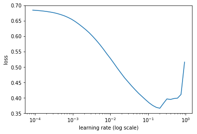

```
 lr=4e-2  wd=1e-7  lrs = np.array([lr/100,lr/10,lr]) 
```

```
 learn.fit(lr,1,wds=wd,cycle_len=8,use_clr=(5,8)) 
```

```
 epoch trn_loss val_loss <lambda> dice 
 0 0.12936 0.03934 0.988571 0.971385 
 1 0.098401 0.039252 0.990438 0.974921 
 2 0.087789 0.02539 0.990961 0.978927 
 3 0.082625 0.027984 0.988483 0.975948 
 4 0.079509 0.025003 0.99171 0.981221 
 5 0.076984 0.022514 0.992462 0.981881 
 6 0.076822 0.023203 0.992484 0.982321 
 7 0.075488 0.021956 0.992327 0.982704 
```

```
 [0.021955982234979434, 0.9923273126284281, 0.9827044502137199] 
```

```
 learn.save('128urn-tmp') 
```

```
 learn.load('128urn-tmp') 
```

```
 learn.unfreeze()  learn.bn_freeze( True ) 
```

```
 learn.fit(lrs/4, 1, wds=wd, cycle_len=20,use_clr=(20,10)) 
```

```
 0%| | 0/64 [00:00<?, ?it/s]  epoch trn_loss val_loss <lambda> dice  0 0.073786 0.023418 0.99297 0.98283  1 0.073561 0.020853 0.992142 0.982725  2 0.075227 0.023357 0.991076 0.980879  3 0.074245 0.02352 0.993108 0.983659  4 0.073434 0.021508 0.993024 0.983609  5 0.073092 0.020956 0.993188 0.983333  6 0.073617 0.019666 0.993035 0.984102  7 0.072786 0.019844 0.993196 0.98435  8 0.072256 0.018479 0.993282 0.984277  9 0.072052 0.019479 0.993164 0.984147  10 0.071361 0.019402 0.993344 0.984541  11 0.070969 0.018904 0.993139 0.984499  12 0.071588 0.018027 0.9935 0.984543  13 0.070709 0.018345 0.993491 0.98489  14 0.072238 0.019096 0.993594 0.984825  15 0.071407 0.018967 0.993446 0.984919  16 0.071047 0.01966 0.993366 0.984952  17 0.072024 0.018133 0.993505 0.98497  18 0.071517 0.018464 0.993602 0.985192  19 0.070109 0.018337 0.993614 0.9852 
```

```
 [0.018336569653853538, 0.9936137114252362, 0.9852004420189631] 
```

.985! That's like we halved the error with everything else exactly the same [ [1:55:42](https://youtu.be/nG3tT31nPmQ%3Ft%3D1h55m42s) ]. And more the point, you can look at it.

```
 learn.save('128urn-0') 
```

```
 learn.load('128urn-0') 
```

```
 x,y = next(iter(md.val_dl))  py = to_np(learn.model(V(x))) 
```

This is actually looking somewhat car-like compared to our non-Unet equivalent which is just a blob. Because trying to do this through down and up paths — it's just asking too much. Where else, when we actually provide the downward path pixels at every point, it can actually start to create something car-ish.

```
 show_img(py[0]>0); 
```


```
 show_img(y[0]); 
```


At the end of that, we'll do m.close to remove those `sfs.features` taking up GPU memory.

```
 m.close() 
```

#### 512x512 [ [1:56:26](https://youtu.be/nG3tT31nPmQ%3Ft%3D1h56m26s) ]

Go to a smaller batch size, higher size

```
 sz=512  bs=16 
```

```
 tfms = tfms_from_model(resnet34, sz, crop_type=CropType.NO,  tfm_y=TfmType.CLASS, aug_tfms=aug_tfms)  datasets = ImageData.get_ds(MatchedFilesDataset, (trn_x,trn_y),  (val_x,val_y), tfms, path=PATH)  md = ImageData(PATH, datasets, bs, num_workers=4, classes= None )  denorm = md.trn_ds.denorm 
```

```
 m_base = get_base()  m = to_gpu(Unet34(m_base))  models = UnetModel(m) 
```

```
 learn = ConvLearner(md, models)  learn.opt_fn=optim.Adam  learn.crit=nn.BCEWithLogitsLoss()  learn.metrics=[accuracy_thresh(0.5),dice] 
```

```
 learn.freeze_to(1) 
```

```
 learn.load('128urn-0') 
```

```
 learn.fit(lr,1,wds=wd, cycle_len=5,use_clr=(5,5)) 
```

```
 epoch trn_loss val_loss <lambda> dice  0 0.071421 0.02362 0.996459 0.991772  1 0.070373 0.014013 0.996558 0.992602  2 0.067895 0.011482 0.996705 0.992883  3 0.070653 0.014256 0.996695 0.992771  4 0.068621 0.013195 0.996993 0.993359 
```

```
 [0.013194938530288046, 0.996993034604996, 0.993358936574724] 
```

You can see the dice coefficients really going up [ [1:56:30](https://youtu.be/nG3tT31nPmQ%3Ft%3D1h56m30s) ]. So notice above, I'm loading in the 128x128 version of the network. We are doing this progressive resizing trick again, so that gets us .993\.

```
 learn.save('512urn-tmp') 
```

```
 learn.unfreeze()  learn.bn_freeze( True ) 
```

```
 learn.load('512urn-tmp') 
```

```
 learn.fit(lrs/4,1,wds=wd, cycle_len=8,use_clr=(20,8)) 
```

```
 epoch trn_loss val_loss <lambda> dice  0 0.06605 0.013602 0.997 0.993014  1 0.066885 0.011252 0.997248 0.993563  2 0.065796 0.009802 0.997223 0.993817  3 0.065089 0.009668 0.997296 0.993744  4 0.064552 0.011683 0.997269 0.993835  5 0.065089 0.010553 0.997415 0.993827  6 0.064303 0.009472 0.997431 0.994046  7 0.062506 0.009623 0.997441 0.994118 
```

```
 [0.009623114736602894, 0.9974409020136273, 0.9941179137381296] 
```

Then unfreeze to get to .994\.

```
 learn.save('512urn') 
```

```
 learn.load('512urn') 
```

```
 x,y = next(iter(md.val_dl))  py = to_np(learn.model(V(x))) 
```

And you can see, it's now looking pretty good.

```
 show_img(py[0]>0); 
```

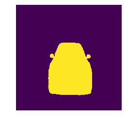

```
 show_img(y[0]); 
```


```
 m.close() 
```

#### 1024x1024 [ [1:56:53](https://youtu.be/nG3tT31nPmQ%3Ft%3D1h56m53s) ]

Go down to a batch size of 4, size of 1024\.

```
 sz=1024  bs=4 
```

```
 tfms = tfms_from_model(resnet34, sz, crop_type=CropType.NO,  tfm_y=TfmType.CLASS)  datasets = ImageData.get_ds(MatchedFilesDataset, (trn_x,trn_y),  (val_x,val_y), tfms, path=PATH)  md = ImageData(PATH, datasets, bs, num_workers=16, classes= None )  denorm = md.trn_ds.denorm 
```

```
 m_base = get_base()  m = to_gpu(Unet34(m_base))  models = UnetModel(m) 
```

```
 learn = ConvLearner(md, models)  learn.opt_fn=optim.Adam  learn.crit=nn.BCEWithLogitsLoss()  learn.metrics=[accuracy_thresh(0.5),dice] 
```

Load in what we just saved with the 512\.

```
 learn.load('512urn') 
```

```
 learn.freeze_to(1) 
```

```
 learn.fit(lr,1, wds=wd, cycle_len=2,use_clr=(5,4)) 
```

```
 epoch trn_loss val_loss <lambda> dice  0 0.007656 0.008155 0.997247 0.99353  1 0.004706 0.00509 0.998039 0.995437 
```

```
 [0.005090427414942828, 0.9980387706605215, 0.995437301104031] 
```

That gets us to .995\.

```
 learn.save('1024urn-tmp') 
```

```
 learn.load('1024urn-tmp') 
```

```
 learn.unfreeze()  learn.bn_freeze( True ) 
```

```
 lrs = np.array([lr/200,lr/30,lr]) 
```

```
 learn.fit(lrs/10,1, wds=wd,cycle_len=4,use_clr=(20,8)) 
```

```
 epoch trn_loss val_loss <lambda> dice  0 0.005688 0.006135 0.997616 0.994616  1 0.004412 0.005223 0.997983 0.995349  2 0.004186 0.004975 0.99806 0.99554  3 0.004016 0.004899 0.99812 0.995627 
```

```
 [0.004898778487196458, 0.9981196409180051, 0.9956271404784823] 
```

```
 learn.fit(lrs/10,1, wds=wd,cycle_len=4,use_clr=(20,8)) 
```

```
 epoch trn_loss val_loss <lambda> dice  0 0.004169 0.004962 0.998049 0.995517  1 0.004022 0.004595 0.99823 0.995818  2 0.003772 0.004497 0.998215 0.995916  3 0.003618 0.004435 0.998291 0.995991 
```

```
 [0.004434524739663753, 0.9982911745707194, 0.9959913929776539] 
```

Unfreeze takes us to… we'll call that .996\.

```
 learn.sched.plot_loss() 
```


```
 learn.save('1024urn') 
```

```
 learn.load('1024urn') 
```

```
 x,y = next(iter(md.val_dl))  py = to_np(learn.model(V(x))) 
```

As you can see, that actually looks good [ [1:57:17](https://youtu.be/nG3tT31nPmQ%3Ft%3D1h57m17s) ]. In accuracy terms, 99.82%. You can see this is looking like something you could just about use to cut out. I think, at this point, there's a couple of minor tweaks we can do to get up to .997 but really the key thing then, I think, is just maybe to do a few bit of smoothing maybe or a little bit of post-processing. You can go and have a look at the Carvana winners' blogs and see some of these tricks, but as I say, the difference between where we are at .996 and what the winners got of .997, it's not heaps. So really that just the Unet on its own pretty much solves that problem.

```
 show_img(py[0]>0); 
```


```
 show_img(y[0]); 
```


### Back to Bounding Box [ [1:58:15](https://youtu.be/nG3tT31nPmQ%3Ft%3D1h58m15s) ]

Okay, so that's it. The last thing I wanted to mention is now to come all the way back to bounding boxes because you might remember, I said our bounding box model was still not doing very well on small objects. So hopefully you might be able to guess where I'm going to go with this which is that for the bounding box model, remember how we had at different grid cells we spat out outputs of the model. And it was those earlier ones with the small grid sizes that weren't very good. How do we fix it? U-Net it! Let's have an upward path with cross connections. So then we are just going to do a U-Net and then spit them out of that. Because now those finer grid cells have all of the information of that path, and that path, and that path, and that path for leverage. Now of course, this is deep learning so that means you can't write a paper saying we just used U-Net for bounding boxes. You have to invent a new word so this is called feature pyramid networks or FPNs. And this was used in RetinaNet paper, it was created in an earlier paper specifically about FPNs. And if memory serves correctly, they did briefly cite the U-Net paper but they kind of made it sound like it was this vaguely slightly connected thing that maybe some people could consider slightly useful. But really, FPNs are U-Nets.

I don't have an implementation of it to show you but it will be a fun thing, maybe for some of us to try and I know some of the students have been trying to get it working well on the forums. So yeah, interesting thing to try. So I think a couple of things to look at after this class as well as the other things I mentioned would be playing around with FPNs and also maybe trying Kerem's DynamicUnet. They would both be interesting things to look at.

So you guys have all been through 14 lessons of me talking at you now. So I'm sorry about that. Thanks for putting up with me. I think you're going to find it hard to find people who actually know them as much about training neural networks and practice as you do. It'll be really easy for you to overestimate how capable all these other people are and underestimate how capable you are. So the main thing I'd say is, please practice, please. Just because you don't have this constant thing getting you to come back here every Monday night now. It's very easy to kind of lose that momentum. So find ways to keep it. Organize a study group, a book reading group, or get together with some friends and work on a project, or do something more than just deciding I want to keep working on X. Unless you are kind of person who's super motivated and whenever you decide to do something, it happens. That's not me. It's like I know, for something to happen, I have to say “yes, David. In October, I will absolutely teach that course” and then it's like okay I better actually write some material. That's the only way I can get stuff to happen. So we've got a great community there on the forums. If people have ideas for ways to make it better, please tell me. If you think you can help with, if you want to create some new forum or moderated in some different way or whatever, just let me know. You can always PM me and there's a lot of projects going on through GitHub as well — lots of stuff. So I hope to see you all back here at something else and thanks so much for joining me on this journey.
