# 深度学习：第一部分第三课

+   [课程论坛](http://forums.fast.ai/t/wiki-lesson-3/9401/1)

### 学生创建的有用材料：

*   [AWS 操作方法](https://github.com/reshamas/fastai_deeplearn_part1/blob/master/tools/aws_ami_gpu_setup.md)
*   [TMUX](https://github.com/reshamas/fastai_deeplearn_part1/blob/master/tools/tmux.md)
*   [第 2 课总结](https://medium.com/%40apiltamang/case-study-a-world-class-image-classifier-for-dogs-and-cats-err-anything-9cf39ee4690e)
*   [学习率查找器](https://towardsdatascience.com/estimating-optimal-learning-rate-for-a-deep-neural-network-ce32f2556ce0)
*   [PyTorch](https://towardsdatascience.com/a-practitioners-guide-to-pytorch-1d0f6a238040)
*   [学习率与批量大小](https://miguel-data-sc.github.io/2017-11-05-first/)
*   [误差表面的平滑区域与泛化](https://medium.com/%40radekosmulski/do-smoother-areas-of-the-error-surface-lead-to-better-generalization-b5f93b9edf5b)
*   [5 分钟搞定卷积神经网络](https://medium.com/%40init_27/convolutional-neural-network-in-5-minutes-8f867eb9ca39)
*   [解码 ResNet 架构](http://teleported.in/posts/decoding-resnet-architecture/)
*   [另一个 ResNet 教程](https://medium.com/%40apiltamang)

### 我们离开的地方：

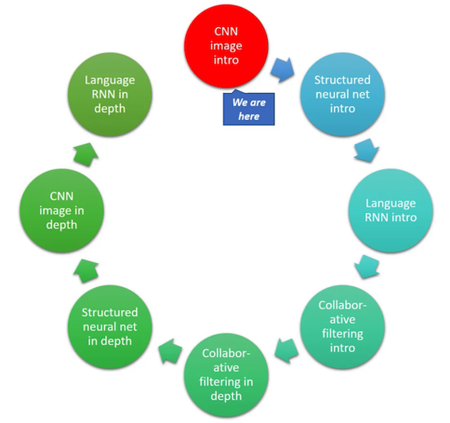

## 回顾 [[08:24](https://youtu.be/9C06ZPF8Uuc%3Ft%3D8m24s)] ：

### Kaggle CLI：如何下载数据 1：

从 Kaggle 下载时， [Kaggle CLI](https://github.com/floydwch/kaggle-cli) 是一个很好的工具。 因为它从 Kaggle 网站下载数据（通过屏幕抓取），它会在网站更改后无法使用。 当发生这种情况时，运行`pip install kaggle-cli --upgrade` 。

然后你可以运行：

```shell
$ kg download -u <username> -p <password> -c <competition> 
```

将`<username>`，`<password>`替换为你的账户，`<competition>`是 URL 中的`/c/`。 例如，如果你尝试从`https://www.kaggle.com/c/dog-breed-identification`下载狗品种数据，该命令将如下所示：

```shell
$ kg download -u john.doe -p mypassword -c dog-breed-identification 
```

确保你曾从计算机上单击过`Download`按钮并接受以下规则：


### CurlWget（Chrome 扩展程序）：如何下载数据 2：

[](https://chrome.google.com/webstore/detail/curlwget/jmocjfidanebdlinpbcdkcmgdifblncg)

### 简单的猫狗识别 [[13:39](https://youtu.be/9C06ZPF8Uuc%3Ft%3D13m39s)] 

```py
from fastai.conv_learner import *  
PATH = 'data/dogscats/'  
sz=224
bs=64 
```

笔记本通常假设你的数据位于`data`文件夹中。 但也许你想把它们放在其他地方。 在这种情况下，你可以使用符号链接（简称`symlink`）：


这是一个端到端的过程，用于获得猫狗识别的最新结果：

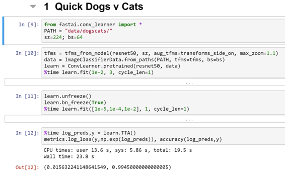


### 进一步分析：

```py
data = ImageClassifierData.from_paths(PATH, tfms= tfms, bs=bs, test_name='test') 
```

*   `from_paths` ：表示子文件夹名称是标签。 如果你的`train`文件夹或`valid`文件夹具有不同的名称，则可以发送`trn_name`和`val_name`参数。
*   `test_name` ：如果要提交给Kaggle竞赛，则需要填写测试集所在文件夹的名称。

```py
 learn = ConvLearner.pretrained(resnet50, data) 
```

*   请注意，我们没有设置`pre_compue=True` 。 它只是一个快捷方式，可以缓存一些不必每次都重新计算的中间步骤。 如果你对此感到困惑，你可以把它关掉。
*   请记住，当`pre_compute=True` ，数据增强不起作用。

```py
 learn.unfreeze()  
 learn.bn_freeze(True)  
 %time learn.fit([1e-5, 1e-4,1e-2], 1, cycle_len=1) 
```

*   `bn_freeze` ：如果你在一个与ImageNet非常相似的数据集上使用更大的更深层次的模型，如ResNet50或ResNext101（数字大于34的任何东西）（即标准对象的侧面照片，其大小类似于ImageNet在200-500之间像素），你应该添加这一行。 我们将在课程的后半部分了解更多信息，但这会导致批量标准化移动平均值无法更新。

### [如何使用其他库 - Keras](https://github.com/fastai/fastai/blob/master/courses/dl1/keras_lesson1.ipynb)  [[20:02](https://youtu.be/9C06ZPF8Uuc%3Ft%3D20m2s)] 

了解如何使用Fast.ai以外的库非常重要。 Keras是一个很好的例子，因为就像Fast.ai一样位于PyTorch之上，它位于各种库之上，如TensorFlow，MXNet，CNTK等。

如果要运行[notebook](https://github.com/fastai/fastai/blob/master/courses/dl1/keras_lesson1.ipynb) ，请运行`pip install tensorflow-gpu keras`

1.  **定义数据生成器**

```py
 train_data_dir = f'{PATH}train'  validation_data_dir = f'{PATH}valid' 
```

```py
 train_datagen = ImageDataGenerator(rescale=1. / 255,  
                    shear_range=0.2, zoom_range=0.2, horizontal_flip=True) 
```

```py
 test_datagen = ImageDataGenerator(rescale=1. / 255) 
```

```py
 train_generator = train_datagen.flow_from_directory(train_data_dir, 
                       target_size=(sz, sz),  batch_size=batch_size, class_mode='binary') 
```

```py
 validation_generator = test_datagen.flow_from_directory(  validation_data_dir,  
                            shuffle=False,  target_size=(sz, sz),
                            batch_size=batch_size, class_mode='binary') 
```

*   训练文件夹和验证文件夹以及带有标签名称的子文件夹的做法通常都已实现，Keras也是这样做的。
*   Keras需要更多的代码和更多的参数来设置。
*   你可以在Keras中定义`DataGenerator` ，而不是创建单个数据对象，并指定我们希望它执行何种类型的数据增强以及要执行的规范化。 换句话说，在Fast.ai中，我们可以说“无论ResNet50需要什么，请为我做这件事”，但在Keras中，你需要知道预期的结果。 没有标准的增强功能。
*   然后，你必须创建一个验证数据生成器，你负责创建一个没有数据增强的生成器。 而且你还必须告诉它不要对数据集进行打乱以进行验证，否则你无法跟踪你的表现。

**2.创建模型**

```py
 base_model = ResNet50(weights='imagenet', include_top=False)  
 x = base_model.output  
 x = GlobalAveragePooling2D()(x)  
 x = Dense(1024, activation='relu')(x)  predictions = Dense(1, activation='sigmoid')(x) 
```

*   Jeremy使用ResNet50作为`Quick Dogs vs Cats`的原因是因为Keras没有ResNet34。 我们想同类型比较。
*   你不能要求它构建适合特定数据集的模型，因此你必须手动完成。
*   首先创建基础模型，然后构建要在其上添加的层。

**3.冻结层并编译**

```py
 model = Model(inputs=base_model.input, outputs=predictions) 
```

```py
for layer in base_model.layers: 
    layer.trainable = False 
```

```py
 model.compile(optimizer='rmsprop', loss='binary_crossentropy',  metrics=['accuracy']) 
```

*   循环遍历层并通过调用`layer.trainable=False`手动冻结它们
*   你需要编译模型
*   传递优化程序，损失和指标的类型

**训练**

```py
model.fit_generator(train_generator, train_generator.n/batch_size,  
          epochs=3, workers=4, validation_data=validation_generator,
          validation_steps=validation_generator.n/batch_size) 
```

*   Keras希望知道每个epoch有多少批。
*   `workers` ：要使用多少处理器

**5.微调：解冻一些层，编译，然后再训练**

```py
 split_at = 140 
```

```py
for layer in model.layers[:split_at]: 
    layer.trainable = False  
for layer in model.layers[split_at:]: 
    layer.trainable = True 
```

```py
 model.compile(optimizer='rmsprop', loss='binary_crossentropy',  metrics=['accuracy']) 
```

```py
%%time model.fit_generator(train_generator,  train_generator.n/batch_size,
                 epochs=1, workers=3,  validation_data=validation_generator,
                 validation_steps=validation_generator.n/batch_size) 
```

**Pytorch** - 如果你想部署到移动设备，PyTorch仍然很不成熟。

**Tensorflow** - 如果你想要转换你在本课程中学到的东西，可以使用**Keras**做更多的工作，但这需要更多的工作并且很难获得相同级别的结果。 也许将来会有TensorFlow兼容的Fast.ai版本。 我们会看到。

### 为Kaggle创建提交文件 [[32:45](https://youtu.be/9C06ZPF8Uuc%3Ft%3D32m45s)] 

要创建提交文件，我们需要两条信息：

*   `data.classes` ：包含所有不同的类
*   `data.test_ds.fnames` ：测试文件名

```py
 log_preds, y = learn.TTA(is_test=True)  
 probs = np.exp(log_preds) 
```

使用`TTA:`总是好主意

*   `is_test=True` ：它将为你提供测试集的预测，而不是验证集
*   默认情况下，PyTorch模型会返回取对数的预测，因此你需要执行`np.exp(log_preds)`来获取概率。

```py
 ds = pd.DataFrame(probs)  
 ds.columns = data.classes 
```

*   创建Pandas `DataFrame`
*   将列名称设置为`data.classes`

```py
 ds.insert(0, 'id', [o[5:-4] for o in data.test_ds.fnames]) 
```

*   在名为`id`零位置插入一个新列。 删除前5个和后4个字母，因为我们只需要ID（文件名看起来像`test/0042d6bf3e5f3700865886db32689436.jpg` ）

```py
 ds.head() 
```

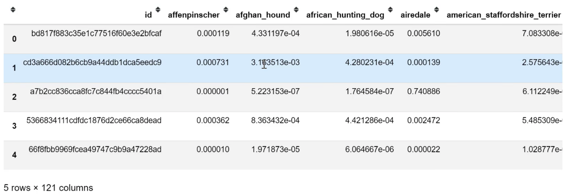

```py
 SUBM = f'{PATH}sub/'  os.makedirs(SUBM, exist_ok=True)  
 ds.to_csv(f'{SUBM}subm.gz', compression='gzip', index=False) 
```

*   现在你可以调用`ds.to_csv`来创建一个CSV文件， `compression='gzip'`会在服务器上压缩它。

```py
 FileLink(f'{SUBM}subm.gz') 
```

*   你可以使用Kaggle CLI直接从服务器提交，也可以使用`FileLink` ，它将为你提供从服务器下载文件到计算机的链接。

### 单个文件预测 [[39:32](https://youtu.be/9C06ZPF8Uuc%3Ft%3D39m32s)] 

如果我们想通过模型运行来获得单个图像预测怎么办？

```py
 fn = data.val_ds.fnames[0] 
 fn 
```

```py
'train/001513dfcb2ffafc82cccf4d8bbaba97.jpg' 
```

```py
 Image.open(PATH + fn) 
```


*   我们将从验证集中选择第一个文件。

这是获得预测的最短途径：

```py
 trn_tfms, val_tfms = tfms_from_model(arch, sz) 
```

```py
 im = val_tfms(Image.open(PATH+fn)  
 preds = learn.predict_array(im[None]) 
```

```py
 np.argmax(preds) 
```

*   图像必须变换过。 `tfms_from_model`返回训练变换和验证变换。 在这种情况下，我们将使用验证转换。
*   传递给模型或从模型返回的所有内容通常都假定为minibatch。 这里我们只有一个图像，但我们必须将其转换为单个图像的minibatch。 换句话说，我们需要创建一个不仅仅是`[rows, columns, channels]` ，而是`[number of images, rows, columns, channels]` 。
*   `im[None]` ：在开始时添加额外单位轴的Numpy技巧。

### 理论：卷积神经网络在幕后实际发生了什么 [[42:17](https://youtu.be/9C06ZPF8Uuc%3Ft%3D42m17s)] 

*   我们在第1课中看到了一点理论 - [http://setosa.io/ev/image-kernels/](http://setosa.io/ev/image-kernels/)
*   卷积是我们有一个小矩阵（在深度学习中几乎总是3x3）并将该矩阵的每个元素乘以图像的3x3部分的每个元素并将它们全部加在一起以在一个点获得该卷积的结果。

**Otavio的奇妙可视化（他创造了Word Lens）：** **[[视频](https://youtu.be/Oqm9vsf_hvU)]**
视频源自youtube，原理解析非常透彻，请自行查阅


**Jeremy的可视化：** [**电子表格**](https://github.com/fastai/fastai/blob/master/courses/dl1/excel/conv-example.xlsx) **[ [49:51](https://youtu.be/9C06ZPF8Uuc%3Ft%3D49m51s) ]**

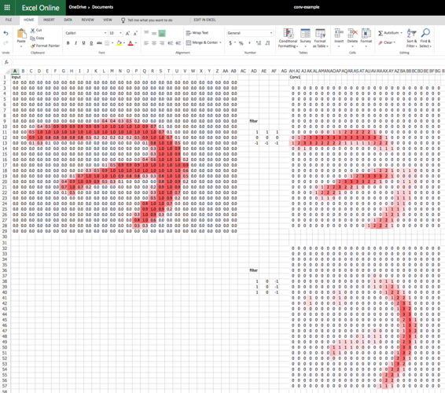

我使用[https://office.live.com/start/Excel.aspx](https://office.live.com/start/Excel.aspx%3Fui%3Den-US%26rs%3DUS)


*   该数据来自MNIST
*   **激活** ：通过对输入中的某些数字应用某种线性运算来计算的数字。
*   **整流线性单位（ReLU）** ：抛弃负数 - 即MAX（0，x）
*   **filter/卷积核**：用于卷积的3D Tensor的3*3一个切片
*   **张量**：多维数组或矩阵隐藏层既不是输入也不是输出的层
*   **最大池化**： 一个(2,2)最大池化将使高度和宽度的分辨率减半
*   **全连接层**：为每个单独的激活赋予权重并计算总和乘积。 权重矩阵与整个输入一样大。
*   注意：在最大池层之后，你可以执行许多操作。 其中一个是在整个大小上做另一个最大池。 在旧架构或结构化数据中，我们使用全连接层。 大量使用全连接层的架构容易过拟合而且速度较慢。 ResNet和ResNext不使用非常大的完全连接层。

**问题** ：如果输入有3个通道会发生什么？  [[1:05:30](https://youtu.be/9C06ZPF8Uuc%3Ft%3D1h5m30s)] 
它看起来类似于具有2个通道的Conv1层 - 因此，滤波器每个滤波器有2个通道。 预先训练的ImageNet模型使用3个通道。 当你有少于3个频道时，你可以复制其中一个频道使其成为3，或者如果你有2，则获得平均值并将其视为第三个频道。 如果你有4个通道，你可以用全部为0的卷积内核添加额外的通道。

### 接下来发生什么？  [[1:08:47](https://youtu.be/9C06ZPF8Uuc%3Ft%3D1h8m47s)] 

我们已经达到全连接层（它做类别矩阵产品）。 在excel表中，有一个激活。 如果我们想查看输入的十个数中的哪一个，我们实际上要计算10个数字。

让我们看一个例子，我们试图预测图片是猫，狗，飞机，鱼，还是建筑物。 我们的目标是：

1.  从全连接层获取输出（没有ReLU，因此可能有负数）
2.  计算5个数字，每个数字在0和1之间，它们加起来为1。

为此，我们需要一种不同类型的激活功能（一种应用于激活的功能）。

为什么我们需要非线性？ 如果堆叠多个线性层，它仍然只是一个线性层。 通过添加非线性层，我们可以适应任意复杂的形状。 我们使用的非线性激活函数是ReLU。

### Softmax  [[01:14:08](https://youtu.be/9C06ZPF8Uuc%3Ft%3D1h14m8s)] 

Softmax仅出现在最后一层。 它输出0到1之间的数字，它们加起来为1。理论上，这并不是绝对必要的 - 我们可以要求神经网络学习一组卷积核，这些卷积核尽可能接近我们想要的概率。 通常，通过深度学习，如果你可以构建你的体系结构，以便尽可能容易地表达所需的特征，你将获得更好的模型（更快速地学习并使用更少的参数）。

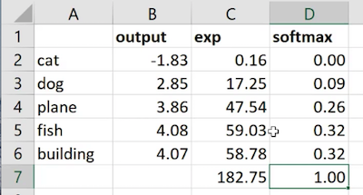

1.  通过$e^x$消除负数，因为我们不能有负概率。 它还强调了数值差异（2.85：4.08→17.25：59.03）

你需要熟悉的数学知识来深入学习：


2.然后我们将`exp`列（182.75）相加，并将$e^x$除以总和。 结果总是正数，因为我们将正数除以正数。 每个数字介于0和1之间，总数将为1。

**问题** ：如果想把图片分类为猫狗，我们使用什么样的激活功能？  [[1:20:27](https://youtu.be/9C06ZPF8Uuc%3Ft%3D1h20m27s)] 
碰巧我们现在要这样做。 我们可能想要这样做的一个原因是进行多标签分类。

## 星球大赛 [[01:20:54](https://youtu.be/9C06ZPF8Uuc%3Ft%3D1h20m54s)] 

[Notebook](https://github.com/fastai/fastai/blob/master/courses/dl1/lesson2-image_models.ipynb) / [Kaggle页面](https://www.kaggle.com/c/planet-understanding-the-amazon-from-space)

> 我肯定会建议拟人化你的激活功能。 他们有个性。  [[1:22:21](https://youtu.be/9C06ZPF8Uuc%3Ft%3D1h22m21s)] 

Softmax不喜欢预测多个事物。 它只想做单一选择。

如果有多个标签，Fast.ai库将自动切换到多标签模式。 所以你不必做任何事情。 但这是幕后发生的事情：

```py
 from planet import f2  
 metrics=[f2]  
 f_model = resnet34 
```

```py
 label_csv = f' {PATH}train_v2.csv'  
 n = len(list(open(label_csv)))-1  
 val_idxs = get_cv_idxs(n) 
```

```py
 def get_data(sz):  
    tfms = tfms_from_model(f_model, sz,  aug_tfms= transforms_top_down, max_zoom=1.05) 
```

```py
 return ImageClassifierData.from_csv(PATH, 'train-jpg',
            label_csv, tfms=tfms, suffix='.jpg',  val_idxs=val_idxs, test_name='test-jpg') 
```

```py
 data = get_data(256) 
```

*   使用Keras样式方法无法进行多标签分类，其中子文件夹是标签的名称。 所以我们使用`from_csv`
*   `transform_top_down` ：它不仅仅是垂直翻转。 一个正方形有8种可能的对称性 - 它可以旋转0度，90度，180度，270度，对于每个正方形，它可以翻转（八面体的**二面体** ）

```py
 x,y = next(iter(data.val_dl)) 
```

*   我们已经看过`data.val_ds` ， `test_ds` ， `train_ds` （ `ds` ：dataset），例如，你可以通过`data.train_ds[0]`获得单个图像。
*   `dl`是一个数据加载器，它将为你提供一个小批量，特别 _转换的_ minibatch。 使用数据加载器，你不能要求特定的minibatch; 你只能回到`next`小批量。 在Python中，它被称为“生成器”或“迭代器”。 PyTorch真正利用现代Python方法。

> [如果你熟悉Python，那么PyTorch非常自然。](https://youtu.be/9C06ZPF8Uuc%3Ft%3D1h27m45s) 
> [如果你不熟悉Python，那么PyTorch就是学习Python的好理由。](https://youtu.be/9C06ZPF8Uuc%3Ft%3D1h27m45s)

*   `x` ：一小批图像， `y` ：一小批标签。

如果你不确定函数采用什么参数，请按`shift+tab` 。

```py
 list(zip(data.classes, y[0]))
```
```py
 [('agriculture', 1.0),
 ('artisinal_mine', 0.0),
 ('bare_ground', 0.0),
 ('blooming', 0.0),
 ('blow_down', 0.0),
 ('clear', 1.0),
 ('cloudy', 0.0),
 ('conventional_mine', 0.0),
 ('cultivation', 0.0),
 ('habitation', 0.0),
 ('haze', 0.0),
 ('partly_cloudy', 0.0),('primary', 1.0),
 ('road', 0.0),
 ('selective_logging', 0.0),
 ('slash_burn', 1.0),
 ('water', 1.0)] 
```

在内部，PyTorch和fast.ai正在将我们的标签变成独热编码的标签。 如果实际标签是狗，它将看起来像：

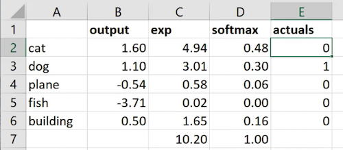

我们取`actuals`和`softmax`之间的差值，将它们加起来说出有多少误差（即损失函数） [[1:31:02](https://youtu.be/9C06ZPF8Uuc%3Ft%3D1h31m2s)] 。

独热编码对于存储是非常低效的，因此我们将存储索引值（单个整数）而不是0和1的目标值（ `y` ） [[1:31:21](https://youtu.be/9C06ZPF8Uuc%3Ft%3D1h31m21s)] 。 如果你看一下狗品种比赛的`y`值，你实际上不会看到1和0的大名单，但你会得到一个整数。 在内部，PyTorch正在将索引转换为单热编码向量（即使你真的不会看到它）。 PyTorch具有不同的损失函数，对于独热编码而另一些不是 - 但这些细节被fast.ai库隐藏，因此你不必担心它。 但是已经实现的很酷的事情是，我们对单标签分类和多标签分类都做了完全相同的事情。

**问题** ：改变softmax的对数基数是否有意义？ [[01:32:55](https://youtu.be/9C06ZPF8Uuc%3Ft%3D1h32m55s)] 不，改变基数只是神经网络可以轻松学习的线性缩放：

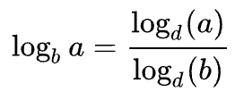

```py
 plt.imshow(data.val_ds.denorm(to_np(x))[0]*1.4); 
```

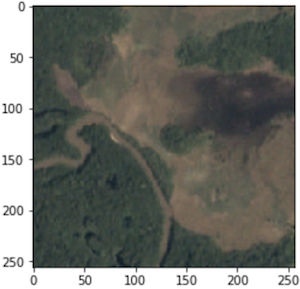

*   `*1.4` ：图像被清洗，因此使其更加清晰可见（“稍微提亮一点”）。 图像只是数字的矩阵，所以我们可以做这样的事情。
*   对这样的图像进行实验是很好的，因为这些图像完全不像ImageNet。 你做的涉及卷积神经网络的绝大多数事情实际上都不会像ImageNet（医学成像，分类不同种类的钢管，卫星图像等）

```py
 sz=64 
```

```py
 data = get_data(sz)  
 data = data.resize(int(sz*1.3), 'tmp') 
```

*   我们不会将`sz=64`用于猫狗比赛，因为我们开始使用经过预先训练的ImageNet网络，这种网络几乎完美无缺。 如果我们用64x64的图像重新训练整个集合，我们就会破坏已经非常好的权重。 请记住，大多数ImageNet模型都使用224 x 224或299 x 299图像进行训练。
*   ImageNet中没有与上面相似的图像。 只有前几层对我们有用。 因此，在这种情况下，从较小的图像开始效果很好。

```py
 learn = ConvLearner.pretrained(f_model, data, metrics=metrics) 
```

```py
 lrf=learn.lr_find()  learn.sched.plot() 
```

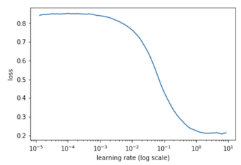

```py
 lr = 0.2  learn.fit(lr, 3, cycle_len=1, cycle_mult=2) 
```

```py
 [ 0. 0.14882 0.13552 0.87878]
 [ 1. 0.14237 0.13048 0.88251]
 [ 2. 0.13675 0.12779 0.88796]
 [ 3. 0.13528 0.12834 0.88419]
 [ 4. 0.13428 0.12581 0.88879]
 [ 5. 0.13237 0.12361 0.89141]
 [ 6. 0.13179 0.12472 0.8896 ] 
```

```py
 lrs = np.array([lr/9, lr/3, lr]) 
```

```py
 learn.unfreeze()  
 learn.fit(lrs, 3, cycle_len=1, cycle_mult=2) 
```

```py
 [ 0. 0.12534 0.10926 0.90892]
 [ 1. 0.12035 0.10086 0.91635]
 [ 2. 0.11001 0.09792 0.91894]
 [ 3. 0.1144 0.09972 0.91748]
 [ 4. 0.11055 0.09617 0.92016]
 [ 5. 0.10348 0.0935 0.92267]
 [ 6. 0.10502 0.09345 0.92281]
```

*   `[lr/9, lr/3, lr]` - 这是因为图像与ImageNet图像不同，而早期的层可能并不像它们需要的那样接近。

```py
 learn.sched.plot_loss() 
```

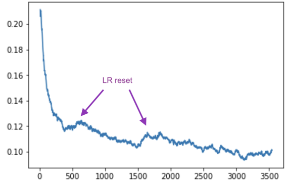

```py
 sz = 128
 learn.set_data(get_data(sz))  
 learn.freeze()  
 learn.fit(lr, 3, cycle_len=1, cycle_mult=2) 
```

```py
 [ 0. 0.09729 0.09375 0.91885]
 [ 1. 0.10118 0.09243 0.92075]
 [ 2. 0.09805 0.09143 0.92235]
 [ 3. 0.09834 0.09134 0.92263]
 [ 4. 0.096 0.09046 0.9231 ]
 [ 5. 0.09584 0.09035 0.92403]
 [ 6. 0.09262 0.09059 0.92358] 
```

```py
 learn.unfreeze()  
 learn.fit(lrs, 3, cycle_len=1, cycle_mult=2)  
 learn.save(f'{sz}') 
```

```py
 [ 0. 0.09623 0.08693 0.92696]
 [ 1. 0.09371 0.08621 0.92887]
 [ 2. 0.08919 0.08296 0.93113]
 [ 3. 0.09221 0.08579 0.92709]
 [ 4. 0.08994 0.08575 0.92862]
 [ 5. 0.08729 0.08248 0.93108]
 [ 6. 0.08218 0.08315 0.92971] 
```

```py
 sz = 256  
 learn.set_data(get_data(sz))  
 learn.freeze()  
 learn.fit(lr, 3, cycle_len=1, cycle_mult=2) 
```

```py
 [ 0. 0.09161 0.08651 0.92712]
 [ 1. 0.08933 0.08665 0.92677]
 [ 2. 0.09125 0.08584 0.92719]
 [ 3. 0.08732 0.08532 0.92812]
 [ 4. 0.08736 0.08479 0.92854]
 [ 5. 0.08807 0.08471 0.92835]
 [ 6. 0.08942 0.08448 0.9289 ]
```

```py
 learn.unfreeze()  
 learn.fit(lrs, 3, cycle_len=1, cycle_mult=2)  
 learn.save(f'{sz}') 
```

```py
 [ 0. 0.08932 0.08218 0.9324 ]
 [ 1. 0.08654 0.08195 0.93313]
 [ 2. 0.08468 0.08024 0.93391]
 [ 3. 0.08596 0.08141 0.93287]
 [ 4. 0.08211 0.08152 0.93401]
 [ 5. 0.07971 0.08001 0.93377]
 [ 6. 0.07928 0.0792 0.93554]
```

```py
 log_preds,y = learn.TTA()  
 preds = np.mean(np.exp(log_preds),0)  
 f2(preds,y) 
```

```py
 0.93626519738612801
```

人们问过这个问题有几个问题 [[01:38:46](https://youtu.be/9C06ZPF8Uuc%3Ft%3D1h38m46s)] ：

```py
 data = data.resize(int(sz*1.3), 'tmp') 
```

当我们指定要应用的变换时，我们发送一个大小：

```py
 tfms = tfms_from_model(f_model, sz,  aug_tfms=transforms_top_down, max_zoom=1.05) 
```

数据加载器所做的一件事就是按需调整图像大小。 这与`data.resize`。 如果初始图像是1000x1000，那么读取该JPEG并将其调整为64乘64会比训练卷积网花费更多时间。 `data.resize`告诉它我们不会使用大于`sz*1.3`图像，所以要经过一次并创建这个大小的新JPEG。 由于图像是矩形的，因此新的JPEG最小边缘为`sz*1.3` （中心裁剪）。 它会为你节省很多时间。

```py
 metrics=[f2] 
```

我们在这款笔记本上使用了[F-beta](http://scikit-learn.org/stable/modules/generated/sklearn.metrics.fbeta_score.html)而不是`accuacy` - 它是一种权衡FN( false negatives)和FP(false positives)的方法。 我们使用它的原因是因为这个特殊的Kaggle比赛想要使用它。 看看[planet.py](https://github.com/fastai/fastai/blob/master/courses/dl1/planet.py) ，了解如何创建自己的指标函数。 这是最后打印出来的`[ 0. 0.08932 0.08218 0.9324 ]`

### 多标签分类的激活功能 [[01:44:25](https://youtu.be/9C06ZPF8Uuc%3Ft%3D1h44m25s)] 

用于多标签分类的激活函数称为**sigmoid。**


**问题** ：为什么我们不开始训练差异学习率而不是单独训练最后一层？  [[01:50:30](https://youtu.be/9C06ZPF8Uuc%3Ft%3D1h50m30s)] 


你可以跳过最后一层的训练，直接使用不同的学习率，但你可能不想这样做。 卷积层都包含预先训练的权重，因此它们不是随机的 - 对于接近ImageNet的东西，它们确实很好; 对于那些与ImageNet不相近的东西，它们总比没有好。 然而，我们所有全连接层都是完全随机的。 因此，你总是希望通过先训练它们来使完全连接的权重优于随机。 否则，如果你直接解冻，那么当你后来的那些仍然是随机的时候，你实际上是要摆弄那些早期的层权重 - 这可能不是你想要的。

问题：当你使用差异学习率时，这三种学习率是否在各层之间均匀分布？  [[01:55:35](https://youtu.be/9C06ZPF8Uuc%3Ft%3D1h55m35s)] 我们将在后面的课程中详细讨论这个问题，但是fast.ai库中有一个“层组”的概念。 在类似ResNet50的东西中，有数百个层，你可能不想写出数百个学习率，因此库决定如何拆分它们，最后一个总是指我们随机初始化的全连接层并补充说。

### 可视化层 [[01:56:42](https://youtu.be/9C06ZPF8Uuc%3Ft%3D1h56m42s)] 

```py
 learn.summary() 
```

```py
 [('Conv2d-1',OrderedDict([
     ('input_shape', [-1, 3, 64, 64]),
     ('output_shape', [-1, 64, 32, 32]),
     ('trainable', False),
     ('nb_params', 9408)])),
  ('BatchNorm2d-2',OrderedDict([
     ('input_shape', [-1, 64, 32, 32]),
     ('output_shape', [-1, 64, 32, 32]),
     ('trainable', False),
     ('nb_params', 128)])),
  ('ReLU-3',OrderedDict([
     ('input_shape', [-1, 64, 32, 32]),
     ('output_shape', [-1, 64, 32, 32]),
     ('nb_params', 0)])),
  ('MaxPool2d-4',OrderedDict([
     ('input_shape', [-1, 64, 32, 32]),
     ('output_shape', [-1, 64, 16, 16]),
     ('nb_params', 0)])),
  ('Conv2d-5',OrderedDict([
     ('input_shape', [-1, 64, 16, 16]),
     ('output_shape', [-1, 64, 16, 16]),
     ('trainable', False),
     ('nb_params', 36864)]))
     ... 
```

*   `'input_shape', [-1, 3, 64, 64 ]` - 1,3,64,64 PyTorch在图像大小之前列出通道。 一些GPU计算在按此顺序运行时运行得更快。 这是通过转换步骤在幕后完成的。
*   `-1` ：表示批量大小。 Keras使用`None` 。
*   `'output_shape', [-1, 64, 32, 32]` - 64是卷积核的数量

**问题** ：一个非常小的数据集的学习率查找器返回了奇怪的数字并且情节是空的 [[01:58:57](https://youtu.be/9C06ZPF8Uuc%3Ft%3D1h58m57s)]
  - 学习率查找器将一次通过一个小批量。 如果你有一个很小的数据集，那么就没有足够的小批量。 所以诀窍是让你的批量大小非常小，如4或8。

## 结构化数据 [[01:59:48](https://youtu.be/9C06ZPF8Uuc%3Ft%3D1h59m48s)] 

我们在机器学习中使用了两种类型的数据集：

*   **非结构化** - 音频，图像，自然语言文本，其中对象内的所有事物都是相同的东西 - 像素，波形的幅度或单词。
*   **结构化** - 损益表，关于Facebook用户的信息，每个列在结构上完全不同。 “结构化”是指你可能在数据库或电子表格中找到的柱状数据，其中不同的列表示不同类型的事物，每行代表一个观察。

结构化数据在学术界经常被忽略，因为如果你有更好的逻辑回归模型，很难在花哨的会议论文集中发表。 但这是让世界变得圆满，让每个人都有钱和效率的事情。 我们不会忽视它，因为我们正在进行实际的深度学习，而Kaggle也不会因为人们将奖金放在Kaggle来解决现实世界的问题：

*   [CorporaciónFavoritaGrocery销售预测](https://www.kaggle.com/c/favorita-grocery-sales-forecasting) - 目前正在运行
*   [罗斯曼商店销售](https://www.kaggle.com/c/rossmann-store-sales) - 几乎与上述相同但已完成竞争。

### 罗斯曼商店促销 [[02:02:42](https://youtu.be/9C06ZPF8Uuc%3Ft%3D2h2m42s)] 

[笔记本](https://github.com/fastai/fastai/blob/master/courses/dl1/lesson3-rossman.ipynb)

```py
 from fastai.structured import * 
 from fastai.column_data import *  
 np.set_printoptions(threshold=50, edgeitems=20)  
 PATH='data/rossmann/' 
```

*   `fastai.structured` - 不是PyTorch特定的，也用于机器学习过程中做任何没有PyTorch的随机森林。 它可以单独使用而无需Fast.ai库的任何其他部分。
*   `fastai.column_data` - 允许我们使用柱状结构化数据执行Fast.ai和PyTorch。
*   对于结构化数据需要大量使用**Pandas** 。 Pandas试图用Python复制R的数据框（如果你不熟悉Pandas，这里有一本好书 - [用于数据分析的Python，第2版](http://shop.oreilly.com/product/0636920050896.do) ）

有很多数据预处理这个笔记本包含来自第三名获胜者（ [实体嵌入类别变量](https://arxiv.org/abs/1604.06737) ）的整个处理流程。 本课程不涉及数据处理，但在机器学习课程中有详细介绍，因为特征工程非常重要。

### 查看CSV文件

```py
 table_names = ['train', 'store', 'store_states', 
                'state_names',  'googletrend', 'weather', 'test'] 
```

```py
 tables = [pd.read_csv(f'{PATH}{fname}.csv', low_memory=False) for fname in table_names] 
```

```py
 for t in tables: 
     display(t.head()) 
```

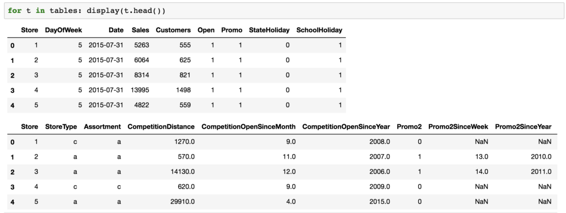

*   `StoreType` - 你经常会获得某些列包含“编码”的数据集。 编码意味着什么并不重要。 远离对它的过多学习，看看数据首先说的是什么。

### 加入表格

这是一个关系数据集，你已经连接了很多表 - 这很容易与Pandas `merge` ：

```py
 def join_df(left, right, left_on, right_on=None, suffix='_y'):  
     if right_on is None: 
         right_on = left_on  
         return left.merge(right, how='left', left_on=left_on,
                    right_on=right_on, suffixes=("", suffix)) 
```

来自Fast.ai库：

```py
 add_datepart(train, "Date", drop=False) 
```

*   记下一个日期并拉出一堆列，例如“星期几”，“季度开始”，“一年中的一个月”等等，并将它们全部添加到数据集中。
*   持续时间部分将计算诸如下一个假期之前的时间，自上次假期以来的持续时间等等。

```py
 joined.to_feather(f'{PATH}joined') 
```

*   `to_feather` ：将Pandas的数据帧保存为“羽状”格式，将其放在RAM中并将其转储到磁盘上。 所以真的很快。 厄瓜多尔杂货竞赛有3.5亿条记录，因此你需要关心保存需要多长时间。

### 下周

*   将列拆分为两种类型：分类和连续。 分类列将表示为独热编码，并且连续列按原样馈送到全连接层。
*   分类：商店＃1和商店＃2在数量上并不相互关联。 类似地，星期一（第0天）和星期二（第1天）的星期几。
*   连续：距离最接近的竞争对手的公里距离是我们用数字处理的数字。
*   `ColumnarModelData`
