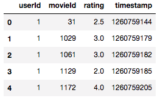
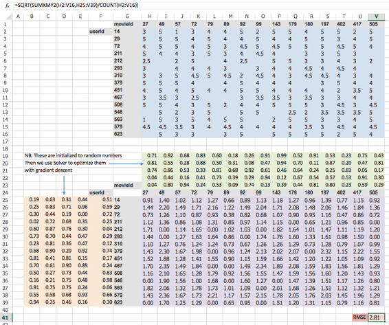
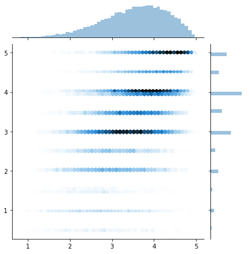
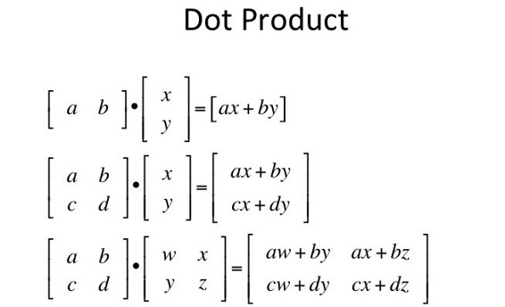
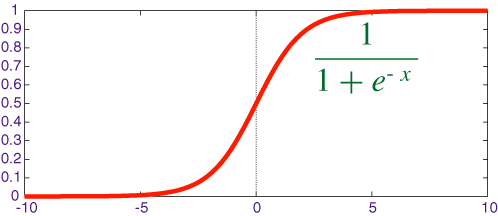
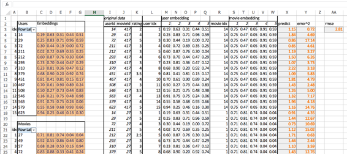
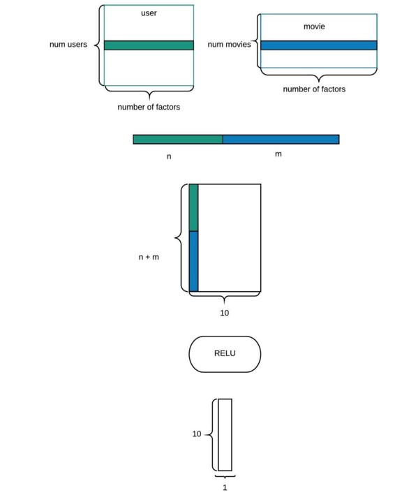
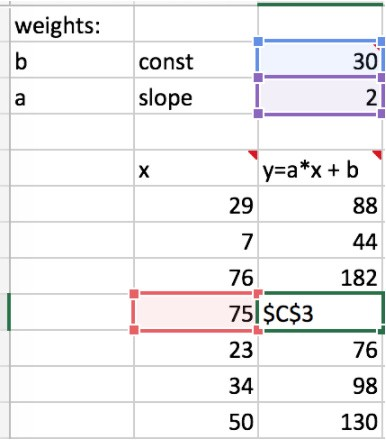
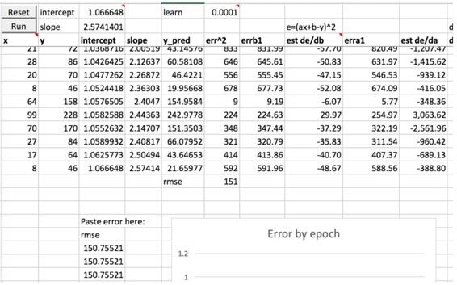
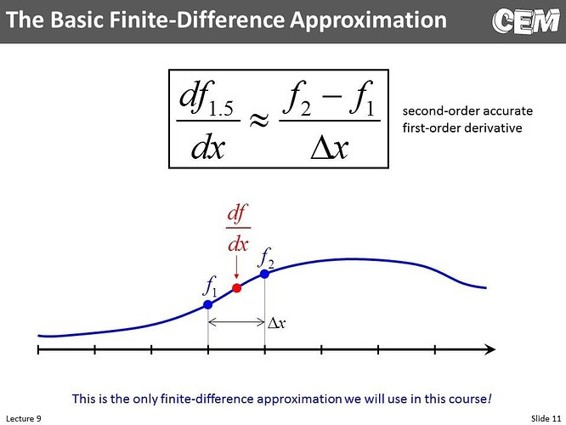

# 深度学习2：第1部分第5课

### [第5课](http://forums.fast.ai/t/wiki-lesson-5/9403)

### 一，导言

没有足够的关于结构化深度学习的出版物，但它肯定发生在行业中：

[**结构化深度学习**](https://towardsdatascience.com/structured-deep-learning-b8ca4138b848 "https://towardsdatascience.com/structured-deep-learning-b8ca4138b848")[
](https://towardsdatascience.com/structured-deep-learning-b8ca4138b848 "https://towardsdatascience.com/structured-deep-learning-b8ca4138b848")[_作者：Kerem Turgutlu_朝向datascience.com](https://towardsdatascience.com/structured-deep-learning-b8ca4138b848 "https://towardsdatascience.com/structured-deep-learning-b8ca4138b848")[](https://towardsdatascience.com/structured-deep-learning-b8ca4138b848)

您可以使用[此工具](https://github.com/hardikvasa/google-images-download)从Google下载图片并解决自己的问题：

[**小图像数据集的乐趣（第2部分）**](https://towardsdatascience.com/fun-with-small-image-data-sets-part-2-54d683ca8c96 "https://towardsdatascience.com/fun-with-small-image-data-sets-part-2-54d683ca8c96")[
](https://towardsdatascience.com/fun-with-small-image-data-sets-part-2-54d683ca8c96 "https://towardsdatascience.com/fun-with-small-image-data-sets-part-2-54d683ca8c96")[_作者：Nikhil B_ towardsdatascience.com](https://towardsdatascience.com/fun-with-small-image-data-sets-part-2-54d683ca8c96 "https://towardsdatascience.com/fun-with-small-image-data-sets-part-2-54d683ca8c96")[](https://towardsdatascience.com/fun-with-small-image-data-sets-part-2-54d683ca8c96)

关于如何训练神经网络的介绍（一篇伟大的技术写作）：

[**我们如何“训练”神经网络？**](https://towardsdatascience.com/how-do-we-train-neural-networks-edd985562b73 "https://towardsdatascience.com/how-do-we-train-neural-networks-edd985562b73")[
](https://towardsdatascience.com/how-do-we-train-neural-networks-edd985562b73 "https://towardsdatascience.com/how-do-we-train-neural-networks-edd985562b73")[_由Vitaly Bushaev_朝向dasatcience.com](https://towardsdatascience.com/how-do-we-train-neural-networks-edd985562b73 "https://towardsdatascience.com/how-do-we-train-neural-networks-edd985562b73")[](https://towardsdatascience.com/how-do-we-train-neural-networks-edd985562b73)

学生们在[Kaggle幼苗分类比赛中](https://www.kaggle.com/c/plant-seedlings-classification/leaderboard)与Jeremy [竞争](https://www.kaggle.com/c/plant-seedlings-classification/leaderboard) 。

### II。 协作过滤 - 使用MovieLens数据集

讨论的笔记本可以在[这里](https://github.com/fastai/fastai/blob/master/courses/dl1/lesson5-movielens.ipynb)找到[（lesson5-movielens.ipynb）](https://github.com/fastai/fastai/blob/master/courses/dl1/lesson5-movielens.ipynb) 。

我们来看看数据。 我们将使用`userId` （分类）， `movieId` （分类）和`rating` （依赖）进行建模。

```
 ratings = pd.read_csv(path+'ratings.csv')  ratings.head() 
```



#### **为Excel创建子集**

我们创建了最受欢迎的电影和大多数电影上瘾用户的交叉表，我们将其复制到Excel中进行可视化。

```
 g=ratings.groupby('userId')['rating'].count()  topUsers=g.sort_values(ascending=False)[:15] 
```

```
 g=ratings.groupby('movieId')['rating'].count()  topMovies=g.sort_values(ascending=False)[:15] 
```

```
 top_r = ratings.join(topUsers, rsuffix='_r', how='inner', on='userId')  top_r = top_r.join(topMovies, rsuffix='_r', how='inner', on='movieId') 
```

```
 pd.crosstab(top_r.userId, top_r.movieId, top_r.rating, aggfunc=np.sum) 
```


[这](https://github.com/fastai/fastai/blob/master/courses/dl1/excel/collab_filter.xlsx)是包含上述信息的excel文件。 首先，我们将使用**矩阵分解/分解**而不是构建神经网络。



*   蓝色细胞 - 实际评级
*   紫色细胞 - 我们的预测
*   红细胞 - 我们的损失函数即均方根误差（RMSE）
*   绿色单元格 - 电影嵌入（随机初始化）
*   橙色单元格 - 用户嵌入（随机初始化）

每个预测是电影嵌入矢量和用户嵌入矢量的点积。 在线性代数项中，它等于矩阵乘积，因为一个是行，一个是列。 如果没有实际评级，我们将预测设置为零（将其视为测试数据 - 而不是训练数据）。


然后我们使用Gradient Descent来减少损失。 Microsoft Excel在加载项中有一个“求解器”，可以通过更改所选单元格来最小化变量（ `GRG Nonlinear`是您要使用的方法）。

这可称为“浅学习”（与深度学习相反），因为没有非线性层或第二线性层。 那么我们直觉上做了什么呢？ 每部电影的五个数字称为“嵌入”（潜在因素） - 第一个数字可能代表科幻和幻想的数量，第二个数字可能是电影使用了多少特效，第三个可能是如何类似地，每个用户还有5个数字，例如，表示用户喜欢幻想幻想，特效和电影中的对话驱动多少。 我们的预测是这些载体的交叉产物。 由于我们没有针对每个用户进行所有电影评论，因此我们试图找出哪些电影与这部电影相似，以及其他用户如何评价与此用户类似的其他电影为此电影评分（因此称为“协作”）。

我们如何处理新用户或新电影 - 我们是否需要重新训练模型？ 我们现在没有时间来讨论这个问题，但基本上你需要有一个新的用户模型或最初会使用的新电影模型，随着时间的推移你需要重新训练模型。

#### **简单的Python版本[** [**26:03**](https://youtu.be/J99NV9Cr75I%3Ft%3D26m3s) **]**

这应该看起来很熟悉了。 我们通过选择随机ID集来创建验证集。 `wd`是L2正则化的权重衰减， `n_factors`是我们想要的嵌入矩阵有多大。

```
 val_idxs = get_cv_idxs(len(ratings))  wd = 2e-4  n_factors = 50 
```

我们从CSV文件创建模型数据对象：

```
 cf = CollabFilterDataset.from_csv(path, 'ratings.csv', 'userId', 'movieId', 'rating') 
```

然后我们得到一个适合模型数据的学习者，并适合模型：

```
 learn = cf.get_learner(n_factors, val_idxs, 64, opt_fn=optim.Adam) 
```

```
 learn.fit(1e-2, 2, wds=wd, cycle_len=1, cycle_mult=2) 
```


<figcaption class="imageCaption">输出MSE</figcaption>


由于输出是Mean Squared Error，您可以通过以下方式获取RMSE：

```
 math.sqrt(0.765) 
```

产量约为0.88，优于0.91的基准。

您可以通过常规方式获得预测：

```
 preds = learn.predict() 
```

你也可以使用seaborn `sns` （建立在matplotlib之上）：

```
 y = learn.data.val_y  sns.jointplot(preds, y, kind='hex', stat_func=None) 
```



#### **使用Python的Dot产品**




`T`是火炬中的张量

```
 a = T([[1., 2], [3, 4]])  b = T([[2., 2], [10, 10]]) 
```

当我们在numpy或PyTorch中的张量之间有一个数学运算符时，它将在元素方面假设它们都具有相同的维数。 下面是你如何计算两个向量的点积（例如（1,2）·（2,2）= 6 - 矩阵a和b的第一行）：

```
 (a*b).sum(1) 
```

```
 6  70  [torch.FloatTensor of size 2] 
```

#### **构建我们的第一个自定义层（即PyTorch模块）[** [**33:55**](https://youtu.be/J99NV9Cr75I%3Ft%3D33m55s) **]**

我们通过创建一个扩展`nn.Module`并覆盖`forward`函数的Python类来实现这一点。

```
 class DotProduct (nn.Module):  def forward(self, u, m): return (u*m).sum(1) 
```

现在我们可以调用它并得到预期的结果（注意我们不需要说`model.forward(a, b)`来调用`forward`函数 - 它是PyTorch魔法。）[ [40:14](https://youtu.be/J99NV9Cr75I%3Ft%3D40m14s) ]：

```
 model = DotProduct()  **model(a,b)** 
```

```
 6  70  [torch.FloatTensor of size 2] 
```

#### **建造更复杂的模块[** [**41:31**](https://youtu.be/J99NV9Cr75I%3Ft%3D41m31s) **]**

这个实现有两个`DotProduct`类的补充：

*   两个`nn.Embedding`矩阵
*   在上面的嵌入矩阵中查找我们的用户和电影

用户ID很可能不是连续的，这使得很难用作嵌入矩阵的索引。 因此，我们将首先创建从零开始并且连续的索引，并使用带有匿名函数`lambda` Panda的`apply`函数将`ratings.userId`列替换为索引，并对`ratings.movieId`执行相同的操作。

```
 u_uniq = ratings.userId.unique()  user2idx = {o:i **for** i,o **in** enumerate(u_uniq)}  ratings.userId = ratings.userId.apply( **lambda** x: user2idx[x]) 
```

```
 m_uniq = ratings.movieId.unique()  movie2idx = {o:i **for** i,o **in** enumerate(m_uniq)}  ratings.movieId = ratings.movieId.apply( **lambda** x: movie2idx[x]) 
```

```
 n_users=int(ratings.userId.nunique()) n_movies=int(ratings.movieId.nunique()) 
```

_提示：_ `{o:i for i,o in enumerate(u_uniq)}`是一个方便的代码行保存在你的工具带中！

```
 class EmbeddingDot(nn.Module):  def __init__(self, n_users, n_movies):  super().__init__()  self.u = nn.Embedding(n_users, n_factors)  self.m = nn.Embedding(n_movies, n_factors)  self.u.weight.data.uniform_(0,0.05)  self.m.weight.data.uniform_(0,0.05)  def forward(self, cats, conts):  users,movies = cats[:,0],cats[:,1]  u,m = self.u(users),self.m(movies)  return (u*m).sum(1) 
```

请注意， `__init__`是一个现在需要的构造函数，因为我们的类需要跟踪“状态”（多少部电影，多少用户，多少因素等）。 我们将权重初始化为0到0.05之间的随机数，你可以在这里找到关于权重初始化的标准算法的更多信息，“Kaiming Initialization”（PyTorch有He初始化实用函数，但是我们试图从头开始做事）[ [46 ：58](https://youtu.be/J99NV9Cr75I%3Ft%3D46m58s) ]。

`Embedding`不是张量而是**变量** 。 变量执行与张量完全相同的操作，但它也可以自动区分。 要从变量中拉出张量，请调用`data`属性。 所有张量函数都有一个变量，尾随下划线（例如`uniform_` ）将就地执行。

```
 x = ratings.drop(['rating', 'timestamp'],axis=1)  y = ratings['rating'].astype(np.float32)  data = ColumnarModelData.from_data_frame(path, val_idxs, x, y, ['userId', 'movieId'], 64) 
```

我们正在重用Rossmann笔记本中的ColumnarModelData（来自fast.ai库），这也是为什么在`EmbeddingDot`类[ [50:20](https://youtu.be/J99NV9Cr75I%3Ft%3D50m20s) ]中为`def forward(self, cats, conts)`函数存在分类和连续变量的原因。 由于在这种情况下我们没有连续变量，我们将忽略`conts`并使用`cats`的第一和第二列作为`users`和`movies` 。 请注意，它们是小批量的用户和电影。 重要的是不要手动循环小批量，因为你不会获得GPU加速，而是一次处理整个小批量，正如你在上面的`forward`功能的第3和第4行看到的那样[ [51](https://youtu.be/J99NV9Cr75I%3Ft%3D51m) ： [00-52](https://youtu.be/J99NV9Cr75I%3Ft%3D51m) ：05 ]。

```
 wd=1e-5  model = EmbeddingDot(n_users, n_movies).cuda()  opt = optim.SGD(model.parameters(), 1e-1, weight_decay=wd, momentum=0.9) 
```

`optim`是为PyTorch提供优化器的原因。 `model.parameters()`是从`nn.Modules`继承的函数之一，它为我们提供了更新/学习的`nn.Modules`重。

```
 fit(model, data, 3, opt, F.mse_loss) 
```

这个函数来自fast.ai库[ [54:40](https://youtu.be/J99NV9Cr75I%3Ft%3D54m40s) ]并且比我们一直在使用的`learner.fit()`更接近常规的PyTorch方法。 它不会为您提供诸如“重启的随机梯度下降”或开箱即用的“差分学习率”等功能。

#### **让我们改进我们的模型**

**偏见** - 适应普遍流行的电影或普遍热情的用户。

```
 min_rating,max_rating = ratings.rating.min(),ratings.rating.max()  min_rating,max_rating 
```

```
 def get_emb(ni,nf):  e = nn.Embedding(ni, nf)  e.weight.data.uniform_(-0.01,0.01)  return e 
```

```
 class EmbeddingDotBias(nn.Module):  def __init__(self, n_users, n_movies):  super().__init__()  (self.u, self.m, **self.ub** , **self.mb** ) = [get_emb(*o) for o in [  (n_users, n_factors), (n_movies, n_factors), (n_users,1), (n_movies,1)  ]]  def forward(self, cats, conts):  users,movies = cats[:,0],cats[:,1]  um = (self.u(users)* self.m(movies)).sum(1)  res = um + ** self.ub(users)** .squeeze() + **self.mb(movies)** .squeeze()  res = F.sigmoid(res) * (max_rating-min_rating) + min_rating  return res 
```

`squeeze`是PyTorch版本的_广播_ [ [1:04:11](https://youtu.be/J99NV9Cr75I%3Ft%3D1h4m11s) ]以获取更多信息，请参阅机器学习课程或[numpy文档](https://docs.scipy.org/doc/numpy-1.13.0/user/basics.broadcasting.html) 。

我们可以压缩评级，使其在1到5之间吗？ 是! 通过sigmoid函数进行预测将导致数字介于1和0之间。因此，在我们的情况下，我们可以将其乘以4并加1 - 这将导致1到5之间的数字。



`F`是PyTorch函数（ `torch.nn.functional` ），包含张量的所有函数，在大多数情况下作为`F`导入。

```
 wd=2e-4  model = EmbeddingDotBias(cf.n_users, cf.n_items).cuda()  opt = optim.SGD(model.parameters(), 1e-1, weight_decay=wd, momentum=0.9) 
```

```
 fit(model, data, 3, opt, F.mse_loss)  [ 0\. 0.85056 0.83742]  [ 1\. 0.79628 0.81775]  [ 2\. 0.8012 0.80994] 
```

让我们来看看我们在**Simple Python版本中**使用的fast.ai代码[ [1:13:44](https://youtu.be/J99NV9Cr75I%3Ft%3D1h13m44s) ] **。** 在`column_data.py`文件中， `CollabFilterDataSet.get_leaner`调用`get_model`函数，该函数创建与我们创建的相同的`EmbeddingDotBias`类。

#### 神经网络版[ [1:17:21](https://youtu.be/J99NV9Cr75I%3Ft%3D1h17m21s) ]

我们回到excel表来理解直觉。 请注意，我们创建user_idx以查找嵌入，就像我们之前在python代码中所做的那样。 如果我们对user_idx进行单热编码并将其乘以用户嵌入，我们将为用户获取适用的行。 如果它只是矩阵乘法，为什么我们需要嵌入？ 它用于计算性能优化目的。



我们不是计算用户嵌入向量和电影嵌入向量的点积来得到预测，而是将两者连接起来并通过神经网络来提供它。

```
 class EmbeddingNet(nn.Module):  def __init__(self, n_users, n_movies, **nh** =10, p1=0.5, p2=0.5):  super().__init__()  (self.u, self.m) = [get_emb(*o) for o in [  (n_users, n_factors), (n_movies, n_factors)]]  self.lin1 = **nn.Linear** (n_factors*2, nh)  self.lin2 = nn.Linear(nh, 1)  self.drop1 = nn.Dropout(p1)  self.drop2 = nn.Dropout(p2)  def forward(self, cats, conts):  users,movies = cats[:,0],cats[:,1]  x = self.drop1(torch.cat([self.u(users),self.m(movies)], dim=1))  x = self.drop2(F.relu(self.lin1(x)))  return F.sigmoid(self.lin2(x)) * (max_rating-min_rating+1) + min_rating-0.5 
```

请注意，我们不再有偏差项，因为PyTorch中的`Linear`层已经存在偏差。 `nh`是线性层创建的一些激活（Jeremy称之为“数字隐藏”）。



它只有一个隐藏层，所以可能不是“深层”，但这绝对是一个神经网络。

```
 wd=1e-5  model = EmbeddingNet(n_users, n_movies).cuda()  opt = optim.Adam(model.parameters(), 1e-3, weight_decay=wd)  fit(model, data, 3, opt, **F.mse_loss** ) 
```

```
 A Jupyter Widget 
```

```
 [ 0\. 0.88043 0.82363]  [ 1\. 0.8941 0.81264]  [ 2\. 0.86179 0.80706] 
```

请注意，损失函数也在`F` （这里，它是均方损失）。

既然我们有神经网络，我们可以尝试很多东西：

*   添加辍学者
*   使用不同的嵌入大小进行用户嵌入和电影嵌入
*   不仅是用户和电影嵌入，而且还附加来自原始数据的电影类型嵌入和/或时间戳。
*   增加/减少隐藏层数和激活次数
*   增加/减少正规化

#### **训练循环中发生了什么？** [ [1:33:21](https://youtu.be/J99NV9Cr75I%3Ft%3D1h33m21s) ]

目前，我们正在将权重更新传递给PyTorch的优化器。 优化器有什么作用？ 什么是`momentum` ？

```
 opt = optim.SGD(model.parameters(), 1e-1, weight_decay=wd, momentum=0.9) 
```

我们将在excel表（ [graddesc.xlsm](https://github.com/fastai/fastai/blob/master/courses/dl1/excel/graddesc.xlsm) ）中实现梯度下降 - 从右到左看工作表。 首先我们创建一个随机_x_ '， _y_与_x_的线性相关（例如_y_ = _a * x_ + _b_ ）。 通过使用_x_和_y_的集合，我们将尝试学习_a_和_b。_





要计算误差，我们首先需要预测，并将差异平方：


为了减少误差，我们增加/减少_a_和_b_一点点，并找出会导致误差减小的原因。 这被称为通过有限差分找到导数。



有限差分在高维空间中变得复杂[ [1:41:46](https://youtu.be/J99NV9Cr75I%3Ft%3D1h41m46s) ]，并且它变得非常耗费内存并且需要很长时间。 所以我们想找到一些方法来更快地完成这项工作。 查找Jacobian和Hessian之类的东西是值得的（深度学习书： [第84页第4.3.1节](http://www.deeplearningbook.org/contents/numerical.html) ）。

#### 链规则和反向传播

更快的方法是分析地做到这一点[ [1:45:27](https://youtu.be/J99NV9Cr75I%3Ft%3D1h45m27s) ]。 为此，我们需要一个链规则：


<figcaption class="imageCaption">[链规则](https://www.khanacademy.org/math/multivariable-calculus/multivariable-derivatives/differentiating-vector-valued-functions/a/multivariable-chain-rule-simple-version)概述</figcaption>


这是Chris Olah关于[反向传播作为连锁规则](http://colah.github.io/posts/2015-08-Backprop/)的伟大文章。

现在我们用[WolframAlpha](https://www.wolframalpha.com/)给出的实际导数替换有限差分（注意有限差分输出与实际导数非常接近，如果你需要计算自己的导数，那么做好快速健全性检查的好方法）：


*   “在线”训练 - 规模为1的小批量训练

这就是你如何使用excel表格进行SGD。 如果您要使用CNN电子表格的输出更改预测值，我们可以使用SGD训练CNN。

#### 动量[ [1:53:47](https://youtu.be/J99NV9Cr75I%3Ft%3D1h53m47s) ]

> 来吧，采取一些暗示 - 这是一个很好的方向。 请继续这样做，但更多。

通过这种方法，我们将在当前的小批量衍生物和我们在最后一批小批量（单元格K9）之后采取的步骤（和方向）之间使用线性插值：


与其符号（+/-）是随机的_de_ / _db_相比，具有动量的那个将继续向同一方向移动一点点直到某一点。 这将减少训练所需的一些时期。

####  Adam [ [1:59:04](https://youtu.be/J99NV9Cr75I%3Ft%3D1h59m4s) ]

 Adam 的速度要快得多，但问题在于最终的预测并不像SGD那样有动力。 似乎这是由于 Adam 和体重衰减的联合使用。 解决此问题的新版本称为**AdamW** 。


*   `cell J8` ：导数和前一个方向的线性插值（与我们在动量中的相同）
*   `cell L8` ：从最后一步（ `cell L7` ）的导数平方+导数平方的线性插值
*   这个想法被称为“指数加权移动平均线”（换句话说，平均值与之前的值相乘）

学习率比以前高得多，因为我们将它除以`L8`平方根。

如果你看一下fast.ai库（model.py），你会注意到在`fit`函数中，它不只是计算平均损失，而是计算损失的**指数加权移动平均值** 。

```
 avg_loss = avg_loss * avg_mom + loss * (1-avg_mom) 
```

另一个有用的概念是每当你看到`α（...）+（1-α）（...）`时，立即想到**线性插值。**

#### **一些直觉**

*   我们计算了梯度平方的指数加权移动平均值，取其平方根，并将学习率除以它。
*   渐变平方总是积极的。
*   当梯度的方差很大时，梯度平方将很大。
*   当梯度恒定时，梯度平方将很小。
*   如果渐变变化很大，我们要小心并将学习率除以大数（减速）
*   如果梯度变化不大，我们将通过将学习率除以较小的数字来采取更大的步骤
*   **自适应学习率** - 跟踪梯度平方的平均值，并使用它来调整学习率。 因此，只有一种学习风格，但如果梯度是恒定的，每个时期的每个参数都会得到更大的跳跃; 否则会跳得更小。
*   有两个瞬间 - 一个用于渐变，另一个用于渐变平方（在PyTorch中，它被称为beta，它是两个数字的元组）

#### AdamW [ [2:11:18](https://youtu.be/J99NV9Cr75I%3Ft%3D2h11m18s) ]

当参数多于数据点时，正则化变得很重要。 我们以前见过辍学，体重衰退是另一种正规化。 权重衰减（L2正则化）通过将平方权重（权重衰减乘数乘以）加到损失中来惩罚大权重。 现在损失函数想要保持较小的权重，因为增加权重会增加损失; 因此，只有当损失提高超过罚款时才这样做。

问题在于，由于我们将平方权重添加到损失函数，这会影响梯度的移动平均值和Adam的平方梯度的移动平均值。 这导致当梯度变化很大时减少重量衰减量，并且当变化很小时增加重量衰减量。 换句话说，“惩罚大重量，除非渐变变化很大”，这不是我们想要的。 AdamW从损失函数中删除了重量衰减，并在更新权重时直接添加它。
