# 深度学习：第二部分第九课

### 链接

[**论坛**](http://forums.fast.ai/t/part-2-lesson-9-in-class/14028/1) **/** [**视频**](https://youtu.be/0frKXR-2PBY)

### 评论

#### 从上周开始：

*   Pathlib; JSON
*   字典理解
*   Defaultdict
*   如何跳过fastai源
*   matplotlib OO API
*   Lambda函数
*   边框坐标
*   定制头; 边框回归

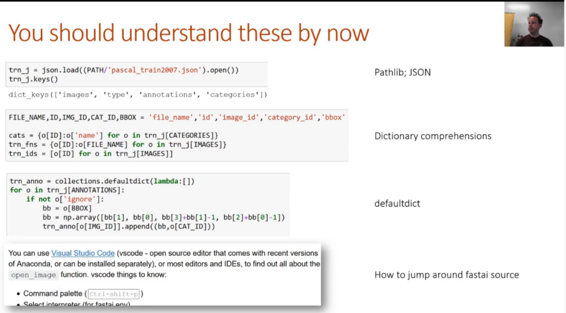


#### 从第1部分：

*   如何从DataLoader查看模型输入
*   如何查看模型输出


### 数据增强和边框 [[2:58](https://youtu.be/0frKXR-2PBY%3Ft%3D2m58s)] 

[笔记本](https://github.com/fastai/fastai/blob/master/courses/dl2/pascal.ipynb)

**快餐的尴尬粗糙边缘：**
_分类器_是具有因变量的任何分类或二项式。 与_回归_相反，任何具有因变量的东西都是连续的。 命名有点令人困惑，但将来会被整理出来。 这里， `continuous`是`True`因为我们的因变量是边框的坐标 - 因此这实际上是一个回归数据。

```
 tfms = tfms_from_model(f_model, sz, crop_type=CropType.NO,  aug_tfms=augs)  md = Image **Classifier** Data.from_csv(PATH, JPEGS, BB_CSV, tfms=tfms,  **continuous=True** , bs=4) 
```

#### 让我们创建一些数据增强 [[4:40](https://youtu.be/0frKXR-2PBY%3Ft%3D4m40s)] 

```
 augs = [RandomFlip(),  RandomRotate(30),  RandomLighting(0.1,0.1)] 
```

通常，我们使用Jeremy为我们创建的这些快捷方式，但它们只是随机增强的列表。 但是你可以很容易地创建自己的（大多数（如果不是全部）以“随机”开头）。


```
 tfms = tfms_from_model(f_model, sz, crop_type=CropType.NO,  aug_tfms=augs)  md = ImageClassifierData.from_csv(PATH, JPEGS, BB_CSV, tfms=tfms,  continuous=True, bs=4) 
```

```
 idx=3  fig,axes = plt.subplots(3,3, figsize=(9,9))  for i,ax in enumerate(axes.flat):  x,y=next(iter(md.aug_dl))  ima=md.val_ds.denorm(to_np(x))[idx]  b = bb_hw(to_np(y[idx]))  print(b)  show_img(ima, ax=ax)  draw_rect(ax, b) 
```

```
 _[ 115\. 63\. 240\. 311.]_  _[ 115\. 63\. 240\. 311.]_  _[ 115\. 63\. 240\. 311.]_  _[ 115\. 63\. 240\. 311.]_  _[ 115\. 63\. 240\. 311.]_  _[ 115\. 63\. 240\. 311.]_  _[ 115\. 63\. 240\. 311.]_  _[ 115\. 63\. 240\. 311.]_  _[ 115\. 63\. 240\. 311.]_ 
```

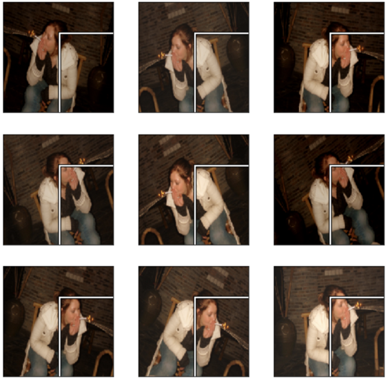

正如你所看到的，图像旋转并且光线变化，但是边框_没有移动_并且_位于错误的位置_  [[6:17](https://youtu.be/0frKXR-2PBY%3Ft%3D6m17s)] 。 当你的因变量是像素值或以某种方式连接到自变量时，这是数据增强的问题 - 它们需要一起增强。 正如你在边框坐标`[ 115\. 63\. 240\. 311.]`中所看到的，我们的图像是224乘224 - 所以它既不缩放也不裁剪。 因变量需要经历所有几何变换作为自变量。

要做到这一点 [[7:10](https://youtu.be/0frKXR-2PBY%3Ft%3D7m10s)] ，每个转换都有一个可选的`tfm_y`参数：

```
 augs = [RandomFlip(tfm_y=TfmType.COORD),  RandomRotate(30, tfm_y=TfmType.COORD),  RandomLighting(0.1,0.1, tfm_y=TfmType.COORD)] 
```

```
 tfms = tfms_from_model(f_model, sz, crop_type=CropType.NO,  tfm_y=TfmType.COORD, aug_tfms=augs)  md = ImageClassifierData.from_csv(PATH, JPEGS, BB_CSV, tfms=tfms,  continuous=True, bs=4) 
```

`TrmType.COORD`表示_y_值表示坐标。 这需要添加到所有增强以及`tfms_from_model` ，后者负责裁剪，缩放，调整大小，填充等。

```
 idx=3  fig,axes = plt.subplots(3,3, figsize=(9,9))  for i,ax in enumerate(axes.flat):  x,y=next(iter(md.aug_dl))  ima=md.val_ds.denorm(to_np(x))[idx]  b = bb_hw(to_np(y[idx]))  print(b)  show_img(ima, ax=ax)  draw_rect(ax, b) 
```

```
 _[ 48\. 34\. 112\. 188.]_  _[ 65\. 36\. 107\. 185.]_  _[ 49\. 27\. 131\. 195.]_  _[ 24\. 18\. 147\. 204.]_  _[ 61\. 34\. 113\. 188.]_  _[ 55\. 31\. 121\. 191.]_  _[ 52\. 19\. 144\. 203.]_  _[ 7\. 0\. 193\. 222.]_  _[ 52\. 38\. 105\. 182.]_ 
```


现在，边框随图像移动并位于正确的位置。 你可能会注意到，有时它看起来很奇怪，就像底行中间的那样。 这是我们所拥有信息的约束。 如果对象占据原始边框的角，则在图像旋转后，新的边框需要更大。 所以你必须**小心不要使用边框进行太高的旋转，**因为没有足够的信息让它们保持准确。 如果我们在做多边形或分段，我们就不会遇到这个问题。

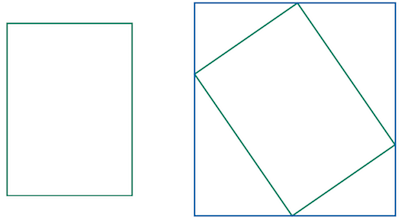

这就是箱子变大的原因


```
 tfm_y = TfmType.COORD  augs = [RandomFlip(tfm_y=tfm_y),  RandomRotate( **3** , **p=0.5** , tfm_y=tfm_y),  RandomLighting(0.05,0.05, tfm_y=tfm_y)] 
```

```
 tfms = tfms_from_model(f_model, sz, crop_type=CropType.NO,  tfm_y=tfm_y, aug_tfms=augs)  md = ImageClassifierData.from_csv(PATH, JPEGS, BB_CSV, tfms=tfms,  continuous=True) 
```

所以在这里，我们最多进行3度旋转以避免这个问题 [[9:14](https://youtu.be/0frKXR-2PBY%3Ft%3D9m14s)] 。 它也只旋转了一半的时间（ `p=0.5` ）。

#### custom_head  [[9:34](https://youtu.be/0frKXR-2PBY%3Ft%3D9m34s)] 

`learn.summary()`将通过模型运行一小批数据，并在每一层打印出张量的大小。 正如你所看到的，在`Flatten`层之前，张量的形状为512乘7乘7.所以如果它是1级张量（即单个向量），它的长度将是25088（512 * 7 * 7）并且这就是为什么我们的自定义标题的输入大小是25088.输出大小是4，因为它是边框坐标。

```
 head_reg4 = nn.Sequential(Flatten(), nn.Linear(25088,4))  learn = ConvLearner.pretrained(f_model, md, custom_head=head_reg4)  learn.opt_fn = optim.Adam  learn.crit = nn.L1Loss() 
```

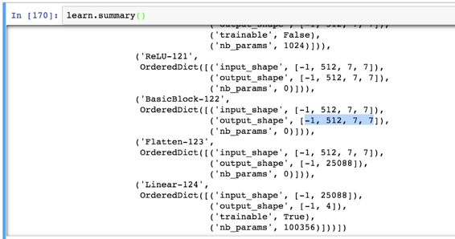

#### 单个物体检测 [[10:35](https://youtu.be/0frKXR-2PBY%3Ft%3D10m35s)] 

让我们将两者结合起来创建可以对每个图像中最大的对象进行分类和本地化的东西。

我们需要做三件事来训练神经网络：

1.  数据
2.  建筑
3.  损失函数

#### 1.提供数据

我们需要一个`ModelData`对象，其独立变量是图像，而因变量是边框坐标和类标签的元组。 有几种方法可以做到这一点，但这里有一个特别懒惰和方便的方法，Jeremy提出的方法是创建两个`ModelData`对象，表示我们想要的两个不同的因变量（一个带有边框坐标，一个带有类）。

```
 f_model=resnet34  sz=224  bs=64 
```

```
 val_idxs = get_cv_idxs(len(trn_fns))  tfms = tfms_from_model(f_model, sz, crop_type=CropType.NO,  tfm_y=TfmType.COORD, aug_tfms=augs) 
```

```
 md = ImageClassifierData.from_csv(PATH, JPEGS, **BB_CSV** , tfms=tfms,  continuous=True, val_idxs=val_idxs) 
```

```
 md2 = ImageClassifierData.from_csv(PATH, JPEGS, **CSV** ,  tfms=tfms_from_model(f_model, sz)) 
```

数据集可以是`__len__`和`__getitem__`任何数据集。 这是一个向现有数据集添加第二个标签的数据集：

```
 **class** **ConcatLblDataset** (Dataset):  **def** __init__(self, ds, y2): self.ds,self.y2 = ds,y2  **def** __len__(self): **return** len(self.ds)  **def** __getitem__(self, i):  x,y = self.ds[i]  **return** (x, (y,self.y2[i])) 
```

*   `ds` ：包含独立变量和因变量
*   `y2` ：包含其他因变量
*   `(x, (y,self.y2[i]))` ： `(x, (y,self.y2[i]))`返回一个自变量和两个因变量的组合。

我们将使用它将类添加到边框标签。

```
 trn_ds2 = ConcatLblDataset(md.trn_ds, md2.trn_y)  val_ds2 = ConcatLblDataset(md.val_ds, md2.val_y) 
```

这是一个示例因变量：

```
 val_ds2[0][1] 
```

```
 _(array([ 0., 49., 205., 180.], dtype=float32), 14)_ 
```

我们可以用这些新数据集替换数据加载器的数据集。

```
 md.trn_dl.dataset = trn_ds2  md.val_dl.dataset = val_ds2 
```

在绘制之前，我们必须对`denorm`的图像进行声明。

```
 x,y = next(iter(md.val_dl))  idx = 3  ima = md.val_ds.ds.denorm(to_np(x))[idx]  b = bb_hw(to_np(y[0][idx])); b 
```

```
 _array([ 52., 38., 106., 184.], dtype=float32)_ 
```

```
 ax = show_img(ima)  draw_rect(ax, b)  draw_text(ax, b[:2], md2.classes[y[1][idx]]) 
```


#### 2.选择建筑 [[13:54](https://youtu.be/0frKXR-2PBY%3Ft%3D13m54s)] 

该体系结构将与我们用于分类器和边框回归的体系结构相同，但我们将仅将它们组合在一起。 换句话说，如果我们有`c`类，那么我们在最后一层中需要的激活次数是4加`c` 。 4用于边框坐标和`c`概率（每个类一个）。

这次我们将使用额外的线性层，加上一些 Dropout ，以帮助我们训练更灵活的模型。 一般来说，我们希望我们的自定义头能够自己解决问题，如果它所连接的预训练骨干是合适的。 所以在这种情况下，我们试图做很多 - 分类器和边框回归，所以只是单个线性层似乎不够。 如果你想知道为什么在第一个`ReLU`之后没有`BatchNorm1d` ，ResNet主干已经将`BatchNorm1d`作为其最后一层。

```
 head_reg4 = nn.Sequential(  Flatten(),  nn.ReLU(),  nn.Dropout(0.5),  nn.Linear(25088,256),  nn.ReLU(),  nn.BatchNorm1d(256),  nn.Dropout(0.5),  nn.Linear(256, **4+len(cats)** ),  )  models = ConvnetBuilder(f_model, 0, 0, 0, custom_head=head_reg4)  learn = ConvLearner(md, models)  learn.opt_fn = optim.Adam 
```

#### 3.损失函数 [[15:46](https://youtu.be/0frKXR-2PBY%3Ft%3D15m46s)] 

损失函数需要查看这些`4 + len(cats)`激活并确定它们是否良好 - 这些数字是否准确反映了图像中最大对象的位置和类别。 我们知道如何做到这一点。 对于前4次激活，我们将像以前一样使用L1Loss（L1Loss就像均方误差 - 而不是平方误差之和，它使用绝对值之和）。 对于其余的激活，我们可以使用交叉熵损失。

```
 **def** detn_loss(input, target):  bb_t,c_t = target  bb_i,c_i = input[:, :4], input[:, 4:]  bb_i = F.sigmoid(bb_i)*224  _# I looked at these quantities separately first then picked a_  _# multiplier to make them approximately equal_  **return** F.l1_loss(bb_i, bb_t) + F.cross_entropy(c_i, c_t)*20 
```

```
 **def** detn_l1(input, target):  bb_t,_ = target  bb_i = input[:, :4]  bb_i = F.sigmoid(bb_i)*224  **return** F.l1_loss(V(bb_i),V(bb_t)).data 
```

```
 **def** detn_acc(input, target):  _,c_t = target  c_i = input[:, 4:]  **return** accuracy(c_i, c_t) 
```

```
 learn.crit = detn_loss  learn.metrics = [detn_acc, detn_l1] 
```

*   `input` ：激活
*   `target` ：基本事实
*   `bb_t,c_t = target` ：我们的自定义数据集返回一个包含边框坐标和类的元组。 这项任务将对它们进行解构。
*   `bb_i,c_i = input[:, :4], input[:, 4:]` ：第一个`:`用于批量维度。
*   `b_i = F.sigmoid(bb_i)*224` ：我们知道我们的图像是224乘`Sigmoid`将强制它在0和1之间，并将它乘以224以帮助我们的神经网络在它的范围内成为。

**问题：**作为一般规则，在ReLU  [[18:02](https://youtu.be/0frKXR-2PBY%3Ft%3D18m2s)] 之前或之后放置BatchNorm会更好吗？ Jeremy建议将它放在ReLU之后，因为BathNorm意味着走向零均值的单标准偏差。 因此，如果你把ReLU放在它之后，你将它截断为零，这样就无法创建负数。 但是如果你把ReLU然后放入BatchNorm，它确实具有这种能力并且给出稍微好一些的结果。 话虽如此，无论如何都不是太大的交易。 你在课程的这一部分看到，大多数时候，Jeremy做了ReLU然后是BatchNorm，但是当他想要与论文保持一致时，有时则相反。

**问题** ：BatchNorm之后使用dropout的直觉是什么？ BatchNorm是否已经做好了正规化 [[19:12](https://youtu.be/0frKXR-2PBY%3Ft%3D19m12s)] 的工作？ BatchNorm可以正常化，但如果你回想第1部分，我们讨论了一些事情，我们这样做是为了避免过拟合，添加BatchNorm就像数据增强一样。 但你完全有可能仍然过拟合。 关于 Dropout 的一个好处是，它有一个参数来说明 Dropout 的数量。 参数是特别重要的参数，决定了规则的多少，因为它可以让你构建一个漂亮的大参数化模型，然后决定规范它的程度。 Jeremy倾向于总是从`p=0`开始 Dropout ，然后当他添加正则化时，他可以改变 Dropout 参数而不用担心他是否保存了他想要能够加载它的模型，但如果他有在一个中丢弃层而在另一个中没有，它将不再加载。 所以这样，它保持一致。

现在我们有输入和目标，我们可以计算L1损失并添加交叉熵 [[20:39](https://youtu.be/0frKXR-2PBY%3Ft%3D20m39s)] ：

`F.l1_loss(bb_i, bb_t) + F.cross_entropy(c_i, c_t)*20`

这是我们的损失功能。 交叉熵和L1损失可能具有完全不同的尺度 - 在这种情况下，损失函数中较大的一个将占主导地位。 在这种情况下，杰里米打印出这些值，并发现如果我们将交叉熵乘以20会使它们的大小相同。

```
 lr=1e-2  learn.fit(lr, 1, cycle_len=3, use_clr=(32,5)) 
```

```
 _epoch trn_loss val_loss detn_acc detn_l1_  _0 72.036466 45.186367 0.802133 32.647586_  _1 51.037587 36.34964 0.828425 25.389733_  _2 41.4235 35.292709 0.835637 24.343577_ 
```

```
 _[35.292709, 0.83563701808452606, 24.343576669692993]_ 
```

在训练时打印出信息很好，所以我们抓住L1损失并将其作为指标添加。

```
 learn.save('reg1_0')  learn.freeze_to(-2)  lrs = np.array([lr/100, lr/10, lr])  learn.fit(lrs/5, 1, cycle_len=5, use_clr=(32,10)) 
```

```
 epoch trn_loss val_loss detn_acc detn_l1  0 34.448113 35.972973 0.801683 22.918499  1 28.889909 33.010857 0.830379 21.689888  2 24.237017 30.977512 0.81881 20.817996  3 21.132993 30.60677 0.83143 20.138552  4 18.622983 30.54178 0.825571 19.832196 
```

```
 [30.54178, 0.82557091116905212, 19.832195997238159] 
```

```
 learn.unfreeze()  learn.fit(lrs/10, 1, cycle_len=10, use_clr=(32,10)) 
```

```
 epoch trn_loss val_loss detn_acc detn_l1  0 15.957164 31.111507 0.811448 19.970753  1 15.955259 32.597153 0.81235 20.111022  2 15.648723 32.231941 0.804087 19.522853  3 14.876172 30.93821 0.815805 19.226574  4 14.113872 31.03952 0.808594 19.155093  5 13.293885 29.736671 0.826022 18.761728  6 12.562566 30.000023 0.827524 18.82006  7 11.885125 30.28841 0.82512 18.904158  8 11.498326 30.070133 0.819712 18.635296  9 11.015841 30.213772 0.815805 18.551489 
```

```
 [30.213772, 0.81580528616905212, 18.551488876342773] 
```

检测精度低至80，与以前相同。 这并不奇怪，因为ResNet旨在进行分类，因此我们不希望以这种简单的方式改进事物。 它当然不是为了进行边框回归而设计的。 它显然实际上是以不关心几何的方式设计的 - 它需要最后7到7个激活网格并将它们平均放在一起扔掉所有关于来自何处的信息。

有趣的是，当我们同时进行准确性（分类）和边框时，L1似乎比我们刚进行边框回归时要好一些 [[22:46](https://youtu.be/0frKXR-2PBY%3Ft%3D22m46s)] 。 如果这对你来说是违反直觉的，那么这将是本课后要考虑的主要事项之一，因为这是一个非常重要的想法。 这个想法是这样的 - 弄清楚图像中的主要对象是什么，是一种困难的部分。 然后确定边框的确切位置以及它的类别是一个简单的部分。 所以当你有一个网络既说对象是什么，对象在哪里时，它就会分享关于找到对象的所有计算。 所有共享计算都非常有效。 当我们返回传播类和地方中的错误时，这就是有助于计算找到最大对象的所有信息。 因此，只要你有多个任务分享这些任务完成工作所需要的概念，他们很可能应该至少共享网络的某些层。 今天晚些时候，我们将看一个模型，其中除了最后一层之外，大多数层都是共享的。

结果如下 [[24:34](https://youtu.be/0frKXR-2PBY%3Ft%3D24m34s)] 。 和以前一样，当图像中有单个主要对象时，它做得很好。

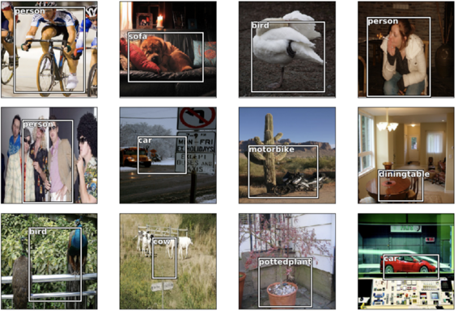

### 多标签分类 [[25:29](https://youtu.be/0frKXR-2PBY%3Ft%3D25m29s)] 

[笔记本](https://github.com/fastai/fastai/blob/master/courses/dl2/pascal-multi.ipynb)

我们希望继续构建比上一个模型稍微复杂的模型，这样如果某些东西停止工作，我们就会确切地知道它在哪里破碎。 以下是以前笔记本的功能：

```
 %matplotlib inline  %reload_ext autoreload  %autoreload 2 
```

```
 **from** **fastai.conv_learner** **import** *  **from** **fastai.dataset** **import** *  **import** **json** , **pdb**  **from** **PIL** **import** ImageDraw, ImageFont  **from** **matplotlib** **import** patches, patheffects  torch.backends.cudnn.benchmark= **True** 
```

#### 建立

```
 PATH = Path('data/pascal')  trn_j = json.load((PATH / 'pascal_train2007.json').open())  IMAGES,ANNOTATIONS,CATEGORIES = ['images', 'annotations',  'categories']  FILE_NAME,ID,IMG_ID,CAT_ID,BBOX = 'file_name','id','image_id',  'category_id','bbox'  cats = dict((o[ID], o['name']) **for** o **in** trn_j[CATEGORIES])  trn_fns = dict((o[ID], o[FILE_NAME]) **for** o **in** trn_j[IMAGES])  trn_ids = [o[ID] **for** o **in** trn_j[IMAGES]]  JPEGS = 'VOCdevkit/VOC2007/JPEGImages'  IMG_PATH = PATH/JPEGS 
```

```
 **def** get_trn_anno():  trn_anno = collections.defaultdict( **lambda** :[])  **for** o **in** trn_j[ANNOTATIONS]:  **if** **not** o['ignore']:  bb = o[BBOX]  bb = np.array([bb[1], bb[0], bb[3]+bb[1]-1,  bb[2]+bb[0]-1])  trn_anno[o[IMG_ID]].append((bb,o[CAT_ID]))  **return** trn_anno  trn_anno = get_trn_anno() 
```

```
 **def** show_img(im, figsize= **None** , ax= **None** ):  **if** **not** ax: fig,ax = plt.subplots(figsize=figsize)  ax.imshow(im)  ax.set_xticks(np.linspace(0, 224, 8))  ax.set_yticks(np.linspace(0, 224, 8))  ax.grid()  ax.set_yticklabels([])  ax.set_xticklabels([])  **return** ax  **def** draw_outline(o, lw):  o.set_path_effects([patheffects.Stroke(  linewidth=lw, foreground='black'), patheffects.Normal()])  **def** draw_rect(ax, b, color='white'):  patch = ax.add_patch(patches.Rectangle(b[:2], *b[-2:],  fill= **False** , edgecolor=color, lw=2))  draw_outline(patch, 4)  **def** draw_text(ax, xy, txt, sz=14, color='white'):  text = ax.text(*xy, txt,  verticalalignment='top', color=color, fontsize=sz,  weight='bold')  draw_outline(text, 1) 
```

```
 **def** bb_hw(a): **return** np.array([a[1],a[0],a[3]-a[1],a[2]-a[0]])  **def** draw_im(im, ann):  ax = show_img(im, figsize=(16,8))  **for** b,c **in** ann:  b = bb_hw(b)  draw_rect(ax, b)  draw_text(ax, b[:2], cats[c], sz=16)  **def** draw_idx(i):  im_a = trn_anno[i]  im = open_image(IMG_PATH/trn_fns[i])  draw_im(im, im_a) 
```

#### 多级 [[26:12](https://youtu.be/0frKXR-2PBY%3Ft%3D26m12s)] 

```
 MC_CSV = PATH/'tmp/mc.csv' 
```

```
 trn_anno[12] 
```

```
 _[(array([ 96, 155, 269, 350]), 7)]_ 
```

```
 mc = [set([cats[p[1]] **for** p **in** trn_anno[o]]) **for** o **in** trn_ids]  mcs = [' '.join(str(p) **for** p **in** o) **for** o **in** mc] 
```

```
 df = pd.DataFrame({'fn': [trn_fns[o] **for** o **in** trn_ids],  'clas': mcs}, columns=['fn','clas'])  df.to_csv(MC_CSV, index= **False** ) 
```

其中一名学生指出，通过使用Pandas，我们可以比使用`collections.defaultdict`更简单，并分享[这个要点](https://gist.github.com/binga/1bc4ebe5e41f670f5954d2ffa9d6c0ed) 。 你越了解熊猫，你越经常意识到它是解决许多不同问题的好方法。

**问题** ：当你在较小的模型上逐步构建时，是否将它们重新用作预先训练过的权重？ 或者你把它扔掉然后从头开始重新训练 [[27:11](https://youtu.be/0frKXR-2PBY%3Ft%3D27m11s)] ？ 当Jeremy在他这样做时想出东西时，他通常会倾向于扔掉，因为重复使用预先训练过的砝码会带来不必要的复杂性。 然而，如果他试图达到他可以在真正大的图像上进行训练的程度，他通常会从更小的角度开始，并且经常重新使用这些权重。

```
 f_model=resnet34  sz=224  bs=64 
```

```
 tfms = tfms_from_model(f_model, sz, crop_type=CropType.NO)  md = ImageClassifierData.from_csv(PATH, JPEGS, MC_CSV, tfms=tfms) 
```

```
 learn = ConvLearner.pretrained(f_model, md)  learn.opt_fn = optim.Adam 
```

```
 lr = 2e-2 
```

```
 learn.fit(lr, 1, cycle_len=3, use_clr=(32,5)) 
```

```
 _epoch trn_loss val_loss <lambda>_  _0 0.104836 0.085015 0.972356_  _1 0.088193 0.079739 0.972461_  _2 0.072346 0.077259 0.974114_ 
```

```
 _[0.077258907, 0.9741135761141777]_ 
```

```
 lrs = np.array([lr/100, lr/10, lr]) 
```

```
 learn.freeze_to(-2) 
```

```
 learn.fit(lrs/10, 1, cycle_len=5, use_clr=(32,5)) 
```

```
 _epoch trn_loss val_loss <lambda>_  _0 0.063236 0.088847 0.970681_  _1 0.049675 0.079885 0.973723_  _2 0.03693 0.076906 0.975601_  _3 0.026645 0.075304 0.976187_  _4 0.018805 0.074934 0.975165_ 
```

```
 _[0.074934497, 0.97516526281833649]_ 
```

```
 learn.save('mclas') 
```

```
 learn.load('mclas') 
```

```
 y = learn.predict()  x,_ = next(iter(md.val_dl))  x = to_np(x) 
```

```
 fig, axes = plt.subplots(3, 4, figsize=(12, 8))  **for** i,ax **in** enumerate(axes.flat):  ima=md.val_ds.denorm(x)[i]  ya = np.nonzero(y[i]>0.4)[0]  b = ' **\n** '.join(md.classes[o] **for** o **in** ya)  ax = show_img(ima, ax=ax)  draw_text(ax, (0,0), b)  plt.tight_layout() 
```


多级分类非常简单 [[28:28](https://youtu.be/0frKXR-2PBY%3Ft%3D28m28s)] 。 一个小调整是在这一行中使用`set` ，以便每个对象类型出现一次：

```
 mc = [ **set** ([cats[p[1]] **for** p **in** trn_anno[o]]) **for** o **in** trn_ids] 
```

#### SSD和YOLO  [[29:10](https://youtu.be/0frKXR-2PBY%3Ft%3D29m10s)] 

我们有一个输入图像，它通过一个转换网络，输出一个大小为`4+c`的向量，其中`c=len(cats)` 。 这为我们提供了一个最大物体的物体探测器。 现在让我们创建一个找到16个对象的对象。 显而易见的方法是采用最后一个线性层而不是`4+c`输出，我们可以有`16x(4+c)`输出。 这给了我们16组类概率和16组边框坐标。 然后我们只需要一个损失函数来检查这16组边框是否正确表示了图像中最多16个对象（我们稍后会进入损失函数）。

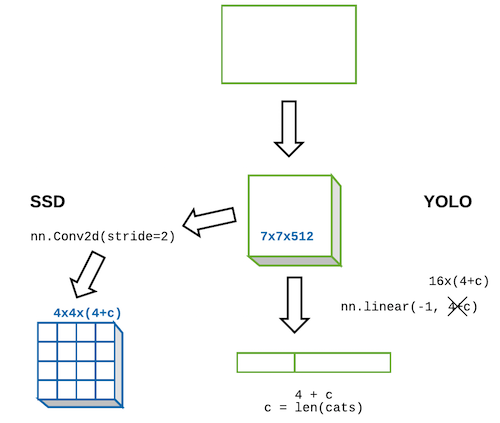

第二种方法是使用`nn.linear`而不是使用`nn.linear` ，如果相反，我们从ResNet卷积主干中获取并添加了一个`nn.Conv2d`和stride 2  [[31:32](https://youtu.be/0frKXR-2PBY%3Ft%3D31m32s)] ？ 这将给我们一个`4x4x[# of filters]`张量 - 这里让我们使它成为`4x4x(4+c)`这样我们得到一个张量，其中元素的数量正好等于我们想要的元素数量。 现在，如果我们创建了一个`4x4x(4+c)`张量的损失函数，并将其映射到图像中的16个对象，并检查每个对象是否通过这些`4+c`激活正确表示，这也可以。 事实证明，这两种方法实际上都在使用 [[33:48](https://youtu.be/0frKXR-2PBY%3Ft%3D33m48s)] 。 输出是来自完全连接的线性层的一个大长向量的方法被称为[YOLO（You Only Look Once）](https://arxiv.org/abs/1506.02640)的一类模型使用，在其他地方，卷积激活的方法被以某些东西开始的模型使用称为[SSD（单发探测器）](https://arxiv.org/abs/1512.02325) 。 由于这些事情在2015年末非常相似，所以事情已经转向SSD。 所以今天早上， [YOLO版本3](https://pjreddie.com/media/files/papers/YOLOv3.pdf)出现了，现在正在做SSD，这就是我们要做的事情。 我们还将了解为什么这也更有意义。

#### 锚箱 [[35:04](https://youtu.be/0frKXR-2PBY%3Ft%3D35m04s)] 


让我们假设我们有另一个`Conv2d(stride=2)`然后我们将有`2x2x(4+c)`张量。 基本上，它创建一个看起来像这样的网格：

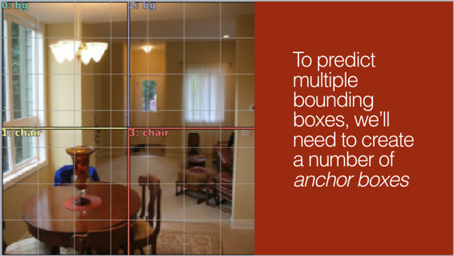

这就是第二额外卷积步幅2层的激活的几何形状。 请记住，步幅2卷积对激活的几何形状做同样的事情，如步幅1卷积，然后是假设填充正常的最大值。

我们来谈谈我们在这里可以做些什么 [[36:09](https://youtu.be/0frKXR-2PBY%3Ft%3D36m9s)] 。 我们希望这些网格单元中的每一个都负责查找图像该部分中的最大对象。

#### 感受野 [[37:20](https://youtu.be/0frKXR-2PBY%3Ft%3D37m20s)] 

为什么我们关心的是我们希望每个卷积网格单元负责查找图像相应部分中的内容？ 原因是因为卷积网格单元的感知域。 基本思想是，在整个卷积层中，这些张量的每一部分都有一个感知场，这意味着输入图像的哪一部分负责计算该细胞。 像生活中的所有事情一样，最简单的方法就是用Excel  [[38:01](https://youtu.be/0frKXR-2PBY%3Ft%3D38m1s)] 。

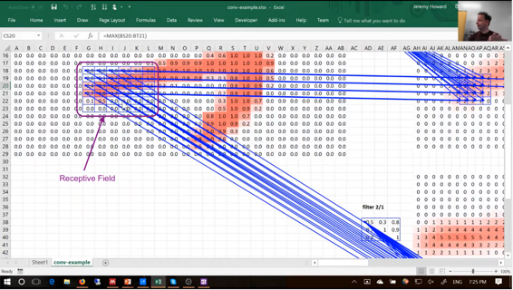

进行一次激活（在这种情况下，在maxpool层中）让我们看看它来自哪里 [[38:45](https://youtu.be/0frKXR-2PBY%3Ft%3D38m45s)] 。 在excel中，你可以执行公式→跟踪先例。 一直追溯到输入层，你可以看到它来自图像的这个6 x 6部分（以及过滤器）。 更重要的是，中间部分有很多权重从外面的细胞出来只有一个权重出来的地方。 因此，我们将这个6 x 6细胞称为我们选择的一次激活的感受野。


3x3卷积，不透明度为15％ - 显然盒子的中心有更多的依赖性


请注意，感知字段不只是说它是这个框，而且框的中心有更多的依赖关系 [[40:27](https://youtu.be/0frKXR-2PBY%3Ft%3D40m27s)] 这是一个非常重要的概念，当涉及到理解架构并理解为什么会员网以他们的方式工作时。

#### 建筑 [[41:18](https://youtu.be/0frKXR-2PBY%3Ft%3D41m18s)] 

架构是，我们将有一个ResNet主干，然后是一个或多个2D卷积（现在一个），这将给我们一个`4x4`网格。

```
 **class** **StdConv** (nn.Module):  **def** __init__(self, nin, nout, stride=2, drop=0.1):  super().__init__()  self.conv = nn.Conv2d(nin, nout, 3, stride=stride,  padding=1)  self.bn = nn.BatchNorm2d(nout)  self.drop = nn.Dropout(drop)  **def** forward(self, x):  **return** self.drop(self.bn(F.relu(self.conv(x))))  **def** flatten_conv(x,k):  bs,nf,gx,gy = x.size()  x = x.permute(0,2,3,1).contiguous()  **return** x.view(bs,-1,nf//k) 
```

```
 **class** **OutConv** (nn.Module):  **def** __init__(self, k, nin, bias):  super().__init__()  self.k = k  self.oconv1 = nn.Conv2d(nin, (len(id2cat)+1)*k, 3,  padding=1)  self.oconv2 = nn.Conv2d(nin, 4*k, 3, padding=1)  self.oconv1.bias.data.zero_().add_(bias)  **def** forward(self, x):  **return** [flatten_conv(self.oconv1(x), self.k),  flatten_conv(self.oconv2(x), self.k)] 
```

```
 **class** **SSD_Head** (nn.Module):  **def** __init__(self, k, bias):  super().__init__()  self.drop = nn.Dropout(0.25)  self.sconv0 = StdConv(512,256, stride=1)  self.sconv2 = StdConv(256,256)  self.out = OutConv(k, 256, bias)  **def** forward(self, x):  x = self.drop(F.relu(x))  x = self.sconv0(x)  x = self.sconv2(x)  **return** self.out(x)  head_reg4 = SSD_Head(k, -3.)  models = ConvnetBuilder(f_model, 0, 0, 0, custom_head=head_reg4)  learn = ConvLearner(md, models)  learn.opt_fn = optim.Adam 
```

**SSD_Head**

1.  我们从ReLU和 Dropout 开始
2.  然后迈步1卷积。 我们从步幅1卷积开始的原因是因为它根本不会改变几何 - 它只是让我们添加一个额外的计算层。 它让我们不仅创建一个线性层，而且现在我们在自定义头中有一个小的神经网络。 `StdConv`在上面定义 - 它执行卷积，ReLU，BatchNorm和dropout。 你看到的大多数研究代码都不会定义这样的类，而是一次又一次地写出整个事物。 不要那样。 重复的代码会导致错误和理解不足。
3.  跨步2卷积 [[44:56](https://youtu.be/0frKXR-2PBY%3Ft%3D44m56s)] 
4.  最后，步骤3的输出为`4x4` ，并传递给`OutConv` 。 `OutConv`有两个独立的卷积层，每个卷层都是步长1，因此它不会改变输入的几何形状。 其中一个是类的数量的长度（现在忽略`k`而`+1`是“背景” - 即没有检测到对象），另一个的长度是4.而不是有一个输出`4+c`转换层，让我们有两个转换层，并在列表中返回它们的输出。 这允许这些层专门化一点点。 我们谈到了这个想法，当你有多个任务时，他们可以共享层，但他们不必共享所有层。 在这种情况下，我们创建分类器以及创建和创建边框回归的两个任务共享除最后一个层之外的每个层。
5.  最后，我们弄平了卷积，因为杰里米写了损失函数，期望压低张量，但我们可以完全重写它不要那样做。

#### [Fastai编码风格](https://github.com/fastai/fastai/blob/master/docs/style.md)  [[42:58](https://youtu.be/0frKXR-2PBY%3Ft%3D42m58s)] 

第一稿于本周发布。 它非常依赖于说明性编程的思想，即编程代码应该是一种可以用来解释一个想法的东西，理想情况下就像数学符号一样，对于理解你的编码方法的人来说。 这个想法可以追溯到很长一段时间，但最好的描述可能是杰里米最伟大的计算机科学英雄Ken Iverson在1979年的图灵奖演讲中。 他从1964年以来一直在研究它，但1964年是他发布的这种方法的第一个例子，即APL，25年后，他赢得了图灵奖。 然后他将接力棒传给了他的儿子Eric Iverson。 Fastai风格指南试图采用其中一些想法。

#### 损失函数 [[47:44](https://youtu.be/0frKXR-2PBY%3Ft%3D47m44s)] 

损失函数需要查看这16组激活中的每一组，每组激活具有四个边框坐标和`c+1`类概率，并确定这些激活是否离最近该网格单元的对象很近或远离在图像中。 如果没有，那么它是否正确预测背景。 事实证明这很难。

#### 匹配问题 [[48:43](https://youtu.be/0frKXR-2PBY%3Ft%3D48m43s)] 

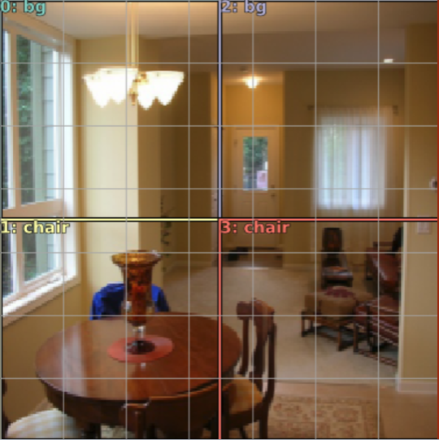

损失函数需要获取图像中的每个对象并将它们与这些卷积网格单元中的一个匹配，以说“此网格单元负责此特定对象”，因此它可以继续说“好吧，有多接近4个坐标和类概率有多接近。

这是我们的目标 [[49:56](https://youtu.be/0frKXR-2PBY%3Ft%3D49m56s)] ：


我们的因变量看起来像左边的变量，我们的最终卷积层将是`4x4x(c+1)`在这种情况下`c=20` 。 然后我们将其展平成一个向量。 我们的目标是提出一个函数，它接受一个因变量以及最终从模型中出来的一些特定的激活，并且如果这些激活不是地面实况边框的良好反映，则返回更高的数字; 如果它是一个很好的反映，或更低的数字。

#### 测试 [[51:58](https://youtu.be/0frKXR-2PBY%3Ft%3D51m58s)] 

```
 x,y = next(iter(md.val_dl))  x,y = V(x),V(y)  learn.model.eval()  batch = learn.model(x)  b_clas,b_bb = batch  b_clas.size(),b_bb.size() 
```

```
 _(torch.Size([64, 16, 21]), torch.Size([64, 16, 4]))_ 
```

确保这些形状有意义。 现在让我们看看基础事实 [[53:24](https://youtu.be/0frKXR-2PBY%3Ft%3D53m24s)] ：

```
 idx=7  b_clasi = b_clas[idx]  b_bboxi = b_bb[idx]  ima=md.val_ds.ds.denorm(to_np(x))[idx]  bbox,clas = get_y(y[0][idx], y[1][idx])  bbox,clas 
```

```
 _(Variable containing:_  _0.6786 0.4866 0.9911 0.6250_  _0.7098 0.0848 0.9911 0.5491_  _0.5134 0.8304 0.6696 0.9063_  _[torch.cuda.FloatTensor of size 3x4 (GPU 0)], Variable containing:_  _8_  _10_  _17_  _[torch.cuda.LongTensor of size 3 (GPU 0)])_ 
```

请注意，边框坐标已缩放到0到1之间 - 基本上我们将图像视为1x1，因此它们相对于图像的大小。

我们已经有`show_ground_truth`函数。 这个`torch_gt` （gt：地面实况）函数只是将张量转换为numpy数组。

```
 **def** torch_gt(ax, ima, bbox, clas, prs= **None** , thresh=0.4):  **return** show_ground_truth(ax, ima, to_np((bbox*224).long()),  to_np(clas),  to_np(prs) **if** prs **is** **not** **None** **else** **None** , thresh) 
```

```
 fig, ax = plt.subplots(figsize=(7,7))  torch_gt(ax, ima, bbox, clas) 
```

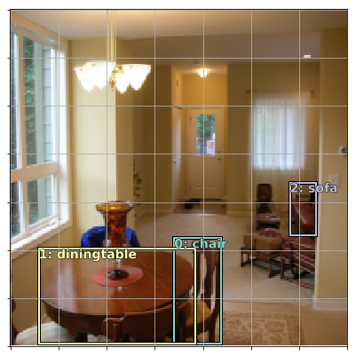

以上是一个基本事实。 这是我们最终卷积层的`4x4`网格单元格 [[54:44](https://youtu.be/0frKXR-2PBY%3Ft%3D54m44s)] ：

```
 fig, ax = plt.subplots(figsize=(7,7))  torch_gt(ax, ima, anchor_cnr, b_clasi.max(1)[1]) 
```


每个方形盒子，不同的纸张都称它们为不同的东西。 你将听到的三个术语是：锚箱，先前的箱子或默认箱子。 我们将坚持使用术语锚箱。

我们要为这个损失函数做些什么，我们将要经历一个匹配问题，我们将采用这16个方框中的每一个，看看这三个地面实况对象中哪一个具有最大的重叠量给定方 [[55:21](https://youtu.be/0frKXR-2PBY%3Ft%3D55m21s)] 。 要做到这一点，我们必须有一些方法来测量重叠量，这个标准函数叫做[Jaccard index](https://en.wikipedia.org/wiki/Jaccard_index) （IoU）。

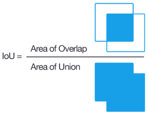

我们将通过找到三个物体中的每一个与16个锚箱中的每一个的Jaccard重叠 [[57:11](https://youtu.be/0frKXR-2PBY%3Ft%3D57m11s)] 。 这将给我们一个`3x16`矩阵。

以下是我们所有锚箱的_坐标_ （中心，高度，宽度）：

```
 anchors 
```

```
 _Variable containing:_  _0.1250 0.1250 0.2500 0.2500_  _0.1250 0.3750 0.2500 0.2500_  _0.1250 0.6250 0.2500 0.2500_  _0.1250 0.8750 0.2500 0.2500_  _0.3750 0.1250 0.2500 0.2500_  _0.3750 0.3750 0.2500 0.2500_  _0.3750 0.6250 0.2500 0.2500_  _0.3750 0.8750 0.2500 0.2500_  _0.6250 0.1250 0.2500 0.2500_  _0.6250 0.3750 0.2500 0.2500_  _0.6250 0.6250 0.2500 0.2500_  _0.6250 0.8750 0.2500 0.2500_  _0.8750 0.1250 0.2500 0.2500_  _0.8750 0.3750 0.2500 0.2500_  _0.8750 0.6250 0.2500 0.2500_  _0.8750 0.8750 0.2500 0.2500_  _[torch.cuda.FloatTensor of size 16x4 (GPU 0)]_ 
```

以下是3个地面实况对象和16个锚箱之间的重叠量：

```
 overlaps = jaccard(bbox.data, anchor_cnr.data)  overlaps 
```

```
 Columns 0 to 7  0.0000 0.0000 0.0000 0.0000 0.0000 0.0000 0.0000 0.0000 0.0000 0.0000 0.0000 0.0000 0.0000 0.0000 0.0000 0.0000 0.0000 0.0000 0.0000 0.0000 0.0000 0.0000 0.0000 0.0000 
```

```
 Columns 8 to 15  0.0000 0.0091 0.0922 0.0000 0.0000 0.0315 0.3985 0.0000 0.0356 0.0549 0.0103 0.0000 0.2598 0.4538 0.0653 0.0000 0.0000 0.0000 0.0000 0.1897 0.0000 0.0000 0.0000 0.0000 [torch.cuda.FloatTensor of size 3x16 (GPU 0)] 
```

我们现在可以做的是我们可以采用维度1（行方向）的最大值，它将告诉我们每个地面实况对象，与某些网格单元重叠的最大量以及索引：

```
 overlaps.max(1) 
```

```
 _(_  _0.3985_  _0.4538_  _0.1897_  _[torch.cuda.FloatTensor of size 3 (GPU 0)],_  _14_  _13_  _11_  _[torch.cuda.LongTensor of size 3 (GPU 0)])_ 
```

我们还将查看尺寸0（列方向）上的最大值，它将告诉我们所有地面[实例](https://youtu.be/0frKXR-2PBY%3Ft%3D59m8s)对象中每个网格单元的最大重叠量 [[59:08](https://youtu.be/0frKXR-2PBY%3Ft%3D59m8s)] ：

```
 overlaps.max(0) 
```

```
 _(_  _0.0000_  _0.0000_  _0.0000_  _0.0000_  _0.0000_  _0.0000_  _0.0000_  _0.0000_  _0.0356_  _0.0549_  _0.0922_  _0.1897_  _0.2598_  _0.4538_  _0.3985_  _0.0000_  _[torch.cuda.FloatTensor of size 16 (GPU 0)],_  _0_  _0_  _0_  _0_  _0_  _0_  _0_  _0_  _1_  _1_  _0_  _2_  _1_  _1_  _0_  _0_  _[torch.cuda.LongTensor of size 16 (GPU 0)])_ 
```

这里特别有趣的是它告诉我们每个网格单元最重要的地面实况对象的索引是什么。 零在这里有点过载 - 零可能意味着重叠量为零或其最大重叠与对象索引为零。 事实证明不仅仅是问题，而是仅仅是因为。

有一个名为`map_to_ground_truth`的函数，我们现在不用担心 [[59:57](https://youtu.be/0frKXR-2PBY%3Ft%3D59m57s)] 。 它是超级简单的代码，但考虑起来有点尴尬。 基本上它的作用是它以SSD论文中描述的方式组合这两组重叠，以将每个锚盒分配给基础事实对象。 它分配的方式是三个（行方式最大）中的每一个按原样分配。 对于其余的锚箱，它们被分配给它们具有至少0.5的重叠的任何东西（逐列）。 If neither applies, it is considered to be a cell which contains background.

```
 gt_overlap,gt_idx = map_to_ground_truth(overlaps)  gt_overlap,gt_idx 
```

```
 _(_ 
 0.0000 
 0.0000 
 0.0000 
 0.0000 
 0.0000 
 0.0000 
 0.0000 
 0.0000 
 0.0356 
 0.0549 
 0.0922 
 1.9900 
 0.2598 
 1.9900 
 1.9900 
 0.0000 
 [torch.cuda.FloatTensor of size 16 (GPU 0)], 
 _0_  _0_  _0_  _0_  _0_  _0_  _0_  _0_  _1_  _1_  _0_  _2_  _1_  _1_  _0_  _0_ 
 [torch.cuda.LongTensor of size 16 (GPU 0)]) 
```

现在你可以看到所有作业的列表 [[1:01:05](https://youtu.be/0frKXR-2PBY%3Ft%3D1h1m5s)] 。 任何`gt_overlap &lt; 0.5`都会被分配背景。 三行最大锚箱具有较高的数字以强制分配。 现在我们可以将这些值组合到类中：

```
 gt_clas = clas[gt_idx]; gt_clas 
```

```
 _Variable containing:_  _8_  _8_  _8_  _8_  _8_  _8_  _8_  _8_  _10_  _10_  _8_  _17_  _10_  _10_  _8_  _8_  _[torch.cuda.LongTensor of size 16 (GPU 0)]_ 
```

然后添加一个阈值，最后得出预测的三个类：

```
 thresh = 0.5  pos = gt_overlap > thresh  pos_idx = torch.nonzero(pos)[:,0]  neg_idx = torch.nonzero(1-pos)[:,0]  pos_idx 
```

```
 _11_  _13_  _14_  _[torch.cuda.LongTensor of size 3 (GPU 0)]_ 
```

以下是每个锚箱的预测：

```
 gt_clas[1-pos] = len(id2cat)  [id2cat[o] **if** o<len(id2cat) **else** 'bg' **for** o **in** gt_clas.data] 
```

```
 _['bg',_  _'bg',_  _'bg',_  _'bg',_  _'bg',_  _'bg',_  _'bg',_  _'bg',_  _'bg',_  _'bg',_  _'bg',_  _'sofa',_  _'bg',_  _'diningtable',_  _'chair',_  _'bg']_ 
```

这就是匹配阶段 [[1:02:29](https://youtu.be/0frKXR-2PBY%3Ft%3D1h2m29s)] 。 对于L1损失，我们可以：

1.  采取匹配的激活（ `pos_idx = [11, 13, 14]` ）
2.  从那些真实的边框中减去
3.  取差异的绝对值
4.  采取的意思。

对于分类，我们可以做一个交叉熵

```
 gt_bbox = bbox[gt_idx]  loc_loss = ((a_ic[pos_idx] - gt_bbox[pos_idx]).abs()).mean()  clas_loss = F.cross_entropy(b_clasi, gt_clas)  loc_loss,clas_loss 
```

```
 _(Variable containing:_  _1.00000e-02 *_  _6.5887_  _[torch.cuda.FloatTensor of size 1 (GPU 0)], Variable containing:_  _1.0331_  _[torch.cuda.FloatTensor of size 1 (GPU 0)])_ 
```

我们最终会得到16个预测的边框，其中大多数都是背景框。 如果你想知道它在背景的边框中预测了什么，答案是完全忽略它。

```
 fig, axes = plt.subplots(3, 4, figsize=(16, 12))  **for** idx,ax **in** enumerate(axes.flat):  ima=md.val_ds.ds.denorm(to_np(x))[idx]  bbox,clas = get_y(y[0][idx], y[1][idx])  ima=md.val_ds.ds.denorm(to_np(x))[idx]  bbox,clas = get_y(bbox,clas); bbox,clas  a_ic = actn_to_bb(b_bb[idx], anchors)  torch_gt(ax, ima, a_ic, b_clas[idx].max(1)[1],  b_clas[idx].max(1)[0].sigmoid(), 0.01)  plt.tight_layout() 
```


#### 调整1.我们如何解释激活 [[1:04:16](https://youtu.be/0frKXR-2PBY%3Ft%3D1h4m16s)] ？

我们解释激活的方式在这里定义：

```
 **def** actn_to_bb(actn, anchors):  actn_bbs = torch.tanh(actn)  actn_centers = (actn_bbs[:,:2]/2 * grid_sizes) + anchors[:,:2]  actn_hw = (actn_bbs[:,2:]/2+1) * anchors[:,2:]  **return** hw2corners(actn_centers, actn_hw) 
```

我们抓住激活，我们将它们穿过`tanh` （记住`tanh`与sigmoid的形状相同，除了它被缩放到介于-1和1之间），这迫使它在该范围内。 然后我们抓住锚箱的实际位置，我们将根据激活的值除以2（ `actn_bbs[:,:2]/2` ）来移动它们。 换句话说，每个预测的边框可以从其默认位置移动最多50％的网格大小。 它的高度和宽度同样如此 - 它可以是默认尺寸的两倍大或一半大。

#### 调整2.我们实际上使用二元交叉熵损失而不是交叉熵 [[1:05:36](https://youtu.be/0frKXR-2PBY%3Ft%3D1h5m36s)] 

```
 **class** **BCE_Loss** (nn.Module):  **def** __init__(self, num_classes):  super().__init__()  self.num_classes = num_classes  **def** forward(self, pred, targ):  t = one_hot_embedding(targ, self.num_classes+1)  t = V(t[:,:-1].contiguous()) _#.cpu()_  x = pred[:,:-1]  w = self.get_weight(x,t)  **return** F.binary_cross_entropy_with_logits(x, t, w,  size_average= **False** )/self.num_classes  **def** get_weight(self,x,t): **return** **None** 
```

二元交叉熵是我们通常用于多标签分类的。 就像在星球卫星比赛中一样，每个卫星图像可能有多种东西。 如果它有多个内容，你就不能使用softmax，因为softmax真的只鼓励一件事就是拥有高数字。 在我们的例子中，每个锚盒只能有一个与之关联的对象，因此我们不能避免使用softmax。 它是另一回事 - 锚盒可能没有与之相关的东西。 有两种方法可以处理这种“背景”的概念; 可以说背景只是一个类，所以让我们使用softmax并将背景视为softmax可以预测的类之一。 很多人都是这样做的。 但要求神经网络 [[1:06:52](https://youtu.be/0frKXR-2PBY%3Ft%3D1h5m52s)] 这是一件非常困难的事情 - 它基本上是在询问这个网格单元是否没有我对Jaccard重叠超过0.5感兴趣的20个对象中的任何一个。 单一计算是一件非常难的事情。 另一方面，如果我们只是要求每个班级怎么办？ “这是一辆摩托车吗？”“这是一辆公共汽车吗？”，“它是一个人吗？”等等，如果所有的答案都不是，那就考虑一下背景。 这就是我们在这里做的方式。 我们不能拥有多个真正的标签，但我们可以拥有零。

在`forward` ：

1.  首先，我们采用目标的一个热嵌入（在这个阶段，我们确实有背景的想法）
2.  然后我们删除背景列（最后一列），这会产生一个全零或一个向量的向量。
3.  使用二进制交叉熵预测。

这是一个小调整，但这是Jeremy希望你思考和理解的一种小调整，因为它对你的训练产生了很大的影响，而且当前一篇论文有一些增量时，它会是这样的 [[1:08:25](https://youtu.be/0frKXR-2PBY%3Ft%3D1h8m25s)]  重要的是要了解这是做什么，更重要的是为什么。

所以现在我们 [[1:09:39](https://youtu.be/0frKXR-2PBY%3Ft%3D1h9m39s)] ：

*   自定义丢失功能
*   一种计算Jaccard指数的方法
*   一种将激活转换为边框的方法
*   一种将锚箱映射到地面实况的方法

现在剩下的就是SSD丢失功能。

#### SSD丢失功能 [[1:09:55](https://youtu.be/0frKXR-2PBY%3Ft%3D1h9m55s)] 

```
 **def** ssd_1_loss(b_c,b_bb,bbox,clas,print_it= **False** ):  bbox,clas = get_y(bbox,clas)  a_ic = actn_to_bb(b_bb, anchors)  overlaps = jaccard(bbox.data, anchor_cnr.data)  gt_overlap,gt_idx = map_to_ground_truth(overlaps,print_it)  gt_clas = clas[gt_idx]  pos = gt_overlap > 0.4  pos_idx = torch.nonzero(pos)[:,0]  gt_clas[1-pos] = len(id2cat)  gt_bbox = bbox[gt_idx]  loc_loss = ((a_ic[pos_idx] - gt_bbox[pos_idx]).abs()).mean()  clas_loss = loss_f(b_c, gt_clas)  **return** loc_loss, clas_loss  **def** ssd_loss(pred,targ,print_it= **False** ):  lcs,lls = 0.,0.  **for** b_c,b_bb,bbox,clas **in** zip(*pred,*targ):  loc_loss,clas_loss = ssd_1_loss(b_c,b_bb,bbox,clas,print_it)  lls += loc_loss  lcs += clas_loss  **if** print_it: print(f'loc: **{lls.data[0]}** , clas: **{lcs.data[0]}** ')  **return** lls+lcs 
```

`ssd_loss`函数是我们设置的标准，它循环遍历小批量中的每个图像并调用`ssd_1_loss`函数（即一个图像的SSD丢失）。

`ssd_1_loss`就是它发生的全部。 它首先`bbox`和`clas` 。 让我们仔细看看`get_y`  [[1:10:38](https://youtu.be/0frKXR-2PBY%3Ft%3D1h10m38s)] ：

```
 **def** get_y(bbox,clas):  bbox = bbox.view(-1,4)/sz  bb_keep = ((bbox[:,2]-bbox[:,0])>0).nonzero()[:,0]  **return** bbox[bb_keep],clas[bb_keep] 
```

你在互联网上找到的许多代码都不适用于小批量。 它只做我们不想要的一件事。 在这种情况下，所有这些函数（ `get_y` ， `actn_to_bb` ， `map_to_ground_truth` ）都`actn_to_bb` ， `map_to_ground_truth`不是一个小批量，而是一次只有一大堆基础事件。 数据加载器一次被送入一个小批量进行卷积层。 因为我们可以_在每个图像中_具有_不同数量的地面实况对象，_但是张量必须是严格的矩形形状，fastai会自动用零填充它（任何更短的目标值） [[1:11:08](https://youtu.be/0frKXR-2PBY%3Ft%3D1h11m8s)] 。 这是最近添加的，非常方便的东西，但这确实意味着你必须确保你摆脱那些零。 所以`get_y`摆脱了任何只是填充的边框。

1.  摆脱填充
2.  将激活转到边框
3.  做Jaccard
4.  做map_to_ground_truth
5.  检查重叠是否大于0.4~0.5左右（不同的纸张使用不同的值）
6.  找到匹配的东西的索引
7.  为不匹配的背景类指定背景类
8.  然后最终得到L1损失用于定位，二进制交叉熵损失用于分类，并返回它们在`ssd_loss`添加

#### 训练 [[1:12:47](https://youtu.be/0frKXR-2PBY%3Ft%3D1h12m47s)] 

```
 learn.crit = ssd_loss  lr = 3e-3  lrs = np.array([lr/100,lr/10,lr]) 
```

```
 learn.lr_find(lrs/1000,1.)  learn.sched.plot(1) 
```

```
 _epoch trn_loss val_loss_  _0 44.232681 21476.816406_ 
```


```
learn.lr_find(lrs/1000,1.)  learn.sched.plot(1) 
```

```
 _epoch trn_loss val_loss_  _0 86.852668 32587.789062_ 
```


```
learn.fit(lr, 1, cycle_len=5, use_clr=(20,10)) 
```

```
 _epoch trn_loss val_loss_  _0 45.570843 37.099854_  _1 37.165911 32.165031_  _2 33.27844 30.990122_  _3 31.12054 29.804482_  _4 29.305789 28.943184_ 
```

```
 _[28.943184]_ 
```

```
 learn.fit(lr, 1, cycle_len=5, use_clr=(20,10)) 
```

```
 _epoch trn_loss val_loss_  _0 43.726979 33.803085_  _1 34.771754 29.012939_  _2 30.591864 27.132868_  _3 27.896905 26.151638_  _4 25.907382 25.739273_ 
```

```
 _[25.739273]_ 
```

```
 learn.save('0') 
```

```
 learn.load('0') 
```

#### 结果 [[1:13:16](https://youtu.be/0frKXR-2PBY%3Ft%3D1h13m16s)] 


在实践中，我们想要删除背景并为概率添加一些阈值，但它是在正确的轨道上。 盆栽植物图像，结果并不奇怪，因为我们所有的锚箱都很小（4x4网格）。 要从这里转到更准确的东西，我们要做的就是创造更多的锚箱。

**问题** ：对于多标签分类，为什么我们不像我们在 [[1:15:20](https://youtu.be/0frKXR-2PBY%3Ft%3D1h15m20s)] 之前那样将分类损失乘以常数？ 好问题。 这是因为稍后它会变成我们不需要的。

#### 更多锚点！  [[1:14:47](https://youtu.be/0frKXR-2PBY%3Ft%3D1h14m47s)] 

有3种方法可以做到这一点：

1.  创建不同大小的锚框（缩放）：

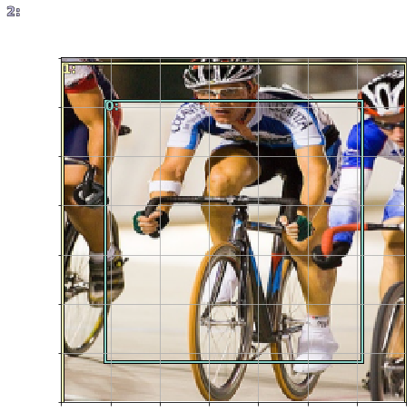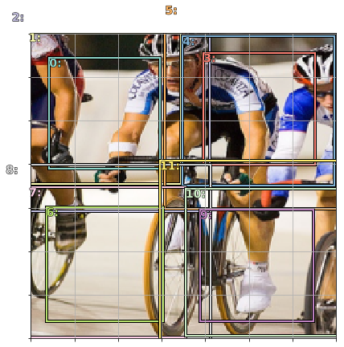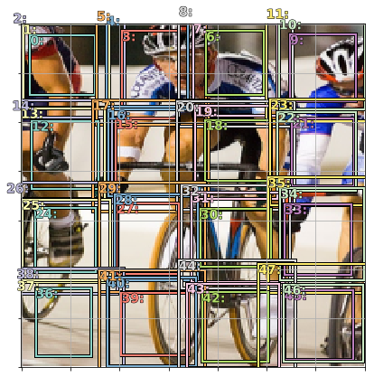

<figcaption class="imageCaption" style="width: 301.205%; left: -201.205%;">从左边（1x1,2x2，4x4网格的锚箱）。 请注意，某些锚框比原始图像大。</figcaption>

2.创建不同宽高比的锚框：

3.使用更多的卷积层作为锚箱的来源（这些框随机抖动，以便我们可以看到重叠的 [[1:16:28](https://youtu.be/0frKXR-2PBY%3Ft%3D1h16m28s)] ）：


结合这些方法，你可以创建很多锚箱（杰里米说他不打印它，但在这里）：


```
anc_grids = [4, 2, 1]  anc_zooms = [0.75, 1., 1.3]  anc_ratios = [(1., 1.), (1., 0.5), (0.5, 1.)]  anchor_scales = [(anz*i,anz*j) **for** anz **in** anc_zooms  **for** (i,j) **in** anc_ratios]  k = len(anchor_scales)  anc_offsets = [1/(o*2) **for** o **in** anc_grids] 
```

```
 anc_x = np.concatenate([np.repeat(np.linspace(ao, 1-ao, ag), ag)  **for** ao,ag **in** zip(anc_offsets,anc_grids)])  anc_y = np.concatenate([np.tile(np.linspace(ao, 1-ao, ag), ag)  **for** ao,ag **in** zip(anc_offsets,anc_grids)])  anc_ctrs = np.repeat(np.stack([anc_x,anc_y], axis=1), k, axis=0) 
```

```
 anc_sizes = np.concatenate([np.array([[o/ag,p/ag]  **for** i **in** range(ag*ag) **for** o,p **in** anchor_scales])  **for** ag **in** anc_grids])  grid_sizes = V(np.concatenate([np.array([ 1/ag  **for** i **in** range(ag*ag) **for** o,p **in** anchor_scales])  **for** ag **in** anc_grids]),  requires_grad= **False** ).unsqueeze(1)  anchors = V(np.concatenate([anc_ctrs, anc_sizes], axis=1),  requires_grad= **False** ).float()  anchor_cnr = hw2corners(anchors[:,:2], anchors[:,2:]) 
```

`anchors` ：中间和高度，宽度

`anchor_cnr` ：左上角和右下角

#### 审查关键概念 [[1:18:00](https://youtu.be/0frKXR-2PBY%3Ft%3D1h18m)] 


*   我们有一个地面实况的向量（4个边框坐标和一个类的集合）
*   我们有一个神经网络，需要一些输入并输出一些输出激活
*   比较激活和基本事实，计算损失，找出其衍生物，并根据学习率的微分时间调整权重。
*   我们需要一个能够接受基本事实和激活的损失函数，并输出一个数字，说明这些激活有多好。 要做到这一点，我们需要取`m`基础事实对象中的每一个，并决定哪一组`(4+c)`激活对该对象负责 [[1:21:58](https://youtu.be/0frKXR-2PBY%3Ft%3D1h21m58s)]  - 我们应该比较哪一个来决定是否该类是正确的，边框是否接近（匹配问题）。
*   由于我们使用的是SSD方法，所以我们匹配的不是任意的 [[1:23:18](https://youtu.be/0frKXR-2PBY%3Ft%3D1h23m18s)] 。 我们希望匹配一组激活，这些激活的感受野具有真实物体所在的最大密度。
*   损失函数需要是一些一致的任务。 如果在第一个图像中，左上角的对象与前4 + c激活相对应，而在第二个图像中，我们扔掉了东西，突然它现在正在进行最后的4 + c激活，神经网络不知道是什么学习。
*   解决匹配问题后，其余部分与单个对象检测相同。

体系结构：

*   YOLO - 最后一层完全连接（没有几何概念）
*   SSD - 最后一层是卷积的

#### k（缩放x比率） [[1:29:39](https://youtu.be/0frKXR-2PBY%3Ft%3D1h29m39s)] 

对于每个可以是不同大小的网格单元，我们可以有不同的方向和缩放代表不同的锚框，就像每个锚框与我们模型中的一组`4+c`激活相关联的概念性思想。 因此，无论我们拥有多少个锚箱，我们都需要进行那些时间`(4+c)`激活。 这并不意味着每个卷积层都需要许多激活。 因为4x4卷积层已经有16组激活，2x2层有4组激活，最后1x1有一组激活。 所以我们基本上可以免费获得1 + 4 + 16。 所以我们只需要知道`k`其中`k`是变焦数量乘以宽高比的数量。 在其他地方，网格，我们将通过我们的架构免费获得。

#### 模型架构 [[1:31:10](https://youtu.be/0frKXR-2PBY%3Ft%3D1h31m10s)] 

```
 drop=0.4  **class** **SSD_MultiHead** (nn.Module):  **def** __init__(self, k, bias):  super().__init__()  self.drop = nn.Dropout(drop)  self.sconv0 = StdConv(512,256, stride=1, drop=drop)  self.sconv1 = StdConv(256,256, drop=drop)  self.sconv2 = StdConv(256,256, drop=drop)  self.sconv3 = StdConv(256,256, drop=drop)  self.out1 = OutConv(k, 256, bias)  self.out2 = OutConv(k, 256, bias)  self.out3 = OutConv(k, 256, bias)  **def** forward(self, x):  x = self.drop(F.relu(x))  x = self.sconv0(x)  x = self.sconv1(x)  o1c,o1l = self.out1(x)  x = self.sconv2(x)  o2c,o2l = self.out2(x)  x = self.sconv3(x)  o3c,o3l = self.out3(x)  **return** [torch.cat([o1c,o2c,o3c], dim=1),  torch.cat([o1l,o2l,o3l], dim=1)]  head_reg4 = SSD_MultiHead(k, -4.)  models = ConvnetBuilder(f_model, 0, 0, 0, custom_head=head_reg4)  learn = ConvLearner(md, models)  learn.opt_fn = optim.Adam 
```

该模型几乎与我们以前的模型相同。 但是我们有一些步幅2的旋转，它将把我们带到4x4,2x2和1x1（每个步幅2个卷积在两个方向上减半我们的网格尺寸）。

*   在我们进行第一次卷积以获得4x4之后，我们将从中获取一组输出，因为我们想要省去4x4锚点。
*   一旦我们达到2x2，我们就会抓住另一组现在的2x2锚点
*   然后我们最终得到1x1
*   然后我们将它们连接在一起，这为我们提供了正确的激活次数（每个锚盒激活一次）。

#### 训练 [[1:32:50](https://youtu.be/0frKXR-2PBY%3Ft%3D1h32m50s)] 

```
 learn.crit = ssd_loss  lr = 1e-2  lrs = np.array([lr/100,lr/10,lr]) 
```

```
 learn.lr_find(lrs/1000,1.)  learn.sched.plot(n_skip_end=2) 
```


```
learn.fit(lrs, 1, cycle_len=4, use_clr=(20,8)) 
```

```
 _epoch trn_loss val_loss_  _0 15.124349 15.015433_  _1 13.091956 10.39855_  _2 11.643629 9.4289_  _3 10.532467 8.822998_ 
```

```
 _[8.822998]_ 
```

```
 learn.save('tmp') 
```

```
 learn.freeze_to(-2)  learn.fit(lrs/2, 1, cycle_len=4, use_clr=(20,8)) 
```

```
 _epoch trn_loss val_loss_  _0 9.821056 10.335152_  _1 9.419633 11.834093_  _2 8.78818 7.907762_  _3 8.219976 7.456364_ 
```

```
 _[7.4563637]_ 
```

```
 x,y = next(iter(md.val_dl))  y = V(y)  batch = learn.model(V(x))  b_clas,b_bb = batch  x = to_np(x)  fig, axes = plt.subplots(3, 4, figsize=(16, 12))  **for** idx,ax **in** enumerate(axes.flat):  ima=md.val_ds.ds.denorm(x)[idx]  bbox,clas = get_y(y[0][idx], y[1][idx])  a_ic = actn_to_bb(b_bb[idx], anchors)  torch_gt(ax, ima, a_ic, b_clas[idx].max(1)[1],  b_clas[idx].max(1)[0].sigmoid(), **0.2** )  plt.tight_layout() 
```

在这里，我们打印出这些检测的概率至少为`0.2` 。 他们中的一些人看起来很有希望，但其他人并没有那么多。

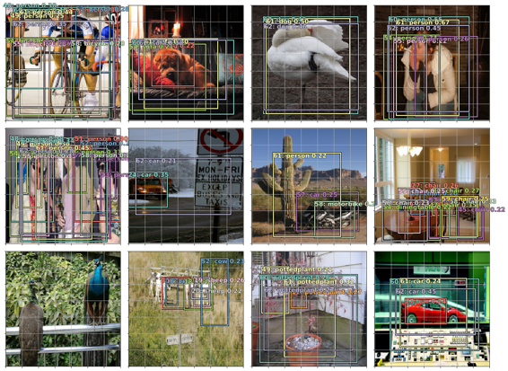

### 物体检测的历史 [[1:33:43](https://youtu.be/0frKXR-2PBY%3Ft%3D1h33m43s)] 

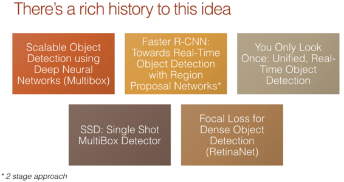

[使用深度神经网络的可扩展对象检测](https://arxiv.org/abs/1312.2249)

*   当人们提到多箱方法时，他们正在谈论这篇论文。
*   这篇论文提出了我们可以使用具有此匹配过程的损失函数的想法，然后你可以使用它来进行对象检测。 所以从那时起一直在努力弄清楚如何让这更好。

[更快的R-CNN：利用区域提案网络实现实时目标检测](https://arxiv.org/abs/1506.01497)

*   与此同时，Ross Girshick正朝着一个完全不同的方向前进。 他有这两个阶段的过程，第一阶段使用经典的计算机视觉方法来找到渐变的边缘和变化，以猜测图像的哪些部分可能代表不同的对象。 然后将它们中的每一个装入一个卷积神经网络，该网络基本上是为了弄清楚这是否是我们感兴趣的对象。
*   R-CNN和快速R-CNN是传统计算机视觉和深度学习的混合体。
*   罗斯和他的团队接着做了什么，他们采用了multibox的想法，用conv网取代了传统的非深度学习计算机视觉部分。 所以现在他们有两个网络：一个用于区域提案（所有可能是对象的东西），第二个部分与他早期的工作相同。

[你只需查看一次：统一的实时对象检测](https://arxiv.org/abs/1506.02640)

[SSD：单发多盒检测器](https://arxiv.org/abs/1512.02325)

*   在同一时间，这些论文出来了。 这两个都做得非常酷，他们取得了与更快的R-CNN类似的表现但是有一个阶段。
*   他们采用了multibox的想法，他们试图弄清楚如何处理凌乱的输出。 基本的想法是使用，例如，硬通过负面挖掘，他们会经历并发现所有看起来不那么好并将它们丢弃的匹配，使用非常棘手和复杂的数据增强方法，以及所有类型的hackery。 但他们让他们工作得很好。

[密集物体检测的焦点损失](https://arxiv.org/abs/1708.02002) （RetinaNet）

*   去年年底发生了一些非常酷的事情，这就是称为焦点损失。
*   他们实际上意识到为什么这个混乱的东西不起作用。 当我们观察图像时，卷积网格有3种不同的粒度（ [4x4,2x2,1x1](https://youtu.be/0frKXR-2PBY%3Ft%3D1h37m28s) ） [[1:37:28](https://youtu.be/0frKXR-2PBY%3Ft%3D1h37m28s)] 。 1x1很可能与某个对象有一个合理的重叠，因为大多数照片都有某种主要主题。 另一方面，在4x4网格单元中，16个锚箱中的大多数不会与任何东西重叠。 所以，如果有人对你说“20美元赌注，你认为这个小片段是什么？”你不确定，你会说“背景”，因为大多数时候，它是背景。

**问题** ：我理解为什么我们有一个4x4的感知字段网格，每个字符框有1个锚点，用于粗略地定位图像中的对象。 但我认为我缺少的是为什么我们需要不同大小的多个感受野。 第一个版本已经包含16个感知字段，每个字段都有一个关联的锚箱。 随着增加，现在有更多的锚箱需要考虑。 这是因为你限制了感受野可以移动或缩小其原始大小的程度吗？ 还是有另一个原因吗？  [[1:38:47](https://youtu.be/0frKXR-2PBY%3Ft%3D1h38m47s)] 这有点倒退。 杰里米做出限制的原因是因为他知道他以后会增加更多的盒子。 但实际上，原因在于Jaccard在这些4x4网格单元中的一个与图像之间重叠，其中占据大部分图像的单个对象永远不会是0.5。 交点比联合小得多，因为对象太大了。 因此，对于这个一般性的想法，我们说你负责的事情，你有超过50％的重叠，我们需要锚定框，定期有50％或更高的重叠，这意味着我们需要有一个各种尺寸，形状和尺度。 这一切都发生在损失函数中。 所有物体检测中绝大多数有趣的东西都是损失函数。

#### 焦点损失 [[1:40:38](https://youtu.be/0frKXR-2PBY%3Ft%3D1h40m38s)] 


关键是这是第一张照片。 蓝线是二元交叉熵损失。 如果答案不是摩托车 [[1:41:46](https://youtu.be/0frKXR-2PBY%3Ft%3D1h41m46s)] ，而且我说“我觉得这不是摩托车而我60％肯定”用蓝线，损失仍然是0.5左右，这是非常糟糕的。 因此，如果我们想要减少损失，那么对于所有这些实际上已经重新开始的事情，我们必须说“我确信这是背景”，“我确信它不是摩托车，公共汽车，或者是人“ - 因为如果我不说我们确定它不是这些东西中的任何一个，那么我们仍然会得到损失。

这就是为什么摩托车的例子不起作用 [[1:42:39](https://youtu.be/0frKXR-2PBY%3Ft%3D1h42m39s)] 。 因为即使它到达右下角并且想要说“我认为它是一辆摩托车”，它也没有任何回报。 如果错了，就会被杀死。 而绝大多数时候，它是背景。 即使它不是背景，仅仅说“它不是背景”是不够的 - 你必须说它是20个中的哪一个。

所以诀窍是试图找到一个看起来更像紫色线的不同损失函数 [[1:44:00](https://youtu.be/0frKXR-2PBY%3Ft%3D1h44m)] 。 焦点损失实际上只是一个缩放的交叉熵损失。 现在，如果我们说“我确定它不是摩托车”，那么损失功能会说“对你有好处！ 不用担心“ [[1:44:42](https://youtu.be/0frKXR-2PBY%3Ft%3D1h44m42s)] 。

本文的实际贡献是将`(1 − pt)^γ`加到等式 [[1:45:06](https://youtu.be/0frKXR-2PBY%3Ft%3D1h45m6s)] 的开头，这听起来像什么，但实际上人们多年来一直试图找出这个问题。 当你遇到像这样改变游戏规则的论文时，你不应该假设你将不得不写几千行代码。 通常它是一行代码，或单个常量的更改，或将日志添加到单个位置。

关于这篇论文的一些了不起的事 [[1:46:08](https://youtu.be/0frKXR-2PBY%3Ft%3D1h46m8s)] ：

*   方程式以简单的方式编写
*   他们“重构”

#### 实施焦点损失 [[1:49:27](https://youtu.be/0frKXR-2PBY%3Ft%3D1h49m27s)] ：


请记住，-log（pt）是交叉熵损失，焦点损失只是一个缩放版本。 当我们定义二项式交叉熵损失时，你可能已经注意到有一个权重，默认情况下是无：

```
 **class** **BCE_Loss** (nn.Module):  **def** __init__(self, num_classes):  super().__init__()  self.num_classes = num_classes  **def** forward(self, pred, targ):  t = one_hot_embedding(targ, self.num_classes+1)  t = V(t[:,:-1].contiguous()) _#.cpu()_  x = pred[:,:-1]  w = self.get_weight(x,t)  **return** F.binary_cross_entropy_with_logits(x, t, w,  size_average= **False** )/self.num_classes  **def** get_weight(self,x,t): **return** **None** 
```

当你调用`F.binary_cross_entropy_with_logits` ，你可以传递权重。 由于我们只是想通过某种东西来乘以交叉熵，我们可以定义`get_weight` 。 这是整个局部损失 [[1:50:23](https://youtu.be/0frKXR-2PBY%3Ft%3D1h50m23s)] ：

```
 **class** **FocalLoss** (BCE_Loss):  **def** get_weight(self,x,t):  alpha,gamma = 0.25,2.  p = x.sigmoid()  pt = p*t + (1-p)*(1-t)  w = alpha*t + (1-alpha)*(1-t)  **return** w * (1-pt).pow(gamma) 
```

如果你想知道为什么alpha和gamma是0.25和2，这是本文的另一个优点，因为他们尝试了很多不同的值，并发现这些工作得很好：


#### 训练 [[1:51:25](https://youtu.be/0frKXR-2PBY%3Ft%3D1h51m25s)] 

```
 learn.lr_find(lrs/1000,1.)  learn.sched.plot(n_skip_end=2) 
```


```
learn.fit(lrs, 1, cycle_len=10, use_clr=(20,10)) 
```

```
 _epoch trn_loss val_loss_  _0 24.263046 28.975235_  _1 20.459562 16.362392_  _2 17.880827 14.884829_  _3 15.956896 13.676485_  _4 14.521345 13.134197_  _5 13.460941 12.594139_  _6 12.651842 12.069849_  _7 11.944972 11.956457_  _8 11.385798 11.561226_  _9 10.988802 11.362164_ 
```

```
 _[11.362164]_ 
```

```
 learn.save('fl0')  learn.load('fl0') 
```

```
 learn.freeze_to(-2)  learn.fit(lrs/4, 1, cycle_len=10, use_clr=(20,10)) 
```

```
 _epoch trn_loss val_loss_  _0 10.871668 11.615532_  _1 10.908461 11.604334_  _2 10.549796 11.486127_  _3 10.130961 11.088478_  _4 9.70691 10.72144_  _5 9.319202 10.600481_  _6 8.916653 10.358334_  _7 8.579452 10.624706_  _8 8.274838 10.163422_  _9 7.994316 10.108068_ 
```

```
 _[10.108068]_ 
```

```
 learn.save('drop4')  learn.load('drop4') 
```

```
 plot_results(0.75) 
```


这次事情看起来好多了。 所以我们现在的最后一步是基本弄清楚如何提取有趣的。

#### 非最大抑制 [[1:52:15](https://youtu.be/0frKXR-2PBY%3Ft%3D1h52m15s)] 

我们要做的就是我们要经历每一对这些边框，如果它们重叠超过一定数量，比如0.5，使用Jaccard并且它们都预测同一个类，我们将假设它们是同样的事情，我们将选择具有更高`p`值的那个。

这是非常无聊的代码，杰里米自己没有写它并复制别人的。 没理由特别经历它。

```
 **def** nms(boxes, scores, overlap=0.5, top_k=100):  keep = scores.new(scores.size(0)).zero_().long()  **if** boxes.numel() == 0: **return** keep  x1 = boxes[:, 0]  y1 = boxes[:, 1]  x2 = boxes[:, 2]  y2 = boxes[:, 3]  area = torch.mul(x2 - x1, y2 - y1)  v, idx = scores.sort(0) _# sort in ascending order_  idx = idx[-top_k:] _# indices of the top-k largest vals_  xx1 = boxes.new()  yy1 = boxes.new()  xx2 = boxes.new()  yy2 = boxes.new()  w = boxes.new()  h = boxes.new()  count = 0  **while** idx.numel() > 0:  i = idx[-1] _# index of current largest val_  keep[count] = i  count += 1  **if** idx.size(0) == 1: **break**  idx = idx[:-1] _# remove kept element from view_  _# load bboxes of next highest vals_  torch.index_select(x1, 0, idx, out=xx1)  torch.index_select(y1, 0, idx, out=yy1)  torch.index_select(x2, 0, idx, out=xx2)  torch.index_select(y2, 0, idx, out=yy2)  _# store element-wise max with next highest score_  xx1 = torch.clamp(xx1, min=x1[i])  yy1 = torch.clamp(yy1, min=y1[i])  xx2 = torch.clamp(xx2, max=x2[i])  yy2 = torch.clamp(yy2, max=y2[i])  w.resize_as_(xx2)  h.resize_as_(yy2)  w = xx2 - xx1  h = yy2 - yy1  _# check sizes of xx1 and xx2.. after each iteration_  w = torch.clamp(w, min=0.0)  h = torch.clamp(h, min=0.0)  inter = w*h  _# IoU = i / (area(a) + area(b) - i)_  rem_areas = torch.index_select(area, 0, idx)  _# load remaining areas)_  union = (rem_areas - inter) + area[i]  IoU = inter/union _# store result in iou_  _# keep only elements with an IoU <= overlap_  idx = idx[IoU.le(overlap)]  **return** keep, count 
```

```
 **def** show_nmf(idx):  ima=md.val_ds.ds.denorm(x)[idx]  bbox,clas = get_y(y[0][idx], y[1][idx])  a_ic = actn_to_bb(b_bb[idx], anchors)  clas_pr, clas_ids = b_clas[idx].max(1)  clas_pr = clas_pr.sigmoid()  conf_scores = b_clas[idx].sigmoid().t().data  out1,out2,cc = [],[],[]  **for** cl **in** range(0, len(conf_scores)-1):  c_mask = conf_scores[cl] > 0.25  **if** c_mask.sum() == 0: **continue**  scores = conf_scores[cl][c_mask]  l_mask = c_mask.unsqueeze(1).expand_as(a_ic)  boxes = a_ic[l_mask].view(-1, 4)  ids, count = nms(boxes.data, scores, 0.4, 50)  ids = ids[:count]  out1.append(scores[ids])  out2.append(boxes.data[ids])  cc.append([cl]*count)  cc = T(np.concatenate(cc))  out1 = torch.cat(out1)  out2 = torch.cat(out2)  fig, ax = plt.subplots(figsize=(8,8))  torch_gt(ax, ima, out2, cc, out1, 0.1) 
```

```
 **for** i **in** range(12): show_nmf(i) 
```

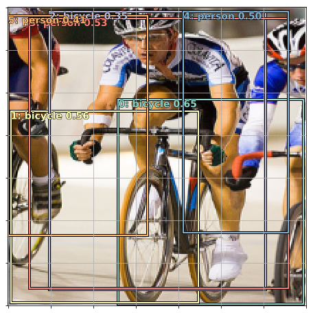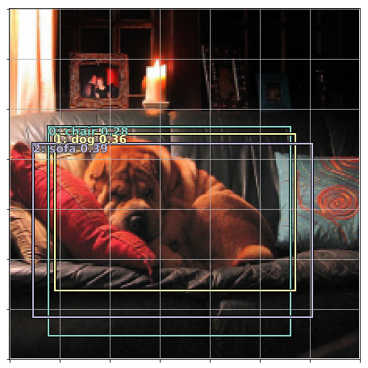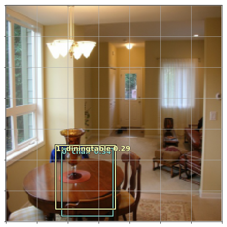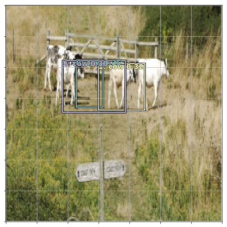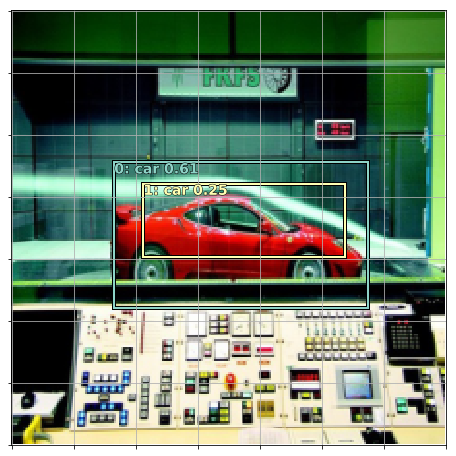

还有一些事情需要解决 [[1:53:43](https://youtu.be/0frKXR-2PBY%3Ft%3D1h53m43s)] 。 诀窍是使用一种叫做特征金字塔的东西。 这就是我们在第14课中要做的。

#### 再谈谈SSD纸 [[1:54:03](https://youtu.be/0frKXR-2PBY%3Ft%3D1h54m3s)] 

当这篇论文出来时，Jeremy很兴奋，因为这和YOLO是第一种出现的单程优质物体检测方法。 在深度学习世界中，历史不断重复，这是涉及多个不同部分的多次传递的事物，随着时间的推移，特别是在涉及一些非深度学习片段（如R-CNN所做的）的情况下，随着时间的推移，它们总是变成一个端到端的深度学习模型。 所以我倾向于忽略它们直到发生这种情况，因为这是人们已经想出如何将其展示为深度学习模型的点，一旦他们这样做，他们通常会以更快，更准确的方式结束。 因此SSD和YOLO非常重要。

该模型是4段。 论文非常简洁，这意味着你需要仔细阅读它们。 但是，部分地，你需要知道要仔细阅读哪些位。 他们说“这里我们要证明这个模型上的错误界限”，你可以忽略它，因为你不关心证明错误界限。 但是这里说的是模型，你需要仔细阅读。

杰里米读了一节**2.1模型**  [[1:56:37](https://youtu.be/0frKXR-2PBY%3Ft%3D1h56m37s)] 

如果你直接进入并阅读这样的论文，这4段可能没有意义。 但是现在我们已经完成了它，你读了那些，并希望能够“哦，这就是杰里米所说的，只有他们[伤害它比杰里米](https://youtu.be/0frKXR-2PBY%3Ft%3D2h37s)更好，而言语更少 [[2:00:37](https://youtu.be/0frKXR-2PBY%3Ft%3D2h37s)] 。 如果你开始读一篇论文然后“哎呀”，那么诀窍就是开始回读引文。

Jeremy读取**匹配策略**和**训练目标** （又名丢失函数） [[2:01:44](https://youtu.be/0frKXR-2PBY%3Ft%3D2h1m44s)] 

#### 一些文章提示 [[2:02:34](https://youtu.be/0frKXR-2PBY%3Ft%3D2h2m34s)] 

[使用深度神经网络的可扩展对象检测](https://arxiv.org/pdf/1312.2249.pdf)

*   “培养目标”是损失功能
*   双条和两个2是这样的意思是均方误差


*   log（c）和log（1-c），x和（1-x）它们都是二进制交叉熵的部分：


本周，仔细阅读代码并查看论文，看看发生了什么。 记住Jeremy为你做的更容易做的事情是他把这个损失函数，他把它复制到一个单元格中并将其拆分，以便每个位都在一个单独的单元格中。 然后在每次出售后，他都会打印或绘制该值。 希望这是一个很好的起点。
