# 深度学习：第二部分第九课

### 链接

[**论坛**](http://forums.fast.ai/t/part-2-lesson-9-in-class/14028/1) **/** [**视频**](https://youtu.be/0frKXR-2PBY)

### 评论

#### 从上周开始：

*   Pathlib; JSON
*   字典理解
*   Defaultdict
*   如何跳过fastai源
*   matplotlib OO API
*   Lambda函数
*   边界框坐标
*   定制头; 边界框回归


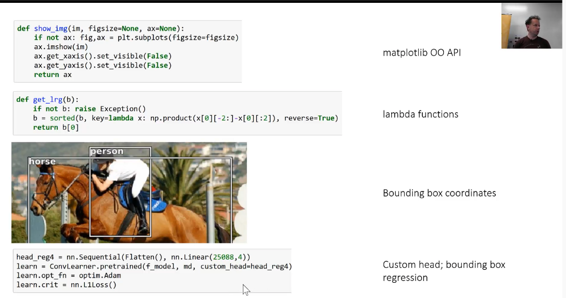

#### 从第1部分：

*   如何从DataLoader查看模型输入
*   如何查看模型输出


### 数据增强和边界框[ [2:58](https://youtu.be/0frKXR-2PBY%3Ft%3D2m58s) ]

[笔记本](https://github.com/fastai/fastai/blob/master/courses/dl2/pascal.ipynb)

**快餐的尴尬粗糙边缘：**
_分类器_是具有因变量的任何分类或二项式。 与_回归_相反，任何具有因变量的东西都是连续的。 命名有点令人困惑，但将来会被整理出来。 这里， `continuous`是`True`因为我们的因变量是边界框的坐标 - 因此这实际上是一个回归数据。

```
 tfms = tfms_from_model(f_model, sz, crop_type=CropType.NO,  aug_tfms=augs)  md = Image **Classifier** Data.from_csv(PATH, JPEGS, BB_CSV, tfms=tfms,  **continuous=True** , bs=4) 
```

#### 让我们创建一些数据增强[ [4:40](https://youtu.be/0frKXR-2PBY%3Ft%3D4m40s) ]

```
 augs = [RandomFlip(),  RandomRotate(30),  RandomLighting(0.1,0.1)] 
```

通常，我们使用Jeremy为我们创建的这些快捷方式，但它们只是随机增强的列表。 但是你可以很容易地创建自己的（大多数（如果不是全部）以“随机”开头）。


```
 tfms = tfms_from_model(f_model, sz, crop_type=CropType.NO,  aug_tfms=augs)  md = ImageClassifierData.from_csv(PATH, JPEGS, BB_CSV, tfms=tfms,  continuous=True, bs=4) 
```

```
 idx=3  fig,axes = plt.subplots(3,3, figsize=(9,9))  for i,ax in enumerate(axes.flat):  x,y=next(iter(md.aug_dl))  ima=md.val_ds.denorm(to_np(x))[idx]  b = bb_hw(to_np(y[idx]))  print(b)  show_img(ima, ax=ax)  draw_rect(ax, b) 
```

```
 _[ 115\. 63\. 240\. 311.]_  _[ 115\. 63\. 240\. 311.]_  _[ 115\. 63\. 240\. 311.]_  _[ 115\. 63\. 240\. 311.]_  _[ 115\. 63\. 240\. 311.]_  _[ 115\. 63\. 240\. 311.]_  _[ 115\. 63\. 240\. 311.]_  _[ 115\. 63\. 240\. 311.]_  _[ 115\. 63\. 240\. 311.]_ 
```


正如你所看到的，图像旋转并且光线变化，但是边界框_没有移动_并且_位于错误的位置_ [ [6:17](https://youtu.be/0frKXR-2PBY%3Ft%3D6m17s) ]。 当您的因变量是像素值或以某种方式连接到自变量时，这是数据增强的问题 - 它们需要一起增强。 正如您在边界框坐标`[ 115\. 63\. 240\. 311.]`中所看到的，我们的图像是224乘224 - 所以它既不缩放也不裁剪。 因变量需要经历所有几何变换作为自变量。

要做到这一点[ [7:10](https://youtu.be/0frKXR-2PBY%3Ft%3D7m10s) ]，每个转换都有一个可选的`tfm_y`参数：

```
 augs = [RandomFlip(tfm_y=TfmType.COORD),  RandomRotate(30, tfm_y=TfmType.COORD),  RandomLighting(0.1,0.1, tfm_y=TfmType.COORD)] 
```

```
 tfms = tfms_from_model(f_model, sz, crop_type=CropType.NO,  tfm_y=TfmType.COORD, aug_tfms=augs)  md = ImageClassifierData.from_csv(PATH, JPEGS, BB_CSV, tfms=tfms,  continuous=True, bs=4) 
```

`TrmType.COORD`表示_y_值表示坐标。 这需要添加到所有增强以及`tfms_from_model` ，后者负责裁剪，缩放，调整大小，填充等。

```
 idx=3  fig,axes = plt.subplots(3,3, figsize=(9,9))  for i,ax in enumerate(axes.flat):  x,y=next(iter(md.aug_dl))  ima=md.val_ds.denorm(to_np(x))[idx]  b = bb_hw(to_np(y[idx]))  print(b)  show_img(ima, ax=ax)  draw_rect(ax, b) 
```

```
 _[ 48\. 34\. 112\. 188.]_  _[ 65\. 36\. 107\. 185.]_  _[ 49\. 27\. 131\. 195.]_  _[ 24\. 18\. 147\. 204.]_  _[ 61\. 34\. 113\. 188.]_  _[ 55\. 31\. 121\. 191.]_  _[ 52\. 19\. 144\. 203.]_  _[ 7\. 0\. 193\. 222.]_  _[ 52\. 38\. 105\. 182.]_ 
```


现在，边界框随图像移动并位于正确的位置。 您可能会注意到，有时它看起来很奇怪，就像底行中间的那样。 这是我们所拥有信息的约束。 如果对象占据原始边界框的角，则在图像旋转后，新的边界框需要更大。 所以你必须**小心不要使用边界框进行太高的旋转，**因为没有足够的信息让它们保持准确。 如果我们在做多边形或分段，我们就不会遇到这个问题。


<figcaption class="imageCaption">这就是箱子变大的原因</figcaption>


```
 tfm_y = TfmType.COORD  augs = [RandomFlip(tfm_y=tfm_y),  RandomRotate( **3** , **p=0.5** , tfm_y=tfm_y),  RandomLighting(0.05,0.05, tfm_y=tfm_y)] 
```

```
 tfms = tfms_from_model(f_model, sz, crop_type=CropType.NO,  tfm_y=tfm_y, aug_tfms=augs)  md = ImageClassifierData.from_csv(PATH, JPEGS, BB_CSV, tfms=tfms,  continuous=True) 
```

所以在这里，我们最多进行3度旋转以避免这个问题[ [9:14](https://youtu.be/0frKXR-2PBY%3Ft%3D9m14s) ]。 它也只旋转了一半的时间（ `p=0.5` ）。

#### custom_head [ [9:34](https://youtu.be/0frKXR-2PBY%3Ft%3D9m34s) ]

`learn.summary()`将通过模型运行一小批数据，并在每一层打印出张量的大小。 正如你所看到的，在`Flatten`层之前，张量的形状为512乘7乘7.所以如果它是1级张量（即单个向量），它的长度将是25088（512 * 7 * 7）并且这就是为什么我们的自定义标题的输入大小是25088.输出大小是4，因为它是边界框坐标。

```
 head_reg4 = nn.Sequential(Flatten(), nn.Linear(25088,4))  learn = ConvLearner.pretrained(f_model, md, custom_head=head_reg4)  learn.opt_fn = optim.Adam  learn.crit = nn.L1Loss() 
```


#### 单个物体检测[ [10:35](https://youtu.be/0frKXR-2PBY%3Ft%3D10m35s) ]

让我们将两者结合起来创建可以对每个图像中最大的对象进行分类和本地化的东西。

我们需要做三件事来训练神经网络：

1.  数据
2.  建筑
3.  损失函数

#### 1.提供数据

我们需要一个`ModelData`对象，其独立变量是图像，而因变量是边界框坐标和类标签的元组。 有几种方法可以做到这一点，但这里有一个特别懒惰和方便的方法，Jeremy提出的方法是创建两个`ModelData`对象，表示我们想要的两个不同的因变量（一个带有边界框坐标，一个带有类）。

```
 f_model=resnet34  sz=224  bs=64 
```

```
 val_idxs = get_cv_idxs(len(trn_fns))  tfms = tfms_from_model(f_model, sz, crop_type=CropType.NO,  tfm_y=TfmType.COORD, aug_tfms=augs) 
```

```
 md = ImageClassifierData.from_csv(PATH, JPEGS, **BB_CSV** , tfms=tfms,  continuous=True, val_idxs=val_idxs) 
```

```
 md2 = ImageClassifierData.from_csv(PATH, JPEGS, **CSV** ,  tfms=tfms_from_model(f_model, sz)) 
```

数据集可以是`__len__`和`__getitem__`任何数据集。 这是一个向现有数据集添加第二个标签的数据集：

```
 **class** **ConcatLblDataset** (Dataset):  **def** __init__(self, ds, y2): self.ds,self.y2 = ds,y2  **def** __len__(self): **return** len(self.ds)  **def** __getitem__(self, i):  x,y = self.ds[i]  **return** (x, (y,self.y2[i])) 
```

*   `ds` ：包含独立变量和因变量
*   `y2` ：包含其他因变量
*   `(x, (y,self.y2[i]))` ： `(x, (y,self.y2[i]))`返回一个自变量和两个因变量的组合。

我们将使用它将类添加到边界框标签。

```
 trn_ds2 = ConcatLblDataset(md.trn_ds, md2.trn_y)  val_ds2 = ConcatLblDataset(md.val_ds, md2.val_y) 
```

这是一个示例因变量：

```
 val_ds2[0][1] 
```

```
 _(array([ 0., 49., 205., 180.], dtype=float32), 14)_ 
```

我们可以用这些新数据集替换数据加载器的数据集。

```
 md.trn_dl.dataset = trn_ds2  md.val_dl.dataset = val_ds2 
```

在绘制之前，我们必须对`denorm`的图像进行声明。

```
 x,y = next(iter(md.val_dl))  idx = 3  ima = md.val_ds.ds.denorm(to_np(x))[idx]  b = bb_hw(to_np(y[0][idx])); b 
```

```
 _array([ 52., 38., 106., 184.], dtype=float32)_ 
```

```
 ax = show_img(ima)  draw_rect(ax, b)  draw_text(ax, b[:2], md2.classes[y[1][idx]]) 
```

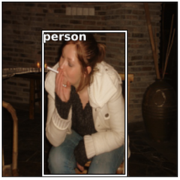

#### 2.选择建筑[ [13:54](https://youtu.be/0frKXR-2PBY%3Ft%3D13m54s) ]

该体系结构将与我们用于分类器和边界框回归的体系结构相同，但我们将仅将它们组合在一起。 换句话说，如果我们有`c`类，那么我们在最后一层中需要的激活次数是4加`c` 。 4用于边界框坐标和`c`概率（每个类一个）。

这次我们将使用额外的线性层，加上一些辍学，以帮助我们训练更灵活的模型。 一般来说，我们希望我们的自定义头能够自己解决问题，如果它所连接的预训练骨干是合适的。 所以在这种情况下，我们试图做很多 - 分类器和边界框回归，所以只是单个线性层似乎不够。 如果您想知道为什么在第一个`ReLU`之后没有`BatchNorm1d` ，ResNet主干已经将`BatchNorm1d`作为其最后一层。

```
 head_reg4 = nn.Sequential(  Flatten(),  nn.ReLU(),  nn.Dropout(0.5),  nn.Linear(25088,256),  nn.ReLU(),  nn.BatchNorm1d(256),  nn.Dropout(0.5),  nn.Linear(256, **4+len(cats)** ),  )  models = ConvnetBuilder(f_model, 0, 0, 0, custom_head=head_reg4)  learn = ConvLearner(md, models)  learn.opt_fn = optim.Adam 
```

#### 3.损失函数[ [15:46](https://youtu.be/0frKXR-2PBY%3Ft%3D15m46s) ]

损失函数需要查看这些`4 + len(cats)`激活并确定它们是否良好 - 这些数字是否准确反映了图像中最大对象的位置和类别。 我们知道如何做到这一点。 对于前4次激活，我们将像以前一样使用L1Loss（L1Loss就像均方误差 - 而不是平方误差之和，它使用绝对值之和）。 对于其余的激活，我们可以使用交叉熵损失。

```
 **def** detn_loss(input, target):  bb_t,c_t = target  bb_i,c_i = input[:, :4], input[:, 4:]  bb_i = F.sigmoid(bb_i)*224  _# I looked at these quantities separately first then picked a_  _# multiplier to make them approximately equal_  **return** F.l1_loss(bb_i, bb_t) + F.cross_entropy(c_i, c_t)*20 
```

```
 **def** detn_l1(input, target):  bb_t,_ = target  bb_i = input[:, :4]  bb_i = F.sigmoid(bb_i)*224  **return** F.l1_loss(V(bb_i),V(bb_t)).data 
```

```
 **def** detn_acc(input, target):  _,c_t = target  c_i = input[:, 4:]  **return** accuracy(c_i, c_t) 
```

```
 learn.crit = detn_loss  learn.metrics = [detn_acc, detn_l1] 
```

*   `input` ：激活
*   `target` ：基本事实
*   `bb_t,c_t = target` ：我们的自定义数据集返回一个包含边界框坐标和类的元组。 这项任务将对它们进行解构。
*   `bb_i,c_i = input[:, :4], input[:, 4:]` ：第一个`:`用于批量维度。
*   `b_i = F.sigmoid(bb_i)*224` ：我们知道我们的图像是224乘`Sigmoid`将强制它在0和1之间，并将它乘以224以帮助我们的神经网络在它的范围内成为。

**问题：**作为一般规则，在ReLU [ [18:02](https://youtu.be/0frKXR-2PBY%3Ft%3D18m2s) ]之前或之后放置BatchNorm会更好吗？ Jeremy建议将它放在ReLU之后，因为BathNorm意味着走向零均值的单标准偏差。 因此，如果你把ReLU放在它之后，你将它截断为零，这样就无法创建负数。 但是如果你把ReLU然后放入BatchNorm，它确实具有这种能力并且给出稍微好一些的结果。 话虽如此，无论如何都不是太大的交易。 你在课程的这一部分看到，大多数时候，Jeremy做了ReLU然后是BatchNorm，但是当他想要与论文保持一致时，有时则相反。

**问题** ：BatchNorm之后使用dropout的直觉是什么？ BatchNorm是否已经做好了正规化[ [19:12](https://youtu.be/0frKXR-2PBY%3Ft%3D19m12s) ]的工作？ BatchNorm可以正常化，但如果你回想第1部分，我们讨论了一些事情，我们这样做是为了避免过拟合，添加BatchNorm就像数据增强一样。 但你完全有可能仍然过拟合。 关于辍学的一个好处是，它有一个参数来说明辍学的数量。 参数是特别重要的参数，决定了规则的多少，因为它可以让你构建一个漂亮的大参数化模型，然后决定规范它的程度。 Jeremy倾向于总是从`p=0`开始辍学，然后当他添加正则化时，他可以改变辍学参数而不用担心他是否保存了他想要能够加载它的模型，但如果他有在一个中丢弃层而在另一个中没有，它将不再加载。 所以这样，它保持一致。

现在我们有输入和目标，我们可以计算L1损失并添加交叉熵[ [20:39](https://youtu.be/0frKXR-2PBY%3Ft%3D20m39s) ]：

`F.l1_loss(bb_i, bb_t) + F.cross_entropy(c_i, c_t)*20`

这是我们的损失功能。 交叉熵和L1损失可能具有完全不同的尺度 - 在这种情况下，损失函数中较大的一个将占主导地位。 在这种情况下，杰里米打印出这些值，并发现如果我们将交叉熵乘以20会使它们的大小相同。

```
 lr=1e-2  learn.fit(lr, 1, cycle_len=3, use_clr=(32,5)) 
```

```
 _epoch trn_loss val_loss detn_acc detn_l1_  _0 72.036466 45.186367 0.802133 32.647586_  _1 51.037587 36.34964 0.828425 25.389733_  _2 41.4235 35.292709 0.835637 24.343577_ 
```

```
 _[35.292709, 0.83563701808452606, 24.343576669692993]_ 
```

在训练时打印出信息很好，所以我们抓住L1损失并将其作为指标添加。

```
 learn.save('reg1_0')  learn.freeze_to(-2)  lrs = np.array([lr/100, lr/10, lr])  learn.fit(lrs/5, 1, cycle_len=5, use_clr=(32,10)) 
```

```
 epoch trn_loss val_loss detn_acc detn_l1  0 34.448113 35.972973 0.801683 22.918499  1 28.889909 33.010857 0.830379 21.689888  2 24.237017 30.977512 0.81881 20.817996  3 21.132993 30.60677 0.83143 20.138552  4 18.622983 30.54178 0.825571 19.832196 
```

```
 [30.54178, 0.82557091116905212, 19.832195997238159] 
```

```
 learn.unfreeze()  learn.fit(lrs/10, 1, cycle_len=10, use_clr=(32,10)) 
```

```
 epoch trn_loss val_loss detn_acc detn_l1  0 15.957164 31.111507 0.811448 19.970753  1 15.955259 32.597153 0.81235 20.111022  2 15.648723 32.231941 0.804087 19.522853  3 14.876172 30.93821 0.815805 19.226574  4 14.113872 31.03952 0.808594 19.155093  5 13.293885 29.736671 0.826022 18.761728  6 12.562566 30.000023 0.827524 18.82006  7 11.885125 30.28841 0.82512 18.904158  8 11.498326 30.070133 0.819712 18.635296  9 11.015841 30.213772 0.815805 18.551489 
```

```
 [30.213772, 0.81580528616905212, 18.551488876342773] 
```

检测精度低至80，与以前相同。 这并不奇怪，因为ResNet旨在进行分类，因此我们不希望以这种简单的方式改进事物。 它当然不是为了进行边界框回归而设计的。 它显然实际上是以不关心几何的方式设计的 - 它需要最后7到7个激活网格并将它们平均放在一起扔掉所有关于来自何处的信息。

有趣的是，当我们同时进行准确性（分类）和边界框时，L1似乎比我们刚进行边界框回归时要好一些[ [22:46](https://youtu.be/0frKXR-2PBY%3Ft%3D22m46s) ]。 如果这对你来说是违反直觉的，那么这将是本课后要考虑的主要事项之一，因为这是一个非常重要的想法。 这个想法是这样的 - 弄清楚图像中的主要对象是什么，是一种困难的部分。 然后确定边界框的确切位置以及它的类别是一个简单的部分。 所以当你有一个网络既说对象是什么，对象在哪里时，它就会分享关于找到对象的所有计算。 所有共享计算都非常有效。 当我们返回传播类和地方中的错误时，这就是有助于计算找到最大对象的所有信息。 因此，只要您有多个任务分享这些任务完成工作所需要的概念，他们很可能应该至少共享网络的某些层。 今天晚些时候，我们将看一个模型，其中除了最后一层之外，大多数层都是共享的。

结果如下[ [24:34](https://youtu.be/0frKXR-2PBY%3Ft%3D24m34s) ]。 和以前一样，当图像中有单个主要对象时，它做得很好。


### 多标签分类[ [25:29](https://youtu.be/0frKXR-2PBY%3Ft%3D25m29s) ]

[笔记本](https://github.com/fastai/fastai/blob/master/courses/dl2/pascal-multi.ipynb)

我们希望继续构建比上一个模型稍微复杂的模型，这样如果某些东西停止工作，我们就会确切地知道它在哪里破碎。 以下是以前笔记本的功能：

```
 %matplotlib inline  %reload_ext autoreload  %autoreload 2 
```

```
 **from** **fastai.conv_learner** **import** *  **from** **fastai.dataset** **import** *  **import** **json** , **pdb**  **from** **PIL** **import** ImageDraw, ImageFont  **from** **matplotlib** **import** patches, patheffects  torch.backends.cudnn.benchmark= **True** 
```

#### 建立

```
 PATH = Path('data/pascal')  trn_j = json.load((PATH / 'pascal_train2007.json').open())  IMAGES,ANNOTATIONS,CATEGORIES = ['images', 'annotations',  'categories']  FILE_NAME,ID,IMG_ID,CAT_ID,BBOX = 'file_name','id','image_id',  'category_id','bbox'  cats = dict((o[ID], o['name']) **for** o **in** trn_j[CATEGORIES])  trn_fns = dict((o[ID], o[FILE_NAME]) **for** o **in** trn_j[IMAGES])  trn_ids = [o[ID] **for** o **in** trn_j[IMAGES]]  JPEGS = 'VOCdevkit/VOC2007/JPEGImages'  IMG_PATH = PATH/JPEGS 
```

```
 **def** get_trn_anno():  trn_anno = collections.defaultdict( **lambda** :[])  **for** o **in** trn_j[ANNOTATIONS]:  **if** **not** o['ignore']:  bb = o[BBOX]  bb = np.array([bb[1], bb[0], bb[3]+bb[1]-1,  bb[2]+bb[0]-1])  trn_anno[o[IMG_ID]].append((bb,o[CAT_ID]))  **return** trn_anno  trn_anno = get_trn_anno() 
```

```
 **def** show_img(im, figsize= **None** , ax= **None** ):  **if** **not** ax: fig,ax = plt.subplots(figsize=figsize)  ax.imshow(im)  ax.set_xticks(np.linspace(0, 224, 8))  ax.set_yticks(np.linspace(0, 224, 8))  ax.grid()  ax.set_yticklabels([])  ax.set_xticklabels([])  **return** ax  **def** draw_outline(o, lw):  o.set_path_effects([patheffects.Stroke(  linewidth=lw, foreground='black'), patheffects.Normal()])  **def** draw_rect(ax, b, color='white'):  patch = ax.add_patch(patches.Rectangle(b[:2], *b[-2:],  fill= **False** , edgecolor=color, lw=2))  draw_outline(patch, 4)  **def** draw_text(ax, xy, txt, sz=14, color='white'):  text = ax.text(*xy, txt,  verticalalignment='top', color=color, fontsize=sz,  weight='bold')  draw_outline(text, 1) 
```

```
 **def** bb_hw(a): **return** np.array([a[1],a[0],a[3]-a[1],a[2]-a[0]])  **def** draw_im(im, ann):  ax = show_img(im, figsize=(16,8))  **for** b,c **in** ann:  b = bb_hw(b)  draw_rect(ax, b)  draw_text(ax, b[:2], cats[c], sz=16)  **def** draw_idx(i):  im_a = trn_anno[i]  im = open_image(IMG_PATH/trn_fns[i])  draw_im(im, im_a) 
```

#### 多级[ [26:12](https://youtu.be/0frKXR-2PBY%3Ft%3D26m12s) ]

```
 MC_CSV = PATH/'tmp/mc.csv' 
```

```
 trn_anno[12] 
```

```
 _[(array([ 96, 155, 269, 350]), 7)]_ 
```

```
 mc = [set([cats[p[1]] **for** p **in** trn_anno[o]]) **for** o **in** trn_ids]  mcs = [' '.join(str(p) **for** p **in** o) **for** o **in** mc] 
```

```
 df = pd.DataFrame({'fn': [trn_fns[o] **for** o **in** trn_ids],  'clas': mcs}, columns=['fn','clas'])  df.to_csv(MC_CSV, index= **False** ) 
```

其中一名学生指出，通过使用Pandas，我们可以比使用`collections.defaultdict`更简单，并分享[这个要点](https://gist.github.com/binga/1bc4ebe5e41f670f5954d2ffa9d6c0ed) 。 你越了解熊猫，你越经常意识到它是解决许多不同问题的好方法。

**问题** ：当您在较小的模型上逐步构建时，是否将它们重新用作预先训练过的权重？ 或者你把它扔掉然后从头开始重新训练[ [27:11](https://youtu.be/0frKXR-2PBY%3Ft%3D27m11s) ]？ 当Jeremy在他这样做时想出东西时，他通常会倾向于扔掉，因为重复使用预先训练过的砝码会带来不必要的复杂性。 然而，如果他试图达到他可以在真正大的图像上进行训练的程度，他通常会从更小的角度开始，并且经常重新使用这些重量。

```
 f_model=resnet34  sz=224  bs=64 
```

```
 tfms = tfms_from_model(f_model, sz, crop_type=CropType.NO)  md = ImageClassifierData.from_csv(PATH, JPEGS, MC_CSV, tfms=tfms) 
```

```
 learn = ConvLearner.pretrained(f_model, md)  learn.opt_fn = optim.Adam 
```

```
 lr = 2e-2 
```

```
 learn.fit(lr, 1, cycle_len=3, use_clr=(32,5)) 
```

```
 _epoch trn_loss val_loss <lambda>_  _0 0.104836 0.085015 0.972356_  _1 0.088193 0.079739 0.972461_  _2 0.072346 0.077259 0.974114_ 
```

```
 _[0.077258907, 0.9741135761141777]_ 
```

```
 lrs = np.array([lr/100, lr/10, lr]) 
```

```
 learn.freeze_to(-2) 
```

```
 learn.fit(lrs/10, 1, cycle_len=5, use_clr=(32,5)) 
```

```
 _epoch trn_loss val_loss <lambda>_  _0 0.063236 0.088847 0.970681_  _1 0.049675 0.079885 0.973723_  _2 0.03693 0.076906 0.975601_  _3 0.026645 0.075304 0.976187_  _4 0.018805 0.074934 0.975165_ 
```

```
 _[0.074934497, 0.97516526281833649]_ 
```

```
 learn.save('mclas') 
```

```
 learn.load('mclas') 
```

```
 y = learn.predict()  x,_ = next(iter(md.val_dl))  x = to_np(x) 
```

```
 fig, axes = plt.subplots(3, 4, figsize=(12, 8))  **for** i,ax **in** enumerate(axes.flat):  ima=md.val_ds.denorm(x)[i]  ya = np.nonzero(y[i]>0.4)[0]  b = ' **\n** '.join(md.classes[o] **for** o **in** ya)  ax = show_img(ima, ax=ax)  draw_text(ax, (0,0), b)  plt.tight_layout() 
```

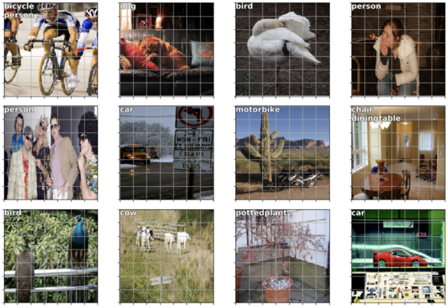

多级分类非常简单[ [28:28](https://youtu.be/0frKXR-2PBY%3Ft%3D28m28s) ]。 一个小调整是在这一行中使用`set` ，以便每个对象类型出现一次：

```
 mc = [ **set** ([cats[p[1]] **for** p **in** trn_anno[o]]) **for** o **in** trn_ids] 
```

#### SSD和YOLO [ [29:10](https://youtu.be/0frKXR-2PBY%3Ft%3D29m10s) ]

我们有一个输入图像，它通过一个转换网络，输出一个大小为`4+c`的向量，其中`c=len(cats)` 。 这为我们提供了一个最大物体的物体探测器。 现在让我们创建一个找到16个对象的对象。 显而易见的方法是采用最后一个线性层而不是`4+c`输出，我们可以有`16x(4+c)`输出。 这给了我们16组类概率和16组边界框坐标。 然后我们只需要一个损失函数来检查这16组边界框是否正确表示了图像中最多16个对象（我们稍后会进入损失函数）。


第二种方法是使用`nn.linear`而不是使用`nn.linear` ，如果相反，我们从ResNet卷积主干中获取并添加了一个`nn.Conv2d`和stride 2 [ [31:32](https://youtu.be/0frKXR-2PBY%3Ft%3D31m32s) ]？ 这将给我们一个`4x4x[# of filters]`张量 - 这里让我们使它成为`4x4x(4+c)`这样我们得到一个张量，其中元素的数量正好等于我们想要的元素数量。 现在，如果我们创建了一个`4x4x(4+c)`张量的损失函数，并将其映射到图像中的16个对象，并检查每个对象是否通过这些`4+c`激活正确表示，这也可以。 事实证明，这两种方法实际上都在使用[ [33:48](https://youtu.be/0frKXR-2PBY%3Ft%3D33m48s) ]。 输出是来自完全连接的线性层的一个大长矢量的方法被称为[YOLO（You Only Look Once）](https://arxiv.org/abs/1506.02640)的一类模型使用，在其他地方，卷积激活的方法被以某些东西开始的模型使用称为[SSD（单发探测器）](https://arxiv.org/abs/1512.02325) 。 由于这些事情在2015年末非常相似，所以事情已经转向SSD。 所以今天早上， [YOLO版本3](https://pjreddie.com/media/files/papers/YOLOv3.pdf)出现了，现在正在做SSD，这就是我们要做的事情。 我们还将了解为什么这也更有意义。

#### 锚箱[ [35:04](https://youtu.be/0frKXR-2PBY%3Ft%3D35m04s) ]


让我们假设我们有另一个`Conv2d(stride=2)`然后我们将有`2x2x(4+c)`张量。 基本上，它创建一个看起来像这样的网格：


这就是第二额外卷积步幅2层的激活的几何形状。 请记住，步幅2卷积对激活的几何形状做同样的事情，如步幅1卷积，然后是假设填充正常的最大值。

我们来谈谈我们在这里可以做些什么[ [36:09](https://youtu.be/0frKXR-2PBY%3Ft%3D36m9s) ]。 我们希望这些网格单元中的每一个都负责查找图像该部分中的最大对象。

#### 感受野[ [37:20](https://youtu.be/0frKXR-2PBY%3Ft%3D37m20s) ]

为什么我们关心的是我们希望每个卷积网格单元负责查找图像相应部分中的内容？ 原因是因为卷积网格单元的感知域。 基本思想是，在整个卷积层中，这些张量的每一部分都有一个感知场，这意味着输入图像的哪一部分负责计算该细胞。 像生活中的所有事情一样，最简单的方法就是用Excel [ [38:01](https://youtu.be/0frKXR-2PBY%3Ft%3D38m1s) ]。


进行一次激活（在这种情况下，在maxpool图层中）让我们看看它来自哪里[ [38:45](https://youtu.be/0frKXR-2PBY%3Ft%3D38m45s) ]。 在excel中，您可以执行公式→跟踪先例。 一直追溯到输入层，您可以看到它来自图像的这个6 x 6部分（以及过滤器）。 更重要的是，中间部分有很多重量从外面的细胞出来只有一个重量出来的地方。 因此，我们将这个6 x 6细胞称为我们选择的一次激活的感受野。

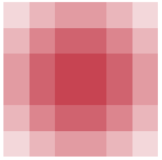

<figcaption class="imageCaption">3x3卷积，不透明度为15％ - 显然盒子的中心有更多的依赖性</figcaption>


请注意，感知字段不只是说它是这个框，而且框的中心有更多的依赖关系[ [40:27](https://youtu.be/0frKXR-2PBY%3Ft%3D40m27s) ]这是一个非常重要的概念，当涉及到理解架构并理解为什么会员网以他们的方式工作时。

#### 建筑[ [41:18](https://youtu.be/0frKXR-2PBY%3Ft%3D41m18s) ]

架构是，我们将有一个ResNet主干，然后是一个或多个2D卷积（现在一个），这将给我们一个`4x4`网格。

```
 **class** **StdConv** (nn.Module):  **def** __init__(self, nin, nout, stride=2, drop=0.1):  super().__init__()  self.conv = nn.Conv2d(nin, nout, 3, stride=stride,  padding=1)  self.bn = nn.BatchNorm2d(nout)  self.drop = nn.Dropout(drop)  **def** forward(self, x):  **return** self.drop(self.bn(F.relu(self.conv(x))))  **def** flatten_conv(x,k):  bs,nf,gx,gy = x.size()  x = x.permute(0,2,3,1).contiguous()  **return** x.view(bs,-1,nf//k) 
```

```
 **class** **OutConv** (nn.Module):  **def** __init__(self, k, nin, bias):  super().__init__()  self.k = k  self.oconv1 = nn.Conv2d(nin, (len(id2cat)+1)*k, 3,  padding=1)  self.oconv2 = nn.Conv2d(nin, 4*k, 3, padding=1)  self.oconv1.bias.data.zero_().add_(bias)  **def** forward(self, x):  **return** [flatten_conv(self.oconv1(x), self.k),  flatten_conv(self.oconv2(x), self.k)] 
```

```
 **class** **SSD_Head** (nn.Module):  **def** __init__(self, k, bias):  super().__init__()  self.drop = nn.Dropout(0.25)  self.sconv0 = StdConv(512,256, stride=1)  self.sconv2 = StdConv(256,256)  self.out = OutConv(k, 256, bias)  **def** forward(self, x):  x = self.drop(F.relu(x))  x = self.sconv0(x)  x = self.sconv2(x)  **return** self.out(x)  head_reg4 = SSD_Head(k, -3.)  models = ConvnetBuilder(f_model, 0, 0, 0, custom_head=head_reg4)  learn = ConvLearner(md, models)  learn.opt_fn = optim.Adam 
```

**SSD_Head**

1.  我们从ReLU和辍学开始
2.  然后迈步1卷积。 我们从步幅1卷积开始的原因是因为它根本不会改变几何 - 它只是让我们添加一个额外的计算层。 它让我们不仅创建一个线性层，而且现在我们在自定义头中有一个小的神经网络。 `StdConv`在上面定义 - 它执行卷积，ReLU，BatchNorm和dropout。 你看到的大多数研究代码都不会定义这样的类，而是一次又一次地写出整个事物。 不要那样。 重复的代码会导致错误和理解不足。
3.  跨步2卷积[ [44:56](https://youtu.be/0frKXR-2PBY%3Ft%3D44m56s) ]
4.  最后，步骤3的输出为`4x4` ，并传递给`OutConv` 。 `OutConv`有两个独立的卷积层，每个卷层都是步长1，因此它不会改变输入的几何形状。 其中一个是类的数量的长度（现在忽略`k`而`+1`是“背景” - 即没有检测到对象），另一个的长度是4.而不是有一个输出`4+c`转换层，让我们有两个转换层，并在列表中返回它们的输出。 这允许这些层专门化一点点。 我们谈到了这个想法，当你有多个任务时，他们可以共享图层，但他们不必共享所有图层。 在这种情况下，我们创建分类器以及创建和创建边界框回归的两个任务共享除最后一个层之外的每个层。
5.  最后，我们弄平了卷积，因为杰里米写了损失函数，期望压低张量，但我们可以完全重写它不要那样做。

#### [Fastai编码风格](https://github.com/fastai/fastai/blob/master/docs/style.md) [ [42:58](https://youtu.be/0frKXR-2PBY%3Ft%3D42m58s) ]

第一稿于本周发布。 它非常依赖于说明性编程的思想，即编程代码应该是一种可以用来解释一个想法的东西，理想情况下就像数学符号一样，对于理解你的编码方法的人来说。 这个想法可以追溯到很长一段时间，但最好的描述可能是杰里米最伟大的计算机科学英雄Ken Iverson在1979年的图灵奖演讲中。 他从1964年以来一直在研究它，但1964年是他发布的这种方法的第一个例子，即APL，25年后，他赢得了图灵奖。 然后他将接力棒传给了他的儿子Eric Iverson。 Fastai风格指南试图采用其中一些想法。

#### 损失函数[ [47:44](https://youtu.be/0frKXR-2PBY%3Ft%3D47m44s) ]

损失函数需要查看这16组激活中的每一组，每组激活具有四个边界框坐标和`c+1`类概率，并确定这些激活是否离最近该网格单元的对象很近或远离在图像中。 如果没有，那么它是否正确预测背景。 事实证明这很难。

#### 匹配问题[ [48:43](https://youtu.be/0frKXR-2PBY%3Ft%3D48m43s) ]


损失函数需要获取图像中的每个对象并将它们与这些卷积网格单元中的一个匹配，以说“此网格单元负责此特定对象”，因此它可以继续说“好吧，有多接近4个坐标和类概率有多接近。

这是我们的目标[ [49:56](https://youtu.be/0frKXR-2PBY%3Ft%3D49m56s) ]：


我们的因变量看起来像左边的变量，我们的最终卷积层将是`4x4x(c+1)`在这种情况下`c=20` 。 然后我们将其展平成一个向量。 我们的目标是提出一个函数，它接受一个因变量以及最终从模型中出来的一些特定的激活，并且如果这些激活不是地面实况边界框的良好反映，则返回更高的数字; 如果它是一个很好的反映，或更低的数字。

#### 测试[ [51:58](https://youtu.be/0frKXR-2PBY%3Ft%3D51m58s) ]

```
 x,y = next(iter(md.val_dl))  x,y = V(x),V(y)  learn.model.eval()  batch = learn.model(x)  b_clas,b_bb = batch  b_clas.size(),b_bb.size() 
```

```
 _(torch.Size([64, 16, 21]), torch.Size([64, 16, 4]))_ 
```

确保这些形状有意义。 现在让我们看看基础事实[ [53:24](https://youtu.be/0frKXR-2PBY%3Ft%3D53m24s) ]：

```
 idx=7  b_clasi = b_clas[idx]  b_bboxi = b_bb[idx]  ima=md.val_ds.ds.denorm(to_np(x))[idx]  bbox,clas = get_y(y[0][idx], y[1][idx])  bbox,clas 
```

```
 _(Variable containing:_  _0.6786 0.4866 0.9911 0.6250_  _0.7098 0.0848 0.9911 0.5491_  _0.5134 0.8304 0.6696 0.9063_  _[torch.cuda.FloatTensor of size 3x4 (GPU 0)], Variable containing:_  _8_  _10_  _17_  _[torch.cuda.LongTensor of size 3 (GPU 0)])_ 
```

请注意，边界框坐标已缩放到0到1之间 - 基本上我们将图像视为1x1，因此它们相对于图像的大小。

我们已经有`show_ground_truth`函数。 这个`torch_gt` （gt：地面实况）函数只是将张量转换为numpy数组。

```
 **def** torch_gt(ax, ima, bbox, clas, prs= **None** , thresh=0.4):  **return** show_ground_truth(ax, ima, to_np((bbox*224).long()),  to_np(clas),  to_np(prs) **if** prs **is** **not** **None** **else** **None** , thresh) 
```

```
 fig, ax = plt.subplots(figsize=(7,7))  torch_gt(ax, ima, bbox, clas) 
```


以上是一个基本事实。 这是我们最终卷积层的`4x4`网格单元格[ [54:44](https://youtu.be/0frKXR-2PBY%3Ft%3D54m44s) ]：

```
 fig, ax = plt.subplots(figsize=(7,7))  torch_gt(ax, ima, anchor_cnr, b_clasi.max(1)[1]) 
```

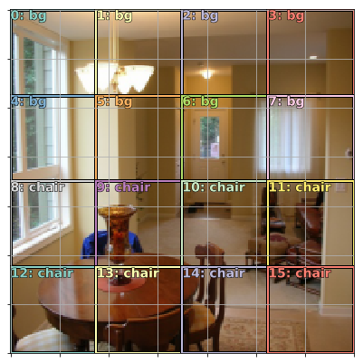

每个方形盒子，不同的纸张都称它们为不同的东西。 您将听到的三个术语是：锚箱，先前的箱子或默认箱子。 我们将坚持使用术语锚箱。

我们要为这个损失函数做些什么，我们将要经历一个匹配问题，我们将采用这16个方框中的每一个，看看这三个地面实况对象中哪一个具有最大的重叠量给定方[ [55:21](https://youtu.be/0frKXR-2PBY%3Ft%3D55m21s) ]。 要做到这一点，我们必须有一些方法来测量重叠量，这个标准函数叫做[Jaccard index](https://en.wikipedia.org/wiki/Jaccard_index) （IoU）。


我们将通过找到三个物体中的每一个与16个锚箱中的每一个的Jaccard重叠[ [57:11](https://youtu.be/0frKXR-2PBY%3Ft%3D57m11s) ]。 这将给我们一个`3x16`矩阵。

以下是我们所有锚箱的_坐标_ （中心，高度，宽度）：

```
 anchors 
```

```
 _Variable containing:_  _0.1250 0.1250 0.2500 0.2500_  _0.1250 0.3750 0.2500 0.2500_  _0.1250 0.6250 0.2500 0.2500_  _0.1250 0.8750 0.2500 0.2500_  _0.3750 0.1250 0.2500 0.2500_  _0.3750 0.3750 0.2500 0.2500_  _0.3750 0.6250 0.2500 0.2500_  _0.3750 0.8750 0.2500 0.2500_  _0.6250 0.1250 0.2500 0.2500_  _0.6250 0.3750 0.2500 0.2500_  _0.6250 0.6250 0.2500 0.2500_  _0.6250 0.8750 0.2500 0.2500_  _0.8750 0.1250 0.2500 0.2500_  _0.8750 0.3750 0.2500 0.2500_  _0.8750 0.6250 0.2500 0.2500_  _0.8750 0.8750 0.2500 0.2500_  _[torch.cuda.FloatTensor of size 16x4 (GPU 0)]_ 
```

以下是3个地面实况对象和16个锚箱之间的重叠量：

```
 overlaps = jaccard(bbox.data, anchor_cnr.data)  overlaps 
```

```
 Columns 0 to 7  0.0000 0.0000 0.0000 0.0000 0.0000 0.0000 0.0000 0.0000 0.0000 0.0000 0.0000 0.0000 0.0000 0.0000 0.0000 0.0000 0.0000 0.0000 0.0000 0.0000 0.0000 0.0000 0.0000 0.0000 
```

```
 Columns 8 to 15  0.0000 0.0091 0.0922 0.0000 0.0000 0.0315 0.3985 0.0000 0.0356 0.0549 0.0103 0.0000 0.2598 0.4538 0.0653 0.0000 0.0000 0.0000 0.0000 0.1897 0.0000 0.0000 0.0000 0.0000 [torch.cuda.FloatTensor of size 3x16 (GPU 0)] 
```

我们现在可以做的是我们可以采用维度1（行方向）的最大值，它将告诉我们每个地面实况对象，与某些网格单元重叠的最大量以及索引：

```
 overlaps.max(1) 
```

```
 _(_  _0.3985_  _0.4538_  _0.1897_  _[torch.cuda.FloatTensor of size 3 (GPU 0)],_  _14_  _13_  _11_  _[torch.cuda.LongTensor of size 3 (GPU 0)])_ 
```

我们还将查看尺寸0（列方向）上的最大值，它将告诉我们所有地面[实例](https://youtu.be/0frKXR-2PBY%3Ft%3D59m8s)对象中每个网格单元的最大重叠量[ [59:08](https://youtu.be/0frKXR-2PBY%3Ft%3D59m8s) ]：

```
 overlaps.max(0) 
```

```
 _(_  _0.0000_  _0.0000_  _0.0000_  _0.0000_  _0.0000_  _0.0000_  _0.0000_  _0.0000_  _0.0356_  _0.0549_  _0.0922_  _0.1897_  _0.2598_  _0.4538_  _0.3985_  _0.0000_  _[torch.cuda.FloatTensor of size 16 (GPU 0)],_  _0_  _0_  _0_  _0_  _0_  _0_  _0_  _0_  _1_  _1_  _0_  _2_  _1_  _1_  _0_  _0_  _[torch.cuda.LongTensor of size 16 (GPU 0)])_ 
```

这里特别有趣的是它告诉我们每个网格单元最重要的地面实况对象的索引是什么。 零在这里有点过载 - 零可能意味着重叠量为零或其最大重叠与对象索引为零。 事实证明不仅仅是问题，而是仅仅是因为。

有一个名为`map_to_ground_truth`的函数，我们现在不用担心[ [59:57](https://youtu.be/0frKXR-2PBY%3Ft%3D59m57s) ]。 它是超级简单的代码，但考虑起来有点尴尬。 基本上它的作用是它以SSD论文中描述的方式组合这两组重叠，以将每个锚盒分配给基础事实对象。 它分配的方式是三个（行方式最大）中的每一个按原样分配。 对于其余的锚箱，它们被分配给它们具有至少0.5的重叠的任何东西（逐列）。 If neither applies, it is considered to be a cell which contains background.

```
 gt_overlap,gt_idx = map_to_ground_truth(overlaps)  gt_overlap,gt_idx 
```

```
 _(_ 
 0.0000 
 0.0000 
 0.0000 
 0.0000 
 0.0000 
 0.0000 
 0.0000 
 0.0000 
 0.0356 
 0.0549 
 0.0922 
 1.9900 
 0.2598 
 1.9900 
 1.9900 
 0.0000 
 [torch.cuda.FloatTensor of size 16 (GPU 0)], 
 _0_  _0_  _0_  _0_  _0_  _0_  _0_  _0_  _1_  _1_  _0_  _2_  _1_  _1_  _0_  _0_ 
 [torch.cuda.LongTensor of size 16 (GPU 0)]) 
```

Now you can see a list of all the assignments [ [1:01:05](https://youtu.be/0frKXR-2PBY%3Ft%3D1h1m5s) ]. Anywhere that has `gt_overlap &lt; 0.5` gets assigned background. The three row-wise max anchor box has high number to force the assignments. Now we can combine these values to classes:

```
 gt_clas = clas[gt_idx]; gt_clas 
```

```
 Variable containing: 
 _8_  _8_  _8_  _8_  _8_  _8_  _8_  _8_  _10_  _10_  _8_  _17_  _10_  _10_  _8_  _8_ 
 [torch.cuda.LongTensor of size 16 (GPU 0)] 
```

Then add a threshold and finally comes up with the three classes that are being predicted:

```
 thresh = 0.5  pos = gt_overlap > thresh  pos_idx = torch.nonzero(pos)[:,0]  neg_idx = torch.nonzero(1-pos)[:,0]  pos_idx 
```

```
 _11_  _13_  _14_ 
 [torch.cuda.LongTensor of size 3 (GPU 0)] 
```

And here are what each of these anchor boxes is meant to be predicting:

```
 gt_clas[1-pos] = len(id2cat)  [id2cat[o] if o<len(id2cat) else 'bg' for o in gt_clas.data] 
```

```
 ['bg', 
 'bg', 
 'bg', 
 'bg', 
 'bg', 
 'bg', 
 'bg', 
 'bg', 
 'bg', 
 'bg', 
 'bg', 
 'sofa', 
 'bg', 
 'diningtable', 
 'chair', 
 'bg'] 
```

So that was the matching stage [ [1:02:29](https://youtu.be/0frKXR-2PBY%3Ft%3D1h2m29s) ]. For L1 loss, we can:

1.  take the activations which matched ( `pos_idx = [11, 13, 14]` )
2.  subtract from those the ground truth bounding boxes
3.  take the absolute value of the difference
4.  take the mean of that.

For classifications, we can just do a cross entropy

```
 gt_bbox = bbox[gt_idx]  loc_loss = ((a_ic[pos_idx] - gt_bbox[pos_idx]).abs()).mean()  clas_loss = F.cross_entropy(b_clasi, gt_clas)  loc_loss,clas_loss 
```

```
 (Variable containing: 
 1.00000e-02 * 
 6.5887 
 [torch.cuda.FloatTensor of size 1 (GPU 0)], Variable containing: 
 1.0331 
 [torch.cuda.FloatTensor of size 1 (GPU 0)]) 
```

We will end up with 16 predicted bounding boxes, most of them will be background. If you are wondering what it predicts in terms of bounding box of background, the answer is it totally ignores it.

```
 fig, axes = plt.subplots(3, 4, figsize=(16, 12))  for idx,ax in enumerate(axes.flat):  ima=md.val_ds.ds.denorm(to_np(x))[idx]  bbox,clas = get_y(y[0][idx], y[1][idx])  ima=md.val_ds.ds.denorm(to_np(x))[idx]  bbox,clas = get_y(bbox,clas); bbox,clas  a_ic = actn_to_bb(b_bb[idx], anchors)  torch_gt(ax, ima, a_ic, b_clas[idx].max(1)[1],  b_clas[idx].max(1)[0].sigmoid(), 0.01)  plt.tight_layout() 
```


#### Tweak 1\. How do we interpret the activations [ [1:04:16](https://youtu.be/0frKXR-2PBY%3Ft%3D1h4m16s) ]?

The way we interpret the activation is defined here:

```
 def actn_to_bb(actn, anchors):  actn_bbs = torch.tanh(actn)  actn_centers = (actn_bbs[:,:2]/2 * grid_sizes) + anchors[:,:2]  actn_hw = (actn_bbs[:,2:]/2+1) * anchors[:,2:]  return hw2corners(actn_centers, actn_hw) 
```

We grab the activations, we stick them through `tanh` (remember `tanh` is the same shape as sigmoid except it is scaled to be between -1 and 1) which forces it to be within that range. We then grab the actual position of the anchor boxes, and we will move them around according to the value of the activations divided by two ( `actn_bbs[:,:2]/2` ). In other words, each predicted bounding box can be moved by up to 50% of a grid size from where its default position is. Ditto for its height and width — it can be up to twice as big or half as big as its default size.

#### Tweak 2\. We actually use binary cross entropy loss instead of cross entropy [ [1:05:36](https://youtu.be/0frKXR-2PBY%3Ft%3D1h5m36s) ]

```
 class BCE_Loss (nn.Module):  def __init__(self, num_classes):  super().__init__()  self.num_classes = num_classes  def forward(self, pred, targ):  t = one_hot_embedding(targ, self.num_classes+1)  t = V(t[:,:-1].contiguous()) #.cpu()  x = pred[:,:-1]  w = self.get_weight(x,t)  return F.binary_cross_entropy_with_logits(x, t, w,  size_average= False )/self.num_classes  def get_weight(self,x,t): return None 
```

Binary cross entropy is what we normally use for multi-label classification. Like in the planet satellite competition, each satellite image could have multiple things. If it has multiple things in it, you cannot use softmax because softmax really encourages just one thing to have the high number. In our case, each anchor box can only have one object associated with it, so it is not for that reason that we are avoiding softmax. It is something else — which is it is possible for an anchor box to have nothing associated with it. There are two ways to handle this idea of “background”; one would be to say background is just a class, so let's use softmax and just treat background as one of the classes that the softmax could predict. A lot of people have done it this way. But that is a really hard thing to ask neural network to do [ [1:06:52](https://youtu.be/0frKXR-2PBY%3Ft%3D1h5m52s) ] — it is basically asking whether this grid cell does not have any of the 20 objects that I am interested with Jaccard overlap of more than 0.5\. It is a really hard to thing to put into a single computation. On the other hand, what if we just asked for each class; “is it a motorbike?” “is it a bus?”, “ is it a person?” etc and if all the answer is no, consider that background. That is the way we do it here. It is not that we can have multiple true labels, but we can have zero.

In `forward` :

1.  First we take the one hot embedding of the target (at this stage, we do have the idea of background)
2.  Then we remove the background column (the last one) which results in a vector either of all zeros or one one.
3.  Use binary cross-entropy predictions.

This is a minor tweak, but it is the kind of minor tweak that Jeremy wants you to think about and understand because it makes a really big difference to your training and when there is some increment over a previous paper, it would be something like this [ [1:08:25](https://youtu.be/0frKXR-2PBY%3Ft%3D1h8m25s) ]. It is important to understand what this is doing and more importantly why.

So now we have [ [1:09:39](https://youtu.be/0frKXR-2PBY%3Ft%3D1h9m39s) ]:

*   A custom loss function
*   A way to calculate Jaccard index
*   A way to convert activations to bounding box
*   A way to map anchor boxes to ground truth

Now all it's left is SSD loss function.

#### SSD Loss Function [ [1:09:55](https://youtu.be/0frKXR-2PBY%3Ft%3D1h9m55s) ]

```
 def ssd_1_loss(b_c,b_bb,bbox,clas,print_it= False ):  bbox,clas = get_y(bbox,clas)  a_ic = actn_to_bb(b_bb, anchors)  overlaps = jaccard(bbox.data, anchor_cnr.data)  gt_overlap,gt_idx = map_to_ground_truth(overlaps,print_it)  gt_clas = clas[gt_idx]  pos = gt_overlap > 0.4  pos_idx = torch.nonzero(pos)[:,0]  gt_clas[1-pos] = len(id2cat)  gt_bbox = bbox[gt_idx]  loc_loss = ((a_ic[pos_idx] - gt_bbox[pos_idx]).abs()).mean()  clas_loss = loss_f(b_c, gt_clas)  return loc_loss, clas_loss  def ssd_loss(pred,targ,print_it= False ):  lcs,lls = 0.,0\.  for b_c,b_bb,bbox,clas in zip(*pred,*targ):  loc_loss,clas_loss = ssd_1_loss(b_c,b_bb,bbox,clas,print_it)  lls += loc_loss  lcs += clas_loss  if print_it: print(f'loc: {lls.data[0]} , clas: {lcs.data[0]} ')  return lls+lcs 
```

The `ssd_loss` function which is what we set as the criteria, it loops through each image in the mini-batch and call `ssd_1_loss` function (ie SSD loss for one image).

`ssd_1_loss` is where it is all happening. It begins by de-structuring `bbox` and `clas` . Let's take a closer look at `get_y` [ [1:10:38](https://youtu.be/0frKXR-2PBY%3Ft%3D1h10m38s) ]:

```
 def get_y(bbox,clas):  bbox = bbox.view(-1,4)/sz  bb_keep = ((bbox[:,2]-bbox[:,0])>0).nonzero()[:,0]  return bbox[bb_keep],clas[bb_keep] 
```

A lot of code you find on the internet does not work with mini-batches. It only does one thing at a time which we don't want. In this case, all these functions ( `get_y` , `actn_to_bb` , `map_to_ground_truth` ) is working on, not exactly a mini-batch at a time, but a whole bunch of ground truth objects at a time. The data loader is being fed a mini-batch at a time to do the convolutional layers. Because we can have _different numbers of ground truth objects in each image_ but a tensor has to be the strict rectangular shape, fastai automatically pads it with zeros (any target values that are shorter) [ [1:11:08](https://youtu.be/0frKXR-2PBY%3Ft%3D1h11m8s) ]. This was something that was added recently and super handy, but that does mean that you then have to make sure that you get rid of those zeros. So `get_y` gets rid of any of the bounding boxes that are just padding.

1.  Get rid of the padding
2.  Turn the activations to bounding boxes
3.  Do the Jaccard
4.  Do map_to_ground_truth
5.  Check that there is an overlap greater than something around 0.4~0.5 (different papers use different values for this)
6.  Find the indices of things that matched
7.  Assign background class for the ones that did not match
8.  Then finally get L1 loss for the localization, binary cross entropy loss for the classification, and return them which gets added in `ssd_loss`

#### Training [ [1:12:47](https://youtu.be/0frKXR-2PBY%3Ft%3D1h12m47s) ]

```
 learn.crit = ssd_loss  lr = 3e-3  lrs = np.array([lr/100,lr/10,lr]) 
```

```
 learn.lr_find(lrs/1000,1.)  learn.sched.plot(1) 
```

```
 _epoch trn_loss val_loss_ 
 0 44.232681 21476.816406 
```


```
 learn.lr_find(lrs/1000,1.)  learn.sched.plot(1) 
```

```
 _epoch trn_loss val_loss_ 
 0 86.852668 32587.789062 
```


```
 learn.fit(lr, 1, cycle_len=5, use_clr=(20,10)) 
```

```
 _epoch trn_loss val_loss_ 
 0 45.570843 37.099854 
 1 37.165911 32.165031 
 2 33.27844 30.990122 
 3 31.12054 29.804482 
 4 29.305789 28.943184 
```

```
 [28.943184] 
```

```
 learn.fit(lr, 1, cycle_len=5, use_clr=(20,10)) 
```

```
 _epoch trn_loss val_loss_ 
 0 43.726979 33.803085 
 1 34.771754 29.012939 
 2 30.591864 27.132868 
 3 27.896905 26.151638 
 4 25.907382 25.739273 
```

```
 [25.739273] 
```

```
 learn.save('0') 
```

```
 learn.load('0') 
```

#### Result [ [1:13:16](https://youtu.be/0frKXR-2PBY%3Ft%3D1h13m16s) ]


In practice, we want to remove the background and also add some threshold for probabilities, but it is on the right track. The potted plant image, the result is not surprising as all of our anchor boxes were small (4x4 grid). To go from here to something that is going to be more accurate, all we are going to do is to create way more anchor boxes.

**Question** : For the multi-label classification, why aren't we multiplying the categorical loss by a constant like we did before [ [1:15:20](https://youtu.be/0frKXR-2PBY%3Ft%3D1h15m20s) ]? Great question. It is because later on it will turn out we do not need to.

#### More anchors! [ [1:14:47](https://youtu.be/0frKXR-2PBY%3Ft%3D1h14m47s) ]

There are 3 ways to do this:

1.  Create anchor boxes of different sizes (zoom):


<figcaption class="imageCaption" style="width: 301.205%; left: -201.205%;">From left (1x1, 2x2, 4x4 grids of anchor boxes). Notice that some of the anchor box is bigger than the original image.</figcaption>


2\. Create anchor boxes of different aspect ratios:

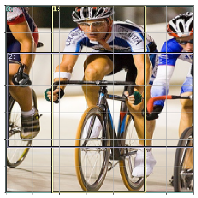

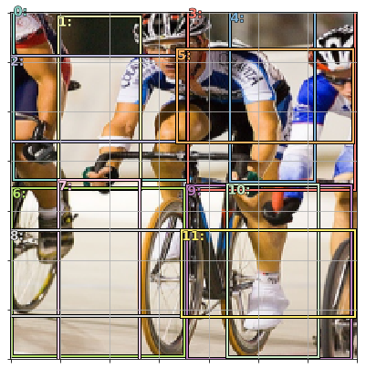


3\. Use more convolutional layers as sources of anchor boxes (the boxes are randomly jittered so that we can see ones that are overlapping [ [1:16:28](https://youtu.be/0frKXR-2PBY%3Ft%3D1h16m28s) ]):


Combining these approaches, you can create lots of anchor boxes (Jeremy said he wouldn't print it, but here it is):

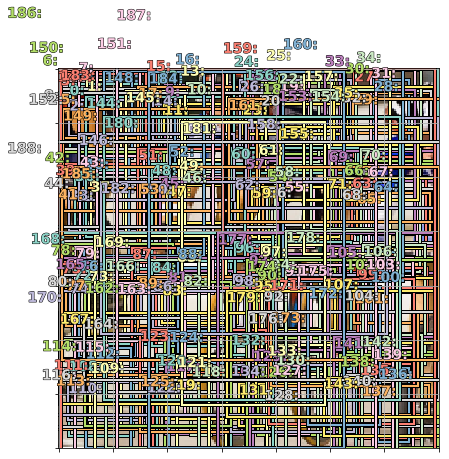

```
 anc_grids = [4, 2, 1]  anc_zooms = [0.75, 1., 1.3]  anc_ratios = [(1., 1.), (1., 0.5), (0.5, 1.)]  anchor_scales = [(anz*i,anz*j) for anz in anc_zooms  for (i,j) in anc_ratios]  k = len(anchor_scales)  anc_offsets = [1/(o*2) for o in anc_grids] 
```

```
 anc_x = np.concatenate([np.repeat(np.linspace(ao, 1-ao, ag), ag)  for ao,ag in zip(anc_offsets,anc_grids)])  anc_y = np.concatenate([np.tile(np.linspace(ao, 1-ao, ag), ag)  for ao,ag in zip(anc_offsets,anc_grids)])  anc_ctrs = np.repeat(np.stack([anc_x,anc_y], axis=1), k, axis=0) 
```

```
 anc_sizes = np.concatenate([np.array([[o/ag,p/ag]  for i in range(ag*ag) for o,p in anchor_scales])  for ag in anc_grids])  grid_sizes = V(np.concatenate([np.array([ 1/ag  for i in range(ag*ag) for o,p in anchor_scales])  for ag in anc_grids]),  requires_grad= False ).unsqueeze(1)  anchors = V(np.concatenate([anc_ctrs, anc_sizes], axis=1),  requires_grad= False ).float()  anchor_cnr = hw2corners(anchors[:,:2], anchors[:,2:]) 
```

`anchors` : middle and height, width

`anchor_cnr` : top left and bottom right corners

#### Review of key concept [ [1:18:00](https://youtu.be/0frKXR-2PBY%3Ft%3D1h18m) ]


*   We have a vector of ground truth (sets of 4 bounding box coordinates and a class)
*   We have a neural net that takes some input and spits out some output activations
*   Compare the activations and the ground truth, calculate a loss, find the derivative of that, and adjust weights according to the derivative times a learning rate.
*   We need a loss function that can take ground truth and activation and spit out a number that says how good these activations are. To do this, we need to take each one of `m` ground truth objects and decide which set of `(4+c)` activations is responsible for that object [ [1:21:58](https://youtu.be/0frKXR-2PBY%3Ft%3D1h21m58s) ] — which one we should be comparing to decide whether the class is correct and bounding box is close or not (matching problem).
*   Since we are using SSD approach, so it is not arbitrary which ones we match up [ [1:23:18](https://youtu.be/0frKXR-2PBY%3Ft%3D1h23m18s) ]. We want to match up the set of activations whose receptive field has the maximum density from where the real object is.
*   The loss function needs to be some consistent task. If in the first image, the top left object corresponds with the first 4+c activations, and in the second image, we threw things around and suddenly it's now going with the last 4+c activations, the neural net doesn't know what to learn.
*   Once matching problem is resolved, the rest is just the same as the single object detection.

Architectures:

*   YOLO — the last layer is fully connected (no concept of geometry)
*   SSD — the last layer is convolutional

#### k (zooms x ratios)[ [1:29:39](https://youtu.be/0frKXR-2PBY%3Ft%3D1h29m39s) ]

For every grid cell which can be different sizes, we can have different orientations and zooms representing different anchor boxes which are just like conceptual ideas that every one of anchor boxes is associated with one set of `4+c` activations in our model. So however many anchor boxes we have, we need to have that times `(4+c)` activations. That does not mean that each convolutional layer needs that many activations. Because 4x4 convolutional layer already has 16 sets of activations, the 2x2 layer has 4 sets of activations, and finally 1x1 has one set. So we basically get 1 + 4 + 16 for free. So we only needs to know `k` where `k` is the number of zooms by the number of aspect ratios. Where else, the grids, we will get for free through our architecture.

#### Model Architecture [ [1:31:10](https://youtu.be/0frKXR-2PBY%3Ft%3D1h31m10s) ]

```
 drop=0.4  class SSD_MultiHead (nn.Module):  def __init__(self, k, bias):  super().__init__()  self.drop = nn.Dropout(drop)  self.sconv0 = StdConv(512,256, stride=1, drop=drop)  self.sconv1 = StdConv(256,256, drop=drop)  self.sconv2 = StdConv(256,256, drop=drop)  self.sconv3 = StdConv(256,256, drop=drop)  self.out1 = OutConv(k, 256, bias)  self.out2 = OutConv(k, 256, bias)  self.out3 = OutConv(k, 256, bias)  def forward(self, x):  x = self.drop(F.relu(x))  x = self.sconv0(x)  x = self.sconv1(x)  o1c,o1l = self.out1(x)  x = self.sconv2(x)  o2c,o2l = self.out2(x)  x = self.sconv3(x)  o3c,o3l = self.out3(x)  return [torch.cat([o1c,o2c,o3c], dim=1),  torch.cat([o1l,o2l,o3l], dim=1)]  head_reg4 = SSD_MultiHead(k, -4.)  models = ConvnetBuilder(f_model, 0, 0, 0, custom_head=head_reg4)  learn = ConvLearner(md, models)  learn.opt_fn = optim.Adam 
```

The model is nearly identical to what we had before. But we have a number of stride 2 convolutions which is going to take us through to 4x4, 2x2, and 1x1 (each stride 2 convolution halves our grid size in both directions).

*   After we do our first convolution to get to 4x4, we will grab a set of outputs from that because we want to save away the 4x4 anchors.
*   Once we get to 2x2, we grab another set of now 2x2 anchors
*   Then finally we get to 1x1
*   We then concatenate them all together, which gives us the correct number of activations (one activation for every anchor box).

#### Training [ [1:32:50](https://youtu.be/0frKXR-2PBY%3Ft%3D1h32m50s) ]

```
 learn.crit = ssd_loss  lr = 1e-2  lrs = np.array([lr/100,lr/10,lr]) 
```

```
 learn.lr_find(lrs/1000,1.)  learn.sched.plot(n_skip_end=2) 
```

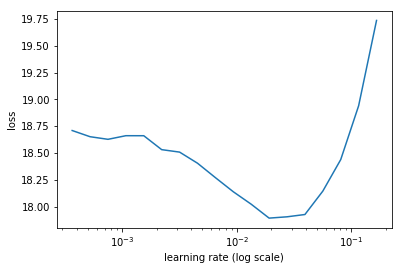

```
 learn.fit(lrs, 1, cycle_len=4, use_clr=(20,8)) 
```

```
 _epoch trn_loss val_loss_ 
 0 15.124349 15.015433 
 1 13.091956 10.39855 
 2 11.643629 9.4289 
 3 10.532467 8.822998 
```

```
 [8.822998] 
```

```
 learn.save('tmp') 
```

```
 learn.freeze_to(-2)  learn.fit(lrs/2, 1, cycle_len=4, use_clr=(20,8)) 
```

```
 _epoch trn_loss val_loss_ 
 0 9.821056 10.335152 
 1 9.419633 11.834093 
 2 8.78818 7.907762 
 3 8.219976 7.456364 
```

```
 [7.4563637] 
```

```
 x,y = next(iter(md.val_dl))  y = V(y)  batch = learn.model(V(x))  b_clas,b_bb = batch  x = to_np(x)  fig, axes = plt.subplots(3, 4, figsize=(16, 12))  for idx,ax in enumerate(axes.flat):  ima=md.val_ds.ds.denorm(x)[idx]  bbox,clas = get_y(y[0][idx], y[1][idx])  a_ic = actn_to_bb(b_bb[idx], anchors)  torch_gt(ax, ima, a_ic, b_clas[idx].max(1)[1],  b_clas[idx].max(1)[0].sigmoid(), 0.2 )  plt.tight_layout() 
```

Here, we printed out those detections with at least probability of `0.2` . Some of them look pretty hopeful but others not so much.


### History of object detection [ [1:33:43](https://youtu.be/0frKXR-2PBY%3Ft%3D1h33m43s) ]


[Scalable Object Detection using Deep Neural Networks](https://arxiv.org/abs/1312.2249)

*   When people refer to the multi-box method, they are talking about this paper.
*   This was the paper that came up with the idea that we can have a loss function that has this matching process and then you can use that to do object detection. So everything since that time has been trying to figure out how to make this better.

[Faster R-CNN: Towards Real-Time Object Detection with Region Proposal Networks](https://arxiv.org/abs/1506.01497)

*   In parallel, Ross Girshick was going down a totally different direction. He had these two-stage process where the first stage used the classical computer vision approaches to find edges and changes of gradients to guess which parts of the image may represent distinct objects. Then fit each of those into a convolutional neural network which was basically designed to figure out if that is the kind of object we are interested in.
*   R-CNN and Fast R-CNN are hybrid of traditional computer vision and deep learning.
*   What Ross and his team then did was they took the multibox idea and replaced the traditional non-deep learning computer vision part of their two stage process with the conv net. So now they have two conv nets: one for region proposals (all of the things that might be objects) and the second part was the same as his earlier work.

[You Only Look Once: Unified, Real-Time Object Detection](https://arxiv.org/abs/1506.02640)

[SSD: Single Shot MultiBox Detector](https://arxiv.org/abs/1512.02325)

*   At similar time these paper came out. Both of these did something pretty cool which is they achieved similar performance as the Faster R-CNN but with 1 stage.
*   They took the multibox idea and they tried to figure out how to deal with messy outputs. The basic ideas were to use, for example, hard negative mining where they would go through and find all of the matches that did not look that good and throw them away, use very tricky and complex data augmentation methods, and all kind of hackery. But they got them to work pretty well.

[Focal Loss for Dense Object Detection](https://arxiv.org/abs/1708.02002) (RetinaNet)

*   Then something really cool happened late last year which is this thing called focal loss.
*   They actually realized why this messy thing wasn't working. When we look at an image, there are 3 different granularities of convolutional grid (4x4, 2x2, 1x1) [ [1:37:28](https://youtu.be/0frKXR-2PBY%3Ft%3D1h37m28s) ]. The 1x1 is quite likely to have a reasonable overlap with some object because most photos have some kind of main subject. On the other hand, in the 4x4 grid cells, the most of 16 anchor boxes are not going to have a much of an overlap with anything. So if somebody was to say to you “$20 bet, what do you reckon this little clip is?” and you are not sure, you will say “background” because most of the time, it is the background.

**Question** : I understand why we have a 4x4 grid of receptive fields with 1 anchor box each to coarsely localize objects in the image. But what I think I'm missing is why we need multiple receptive fields at different sizes. The first version already included 16 receptive fields, each with a single anchor box associated. With the additions, there are now many more anchor boxes to consider. Is this because you constrained how much a receptive field could move or scale from its original size? Or is there another reason? [ [1:38:47](https://youtu.be/0frKXR-2PBY%3Ft%3D1h38m47s) ] It is kind of backwards. The reason Jeremy did the constraining was because he knew he was going to be adding more boxes later. But really, the reason is that the Jaccard overlap between one of those 4x4 grid cells and a picture where a single object that takes up most of the image is never going to be 0.5\. The intersection is much smaller than the union because the object is too big. So for this general idea to work where we are saying you are responsible for something that you have better than 50% overlap with, we need anchor boxes which will on a regular basis have a 50% or higher overlap which means we need to have a variety of sizes, shapes, and scales. This all happens in the loss function. The vast majority of the interesting stuff in all of the object detection is the loss function.

#### Focal Loss [ [1:40:38](https://youtu.be/0frKXR-2PBY%3Ft%3D1h40m38s) ]


The key thing is this very first picture. The blue line is the binary cross entropy loss. If the answer is not a motorbike [ [1:41:46](https://youtu.be/0frKXR-2PBY%3Ft%3D1h41m46s) ], and I said “I think it's not a motorbike and I am 60% sure” with the blue line, the loss is still about 0.5 which is pretty bad. So if we want to get our loss down, then for all these things which are actually back ground, we have to be saying “I am sure that is background”, “I am sure it's not a motorbike, or a bus, or a person” — because if I don't say we are sure it is not any of these things, then we still get loss.

That is why the motorbike example did not work [ [1:42:39](https://youtu.be/0frKXR-2PBY%3Ft%3D1h42m39s) ]. Because even when it gets to lower right corner and it wants to say “I think it's a motorbike”, there is no payoff for it to say so. If it is wrong, it gets killed. And the vast majority of the time, it is background. Even if it is not background, it is not enough just to say “it's not background” — you have to say which of the 20 things it is.

So the trick is to trying to find a different loss function [ [1:44:00](https://youtu.be/0frKXR-2PBY%3Ft%3D1h44m) ] that looks more like the purple line. Focal loss is literally just a scaled cross entropy loss. Now if we say “I'm .6 sure it's not a motorbike” then the loss function will say “good for you! no worries” [ [1:44:42](https://youtu.be/0frKXR-2PBY%3Ft%3D1h44m42s) ].

The actual contribution of this paper is to add `(1 − pt)^γ` to the start of the equation [ [1:45:06](https://youtu.be/0frKXR-2PBY%3Ft%3D1h45m6s) ] which sounds like nothing but actually people have been trying to figure out this problem for years. When you come across a paper like this which is game-changing, you shouldn't assume you are going to have to write thousands of lines of code. Very often it is one line of code, or the change of a single constant, or adding log to a single place.

A couple of terrific things about this paper [ [1:46:08](https://youtu.be/0frKXR-2PBY%3Ft%3D1h46m8s) ]:

*   Equations are written in a simple manner
*   They “refactor”

#### Implementing Focal Loss [ [1:49:27](https://youtu.be/0frKXR-2PBY%3Ft%3D1h49m27s) ]:


Remember, -log(pt) is the cross entropy loss and focal loss is just a scaled version. When we defined the binomial cross entropy loss, you may have noticed that there was a weight which by default was none:

```
 class BCE_Loss (nn.Module):  def __init__(self, num_classes):  super().__init__()  self.num_classes = num_classes  def forward(self, pred, targ):  t = one_hot_embedding(targ, self.num_classes+1)  t = V(t[:,:-1].contiguous()) #.cpu()  x = pred[:,:-1]  w = self.get_weight(x,t)  return F.binary_cross_entropy_with_logits(x, t, w,  size_average= False )/self.num_classes  def get_weight(self,x,t): return None 
```

When you call `F.binary_cross_entropy_with_logits` , you can pass in the weight. Since we just wanted to multiply a cross entropy by something, we can just define `get_weight` . Here is the entirety of focal loss [ [1:50:23](https://youtu.be/0frKXR-2PBY%3Ft%3D1h50m23s) ]:

```
 class FocalLoss (BCE_Loss):  def get_weight(self,x,t):  alpha,gamma = 0.25,2\.  p = x.sigmoid()  pt = p*t + (1-p)*(1-t)  w = alpha*t + (1-alpha)*(1-t)  return w * (1-pt).pow(gamma) 
```

If you were wondering why alpha and gamma are 0.25 and 2, here is another excellent thing about this paper, because they tried lots of different values and found that these work well:

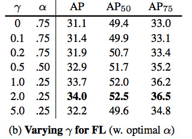

#### Training [ [1:51:25](https://youtu.be/0frKXR-2PBY%3Ft%3D1h51m25s) ]

```
 learn.lr_find(lrs/1000,1.)  learn.sched.plot(n_skip_end=2) 
```

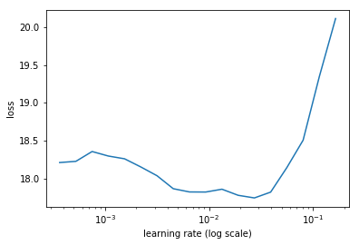

```
 learn.fit(lrs, 1, cycle_len=10, use_clr=(20,10)) 
```

```
 _epoch trn_loss val_loss_ 
 0 24.263046 28.975235 
 1 20.459562 16.362392 
 2 17.880827 14.884829 
 3 15.956896 13.676485 
 4 14.521345 13.134197 
 5 13.460941 12.594139 
 6 12.651842 12.069849 
 7 11.944972 11.956457 
 8 11.385798 11.561226 
 9 10.988802 11.362164 
```

```
 [11.362164] 
```

```
 learn.save('fl0')  learn.load('fl0') 
```

```
 learn.freeze_to(-2)  learn.fit(lrs/4, 1, cycle_len=10, use_clr=(20,10)) 
```

```
 _epoch trn_loss val_loss_ 
 0 10.871668 11.615532 
 1 10.908461 11.604334 
 2 10.549796 11.486127 
 3 10.130961 11.088478 
 4 9.70691 10.72144 
 5 9.319202 10.600481 
 6 8.916653 10.358334 
 7 8.579452 10.624706 
 8 8.274838 10.163422 
 9 7.994316 10.108068 
```

```
 [10.108068] 
```

```
 learn.save('drop4')  learn.load('drop4') 
```

```
 plot_results(0.75) 
```

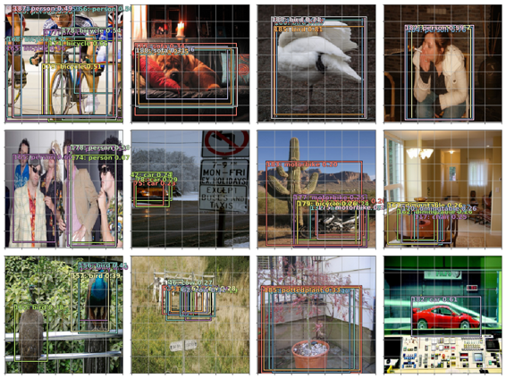

This time things are looking quite a bit better. So our last step, for now, is to basically figure out how to pull out just the interesting ones.

#### Non Maximum Suppression [ [1:52:15](https://youtu.be/0frKXR-2PBY%3Ft%3D1h52m15s) ]

All we are going to do is we are going to go through every pair of these bounding boxes and if they overlap by more than some amount, say 0.5, using Jaccard and they are both predicting the same class, we are going to assume they are the same thing and we are going to pick the one with higher `p` value.

It is really boring code, Jeremy didn't write it himself and copied somebody else's. No reason particularly to go through it.

```
 def nms(boxes, scores, overlap=0.5, top_k=100):  keep = scores.new(scores.size(0)).zero_().long()  if boxes.numel() == 0: return keep  x1 = boxes[:, 0]  y1 = boxes[:, 1]  x2 = boxes[:, 2]  y2 = boxes[:, 3]  area = torch.mul(x2 - x1, y2 - y1)  v, idx = scores.sort(0) # sort in ascending order  idx = idx[-top_k:] # indices of the top-k largest vals  xx1 = boxes.new()  yy1 = boxes.new()  xx2 = boxes.new()  yy2 = boxes.new()  w = boxes.new()  h = boxes.new()  count = 0  while idx.numel() > 0:  i = idx[-1] # index of current largest val  keep[count] = i  count += 1  if idx.size(0) == 1: break  idx = idx[:-1] # remove kept element from view  # load bboxes of next highest vals  torch.index_select(x1, 0, idx, out=xx1)  torch.index_select(y1, 0, idx, out=yy1)  torch.index_select(x2, 0, idx, out=xx2)  torch.index_select(y2, 0, idx, out=yy2)  # store element-wise max with next highest score  xx1 = torch.clamp(xx1, min=x1[i])  yy1 = torch.clamp(yy1, min=y1[i])  xx2 = torch.clamp(xx2, max=x2[i])  yy2 = torch.clamp(yy2, max=y2[i])  w.resize_as_(xx2)  h.resize_as_(yy2)  w = xx2 - xx1  h = yy2 - yy1  # check sizes of xx1 and xx2.. after each iteration  w = torch.clamp(w, min=0.0)  h = torch.clamp(h, min=0.0)  inter = w*h  # IoU = i / (area(a) + area(b) - i)  rem_areas = torch.index_select(area, 0, idx)  # load remaining areas)  union = (rem_areas - inter) + area[i]  IoU = inter/union # store result in iou  # keep only elements with an IoU <= overlap  idx = idx[IoU.le(overlap)]  return keep, count 
```

```
 def show_nmf(idx):  ima=md.val_ds.ds.denorm(x)[idx]  bbox,clas = get_y(y[0][idx], y[1][idx])  a_ic = actn_to_bb(b_bb[idx], anchors)  clas_pr, clas_ids = b_clas[idx].max(1)  clas_pr = clas_pr.sigmoid()  conf_scores = b_clas[idx].sigmoid().t().data  out1,out2,cc = [],[],[]  for cl in range(0, len(conf_scores)-1):  c_mask = conf_scores[cl] > 0.25  if c_mask.sum() == 0: continue  scores = conf_scores[cl][c_mask]  l_mask = c_mask.unsqueeze(1).expand_as(a_ic)  boxes = a_ic[l_mask].view(-1, 4)  ids, count = nms(boxes.data, scores, 0.4, 50)  ids = ids[:count]  out1.append(scores[ids])  out2.append(boxes.data[ids])  cc.append([cl]*count)  cc = T(np.concatenate(cc))  out1 = torch.cat(out1)  out2 = torch.cat(out2)  fig, ax = plt.subplots(figsize=(8,8))  torch_gt(ax, ima, out2, cc, out1, 0.1) 
```

```
 for i in range(12): show_nmf(i) 
```


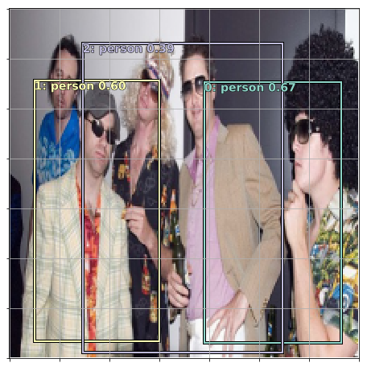

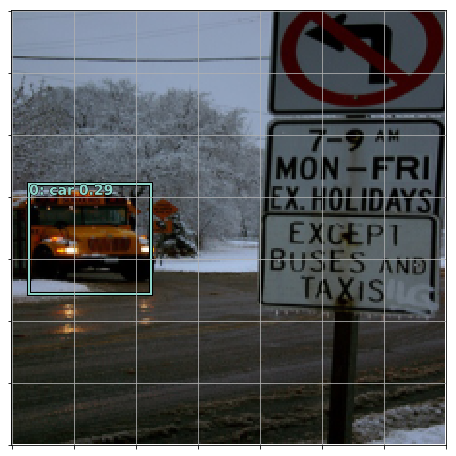


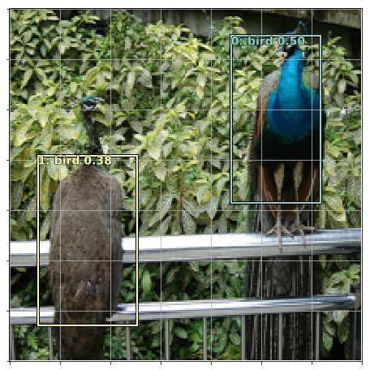


There are some things still to fix here [ [1:53:43](https://youtu.be/0frKXR-2PBY%3Ft%3D1h53m43s) ]. The trick will be to use something called feature pyramid. That is what we are going to do in lesson 14\.

#### Talking a little more about SSD paper [ [1:54:03](https://youtu.be/0frKXR-2PBY%3Ft%3D1h54m3s) ]

When this paper came out, Jeremy was excited because this and YOLO were the first kind of single-pass good quality object detection method that come along. There has been this continuous repetition of history in the deep learning world which is things that involve multiple passes of multiple different pieces, over time, particularly where they involve some non-deep learning pieces (like R-CNN did), over time, they always get turned into a single end-to-end deep learning model. So I tend to ignore them until that happens because that's the point where people have figured out how to show this as a deep learning model, as soon as they do that they generally end up something much faster and much more accurate. So SSD and YOLO were really important.

The model is 4 paragraphs. Papers are really concise which means you need to read them pretty carefully. Partly, though, you need to know which bits to read carefully. The bits where they say “here we are going to prove the error bounds on this model,” you could ignore that because you don't care about proving error bounds. But the bit which says here is what the model is, you need to read real carefully.

Jeremy reads a section **2.1 Model** [ [1:56:37](https://youtu.be/0frKXR-2PBY%3Ft%3D1h56m37s) ]

If you jump straight in and read a paper like this, these 4 paragraphs would probably make no sense. But now that we've gone through it, you read those and hopefully thinking “oh that's just what Jeremy said, only they sad it better than Jeremy and less words [ [2:00:37](https://youtu.be/0frKXR-2PBY%3Ft%3D2h37s) ]. If you start to read a paper and go “what the heck”, the trick is to then start reading back over the citations.

Jeremy reads **Matching strategy** and **Training objective** (aka Loss function)[ [2:01:44](https://youtu.be/0frKXR-2PBY%3Ft%3D2h1m44s) ]

#### Some paper tips [ [2:02:34](https://youtu.be/0frKXR-2PBY%3Ft%3D2h2m34s) ]

[Scalable Object Detection using Deep Neural Networks](https://arxiv.org/pdf/1312.2249.pdf)

*   “Training objective” is loss function
*   Double bars and two 2's like this means Mean Squared Error


*   log(c) and log(1-c), and x and (1-x) they are all the pieces for binary cross entropy:


This week, go through the code and go through the paper and see what is going on. Remember what Jeremy did to make it easier for you was he took that loss function, he copied it into a cell and split it up so that each bit was in a separate cell. Then after every sell, he printed or plotted that value. Hopefully this is a good starting point.
